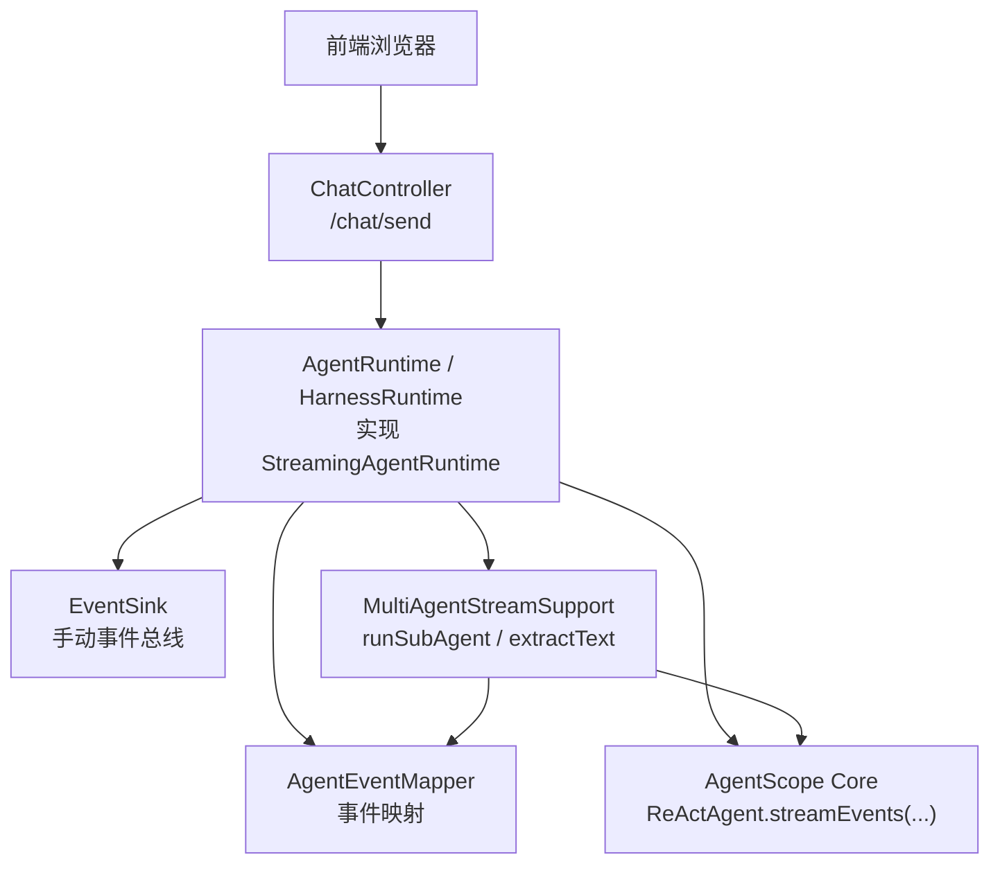
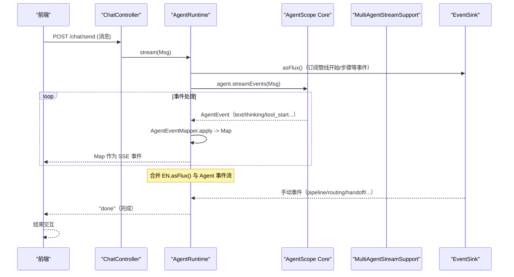
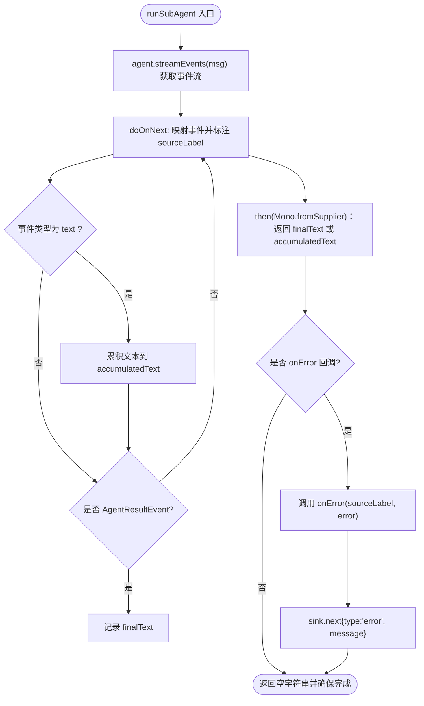
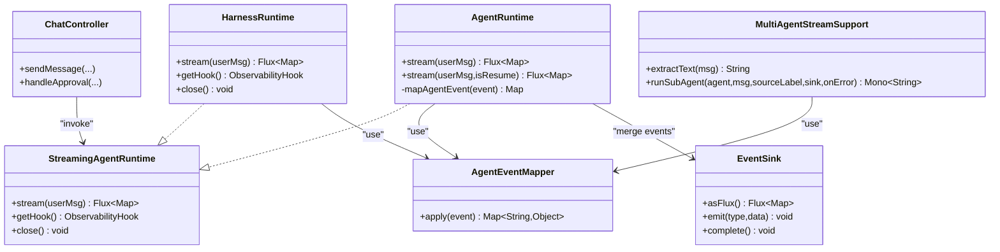

# 流式执行支持

<cite>
**本文引用的文件 **
- [StreamingAgentRuntime.java](file://src/main/java/com/skloda/agentscope/runtime/StreamingAgentRuntime.java)
- [MultiAgentStreamSupport.java](file://src/main/java/com/skloda/agentscope/runtime/MultiAgentStreamSupport.java)
- [EventSink.java](file://src/main/java/com/skloda/agentscope/runtime/EventSink.java)
- [AgentEventMapper.java](file://src/main/java/com/skloda/agentscope/runtime/AgentEventMapper.java)
- [AgentRuntime.java](file://src/main/java/com/skloda/agentscope/runtime/AgentRuntime.java)
- [HarnessRuntime.java](file://src/main/java/com/skloda/agentscope/harness/HarnessRuntime.java)
- [ChatController.java](file://src/main/java/com/skloda/agentscope/controller/ChatController.java)
- [ChatEvent.java](file://src/main/java/com/skloda/agentscope/model/ChatEvent.java)
- [MultiAgentStreamSupportTest.java](file://src/test/java/com/skloda/agentscope/runtime/MultiAgentStreamSupportTest.java)
</cite>

## 目录
1. [简介](#简介)
2. [项目结构](#项目结构)
3. [核心组件](#核心组件)
4. [架构总览](#架构总览)
5. [详细组件分析](#详细组件分析)
6. [依赖分析](#依赖分析)
7. [性能考虑](#性能考虑)
8. [故障排查指南](#故障排查指南)
9. [结论](#结论)
10. [附录：自定义流式运行时的实践指南](#附录自定义流式运行时的实践指南)

## 简介
本文件聚焦于“流式执行支持”能力，围绕统一接口 StreamingAgentRuntime、多代理流式桥接 MultiAgentStreamSupport、以及事件映射与传递机制，系统阐述其设计理念、数据流与扩展方式。重点包括：
- StreamingAgentRuntime 的统一契约与 AutoCloseable 资源管理
- MultiAgentStreamSupport 的文本提取、子代理流式执行桥接、事件转发、最终结果解析
- runSubAgent 如何在 Agent.streamEvents() 与编排逻辑之间建立连接，保证“实时事件 + 最终文本”两不冲突
- sourceLabel 机制：如何让前端精确识别每个事件的来源（代理/阶段）
- 自定义流式运行时的开发模式与实践

## 项目结构
从控制器到运行时再到模型层的典型调用链如下：
- ChatController 暴露 /chat/send SSE 端点，消费上游服务返回的 Flux<ServerSentEvent<String>>
- AgentRuntime / HarnessRuntime 实现 StreamingAgentRuntime，将底层 Agent 的原生事件流转换为通用 Map 事件
- AgentEventMapper 将 Agent 的事件类型映射为统一的 SSE payload；AgentRuntime 合并 EventSink 的手动事件流
- MultiAgentStreamSupport 为编排器（并行/顺序/循环/消息中心等）提供统一的 sub-agent 流式桥接

图示来源
- [ChatController.java:122-152](file://src/main/java/com/skloda/agentscope/controller/ChatController.java#L122-L152)
- [AgentRuntime.java:67-142](file://src/main/java/com/skloda/agentscope/runtime/AgentRuntime.java#L67-L142)
- [HarnessRuntime.java:49-63](file://src/main/java/com/skloda/agentscope/harness/HarnessRuntime.java#L49-L63)
- [AgentEventMapper.java:64-105](file://src/main/java/com/skloda/agentscope/runtime/AgentEventMapper.java#L64-L105)
- [MultiAgentStreamSupport.java:74-118](file://src/main/java/com/skloda/agentscope/runtime/MultiAgentStreamSupport.java#L74-L118)

章节来源
- [ChatController.java:122-152](file://src/main/java/com/skloda/agentscope/controller/ChatController.java#L122-L152)
- [AgentRuntime.java:67-142](file://src/main/java/com/skloda/agentscope/runtime/AgentRuntime.java#L67-L142)
- [HarnessRuntime.java:49-63](file://src/main/java/com/skloda/agentscope/harness/HarnessRuntime.java#L49-L63)

## 核心组件
- StreamingAgentRuntime：统一的流式运行期接口，声明 stream(Msg)、getHook()、close()，所有具体运行时均实现该接口并支持 AutoCloseable 释放资源
- AgentEventMapper：纯函数式地将 Agent 原生事件转换为通用的 SSE payload（包含 text/thinking/tool_start/end/delta 等），屏蔽下游 UI 的类型差异
- EventSink：轻量级事件总线，用于在任意编排节点手工发射 pipeline/routing/handoff/loop/graph 等多类事件
- MultiAgentStreamSupport：共享工具集，提供 extractText 与 runSubAgent 方法，桥接“流事件前推 + 最终文本聚合”，并提供 sourceLabel 标记
- AgentRuntime / HarnessRuntime：两种运行时，分别封装单 Agent 与 HarnessAgent 的流式流程；前者合并 EventSink 与 Agent 事件，后者复用相同的映射管道
- ChatController：SSE 控制器，接收请求，调用服务层得到 Flux，并以 ServerSentEvent 流式推送给前端；处理 done/error/pending_approval

章节来源
- [StreamingAgentRuntime.java:9-20](file://src/main/java/com/skloda/agentscope/runtime/StreamingAgentRuntime.java#L9-L20)
- [AgentEventMapper.java:39-105](file://src/main/java/com/skloda/agentscope/runtime/AgentEventMapper.java#L39-L105)
- [EventSink.java:11-59](file://src/main/java/com/skloda/agentscope/runtime/EventSink.java#L11-L59)
- [MultiAgentStreamSupport.java:17-118](file://src/main/java/com/skloda/agentscope/runtime/MultiAgentStreamSupport.java#L17-L118)
- [AgentRuntime.java:26-142](file://src/main/java/com/skloda/agentscope/runtime/AgentRuntime.java#L26-L142)
- [HarnessRuntime.java:15-73](file://src/main/java/com/skloda/agentscope/harness/HarnessRuntime.java#L15-L73)
- [ChatController.java:44-152](file://src/main/java/com/skloda/agentscope/controller/ChatController.java#L44-L152)

## 架构总览
下面序列图展示了用户发消息到返回完成的完整流式链路，同时体现手动事件（EventSink）与自动事件（Agent 生命周期）的合并。

图示来源
- [ChatController.java:122-152](file://src/main/java/com/skloda/agentscope/controller/ChatController.java#L122-L152)
- [AgentRuntime.java:94-128](file://src/main/java/com/skloda/agentscope/runtime/AgentRuntime.java#L94-L128)
- [AgentEventMapper.java:64-105](file://src/main/java/com/skloda/agentscope/runtime/AgentEventMapper.java#L64-L105)
- [EventSink.java:19-29](file://src/main/java/com/skloda/agentscope/runtime/EventSink.java#L19-L29)

## 详细组件分析

### StreamingAgentRuntime：统一契约与 AutoCloseable 支持
- 设计目标：为所有运行期（单 Agent、Harness、编排器）提供一个统一的流式入口和关闭行为
- 关键成员：
  - stream(Msg): 返回 Flux<Map<String,Object>>，供前端消费 SSE
  - getHook(): 返回 ObservabilityHook（含 EventSink），使上层可合并自定义事件
  - close(): 定义资源清理回调（如取消订阅、释放状态）

章节来源
- [StreamingAgentRuntime.java:9-20](file://src/main/java/com/skloda/agentscope/runtime/StreamingAgentRuntime.java#L9-L20)

### MultiAgentStreamSupport：多代理流式桥接的核心
核心职责：
- 文本提取：从 Msg 的 ContentBlock 列表中提取并拼接文本
- 子代理桥接：runSubAgent 通过 ReActAgent.streamEvents 获取生命周期事件，按源标签 sourceLabel 投递到外层 FluxSink，并聚合最终文本供后续编排步骤使用
- 错误处理：onError 回调与错误事件下沉，保证后续步骤仍继续执行且流正常结束

图示来源
- [MultiAgentStreamSupport.java:74-118](file://src/main/java/com/skloda/agentscope/runtime/MultiAgentStreamSupport.java#L74-L118)

章节来源
- [MultiAgentStreamSupport.java:43-118](file://src/main/java/com/skloda/agentscope/runtime/MultiAgentStreamSupport.java#L43-L118)

#### 文本提取算法
- 遍历 msg.getContent()，仅拼接 TextBlock 的文本内容，忽略其他块类型
- 时间复杂度：O(n)，n 为 content blocks 数量

章节来源
- [MultiAgentStreamSupport.java:43-57](file://src/main/java/com/skloda/agentscope/runtime/MultiAgentStreamSupport.java#L43-L57)

#### 最终结果解析优先级
- 优先采用 AGENT_RESULT 中的 Msg 文本
- 回退策略：若无AGENT_RESULT，则采用累计的 text deltas
- 测试覆盖：优先最终结果 vs 累计文本、无结果时累计文本、错误路径

章节来源
- [MultiAgentStreamSupport.java:78-118](file://src/main/java/com/skloda/agentscope/runtime/MultiAgentStreamSupport.java#L78-L118)
- [MultiAgentStreamSupportTest.java:49-109](file://src/test/java/com/skloda/agentscope/runtime/MultiAgentStreamSupportTest.java#L49-L109)

### 源标签（sourceLabel）机制
- 目的：在统一事件流中为每条事件附加来源标识，便于前端区分不同子代理或步骤的输出
- 实现位置：runSubAgent 对每个 mapped 事件追加 key="source" 的值
- 影响范围：任何基于 MultiAgentStreamSupport.runSubAgent 的子任务输出均可被前端准确归属

章节来源
- [MultiAgentStreamSupport.java:82-96](file://src/main/java/com/skloda/agentscope/runtime/MultiAgentStreamSupport.java#L82-L96)

### EventSink：统一的手动事件总线
- 作用：集中管理 pipeline、routing、handoff、loop、graph、task 等多类人工触发的中间事件
- 能力：typed emit 方法、complete、asFlux 以供合并到主事件流
- 典型用法：编排器在启动/步骤切换/结束处插入语义化事件，辅助前端构建可视化面板

章节来源
- [EventSink.java:15-151](file://src/main/java/com/skloda/agentscope/runtime/EventSink.java#L15-L151)

### AgentRuntime：单次 Agent 的流式执行与事件合并
- 合并策略：merge(EventSink.asFlux(), agentEvents) 并将 sink 在完成时关闭，避免“悬挂流”导致前端无法收到 done
- 审批恢复：approval resume 路径同样基于 streamEvents，保持前后一致的 SSE 事件形态
- 完成事件：在结束阶段追加 "done" 或 "pending_approval"

章节来源
- [AgentRuntime.java:67-142](file://src/main/java/com/skloda/agentscope/runtime/AgentRuntime.java#L67-L142)
- [AgentRuntime.java:144-183](file://src/main/java/com/skloda/agentscope/runtime/AgentRuntime.java#L144-L183)

### HarnessRuntime：HarnessAgent 的流式执行
- 复用 AgentEventMapper 将 HarnessAgent 的事件映射为统一 SSE payload
- 简化实现：直接使用 agent.streamEvents(userMsg, runtimeContext)，结尾补一个 "done"

章节来源
- [HarnessRuntime.java:15-73](file://src/main/java/com/skloda/agentscope/harness/HarnessRuntime.java#L15-L73)

### AgentEventMapper：30+ 事件类型的统一转换
- 负责把 Agent 原生事件转化为前端可直接渲染的 Map 对象
- 覆盖 text/thinking、tool start/delta/end/result、model call、hint/subagent 等
- 丢弃不需要的事件（例如 block boundaries），以减轻前端负担

章节来源
- [AgentEventMapper.java:39-105](file://src/main/java/com/skloda/agentscope/runtime/AgentEventMapper.java#L39-L105)

### ChatController：SSE 入口与错误兜底
- 将服务层返回的 Flux<ServerSentEvent<String>> 直接暴露为 SSE 响应
- 错误处理：捕获异常后发送 error + done，保证前端进入可用状态
- 会话与审批：支持会话上下文与 HITL 审批后的恢复流

章节来源
- [ChatController.java:77-152](file://src/main/java/com/skloda/agentscope/controller/ChatController.java#L77-L152)
- [ChatController.java:155-186](file://src/main/java/com/skloda/agentscope/controller/ChatController.java#L155-L186)

### ChatEvent：统一的事件类型常量
- 用于表示 "done"/"error" 等通用信号事件，便于控制流收尾

章节来源
- [ChatEvent.java:1-39](file://src/main/java/com/skloda/agentscope/model/ChatEvent.java#L1-L39)

## 依赖分析
- AgentRuntime 依赖：
  - AgentEventMapper：事件到 SSE 映射
  - EventSink：合成多层级手工事件流
  - ApprovalMiddleware/Service：审批恢复逻辑
- HarnessRuntime 依赖：
  - AgentEventMapper：与 AgentRuntime 一致的事件映射
  - HarnessAgent.runtimeContext：运行时上下文
- MultiAgentStreamSupport 依赖：
  - AgentEventMapper：将子代理的 AgentEvent 转为 Map 再注入 sourceLabel
  - ReActAgent.streamEvents：拉取子代理真实事件流
- ChatController 依赖：
  - AgentService/ApprovalService：创建流与审批恢复
  - ObjectMapper：JSON 序列化事件到 SSE

图示来源
- [StreamingAgentRuntime.java:9-20](file://src/main/java/com/skloda/agentscope/runtime/StreamingAgentRuntime.java#L9-L20)
- [AgentRuntime.java:26-142](file://src/main/java/com/skloda/agentscope/runtime/AgentRuntime.java#L26-L142)
- [HarnessRuntime.java:15-73](file://src/main/java/com/skloda/agentscope/harness/HarnessRuntime.java#L15-L73)
- [MultiAgentStreamSupport.java:17-118](file://src/main/java/com/skloda/agentscope/runtime/MultiAgentStreamSupport.java#L17-L118)
- [AgentEventMapper.java:39-105](file://src/main/java/com/skloda/agentscope/runtime/AgentEventMapper.java#L39-L105)
- [EventSink.java:15-151](file://src/main/java/com/skloda/agentscope/runtime/EventSink.java#L15-L151)
- [ChatController.java:44-152](file://src/main/java/com/skloda/agentscope/controller/ChatController.java#L44-L152)

章节来源
- [AgentRuntime.java:26-142](file://src/main/java/com/skloda/agentscope/runtime/AgentRuntime.java#L26-L142)
- [HarnessRuntime.java:15-73](file://src/main/java/com/skloda/agentscope/harness/HarnessRuntime.java#L15-L73)
- [MultiAgentStreamSupport.java:17-118](file://src/main/java/com/skloda/agentscope/runtime/MultiAgentStreamSupport.java#L17-L118)
- [AgentEventMapper.java:39-105](file://src/main/java/com/skloda/agentscope/runtime/AgentEventMapper.java#L39-L105)
- [EventSink.java:15-151](file://src/main/java/com/skloda/agentscope/runtime/EventSink.java#L15-L151)
- [ChatController.java:44-152](file://src/main/java/com/skloda/agentscope/controller/ChatController.java#L44-L152)

## 性能考虑
- 流式聚合的背压策略：EventSink 使用 Sinks.many().multicast().onBackpressureBuffer()，可在消费端慢速时缓冲事件；但需注意内存上限，结合后端反压调节或限流
- doFinally 提前关闭 EventSink：避免 merge 死锁导致的流“挂起”问题，确保 done 事件一定下发，降低前端长时间处于加载状态的风险
- 事件映射过滤：AgentEventMapper 丢弃无关事件（如 block boundaries），减少网络与前端渲染开销
- runSubAgent 的双重聚合：prefer AGENT_RESULT 后立即确定最终文本，仅在回退时才累积 deltas，避免多余字符串拼接
- SSE 序列化成本：在控制器层对 payload 做 JSON 序列化，应确保事件体精简，避免重复字段

[本节为一般性指导，未直接分析具体文件]

## 故障排查指南
常见问题及定位思路：
- 前端一直显示“加载中”
  - 检查 AgentRuntime 是否在 agent 完成后调用 EventSink.complete，保证合并流能结束（已完成优化）
  - 确认 ChatController.takeUntil(this::isDoneEvent) 是否生效，done 事件是否正确发送
- 事件缺失或错乱
  - 确认 AgentEventMapper 对 event type 的分支是否命中
  - 若使用了 MultiAgentStreamSupport.runSubAgent，检查 sourceLabel 是否与预期一致，便于前端分治展示
- 最终结果为空
  - 当子代理未发出 AGENT_RESULT 时，会回退为 accumulatedText；如无 text delta 也将会为空
  - 查看 onError 回调是否触发，确认错误信息并修正上游 agent 行为
- 审批恢复后事件不连贯
  - 使用 createApprovalResumeStream 再次走 streamEvents，确保恢复流程事件与初次一致

章节来源
- [AgentRuntime.java:112-142](file://src/main/java/com/skloda/agentscope/runtime/AgentRuntime.java#L112-L142)
- [ChatController.java:188-189](file://src/main/java/com/skloda/agentscope/controller/ChatController.java#L188-L189)
- [MultiAgentStreamSupport.java:78-118](file://src/main/java/com/skloda/agentscope/runtime/MultiAgentStreamSupport.java#L78-L118)
- [MultiAgentStreamSupportTest.java:94-109](file://src/test/java/com/skloda/agentscope/runtime/MultiAgentStreamSupportTest.java#L94-L109)

## 结论
- StreamingAgentRuntime 提供了统一的流式契约与资源管理能力，解耦具体运行时
- MultiAgentStreamSupport 的 runSubAgent 是实现“实时流 + 最终结果”双通道的关键，配合 sourceLabel 机制，让前端既能看到过程，也能拿到可用于下一步编排的最终文本
- AgentRuntime 与 HarnessRuntime 共用同一套事件映射逻辑，保证一致的 SSE 体验
- EventSink 让编排器能够在合适时机插入业务事件，丰富前端可视化与信息呈现
- 面向未来的扩展：通过实现 StreamingAgentRuntime 即可接入新的运行期，遵循相同的流式契约与事件约定

[本节为总结，未直接分析具体文件]

## 附录：自定义流式运行时的实践指南
目标：创建一个符合 StreamingAgentRuntime 的新运行时，既能转发子 Agent 的实时事件，又能汇总最终结果供后续步骤使用。

建议步骤：
- 实现 StreamingAgentRuntime
  - stream(Msg)：返回 Flux<Map<String,Object>>，内部通过 agent.streamEvents 获取事件，用 AgentEventMapper.apply 转换后向下分发
  - getHook()：返回 ObservabilityHook，以便合并 EventSink 的手工事件
  - close()：释放相关资源（取消订阅、关闭外部连接等）
- 如需编排多个子 Agent：使用 MultiAgentStreamSupport.runSubAgent
  - 指定合理的 sourceLabel 用于前端区分来源
  - 利用返回的 Mono<String> 作为下一步输入，形成链式编排
  - 提供 onError 回调统一上报异常，并写入 error 类型事件
- 正确结束流
  - 使用 concatWith(“done”) 或在 onComplete 时完成 EventSink，避免悬挂流
- 错误与安全
  - 使用 handle() 而非 map() 以允许 AgentEventMapper 返回 null（即丢弃的事件）
  - 对大型 payload 进行必要的裁剪，避免过大的 SSE 消息

参考实现路径
- 参考单 Agent 的实现：见 [AgentRuntime.java:67-142](file://src/main/java/com/skloda/agentscope/runtime/AgentRuntime.java#L67-L142)
- 参考 HarnessAgent 的实现：见 [HarnessRuntime.java:49-63](file://src/main/java/com/skloda/agentscope/harness/HarnessRuntime.java#L49-L63)
- 参考事件映射与丢弃策略：见 [AgentEventMapper.java:64-105](file://src/main/java/com/skloda/agentscope/runtime/AgentEventMapper.java#L64-L105)

示例（文字描述）：
- 在你的新运行时 stream 中，先将 userMsg 传入 ReActAgent.streamEvents，再用 AgentEventMapper 映射；需要时合并 EventSink 的多路事件；在最后 append “done”，并在完成钩子里关闭 EventSink
- 调用 runSubAgent 时传入唯一 sourceLabel（如“expert-A”），前端可按此归类显示；最终由 runSubAgent 的 Mono 返回值驱动下一步

章节来源
- [StreamingAgentRuntime.java:9-20](file://src/main/java/com/skloda/agentscope/runtime/StreamingAgentRuntime.java#L9-L20)
- [AgentRuntime.java:67-142](file://src/main/java/com/skloda/agentscope/runtime/AgentRuntime.java#L67-L142)
- [HarnessRuntime.java:49-63](file://src/main/java/com/skloda/agentscope/harness/HarnessRuntime.java#L49-L63)
- [AgentEventMapper.java:64-105](file://src/main/java/com/skloda/agentscope/runtime/AgentEventMapper.java#L64-L105)
- [MultiAgentStreamSupport.java:74-118](file://src/main/java/com/skloda/agentscope/runtime/MultiAgentStreamSupport.java#L74-L118)