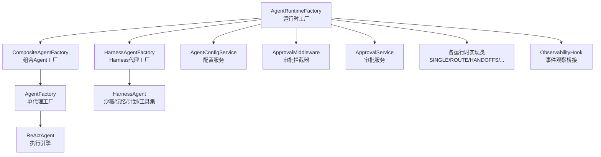
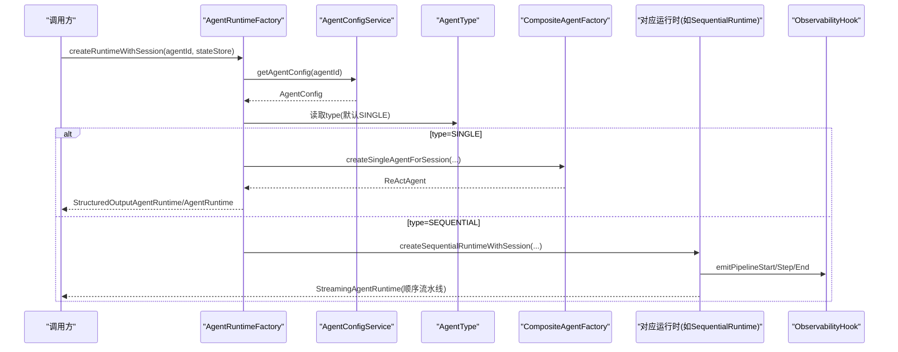
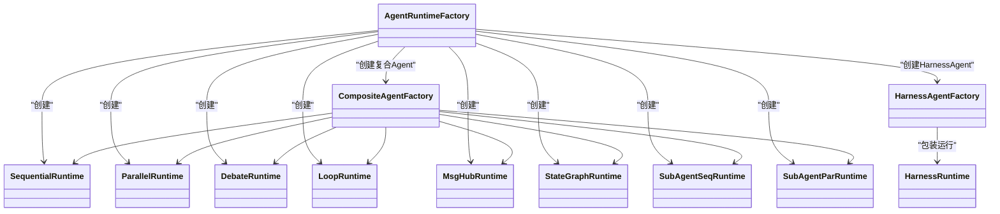
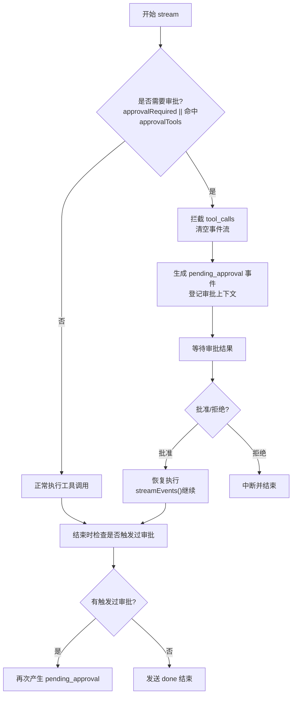
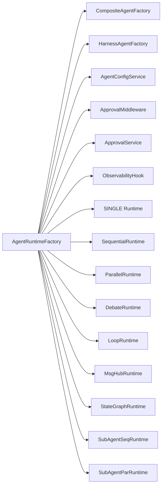

# 运行时工厂

<cite>
**本文引用的文件**
- [AgentRuntimeFactory.java](file://src/main/java/com/skloda/agentscope/runtime/AgentRuntimeFactory.java)
- [AgentType.java](file://src/main/java/com/skloda/agentscope/agent/AgentType.java)
- [CompositeAgentFactory.java](file://src/main/java/com/skloda/agentscope/composite/CompositeAgentFactory.java)
- [ApprovalMiddleware.java](file://src/main/java/com/skloda/agentscope/middleware/ApprovalMiddleware.java)
- [AgentRuntime.java](file://src/main/java/com/skloda/agentscope/runtime/AgentRuntime.java)
- [StreamingAgentRuntime.java](file://src/main/java/com/skloda/agentscope/runtime/StreamingAgentRuntime.java)
- [SequentialRuntime.java](file://src/main/java/com/skloda/agentscope/runtime/SequentialRuntime.java)
- [ParallelRuntime.java](file://src/main/java/com/skloda/agentscope/runtime/ParallelRuntime.java)
- [DebateRuntime.java](file://src/main/java/com/skloda/agentscope/runtime/DebateRuntime.java)
- [LoopRuntime.java](file://src/main/java/com/skloda/agentscope/runtime/LoopRuntime.java)
- [MsgHubRuntime.java](file://src/main/java/com/skloda/agentscope/runtime/MsgHubRuntime.java)
- [StateGraphRuntime.java](file://src/main/java/com/skloda/agentscope/runtime/StateGraphRuntime.java)
- [SubAgentSeqRuntime.java](file://src/main/java/com/skloda/agentscope/runtime/SubAgentSeqRuntime.java)
- [SubAgentParRuntime.java](file://src/main/java/com/skloda/agentscope/runtime/SubAgentParRuntime.java)
- [HarnessAgentFactory.java](file://src/main/java/com/skloda/agentscope/harness/HarnessAgentFactory.java)
- [ApprovalService.java](file://src/main/java/com/skloda/agentscope/service/ApprovalService.java)
- [ObservabilityHook.java](file://src/main/java/com/skloda/agentscope/hook/ObservabilityHook.java)
- [PermissionContextFactory.java](file://src/main/java/com/skloda/agentscope/permission/PermissionContextFactory.java)
- [AgentConfig.java](file://src/main/java/com/skloda/agentscope/agent/AgentConfig.java)
</cite>

## 目录
1. [简介](#简介)
2. [项目结构](#项目结构)
3. [核心组件](#核心组件)
4. [架构总览](#架构总览)
5. [详细组件分析](#详细组件分析)
6. [依赖关系分析](#依赖关系分析)
7. [性能考虑](#性能考虑)
8. [故障排查指南](#故障排查指南)
9. [结论](#结论)

## 简介
本文件围绕 AgentRuntimeFactory 构建与调度所有运行时，系统性说明其“动态路由机制”：根据 AgentType 将请求分发到不同运行时实现（SINGLE、ROUTING、HANDOFFS、STATE_GRAPH、MSG_HUB、HARNESS、SEQUENTIAL、PARALLEL、DEBATE、LOOP、SUBAGENT_SEQ、SUBAGENT_PAR），并解释：
- 三种创建模式：普通运行时、带 Session（共享状态）的运行时、带权限控制的运行时
- ApprovalMiddleware 的条件集成与 HITL 流程
- CompositeAgentFactory 在复杂复合 Agent 协作中的作用
- 运行时选择的最佳实践与性能考量

## 项目结构
以下图给出与运行时装配相关的源码位置与职责划分：

图示来源
- [AgentRuntimeFactory.java:41-104](file://src/main/java/com/skloda/agentscope/runtime/AgentRuntimeFactory.java#L41-L104)
- [CompositeAgentFactory.java:59-190](file://src/main/java/com/skloda/agentscope/composite/CompositeAgentFactory.java#L59-L190)
- [HarnessAgentFactory.java:42-199](file://src/main/java/com/skloda/agentscope/harness/HarnessAgentFactory.java#L42-L199)
- [ObservabilityHook.java:22-50](file://src/main/java/com/skloda/agentscope/hook/ObservabilityHook.java#L22-L50)

章节来源
- [AgentRuntimeFactory.java:1-127](file://src/main/java/com/skloda/agentscope/runtime/AgentRuntimeFactory.java#L1-L127)

## 核心组件
- AgentRuntimeFactory：基于 AgentType 进行运行时选择与实例化；提供带/不带 Session、带/不带权限等多组入口。
- AgentType：枚举定义所有受支持的 Agent 类型。
- CompositeAgentFactory：集中负责构建 SINGLE、ROUTING、HANDOFFS、STATE_GRAPH 等复合或子 Agent。
- 各类 Runtime 实现：Sequential/Parallel/Debate/Loop/MsgHub/StateGraph/SubAgentSeq/SubAgentPar 等。
- ApprovalMiddleware + ApprovalService：条件启用 HITL（人机协同审批），挂起/恢复流式事件。
- HarnessAgentFactory：为 HARNESS 类型构建具备工作空间、沙箱、记忆、计划等能力的 HarnessAgent。
- ObservabilityHook：桥接手动事件到统一的事件总线，配合各 Runtime 发出 pipeline/roundtable/loop 等事件。

章节来源
- [AgentType.java:3-26](file://src/main/java/com/skloda/agentscope/agent/AgentType.java#L3-L26)
- [CompositeAgentFactory.java:31-190](file://src/main/java/com/skloda/agentscope/composite/CompositeAgentFactory.java#L31-L190)
- [ApprovalMiddleware.java:22-124](file://src/main/java/com/skloda/agentscope/middleware/ApprovalMiddleware.java#L22-L124)
- [ApprovalService.java:17-76](file://src/main/java/com/skloda/agentscope/service/ApprovalService.java#L17-L76)
- [HarnessAgentFactory.java:22-199](file://src/main/java/com/skloda/agentscope/harness/HarnessAgentFactory.java#L22-L199)
- [ObservabilityHook.java:11-50](file://src/main/java/com/skloda/agentscope/hook/ObservabilityHook.java#L11-L50)

## 架构总览
下面的时序图展示 createRuntimeWithSession(agentId, stateStore) 的动态路由过程（以 SINGLE/SEQUENTIAL 为例）：

图示来源
- [AgentRuntimeFactory.java:85-104](file://src/main/java/com/skloda/agentscope/runtime/AgentRuntimeFactory.java#L85-L104)
- [CompositeAgentFactory.java:71-84](file://src/main/java/com/skloda/agentscope/composite/CompositeAgentFactory.java#L71-L84)
- [SequentialRuntime.java:37-89](file://src/main/java/com/skloda/agentscope/runtime/SequentialRuntime.java#L37-L89)

## 详细组件分析

### AgentRuntimeFactory：动态路由与创建策略
- 路由键：从 AgentConfig.type 获取，缺省为 SINGLE。
- 四组 API：
  - createRuntime(agentId)：无会话、无权限注入。
  - createRuntime(agentId, permissionMode)：无会话，但仅对 SINGLE 路径支持权限控制。
  - createRuntimeWithSession(agentId, stateStore)：为全部类型注入共享状态 Store（AgentScope 2.0）。
  - createRuntimeWithSession(agentId, stateStore, permissionMode)：会话+权限控制，仅对 SINGLE 路径开启权限。
- 分发逻辑：switch(type) 后分别调用对应的“XXXRuntime”构造方法（例如 createSequentialRuntime、createParallelRuntime、createDebateRuntime、createLoopRuntime、createMsgHubRuntime、createStateGraphRuntime、createRoutingRuntime、createHandoffsRuntime、createHarnessRuntime、createSubAgentSeq/ParRuntime）。

注意：
- ROUTING、HANDOFFS 在本版本中保持原路径（未走 sharedBlackboard 升级）。
- MSG_HUB 通过 CompositeAgentFactory 提供的工厂方法构造，保证与其他流水线一致使用共享状态。

章节来源
- [AgentRuntimeFactory.java:21-127](file://src/main/java/com/skloda/agentscope/runtime/AgentRuntimeFactory.java#L21-L127)
- [AgentRuntimeFactory.java:129-180](file://src/main/java/com/skloda/agentscope/runtime/AgentRuntimeFactory.java#L129-L180)

### AgentType：支持的 12 种类型
- 包括：SINGLE、SEQUENTIAL、PARALLEL、ROUTING、HANDOFFS、DEBATE、LOOP、STATE_GRAPH、MSG_HUB、SUBAGENT_SEQ、SUBAGENT_PAR、HARNESS。
- isDefault() 标识默认类型（SINGLE），用于 fallback 场景。

章节来源
- [AgentType.java:3-26](file://src/main/java/com/skloda/agentscope/agent/AgentType.java#L3-L26)

### 不同运行时的创建逻辑（按 AgentType）
- SINGLE
  - 无 Session：直接构造 AgentRuntime，可能包装为 StructuredOutputAgentRuntime（当 config 指定结构化输出时）。
  - 有 Session：使用 CompositeAgentFactory.createSingleAgentForSession(...)，可选挂载 ApprovalMiddleware，并支持结构化输出包装。
  - 有 PermissionMode：对 SINGLE 支持注入权限上下文（由 CompositeAgentFactory -> AgentFactory 完成）。
- ROUTING
  - 使用 CompositeAgentFactory.createRoutingAgent(...)，为每个子 Agent 注册 SubAgentTool，并设置 InMemoryAgentStateStore（若无共享 Store）。
- HANDOFFS
  - 使用 CompositeAgentFactory.createHandoffsAgent(...)，当前版本不应用 sharedBlackboard。
- STATE_GRAPH
  - 使用 CompositeAgentFactory.createStateGraphAgent(...) 装配 StateConfig 与对应 ReActAgent，包装为 StateGraphRuntime 执行状态机。
- MSG_HUB
  - 委托 CompositeAgentFactory.createMsgHubRuntime(...)，复用其他流水线一致的 session/store 方式。
- HARNESS
  - 通过 HarnessAgentFactory 构建 HarnessAgent（工作空间、沙箱、记忆、计划、工具结果淘汰等），再封装为 HarnessRuntime。
- SEQUENTIAL / PARALLEL / DEBATE / LOOP / SUBAGENT_SEQ / SUBAGENT_PAR
  - 均返回各自 StreamingAgentRuntime，内部用 ObservabilityHook 记录 pipeline/step/start/end 及聚合输出，使用 MultiAgentStreamSupport.runSubAgent 驱动每个子步骤/任务。

图表：子类运行时与能力

图示来源
- [AgentRuntimeFactory.java:41-104](file://src/main/java/com/skloda/agentscope/runtime/AgentRuntimeFactory.java#L41-L104)
- [CompositeAgentFactory.java:59-190](file://src/main/java/com/skloda/agentscope/composite/CompositeAgentFactory.java#L59-L190)
- [HarnessAgentFactory.java:42-199](file://src/main/java/com/skloda/agentscope/harness/HarnessAgentFactory.java#L42-L199)

章节来源
- [AgentRuntimeFactory.java:41-104](file://src/main/java/com/skloda/agentscope/runtime/AgentRuntimeFactory.java#L41-L104)
- [CompositeAgentFactory.java:71-190](file://src/main/java/com/skloda/agentscope/composite/CompositeAgentFactory.java#L71-L190)
- [HarnessAgentFactory.java:42-199](file://src/main/java/com/skloda/agentscope/harness/HarnessAgentFactory.java#L42-L199)

### 普通运行时 vs 带 Session 运行时 vs 带权限控制运行时
- 普通运行时
  - 无外部共享状态 Store；适合无上下文、短期对话的 SINGLE Agent。
  - 典型使用：createRuntime(agentId)。
- 带 Session 运行时
  - 通过 AgentStateStore 持久化上下文；ROUTING/HANDOFFS/STATE_GRAPH/MSG_HUB/HARNESS/SEQUENTIAL/PARALLEL/DEBATE/LOOP/SUBAGENT_SEQ/SUBAGENT_PAR/SINGLE 均可接入。
  - 典型使用：createRuntimeWithSession(agentId, stateStore)。
- 带权限控制的运行时
  - 仅在 SINGLE 路径生效；传入 permissionMode，结合 AgentConfig.PermissionConfig 由 PermissionContextFactory 构建权限上下文，再通过 AgentFactory 注入到会话级 Agent。
  - 典型使用：createRuntime(agentId, permissionMode) 或 createRuntimeWithSession(agentId, stateStore, permissionMode)。

章节来源
- [AgentRuntimeFactory.java:63-82](file://src/main/java/com/skloda/agentscope/runtime/AgentRuntimeFactory.java#L63-L82)
- [PermissionContextFactory.java:10-39](file://src/main/java/com/skloda/agentscope/permission/PermissionContextFactory.java#L10-L39)
- [AgentConfig.java:48-96](file://src/main/java/com/skloda/agentscope/agent/AgentConfig.java#L48-L96)

### ApprovalMiddleware 的集成方式与条件创建
- 条件创建
  - 当 config 开启 approvalRequired 或包含 approvalTools 时，会构造 ApprovalMiddleware，并传递给底层 Agent 构建链路。
- 工作原理
  - onActing 阶段拦截 ToolUseBlock，若命中则需要人类审批；此时跳过工具执行（返回空 Flux），并让下游生成 pending_approval 事件。
- 与流的衔接
  - AgentRuntime.stream 结尾检测 approvalTriggered，交由 ApprovalService.registerPendingApproval 登记暂停点；后续可 resume 恢复流。
- 恢复路径
  - 使用 agent.streamEvents() 继续执行，确保前端看到 thinking/tool_start/tool_end 等中间事件，而非仅最终文本。

流程图：HITL 审批断点

图示来源
- [ApprovalMiddleware.java:42-124](file://src/main/java/com/skloda/agentscope/middleware/ApprovalMiddleware.java#L42-L124)
- [AgentRuntime.java:67-183](file://src/main/java/com/skloda/agentscope/runtime/AgentRuntime.java#L67-L183)
- [ApprovalService.java:17-76](file://src/main/java/com/skloda/agentscope/service/ApprovalService.java#L17-L76)

章节来源
- [ApprovalMiddleware.java:42-124](file://src/main/java/com/skloda/agentscope/middleware/ApprovalMiddleware.java#L42-L124)
- [AgentRuntime.java:67-183](file://src/main/java/com/skloda/agentscope/runtime/AgentRuntime.java#L67-L183)
- [ApprovalService.java:17-76](file://src/main/java/com/skloda/agentscope/service/ApprovalService.java#L17-L76)

### CompositeAgentFactory 的协作关系
- SINGLE：直接委派 AgentFactory；支持授权与 Session 注入。
- ROUTING：构建主 Agent 与若干子 Agent（禁用子 Agent 工具，避免自我循环）；为每个子 Agent 注册 SubAgentTool 以暴露为工具。
- STATE_GRAPH：根据 States 配置构建状态图 OrderFulfillmentGraph，并以状态级会话隔离的状态存储执行。
- 其他流水线：在工厂层组装 Agent 列表并构造对应 Runtime（如 Seq/Par/Debate/Loop/MsgHub/SubAgent*）。

章节来源
- [CompositeAgentFactory.java:59-190](file://src/main/java/com/skloda/agentscope/composite/CompositeAgentFactory.java#L59-L190)

### 复杂复合 Agent 运行时的工作流
以 SEQUENTIAL、PARALLEL、SUBAGENT_*、DEBATE、MSG_HUB、LOOP 为代表：
- 都使用 ObservabilityHook 上报 pipeline/step/roundtable/loop 生命周期事件，并通过 EventSink 与多端消费者通信。
- 使用 MultiAgentStreamSupport.runSubAgent 封装每个子任务的流式执行，使前端能收到 thinking/tool/text 等增量事件。
- 顺序/并行区别：SequentialRuntime 使用链式 flatMap；ParallelRuntime 收集所有 Mono 合并执行后再聚合输出。
- DEBATE：专家轮询发言后，裁判汇总。
- MSG_HUB：多轮圆桌讨论后主持人总结。
- LOOP：writer 产出、critic 审核，直至达到最大迭代或获批；到达最大次数时会输出最近一次 writer 内容作为兜底。
- SUBAGENT_SEQ/PAR：根据模板 {input}/{prevOutput}/{taskDescription} 构造任务消息并行/串行执行。

章节来源
- [SequentialRuntime.java:37-89](file://src/main/java/com/skloda/agentscope/runtime/SequentialRuntime.java#L37-L89)
- [ParallelRuntime.java:38-94](file://src/main/java/com/skloda/agentscope/runtime/ParallelRuntime.java#L38-L94)
- [DebateRuntime.java:44-141](file://src/main/java/com/skloda/agentscope/runtime/DebateRuntime.java#L44-L141)
- [LoopRuntime.java:52-166](file://src/main/java/com/skloda/agentscope/runtime/LoopRuntime.java#L52-L166)
- [MsgHubRuntime.java:45-153](file://src/main/java/com/skloda/agentscope/runtime/MsgHubRuntime.java#L45-L153)
- [SubAgentSeqRuntime.java:37-105](file://src/main/java/com/skloda/agentscope/runtime/SubAgentSeqRuntime.java#L37-L105)
- [SubAgentParRuntime.java:37-104](file://src/main/java/com/skloda/agentscope/runtime/SubAgentParRuntime.java#L37-L104)
- [ObservabilityHook.java:22-50](file://src/main/java/com/skloda/agentscope/hook/ObservabilityHook.java#L22-L50)

## 依赖关系分析
下图展示运行时工厂及其主要依赖关系（仅关键耦合）：

图示来源
- [AgentRuntimeFactory.java:21-127](file://src/main/java/com/skloda/agentscope/runtime/AgentRuntimeFactory.java#L21-L127)

章节来源
- [AgentRuntimeFactory.java:21-127](file://src/main/java/com/skloda/agentscope/runtime/AgentRuntimeFactory.java#L21-L127)

## 性能考虑
- 流式优先：所有运行时无非必要情况不阻塞（除 StateGraphRuntime 的 execute().block() 用于一次性流程编排），最大化利用 Flux/Reactive 模型降低延迟。
- 并发度控制
  - 并行类运行时要关注子任务总数与外部资源限流，避免瞬时高并发造成模型或服务端压力。
  - 推荐分批并发或限制并发度以平衡吞吐与稳定性。
- 会话与状态存储
  - 长会话建议启用共享 AgentStateStore，减少重复初始化与上下文重建开销；但需注意状态膨胀对内存的影响（适当配置 compaction/memory）。
- 工具调用成本
  - 工具越多、频率越高，越需要考虑调用合并与缓存；HITL 审批虽增加额外往返，但可显著降低错误成本。
- 资源关闭
  - 所有运行时实现均在完成或取消时正确关闭 EventSink，防止流悬挂问题（如“只能聊一次”）。

[本节为通用性能指导，无需引用具体文件]

## 故障排查指南
常见问题与定位思路：
- 流卡住或前端显示“进行中”无法终止
  - 核查运行时 doFinally/doOnCancel 是否正确关闭 EventSink，以及 merge 的来源流是否都能终结（AgentRuntime 已修复该悬挂问题）。
  - 参考：AgentRuntime 的流完成和 EventSink 完成时机安排。
- 审批后前端只显示最后文本
  - 确认恢复路径使用 streamEvents() 而非 call()，确保中间事件（thinking/tool_start/tool_end）能透出到前端。
- 子任务无输出或结果丢失
  - 检查流水线事件中 step/result 是否被正确发出，是否存在异常吞没；参考 Sequential/Parallel/SubAgent* 的错误分支。
- 模型或工具配置错误
  - 核验 AgentConfig.modelName、streaming、enableThinking 是否正确加载；校验 HarnessConfig 的工作空间与沙箱配置是否就绪。

章节来源
- [AgentRuntime.java:128-141](file://src/main/java/com/skloda/agentscope/runtime/AgentRuntime.java#L128-L141)
- [LoopRuntime.java:73-135](file://src/main/java/com/skloda/agentscope/runtime/LoopRuntime.java#L73-L135)
- [SequentialRuntime.java:68-84](file://src/main/java/com/skloda/agentscope/runtime/SequentialRuntime.java#L68-L84)
- [ParallelRuntime.java:65-89](file://src/main/java/com/skloda/agentscope/runtime/ParallelRuntime.java#L65-L89)

## 结论
AgentRuntimeFactory 以 AgentType 为中心提供统一的运行时装配入口，结合 CompositeAgentFactory 的能力与多种 Runtime 实现，覆盖了单代理、多代理协作与复杂编排的全谱系场景。借助 Session 状态、权限控制、HITL 审批与 Observability 观测，既能满足简单用例的快速上手，也能支撑企业级的高可靠复杂工作流。在实际落地中，建议优先考虑流式执行与会话化状态、审慎评估并发规模与工具调用成本，并结合审批策略与权限控制提升系统稳健性。