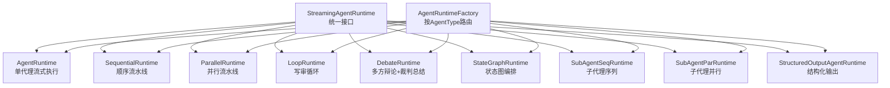
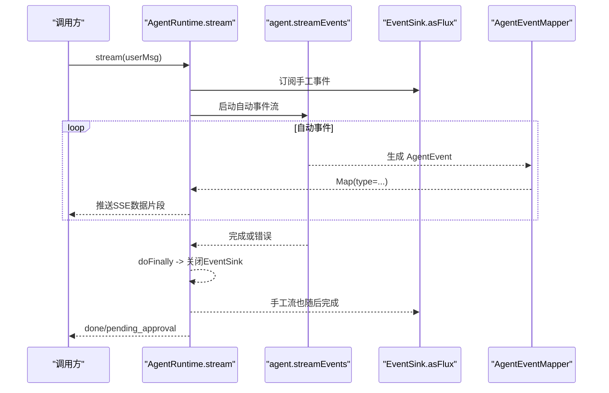
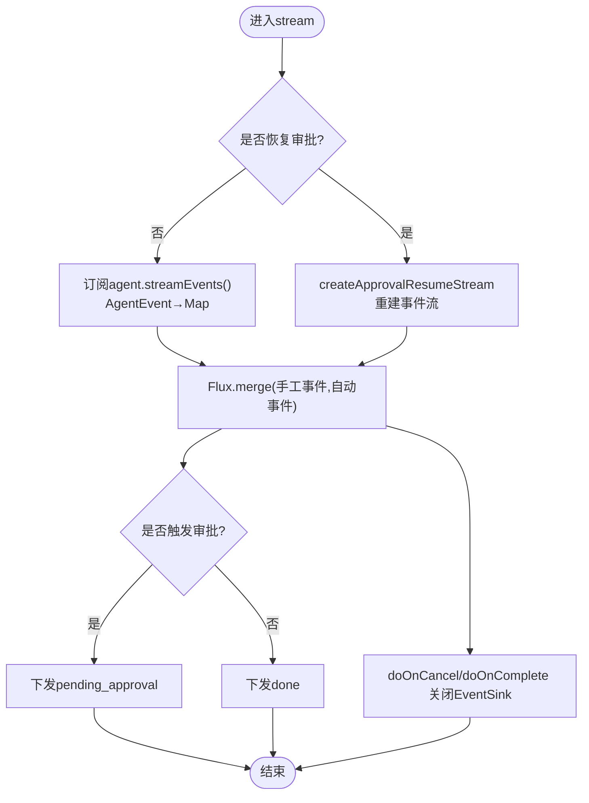
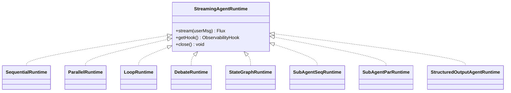
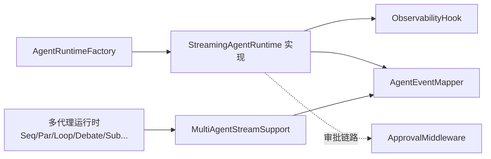

# 运行时框架

<cite>
**本文引用的文件列表**
- [AgentRuntime.java](file://src/main/java/com/skloda/agentscope/runtime/AgentRuntime.java)
- [StreamingAgentRuntime.java](file://src/main/java/com/skloda/agentscope/runtime/StreamingAgentRuntime.java)
- [AgentRuntimeFactory.java](file://src/main/java/com/skloda/agentscope/runtime/AgentRuntimeFactory.java)
- [AgentEventMapper.java](file://src/main/java/com/skloda/agentscope/runtime/AgentEventMapper.java)
- [SequentialRuntime.java](file://src/main/java/com/skloda/agentscope/runtime/SequentialRuntime.java)
- [ParallelRuntime.java](file://src/main/java/com/skloda/agentscope/runtime/ParallelRuntime.java)
- [LoopRuntime.java](file://src/main/java/com/skloda/agentscope/runtime/LoopRuntime.java)
- [MultiAgentStreamSupport.java](file://src/main/java/com/skloda/agentscope/runtime/MultiAgentStreamSupport.java)
- [ApprovalMiddleware.java](file://src/main/java/com/skloda/agentscope/middleware/ApprovalMiddleware.java)
- [ObservabilityHook.java](file://src/main/java/com/skloda/agentscope/hook/ObservabilityHook.java)
- [SubAgentParRuntime.java](file://src/main/java/com/skloda/agentscope/runtime/SubAgentParRuntime.java)
- [SubAgentSeqRuntime.java](file://src/main/java/com/skloda/agentscope/runtime/SubAgentSeqRuntime.java)
- [DebateRuntime.java](file://src/main/java/com/skloda/agentscope/runtime/DebateRuntime.java)
- [StateGraphRuntime.java](file://src/main/java/com/skloda/agentscope/runtime/StateGraphRuntime.java)
- [StructuredOutputAgentRuntime.java](file://src/main/java/com/skloda/agentscope/runtime/StructuredOutputAgentRuntime.java)
</cite>

## 目录
1. [简介](#简介)
2. [项目结构](#项目结构)
3. [核心组件](#核心组件)
4. [架构总览](#架构总览)
5. [关键组件详解](#关键组件详解)
6. [依赖关系分析](#依赖关系分析)
7. [性能与并发特性](#性能与并发特性)
8. [故障排查指南](#故障排查指南)
9. [结论与最佳实践](#结论与最佳实践)
10. [附录：扩展点与自定义运行时开发指南](#附录：扩展点与自定义运行时开发指南)

## 简介
本文件围绕 AgentRuntime 的流式执行引擎，系统性阐释以下主题：
- 基于 Reactor Flux 的响应式事件管道设计；
- 自动事件（AgentScope 原生 agent.streamEvents）与手动事件（EventSink）的统一合并；
- 审批中间件在工具调用阶段的集成点及 HITL 流程；
- 会话状态管理、多阶段流水线的执行语义；
- AgentRuntimeFactory 按 AgentType 的动态路由机制；
- StreamingAgentRuntime 统一接口及其多种实现；
- AgentEventMapper 的事件映射机制，将 AgentScope 内部事件转换为 SSE 友好型 Map；
- 如何扩展并编写自定义运行时。

## 项目结构
运行时子系统位于 runtime 包，采用“一个模式一类”的组织方式：
- 单一代理运行：AgentRuntime
- 流水线/编排运行：SequentialRuntime、ParallelRuntime、DebateRuntime、LoopRuntime、StateGraphRuntime
- 子代理编排：SubAgentSeqRuntime、SubAgentParRuntime
- 结构化输出：StructuredOutputAgentRuntime
- 统一契约：StreamingAgentRuntime 接口
- 工厂路由：AgentRuntimeFactory
- 事件映射：AgentEventMapper + ObservabilityHook + EventSink
- 审批中间件：ApprovalMiddleware

图表来源
- [StreamingAgentRuntime.java](file://src/main/java/com/skloda/agentscope/runtime/StreamingAgentRuntime.java)
- [AgentRuntimeFactory.java](file://src/main/java/com/skloda/agentscope/runtime/AgentRuntimeFactory.java)

章节来源
- [AgentRuntimeFactory.java:41-127](file://src/main/java/com/skloda/agentscope/runtime/AgentRuntimeFactory.java#L41-L127)

## 核心组件
- StreamingAgentRuntime：定义统一的流式运行接口 stream(Msg)，返回 Reactor Flux<Map<String,Object>>；提供钩子访问和关闭语义，使所有运行时可替换、可组合。
- AgentRuntime：单代理运行时的核心，使用 agent.streamEvents() 捕获自动生命周期事件，并结合 ObservabilityHook.EventSink 输出的手动事件（如 pipeline、routing、handoff），通过 Flux.merge 合并成一个统一 SSE 事件流。支持审批路径恢复、结束后的 pending_approval 收尾。
- AgentEventMapper：纯函数式转换器，覆盖全部 AgentEventType 到 {type,...} 的 Map 映射，供单代理及多代理运行共同复用。
- ApprovalMiddleware：在 ActingInput.onActing 阶段拦截 ToolUseBlock，决定是否暂停工具执行、记录待审批信息并在流结束时发出 pending_approval。
- ObservabilityHook：封装 EventSink，向外暴露 emitPipelineXxx、emitRoutingXxx、emitLoopXxx 等人工事件发射器，以及 asFlux() 作为统一事件通道。
- MultiAgentStreamSupport：抽取公共逻辑，runSubAgent(agent,msg,sink,…) 把子代理的每个 AgentEvent 经 AgentEventMapper 映射后推送到外部 FluxSink，并回送最终文本供链式编排。

章节来源
- [StreamingAgentRuntime.java:9-20](file://src/main/java/com/skloda/agentscope/runtime/StreamingAgentRuntime.java#L9-L20)
- [AgentRuntime.java:26-183](file://src/main/java/com/skloda/agentscope/runtime/AgentRuntime.java#L26-L183)
- [AgentEventMapper.java:39-105](file://src/main/java/com/skloda/agentscope/runtime/AgentEventMapper.java#L39-L105)
- [ApprovalMiddleware.java:22-124](file://src/main/java/com/skloda/agentscope/middleware/ApprovalMiddleware.java#L22-L124)
- [ObservabilityHook.java:11-67](file://src/main/java/com/skloda/agentscope/hook/ObservabilityHook.java#L11-L67)
- [MultiAgentStreamSupport.java:17-119](file://src/main/java/com/skloda/agentscope/runtime/MultiAgentStreamSupport.java#L17-L119)

## 架构总览
AgentRuntime 的响应式流由三个层次构成：
- 上游事件源 1：agent.streamEvents(userMsg) 产生的自动事件（LLM token 流、模型调用、工具调用、结果等）
- 上游事件源 2：hook.getEventSink().asFlux() 产生的手动事件（来自流水线、路由、交接、对话轮次等）
- 下游统一输出：Flux.merge(...) 合并上述两路，并在完成后追加一个 {type:"done"} 或 {type:"pending_approval"}；取消或错误时清理资源并关闭 EventSink

图表来源
- [AgentRuntime.java:79-141](file://src/main/java/com/skloda/agentscope/runtime/AgentRuntime.java#L79-L141)
- [AgentEventMapper.java:64-105](file://src/main/java/com/skloda/agentscope/runtime/AgentEventMapper.java#L64-L105)

章节来源
- [AgentRuntime.java:72-142](file://src/main/java/com/skloda/agentscope/runtime/AgentRuntime.java#L72-L142)

## 关键组件详解

### AgentRuntime：流式执行引擎与审批整合
- 自动事件桥接：使用 agent.streamEvents() 获得 AgentEvent 流，经由 AgentEventMapper 转为前端友好的 Map 推送
- 手工事件整合：从 hook.getEventSink().asFlux() 获取跨子代理的人工事件，与自动事件通过 Flux.merge 融合
- 审批恢复路径：当 isApprovalResume=true 时，重建 streamEvents，确保批准后继续下发 thinking/tool/text 等分段事件，避免断流
- 收尾策略：聚合流结束后检查是否触发了审批（ApprovalMiddleware），若有则下发 pending_approval，否则下发 done；取消/异常均清理 EventSink
- MCP 溯源增强：tool_start 事件额外注入 isMcp/mcpName，便于前端区分 MCP 调用

图表来源
- [AgentRuntime.java:79-183](file://src/main/java/com/skloda/agentscope/runtime/AgentRuntime.java#L79-L183)

章节来源
- [AgentRuntime.java:67-183](file://src/main/java/com/skloda/agentscope/runtime/AgentRuntime.java#L67-L183)

### AgentEventMapper：全量事件类型到 SSE 的映射
- 覆盖全部 AgentEventType：包括文本/思考增量、工具调用起止与结果、模型调用起止、子代理暴露、提示块、超出迭代限制、确认请求、自定义事件等
- 对不渲染块边界的事件返回 null 以静音消费，避免 UI 抖动
- 错误安全：转换异常兜底产出 error 事件，保证流不被中断
- 工具溯源增强：tool_start 时结合运行上下文注入 MCP 标记（在调用处完成）

章节来源
- [AgentEventMapper.java:39-213](file://src/main/java/com/skloda/agentscope/runtime/AgentEventMapper.java#L39-L213)
- [AgentRuntime.java:194-203](file://src/main/java/com/skloda/agentscope/runtime/AgentRuntime.java#L194-L203)

### ApprovalMiddleware：HITL 中间件嵌入点
- 拦截阶段：onActing 阶段，拿到即将执行的 ToolUseBlock 列表
- 判断条件：开启全局 approvalRequired 或工具名命中白名单即拦截
- 动作：设置 approvalTriggered、保存 pendingToolUseBlocks、返回空流跳过工具执行，让 agent 自然结束本次步骤
- 配合上层：AgentRuntime 在流结束时根据该标志下发 pending_approval，并由前端唤起审批后恢复流

章节来源
- [ApprovalMiddleware.java:22-124](file://src/main/java/com/skloda/agentscope/middleware/ApprovalMiddleware.java#L22-L124)

### 流水线与编排运行时
- SequentialRuntime：依次执行多个 ReActAgent，前一步输出拼接为下一步输入，每步 emit 前后指标及 step_result 事件
- ParallelRuntime：并发执行多个 ReActAgent，收集最终输出合并成一段结果文本，并发过程中每一跳 delta 都透传
- LoopRuntime：writer→critic 循环，达到最大迭代或收到“通过”关键字即终止，末尾补发 text/done；内部用 Mono 链替代嵌套 subscribe 消除竞态
- DebateRuntime：多专家轮流讨论 + 最后 judge 汇总，逐轮广播 round_message 与 final summary
- StateGraphRuntime：基于状态图执行，阻塞取一次最终消息，期间通过 EventSink 同步图内事件
- SubAgentSeqRuntime/SubAgentParRuntime：通用的“子代理流水线/并行”模板，支持任务模板占位符与进度事件

所有章节均遵循同一模式：启动时构建 pipeline flux；用 MultiAgentStreamSupport.runSubAgent 桥接每个子代理流；与 hook.getEventSink() 合并；结束时统一 complete。

图表来源
- [StreamingAgentRuntime.java:9-20](file://src/main/java/com/skloda/agentscope/runtime/StreamingAgentRuntime.java#L9-L20)
- [SequentialRuntime.java:15-99](file://src/main/java/com/skloda/agentscope/runtime/SequentialRuntime.java#L15-L99)
- [ParallelRuntime.java:16-106](file://src/main/java/com/skloda/agentscope/runtime/ParallelRuntime.java#L16-L106)
- [LoopRuntime.java:14-166](file://src/main/java/com/skloda/agentscope/runtime/LoopRuntime.java#L14-L166)
- [DebateRuntime.java:16-141](file://src/main/java/com/skloda/agentscope/runtime/DebateRuntime.java#L16-L141)
- [StateGraphRuntime.java:13-73](file://src/main/java/com/skloda/agentscope/runtime/StateGraphRuntime.java#L13-L73)
- [SubAgentSeqRuntime.java:15-106](file://src/main/java/com/skloda/agentscope/runtime/SubAgentSeqRuntime.java#L15-L106)
- [SubAgentParRuntime.java:16-104](file://src/main/java/com/skloda/agentscope/runtime/SubAgentParRuntime.java#L16-L104)
- [StructuredOutputAgentRuntime.java:17-182](file://src/main/java/com/skloda/agentscope/runtime/StructuredOutputAgentRuntime.java#L17-L182)

章节来源
- [SequentialRuntime.java:37-99](file://src/main/java/com/skloda/agentscope/runtime/SequentialRuntime.java#L37-L99)
- [ParallelRuntime.java:38-105](file://src/main/java/com/skloda/agentscope/runtime/ParallelRuntime.java#L38-L105)
- [LoopRuntime.java:52-166](file://src/main/java/com/skloda/agentscope/runtime/LoopRuntime.java#L52-L166)
- [DebateRuntime.java:44-141](file://src/main/java/com/skloda/agentscope/runtime/DebateRuntime.java#L44-L141)
- [StateGraphRuntime.java:29-73](file://src/main/java/com/skloda/agentscope/runtime/StateGraphRuntime.java#L29-L73)
- [SubAgentSeqRuntime.java:37-106](file://src/main/java/com/skloda/agentscope/runtime/SubAgentSeqRuntime.java#L37-L106)
- [SubAgentParRuntime.java:37-104](file://src/main/java/com/skloda/agentscope/runtime/SubAgentParRuntime.java#L37-L104)

### AgentRuntimeFactory：动态路由机制
根据 AgentConfig.type（默认 SINGLE）选择具体运行实现：
- SINGLE → 单代理运行
- ROUTING/HANDOFFS → 多代理协作
- STATE_GRAPH → 状态图编排
- MSG_HUB → 消息总线分发
- HARNESS → HarnessAgent 沙箱运行
- SEQUENTIAL/PARALLEL/DEBATE/LOOP/SUBAGENT_SEQ/SUBAGENT_PAR → 对应编排运行时

还提供带权限模式和共享会话（AgentStateStore）的创建分支，保持行为一致。

章节来源
- [AgentRuntimeFactory.java:21-127](file://src/main/java/com/skloda/agentscope/runtime/AgentRuntimeFactory.java#L21-L127)

### 事件源与事件合并模式
- 自动事件：由底层 agent.streamEvents() 产生，高粒度且稳定
- 手工事件：通过 ObservabilityHook.emitXxx(...) 写入 EventSink，适用于跨代理的业务级通知
- 合并策略：Flux.merge(sinkEvents, agentEvents) 保证两类事件有序交错且统一终结；doFinally/doOnCancel 确保 EventSink.complete 不再悬挂

章节来源
- [AgentRuntime.java:94-128](file://src/main/java/com/skloda/agentscope/runtime/AgentRuntime.java#L94-L128)
- [ObservabilityHook.java:22-67](file://src/main/java/com/skloda/agentscope/hook/ObservabilityHook.java#L22-L67)

### 会话状态与观察性钩子
- 通过 AgentRuntimeFactory 的 withSession 方法传递 AgentStateStore，使 AgentScope 2.0 会话上下文在子代理间共享
- ObservabilityHook 统一管理 EventSink 及各类 pipeline/routing/loop/graph/event 发射，作为跨模块观测总线

章节来源
- [AgentRuntimeFactory.java:85-127](file://src/main/java/com/skloda/agentscope/runtime/AgentRuntimeFactory.java#L85-L127)
- [ObservabilityHook.java:22-67](file://src/main/java/com/skloda/agentscope/hook/ObservabilityHook.java#L22-L67)

### 结构化输出运行时
StructuredOutputAgentRuntime 用于需严格 Schema 约束的场景：
- 调用 agent.call(msg, schemaClass) 获取结构化数据
- 校验失败可构造修复提示再次尝试（可配置重试次数）
- 事件输出包括 text、structured_validation_passed/failed/repair_start、structured_data、error、done

章节来源
- [StructuredOutputAgentRuntime.java:52-182](file://src/main/java/com/skloda/agentscope/runtime/StructuredOutputAgentRuntime.java#L52-L182)

## 依赖关系分析

图表来源
- [AgentRuntimeFactory.java:41-127](file://src/main/java/com/skloda/agentscope/runtime/AgentRuntimeFactory.java#L41-L127)
- [AgentRuntime.java:94-141](file://src/main/java/com/skloda/agentscope/runtime/AgentRuntime.java#L94-L141)
- [MultiAgentStreamSupport.java:60-119](file://src/main/java/com/skloda/agentscope/runtime/MultiAgentStreamSupport.java#L60-L119)
- [ApprovalMiddleware.java:58-77](file://src/main/java/com/skloda/agentscope/middleware/ApprovalMiddleware.java#L58-L77)

章节来源
- [AgentRuntimeFactory.java:41-127](file://src/main/java/com/skloda/agentscope/runtime/AgentRuntimeFactory.java#L41-L127)
- [AgentRuntime.java:94-141](file://src/main/java/com/skloda/agentscope/runtime/AgentRuntime.java#L94-L141)
- [MultiAgentStreamSupport.java:60-119](file://src/main/java/com/skloda/agentscope/runtime/MultiAgentStreamSupport.java#L60-L119)

## 性能与并发特性
- 响应式非阻塞：全程基于 Reactor Flux/Mono，IO/LLM 调用非阻塞，适合高吞吐 SSE 推送
- 并发聚合：ParallelRuntime 与 SubAgentParRuntime 使用 Flux.merge 并行执行，注意背压与事件交叉排序
- 避免悬挂：通过 doFinally 强制 complete EventSink，消除“只能聊一次”的挂起问题（已在 AgentRuntime 中闭环）
- 最小化事件：AgentEventMapper 对块边界事件过滤，减少前端负载
- 结构化输出重试：可选的修复重入，保障强格式场景成功率，但会增加 LLM 调用次数

[本节为通用性能建议，无特定源码引用]

## 故障排查指南
- 流卡死或未结束
  - 检查 EventSink 是否在 doFinally 中被 complete
  - 确认下游是否取消了订阅，从而触发 close
- 审批后无内容恢复
  - 确认走 createApprovalResumeStream，并使用 agent.streamEvents(List.of()) 或传入用户消息恢复
  - 检查 ApprovalMiddleware 是否误设 approvalTriggered
- 子代理事件丢失或不带 source
  - 核查 MultiAgentStreamSupport.runSubAgent 是否被正确桥接到外层 FluxSink
- 结构化输出一直失败
  - 查看 structured_repair_start/structured_validation_failed 事件定位缺失字段

章节来源
- [AgentRuntime.java:112-141](file://src/main/java/com/skloda/agentscope/runtime/AgentRuntime.java#L112-L141)
- [ApprovalMiddleware.java:66-74](file://src/main/java/com/skloda/agentscope/middleware/ApprovalMiddleware.java#L66-L74)
- [MultiAgentStreamSupport.java:74-118](file://src/main/java/com/skloda/agentscope/runtime/MultiAgentStreamSupport.java#L74-L118)
- [StructuredOutputAgentRuntime.java:67-132](file://src/main/java/com/skloda/agentscope/runtime/StructuredOutputAgentRuntime.java#L67-L132)

## 结论与最佳实践
- 将任意 agent 运行统一抽象为 StreamingAgentRuntime，方便替换、测试与组合
- 自动事件与手工事件统一合并，确保事件视图一致性
- 审批仅在需要时介入，避免影响正常工具调用流
- 复杂编排尽量通过 MultiAgentStreamSupport + Flux 组合，而不是嵌套订阅
- 事件承载尽量小而精：AgentEventMapper 负责剔除无需 UI 渲染的块边界事件

[本节为总结，无特定源码引用]

## 附录：扩展点与自定义运行时开发指南
- 新增 AgentType
  - 在 AgentRuntimeFactory.createRuntime(... switch) 增加分支，并返回新实现的 StreamingAgentRuntime
- 自定义运行时
  - 实现 StreamingAgentRuntime，关注 stream(Msg) 的 Flux 构建、与 EventSink 的合并、生命周期资源的关闭
  - 如需桥接第三方 agent：参考 MultiAgentStreamSupport.runSubAgent，将 AgentEvent 转译为 Map 并通过 FluxSink.next 推送
  - 如需审批：按需引入 ApprovalMiddleware，并在流结束检查是否下发 pending_approval
  - 如需结构化输出：参照 StructuredOutputAgentRuntime 的设计，添加 validation/retry/结构化数据事件

章节来源
- [AgentRuntimeFactory.java:41-127](file://src/main/java/com/skloda/agentscope/runtime/AgentRuntimeFactory.java#L41-L127)
- [StreamingAgentRuntime.java:9-20](file://src/main/java/com/skloda/agentscope/runtime/StreamingAgentRuntime.java#L9-L20)
- [MultiAgentStreamSupport.java:60-119](file://src/main/java/com/skloda/agentscope/runtime/MultiAgentStreamSupport.java#L60-L119)
- [StructuredOutputAgentRuntime.java:52-182](file://src/main/java/com/skloda/agentscope/runtime/StructuredOutputAgentRuntime.java#L52-L182)
- [ApprovalMiddleware.java:58-124](file://src/main/java/com/skloda/agentscope/middleware/ApprovalMiddleware.java#L58-L124)