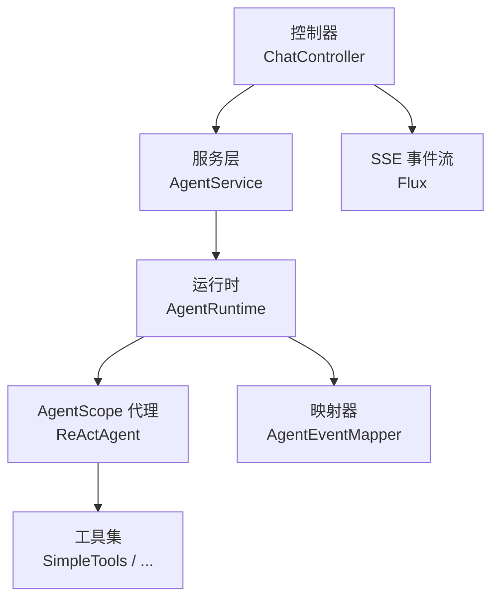
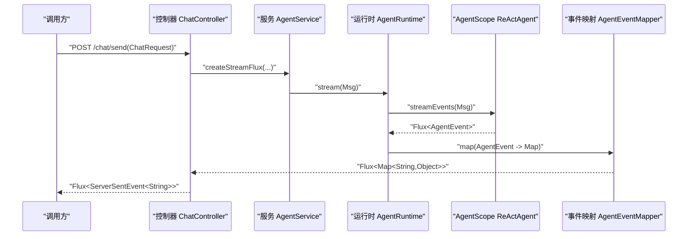

# 单元测试

<cite>
**本文引用的文件**   
- [pom.xml](file://pom.xml)
- [application.yml](file://src/main/resources/application.yml)
- [application-test.yml](file://src/test/resources/application-test.yml)
- [ChatController.java](file://src/main/java/com/skloda/agentscope/controller/ChatController.java)
- [AgentService.java](file://src/main/java/com/skloda/agentscope/service/AgentService.java)
- [AgentRuntime.java](file://src/main/java/com/skloda/agentscope/runtime/AgentRuntime.java)
- [AgentConfig.java](file://src/main/java/com/skloda/agentscope/agent/AgentConfig.java)
- [SimpleTools.java](file://src/main/java/com/skloda/agentscope/tool/SimpleTools.java)
- [MiddlewareRegistry.java](file://src/main/java/com/skloda/agentscope/middleware/MiddlewareRegistry.java)
- [MultiAgentStreamSupport.java](file://src/main/java/com/skloda/agentscope/runtime/MultiAgentStreamSupport.java)
- [HarnessRuntime.java](file://src/main/java/com/skloda/agentscope/harness/HarnessRuntime.java)
- [ApprovalService.java](file://src/main/java/com/skloda/agentscope/service/ApprovalService.java)
- [ObservabilityHook.java](file://src/main/java/com/skloda/agentscope/hook/ObservabilityHook.java)
- [AgentEventMapperTest.java](file://src/test/java/com/skloda/agentscope/runtime/AgentEventMapperTest.java)
- [ChatControllerStreamTest.java](file://src/test/java/com/skloda/agentscope/controller/ChatControllerStreamTest.java)
- [SimpleToolsTest.java](file://src/test/java/com/skloda/agentscope/tool/SimpleToolsTest.java)
- [AgentConfigTest.java](file://src/test/java/com/skloda/agentscope/agent/AgentConfigTest.java)
- [MiddlewareRegistryTest.java](file://src/test/java/com/skloda/agentscope/middleware/MiddlewareRegistryTest.java)
- [MultiAgentStreamSupportTest.java](file://src/test/java/com/skloda/agentscope/runtime/MultiAgentStreamSupportTest.java)
- [ApprovalServiceTest.java](file://src/test/java/com/skloda/agentscope/service/ApprovalServiceTest.java)
</cite>

## 目录
1. [引言](#引言)
2. [项目结构](#项目结构)
3. [核心组件测试目标](#核心组件测试目标)
4. [架构总览（从请求到事件流）](#架构总览从请求到事件流)
5. [详细组件测试策略](#详细组件测试策略)
6. [依赖关系与隔离](#依赖关系与隔离)
7. [性能考量与稳定性](#性能考量与稳定性)
8. [故障排查指南](#故障排查指南)
9. [结论](#结论)
10. [附录：持续集成与覆盖率建议](#附录持续集成与覆盖率建议)

## 引言
本指南聚焦于 AgentScope Demo 项目的单元测试最佳实践，覆盖以下关键目标：
- Agent 配置、控制器、工具类、运行时、中间件、工作区与 Harness、审批服务等核心组件的测试策略。
- Mock 外部依赖、异步 Flux/Mono 流的验证、状态断言的实践。
- 测试环境配置、数据准备策略与断言规范。
- 典型复杂业务与异常场景的测试用例设计思路。
- 覆盖率目标与 CI 自动化测试流程建议。

本项目使用 Spring Boot + Reactor 构建，控制器提供响应式 SSE 流式接口；AgentScope 运行时通过 streamEvents() 产生事件流；工具以 @Tool 注解的方式注册并在 Agent 运行中被调用。测试框架为 JUnit 5 + Mockito，部分流式场景使用 StepVerifier。

**章节来源**
- [pom.xml:1-100](file://pom.xml#L1-L100)
- [Application Test 配置](file://src/test/resources/application-test.yml#L1-L9)

## 项目结构
代码位于 Java Maven 工程；测试放在 src/test 下，对应主代码结构；Spring 默认启动排除数据库自动装配和 A2A 自动装配；测试 profile 关闭 MCP，避免 CI 需要 Node.js 等外部依赖。

**图表来源**
- [ChatController.java](file://src/main/java/com/skloda/agentscope/controller/ChatController.java#L1-L50)
- [AgentService.java](file://src/main/java/com/skloda/agentscope/service/AgentService.java#L1-L200)
- [AgentRuntime.java](file://src/main/java/com/skloda/agentscope/runtime/AgentRuntime.java#L1-L200)
- [SimpleTools.java](file://src/main/java/com/skloda/agentscope/tool/SimpleTools.java#L1-L44)
- [AgentEventMapperTest.java](file://src/test/java/com/skloda/agentscope/runtime/AgentEventMapperTest.java#L1-L200)

**章节来源**
- [application.yml:1-50](file://src/main/resources/application.yml#L1-L50)
- [application-test.yml:1-9](file://src/test/resources/application-test.yml#L1-L9)

## 核心组件测试目标
- 控制器：验证输入校验、异常处理、SSE 流完整性与完成语义（例如在运行时发出 done 时终止流）。
- Agent 配置：验证默认值、多智能体字段、废弃字段兼容、MCP/ToolGroups 的加载。
- 工具类：验证纯函数式工具的正确性、异常路径、参数校验。
- 运行时/中间件/审批服务：验证事件桥接、链式调用顺序、缓存/过期清理。
- Harness/工作区：验证默认模式、Builder 模式切换、工作区初始化。
- Model/Schema：验证类型序列化、合法性约束。

**章节来源**
- [AgentConfigTest.java](file://src/test/java/com/skloda/agentscope/agent/AgentConfigTest.java#L1-L80)
- [SimpleToolsTest.java](file://src/test/java/com/skloda/agentscope/tool/SimpleToolsTest.java#L1-L40)
- [MiddlewareRegistryTest.java](file://src/test/java/com/skloda/agentscope/middleware/MiddlewareRegistryTest.java#L1-L80)
- [ApprovalServiceTest.java](file://src/test/java/com/skloda/agentscope/service/ApprovalServiceTest.java#L1-L120)
- [HarnessRuntimeTest.java](file://src/test/java/com/skloda/agentscope/harness/HarnessRuntimeTest.java#L1-L30)

## 架构总览（从请求到事件流）
下面的序列图展示一个典型的聊天请求如何经过 Controller → Service → Runtime 触发 Agent 事件流并最终返回 SSE。

提示要点：
- 控制器需要在上游事件流中检测“done”或结束事件以完成响应（防止悬挂流）。
- 对于子代理或多智能体协作，使用 MultiAgentStreamSupport 桥接事件并标记 source。

**图表来源**
- [ChatController.java](file://src/main/java/com/skloda/agentscope/controller/ChatController.java#L1-L200)
- [AgentService.java](file://src/main/java/com/skloda/agentscope/service/AgentService.java#L1-L200)
- [AgentRuntime.java](file://src/main/java/com/skloda/agentscope/runtime/AgentRuntime.java#L1-L200)
- [MultiAgentStreamSupportTest.java](file://src/test/java/com/skloda/agentscope/runtime/MultiAgentStreamSupportTest.java#L40-L120)

## 详细组件测试策略

### 控制器测试（ChatController）
- 关注点
  - 入参校验：缺失必填字段应快速失败。
  - 异步流完成：当运行时发送 done 事件后，确保 flux 完成（即使底层 flux 可能长期不结束）。
  - 文件上传/下载路径与错误码。
- Mock 策略
  - 使用 StubAgentService 或 Mockito 模拟 AgentService.createStreamFlux，构造可控的事件流（包含文本、done、error）。
- 断言方式
  - 使用 Reactor StepVerifier 或收集列表验证事件数量、顺序与内容字段。
- 参考案例
  - 流完成后立即停止（等待 done）的行为在流测试中有示范。

**章节来源**
- [ChatControllerStreamTest.java:18-62](file://src/test/java/com/skloda/agentscope/controller/ChatControllerStreamTest.java#L18-L62)

### Agent 配置测试（AgentConfig）
- 关注点
  - 默认类型、默认 RAG mode、模态设置、权限设置。
  - 多智能体字段（SubAgent）、并行/串行模式、MCP 服务器引用、ToolGroup 分组。
- Mock 策略
  - 通常直接实例化 AgentConfig 并利用 Builder/Setter 构造，无需外部依赖。
- 断言方式
  - 检查默认值、集合长度、枚举值是否一致。
- 参考案例
  - 默认 SINGLE 类型；设置 sequential sub-agents；MCP 服务器引用与 ToolGroup 配置。

**章节来源**
- [AgentConfigTest.java:10-80](file://src/test/java/com/skloda/agentscope/agent/AgentConfigTest.java#L10-L80)
- [AgentConfig.java:13-L80](file://src/main/java/com/skloda/agentscope/agent/AgentConfig.java#L13-L80)

### 工具类测试（SimpleTools）
- 关注点
  - 数值计算、格式化输出、城市天气回退、非法时间区处理的友好提示。
- Mock 策略
  - SimpleTools 无外部 IO，可直接 new 调用。对更复杂的 I/O 工具可 mock Apache POI/PDFBox。
- 断言方式
  - 相等断言、开头匹配、空/异常断言。
- 参考案例
  - 正负小数相加、未知城市回退、无效 timezone 报错信息。

**章节来源**
- [SimpleToolsTest.java:10-39](file://src/test/java/com/skloda/agentscope/tool/SimpleToolsTest.java#L10-L39)
- [SimpleTools.java:12-L43](file://src/main/java/com/skloda/agentscope/tool/SimpleTools.java#L12-L43)

### 中间件注册与执行（MiddlewareRegistry 及相关）
- 关注点
  - 名称→工厂注册、未知名称返回 null、列出已注册名称、按名创建多个中间件的自动发现。
- Mock 策略
  - 内部只需注入或 new 即可；对于链式执行，可通过自定义 StubMiddleware 简化行为。
- 断言方式
  - 非空、instanceof 检查、集合大小、存在性验证。
- 参考案例
  - 注册多个中间件并按名创建，验证集合大小与元素键集。

**章节来源**
- [MiddlewareRegistryTest.java:17-L80](file://src/test/java/com/skloda/agentscope/middleware/MiddlewareRegistryTest.java#L17-L80)
- [MiddlewareRegistry.java:1-L200](file://src/main/java/com/skloda/agentscope/middleware/MiddlewareRegistry.java#L1-L200)

### 多智能体事件桥接（MultiAgentStreamSupport）
- 关注点
  - extractText 拼接逻辑、子代理事件转发带 source 标签、AGENT_RESULT 优先于累计文本、错误传播与恢复。
- Mock 策略
  - mock ReActAgent.streamEvents，组合 thinking/text/delta/result 事件，必要时 mock FluxSink 以捕获转发的事件。
- 断言方式
  - StepVerifier 断言发射序列和完成；列表断言 source 与 type。
- 参考案例
  - 当有 AGENT_RESULT 时取最终文本；否则回退到累计文本；错误发生时正常恢复。

**章节来源**
- [MultiAgentStreamSupportTest.java:32-L120](file://src/test/java/com/skloda/agentscope/runtime/MultiAgentStreamSupportTest.java#L32-L120)
- [MultiAgentStreamSupport.java:1-L200](file://src/main/java/com/skloda/agentscope/runtime/MultiAgentStreamSupport.java#L1-L200)

### Harness 与工作区（HarnessRuntime、WorkspaceInitializer）
- 关注点
  - HarnessConfig 默认执行模式、Builder 模式切换；工作区模板初始化。
- Mock 策略
  - 一般通过构造函数/Setter 传入配置；文件系统相关可用临时目录或内存占位。
- 断言方式
  - 配置字段的布尔值、枚举、集合为空或包含预期项。
- 参考案例
  - 默认 CLAW 模式；设置为 BUILDER 后 isBuilderMode 为真。

**章节来源**
- [HarnessRuntimeTest.java:17-L29](file://src/test/java/com/skloda/agentscope/harness/HarnessRuntimeTest.java#L17-L29)
- [HarnessRuntime.java:1-L200](file://src/main/java/com/skloda/agentscope/harness/HarnessRuntime.java#L1-L200)

### 审批服务（ApprovalService）
- 关注点
  - 挂起审批记录的登记、查询、删除；过期清理；ID 格式/长度。
- Mock 策略
  - 对 ReActAgent、ObservabilityHook、ToolUseBlock 使用 @Mock，注入到服务。
- 断言方式
  - ID 唯一性与长度；记录可检索/不可检索；过期后被清理。
- 参考案例
  - 设置旧时间戳至过期范围外，验证 cleanupExpired 移除。

**章节来源**
- [ApprovalServiceTest.java:1-L120](file://src/test/java/com/skloda/agentscope/service/ApprovalServiceTest.java#L1-L120)
- [ApprovalService.java:1-L300](file://src/main/java/com/skloda/agentscope/service/ApprovalService.java#L1-L300)
- [ObservabilityHook.java:1-L200](file://src/main/java/com/skloda/agentscope/hook/ObservabilityHook.java#L1-L200)

## 依赖关系与隔离
- 测试上下文
  - application-test.yml 禁用 MCP，避免引入 Node.js/CPU 密集型进程。
  - 全局排除 DataSource 自动配置，保持测试容器轻量化。
- 测试数据准备
  - 配置型对象（AgentConfig, HarnessConfig）通过构造函数/Builder/Setter 组装。
  - 流式数据用 Flux.just/never/error 精确控制事件时序。
  - 大文件或资源（如 DOCX/XLSX）可使用 test resources 小样例，或在解析工具中基于内嵌/临时数据进行边界测试。
- 外部系统隔离
  - 网络/IO：对 HTTP、文件操作、第三方库（POI、PDFBox）采用 stub/mock；必要时限定超时。
  - 模型与 LLM 调用：通过 @Mock 包装 ReActAgent 的 streamEvents，返回确定事件流，避免真实网络请求。
- 并发与时间
  - 对涉及延时、超时的用例使用 assertTimeoutPreemptively 或 StepVerifier.timeout(...)；
  - 避免依赖现实时钟的测试，改用确定性时间或可控时间源。

**章节来源**
- [application.yml:13-L23](file://src/main/resources/application.yml#L13-L23)
- [application-test.yml:1-L9](file://src/test/resources/application-test.yml#L1-L9)
- [ChatControllerStreamTest.java:20-L40](file://src/test/java/com/skloda/agentscope/controller/ChatControllerStreamTest.java#L20-L40)
- [MultiAgentStreamSupportTest.java:48-L92](file://src/test/java/com/skloda/agentscope/runtime/MultiAgentStreamSupportTest.java#L48-L92)

## 性能考量与稳定性
- 流测试必须显式终结（done/complete），避免悬挂导致用例 hang。
- 对重型 I/O 解析（Docx/Xlsx/Pdf）限制文件大小与样本数据，缩短单用例耗时。
- 避免全量 Spring Context 加载，仅在使用 WebTestClient/TestConfiguration 时才启用相应 context。
- 合理使用超时与重试上限，保证 CI 稳定。

[本节为通用建议，不涉及具体文件分析]

## 故障排查指南
- 常见问题
  - 流未结束：核查是否在收到 “done” 后完成了上游 Flux；确认 controller 侧未完成条件。
  - 断言不稳定：增加确定性输入或固定随机种子；对时间相关逻辑用可控时间源。
  - CI 慢/卡住：禁用外部进程（MCP），跳过不必要 profile；减少热启动成本。
  - Mock 不正确：核对 @Mock/@InjectMocks 的使用时机与顺序，确保在测试 setup 阶段打开 mocks。
- 定位手段
  - 打印事件流类型/内容（type/content/source）帮助定位事件差异。
  - 将流转换为列表进行断言便于对比完整序列。
  - 针对异常分支单独写用例，确保错误被正确传播。

**章节来源**
- [ChatControllerStreamTest.java:20-L40](file://src/test/java/com/skloda/agentscope/controller/ChatControllerStreamTest.java#L20-L40)
- [ApprovalServiceTest.java:88-L120](file://src/test/java/com/skloda/agentscope/service/ApprovalServiceTest.java#L88-L120)
- [MultiAgentStreamSupportTest.java:94-L120](file://src/test/java/com/skloda/agentscope/runtime/MultiAgentStreamSupportTest.java#L94-L120)

## 结论
通过对控制器、Agent 配置、工具类、运行时事件桥接、中间件与审批服务的系统化测试设计与 Mock 策略，可有效覆盖本项目的核心能力与异常路径。结合轻量测试环境与确定性输入，能够在本地与 CI 中稳定获得高价值的回归保障。

[本节总结性内容，无需文件来源]

## 附录：持续集成与覆盖率建议
- 推荐指标
  - 分支行覆盖率 ≥ 80%，关键模块（controller/runtime/tool）≥ 90%。
  - 新增或修改的代码必须至少包含正向用例与异常用例。
- 自动化流程
  - 构建命令：mvn clean test -DskipTests=false -DrunSuite=unit
  - 测试配置文件：基于 src/test/resources/application-test.yml，确保 MCP disabled。
  - 并行执行：合理划分线程数，避免资源竞争。
  - 报告归档：集成 JaCoCo 报告并纳入 PR 审查。
- 最佳实践
  - 每个公共 API/类应有关联的单测。
  - 对外部依赖一律 Mock，避免网络/IO 不稳定因素。
  - 所有流式 API 必须有明确的完成语义断言。

[本节为通用指导，不涉及具体文件分析]