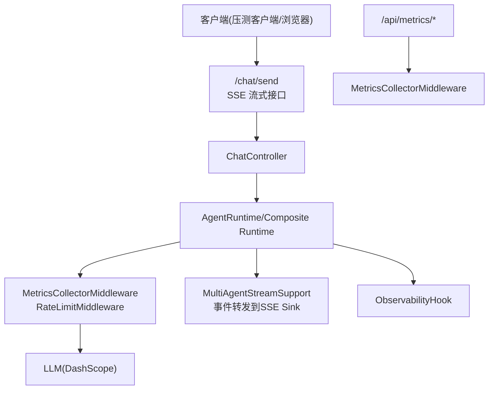
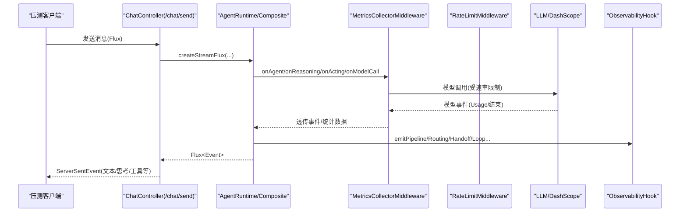
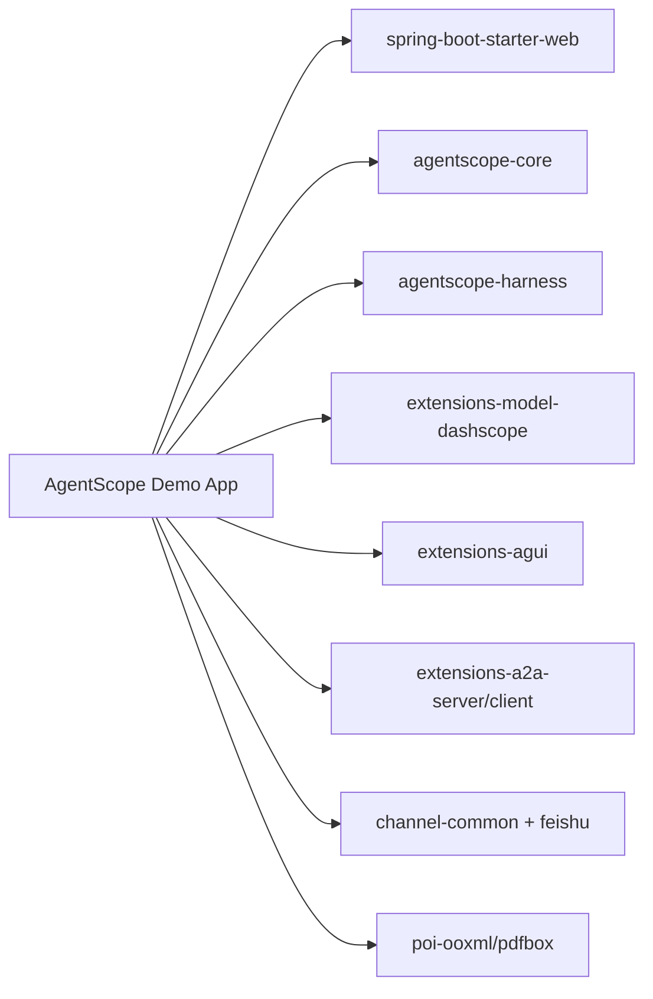

# 性能测试

<cite>
**本文引用的文件**
- [application.yml](file://src/main/resources/application.yml)
- [pom.xml](file://pom.xml)
- [ChatController.java](file://src/main/java/com/skloda/agentscope/controller/ChatController.java)
- [MetricsController.java](file://src/main/java/com/skloda/agentscope/controller/MetricsController.java)
- [MetricsCollectorMiddleware.java](file://src/main/java/com/skloda/agentscope/middleware/MetricsCollectorMiddleware.java)
- [RateLimitMiddleware.java](file://src/main/java/com/skloda/agentscope/middleware/RateLimitMiddleware.java)
- [ObservabilityHook.java](file://src/main/java/com/skloda/agentscope/hook/ObservabilityHook.java)
- [MultiAgentStreamSupportTest.java](file://src/test/java/com/skloda/agentscope/runtime/MultiAgentStreamSupportTest.java)
- [RateLimitMiddlewareTest.java](file://src/test/java/com/skloda/agentscope/middleware/RateLimitMiddlewareTest.java)
</cite>

## 目录
1. [简介](#简介)
2. [项目结构](#项目结构)
3. [核心组件](#核心组件)
4. [架构总览](#架构总览)
5. [详细组件分析](#详细组件分析)
6. [依赖分析](#依赖分析)
7. [性能考量](#性能考量)
8. [故障诊断指南](#故障诊断指南)
9. [结论](#结论)
10. [附录](#附录)

## 简介
本指南面向 AgentScope 演示系统的性能测试，覆盖基准测试、压力测试与性能监控三大主题。目标是在不侵入业务逻辑的前提下，建立可重复的评测体系：定义 KPI 与阈值、设计并发负载模型、实施长时间运行稳定性验证、评估流式响应吞吐与延迟、量化多智能体协作开销，并落地回归检测与容量规划方法。同时结合本项目内置的中间件、端点与钩子，给出数据收集与分析路径。

## 项目结构
该项目为 Spring Boot 3.5 + Java 17 应用，采用 AgentScope 2.x 框架提供 ReAct Agent、SSE 流式事件、多智能体编排能力。关键与性能相关的代码分布如下：
- 入口与接口层：SSE 聊天入口 /chat/send（流式）；指标导出 /api/metrics/*（聚合统计输出与控制）
- 中间件层：指标采集 Middleware、限流 Middleware，埋点于 LLM 调用、工具执行、Agent 生命周期
- 运行时层：流式支持能力（多智能体串/并行/会话流转），将子 Agent 事件转发至 SSE sink
- 可观测性层：ObservabilityHook 暴露统一事件通道，便于外部订阅与追踪

图表来源
- [ChatController.java:117-153](file://src/main/java/com/skloda/agentscope/controller/ChatController.java#L117-L153)
- [MetricsController.java:12-57](file://src/main/java/com/skloda/agentscope/controller/MetricsController.java#L12-L57)
- [MetricsCollectorMiddleware.java:50-162](file://src/main/java/com/skloda/agentscope/middleware/MetricsCollectorMiddleware.java#L50-L162)
- [RateLimitMiddleware.java:31-52](file://src/main/java/com/skloda/agentscope/middleware/RateLimitMiddleware.java#L31-L52)

节来源
- [application.yml:3-41](file://src/main/resources/application.yml#L3-L41)
- [ChatController.java:47-153](file://src/main/java/com/skloda/agentscope/controller/ChatController.java#L47-L153)
- [MetricsController.java:15-57](file://src/main/java/com/skloda/agentscope/controller/MetricsController.java#L15-L57)
- [MetricsCollectorMiddleware.java:21-182](file://src/main/java/com/skloda/agentscope/middleware/MetricsCollectorMiddleware.java#L21-L182)
- [RateLimitMiddleware.java:16-53](file://src/main/java/com/skloda/agentscope/middleware/RateLimitMiddleware.java#L16-L53)

## 核心组件
- ChatController：对外暴露 /chat/send 的 SSE 接口，接收请求后交由 AgentService/Runtime 构建 Flux 流并推回前端。错误与完成事件以统一格式回退保证下游稳定。
- MetricsCollectorMiddleware：对 Agent 调用周期、模型调用、工具调用进行埋点，汇总 Token、耗时、错误与成本估算，并提供全局统计打印与重置端点。
- RateLimitMiddleware：基于滑动窗口限制每分钟 LLM 调用次数，防止突发流量打爆上游服务。
- ObservabilityHook：统一的事件发射器，支持 pipeline/routing/handoff 等多智能体编排阶段的事件外发，便于前端或监控采集。
- MultiAgentStreamSupport：在复杂编排中将子 Agent 事件转译为统一 SSE Map，并优先以 AGENT_RESULT 为准解析最终文本。

节来源
- [ChatController.java:117-153](file://src/main/java/com/skloda/agentscope/controller/ChatController.java#L117-L153)
- [MetricsCollectorMiddleware.java:50-162](file://src/main/java/com/skloda/agentscope/middleware/MetricsCollectorMiddleware.java#L50-L162)
- [RateLimitMiddleware.java:31-52](file://src/main/java/com/skloda/agentscope/middleware/RateLimitMiddleware.java#L31-L52)
- [ObservabilityHook.java:16-67](file://src/main/java/com/skloda/agentscope/hook/ObservabilityHook.java#L16-L67)
- [MultiAgentStreamSupportTest.java:49-109](file://src/test/java/com/skloda/agentscope/runtime/MultiAgentStreamSupportTest.java#L49-L109)

## 架构总览
下图展示了从请求接入到模型调用与事件输出的整体链路，以及压测关注点（延迟、吞吐、错误率、资源使用、Token 与成本）。

图表来源
- [ChatController.java:122-153](file://src/main/java/com/skloda/agentscope/controller/ChatController.java#L122-L153)
- [MetricsCollectorMiddleware.java:50-162](file://src/main/java/com/skloda/agentscope/middleware/MetricsCollectorMiddleware.java#L50-L162)
- [RateLimitMiddleware.java:31-52](file://src/main/java/com/skloda/agentscope/middleware/RateLimitMiddleware.java#L31-L52)
- [ObservabilityHook.java:45-67](file://src/main/java/com/skloda/agentscope/hook/ObservabilityHook.java#L45-L67)

## 详细组件分析

### 流式响应性能测试策略
- 测试目标
  - 首字符时延(TTFB)、端到端延迟、吞吐(QPS)
  - 流式事件抖动、乱序与堆积现象
  - 大对话与长文档场景下的内存/GC 影响
- 方法与步骤
  - 使用支持 SSE 的压测工具（如 wrk/hey/k6）对 /chat/send 发起请求，启用文本事件流接收，计算首字节与完成时间
  - 观察 ChatController 的错误恢复路径，确保失败快速短路且不阻塞后续请求
  - 配合 MetricsController 的 /api/metrics/print 定期快照，对比不同负载下的指标变化
- 参考实现位置
  - ChatController 中创建 Flux 并映射为 SSE 事件，包含异常回退与结束事件处理
  - 指标中间件记录模型调用、工具调用与 Agent 级别的耗时与 Token

节来源
- [ChatController.java:77-105](file://src/main/java/com/skloda/agentscope/controller/ChatController.java#L77-L105)
- [ChatController.java:122-153](file://src/main/java/com/skloda/agentscope/controller/ChatController.java#L122-L153)
- [MetricsController.java:19-41](file://src/main/java/com/skloda/agentscope/controller/MetricsController.java#L19-L41)
- [MetricsCollectorMiddleware.java:61-90](file://src/main/java/com/skloda/agentscope/middleware/MetricsCollectorMiddleware.java#L61-L90)

### 多智能体协作性能分析
- 测试目标
  - 串行/并行/轮询/工作图等多种编排模式的开销
  - 事件合并导致的背压与顺序性问题
  - 子 Agent 最终结果解析与累积文本的一致性
- 方法与步骤
  - 通过组合编排配置驱动不同模式，固定输入与提示，分别测量端到端时延与资源占用
  - 使用 StepVerifier 风格的测试（见 MultiAgentStreamSupportTest）验证事件转发、source 标签、最终文本优先级
  - 在高并发下观察 EventSink/ObservabilityHook 的并发安全与背压
- 参考实现位置
  - MultiAgentStreamSupport 负责事件转发与最终文本解析，测试覆盖正常与异常路径
  - ObservabilityHook 提供 pipeline、routing、handoff、loop、graph 等事件发射

节来源
- [MultiAgentStreamSupportTest.java:49-109](file://src/test/java/com/skloda/agentscope/runtime/MultiAgentStreamSupportTest.java#L49-L109)
- [ObservabilityHook.java:45-67](file://src/main/java/com/skloda/agentscope/hook/ObservabilityHook.java#L45-L67)

### 限流与熔断保护
- 测试目标
  - 验证每分钟调用上限是否生效，超限后 next 不被调用
  - 限流对吞吐的影响及恢复曲线
- 方法与步骤
  - 使用单元测试方式（参考 RateLimitMiddlewareTest）构造高频请求，验证允许与阻塞行为
  - 用压测脚本按不同 RPS 注入流量，记录被丢弃的请求比例与时延分布
- 参考实现位置
  - RateLimitMiddleware 基于滑动时间窗维护最近一分钟的时间戳队列，超出阈值返回空流且不调用 next
  - 单测验证 limit=3 时第4次调用 not invoked 的行为

节来源
- [RateLimitMiddleware.java:31-52](file://src/main/java/com/skloda/agentscope/middleware/RateLimitMiddleware.java#L31-L52)
- [RateLimitMiddlewareTest.java:19-49](file://src/test/java/com/skloda/agentscope/middleware/RateLimitMiddlewareTest.java#L19-L49)

### 指标采集与监控看板
- 测试目标
  - 稳定采集 Token、耗时、错误率与成本估算
  - 可视化展示与告警阈值
- 方法与步骤
  - 启动应用后使用日志聚合系统抓取 METRICS 日志，或定时 POST /api/metrics/print 获取快照
  - 设置 /api/metrics/reset 在每次压测前清零状态，避免历史污染
  - 结合 Prometheus/Grafana（可扩展）对关键 KPI 建模
- 参考实现位置
  - MetricsCollectorMiddleware 在 agent/end、tool、model 等关键点写入 ThreadLocal/AtomicLong 等原子度量
  - MetricsController 提供 print/reset/status 三个端点用于操作与查询

节来源
- [MetricsCollectorMiddleware.java:36-90](file://src/main/java/com/skloda/agentscope/middleware/MetricsCollectorMiddleware.java#L36-L90)
- [MetricsCollectorMiddleware.java:187-214](file://src/main/java/com/skloda/agentscope/middleware/MetricsCollectorMiddleware.java#L187-L214)
- [MetricsController.java:19-57](file://src/main/java/com/skloda/agentscope/controller/MetricsController.java#L19-L57)

## 依赖分析
项目依赖包括 Spring Boot Web/Thymeleaf、AgentScope 全套 Starter/Core/Harness/A2A/AGUI/Channel、POI/PDFBox、Reactor/Test 等。以下关系突出与性能相关的部分：

图表来源
- [pom.xml:28-188](file://pom.xml#L28-L188)

节来源
- [pom.xml:28-188](file://pom.xml#L28-L188)

## 性能考量
- 模型与令牌优化
  - 合理设置 thinking-budget/stream 等开关（见 application.yml 的 agentscope.model.* 字段），控制推理开销与网络往返
  - 通过中间件的 token/cost 统计做容量与成本平衡
- 背压与缓冲
  - Reactor 管道天然具备背压，但需确保外部 IO（LLM、文件解析、知识库检索）不阻塞
  - 文件上传大小受限（multipart.max-file-size）以避免大对象占满堆内存
- 资源与 GC
  - 高吞吐时关注堆使用与 GC 停顿，必要时调大堆或启用 ZGC/G1 参数
  - 长时间运行需关注内存泄漏风险（ThreadLocal 清理已在中间件注意）
- 并发与连接数
  - Tomcat Worker 线程与最大连接数需与压测 QPS 匹配
  - 限流可在峰值期保护下游模型服务

节来源
- [application.yml:6-43](file://src/main/resources/application.yml#L6-L43)
- [MetricsCollectorMiddleware.java:36-90](file://src/main/java/com/skloda/agentscope/middleware/MetricsCollectorMiddleware.java#L36-L90)
- [application.yml:10-12](file://src/main/resources/application.yml#L10-L12)

## 故障诊断指南
- 流式异常处理
  - ChatController 在异常时回退为错误事件并完成流，确保前端能感知失败并恢复
  - 多智能体运行中的 onError 分支会写入 error 事件并继续流程，避免级联崩溃
- 指标与审计
  - 通过 /api/metrics/reset 清零状态开始新测试，通过 /api/metrics/print 获取汇总
  - 检查 METRICS 日志定位耗时突增与错误热点
- 限流判定
  - 确认 RateLimitMiddleware 的 next 未被调用即为被限流；结合日志定位是否触发上限
- 回归检测
  - 使用单测用例约束关键行为（如 RateLimit 阻断、MultiAgent 事件转发），作为 CI 门禁

节来源
- [ChatController.java:148-153](file://src/main/java/com/skloda/agentscope/controller/ChatController.java#L148-L153)
- [MultiAgentStreamSupportTest.java:95-109](file://src/test/java/com/skloda/agentscope/runtime/MultiAgentStreamSupportTest.java#L95-L109)
- [MetricsController.java:19-41](file://src/main/java/com/skloda/agentscope/controller/MetricsController.java#L19-L41)
- [RateLimitMiddleware.java:42-51](file://src/main/java/com/skloda/agentscope/middleware/RateLimitMiddleware.java#L42-L51)

## 结论
通过 ChatController 的 SSE 接口、MetricsCollectorMiddleware 的细粒度埋点、RateLimitMiddleware 的流量整形与 ObservabilityHook 的统一事件通道，本系统具备完整的性能测试基础能力。建议在实际环境中，围绕首字节时延、端到端延迟、QPS、错误率、资源使用与 Token/成本设定明确的 KPI 与阈值，配合自动化压测与监控告警，持续回归性能基线并支撑容量规划。

## 附录

### KPI 与阈值建议（示例）
- 时延类
  - 首字节时延 P95 < 500ms
  - 端到端延迟 P95 < 3s（含长答案场景）
- 吞吐类
  - 稳态 QPS ≥ 目标值（根据 CPU/模型配额估算）
- 可靠性类
  - 错误率 < 1%（不含上游模型降级）
  - 限流命中率：按需调节，不超过期望的阻塞比例
- 资源类
  - 堆内存使用 < 70%，GC 停顿 < 100ms
- 成本类
  - 单会话 Token 成本增长趋势可控

### 环境准备与启动要点
- Java 17+、Maven 3.9+、DashScope API Key
- 默认端口与应用名配置见 application.yml
- 启动命令参见仓库根说明

节来源
- [application.yml:3-12](file://src/main/resources/application.yml#L3-L12)
- [application.yml:26-43](file://src/main/resources/application.yml#L26-L43)

### 压测用例设计模板
- 基准测试
  - 固定输入，逐步提高并发，观察时延与吞吐拐点
- 强度测试
  - 持续拉高并发直至出现资源饱和或错误率上升
- 耐力测试
  - 中等负载运行较长时间，监控内存与 GC 曲线
- 波动测试
  - 流量突增/骤降，检验限流与恢复
- 流式专项
  - 长文本/多图音频、复杂编排场景下，测量事件间隔抖动与丢失

### 如何收集与分析数据
- 接口
  - GET /api/metrics/status 查看可用端点信息
  - POST /api/metrics/print 打印指标到控制台日志
  - POST /api/metrics/reset 重置指标
- 日志
  - 关注 METRICS 日志类别
  - 结合 Spring 日志级别调优
- 事件
  - 通过 ObservabilityHook 的多类事件进行多维度归因（pipeline/roundtable/routing/handoff/loop/graph）

节来源
- [MetricsController.java:19-57](file://src/main/java/com/skloda/agentscope/controller/MetricsController.java#L19-L57)
- [application.yml:81-90](file://src/main/resources/application.yml#L81-L90)
- [ObservabilityHook.java:45-67](file://src/main/java/com/skloda/agentscope/hook/ObservabilityHook.java#L45-L67)