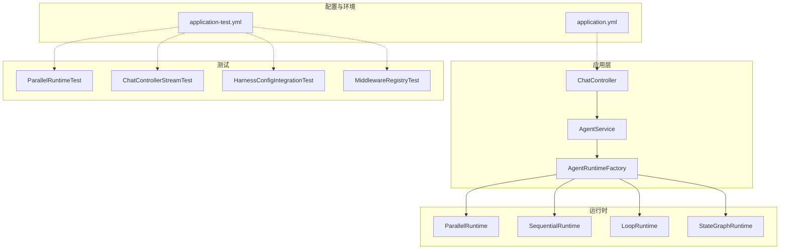
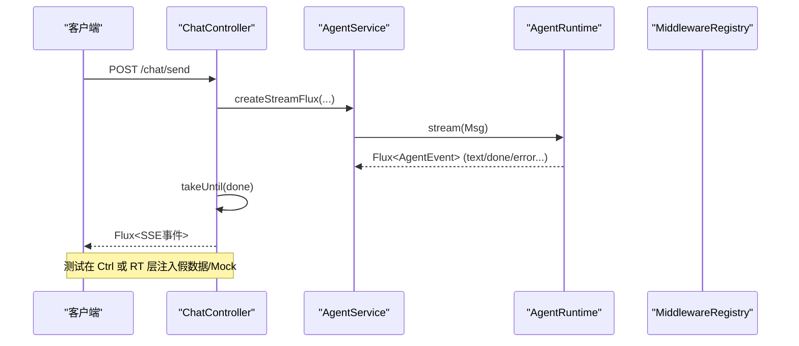
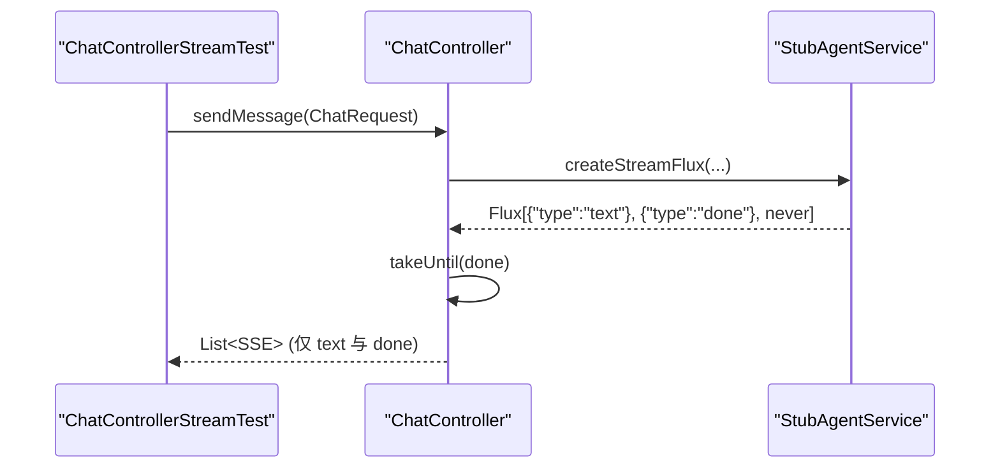
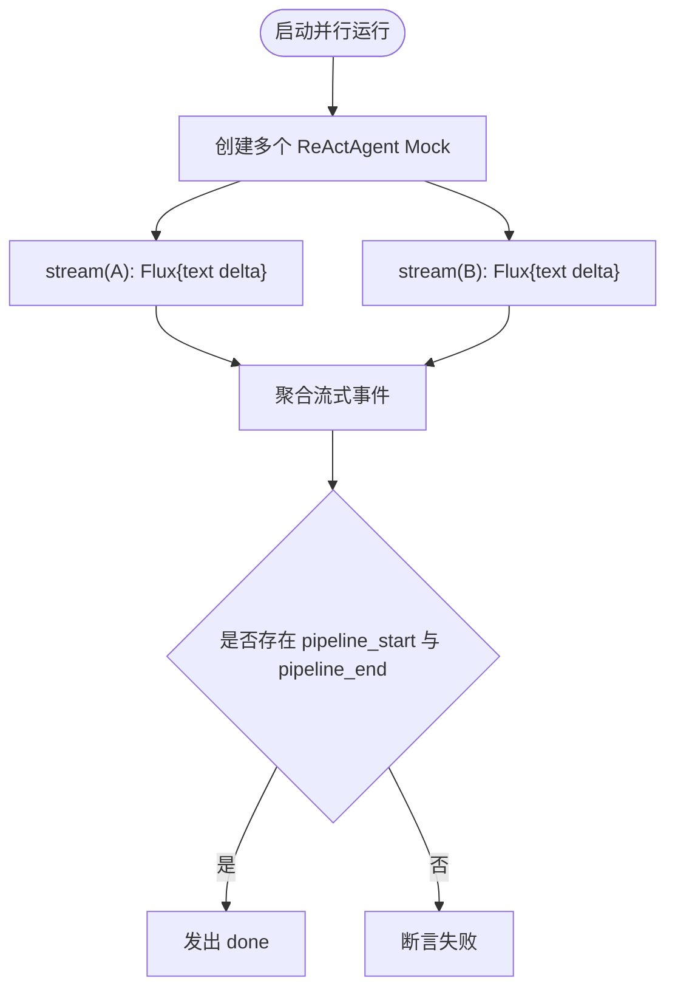
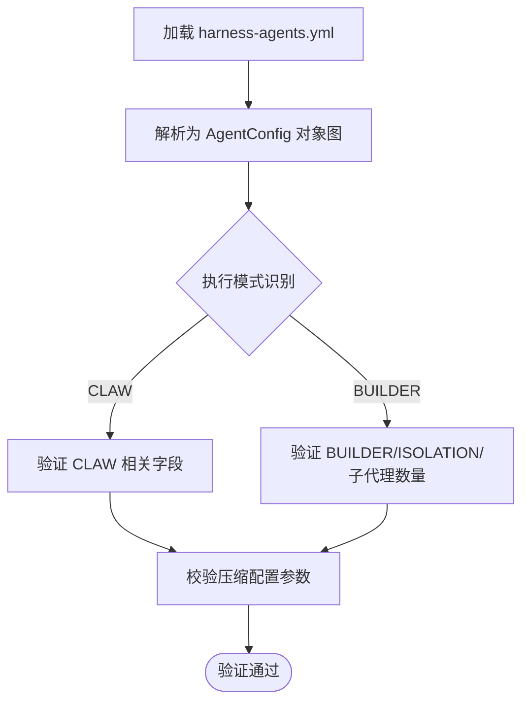
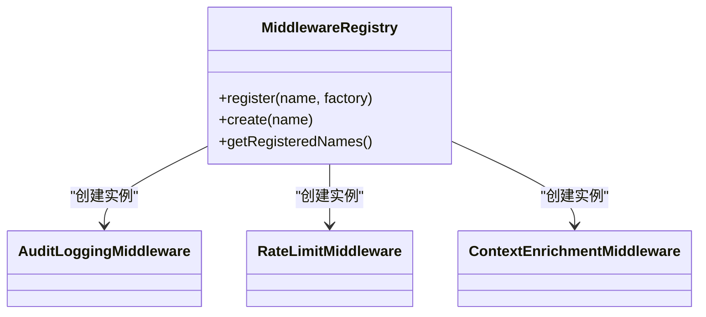
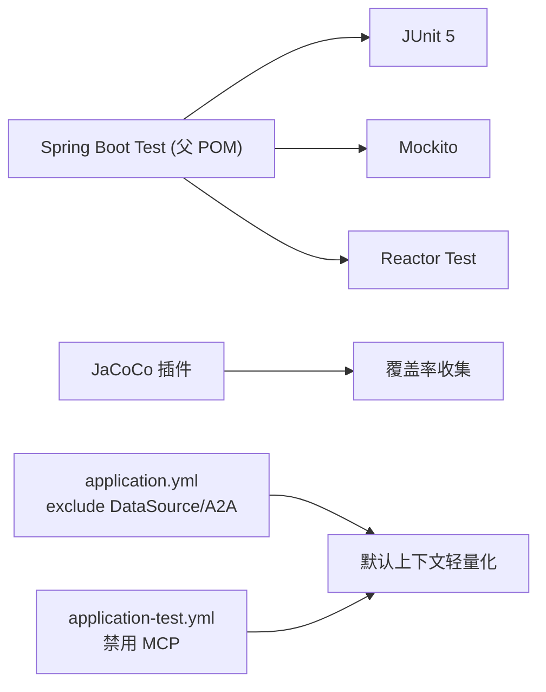

# 测试与质量

<cite>
**本文引用的文件**
- [pom.xml](file://pom.xml)
- [application.yml](file://src/main/resources/application.yml)
- [application-test.yml](file://src/test/resources/application-test.yml)
- [ChatController.java](file://src/main/java/com/skloda/agentscope/controller/ChatController.java)
- [ParallelRuntimeTest.java](file://src/test/java/com/skloda/agentscope/runtime/ParallelRuntimeTest.java)
- [ChatControllerStreamTest.java](file://src/test/java/com/skloda/agentscope/controller/ChatControllerStreamTest.java)
- [HarnessConfigIntegrationTest.java](file://src/test/java/com/skloda/agentscope/harness/HarnessConfigIntegrationTest.java)
- [MiddlewareRegistryTest.java](file://src/test/java/com/skloda/agentscope/middleware/MiddlewareRegistryTest.java)
</cite>

## 目录
1. [简介](#简介)
2. [项目结构](#项目结构)
3. [核心组件](#核心组件)
4. [架构总览](#架构总览)
5. [详细组件分析](#详细组件分析)
6. [依赖关系分析](#依赖关系分析)
7. [性能考量](#性能考量)
8. [故障排查指南](#故障排查指南)
9. [结论](#结论)
10. [附录](#附录)

## 简介
本指南面向 AgentScope Demo 项目的测试与质量保证实践，聚焦以下目标：
- 单元测试：策略设计、Mock 使用、异步流式交互的断言方式
- 集成测试：端到端流程、配置驱动验证、外部服务隔离
- 性能测试：基准方法与回归基线
- 回归测试：自动化回归用例组织与触发策略
- 环境管理：测试配置、数据库准备与外部服务模拟
- 质量门禁：覆盖率报告、静态分析与依赖漏洞扫描
- 持续集成：流水线设计与结果度量指标

该仓库已具备较完整的测试覆盖（JUnit 5 + Mockito + Reactor Test），并配置了 JaCoCo 覆盖率插件；通过 Spring Profile 与独立测试 profile 实现了环境与外部依赖解耦。

**章节来源**
- [pom.xml:175-187](file://pom.xml#L175-L187)
- [pom.xml:225-230](file://pom.xml#L225-L230)
- [application.yml:13-23](file://src/main/resources/application.yml#L13-L23)
- [application-test.yml:1-9](file://src/test/resources/application-test.yml#L1-L9)

## 项目结构
本项目采用分层组织结构，并按领域/能力切分测试目录，测试代码位于 src/test/java，对应主代码模块分布；测试资源文件集中于 src/test/resources，用于提供测试运行所需的配置与环境开关。

- 控制器层：ChatController、KnowledgeController、WorkflowController 等均有对应的测试类
- 运行时层：各类 Runtime（Sequential/Parallel/Loop/StateGraph）配有专门的单元测试，利用 Mock 控制底层 ReActAgent 的流式事件
- 中间件层：MiddlewareRegistry 及具体 Middleware 实现有配套测试，验证注册与生命周期
- Harness 集成：以 YAML 配置驱动的对象校验与组合逻辑，由 HarnessConfigIntegrationTest 等进行解析验证
- 工具层：文档解析、报表生成等 Tool 类均有边界与异常用例的单元测试

**图示来源**
- [ChatController.java:117-153](file://src/main/java/com/skloda/agentscope/controller/ChatController.java#L117-L153)
- [ParallelRuntimeTest.java:29-59](file://src/test/java/com/skloda/agentscope/runtime/ParallelRuntimeTest.java#L29-L59)
- [ChatControllerStreamTest.java:20-39](file://src/test/java/com/skloda/agentscope/controller/ChatControllerStreamTest.java#L20-L39)
- [HarnessConfigIntegrationTest.java:18-62](file://src/test/java/com/skloda/agentscope/harness/HarnessConfigIntegrationTest.java#L18-L62)
- [MiddlewareRegistryTest.java:17-52](file://src/test/java/com/skloda/agentscope/middleware/MiddlewareRegistryTest.java#L17-L52)

**章节来源**
- [pom.xml:28-187](file://pom.xml#L28-L187)
- [application.yml:1-87](file://src/main/resources/application.yml#L1-L87)
- [application-test.yml:1-9](file://src/test/resources/application-test.yml#L1-L9)

## 核心组件
- 响应式聊天入口：控制器将请求转为 Flux 流，并在遇到 done 时及时关闭流，防止挂起会话
- 多智能体运行时：ParallelRuntime/SequentialRuntime/LoopRuntime/StateGraphRuntime 组合并转发流式事件，保障契约事件序列（pipeline_start/end, done 等）
- 配置验证：Harness 配置以 YAML 驱动，测试确保不同模式（CLAW/BUILDER）与子代理集合正确解析
- 中间件注册：MiddlewareRegistry 支持按名称创建中间件，测试覆盖自动装配与未知 key 行为

这些组件共同构成 Agent 的执行链路和可观测性通道，测试围绕“输入—事件流—输出/终止”进行建模与断言。

**章节来源**
- [ChatController.java:117-153](file://src/main/java/com/skloda/agentscope/controller/ChatController.java#L117-L153)
- [ParallelRuntimeTest.java:29-59](file://src/test/java/com/skloda/agentscope/runtime/ParallelRuntimeTest.java#L29-L59)
- [HarnessConfigIntegrationTest.java:18-62](file://src/test/java/com/skloda/agentscope/harness/HarnessConfigIntegrationTest.java#L18-L62)
- [MiddlewareRegistryTest.java:17-52](file://src/test/java/com/skloda/agentscope/middleware/MiddlewareRegistryTest.java#L17-L52)

## 架构总览
下图展示了从 HTTP 请求到流式 SSE 返回的主路径，并标注关键测试点：流完成断言、并行流聚合、配置驱动验证与中间件链构建。

**图示来源**
- [ChatController.java:122-153](file://src/main/java/com/skloda/agentscope/controller/ChatController.java#L122-L153)
- [ChatControllerStreamTest.java:20-39](file://src/test/java/com/skloda/agentscope/controller/ChatControllerStreamTest.java#L20-L39)
- [ParallelRuntimeTest.java:29-59](file://src/test/java/com/skloda/agentscope/runtime/ParallelRuntimeTest.java#L29-L59)

**章节来源**
- [ChatController.java:117-153](file://src/main/java/com/skloda/agentscope/controller/ChatController.java#L117-L153)
- [ChatControllerStreamTest.java:20-39](file://src/test/java/com/skloda/agentscope/controller/ChatControllerStreamTest.java#L20-L39)
- [ParallelRuntimeTest.java:29-59](file://src/test/java/com/skloda/agentscope/runtime/ParallelRuntimeTest.java#L29-L59)

## 详细组件分析

### 控制器层与响应式流测试
- 目的：验证 /chat/send 接口在收到 “done” 后及时结束流，避免前端悬挂；同时验证错误恢复路径
- 方法：构造 StubAgentService，向 Flux 中注入文本块与 “done” 信号，再附加永不完成的流片段，以确保 takeUntil 生效且不会阻塞
- 关键点：SSE 序列化异常回退到统一 error 事件；对超时采用 assertTimeoutPreemptively 保护测试稳定性

**图示来源**
- [ChatControllerStreamTest.java:20-39](file://src/test/java/com/skloda/agentscope/controller/ChatControllerStreamTest.java#L20-L39)
- [ChatController.java:122-153](file://src/main/java/com/skloda/agentscope/controller/ChatController.java#L122-L153)

**章节来源**
- [ChatControllerStreamTest.java:20-39](file://src/test/java/com/skloda/agentscope/controller/ChatControllerStreamTest.java#L20-L39)
- [ChatController.java:117-153](file://src/main/java/com/skloda/agentscope/controller/ChatController.java#L117-L153)

### 并行运行时与事件聚合
- 目的：验证 ParallelRuntime 并发执行多个子代理，将各自的 text delta 汇聚为最终合并内容，同时维持 pipeline_start/end 与 done 契约顺序
- 方法：使用 Mock ReActAgent 返回包含 TextBlockDeltaEvent 的 Flux，观察事件列表是否包含预期 agent 标题与顺序事件
- 关键点：保证流式事件不丢失，且在并行场景下仍能按合同维护全局状态切换

**图示来源**
- [ParallelRuntimeTest.java:29-59](file://src/test/java/com/skloda/agentscope/runtime/ParallelRuntimeTest.java#L29-L59)

**章节来源**
- [ParallelRuntimeTest.java:29-59](file://src/test/java/com/skloda/agentscope/runtime/ParallelRuntimeTest.java#L29-L59)

### 配置驱动与 Harness 集成验证
- 目的：验证 harness-agents.yml 配置能正确映射为 AgentConfig，含执行模式（CLAW/BUILDER）、隔离域、压缩配置与子代理集合
- 方法：构造等价对象图模拟 YAML 结构，使用断言检查关键字段
- 关键点：YAML 解析与运行时装配的一致性是集成稳定性的基础

**图示来源**
- [HarnessConfigIntegrationTest.java:18-62](file://src/test/java/com/skloda/agentscope/harness/HarnessConfigIntegrationTest.java#L18-L62)
- [HarnessConfigIntegrationTest.java:65-73](file://src/test/java/com/skloda/agentscope/harness/HarnessConfigIntegrationTest.java#L65-L73)

**章节来源**
- [HarnessConfigIntegrationTest.java:18-73](file://src/test/java/com/skloda/agentscope/harness/HarnessConfigIntegrationTest.java#L18-L73)

### 中间件注册与生命周期
- 目的：验证 MiddlewareRegistry 的动态注册、查找与名称枚举能力，并确认未知 key 返回空的安全语义
- 方法：注册若干中间件工厂，断言可被创建、名称列表正确；测试 autoRegistration 场景

**图示来源**
- [MiddlewareRegistryTest.java:17-52](file://src/test/java/com/skloda/agentscope/middleware/MiddlewareRegistryTest.java#L17-L52)

**章节来源**
- [MiddlewareRegistryTest.java:17-52](file://src/test/java/com/skloda/agentscope/middleware/MiddlewareRegistryTest.java#L17-L52)

### 异步测试处理方法总结
- 断言完成：使用 takeUntil("done") 保证流在业务完成后结束，配合 Reactor Test 的 blockLast/collectList
- 避免长事务：注入永不完成的后段流以验证 takeUntil 的有效性，避免测试挂起
- Mock 事件：基于 ReActAgent.streamEvents 返回固定 Flux，控制输入事件集便于稳定断言
- 超时时限：使用 JUnit 5 的超时时限保护测试不受外部环境波动影响

**章节来源**
- [ChatControllerStreamTest.java:20-39](file://src/test/java/com/skloda/agentscope/controller/ChatControllerStreamTest.java#L20-L39)
- [ParallelRuntimeTest.java:29-59](file://src/test/java/com/skloda/agentscope/runtime/ParallelRuntimeTest.java#L29-L59)

## 依赖关系分析
- 测试框架：JUnit 5 + Mockito + Reactor Test（通过 spring-boot-starter-test 引入）
- 覆盖率：JaCoCo Maven 插件
- 应用默认启用 DataSource/A2A 自动配置排除，减少测试环境的外部耦合
- 测试 profile：application-test.yml 禁用 MCP，使 CI 无需 Node 即可执行

**图示来源**
- [pom.xml:175-187](file://pom.xml#L175-L187)
- [pom.xml:225-230](file://pom.xml#L225-L230)
- [application.yml:13-23](file://src/main/resources/application.yml#L13-L23)
- [application-test.yml:1-9](file://src/test/resources/application-test.yml#L1-L9)

**章节来源**
- [pom.xml:175-187](file://pom.xml#L175-L187)
- [pom.xml:225-230](file://pom.xml#L225-L230)
- [application.yml:13-23](file://src/main/resources/application.yml#L13-L23)
- [application-test.yml:1-9](file://src/test/resources/application-test.yml#L1-L9)

## 性能考量
- 流式处理：测试通过有限事件集合模拟长连接，降低网络与 LLM 调用开销
- 资源占用：避免在单测中真实建立 DB/Redis/外部 MCP，保持快速反馈
- 基准建议：对热路径（AgentRuntime 合并事件、SSE 序列化）增加简单计时断言或微基准样例（例如 JMH），并以 PR 形式引入回归阈值
- 回归基线：首次提交 baseline，后续比较耗时与内存峰值，超过阈值的变更需说明原因

[本节为通用建议，不直接引用具体文件]

## 故障排查指南
- 流悬挂问题：若前端/客户端侧卡住，优先检查控制器的 takeUntil(done) 逻辑与上游流是否过早结束或从不结束
- 串行化异常：SSE 发送前会捕获并转换为 error 事件，关注日志与 error 分支的断言
- 配置驱动不一致：如 Harness 模式下未解析出子代理或模式错配，检查 YAML 键名与测试构造图的一致性
- 中间件不可用：若中间件未生效，检查是否在 Registry 中正确注册并被组装进运行时链

**章节来源**
- [ChatController.java:122-153](file://src/main/java/com/skloda/agentscope/controller/ChatController.java#L122-L153)
- [MiddlewareRegistryTest.java:26-30](file://src/test/java/com/skloda/agentscope/middleware/MiddlewareRegistryTest.java#L26-L30)
- [HarnessConfigIntegrationTest.java:18-62](file://src/test/java/com/skloda/agentscope/harness/HarnessConfigIntegrationTest.java#L18-L62)

## 结论
本项目已形成覆盖单元、集成与配置的完整测试体系：
- 使用 Mock 隔离外部系统，专注核心运行时与控制器的行为验证
- 借助 Reactor Test 与超时保护，可靠地测试流式 SSE 的生命周期
- 通过 application/profile 机制屏蔽外部依赖，提升测试稳定性与速度
- 配置覆盖率插件，为后续质量门禁与流水线集成奠定基础

建议在 CI 中逐步加入覆盖率阈值、静态分析与依赖漏洞扫描，形成端到端的质量门禁。

[本节为总结，不直接引用具体文件]

## 附录

### 测试类型与覆盖要点速览
- 单元测试
  - 控制器：SSE 流的生命周期与错误回退
  - 运行时：并发/串行/循环/状态机的事件契约
  - 工具：边界与异常分支
  - 中间件：注册、查找、名称枚举
- 集成测试
  - 配置驱动：Harness YAML → AgentConfig/HarnessConfig 映射
  - 环境：默认无 DB/A2A，MCP 禁用
- 性能/回归
  - 以最小数据集构建基线，监控耗时与内存
  - 对合并逻辑与 SSE 序列化路径做专项回归

[本节为概览，不直接引用具体文件]