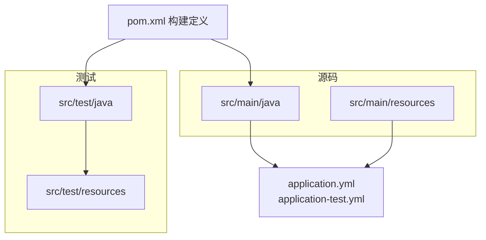
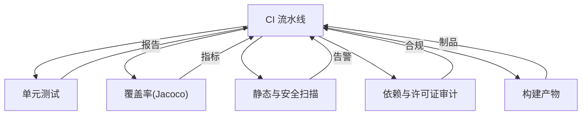

# 质量门禁

<cite>
**本文引用的文件**
- [pom.xml](file://pom.xml)
- [application.yml](file://src/main/resources/application.yml)
- [application-test.yml](file://src/test/resources/application-test.yml)
- [AGENTS.md](file://AGENTS.md)
- [README.md](file://README.md)
- [ChatController.java](file://src/main/java/com/skloda/agentscope/controller/ChatController.java)
- [KnowledgeController.java](file://src/main/java/com/skloda/agentscope/controller/KnowledgeController.java)
- [WorkflowController.java](file://src/main/java/com/skloda/agentscope/controller/WorkflowController.java)
- [AgentScopeDemoApplicationTest.java](file://src/test/java/com/skloda/agentscope/AgentScopeDemoApplicationTest.java)
- [FileSignatureValidatorTest.java](file://src/test/java/com/skloda/agentscope/controller/FileSignatureValidatorTest.java)
- [ChatControllerStreamTest.java](file://src/test/java/com/skloda/agentscope/controller/ChatControllerStreamTest.java)
- [ChatControllerSamplePromptTest.java](file://src/test/java/com/skloda/agentscope/controller/ChatControllerSamplePromptTest.java)
- [WorkflowControllerTest.java](file://src/test/java/com/skloda/agentscope/controller/WorkflowControllerTest.java)
- [ApprovalMiddlewareTest.java](file://src/test/java/com/skloda/agentscope/middleware/ApprovalMiddlewareTest.java)
- [AuditLoggingMiddlewareTest.java](file://src/test/java/com/skloda/agentscope/middleware/AuditLoggingMiddlewareTest.java)
- [RateLimitMiddlewareTest.java](file://src/test/java/com/skloda/agentscope/middleware/RateLimitMiddlewareTest.java)
- [ContextEnrichmentMiddlewareTest.java](file://src/test/java/com/skloda/agentscope/middleware/ContextEnrichmentMiddlewareTest.java)
- [MiddlewareRegistryTest.java](file://src/test/java/com/skloda/agentscope/middleware/MiddlewareRegistryTest.java)
- [KnowledgePropertiesTest.java](file://src/test/java/com/skloda/agentscope/service/KnowledgePropertiesTest.java)
- [XlsxParserToolTest.java](file://src/test/java/com/skloda/agentscope/tool/XlsxParserToolTest.java)
</cite>

## 目录
1. [引言](#引言)
2. [项目结构](#项目结构)
3. [核心组件](#核心组件)
4. [架构总览](#架构总览)
5. [详细组件分析](#详细组件分析)
6. [依赖分析](#依赖分析)
7. [性能与质量阈值](#性能与质量阈值)
8. [故障排查指南](#故障排查指南)
9. [结论](#结论)
10. [附录：流水线与落地清单](#附录：流水线与落地清单)

## 引言
本章节面向代码质量保证与持续交付的质量门禁体系。目标包括：统一代码审查流程与标准、静态代码分析配置、测试覆盖率与失败策略、安全漏洞扫描与许可证合规、构建产物质量、提交触发与报告归档等。本文基于现有项目的Maven构建、Spring Boot工程结构和测试基线，给出可落地的CI/CD方案与度量指标建议，并配合可视化流程图帮助理解全链路。

## 项目结构
本项目为 Spring Boot 3.5.14 + Java 17 的 Maven 多模块应用（当前单模块），使用 Maven 进行构建，测试基于 Spring Boot Test 与 JUnit 5；应用资源通过 application*.yml 管理，测试在独立的 test 资源目录提供最小化上下文。



图表来源
- [pom.xml:1-26](file://pom.xml#L1-L26)
- [application.yml](file://src/main/resources/application.yml)
- [application-test.yml:1-8](file://src/test/resources/application-test.yml#L1-L8)

章节来源
- [README.md:65-83](file://README.md#L65-L83)
- [AGENTS.md:9-23](file://AGENTS.md#L9-L23)

## 核心组件
围绕质量门禁的关键点：
- 构建与依赖：Maven POM 管理依赖与插件阶段；当前已包含 Jacoco 插件配置项。
- 运行时控制器与安全：对外提供的接口集中在 controller 包，涉及文件上传、下载、工作流执行等入口，是安全校验和限流的重点区域。
- 可观测与中间件：中间件用于审计、审批、限流与上下文注入，构成请求侧的质量与安全护栏。
- 测试覆盖：针对控制器、工具、服务、中间件均有单元测试，便于在 CI 中作为门禁门槛。

章节来源
- [pom.xml:28-188](file://pom.xml#L28-L188)
- [pom.xml:190-200](file://pom.xml#L190-L200)

## 架构总览
下图展示一次“从提交到发布”的典型质量门禁流水（概念图），体现分支保护、静态检查、单元测试、覆盖率门禁、安全扫描与制品验证各阶段的协作关系。

```mermaid
sequenceDiagram
    participant Dev as "开发者"
    participant PR as "仓库分支/PR"
    participant CI as "CI 流水线"
    participant Test as "单元测试(JUnit)"
    participant Coverage as "覆盖率(Jacoco)"
    participant SAST as "静态与安全扫描"
    participant Audit as "许可证与依赖审计"
    participant Build as "构建与打包"
    Report["质量报告归档"]

    Dev->>PR: "push/PR 触发流水线"
    PR->>CI: "启动流水线"
    CI->>Build: "clean compile package"
    CI->>Test: "运行测试用例"
    Test-->>CI: "测试结果"
    CI->>Coverage: "生成覆盖率"
    Coverage-->>CI: "覆盖率指标"
    CI->>SAST: "SonarQube/SCA/Docker 镜像扫描"
    SAST-->>CI: "缺陷与安全信息"
    CI->>Audit: "许可证与依赖合规检查"
    Audit-->>CI: "审计报告"
    CI-->>Report: "汇总报告并存档"
    CI-->>PR: "返回状态(通过/失败)"
```

[此图为概念性流程，不直接映射具体源码文件]

## 详细组件分析

### 1) 代码审查流程与标准
- 建议策略
  - 分支保护：主分支禁止直接推送，仅允许通过 Pull Request 合并。
  - 模板化 Review：强制要求变更说明、影响面评估、自测结果、回归策略。
  - 质量检查：Review 前需本地通过测试与覆盖率门槛（例如覆盖率≥80%）。
  - 关注点：业务逻辑正确性、接口稳定性、权限与输入校验、异常处理与可观测日志。
- 关键实践
  - 对 Controller 层：重点审查路径参数、上传文件类型、大小限制、路径穿越、签名校验、越权访问。
  - 对工具与服务：重点审查外部库调用边界、错误回退、并发与资源释放。
  - 对中间件：重点审查审批流、审计追踪、速率限制策略的生效位置与幂等性。

章节来源
- [ChatController.java](file://src/main/java/com/skloda/agentscope/controller/ChatController.java)
- [KnowledgeController.java](file://src/main/java/com/skloda/agentscope/controller/KnowledgeController.java)
- [WorkflowController.java](file://src/main/java/com/skloda/agentscope/controller/WorkflowController.java)

### 2) 静态代码分析与代码风格检查
- 推荐配置
  - Checkstyle：强制执行编码规范（命名、导入、注释密度、循环复杂度等）。
  - PMD：检测重复代码、潜在错误与坏味道。
  - SpotBugs：检测常见运行时隐患与内存风险。
  - 集成方式：将 checkstyle/pmd/spotbugs 配置写入 POM，绑定至 verify 阶段，违反规则即失败。
- 与现有工程的结合
  - 在 Maven 的 <build><plugins> 中添加上述插件，并在默认生命周期内执行；同时可与 SonarQube 集成做更深入的规则集配置。
  - 对于前端/文档未在当前仓库中体现的部分，可通过额外步骤在 CI 中对静态分析产物进行聚合。

[本节为通用实施建议，不直接引用源码]

### 3) 测试覆盖率要求
- 现状
  - 当前工程在 POM 中包含 Jacoco 插件相关配置（位于 <build><plugins> 下），可用于收集测试覆盖率数据并上报。
  - 测试类广泛分布于 controller、middleware、service、tool 等目录下，形成覆盖核心功能的验证网络。
- 建议门槛
  - 单元测试：行覆盖率≥80%，分支覆盖率≥70%（可根据模块特性逐步提高）。
  - 关键模块：认证授权、文件上传/下载、工作流编排等高风险域，覆盖率目标可更高。
- 失败阻止
  - 当覆盖率低于阈值或测试用例失败时，CI 应直接失败，阻断合并与发布。

章节来源
- [pom.xml:190-200](file://pom.xml#L190-L200)
- [AgentScopeDemoApplicationTest.java:21-27](file://src/test/java/com/skloda/agentscope/AgentScopeDemoApplicationTest.java#L21-L27)
- [ChatControllerStreamTest.java](file://src/test/java/com/skloda/agentscope/controller/ChatControllerStreamTest.java)
- [WorkflowControllerTest.java](file://src/test/java/com/skloda/agentscope/controller/WorkflowControllerTest.java)
- [ApprovalMiddlewareTest.java:12](file://src/test/java/com/skloda/agentscope/middleware/ApprovalMiddlewareTest.java#L12)
- [AuditLoggingMiddlewareTest.java:3](file://src/test/java/com/skloda/agentscope/middleware/AuditLoggingMiddlewareTest.java#L3)
- [RateLimitMiddlewareTest.java:3](file://src/test/java/com/skloda/agentscope/middleware/RateLimitMiddlewareTest.java#L3)
- [ContextEnrichmentMiddlewareTest.java:2](file://src/test/java/com/skloda/agentscope/middleware/ContextEnrichmentMiddlewareTest.java#L2)
- [MiddlewareRegistryTest.java:4](file://src/test/java/com/skloda/agentscope/middleware/MiddlewareRegistryTest.java#L4)
- [KnowledgePropertiesTest.java:8](file://src/test/java/com/skloda/agentscope/service/KnowledgePropertiesTest.java#L8)
- [XlsxParserToolTest.java:2](file://src/test/java/com/skloda/agentscope/tool/XlsxParserToolTest.java#L2)

### 4) 代码风格检查（Checkstyle）
- 建议规则
  - 基础约束：编码、缩进、括号、空行、import 顺序。
  - 语义约束：类/方法复杂度上限、NPath 复杂度、过长方法。
  - 输出：生成 HTML/文本报告，上传至 CI 工件。
- 集成要点
  - 在 Maven build 阶段引入 checkstyle 插件，并将 checkstyle:check 绑定到 verify。
  - 对违反规则的提交，CI 直接失败。

[本节为通用实施建议，不直接引用源码]

### 5) 安全漏洞扫描与依赖治理
- 组件与依赖扫描（SCA）
  - 使用 OWASP Dependency-Check 或同级别工具，检测第三方依赖已知漏洞。
  - 将扫描嵌入 CI，设置严重/高危漏洞失败策略。
- 容器镜像扫描（如适用）
  - 若后续采用容器化部署，需在构建镜像后执行镜像安全扫描。
- 许可证合规
  - 审计第三方组件的许可证，拒绝 AGPL 等强传染性协议进入主分支，确保符合企业合规要求。
- 敏感信息与输入校验
  - 针对文件上传、路径解析、内容类型白名单，增加严格校验与签名校验。
  - 示例参考：文件签名校验测试覆盖了危险行为与格式白名单策略。

章节来源
- [FileSignatureValidatorTest.java:12](file://src/test/java/com/skloda/agentscope/controller/FileSignatureValidatorTest.java#L12)
- [ChatController.java](file://src/main/java/com/skloda/agentscope/controller/ChatController.java)
- [KnowledgeController.java](file://src/main/java/com/skloda/agentscope/controller/KnowledgeController.java)
- [WorkflowController.java](file://src/main/java/com/skloda/agentscope/controller/WorkflowController.java)

### 6) 中间件：审批、审计、限流与上下文
- 审批（Approval）：在关键操作（如文件导出、批量任务）前插入人工/系统审批流。
- 审计（Audit）：记录关键操作轨迹，支持事后追溯与问题定位。
- 限流（Rate Limit）：避免恶意流量与瞬时高并发导致服务不可用。
- 上下文增强：统一注入租户、用户等信息，便于追踪与权限控制。
- 建议准入要求：以上中间件均需具备完善的测试用例，并在 CI 中确保至少通过冒烟测试。

章节来源
- [ApprovalMiddlewareTest.java:12](file://src/test/java/com/skloda/agentscope/middleware/ApprovalMiddlewareTest.java#L12)
- [AuditLoggingMiddlewareTest.java:3](file://src/test/java/com/skloda/agentscope/middleware/AuditLoggingMiddlewareTest.java#L3)
- [RateLimitMiddlewareTest.java:3](file://src/test/java/com/skloda/agentscope/middleware/RateLimitMiddlewareTest.java#L3)
- [ContextEnrichmentMiddlewareTest.java:2](file://src/test/java/com/skloda/agentscope/middleware/ContextEnrichmentMiddlewareTest.java#L2)
- [MiddlewareRegistryTest.java:4](file://src/test/java/com/skloda/agentscope/middleware/MiddlewareRegistryTest.java#L4)

### 7) 构建产物质量保证
- 版本与一致性
  - 版本号、构建时间、Git commit 信息固化到 manifest 或制品标签中，便于溯源。
- 校验与归档
  - 产物需附带 checksum；测试报告、覆盖率报表、安全扫描报告随制品一并归档。
- 可重复构建
  - 固定依赖版本，离线构建可选缓存以提升稳定性与速度。

章节来源
- [pom.xml:1-26](file://pom.xml#L1-L26)

### 8) 持续集成流水线搭建指南
- 触发机制
  - 分支保护：只在 main 与 develop 分支或 PR 上触发完整门禁。
  - 触发点：push 事件与 pull_request 事件。
- 阶段设计
  - Stage 1：依赖下载与编译（fail-fast）
  - Stage 2：静态代码分析（Checkstyle/PMD/SpotBugs）
  - Stage 3：单元测试与覆盖率上报（JUnit + Jacoco）
  - Stage 4：依赖安全扫描（Dependency-Check 等）
  - Stage 5：构建与归档制品（Jar/War）
  - Stage 6：质量报告聚合与通知
- 质量阈值与失败策略
  - 任何阶段失败均应立即中断后续流程并标记失败，拒绝合并。
  - 覆盖率低于阈值、存在高危漏洞、出现严重代码异味均视为失败。
- 报告归档
  - 所有报告以构建工件形式保留，便于回溯与分析。

[本节为通用实施建议，不直接引用源码]

### 9) 依赖安全检查与许可证合规验证
- 漏洞检查
  - 使用 SC A 工具建立规则集（仅告警/失败分级），对新引入依赖严格把关。
- 许可证策略
  - 白名单+黑名单双控，对 AGPL/LGPL/GPL 等进行专项评审。
- 供应链安全
  - 锁定 major/minor/patch 版本，定期复扫。

[本节为通用实施建议，不直接引用源码]

### 10) 提交触发与自动化测试执行、质量报告生成
- 本地开发
  - 建议在提交前本地执行 mvn verify，保证基本质量达标后再 push。
- 自动化
  - CI 中运行测试并生成 XML/HTML 报告；结合 SonarQube 或平台原生报告能力展示趋势与问题分布。
  - 对关键路径（如文件上传、路由、审批）优先保障用例与断言完备。

章节来源
- [README.md:71-83](file://README.md#L71-L83)
- [AGENTS.md:9-23](file://AGENTS.md#L9-L23)
- [application-test.yml:1-8](file://src/test/resources/application-test.yml#L1-L8)

## 依赖分析
下图展示“质量门禁”与核心子系统的关联关系：CI 流水线作为主控者，驱动测试、覆盖率、静态分析与安全审计，最终汇聚为一份可审计的质量报告。



图表来源
- [pom.xml:190-200](file://pom.xml#L190-L200)

章节来源
- [pom.xml:28-188](file://pom.xml#L28-L188)

## 性能与质量阈值
- 建议起步阈值（可按模块调整）
  - 单元用例通过率：100%
  - 覆盖率：行覆盖率 ≥ 80%，分支覆盖率 ≥ 70%
  - 静态分析：零 Critical/Major 问题；Minor 数量趋降
  - 安全扫描：无 High/Critical 漏洞
  - 依赖许可证：无违规许可证
- 熔断策略
  - 任一阈值未达成则阻断合并；修复后重新触发验证。

[本节为通用指导，不直接引用源码]

## 故障排查指南
- 常见问题定位思路
  - 测试失败：依据 CI 测试日志快速定位失败用例；必要时使用 IDE 单测调试。
  - 覆盖率不足：针对新增/修改代码补写用例；优先保证关键分支与异常路径。
  - 静态分析报错：按报告逐条修复；如确属误报，添加抑制并留存理由。
  - 安全漏洞：优先升级受影响组件版本或替代库；无法修复时使用风险接受流程登记。
  - 依赖/许可证：选择兼容且合规的替代版本；记录评审意见。
- 与项目相关的注意事项
  - 应用测试环境通过 application-test.yml 屏蔽了 MCP 与 demo 组件，以避免在 CI 中引入额外依赖；这有助于稳定测试执行。
  - 对于文件上传/下载等功能，需重点验证文件签名、白名单与路径穿越防护。

章节来源
- [application-test.yml:1-8](file://src/test/resources/application-test.yml#L1-L8)
- [FileSignatureValidatorTest.java:12](file://src/test/java/com/skloda/agentscope/controller/FileSignatureValidatorTest.java#L12)

## 结论
通过将静态检查、单元测试、覆盖率、安全扫描与许可证合规纳入统一的 CI/CD 流水线，可以显著提升代码质量与安全性。结合分支保护、严格的失败阻止策略与可回溯的质量报告，能建立起可靠的质量门禁，确保每次交付都达到团队共识的标准。建议以“小步快跑、逐步提升阈值”的方式推进，先保底线再提上限，兼顾效率与质量。

## 附录：流水线与落地清单
- 必做项
  - 分支保护与 PR 评审
  - 静态代码分析（Checkstyle/PMD/SpotBugs）
  - 单元测试与覆盖率上报（Jacoco）
  - 依赖漏洞扫描与许可证合规检查
  - 构建产物与质量报告归档
- 选做项
  - SonarQube 深度扫描与质量快照
  - 容器镜像扫描（如采用容器化部署）
  - API 契约测试与兼容性门禁
- 验收标准
  - 无 Critical/Major 静态问题
  - 无 High/Critical 安全漏洞
  - 覆盖率达标且测试通过率 100%
  - 构建产物可追溯、可还原

[本节为通用指导，不直接引用源码]