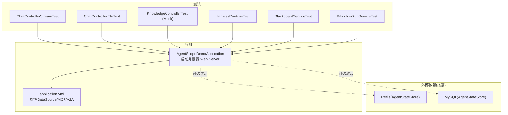
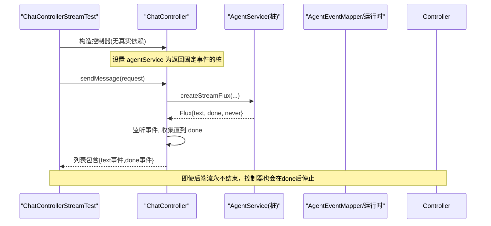
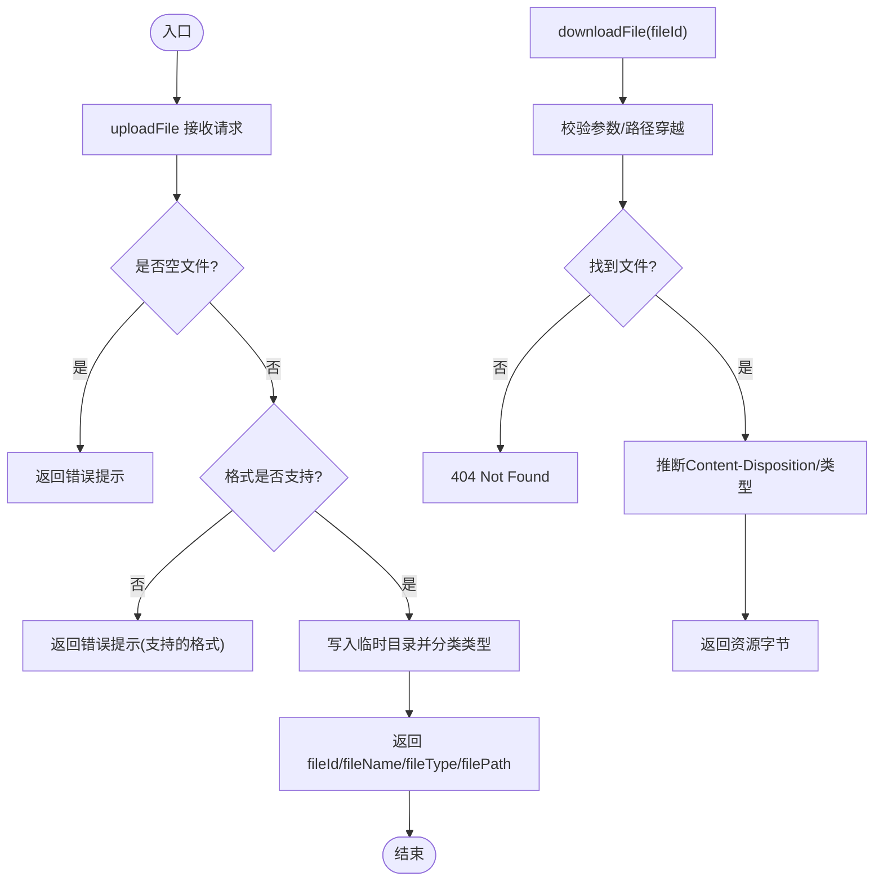
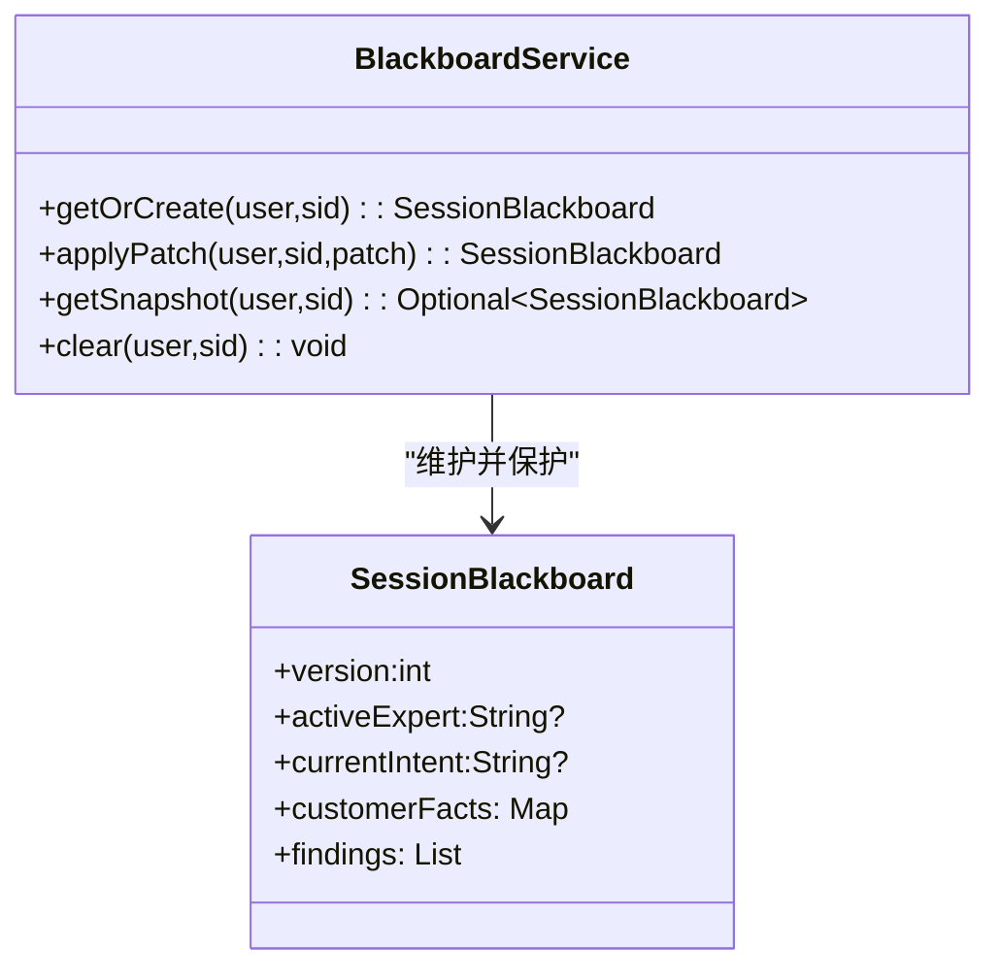

# 集成测试

<cite>
**本文引用的文件**
- [src/main/resources/application.yml](file://src/main/resources/application.yml)
- [src/test/resources/application-test.yml](file://src/test/resources/application-test.yml)
- [src/main/java/com/skloda/agentscope/AgentScopeDemoApplication.java](file://src/main/java/com/skloda/agentscope/AgentScopeDemoApplication.java)
- [src/test/java/com/skloda/agentscope/controller/ChatControllerStreamTest.java](file://src/test/java/com/skloda/agentscope/controller/ChatControllerStreamTestTest.java)
- [src/test/java/com/skloda/agentscope/controller/ChatControllerFileTest.java](file://src/test/java/com/skloda/agentscope/controller/ChatControllerFileTest.java)
- [src/test/java/com/skloda/agentscope/harness/HarnessRuntimeTest.java](file://src/test/java/com/skloda/agentscope/harness/HarnessRuntimeTest.java)
- [src/test/java/com/skloda/agentscope/blackboard/BlackboardServiceTest.java](file://src/test/java/com/skloda/agentscope/blackboard/BlackboardServiceTest.java)
- [src/test/java/com/skloda/agentscope/service/WorkflowRunServiceTest.java](file://src/test/java/com/skloda/agentscope/service/WorkflowRunServiceTest.java)
- [src/test/java/com/skloda/agentscope/controller/KnowledgeControllerTest.java](file://src/test/java/com/skloda/agentscope/controller/KnowledgeControllerTest.java)
- [pom.xml](file://pom.xml)
</cite>

## 目录
1. 引言
2. 项目结构
3. 核心组件
4. 架构总览
5. 详细组件分析
6. 依赖关系分析
7. 性能与回归检测
8. 故障排查指南
9. 结论
10. 附录（可选）

## 引言
本指南聚焦于 AgentScope Demo 的端到端集成测试设计与实现，围绕数据库测试、外部服务模拟、知识检索、会话管理、Agent 执行等关键能力，给出可执行的测试策略与最佳实践。项目基于 Spring Boot 3 与 AgentScope 2.x，默认启动不依赖数据库；在需要持久化时通过独立 profile 启用 Redis 或 MySQL 分布式状态存储。测试侧使用 JUnit 5 与 Mockito，对控制器、运行时、黑板（共享状态）、工作流等子系统提供覆盖。

## 项目结构
- 应用主类：定义了 Spring Boot 入口与启动监听器，默认端口 8081。
- 配置层：
  - application.yml：排除默认 DataSource 自动装配，按 Profile 开启 A2A、MCP、AG-UI 等特性；定义 AgentScope 模型、记忆、知识库、MCP 等开关。
  - application-redis.yml / application-mysql.yml：启用分布式 AgentStateStore（Redis/MySQL），将 session 存储切换为目标存储。
  - src/test/resources/application-test.yml：测试专用配置，关闭 MCP，降低 CI 对外部依赖要求。
- 测试层：基于 JUnit 5，覆盖控制层、运行时、黑板与服务类；大量单元测试通过 Mock 隔离外部依赖。

图表来源
- [src/main/java/com/skloda/agentscope/AgentScopeDemoApplication.java:11-35](file://src/main/java/com/skloda/agentscope/AgentScopeDemoApplication.java#L11-L35)
- [src/main/resources/application.yml:1-23](file://src/main/resources/application.yml#L1-L23)
- [src/main/resources/application-redis.yml:1-17](file://src/main/resources/application-redis.yml#L1-L17)
- [src/main/resources/application-mysql.yml:1-17](file://src/main/resources/application-mysql.yml#L1-L17)

章节来源
- [src/main/java/com/skloda/agentscope/AgentScopeDemoApplication.java:11-35](file://src/main/java/com/skloda/agentscope/AgentScopeDemoApplication.java#L11-L35)
- [src/main/resources/application.yml:1-23](file://src/main/resources/application.yml#L1-L23)

## 核心组件
- 控制器：
  - ChatController：处理消息 SSE 发送与文件上传/下载。测试覆盖了空文件拒绝、不支持格式拒绝、类型识别、路径穿越防护等用例。
  - KnowledgeController：查询索引状态。测试以 Mock Service 断言响应组装正确。
- 运行期与黑板：
  - HarnessRuntime/BlackboardService：校验默认模式、版本单调性、补丁合并、键空间隔离（用户+会话）、快照获取、清理幂等。
- 服务：
  - WorkflowRunService：事件记录、完成态快照、仅保留最近 N 条。
- 配置与环境：
  - 默认无 DB 启动，测试使用 application-test.yml 关闭 MCP，避免 Node.js/C++ 依赖；数据库功能通过独立 profile 引入。

章节来源
- [src/test/java/com/skloda/agentscope/controller/ChatControllerFileTest.java:20-158](file://src/test/java/com/skloda/agentscope/controller/ChatControllerFileTest.java#L20-L158)
- [src/test/java/com/skloda/agentscope/controller/KnowledgeControllerTest.java:18-49](file://src/test/java/com/skloda/agentscope/controller/KnowledgeControllerTest.java#L18-L49)
- [src/test/java/com/skloda/agentscope/blackboard/BlackboardServiceTest.java:17-172](file://src/test/java/com/skloda/agentscope/blackboard/BlackboardServiceTest.java#L17-L172)
- [src/test/java/com/skloda/agentscope/service/WorkflowRunServiceTest.java:14-46](file://src/test/java/com/skloda/agentscope/service/WorkflowRunServiceTest.java#L14-L46)

## 架构总览
下图展示“聊天流”在测试中的关键路径：控制器构造最小可用对象（注入桩/Mock），调用底层服务生成事件流，并在收到 done 后主动终止流，即使底层 Flux 保持打开。

图表来源
- [src/test/java/com/skloda/agentscope/controller/ChatControllerStreamTest.java:18-62](file://src/test/java/com/skloda/agentscope/controller/ChatControllerStreamTest.java#L18-L62)

章节来源
- [src/test/java/com/skloda/agentscope/controller/ChatControllerStreamTest.java:18-62](file://src/test/java/com/skloda/agentscope/controller/ChatControllerStreamTest.java#L18-L62)

## 详细组件分析

### 端到端流式聊天集成测试（ChatController）
- 目标
  - 验证 SSE 流在业务逻辑层面会在“done”事件后结束，即使底层事件流未结束。
  - 保证请求体（agentId/message）被正确处理，SSE event 类型符合预期。
- 设计要点
  - 通过继承 AgentService 并覆写 createStreamFlux 返回受控的 Flux 作为桩。
  - 使用集合收集事件并进行断言；同时设置超时防止阻塞。
- 相关数据流
  - ChatRequest -> Controller -> AgentService(Flux) -> Controller 聚合并输出到客户端。
- 建议扩展
  - 增加失败流（异常事件）、长轮询/背压场景验证。
  - 结合 Reactor Test 的 StepVerifier 验证流行为更严谨。

章节来源
- [src/test/java/com/skloda/agentscope/controller/ChatControllerStreamTest.java:18-62](file://src/test/java/com/skloda/agentscope/controller/ChatControllerStreamTest.java#L18-L62)

### 文件上传与下载集成测试（ChatController）
- 目标
  - 验证上传文件类型识别、空文件拒绝、不支持格式拒绝；
  - 下载接口对于不存在文件、非法 path traversal 的保护；
  - 根据后缀与精确文件名匹配 Content-Type 及内容附件名。
- 设计要点
  - 通过 @TempDir 临时目录与 System.setProperty("java.io.tmpdir", tempDir) 隔离文件系统。
  - 使用 MockMultipartFile 模拟不同文件头判断图片/音频/文档。
- 流程示意

章节来源
- [src/test/java/com/skloda/agentscope/controller/ChatControllerFileTest.java:20-158](file://src/test/java/com/skloda/agentscope/controller/ChatControllerFileTest.java#L20-L158)

### 知识检索接口集成测试（KnowledgeController）
- 目标
  - 验证 Index 状态查询接口能正确组装返回对象。
- 设计要点
  - 使用 Mockito 注入 KnowledgeService 桩，模拟不同的索引状态。
  - 断言时间、文档清单与状态字段对齐。
- 说明
  - 该测试属于轻量的单元/集成混合：验证控制器层与服务的契约。

章节来源
- [src/test/java/com/skloda/agentscope/controller/KnowledgeControllerTest.java:18-49](file://src/test/java/com/skloda/agentscope/controller/KnowledgeControllerTest.java#L18-L49)

### 黑板（Shared Blackboard）并发与安全集成测试
- 目标
  - 验证 getOrCreate 的幂等性、补丁合并、版本号单调增长、防御性拷贝、跨会话隔离、clear 幂等性。
- 设计要点
  - 基于 InMemoryAgentStateStore 做黑盒隔离；测试覆盖多用户/多会话场景，确保 key 空间不串扰。
- 复杂度与注意
  - 多线程并发场景下，版本单调性与脏写可通过后续并发测试补充；当前测试覆盖基本路径。
  

图表来源
- [src/test/java/com/skloda/agentscope/blackboard/BlackboardServiceTest.java:17-172](file://src/test/java/com/skloda/agentscope/blackboard/BlackboardServiceTest.java#L17-L172)

章节来源
- [src/test/java/com/skloda/agentscope/blackboard/BlackboardServiceTest.java:17-172](file://src/test/java/com/skloda/agentscope/blackboard/BlackboardServiceTest.java#L17-L172)

### 工作流运行记录集成测试（WorkflowRunService）
- 目标
  - 验证事件录制、完成态快照、只保留最近 N 条的策略。
- 设计要点
  - 直接实例化服务，startRun -> recordEvent -> completeRun -> getRun/listRuns。
  - 使用有界容量构造函数限制历史数量，验证旧记录淘汰。

章节来源
- [src/test/java/com/skloda/agentscope/service/WorkflowRunServiceTest.java:14-46](file://src/test/java/com/skloda/agentscope/service/WorkflowRunServiceTest.java#L14-L46)

### Harness 运行时与配置集成测试
- 目标
  - 验证 HarnessConfig 默认执行模式为 CLAW，以及显式设置为 BUILDER 的行为。
- 设计要点
  - 直接创建配置对象，设置执行模式并断言。

章节来源
- [src/test/java/com/skloda/agentscope/harness/HarnessRuntimeTest.java:16-28](file://src/test/java/com/skloda/agentscope/harness/HarnessRuntimeTest.java#L16-L28)

## 依赖关系分析
- 测试环境与依赖
  - 默认测试配置通过 application-test.yml 关闭 MCP，避免 CI 中 Node.js 依赖问题。
  - 数据库未在全局启用；需要时可借助 profile 加载 application-mysql.yml 或 application-redis.yml。
  - Maven 依赖声明了 spring-boot-starter-test 与 reactor-test，用于编写与验证响应式流。
- 耦合与内聚
  - 控制器对 Service 层解耦良好，测试通过直接构造控制器并注入桩（或 Mockito）实现快速反馈。
  - 黑板与工作流服务均为轻量 POJO，易于独立测试与组合验证。

章节来源
- [src/test/resources/application-test.yml:1-9](file://src/test/resources/application-test.yml#L1-L9)
- [src/main/resources/application-mysql.yml:1-17](file://src/main/resources/application-mysql.yml#L1-L17)
- [src/main/resources/application-redis.yml:1-17](file://src/main/resources/application-redis.yml#L1-L17)
- [pom.xml:175-187](file://pom.xml#L175-L187)

## 性能与回归检测
- 推荐策略
  - 流式链路基准：利用 reactor-test 的 StepVerifier 对 Flux 进行吞吐、延迟与时序断言。
  - 内存与CPU基线：在 CI 上对关键路径（SSE 聚合、补丁合并、文件 I/O）添加指标采集与阈值告警。
  - 兼容性矩阵：在多个 Java/AgentScope 版本上跑同一套测试集，确保向后兼容。
  - 回归用例：对已知问题（如最后 writer 输出、路径穿越、空输入等）建立稳定用例并长期保留。
- 本地执行建议
  - 单测优先使用内存型组件与桩，保持秒级反馈。
  - 数据库/缓存仅在必要模块激活 profile，并结合容器化（见下文“外部服务模拟”）提升稳定性。

[本节为通用建议，无需源码引用]

## 故障排查指南
- 常见问题
  - 测试环境因 MCP 启动失败：检查 application-test.yml 中 agentscope.mcp.enabled 已设为 false。
  - 找不到配置文件或属性：确认使用了正确的 Profile；默认 application.yml 已排除了 DataSource 自动装配。
  - 文件路径穿越/无效 ID：参考 ChatControllerFileTest 的用例覆盖下载接口的安全边界。
- 定位技巧
  - 对 SSE 流调试：先收敛到一个最小桩流（text->done->never），逐步替换为真实流。
  - 对黑板并发异常：先复现版本递增与不可变集合抛出的异常，再排查补丁顺序与线程安全点。

章节来源
- [src/test/resources/application-test.yml:1-9](file://src/test/resources/application-test.yml#L1-L9)
- [src/main/resources/application.yml:1-23](file://src/main/resources/application.yml#L1-L23)
- [src/test/java/com/skloda/agentscope/controller/ChatControllerFileTest.java:115-158](file://src/test/java/com/skloda/agentscope/controller/ChatControllerFileTest.java#L115-L158)

## 结论
本项目提供了覆盖控制器、运行时、黑板与服务层的健全测试体系。默认无 DB 启动使单测快速稳定；需要时通过独立 profile 接入 Redis/MySQL 进行集成验证。通过 Mock 与微型桩，既能覆盖端到端流式交互与文件处理的正确性，又能保障内部组件的沙箱式可靠性。结合后续的容器化外部依赖与性能基线，可构建高置信度的质量门。

[本节为总结性描述，无需源码引用]

## 附录

### 外部服务模拟与测试容器（建议与实践）
- 为什么需要
  - 知识库向量嵌入、LLM 调用、外部工具/Channel（飞书、AG-UI、MCP、A2A）通常依赖外部系统或服务账号，需在测试环境中被可控地替代。
- 建议方案
  - 服务发现与 Mock：用 WireMock/NanoHTTPD 搭建 HTTP Mock；对 SSE/JSON-RPC 的协议细节进行严格断言。
  - 测试容器：针对 Redis/MySQL/Pg/Elasticsearch 等使用 testcontainers-java，保证每次测试拥有干净、可复制的环境。
  - 并发与资源：将容器启动与销毁与测试套件生命周期绑定；限制端口冲突与资源泄漏。
- 适用场景
  - Chat 端到端（需 LLM 代理时，使用预置 stub/录制回放）。
  - 知识检索链（索引完成后以查询关键词验证语义相似度/返回片段）。
  - 审批流/中间件（结合 Middleware 事件钩子验证审批节点流转）。

[本节为通用方法论，无需源码引用]

### 测试环境隔离与数据管理（最佳实践）
- 环境隔离
  - 测试专用配置：application-test.yml 关闭不必要特性；通过 Profile 选择性启用分布式存储。
  - 随机端口/路径：避免测试相互干扰；控制器层已采用 @TempDir 隔离临时文件。
- 数据准备与清理
  - 每测一沙箱：优先在每个用例内准备所需数据，而非全局共享状态。
  - 幂等与快照：对于黑板与工作流，使用 getSnapshot/clear 等手段恢复与验证一致性。
  - 事务与回滚：当启用 JDBC 时，建议在测试中使用事务回滚或容器重建；本项目默认禁用 DS，便于轻量运行。

[本节为通用方法论，无需源码引用]