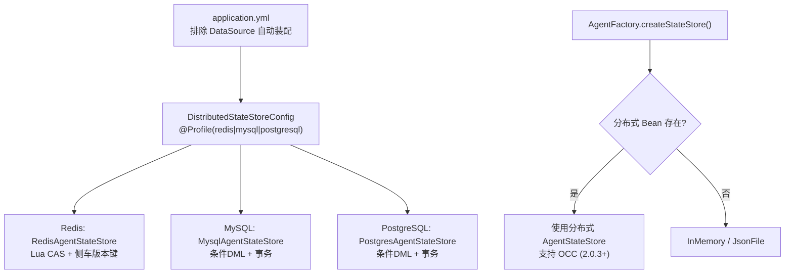
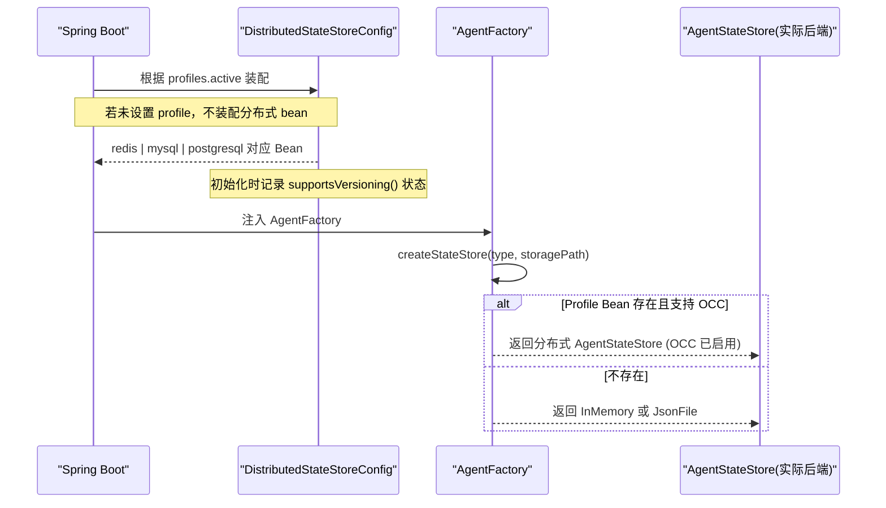
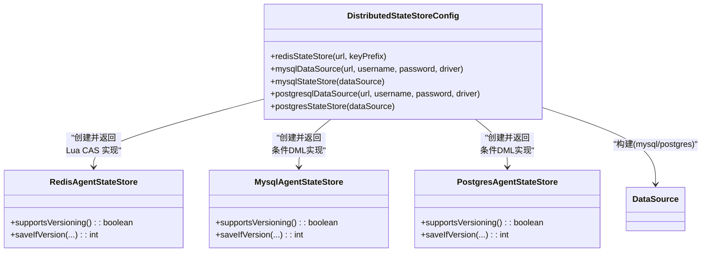
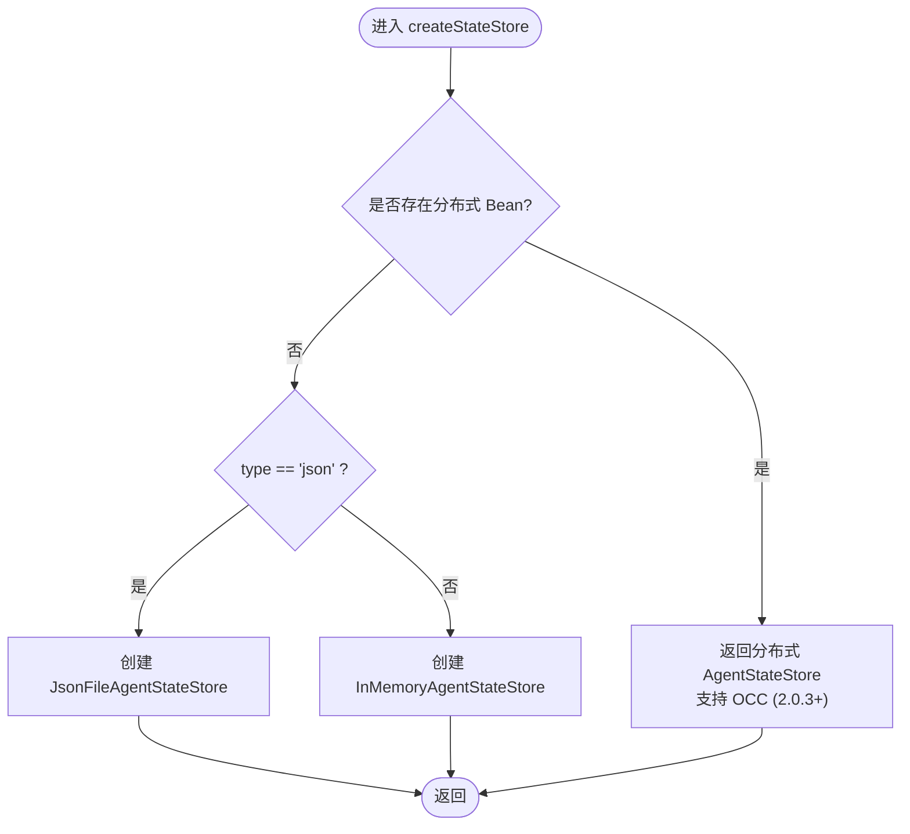
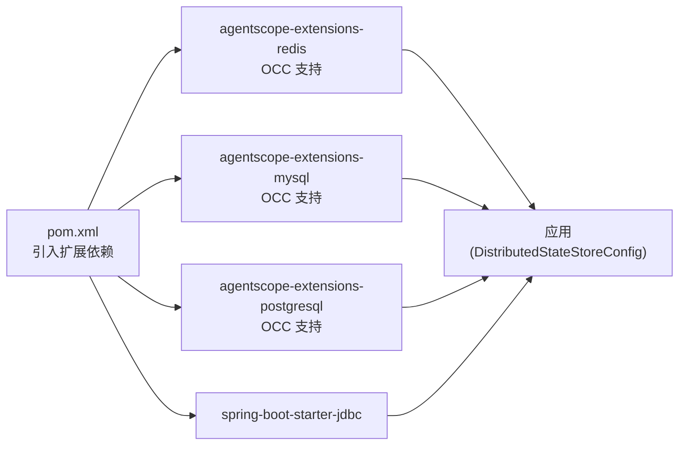
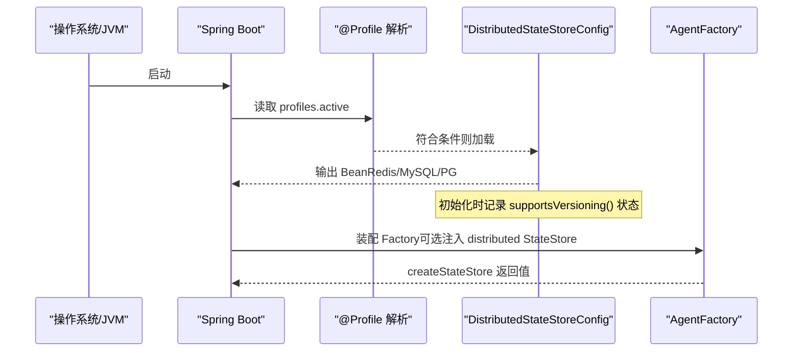

# 存储后端配置

<cite>
**本文引用的文件**
- [DistributedStateStoreConfig.java](file://src/main/java/com/skloda/agentscope/config/DistributedStateStoreConfig.java)
- [AgentFactory.java](file://src/main/java/com/skloda/agentscope/agent/AgentFactory.java)
- [application.yml](file://src/main/resources/application.yml)
- [application-redis.yml](file://src/main/resources/application-redis.yml)
- [application-mysql.yml](file://src/main/resources/application-mysql.yml)
- [application-postgresql.yml](file://src/main/resources/application-postgresql.yml)
- [pom.xml](file://pom.xml)
</cite>

## 更新摘要
**所做更改**
- 新增 AgentScope 2.0.3 乐观并发控制（OCC）支持的详细说明
- 更新分布式状态存储的并发控制机制说明
- 增强启动日志和版本检查功能描述
- 补充冲突处理策略和异常处理机制
- 更新性能优化和高可用配置建议

## 目录
1. [简介](#简介)
2. [项目结构](#项目结构)
3. [核心组件](#核心组件)
4. [架构总览](#架构总览)
5. [详细组件分析](#详细组件分析)
6. [依赖关系分析](#依赖关系分析)
7. [性能与选型建议](#性能与选型建议)
8. [高可用、备份与生产优化](#高可用备份与生产优化)
9. [故障排查指南](#故障排查指南)
10. [结论](#结论)
11. [附录](#附录)

## 简介
本文件系统性说明 AgentScope Demo 中的分布式 AgentStateStore 存储后端配置，包括 Redis、MySQL、PostgreSQL 三种实现的启用方式与差异；深入解析 DistributedStateStoreConfig 的实现机制与基于 @Profile 的动态切换逻辑；重点介绍 AgentScope 2.0.3 引入的原生乐观并发控制（OCC）支持，提供连接配置要点、数据模型（键空间/表结构）期望、连接池与集群最佳实践，以及迁移、备份与生产调优建议。

**重要更新**：AgentScope 2.0.3 在所有三种存储后端中原生实现了乐观并发控制（OCC）API，提供零配置的并发安全保证。

## 项目结构
- 分布式状态存储统一入口在 config/DistributedStateStoreConfig.java，通过 Spring Profile 选择后端实现。
- 三个 Profile 对应的配置文件位于 resources 下：application-redis.yml、application-mysql.yml、application-postgresql.yml。
- 默认应用配置 application.yml 排除了 DataSource 自动装配与 A2A 自动装配，避免在无 DB 场景加载无关能力。
- AgentFactory.createStateStore(...) 会优先使用由 Profile 注入的分布式 AgentStateStore Bean；否则回退到 InMemory 或 JsonFile。

**图表来源**
- [DistributedStateStoreConfig.java:43-151](file://src/main/java/com/skloda/agentscope/config/DistributedStateStoreConfig.java#L43-L151)
- [AgentFactory.java:76-92](file://src/main/java/com/skloda/agentscope/agent/AgentFactory.java#L76-L92)
- [application.yml:13-23](file://src/main/resources/application.yml#L13-L23)

章节来源
- [application.yml:1-30](file://src/main/resources/application.yml#L1-L30)
- [DistributedStateStoreConfig.java:1-152](file://src/main/java/com/skloda/agentscope/config/DistributedStateStoreConfig.java#L1-L152)

## 核心组件
- DistributedStateStoreConfig：集中注册分布式状态存储后端（Redis/MySQL/PostgreSQL），每个 Profile 提供对应 DataSource 或 AgentStateStore Bean，并内置 OCC 支持检测。
- AgentFactory.createStateStore(...)：构造会话状态存储，优先复用由 Profile 提供的分布式实例；否则按 type 选择 json 文件持久化或内存态。
- 应用配置分层：application.yml 为通用配置；redis/mysql/postgresql profile 文件按需覆盖特定属性。

**更新**：所有分布式存储后端现在都支持原生的乐观并发控制（OCC），在启动时会记录 supportsVersioning() 状态。

章节来源
- [AgentFactory.java:50-92](file://src/main/java/com/skloda/agentscope/agent/AgentFactory.java#L50-L92)
- [DistributedStateStoreConfig.java:43-151](file://src/main/java/com/skloda/agentscope/config/DistributedStateStoreConfig.java#L43-L151)

## 架构总览
下图展示启动时如何依据激活的 Spring Profile 装配不同的状态存储，并在运行时被 Agent 消费，同时支持乐观并发控制。

**图表来源**
- [DistributedStateStoreConfig.java:43-151](file://src/main/java/com/skloda/agentscope/config/DistributedStateStoreConfig.java#L43-L151)
- [AgentFactory.java:76-92](file://src/main/java/com/skloda/agentscope/agent/AgentFactory.java#L76-L92)

## 详细组件分析

### 分布式状态存储装配器：DistributedStateStoreConfig
- 类级别使用 @Configuration 与 @Profile({"redis", "mysql", "postgresql"}) 声明条件装配。
- 三个 Profile 分别暴露如下 Bean：
  - redis: 基于 JedisPooled + RedisAgentStateStore，支持 keyPrefix 隔离命名空间，使用 Lua CAS 脚本实现原子操作。
  - mysql: 使用 DataSourceBuilder 构造 MySQL DataSource，并创建 MysqlAgentStateStore，支持条件 DML。
  - postgresql: 同上，但驱动和扩展不同，创建 PostgresAgentStateStore，支持条件 DML。
- **新增功能**：每个存储后端初始化时都会记录 supportsVersioning() 状态，确认 OCC 支持情况。
- 日志输出来自 LoggerFactory.getLogger(...)，便于观察初始化成功与否及关键参数。

**图表来源**
- [DistributedStateStoreConfig.java:43-151](file://src/main/java/com/skloda/agentscope/config/DistributedStateStoreConfig.java#L43-L151)

章节来源
- [DistributedStateStoreConfig.java:1-152](file://src/main/java/com/skloda/agentscope/config/DistributedStateStoreConfig.java#L1-L152)

### 会话状态存储选择：AgentFactory.createStateStore(...)
- 当激活了 redis/mysql/postgresql profile，并且存在分布式 AgentStateStore Bean 时，该方法将直接返回该 Bean。
- 当 type="json" 且无分布式 Bean 时，使用 JsonFileAgentStateStore 持久到文件目录。
- 其余情况回退到 InMemoryAgentStateStore，保证向后兼容。

**图表来源**
- [AgentFactory.java:76-92](file://src/main/java/com/skloda/agentscope/agent/AgentFactory.java#L76-L92)

章节来源
- [AgentFactory.java:76-92](file://src/main/java/com/skloda/agentscope/agent/AgentFactory.java#L76-L92)

### 配置与使用
- 默认禁用数据库与 A2A 自动装配，减少启动耦合（见 application.yml）。
- Profile 配置：
  - redis: 设置 agentscope.distributed.redis.url 与 agentscope.distributed.redis.key-prefix；session.type=redis。
  - mysql/postgresql: 配置 spring.datasource.*；session.type=mysql 或 postgresql。
- 启动命令示例（节选自代码注释）：--spring.profiles.active=redis 或 mysql 或 postgresql。

**更新**：所有存储后端现在都支持原生的乐观并发控制，无需额外配置即可启用。

章节来源
- [application.yml:13-23](file://src/main/resources/application.yml#L13-L23)
- [application-redis.yml:1-17](file://src/main/resources/application-redis.yml#L1-L17)
- [application-mysql.yml:1-18](file://src/main/resources/application-mysql.yml#L1-L18)
- [application-postgresql.yml:1-18](file://src/main/resources/application-postgresql.yml#L1-L18)
- [DistributedStateStoreConfig.java:18-42](file://src/main/java/com/skloda/agentscope/config/DistributedStateStoreConfig.java#L18-L42)

## 依赖关系分析
- 分布式扩展依赖由 pom.xml 引入：agentscope-extensions-{redis,mysql,postgresql} 版本与 agentscope.version 一致。
- JDBC 支持依赖 spring-boot-starter-jdbc。
- MySQL 驱动以 runtime scope 引入；PostgreSQL 驱动由扩展模块管理。

**图表来源**
- [pom.xml:146-167](file://pom.xml#L146-L167)

章节来源
- [pom.xml:146-167](file://pom.xml#L146-L167)

## 性能与选型建议
- Redis
  - 适用场景：低延迟、轻量级、KV 读写频繁的多进程/多实例共享会话。
  - 特点：无模式、部署简单、网络 IO 为主；键命名空间可通过 key-prefix 控制隔离。
  - **OCC 实现**：使用侧车版本键（side-car version key）配合嵌入的 Lua CAS 脚本执行原子 EVAL 操作，确保并发安全。
  - 注意事项：需关注序列化大小与过期策略；大对象建议配合合理 TTL。
- MySQL
  - 适用场景：强一致性、需查询与审计的会话历史；与既有数据平台整合。
  - 特点：事务与索引优势；JDBC 访问带来一定开销；建议合理的连接池与批处理写入。
  - **OCC 实现**：在写事务内执行版本条件 DML（version-conditional DML），利用数据库事务保证原子性。
  - 注意事项：确保 schema 正确（库名/表名以官方扩展为准），必要时添加分区或归档策略。
- PostgreSQL
  - 适用场景：复杂查询、JSON 类型友好、生态完善的企业环境。
  - 特点：与 MySQL 类似，驱动与方言有差异。
  - **OCC 实现**：同样采用版本条件 DML 在写事务中执行，充分利用 PostgreSQL 的事务特性。
  - 注意事项：索引与统计信息维护，冷数据归档与压缩。

**更新**：所有存储后端现在都原生支持乐观并发控制，提供更好的并发安全性和性能表现。

[本节为通用性说明，不直接引用具体源码]

## 高可用、备份与生产优化

### Redis 键空间与运维要点
- 键空间隔离：使用 agentscope.distributed.redis.key-prefix 为同一键名前缀隔离多环境或多租户。
- 集群与分片：可按业务域或会话维度进行分片规划，结合客户端分片策略提升吞吐与可用性。
- 容灾与快照：开启 RDB/AOF 快照与增量复制，配合主从或哨兵保障高可用。
- 性能与安全：启用 TLS 访问，限制最大内存与淘汰策略；定期监控命中率与大键扫描。
- **OCC 优化**：Lua 脚本的原子性确保了并发安全，建议在高频写入场景下监控 Lua 脚本执行时间。

章节来源
- [application-redis.yml:4-12](file://src/main/resources/application-redis.yml#L4-L12)
- [DistributedStateStoreConfig.java:53-64](file://src/main/java/com/skloda/agentscope/config/DistributedStateStoreConfig.java#L53-L64)

### MySQL 表结构初始化与导入
- 需要预先创建数据库（如 agentscope_state）并根据 MySQL 扩展要求的 DDL 建表。
- 建议按会话或时间维度对热点表做分库分表或分区策略。
- 通过批量导入脚本在首次上线时快速完成初始化。
- **OCC 支持**：利用数据库事务和条件更新语句实现并发控制，确保数据一致性。

章节来源
- [application-mysql.yml:4-17](file://src/main/resources/application-mysql.yml#L4-L17)

### PostgreSQL 表结构初始化与导入
- 需要预先创建数据库（如 agentscope_state）并按扩展要求准备 schema。
- 充分利用 JSONB、GIN 索引等能力优化复杂查询与结构化字段检索。
- **OCC 支持**：借助 PostgreSQL 强大的事务机制和条件更新功能，实现高效的并发控制。

章节来源
- [application-postgresql.yml:4-17](file://src/main/resources/application-postgresql.yml#L4-L17)

### 连接池与事务最佳实践
- DataSource 在本项目中通过 DataSourceBuilder 构建；可根据连接规模配置连接池参数与超时/重试。
- 针对高频写场景可评估是否拆分写入路径或使用批量接口；对于读多写少场景增加只读副本。
- 注意长事务、慢查询与锁竞争，使用 EXPLAIN 与监控定位瓶颈。
- **OCC 事务优化**：合理使用短事务和批量操作，避免长时间持有数据库连接。

章节来源
- [DistributedStateStoreConfig.java:67-110](file://src/main/java/com/skloda/agentscope/config/DistributedStateStoreConfig.java#L67-L110)
- [application-mysql.yml:4-17](file://src/main/resources/application-mysql.yml#L4-L17)
- [application-postgresql.yml:4-17](file://src/main/resources/application-postgresql.yml#L4-L17)

### 备份恢复策略
- Redis：RDB/AOF 定时持久化与主从复制；制定增量与全量备份计划与演练恢复流程。
- MySQL/PostgreSQL：使用专业备份工具进行物理/逻辑备份；冷备与热备并行；验证恢复成功率与耗时。
- **OCC 数据一致性**：由于 OCC 保证了并发安全，备份过程中不会出现脏读问题。

[本节为通用性实践建议，不直接引用具体源码]

### 乐观并发控制（OCC）最佳实践

#### 冲突处理策略
- **OVERWRITE**：新版本覆盖旧版本，适用于最后写入获胜的场景。
- **FAIL**：发生冲突时抛出异常，适用于需要严格一致性的场景。
- **APPEND_MERGE**：合并冲突内容，适用于消息队列等追加型场景。

#### 性能考虑
- Redis：Lua 脚本执行开销极低，适合高并发场景。
- MySQL/PostgreSQL：条件 DML 利用数据库索引，性能优异。
- 监控 supportsVersioning() 返回值，确保 OCC 功能正常启用。

#### 监控与诊断
- 定期检查启动日志中的 supportsVersioning() 状态。
- 监控并发冲突率，调整冲突处理策略。
- 跟踪版本增长速率，评估系统负载。

[本节为概念性说明，不直接引用具体源码]

## 故障排查指南
- 无法切换后端
  - 检查启动参数是否正确传入 --spring.profiles.active=redis|mysql|postgresql。
  - 确认对应 application-*.yml 文件中相关配置项已正确提供。
  - 观察启动日志中 S13 相关信息与相应扩展包的日志级别开关。
- Redis 不可用
  - 核对 URL、密码、防火墙/ACL 是否允许。
  - 检查 key-prefix 是否存在命名冲突。
- 数据库连通失败
  - 校验 spring.datasource.url/username/password/driver-class-name。
  - 核对数据库已存在且权限充足；执行必要初始化脚本。
- **OCC 相关问题**
  - 检查 supportsVersioning() 返回值是否为 true。
  - 监控并发冲突异常，调整冲突处理策略。
  - 验证 Lua 脚本（Redis）或条件 DML（数据库）的执行效率。
- 异常堆栈定位
  - 将 log.level.io.agentscope.extensions.{redis|mysql|postgresql} 提高到 DEBUG 辅助定位。

章节来源
- [application-redis.yml:14-17](file://src/main/resources/application-redis.yml#L14-L17)
- [application-mysql.yml:15-18](file://src/main/resources/application-mysql.yml#L15-L18)
- [application-postgresql.yml:15-18](file://src/main/resources/application-postgresql.yml#L15-L18)
- [DistributedStateStoreConfig.java:59-151](file://src/main/java/com/skloda/agentscope/config/DistributedStateStoreConfig.java#L59-L151)

## 结论
本仓库通过 DistributedStateStoreConfig 与 Spring Profile 实现了分布式 AgentStateStore 的可插拔接入，并在 AgentScope 2.0.3 中增强了乐观并发控制（OCC）支持：
- Redis 适合快速、无模式的 KV 会话共享，使用 Lua CAS 实现原子操作；
- MySQL/PostgreSQL 适合强一致、需分析与审计的场景，使用条件 DML 保证并发安全；
- 所有存储后端现都原生支持 OCC，提供零配置的并发安全保障；
- 配合合适的连接池、备份与高可用方案，可在本地开发、预发与生产环境中平滑演进与切换。

**更新亮点**：AgentScope 2.0.3 的 OCC 支持显著提升了分布式状态管理的可靠性和性能，无需额外配置即可获得并发安全的状态存储能力。

[本节为总结性内容，不引用具体源码]

## 附录

### 各 Profile 配置清单（节选）
- Redis
  - agentscope.distributed.redis.url：默认 redis://localhost:6379
  - agentscope.distributed.redis.key-prefix：默认 agentscope
  - session.type=redis
  - **OCC 状态**：supportsVersioning() = true（使用 Lua CAS）
- MySQL
  - spring.datasource.url/username/password/driver-class-name
  - session.type=mysql
  - **OCC 状态**：supportsVersioning() = true（使用条件 DML）
- PostgreSQL
  - spring.datasource.url/username/password/driver-class-name
  - session.type=postgresql
  - **OCC 状态**：supportsVersioning() = true（使用条件 DML）

章节来源
- [application-redis.yml:4-12](file://src/main/resources/application-redis.yml#L4-L12)
- [application-mysql.yml:4-17](file://src/main/resources/application-mysql.yml#L4-L17)
- [application-postgresql.yml:4-17](file://src/main/resources/application-postgresql.yml#L4-L17)

### 运行时的装配顺序示意

**图表来源**
- [DistributedStateStoreConfig.java:43-151](file://src/main/java/com/skloda/agentscope/config/DistributedStateStoreConfig.java#L43-L151)
- [AgentFactory.java:76-92](file://src/main/java/com/skloda/agentscope/agent/AgentFactory.java#L76-L92)

### OCC 实现技术细节

#### Redis 实现
- 使用侧车版本键（side-car version key）存储版本号
- 通过嵌入的 Lua 脚本执行原子比较和交换（CAS）操作
- 单个 EVAL 调用确保操作的原子性

#### MySQL/PostgreSQL 实现
- 在写事务中执行版本条件 DML
- 利用数据库事务保证操作的原子性和一致性
- 通过 WHERE 子句中的版本检查实现并发控制

#### 冲突处理
- saveIfVersion 方法返回 -1 表示版本冲突
- 上层框架可配置冲突处理策略（OVERWRITE/FAIL/APPEND_MERGE）
- 异常情况抛出 ConcurrentSessionModificationException

[本节为技术细节说明，不直接引用具体源码]