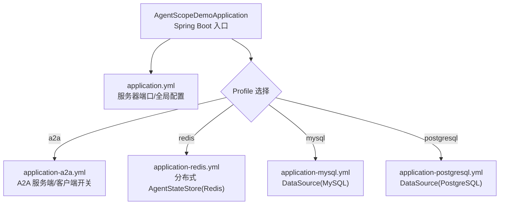
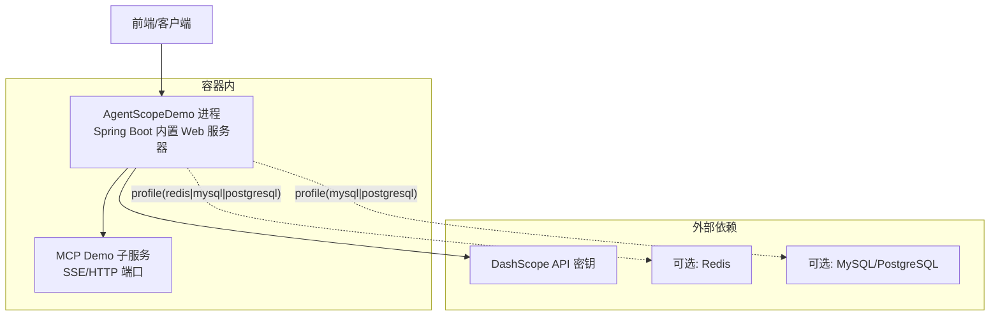
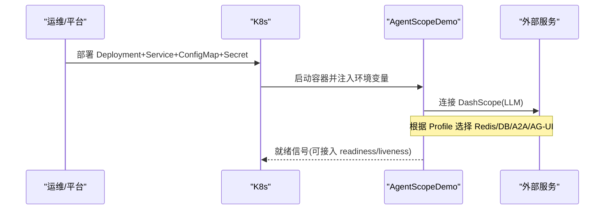
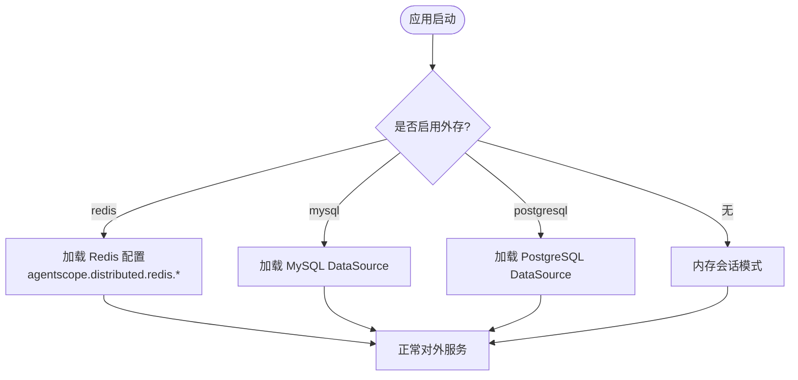

# 容器化部署

<cite>
**本文引用的文件**
- [AgentScopeDemoApplication.java](file://src/main/java/com/skloda/agentscope/AgentScopeDemoApplication.java)
- [KnowledgeProperties.java](file://src/main/java/com/skloda/agentscope/service/KnowledgeProperties.java)
- [pom.xml](file://pom.xml)
- [.java-version](file://.java-version)
- [application.yml](file://src/main/resources/application.yml)
- [DistributedStateStoreConfig.java](file://src/main/java/com/skloda/agentscope/config/DistributedStateStoreConfig.java)
- [A2aServerConfig.java](file://src/main/java/com/skloda/agentscope/config/A2aServerConfig.java)
- [A2aClientDemoRunner.java](file://src/main/java/com/skloda/agentscope/config/A2aClientDemoRunner.java)
- [AguiConfig.java](file://src/main/java/com/skloda/agentscope/config/AguiConfig.java)
- [FeishuChannelController.java](file://src/main/java/com/skloda/agentscope/controller/FeishuChannelController.java)
- [application-a2a.yml](file://src/main/resources/application-a2a.yml)
- [application-redis.yml](file://src/main/resources/application-redis.yml)
- [application-mysql.yml](file://src/main/resources/application-mysql.yml)
- [application-postgresql.yml](file://src/main/resources/application-postgresql.yml)
</cite>

## 目录
1. [简介](#简介)
2. [项目结构（与部署相关）](#项目结构与部署相关)
3. [核心组件](#核心组件)
4. [架构总览](#架构总览)
5. [详细组件分析](#详细组件分析)
6. [依赖分析](#依赖分析)
7. [性能与JVM调优](#性能与jvm调优)
8. [健康检查、优雅停机与可观测性](#健康检查优雅停机与可观测性)
9. [Docker镜像构建（多阶段）](#docker镜像构建多阶段)
10. [Kubernetes部署清单](#kubernetes部署清单)
11. [云原生最佳实践](#云原生最佳实践)
12. [横向扩展、负载均衡与服务发现](#横向扩展负载均衡与服务发现)
13. [监控与日志集成方案](#监控与日志集成方案)
14. [故障排查指南](#故障排查指南)
15. [结论](#结论)

## 简介
本指南面向在 Kubernetes/容器环境中部署 AgentScope Demo 应用。该项目基于 Spring Boot 3.5.14 + Java 17，支持多端点（聊天、知识库、MCP、A2A、AG-UI），通过 Profile 切换不同能力；默认启用内存型会话与会话持久化路径，提供 RAG 知识库索引等特性。本指南覆盖：
- Docker 多阶段镜像构建与最小化体积
- JVM 参数调优（内存、GC）
- 健康检查与优雅停机配置
- K8s 完整部署清单（Deployment、Service、ConfigMap、Secret）
- 横向扩展、负载均衡、服务发现
- 监控与日志集成建议

## 项目结构（与部署相关）
本项目以 Spring Boot 为主入口运行，关键配置与开关如下：
- 主类为 AgentScopeDemoApplication，启动时打印服务端口并监听 WebServer 初始化事件
- 应用服务器默认端口在 application.yml 中设置
- 通过 @Profile 控制功能开关（如 a2a、feishu、agui、redis/mysql/postgresql 等）
- 多种 profile 配置文件分别管理外部依赖接入（Redis/MySQL/PostgreSQL、A2A）



**图示来源**
- [AgentScopeDemoApplication.java:11-17](file://src/main/java/com/skloda/agentscope/AgentScopeDemoApplication.java#L11-L17)
- [application.yml:3-23](file://src/main/resources/application.yml#L3-L23)
- [application-a2a.yml:1-28](file://src/main/resources/application-a2a.yml#L1-L28)
- [application-redis.yml:1-17](file://src/main/resources/application-redis.yml#L1-L17)
- [application-mysql.yml:1-18](file://src/main/resources/application-mysql.yml#L1-L18)
- [application-postgresql.yml:1-18](file://src/main/resources/application-postgresql.yml#L1-L18)

**章节来源**
- [AgentScopeDemoApplication.java:11-17](file://src/main/java/com/skloda/agentscope/AgentScopeDemoApplication.java#L11-L17)
- [application.yml:3-23](file://src/main/resources/application.yml#L3-L23)
- [application-a2a.yml:1-28](file://src/main/resources/application-a2a.yml#L1-L28)
- [application-redis.yml:1-17](file://src/main/resources/application-redis.yml#L1-L17)
- [application-mysql.yml:1-18](file://src/main/resources/application-mysql.yml#L1-L18)
- [application-postgresql.yml:1-18](file://src/main/resources/application-postgresql.yml#L1-L18)

## 核心组件
- 应用入口：AgentScopeDemoApplication，使用 Spring Boot 自动装配，包含一个启动完成事件监听器用于输出访问地址
- 配置属性：
  - KnowledgeProperties：映射 agentscope.knowledge.* 配置项（是否启用、embedding 模型、切块策略、自动建索引等）
  - 其它外部依赖配置由 Profile 配置文件注入（Redis/DB 等）
- 运行时行为：
  - 默认排除 DataSource 和 A2A 自动装配，保持轻量启动
  - 可通过 profile 激活 A2A/AG-UI/飞书频道等功能

**章节来源**
- [AgentScopeDemoApplication.java:11-34](file://src/main/java/com/skloda/agentscope/AgentScopeDemoApplication.java#L11-L34)
- [KnowledgeProperties.java:8-21](file://src/main/java/com/skloda/agentscope/service/KnowledgeProperties.java#L8-L21)
- [application.yml:19-23](file://src/main/resources/application.yml#L19-L23)
- [A2aServerConfig.java:38-41](file://src/main/java/com/skloda/agentscope/config/A2aServerConfig.java#L38-L41)
- [A2aClientDemoRunner.java:36-39](file://src/main/java/com/skloda/agentscope/config/A2aClientDemoRunner.java#L36-L39)
- [AguiConfig.java:40-43](file://src/main/java/com/skloda/agentscope/config/AguiConfig.java#L40-L43)
- [FeishuChannelController.java:47-50](file://src/main/java/com/skloda/agentscope/controller/FeishuChannelController.java#L47-L50)

## 架构总览
从容器化视角看，系统由“Web 进程 + 可选外部依赖”组成：
- Web 进程：Spring Boot 内置容器，处理 HTTP/流式 SSE 请求
- 外部依赖：
  - DashScope LLM（API Key 通过环境变量传入）
  - Redis/MySQL/PostgreSQL（按 profile 选择其一）
  - 可选：MCP 内部子服务（SSE/HTTP 端口独立于主应用）



**图示来源**
- [application.yml:26-79](file://src/main/resources/application.yml#L26-L79)
- [application-redis.yml:1-17](file://src/main/resources/application-redis.yml#L1-L17)
- [application-mysql.yml:1-18](file://src/main/resources/application-mysql.yml#L1-L18)
- [application-postgresql.yml:1-18](file://src/main/resources/application-postgresql.yml#L1-L18)

**章节来源**
- [application.yml:26-79](file://src/main/resources/application.yml#L26-L79)

## 详细组件分析

### 应用入口与环境要求
- Java 版本：.java-version 指定为 17，pom.xml 也锁定为 17
- 主类：AgentScopeDemoApplication，main 调用 SpringApplication.run
- 端口：application.yml server.port=8081（容器内部）
- 必备环境变量：DASHSCOPE_API_KEY（用于调用 DashScope 模型）
- 可选配置：
  - agentscope.session.storage-path：会话存储路径（容器内建议使用持久卷挂载）
  - agentscope.knowledge.*：RAG 知识库行为

**章节来源**
- [.java-version:1-1](file://.java-version#L1-L1)
- [pom.xml:20-26](file://pom.xml#L20-L26)
- [AgentScopeDemoApplication.java:11-17](file://src/main/java/com/skloda/agentscope/AgentScopeDemoApplication.java#L11-L17)
- [application.yml:3-60](file://src/main/resources/application.yml#L3-L60)

### 配置与特性开关（Profile）
- 默认：仅启用基础 Agent/工具/MCP 能力，排除 DataSource 与 A2A
- redis：启用 Redis 作为分布式会话存储
- mysql/postgresql：启用对应数据库并配置 DataSource（同时 session.type=对应后端）
- a2a：开启 A2A Server 及示例 Client（自环调用）
- feishu：暴露飞书 IM Webhook 接收回调
- agui：注册 AG-UI 代理端点



**图示来源**
- [DistributedStateStoreConfig.java:21-113](file://src/main/java/com/skloda/agentscope/config/DistributedStateStoreConfig.java#L21-L113)
- [application-a2a.yml:1-28](file://src/main/resources/application-a2a.yml#L1-L28)
- [application-redis.yml:1-17](file://src/main/resources/application-redis.yml#L1-L17)
- [application-mysql.yml:1-18](file://src/main/resources/application-mysql.yml#L1-L18)
- [application-postgresql.yml:1-18](file://src/main/resources/application-postgresql.yml#L1-L18)
- [FeishuChannelController.java:47-50](file://src/main/java/com/skloda/agentscope/controller/FeishuChannelController.java#L47-L50)
- [A2aServerConfig.java:38-41](file://src/main/java/com/skloda/agentscope/config/A2aServerConfig.java#L38-L41)

**章节来源**
- [DistributedStateStoreConfig.java:21-113](file://src/main/java/com/skloda/agentscope/config/DistributedStateStoreConfig.java#L21-L113)
- [FeishuChannelController.java:47-50](file://src/main/java/com/skloda/agentscope/controller/FeishuChannelController.java#L47-L50)
- [A2aServerConfig.java:38-41](file://src/main/java/com/skloda/agentscope/config/A2aServerConfig.java#L38-L41)
- [A2aClientDemoRunner.java:36-39](file://src/main/java/com/skloda/agentscope/config/A2aClientDemoRunner.java#L36-L39)
- [AguiConfig.java:40-43](file://src/main/java/com/skloda/agentscope/config/AguiConfig.java#L40-L43)

### 健康检查与优雅停机
- 当前未显式启用 Spring Actuator，因此默认不提供 /actuator/health
- 建议在生产环境引入 spring-boot-starter-actuator，并通过 ConfigMap/环境变量暴露 /actuator/health 与 /actuator/readiness，供 K8s HealthProbe 探测
- 优雅停机：Spring Boot 支持 graceful shutdown，建议在 Deployment 的终止流程中保留合适的 gracePeriodSeconds，以便流式任务与长连接完成

提示：健康检查与优雅停机的具体 YAML 字段见后续 K8s 章节。

**章节来源**
- [application.yml:19-23](file://src/main/resources/application.yml#L19-L23)

## 依赖分析
- 运行时依赖：
  - DashScope API Key：DASHSCOPE_API_KEY 环境变量（用于 model.dashscope.api-key）
  - 可选外部存储：
    - Redis：url、key-prefix（agentscope.distributed.redis.*）
    - MySQL/PostgreSQL：spring.datasource.*
- Profile 解耦：通过不同的配置文件组合启用相应依赖，避免生产镜像承载无关代码



**图示来源**
- [application-redis.yml:1-17](file://src/main/resources/application-redis.yml#L1-L17)
- [application-mysql.yml:1-18](file://src/main/resources/application-mysql.yml#L1-L18)
- [application-postgresql.yml:1-18](file://src/main/resources/application-postgresql.yml#L1-L18)
- [application.yml:26-79](file://src/main/resources/application.yml#L26-L79)

**章节来源**
- [application-redis.yml:1-17](file://src/main/resources/application-redis.yml#L1-L17)
- [application-mysql.yml:1-18](file://src/main/resources/application-mysql.yml#L1-L18)
- [application-postgresql.yml:1-18](file://src/main/resources/application-postgresql.yml#L1-L18)
- [application.yml:26-79](file://src/main/resources/application.yml#L26-L79)

## 性能与JVM调优
- 目标环境：Java 17 + Spring Boot 内置 Tomcat
- 推荐策略：
  - 容器感知：设置 -XX:+UseContainerSupport 确保正确识别容器内存限制（多数 JDK 17 默认开启）
  - 内存上限：根据节点资源调整 -Xmx/-Xms，建议设为容器内存限制的约 60-80%
  - GC 选择：G1GC（默认）适用于大多数堆大小；小堆也可考虑 ZGC 以降低延迟
  - Metaspace：按需调整 -XX:MaxMetaspaceSize，避免频繁 Full GC
  - 关闭无用调试信息：-XX:-UnlockDiagnosticVMOptions -XX:-PrintGCDetails（生产）
- 注意：若启用高并发 SSE/长连接场景，需评估文件上传阈值、线程池、Netty 线程数、超时等（Tomcat 默认即可，必要时通过配置扩展）

说明：以上为容器运行通用调优建议；如需针对负载特征进一步收敛，请结合压测数据迭代。

**章节来源**
- [pom.xml:20-26](file://pom.xml#L20-L26)
- [.java-version:1-1](file://.java-version#L1-L1)

## 健康检查、优雅停机与可观测性
- 健康检查：
  - 建议启用 Actuator，并将 /actuator/health（存活）与 /actuator/readiness（就绪）暴露给 K8s liveness/readiness probe
  - 对于外部依赖（如 Redis/DB），可增加自定义健康检查以保证强一致可用性判断
- 优雅停机：
  - 使用 Spring Boot graceful shutdown（enable=true 或在更高版本默认开启）
  - 在 K8s 中设置 terminationGracePeriodSeconds（如 60-120s），允许长耗时请求完成
- 可观测性：
  - 应用日志：统一结构化输出至标准输出（stdout），由集群收集系统采集
  - 指标：可接入 micrometer 暴露 /actuator/prometheus（如需）
  - 追踪：可结合 OTel 或 Micrometer Tracing（如需）

**章节来源**
- [application.yml:82-89](file://src/main/resources/application.yml#L82-L89)

## Docker镜像构建（多阶段）
目标：使用 Alpine Linux + 精简 JRE 的多阶段构建，将编译与运行时解耦，显著缩小镜像体积。以下提供可直接使用的 Dockerfile 参考模板（请根据实际包名调整）：

```dockerfile
# ========== 构建阶段 ==========
FROM maven:3.9-eclipse-temurin-17-alpine AS build
WORKDIR /app
# 缓存层优化：先拷贝依赖描述再下载依赖
COPY pom.xml .
RUN mvn dependency:go-offline -B
COPY . .
RUN mvn package -DskipTests -B

# ========== 运行阶段 ==========
FROM eclipse-temurin:17-jre-alpine
LABEL maintainer="yourteam@example.com"
WORKDIR /app
COPY --from=build /app/target/*.jar /app/app.jar

ENV JAVA_OPTS="-XX:+UseContainerSupport -Xmx256m -Xms256m -XX:+UseG1GC"
ENV SERVER_PORT=8081
ENV TZ=Asia/Shanghai
EXPOSE ${SERVER_PORT}

ENTRYPOINT ["sh","-c", "java ${JAVA_OPTS} -jar /app/app.jar $${JAVA_TOOL_OPTIONS:-} --server.port=${SERVER_PORT}"]
```

构建与运行建议：
- 构建后镜像名称：agentscope-demo
- 容器端口：默认为 8081（与 application.yml 保持一致；可在启动参数中覆盖）
- 环境变量：务必注入 DASHSCOPE_API_KEY
- 数据与配置：
  - 会话存储 path：agentscope.session.storage-path 可指向挂载的 PVC（如 ~/.agentscope/demo-sessions）
  - 知识库资源：若需要在外部维护 knowledge 数据，可使用 ConfigMap/Volme 挂载到 classpath 或读取文件系统

**章节来源**
- [pom.xml:190-206](file://pom.xml#L190-L206)
- [application.yml:56-60](file://src/main/resources/application.yml#L56-L60)

## Kubernetes部署清单
以下清单涵盖 Deployment、Service、ConfigMap、Secret，并预留了 liveness/readiness、资源限制、优雅停机等字段，便于在生产直接复用。

- Secret
  - 保存敏感配置（如 DashScope 密钥、外部 DB/Redis 凭据）

- ConfigMap
  - 应用非敏感配置与环境变量（如 profile、服务器端口、外部依赖连接串前缀等）

- Deployment
  - 副本数：建议 2+（水平扩容）
  - 资源：requests/limits
  - 健康探测：liveness（存活）、readiness（就绪）
  - 优雅停机：terminationGracePeriodSeconds
  - 环境：注入 Secret 与 ConfigMap

- Service
  - 类型为 ClusterIP，暴露容器端口

- Ingress（可选）
  - 对前端/接口进行域名路由、TLS 卸载

```yaml
# Secret
apiVersion: v1
kind: Secret
metadata:
  name: agentscope-secret
type: Opaque
stringData:
  DASHSCOPE_API_KEY: "your_dashscope_api_key_here"
---
# ConfigMap（示例）
apiVersion: v1
kind: ConfigMap
metadata:
  name: agentscope-cfg
data:
  SPRING_PROFILES_ACTIVE: "default"
  JAVA_OPTS: "-XX:+UseContainerSupport -Xmx256m -Xms256m -XX:+UseG1GC"
---
# Deployment
apiVersion: apps/v1
kind: Deployment
metadata:
  name: agentscope-deployment
spec:
  replicas: 2
  selector:
    matchLabels:
      app: agentscope
  template:
    metadata:
      labels:
        app: agentscope
    spec:
      containers:
        - name: agentscope
          image: agentscope-demo:latest
          ports:
            - containerPort: 8081
          envFrom:
            - secretRef:
                name: agentscope-secret
            - configMapRef:
                name: agentscope-cfg
          env:
            - name: TZ
              value: Asia/Shanghai
          resources:
            requests:
              memory: "512Mi"
              cpu: "250m"
            limits:
              memory: "1Gi"
              cpu: "1"
          # 健康检查
          livenessProbe:
            httpGet:
              path: /actuator/health
              port: 8081
            initialDelaySeconds: 30
            periodSeconds: 10
            timeoutSeconds: 5
          readinessProbe:
            httpGet:
              path: /actuator/readiness
              port: 8081
            initialDelaySeconds: 30
            periodSeconds: 10
            timeoutSeconds: 5
          volumeMounts:
            - name: sessions
              mountPath: /app/sessions
      volumes:
        - name: sessions
          persistentVolumeClaim:
            claimName: agentscope-pvc
      terminationGracePeriodSeconds: 90
---
# PersistentVolumeClaim
apiVersion: v1
kind: PersistentVolumeClaim
metadata:
  name: agentscope-pvc
spec:
  accessModes:
    - ReadWriteOnce
  resources:
    requests:
      storage: 5Gi
---
# Service
apiVersion: v1
kind: Service
metadata:
  name: agentscope-service
spec:
  selector:
    app: agentscope
  ports:
    - protocol: TCP
      port: 80
      targetPort: 8081
  type: ClusterIP
---
# Ingress（可选，需在集群已安装 Ingress Controller）
apiVersion: networking.k8s.io/v1
kind: Ingress
metadata:
  name: agentscope-ingress
spec:
  rules:
    - host: demo.example.com
      http:
        paths:
          - path: /
            pathType: Prefix
            backend:
              service:
                name: agentscope-service
                port:
                  number: 80
```

说明与建议：
- 默认未启用 Actuator，需引入依赖并在配置中暴露 /actuator/*，再配合 readiness/liveness 探针
- 如果启用分布式存储（Redis/MySQL/PostgreSQL），请将连接信息以 Secret/ConfigMap 注入
- 会话存储建议挂载 PVC，避免 Pod 重建导致会话丢失（或使用分布式 Session 存储）

**章节来源**
- [application.yml:56-60](file://src/main/resources/application.yml#L56-L60)
- [application-redis.yml:1-17](file://src/main/resources/application-redis.yml#L1-L17)
- [application-mysql.yml:1-18](file://src/main/resources/application-mysql.yml#L1-L18)
- [application-postgresql.yml:1-18](file://src/main/resources/application-postgresql.yml#L1-L18)

## 云原生最佳实践
- 镜像规范
  - 多阶段构建、最小运行时镜像（Alpine + JRE）
  - 固定标签版本号，不可变镜像
  - 扫描镜像漏洞，添加安全上下文（runAsNonRoot）
- 资源治理
  - 设定 requests/limits，避免资源争用
  - HPA 基于 CPU/内存或自定义指标触发扩缩容
- 配置治理
  - 使用 ConfigMap 管理非敏感配置，Secret 管理敏感信息
  - 通过环境变量注入 DASHSCOPE_API_KEY、DATABASE_URL 等
- 可观测性
  - 标准化日志格式（JSON），集中收集至 Loki/ES
  - Prometheus 抓取 /actuator/prometheus（若启用）
  - 链路追踪接入 OTel Collector 或 APM 厂商方案
- 弹性与可靠性
  - PDB（PodDisruptionBudget）保障滚动更新期间可用
  - 优雅停机时间足够容纳长连接/SSE 任务
  - 使用 Readiness Probe 防止流量进入尚未就绪的 Pod

[本节为通用最佳实践总结]

## 横向扩展、负载均衡与服务发现
- 横向扩展
  - Deployment replicas: 多副本
  - HPA：基于 CPU/内存或业务指标（QPS、请求延迟）自动扩缩
  - 若启用外部状态（Redis/DB），无需共享本地状态，天然支持无状态横向扩
- 负载均衡
  - Service（ClusterIP）+ Ingress（Nginx/Ingress-Controller）提供负载均衡
  - 可配合外部 LB（云厂商 LoadBalancer）暴露公网入口
- 服务发现
  - K8s Service DNS 命名规则：svc.namespace.svc.cluster.local
  - 对外暴露：Ingress 绑定域名与 TLS

[本节为通用云原生架构说明]

## 监控与日志集成方案
- 日志
  - 应用日志输出 stdout，集群采集至集中日志平台（例如 EFK/Loki）
  - 建议输出 JSON 格式便于解析
- 指标
  - 启用 Actuator + Micrometer，导出 /actuator/prometheus 指标
  - Prometheus 定期抓取，Grafana 可视化面板
- 链路追踪
  - 使用 OpenTelemetry Java Agent 或框架内置 Trace（如合适）
  - 上报到 Jaeger/Zipkin 或云服务 APM

[本节为通用方案建议]

## 故障排查指南
- 无法访问服务
  - 检查 Service/Ingress/DNS 解析是否正常
  - 检查 liveness/readiness 探针是否持续成功
- 外部依赖失败
  - Redis/MySQL/PostgreSQL：核对 Secret/ConfigMap 是否正确注入，网络连通性与账号权限
  - DashScope：确认 DASHSCOPE_API_KEY 有效且配额充足
- 会话/知识索引异常
  - 检查挂载卷 /app/sessions 可写权限
  - 知识库嵌入维度/切分参数是否与向量库兼容
- Profile 问题
  - a2a/feishu/agui 等通过 --spring.profiles.active 或环境变量 SPRI NG_PROFILES_ACTIVE 控制
  - 确认依赖 profile 对应的配置已注入

**章节来源**
- [application.yml:19-23](file://src/main/resources/application.yml#L19-L23)
- [application-redis.yml:1-17](file://src/main/resources/application-redis.yml#L1-L17)
- [application-mysql.yml:1-18](file://src/main/resources/application-mysql.yml#L1-L18)
- [application-postgresql.yml:1-18](file://src/main/resources/application-postgresql.yml#L1-L18)
- [A2aServerConfig.java:38-41](file://src/main/java/com/skloda/agentscope/config/A2aServerConfig.java#L38-L41)
- [A2aClientDemoRunner.java:36-39](file://src/main/java/com/skloda/agentscope/config/A2aClientDemoRunner.java#L36-L39)
- [AguiConfig.java:40-43](file://src/main/java/com/skloda/agentscope/config/AguiConfig.java#L40-L43)

## 结论
本指南给出了基于 Spring Boot 3.5.14 + Java 17 的 AgentScope Demo 容器化部署全流程：从多阶段 Docker 镜像构建、JVM 与容器化调优、健康检查与优雅停机，到完整的 K8s 部署清单与云原生最佳实践。通过 Profile 机制可灵活切换外部依赖，便于在本地、测试和生产环境中使用同一镜像达成差异化的部署形态。建议在上线前补齐 Actuator 与健康探针、建立统一日志与监控基线，并结合 HPA/PDB 实现稳定可靠的弹性伸缩。