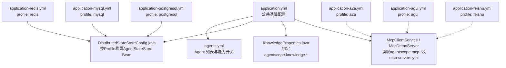
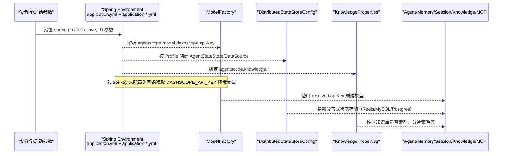
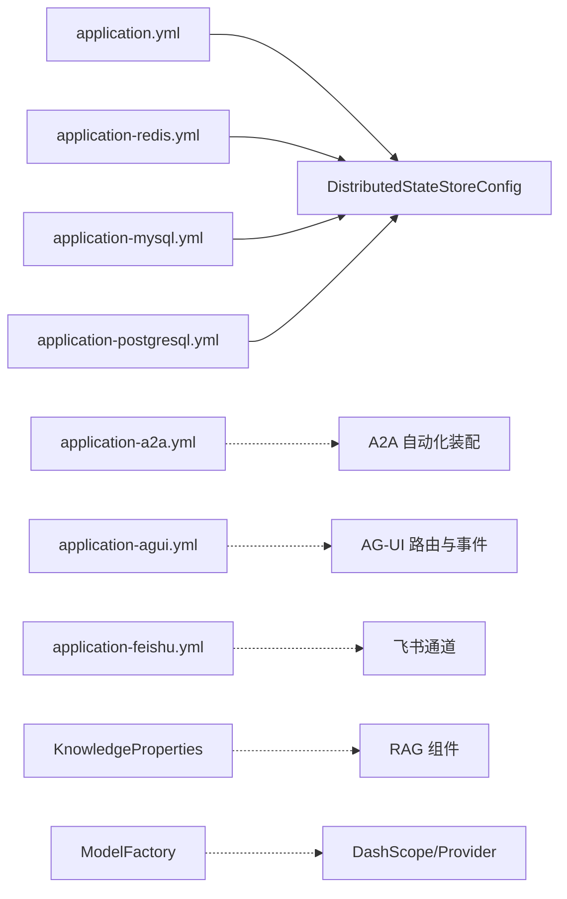

# 环境配置管理

<cite>
**本文引用的文件**
- [src/main/resources/application.yml](file://src/main/resources/application.yml)
- [src/main/resources/application-mysql.yml](file://src/main/resources/application-mysql.yml)
- [src/main/resources/application-postgresql.yml](file://src/main/resources/application-postgresql.yml)
- [src/main/resources/application-redis.yml](file://src/main/resources/application-redis.yml)
- [src/main/resources/application-a2a.yml](file://src/main/resources/application-a2a.yml)
- [src/main/resources/application-agui.yml](file://src/main/resources/application-agui.yml)
- [src/main/resources/application-feishu.yml](file://src/main/resources/application-feishu.yml)
- [src/test/resources/application-test.yml](file://src/test/resources/application-test.yml)
- [src/main/java/com/skloda/agentscope/config/DistributedStateStoreConfig.java](file://src/main/java/com/skloda/agentscope/config/DistributedStateStoreConfig.java)
- [src/main/java/com/skloda/agentscope/model/ModelFactory.java](file://src/main/java/com/skloda/agentscope/model/ModelFactory.java)
- [src/main/java/com/skloda/agentscope/harness/HarnessAgentService.java](file://src/main/java/com/skloda/agentscope/harness/HarnessAgentService.java)
- [src/main/resources/config/agents.yml](file://src/main/resources/config/agents.yml)
- [src/main/resources/config/mcp-servers.yml](file://src/main/resources/config/mcp-servers.yml)
- [src/main/java/com/skloda/agentscope/service/KnowledgeProperties.java](file://src/main/java/com/skloda/agentscope/service/KnowledgeProperties.java)
- [pom.xml](file://pom.xml)
</cite>

## 目录
1. 引言
2. 项目结构（配置相关）
3. 核心组件
4. 架构总览
5. 详细组件分析
6. 依赖关系分析
7. 性能考量
8. 故障排查指南
9. 结论
10. 附录：部署与最佳实践

## 引言
本指南聚焦 AgentScope Demo 的环境配置管理，重点说明如何运用 Spring Boot Profile 机制在开发、测试、生产等环境中切换配置；如何使用环境变量注入关键敏感信息与外部依赖连接串；讲解配置文件优先级与覆盖规则；梳理 agentscope 模块的配置结构（model、memory、tools、session、knowledge、mcp），以及各配置项的作用和影响。同时提供容器化与环境变量管理的最佳实践，帮助你在不同部署场景中安全、可维护地管理配置。

## 项目结构（配置相关）
本项目采用“基础配置 + 按 Profile 拆分”的配置文件组织方式：
- 公共基础配置：application.yml，定义默认服务端口、多部分上传限制、全局自动装配排除、agentscope 的基础行为（模型提供者、默认会话/知识/MCP等）。
- 按 Profile 的外部化配置：application-*.yml，针对 redis/mysql/postgresql/a2a/agui/feishu 等功能模块按需激活。
- 资源级配置：config/agents.yml、config/mcp-servers.yml，通过 @Value("classpath:...") 加载，独立于 application.* 的生命周期但受同一上下文影响。

图表来源
- [src/main/resources/application.yml:1-89](file://src/main/resources/application.yml#L1-L89)
- [src/main/java/com/skloda/agentscope/config/DistributedStateStoreConfig.java:43-117](file://src/main/java/com/skloda/agentscope/config/DistributedStateStoreConfig.java#L43-L117)
- [src/main/resources/application-redis.yml:1-16](file://src/main/resources/application-redis.yml#L1-L16)
- [src/main/resources/application-mysql.yml:1-17](file://src/main/resources/application-mysql.yml#L1-L17)
- [src/main/resources/application-postgresql.yml:1-17](file://src/main/resources/application-postgresql.yml#L1-L17)
- [src/main/resources/application-a2a.yml:1-27](file://src/main/resources/application-a2a.yml#L1-L27)
- [src/main/resources/application-agui.yml:1-20](file://src/main/resources/application-agui.yml#L1-L20)
- [src/main/resources/application-feishu.yml:1-25](file://src/main/resources/application-feishu.yml#L1-L25)

章节来源
- [src/main/resources/application.yml:1-89](file://src/main/resources/application.yml#L1-L89)

## 核心组件
- 应用入口与基础属性绑定：application.yml 中定义 agentscope.model、agentscope.memory、agentscope.tools、agentscope.session、agentscope.knowledge、agentscope.mcp 的默认值。
- 分布式状态存储分发器：DistributedStateStoreConfig 根据 profile 启用 Redis/MySQL/PostgreSQL 后端，并将对应 AgentStateStore 或 DataSource 暴露为 Bean，从而改变 Agent 会话/状态的持久化策略。
- 模型工厂：ModelFactory 统一管理 LLM 模型创建，优先从配置读取 apiKey，其次回退至环境变量 DASHSCOPE_API_KEY，再委托 ModelRegistry 完成最终解析。
- KnowledgeProperties：将 agentscope.knowledge.* 配置映射到 Java 类字段，驱动知识检索与向量化参数。
- 工具与脚本集合：config/agents.yml、config/mcp-servers.yml，分别注册 Agent 可用技能与 MCP 服务端点。

章节来源
- [src/main/java/com/skloda/agentscope/config/DistributedStateStoreConfig.java:43-117](file://src/main/java/com/skloda/agentscope/config/DistributedStateStoreConfig.java#L43-L117)
- [src/main/java/com/skloda/agentscope/model/ModelFactory.java:28-94](file://src/main/java/com/skloda/agentscope/model/ModelFactory.java#L28-L94)
- [src/main/java/com/skloda/agentscope/service/KnowledgeProperties.java:8-21](file://src/main/java/com/skloda/agentscope/service/KnowledgeProperties.java#L8-L21)
- [src/main/resources/config/agents.yml:1-L199](file://src/main/resources/config/agents.yml#L1-L199)
- [src/main/resources/config/mcp-servers.yml:1-L29](file://src/main/resources/config/mcp-servers.yml#L1-L29)

## 架构总览
下图展示了“运行期配置生效路径”，从命令行参数到配置文件再到 Java 属性对象的关键链路：

图表来源
- [src/main/java/com/skloda/agentscope/model/ModelFactory.java:83-94](file://src/main/java/com/skloda/agentscope/model/ModelFactory.java#L83-L94)
- [src/main/java/com/skloda/agentscope/config/DistributedStateStoreConfig.java:53-117](file://src/main/java/com/skloda/agentscope/config/DistributedStateStoreConfig.java#L53-L117)
- [src/main/resources/application.yml:26-79](file://src/main/resources/application.yml#L26-L79)

章节来源
- [src/main/resources/application.yml:26-79](file://src/main/resources/application.yml#L26-L79)

## 详细组件分析

### Spring Boot Profile 与环境切换
- 默认（无 profile）：仅启用 Web、Thymeleaf、默认 agentscope 行为；默认排除 DataSource 自动装配，保证无需数据库即可启动。
- redis：启用 Redis 状态存储（agentscope.session.type=redis），并注入 Redis URL 与 key-prefix。
- mysql/postgresql：启用对应 SQL 状态存储（agentscope.session.type=mysql/postgresql），并通过独立的 DataSource 构建。
- a2a：启用 A2A server/client 自动装配，注册 A2A agent，暴露端点。
- agui：注册 AG-UI 协议路由，开启推理事件和工具调用参数输出。
- feishu：启用飞书通道，要求配置 App ID/Secret/Token 等，可通过环境变量注入。
- test：禁用 MCP，减少 CI 对 Node 环境的依赖。

章节来源
- [src/main/resources/application-mysql.yml:1-L17](file://src/main/resources/application-mysql.yml#L1-L17)
- [src/main/resources/application-postgresql.yml:1-L17](file://src/main/resources/application-postgresql.yml#L1-L17)
- [src/main/resources/application-redis.yml:1-L16](file://src/main/resources/application-redis.yml#L1-L16)
- [src/main/resources/application-a2a.yml:1-L27](file://src/main/resources/application-a2a.yml#L1-L27)
- [src/main/resources/application-agui.yml:1-L20](file://src/main/resources/application-agui.yml#L1-L20)
- [src/main/resources/application-feishu.yml:1-L25](file://src/main/resources/application-feishu.yml#L1-L25)
- [src/test/resources/application-test.yml:1-L8](file://src/test/resources/application-test.yml#L1-L8)

### 环境变量注入与优先级
- 模型密钥注入路径：
  - application.yml 中定义 agentscope.model.dashscope.api-key 占位符，支持读取环境变量 DASHSCOPE_API_KEY。
  - ModelFactory.resolveApiKey() 会先检查配置绑定值，其次读取 DASHSCOPE_API_KEY 环境变量；若仍为空，则委托下游 Provider 自行探测环境变量。
  - HarnessAgentService 在缺少 API Key 时会抛出明确错误信息，提示通过配置或环境变量设置。
- 其他常见环境变量：
  - REDIS_URL：application-redis.yml 中用于 agentscope.distributed.redis.url。
  - MYSQL_URL/MYSQL_USER/MYSQL_PASSWORD：application-mysql.yml 的 datasource.*。
  - POSTGRES_URL/POSTGRES_USER/POSTGRES_PASSWORD：application-postgresql.yml 的 datasource.*。
  - FEISHU_APP_ID/FEISHU_APP_SECRET/...：application-feishu.yml 中 channel.feishu.* 的多处占位。
- 覆盖规则与建议：
  - Profile 配置优先覆盖基础 application.yml 的同名属性。
  - 环境变量覆盖 application.yml 中的 ${...} 占位表达式。
  - 通过命令行 -D 或 Spring Boot 启动参数也可覆盖同名属性键（例如传递 --agentscope.model.dashscope.api-key）。
  - 建议：将敏感信息仅保存在环境变量或外部配置中心，避免落盘到仓库；application.yml 中保留“空占位+注释”作为安全模板。

章节来源
- [src/main/resources/application.yml:26-L41](file://src/main/resources/application.yml#L26-L41)
- [src/main/java/com/skloda/agentscope/model/ModelFactory.java:83-L94](file://src/main/java/com/skloda/agentscope/model/ModelFactory.java#L83-L94)
- [src/main/java/com/skloda/agentscope/harness/HarnessAgentService.java:82-L86](file://src/main/java/com/skloda/agentscope/harness/HarnessAgentService.java#L82-L86)
- [src/main/resources/application-redis.yml:4-L8](file://src/main/resources/application-redis.yml#L4-L8)
- [src/main/resources/application-mysql.yml:4-L9](file://src/main/resources/application-mysql.yml#L4-L9)
- [src/main/resources/application-postgresql.yml:4-L9](file://src/main/resources/application-postgresql.yml#L4-L9)
- [src/main/resources/application-feishu.yml:11-L21](file://src/main/resources/application-feishu.yml#L11-L21)

### agentscope 模块配置结构与影响

#### model（模型）
- 作用：决定后端 LLM 提供商、具体模型名称、流式、思考模式与预算。
- 关键配置键：
  - agentscope.model.provider/dashscope/api-key/model-name/stream/enable-thinking/thinking-budget
- 行为：
  - ModelFactory 负责统一拼装 ModelCreationContext 并使用 ModelRegistry 解析模型；如未显式指定 provider，则默认为 dashscope 并以该 provider 前缀解析模型 ID。
  - apiKey 可从配置或环境变量获取，确保密钥不硬编码。
- 影响：
  - stream/enable-thinking 直接影响响应模式与延迟成本。
  - thinking-budget 控制“思考”消耗上限，需按模型与预算调优。

章节来源
- [src/main/resources/application.yml:26-L43](file://src/main/resources/application.yml#L26-L43)
- [src/main/java/com/skloda/agentscope/model/ModelFactory.java:28-L94](file://src/main/java/com/skloda/agentscope/model/ModelFactory.java#L28-L94)

#### memory（记忆）
- 作用：定义会话历史长度与存储类型（默认 in-memory）。
- 典型键：agentscope.memory.type/max-history。
- 影响：增大 max-history 有助于长对话但会增加内存占用。

章节来源
- [src/main/resources/application.yml:44-L49](file://src/main/resources/application.yml#L44-L49)

#### tools（工具）
- 作用：开关内置工具集，便于测试与裁剪功能。
- 典型键：agentscope.tools.enabled。
- 配合 config/agents.yml 中 userTools/systemTools 声明实际启用的工具清单，实现“配置驱动的工具可用性”。

章节来源
- [src/main/resources/application.yml:51-L55](file://src/main/resources/application.yml#L51-L55)
- [src/main/resources/config/agents.yml:30-L60](file://src/main/resources/config/agents.yml#L30-L60)

#### session（会话）
- 作用：定义会话是否启用、本地存储路径、持久化后端（InMemory/Redis/MySQL/PostgreSQL）。
- 关键键：
  - agentscope.session.enabled/storage-path
  - 各 profile 下的 agentscope.session.type
- 影响：分布式存储可在多实例共享会话；本地路径用于单实例调试。

章节来源
- [src/main/resources/application.yml:56-L60](file://src/main/resources/application.yml#L56-L60)
- [src/main/resources/application-mysql.yml:11-L14](file://src/main/resources/application-mysql.yml#L11-L14)
- [src/main/resources/application-postgresql.yml:11-L14](file://src/main/resources/application-postgresql.yml#L11-L14)
- [src/main/resources/application-redis.yml:4-L13](file://src/main/resources/application-redis.yml#L4-L13)
- [src/main/java/com/skloda/agentscope/config/DistributedStateStoreConfig.java:53-L117](file://src/main/java/com/skloda/agentscope/config/DistributedStateStoreConfig.java#L53-L117)

#### knowledge（知识/RAG）
- 作用：控制知识库是否启用、源路径、向量模型、分片/重叠大小、分词策略、是否自动建索引等。
- 关键键：agentscope.knowledge.enabled/path/embedding-model/dimensions/chunk-size/overlap-size/split-strategy/auto-index-on-startup
- 绑定方式：KnowledgeProperties 通过 ConfigurationProperties 映射上述键，供 RAG 组件消费。
- 影响：chunk/relation 影响检索精度与性能；auto-index-on-startup 在启动时扫描并建立索引，时间取决于数据规模。

章节来源
- [src/main/resources/application.yml:61-L71](file://src/main/resources/application.yml#L61-L71)
- [src/main/java/com/skloda/agentscope/service/KnowledgeProperties.java:8-L21](file://src/main/java/com/skloda/agentscope/service/KnowledgeProperties.java#L8-L21)

#### mcp（Model Context Protocol）
- 作用：声明 MCP 客户端/演示服务端开关与端口、超时等；加载 config/mcp-servers.yml 中的远程/本地 MCP 服务器配置。
- 关键键：agentscope.mcp.enabled/demo.enabled/sse-port/http-port/startup-timeout；mcp-servers.yml 中 servers[*] 描述传输、URL、鉴权头、超时等。
- 注意：MCP demo 需要 Node 环境（NPM）或可运行的进程；CI/Test 通常关闭以避免环境依赖。

章节来源
- [src/main/resources/application.yml:72-L79](file://src/main/resources/application.yml#L72-L79)
- [src/main/resources/config/mcp-servers.yml:1-L29](file://src/main/resources/config/mcp-servers.yml#L1-L29)
- [src/test/resources/application-test.yml:4-L8](file://src/test/resources/application-test.yml#L4-L8)

### Profile 组合与依赖图谱
下图展示了 Profile 如何影响 Bean 的注册与作用域：

图表来源
- [src/main/java/com/skloda/agentscope/config/DistributedStateStoreConfig.java:43-L117](file://src/main/java/com/skloda/agentscope/config/DistributedStateStoreConfig.java#L43-L117)
- [src/main/resources/application-a2a.yml:1-L27](file://src/main/resources/application-a2a.yml#L1-L27)
- [src/main/resources/application-agui.yml:1-L20](file://src/main/resources/application-agui.yml#L1-L20)
- [src/main/resources/application-feishu.yml:1-L25](file://src/main/resources/application-feishu.yml#L1-L25)
- [src/main/java/com/skloda/agentscope/service/KnowledgeProperties.java:8-L21](file://src/main/java/com/skloda/agentscope/service/KnowledgeProperties.java#L8-L21)
- [src/main/java/com/skloda/agentscope/model/ModelFactory.java:28-L94](file://src/main/java/com/skloda/agentscope/model/ModelFactory.java#L28-L94)

## 依赖关系分析
- 运行时依赖：
  - 模型服务：由 pom.xml 引入 agentscope-extensions-model-dashscope；ModelFactory 负责组装上下文并解析模型。
  - 状态存储：通过 DistributedStateStoreConfig 以 Profile 形式按需引入 Redis/MySQL/PostgreSQL 扩展。
  - 知识检索：通过 agentscope-extensions-rag-simple 及 embedding 依赖。
  - 外部协议：a2a、agui、feishu 均以 Profile 隔离，仅在所需场景下激活对应的自动化装配。
- 配置文件依赖：
  - application.yml 是基线；各 application-*.yml 通过键覆盖生效；config/* 由业务组件直接加载。
- 环境变量依赖：
  - 关键密钥与连接串通过环境变量注入，保证二进制制品与配置分离。

章节来源
- [pom.xml:28-L161](file://pom.xml#L28-L161)
- [src/main/java/com/skloda/agentscope/config/DistributedStateStoreConfig.java:43-L117](file://src/main/java/com/skloda/agentscope/config/DistributedStateStoreConfig.java#L43-L117)
- [src/main/resources/application.yml:13-L23](file://src/main/resources/application.yml#L13-L23)

## 性能考量
- 记忆与会话：
  - 提高 max-history 可增加对话上下文，但增加内存与序列处理开销；建议生产环境结合压缩策略与分页策略。
  - 选择 Redis/MySQL/PostgreSQL 存储有利于水平扩展，但网络往返可能带来延迟；可按读写比例与一致性需求选型。
- RAG 指标：
  - chunk-size/overlap-size 影响索引粒度与检索召回；dimensions 需与模型维度匹配。
  - auto-index-on-startup 在大知识库时会延长启动时间；建议在冷启动后增量更新，或使用任务编排触发重建。
- 模型与流式：
  - streaming=true 提升交互体验，但在高并发下需评估上游限流与下游令牌限速。
  - enable-thinking 会带来更高时延与 token 成本；生产可按 Agent 类型精细控制。
- MCP/AG-UI/A2A：
  - 这些特性属于附加能力，非必需时应保持关闭以减少启动时间与攻击面。

[本节为通用指导，不直接分析特定文件]

## 故障排查指南
- 缺少 DashScope API Key
  - 症状：启动或初始化阶段报错提示未配置 API Key。
  - 处理：通过以下三种方式之一配置：
    - 环境变量：DASHSCOPE_API_KEY
    - 配置属性：agentscope.model.dashscope.api-key
    - 命令行参数：--agentscope.model.dashscope.api-key
  - 参考位置：ModelFactory.resolveApiKey、HarnessAgentService 校验逻辑。
- Redis/MySQL/PostgreSQL 无法连接
  - 症状：分布式状态存储初始化失败或连接异常。
  - 处理：确认当前激活的 profile，核对对应 application-*.yml 中的 url/username/password/env 变量；验证网络连通性与凭据正确性。
- 知识索引未启动
  - 症状：启动后知识库不可检索或未建索引。
  - 处理：检查 agentscope.knowledge.auto-index-on-startup 是否为 true，path 指向正确的知识目录，embedding 模型可用。
- MCP 启动依赖缺失
  - 症状：demo 模式启动失败，报告 Node/命令不存在或端口不可用。
  - 处理：test/profile 中关闭 mcp.demo.enabled；或通过环境变量、进程编排提供 npx/npm 环境。
- 飞书回调不生效
  - 处理：确认 callback-path 与平台配置的公网地址一致；加密密钥在非生产可置空；App 权限与事件订阅已开通。

章节来源
- [src/main/java/com/skloda/agentscope/model/ModelFactory.java:83-L94](file://src/main/java/com/skloda/agentscope/model/ModelFactory.java#L83-L94)
- [src/main/java/com/skloda/agentscope/harness/HarnessAgentService.java:82-L86](file://src/main/java/com/skloda/agentscope/harness/HarnessAgentService.java#L82-L86)
- [src/main/resources/application-redis.yml:4-L13](file://src/main/resources/application-redis.yml#L4-L13)
- [src/main/resources/application-mysql.yml:4-L14](file://src/main/resources/application-mysql.yml#L4-L14)
- [src/main/resources/application-postgresql.yml:4-L14](file://src/main/resources/application-postgresql.yml#L4-L14)
- [src/main/resources/application.yml:61-L71](file://src/main/resources/application.yml#L61-L71)
- [src/main/resources/application-feishu.yml:11-L21](file://src/main/resources/application-feishu.yml#L11-L21)

## 结论
本项目的环境配置以“基础 application.yml + 多 profile 片段 + 环境变量注入”为核心，实现了按场景灵活装配能力与资源。对于敏感信息，优先采用环境变量；对数据库等外部依赖，通过 profile 最小化侵入默认启动态；对于可观测或对外暴露的协议（A2A/AG-UI/Feishu/MCP），以 profile 控制其生命周期。按此模式可在开发与生产之间平滑过渡，并保持配置的可审计性与可移植性。

[本节为总结性内容，不直接分析特定文件]

## 附录：部署与最佳实践

### 开发环境（本地快速运行）
- 必须：导出 DASHSCOPE_API_KEY 环境变量。
- 可选：如需分布式会话，添加 --spring.profiles.active=redis 并提供 REDIS_URL。
- 推荐：保留默认日志级别，必要时调大 io.agentscope 的 DEBUG 日志定位问题。

示例：
- set DASHSCOPE_API_KEY=xxx
- mvn spring-boot:run

章节来源
- [src/main/resources/application.yml:32-L41](file://src/main/resources/application.yml#L32-L41)

### 测试环境（CI/CD）
- 使用 application-test.yml 禁用 MCP demo，降低环境门槛。
- 可启用 redis profile 进行跨进程共享状态，或继续使用 in-memory 做单元测试。
- 通过 -D 参数传入必要配置，避免污染镜像与仓库。

章节来源
- [src/test/resources/application-test.yml:4-L8](file://src/test/resources/application-test.yml#L4-L8)

### 生产环境（容器化）
- 使用环境变量集中管理所有敏感项：
  - DASHSCOPE_API_KEY
  - REDIS_URL（或 MySQL/PostgreSQL 连接串及凭据）
  - FEISHU_* 系列（如启用飞书）
- 容器编排建议使用 ConfigMap/Secrets 注入环境变量，不要将密钥写入镜像。
- 通过 --spring.profiles.active 选择所需扩展（如 redis/mysql/postgresql/agui/a2a/feishu），每个 profile 仅承载一个侧车能力，遵循最小暴露原则。

章节来源
- [src/main/resources/application.yml:26-L79](file://src/main/resources/application.yml#L26-L79)
- [src/main/resources/application-redis.yml:4-L13](file://src/main/resources/application-redis.yml#L4-L13)
- [src/main/resources/application-mysql.yml:4-L14](file://src/main/resources/application-mysql.yml#L4-L14)
- [src/main/resources/application-postgresql.yml:4-L14](file://src/main/resources/application-postgresql.yml#L4-L14)
- [src/main/resources/application-a2a.yml:1-L27](file://src/main/resources/application-a2a.yml#L1-L27)
- [src/main/resources/application-agui.yml:1-L20](file://src/main/resources/application-agui.yml#L1-L20)
- [src/main/resources/application-feishu.yml:11-L21](file://src/main/resources/application-feishu.yml#L11-L21)

### 敏感信息保护策略
- 一律通过环境变量注入 API Key、数据库密码、第三方 Token。
- 不在源码或配置仓库中留存明文密钥；application.yml 中只保留占位符与注释。
- 在生产层面对日志脱敏，避免打印敏感值。
- 使用运行时诊断 profile（如 jar-diagnostic）检查配置生效与可访问性，但不泄露真实凭据。

章节来源
- [src/main/java/com/skloda/agentscope/model/ModelFactory.java:83-L94](file://src/main/java/com/skloda/agentscope/model/ModelFactory.java#L83-L94)
- [src/main/resources/application.yml:32-L41](file://src/main/resources/application.yml#L32-L41)