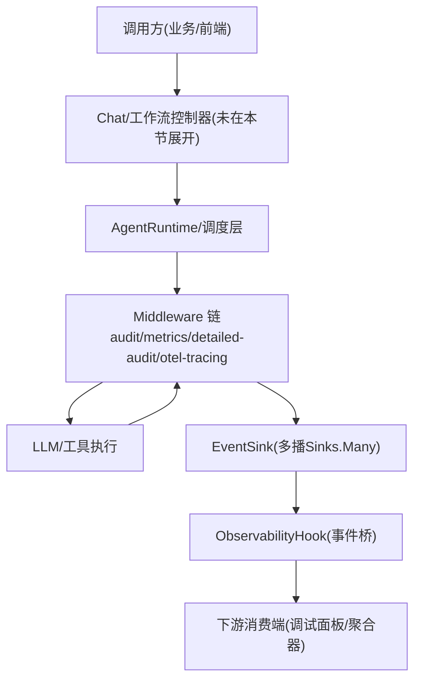
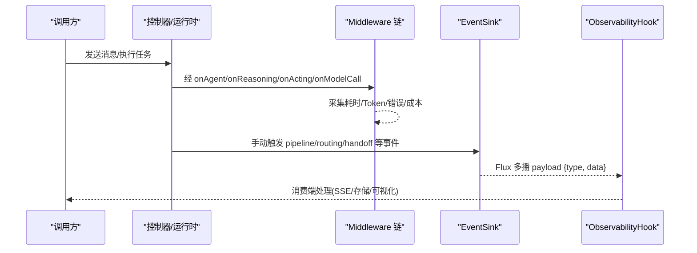
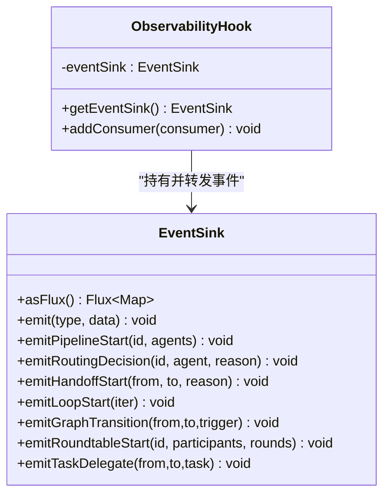
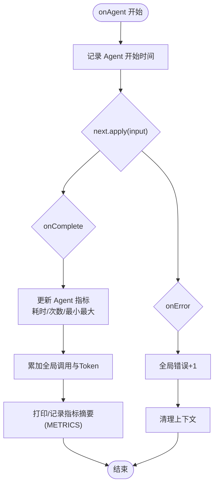
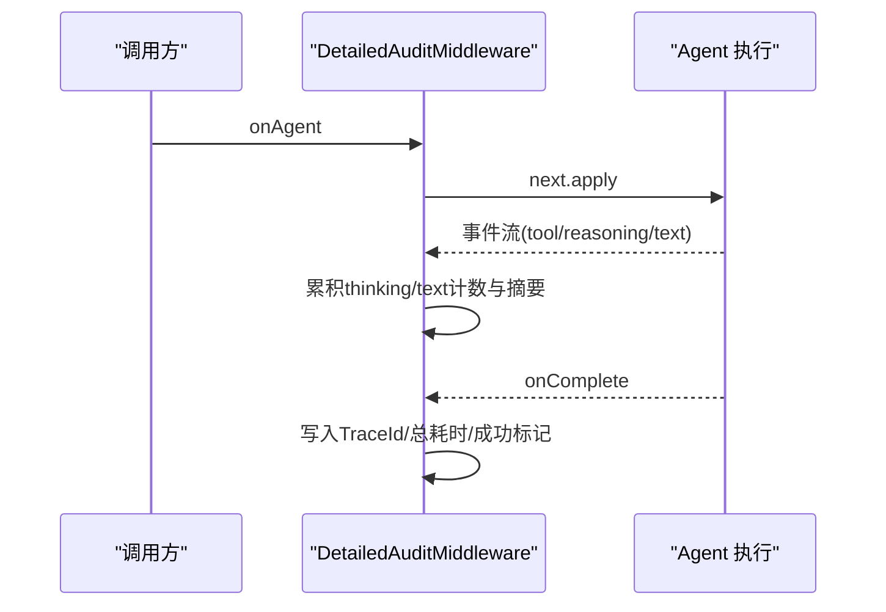
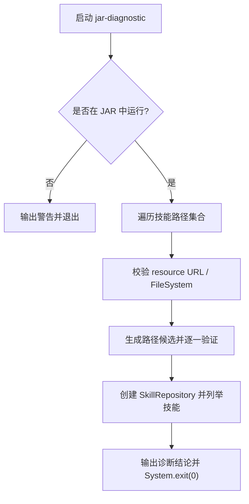
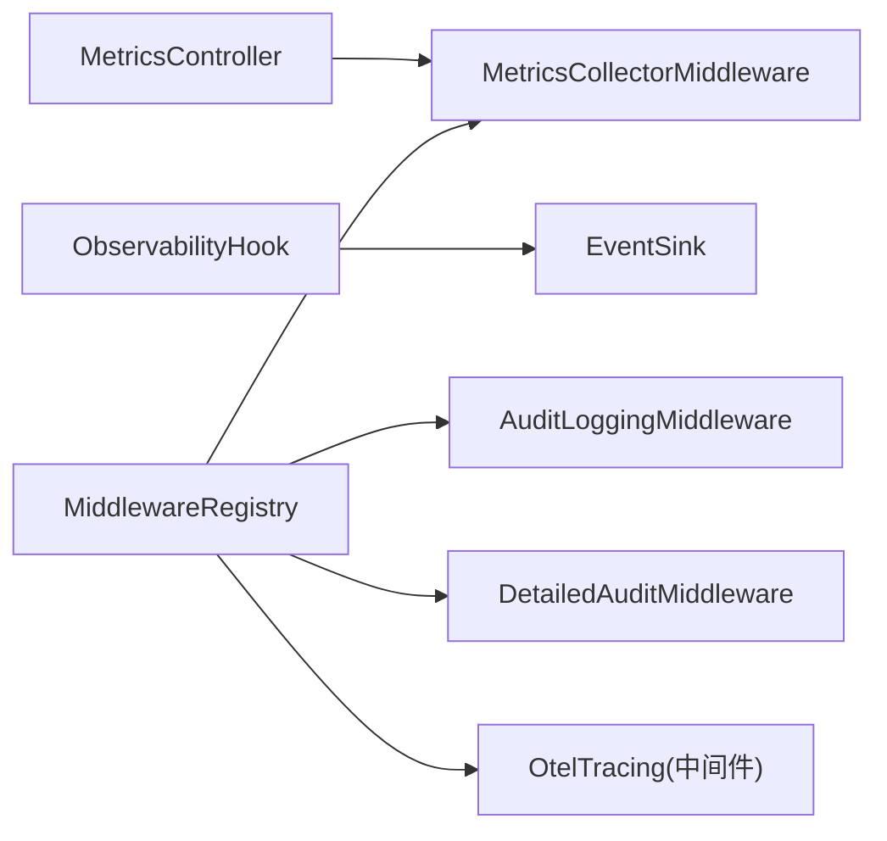

# 监控运维

<cite>
**本文档中引用的文件**
- [ObservabilityHook.java](file://src/main/java/com/skloda/agentscope/hook/ObservabilityHook.java)
- [EventSink.java](file://src/main/java/com/skloda/agentscope/runtime/EventSink.java)
- [JarEnvironmentDiagnostic.java](file://src/main/java/com/skloda/agentscope/config/JarEnvironmentDiagnostic.java)
- [MetricsController.java](file://src/main/java/com/skloda/agentscope/controller/MetricsController.java)
- [MetricsCollectorMiddleware.java](file://src/main/java/com/skloda/agentscope/middleware/MetricsCollectorMiddleware.java)
- [AuditLoggingMiddleware.java](file://src/main/java/com/skloda/agentscope/middleware/AuditLoggingMiddleware.java)
- [DetailedAuditMiddleware.java](file://src/main/java/com/skloda/agentscope/middleware/DetailedAuditMiddleware.java)
- [MiddlewareRegistry.java](file://src/main/java/com/skloda/agentscope/middleware/MiddlewareRegistry.java)
- [application.yml](file://src/main/resources/application.yml)
- [ObservabilityHookLifecycleTest.java](file://src/test/java/com/skloda/agentscope/hook/ObservabilityHookLifecycleTest.java)
</cite>

## 目录
1. [简介](#简介)
2. [项目结构](#项目结构)
3. [核心组件](#核心组件)
4. [架构总览](#架构总览)
5. [详细组件分析](#详细组件分析)
6. [依赖关系分析](#依赖关系分析)
7. [性能考虑](#性能考虑)
8. [故障排查指南](#故障排查指南)
9. [结论](#结论)
10. [附录](#附录)

## 简介
本指南面向生产与运维场景，系统性说明本项目如何实现可观测性、指标采集与环境诊断，并提供日志治理、指标暴露、告警规划与容量规划的实操方案。主要覆盖：
- ObservabilityHook 的可观测性桥接事件（流水线、路由、交接、循环、图状态、圆桌讨论、任务委派等）及与 EventSink 的关系
- JarEnvironmentDiagnostic 的 JAR 环境自诊断能力，用于定位资源加载、类路径与依赖冲突问题
- MetricsController 暴露的指标管理能力，以及向外部系统集成的建议（如 Prometheus 接入思路）
- 结构化日志输出与日志级别调整策略（含 METRICS、审计相关 Logger）
- 告警规则设计与应急预案、性能瓶颈定位方法与容量规划基线

## 项目结构
围绕“观测—诊断—指标—日志”构建如下分层：
- 可观测性事件桥：ObservabilityHook + EventSink，对外提供统一的多 Agent 事件流
- 中间件链路：内置审计、性能指标、OTel 链路追踪等多能力 MiddlewareBase
- 指标控制面：MetricsController 提供查询/打印/重置能力，串联底层 MetricsCollector 汇总
- 环境诊断：JarEnvironmentDiagnostic 在特定 profile 下运行一次检查后退出，用于快速定位 Classpath/Skill/依赖问题
- 日志配置：application.yml 中集中定义 logging level/pattern 与命名空间（METRICS 等）

图示来源
- [MiddlewareRegistry.java:26-40](file://src/main/java/com/skloda/agentscope/middleware/MiddlewareRegistry.java#L26-L40)
- [EventSink.java:19-33](file://src/main/java/com/skloda/agentscope/runtime/EventSink.java#L19-L33)
- [ObservabilityHook.java:30-35](file://src/main/java/com/skloda/agentscope/hook/ObservabilityHook.java#L30-L35)

章节来源
- [MiddlewareRegistry.java:26-40](file://src/main/java/com/skloda/agentscope/middleware/MiddlewareRegistry.java#L26-L40)
- [application.yml:81-90](file://src/main/resources/application.yml#L81-L90)

## 核心组件
- ObservabilityHook：将传统 Hook 消费者适配到新的 EventSink 体系，通过 addConsumer 接收 type+payload 的事件；提供 emit 系列方法封装多 Agent 协作事件的发射
- EventSink：基于 Sinks.Many<Map<String,Object>> 的多播事件总线，提供丰富的 typed emit 方法，涵盖流水线、路由、交接、循环、图状态、圆桌、任务委派等
- MetricsCollectorMiddleware：作为中间件拦截 Agent/Reasoning/Acting/ModelCall，统计耗时、Token、错误率、估算成本等，提供汇总打印能力
- AuditLoggingMiddleware / DetailedAuditMiddleware：分别提供基础审计与增强审计（TraceId、工具参数/结果、思考过程摘要等），支撑问题回溯
- MetricsController：对外暴露打印、重置与状态接口，连接 MetricsCollectorMiddleware 的静态指标
- MiddlewareRegistry：注册并实例化各 Middleware 工厂，包含内置的中继能力与 OTel Tracing

章节来源
- [ObservabilityHook.java:16-67](file://src/main/java/com/skloda/agentscope/hook/ObservabilityHook.java#L16-L67)
- [EventSink.java:11-152](file://src/main/java/com/skloda/agentscope/runtime/EventSink.java#L11-L152)
- [MetricsCollectorMiddleware.java:21-90](file://src/main/java/com/skloda/agentscope/middleware/MetricsCollectorMiddleware.java#L21-L90)
- [AuditLoggingMiddleware.java:15-68](file://src/main/java/com/skloda/middleware/AuditLoggingMiddleware.java#L15-L68)
- [DetailedAuditMiddleware.java:28-107](file://src/main/java/com/skloda/agentscope/middleware/DetailedAuditMiddleware.java#L28-L107)
- [MetricsController.java:12-57](file://src/main/java/com/skloda/agentscope/controller/MetricsController.java#L12-L57)
- [MiddlewareRegistry.java:26-40](file://src/main/java/com/skloda/agentscope/middleware/MiddlewareRegistry.java#L26-L40)

## 架构总览
从请求进入服务到事件被消费的关键路径如下：

图示来源
- [MetricsCollectorMiddleware.java:50-90](file://src/main/java/com/skloda/agentscope/middleware/MetricsCollectorMiddleware.java#L50-L90)
- [EventSink.java:19-33](file://src/main/java/com/skloda/agentscope/runtime/EventSink.java#L19-L33)
- [ObservabilityHook.java:30-35](file://src/main/java/com/skloda/agentscope/hook/ObservabilityHook.java#L30-L35)

## 详细组件分析

### 观测事件桥：ObservabilityHook 与 EventSink
- 事件类型覆盖：pipeline_start/end、step 起止、routing_decision/end、handoff_start/complete、loop_start/end/iteration、graph_transition/call、roundtable_*、task_* 等
- 事件载体：Map<String,Object>，附带 type 与 timestamp；typed emit 方法便于一致性地构造上下文
- 生命周期：ObservabilityHook 内部持有 EventSink，addConsumer 订阅 Flux，实现事件转发；移除消费者采用被动语义
- 测试验证：ObservabilityHookLifecycleTest 确认了关键事件序列是否按预期产出

图示来源
- [EventSink.java:19-152](file://src/main/java/com/skloda/agentscope/runtime/EventSink.java#L19-L152)
- [ObservabilityHook.java:16-67](file://src/main/java/com/skloda/agentscope/hook/ObservabilityHook.java#L16-L67)

章节来源
- [ObservabilityHook.java:30-35](file://src/main/java/com/skloda/agentscope/hook/ObservabilityHook.java#L30-L35)
- [ObservabilityHookLifecycleTest.java:28-115](file://src/test/java/com/skloda/agentscope/hook/ObservabilityHookLifecycleTest.java#L28-L115)

### 性能与成本指标：MetricsCollectorMiddleware
- 采集点：
  - Agent 粒度：调用次数、总耗时、最小/最大耗时
  - 工具粒度：调用次数、总耗时、最小/最大耗时、错误计数
  - LLM 模型调用：累计 Token 数、全局调用计数、估计费用（依据示例定价逻辑）
- 线程安全：使用 AtomicLong/ConcurrentHashMap 等保证并发安全
- 输出方式：控制台/专用 logger（METRICS）打印汇总；可通过 HTTP API 触发或定时任务上报
- 提示：如需接入 Prometheus，可在中间件完成采集时同时调用 Micrometer 计数器/计时器，或通过 Collector 暴露

图示来源
- [MetricsCollectorMiddleware.java:50-90](file://src/main/java/com/skloda/agentscope/middleware/MetricsCollectorMiddleware.java#L50-L90)

章节来源
- [MetricsCollectorMiddleware.java:21-90](file://src/main/java/com/skloda/agentscope/middleware/MetricsCollectorMiddleware.java#L21-L90)

### 审计日志：AuditLoggingMiddleware 与 DetailedAuditMiddleware
- 基础审计：记录 Agent 启动/完成、推理阶段时长、工具调用预览与耗时
- 增强审计：生成 TraceId、捕获工具入参与部分输出、统计 thinking/text 块数量、记录错误堆栈与成功标记
- 日志通道：均输出至各自 Logger，便于分级管理与筛选

图示来源
- [DetailedAuditMiddleware.java:45-107](file://src/main/java/com/skloda/agentscope/middleware/DetailedAuditMiddleware.java#L45-L107)
- [AuditLoggingMiddleware.java:19-68](file://src/main/java/com/skloda/agentscope/middleware/AuditLoggingMiddleware.java#L19-L68)

章节来源
- [DetailedAuditMiddleware.java:28-107](file://src/main/java/com/skloda/agentscope/middleware/DetailedAuditMiddleware.java#L28-L107)
- [AuditLoggingMiddleware.java:15-68](file://src/main/java/com/skloda/agentscope/middleware/AuditLoggingMiddleware.java#L15-L68)

### 指标管理 API：MetricsController
- POST /api/metrics/print：触发当前聚合指标的终端输出（配合 METRICS 日志）
- POST /api/metrics/reset：重置指标计数器
- GET /api/metrics/status：返回可用端点描述与说明

章节来源
- [MetricsController.java:12-57](file://src/main/java/com/skloda/agentscope/controller/MetricsController.java#L12-L57)

### 环境自诊断：JarEnvironmentDiagnostic
- 激活方式：以 Spring Profile jar-diagnostic 启动，运行一次完整检查后立即退出
- 检测能力：
  - 判断当前运行模式（JAR vs IDE）
  - 校验资源路径是否存在、是否目录、目录内容枚举
  - 尝试打开 jar 文件系统并对不同路径候选进行存在性与访问性验证
  - 尝试创建 SkillRepository 并列举技能名称，验证依赖可用性
- 适用场景：打包发布前定位 skills/knowledge/classpath 差异导致的运行期资源缺失

图示来源
- [JarEnvironmentDiagnostic.java:34-178](file://src/main/java/com/skloda/agentscope/config/JarEnvironmentDiagnostic.java#L34-L178)

章节来源
- [JarEnvironmentDiagnostic.java:34-79](file://src/main/java/com/skloda/agentscope/config/JarEnvironmentDiagnostic.java#L34-L79)
- [JarEnvironmentDiagnostic.java:81-178](file://src/main/java/com/skloda/agentscope/config/JarEnvironmentDiagnostic.java#L81-L178)

### 中间件编排：MiddlewareRegistry
- 内置已注册能力：audit-logging、rate-limit、context-enrichment、detailed-audit、metrics-collector、otel-tracing
- 职责：以工厂 Supplier 形式统一创建 Middleware 实例，便于注入与管理
- 注意：当前仓库未集成 Prometheus 客户端，指标仅本地聚合/日志；若需时序指标导出，请按下方“Prometheus 集成方案”补充

章节来源
- [MiddlewareRegistry.java:26-40](file://src/main/java/com/skloda/agentscope/middleware/MiddlewareRegistry.java#L26-L40)

## 依赖关系分析
- 组件耦合：
  - ObservabilityHook 强依赖于 EventSink（持有引用），不反向依赖上层控制器
  - MetricsCollectorMiddleware 与 Controller 松耦合：Controller 仅调用其静态方法获取/清理指标
  - 中间件均为独立的 MiddlewareBase 实现，通过 Registry 组装，避免环路
- 外部依赖：
  - 日志：SLF4J + 配置于 application.yml 的 Logger 名（如 METRICS）
  - 可选：OTel Tracing（已注册名为 otel-tracing）
  - 可选：Prometheus（未内嵌，按需引入 Micrometer + 导出器）

图示来源
- [MetricsController.java:12-57](file://src/main/java/com/skloda/agentscope/controller/MetricsController.java#L12-L57)
- [MetricsCollectorMiddleware.java:21-90](file://src/main/java/com/skloda/agentscope/middleware/MetricsCollectorMiddleware.java#L21-L90)
- [MiddlewareRegistry.java:26-40](file://src/main/java/com/skloda/agentscope/middleware/MiddlewareRegistry.java#L26-L40)
- [EventSink.java:19-33](file://src/main/java/com/skloda/agentscope/runtime/EventSink.java#L19-L33)
- [ObservabilityHook.java:16-67](file://src/main/java/com/skloda/agentscope/hook/ObservabilityHook.java#L16-L67)

章节来源
- [application.yml:81-90](file://src/main/resources/application.yml#L81-L90)
- [MiddlewareRegistry.java:26-40](file://src/main/java/com/skloda/agentscope/middleware/MiddlewareRegistry.java#L26-L40)

## 性能考虑
- 指标采集
  - 避免在主链路中进行重 IO 操作；指标聚合使用原子变量与并发容器，开销低
  - 高频工具调用场景下，建议关闭冗余的详细信息采样，降低日志与 CPU 压力
- 事件流
  - EventSink 使用背压缓冲的多播；大量消费端时应确保下游有合适的背压处理，避免 OOM
- 中间件链
  - 谨慎开启过多增强型中间件（如 detailed-audit），在生产环境下权衡可见性与开销
  - 启用 otel-tracing 后，注意 Span/Trace 采样率对性能的影响
- 模型调用与 Token
  - 注意 Token 增长带来的延迟与成本上升；结合成本估算指标优化 Prompt 长度与复用上下文

[本节为通用指导，无特定文件分析]

## 故障排查指南
- 现象：打包后可运行但 Skills/资源找不到
  - 使用 jar-diagnostic Profile 运行一次自检，观察输出中的资源 URL、URI Scheme、路径候选与目录内容；根据诊断结果修正资源布局或路径拼接
- 现象：多 Agent 事件未出现在前端/下游
  - 核查 ObservabilityHook.addConsumer 订阅是否生效；确认 EventSink.asFlux 的订阅链未被提前终止；检查业务侧是否正确监听 type 分类
- 现象：无法查看指标或误以为没有数据
  - 先调 GET /api/metrics/status，再 POST /api/metrics/print 查看控制台输出，并结合日志 METRICS 级别进行确认；必要时 POST /api/metrics/reset 重置后再观察
- 现象：难以定位异常与根因
  - 启用 enhanced audit（detailed-audit），借助 TraceId 关联同一链路事件，结合工具入参/输出与错误堆栈快速定界

章节来源
- [JarEnvironmentDiagnostic.java:34-178](file://src/main/java/com/skloda/agentscope/config/JarEnvironmentDiagnostic.java#L34-L178)
- [ObservabilityHook.java:30-67](file://src/main/java/com/skloda/agentscope/hook/ObservabilityHook.java#L30-L67)
- [MetricsController.java:22-57](file://src/main/java/com/skloda/agentscope/controller/MetricsController.java#L22-L57)
- [DetailedAuditMiddleware.java:45-107](file://src/main/java/com/skloda/agentscope/middleware/DetailedAuditMiddleware.java#L45-L107)

## 结论
本项目的可观测性由“事件总线 + 中间件 + 日志 + 诊断工具”构成闭环：ObservabilityHook 与 EventSink 负责统一的多 Agent 事件输出；中间件链提供性能、审计与链路追踪；Controller 提供轻量指标管理；jar-diagnostic 帮助在打包态快速定位资源与环境问题。生产环境下建议结合日志治理、告警与容量规划形成可持续演进体系。

[本节为总结性内容，无特定文件分析]

## 附录

### 指标定义与 Prometheus 集成方案（实施建议）
- 当前状态
  - MetricsCollectorMiddleware 已在内存中聚合：Agent 调用次数/耗时分布、工具调用次数/耗时/错误率、Token 总量与估计成本；通过日志（METRICS）和 HTTP 接口输出
  - 未嵌入 Prometheus 客户端与采集端点（/actuator/prometheus 等）
- 建议的对接步骤
  - 引入 Micrometer 与 Prometheus 依赖
  - 在关键指标采集点调用 MeterRegistry 的 Counter/Timer 进行递增与计时
  - 暴露指标端点供 Prometheus Server 抓取
  - 将现有 MetricCollector 的逻辑替换/扩展为同步写 Meter
  - 保留现有的 print/reset/status API，便于非自动化场景回退

[本小节为概念性指导，无直接代码映射]

### 日志级别调整与结构化日志输出
- 日志级别
  - 通过 application.yml 配置 root、io.agentscope、com.msxf.agentscope 与 METRICS 的级别，默认 INFO；调试时可短期上调到 DEBUG
- 结构化日志
  - 建议在中间件中以 JSON 或 Key-Value 形式输出关键字段（traceId、agentName、toolName、tokens、duration、success），便于 ELK/日志平台解析
- ELK 栈采集建议（实施思路）
  - Filebeat/FluentBit 收集日志文件，Elasticsearch 索引，Kibana 可视化
  - 为不同模块建立索引别名（metrics、audit、error），便于检索与告警联动
  - 针对高吞吐场景采用滚动索引与冷热分层

[本小节为通用实践，无特定文件分析]

### 告警规则配置（建议）
- 成功率下降：当某 Agent 或工具的失败率超过阈值（如 5%/min）触发
- 响应延迟升高：P95/P99 延迟突增或持续高于目标值
- Token/Cost 激增：Token 速率超预算，触发成本预警
- 资源不可用：JAR/Classpath/Skills 资源缺失（结合诊断日志关键字告警）
- 错误日志尖峰：ERROR/Exception 频率超过阈值时告警

[本小节为概念性指导，无直接代码映射]

### 容量规划策略（建议）
- 横向扩容：无状态节点扩容 + 负载均衡，提高 QPS 与并发度
- 异步化解耦：将指标导出、审计落盘改为异步批量写，减少热点与 GC 压力
- 限流与降级：在高负载时限制复杂工具或长链路流程的并发
- 缓存与复用：缓存热门知识与工具结果，减少重复计算与模型调用

[本小节为通用指导，无特定文件分析]