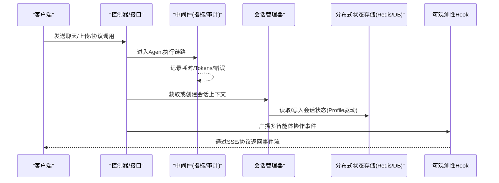
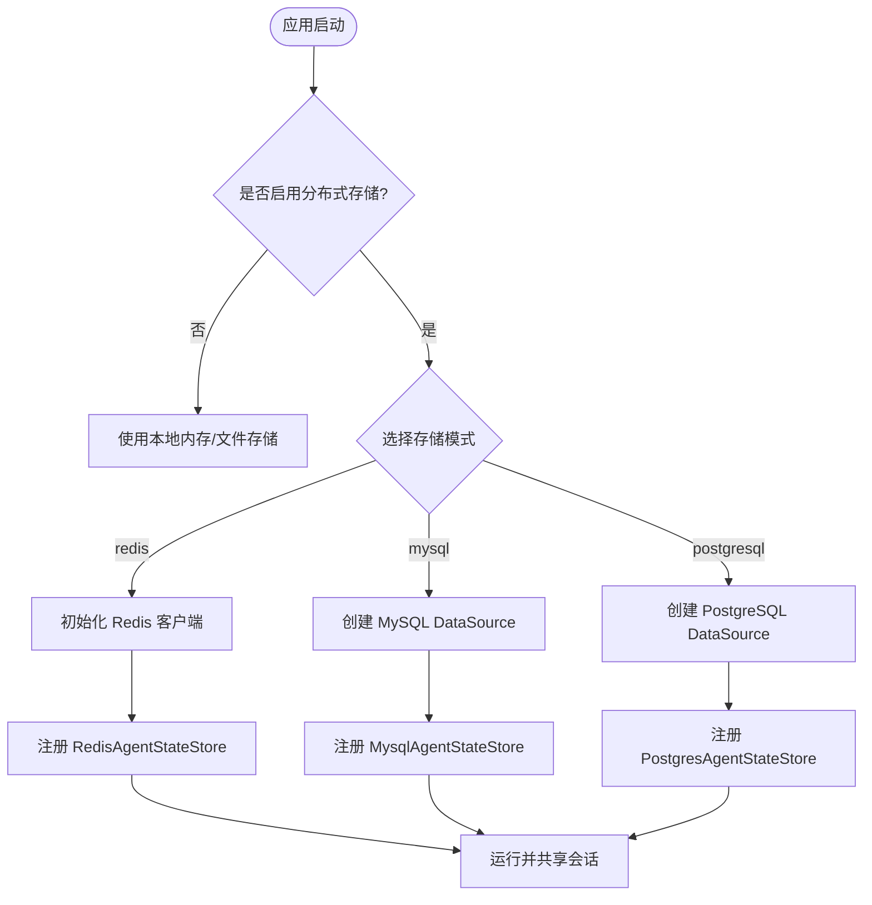
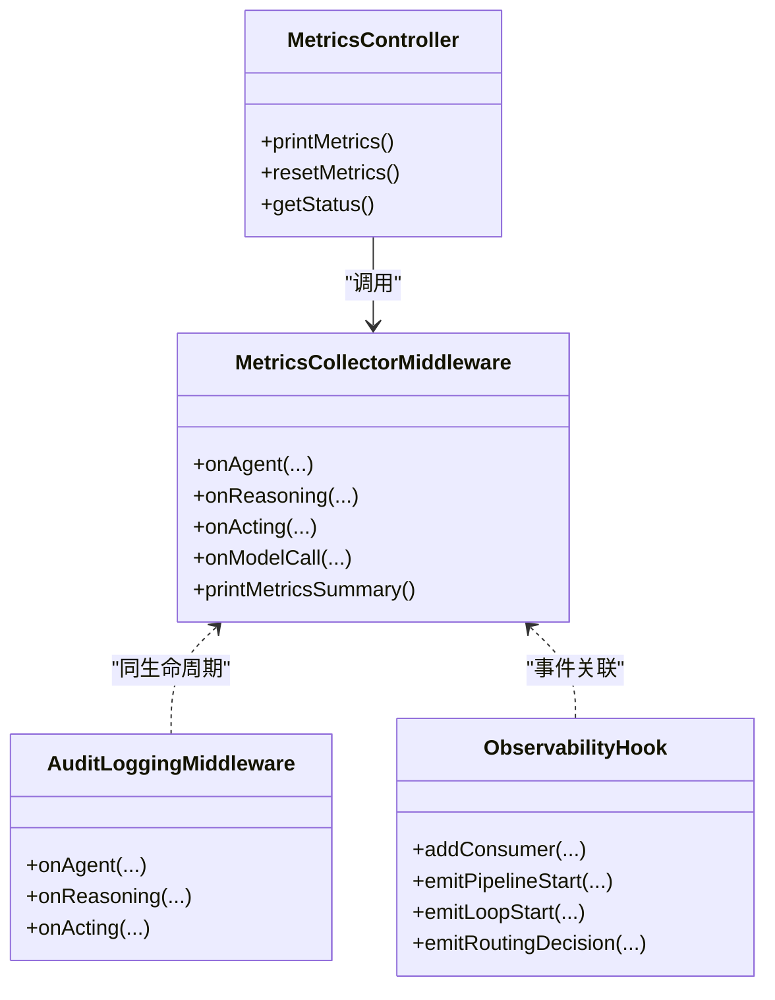
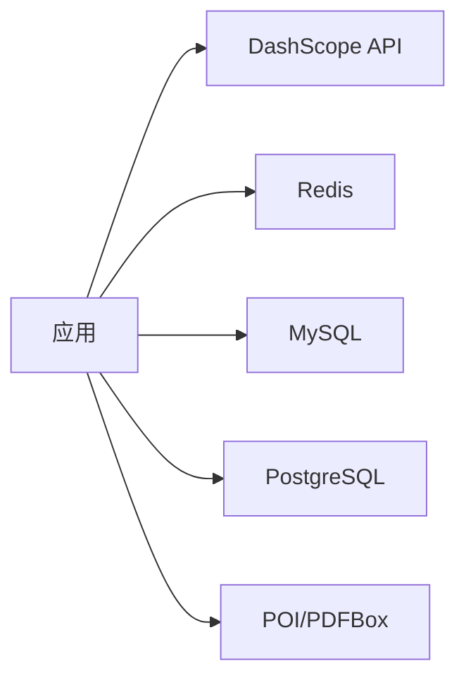

# 部署与运维

<cite>
**本文件中引用的文件**
- [应用主配置](file://src/main/resources/application.yml)
- [Redis 分布式存储 Profile](file://src/main/resources/application-redis.yml)
- [MySQL 分布式存储 Profile](file://src/main/resources/application-mysql.yml)
- [PostgreSQL 分布式存储 Profile](file://src/main/resources/application-postgresql.yml)
- [分布式状态存储配置](file://src/main/java/com/skloda/agentscope/config/DistributedStateStoreConfig.java)
- [会话管理服务](file://src/main/java/com/skloda/agentscope/service/SessionManagerService.java)
- [指标采集中间件](file://src/main/java/com/skloda/agentscope/middleware/MetricsCollectorMiddleware.java)
- [审计日志中间件](file://src/main/java/com/skloda/agentscope/middleware/AuditLoggingMiddleware.java)
- [指标查询控制器](file://src/main/java/com/skloda/agentscope/controller/MetricsController.java)
- [可观测性 Hook](file://src/main/java/com/skloda/agentscope/hook/ObservabilityHook.java)
- [A2A Profile 配置](file://src/main/resources/application-a2a.yml)
- [AG-UI Profile 配置](file://src/main/resources/application-agui.yml)
- [AgentScope Demo POM](file://pom.xml)
- [项目说明文档（包含运行和端点）](file://README.md)
</cite>

## 目录
1. [引言](#引言)
2. [项目结构](#项目结构)
3. [核心组件](#核心组件)
4. [架构总览](#架构总览)
5. [详细组件分析](#详细组件分析)
6. [依赖关系分析](#依赖关系分析)
7. [性能考虑](#性能考虑)
8. [故障排查指南](#故障排查指南)
9. [结论](#结论)
10. [附录](#附录)

## 引言
本指南聚焦于 AgentScope Demo 的生产级部署与运维实践，覆盖以下主题：
- 配置管理与环境变量注入、配置文件加密思路
- 分布式状态存储的选型与切换（Redis/MySQL/PostgreSQL），与会话共享策略
- Docker 容器化、Kubernetes 编排理念、负载均衡与健康检查要点
- 监控告警、日志聚合、性能深度诊断
- 备份与恢复、灾难恢复、安全加固与合规性建议

内容以仓库中现有配置与代码为依据，并提供可操作的建议，帮助你将该项目稳定部署到生产环境。

## 项目结构
从构建与运行时视角看，本项目是 Spring Boot 3 应用，使用 Maven 构建；默认不引入数据库自动装配，分布式能力通过 Spring Profile 按需激活。关键路径与职责如下：
- application.yml：全局基础配置，禁用数据源自动装配与 A2A 自动装配，保持默认启动最简
- application-{profile}.yml：按场景提供 Redis、MySQL、PostgreSQL、A2A、AG-UI 等可选特性
- 配置类集中位于 config 包，Profile 粒度精细控制 Bean 暴露
- 服务与中间件：会话管理、中间件（指标、审计）、可观测性钩子等
- 端点由 Controller 暴露，包含 Chat、知识、工作流、指标等

```mermaid
graph TB
    App["Spring Boot 应用"]
    A2A["A2A Profile<br/>application-a2a.yml"]
    AGUI["AG-UI Profile<br/>application-agui.yml"]
    REDIS["Redis Profile<br/>application-redis.yml"]
    MYSQL["MySQL Profile<br/>application-mysql.yml"]
    PG["PostgreSQL Profile<br/>application-postgresql.yml"]
    CFG["DistributedStateStoreConfig"]
    SES["SessionManagerService"]
    MID_METRICS["MetricsCollectorMiddleware"]
    MID_AUDIT["AuditLoggingMiddleware"]
    OBS["ObservabilityHook"]
    CTRL_METRICS["MetricsController"]

    App --> A2A
    App --> AGUI
    App --> REDIS
    App --> MYSQL
    App --> PG
    App --> CFG
    App --> SES
    App --> MID_METRICS
    App --> MID_AUDIT
    App --> OBS
    App --> CTRL_METRICS
```

图表来源
- [应用主配置:1-90](file://src/main/resources/application.yml#L1-L90)
- [应用-redis.yml:1-17](file://src/main/resources/application-redis.yml#L1-L17)
- [应用-mysql.yml:1-18](file://src/main/resources/application-mysql.yml#L1-L18)
- [应用-postgresql.yml:1-18](file://src/main/resources/application-postgresql.yml#L1-L18)
- [分布式状态存储配置:1-118](file://src/main/java/com/skloda/agentscope/config/DistributedStateStoreConfig.java#L1-L118)
- [指标采集中间件:1-200](file://src/main/java/com/skloda/agentscope/middleware/MetricsCollectorMiddleware.java#L1-L200)
- [审计日志中间件:1-69](file://src/main/java/com/skloda/agentscope/middleware/AuditLoggingMiddleware.java#L1-L69)
- [可观测性 Hook:1-67](file://src/main/java/com/skloda/agentscope/hook/ObservabilityHook.java#L1-L67)
- [指标控制器:1-57](file://src/main/java/com/skloda/agentscope/controller/MetricsController.java#L1-L57)

章节来源
- [应用主配置:1-90](file://src/main/resources/application.yml#L1-L90)
- [应用-redis.yml:1-17](file://src/main/resources/application-redis.yml#L1-L17)
- [应用-mysql.yml:1-18](file://src/main/resources/application-mysql.yml#L1-L18)
- [应用-postgresql.yml:1-18](file://src/main/resources/application-postgresql.yml#L1-L18)
- [应用-a2a.yml:1-27](file://src/main/resources/application-a2a.yml#L1-L27)
- [应用-agui.yml:1-21](file://src/main/resources/application-agui.yml#L1-L21)
- [AgentScope Demo POM:1-200](file://pom.xml#L1-L200)

## 核心组件
- 配置加载与环境变量注入
  - 模型 API Key 通过环境变量 DASHSCOPE_API_KEY 注入
  - 各 profile 将连接信息以环境变量形式配置（如 REDIS_URL、MYSQL_*、POSTGRES_*）
- 分布式状态存储
  - 基于 Profile 在运行时选择 Redis/MySQL/PostgreSQL 作为会话状态的持久化后端
- 会话管理与会话迁移
  - 内存缓存活跃会话并按需创建/迁移状态存储
- 中间件链
  - 指标采集与审计日志贯穿 Agent 执行链路
- 可观测性扩展
  - 通过 ObservabilityHook 桥接事件消费，支持多智能体协作事件的采集与转发
- 协议扩展（可选）
  - A2A、AG-UI 通过独立 Profile 启用

章节来源
- [分布式状态存储配置:1-118](file://src/main/java/com/skloda/agentscope/config/DistributedStateStoreConfig.java#L1-L118)
- [会话管理服务:1-199](file://src/main/java/com/skloda/agentscope/service/SessionManagerService.java#L1-L199)
- [应用主配置:1-90](file://src/main/resources/application.yml#L1-L90)
- [应用-redis.yml:1-17](file://src/main/resources/application-redis.yml#L1-L17)
- [应用-mysql.yml:1-18](file://src/main/resources/application-mysql.yml#L1-L18)
- [应用-postgresql.yml:1-18](file://src/main/resources/application-postgresql.yml#L1-L18)
- [应用-a2a.yml:1-27](file://src/main/resources/application-a2a.yml#L1-L27)
- [应用-agui.yml:1-21](file://src/main/resources/application-agui.yml#L1-L21)

## 架构总览
下图展示了“请求进入—中间件—会话/状态存储—外部协议”的关键路径与组件关系。默认启动仅开启 Web，其他能力按需启用。

图表来源
- [指标采集中间件:1-200](file://src/main/java/com/skloda/agentscope/middleware/MetricsCollectorMiddleware.java#L1-L200)
- [审计日志中间件:1-69](file://src/main/java/com/skloda/agentscope/middleware/AuditLoggingMiddleware.java#L1-L69)
- [会话管理服务:1-199](file://src/main/java/com/skloda/agentscope/service/SessionManagerService.java#L1-L199)
- [应用主配置:1-90](file://src/main/resources/application.yml#L1-L90)

## 详细组件分析

### 分布式状态存储配置与会话共享策略
- Profile 切换
  - redis：通过 JedisPooled 直连 Redis，键名前缀可配置
  - mysql/postgresql：通过 DataSourceBuilder 构造 JDBC DataSource，并注入对应的 StateStore
- 作用域与一致性
  - 通过 SessionManagerService 维护进程内会话上下文，并根据当前 Agent 配置解析 sessionType，必要时进行会话迁移
- 共享策略
  - 多实例部署时，必须启用 Redis 或数据库后端以实现跨实例共享会话；同时确保会话 ID 与存储 key 隔离（可用 key-prefix 等机制区分环境）

图表来源
- [分布式状态存储配置:1-118](file://src/main/java/com/skloda/agentscope/config/DistributedStateStoreConfig.java#L1-L118)
- [应用-redis.yml:1-17](file://src/main/resources/application-redis.yml#L1-L17)
- [应用-mysql.yml:1-18](file://src/main/resources/application-mysql.yml#L1-L18)
- [应用-postgresql.yml:1-18](file://src/main/resources/application-postgresql.yml#L1-L18)

章节来源
- [分布式状态存储配置:1-118](file://src/main/java/com/skloda/agentscope/config/DistributedStateStoreConfig.java#L1-L118)
- [会话管理服务:1-199](file://src/main/java/com/skloda/agentscope/service/SessionManagerService.java#L1-L199)

### 监控、日志与诊断
- 指标采集
  - 中间件统计工具调用次数/耗时、Token 用量、错误数、成本估算，并支持打印汇总
- 审计日志
  - 统一输出 Agent、推理、工具调用起止及失败原因，便于问题追溯
- 指标查询接口
  - 提供 /api/metrics 下的状态、打印、重置等接口，便于集成监控系统抓取或触发行为

图表来源
- [指标采集中间件:1-200](file://src/main/java/com/skloda/agentscope/middleware/MetricsCollectorMiddleware.java#L1-L200)
- [审计日志中间件:1-69](file://src/main/java/com/skloda/agentscope/middleware/AuditLoggingMiddleware.java#L1-L69)
- [指标控制器:1-57](file://src/main/java/com/skloda/agentscope/controller/MetricsController.java#L1-L57)
- [可观测性 Hook:1-67](file://src/main/java/com/skloda/agentscope/hook/ObservabilityHook.java#L1-L67)

章节来源
- [指标采集中间件:1-200](file://src/main/java/com/skloda/agentscope/middleware/MetricsCollectorMiddleware.java#L1-L200)
- [审计日志中间件:1-69](file://src/main/java/com/skloda/agentscope/middleware/AuditLoggingMiddleware.java#L1-L69)
- [指标控制器:1-57](file://src/main/java/com/skloda/agentscope/controller/MetricsController.java#L1-L57)
- [可观测性 Hook:1-67](file://src/main/java/com/skloda/agentscope/hook/ObservabilityHook.java#L1-L67)

### 协议扩展（A2A、AG-UI）
- A2A（服务暴露/调用）
  - Profile: a2a
  - 暴露 .well-known/agent-card.json 与 JSON-RPC 接口
- AG-UI（协议网关）
  - Profile: agui
  - 注册代理到 /ag-ui/run，支持推理、工具参数与状态事件

章节来源
- [应用-a2a.yml:1-27](file://src/main/resources/application-a2a.yml#L1-L27)
- [应用-agui.yml:1-21](file://src/main/resources/application-agui.yml#L1-L21)

### 健康检查与运行探针（概念设计）
提示：仓库未提供显式健康检查实现。在生产环境中，建议：
- 新增轻量健康检查端点（例如 /health）用于 K8s Liveness/Readiness
- 探针检查项可包含：
  - 基本 HTTP 连通性
  - 外部依赖可用性：Redis、MySQL/PostgreSQL、DashScope API Key 存在性与连通性
  - 资源水位：堆内存使用率、线程池队列长度等（视实际运行环境）
- 对外暴露的 AG-UI 与 A2A 可通过各自接口探测启用状态

[本节为概念性说明，不直接分析具体代码文件]

## 依赖关系分析
- 运行时依赖
  - Spring Boot 应用打包为可执行 Jar，依赖 agentscope-spring-boot-starter/core、harness、RAG、Memory、A2A、Channel、AG-UI 等扩展（以 Profile 按需启用）
- 外部依赖
  - 大模型：DashScope（API Key 来自环境变量）
  - 存储：Redis、MySQL、PostgreSQL（通过 Profile 注入）
  - 文件处理：Apache POI/PDFBox
- 依赖开关
  - 应用主配置显式排除 DataSource 自动装配与 A2A 自动装配，避免无关依赖影响默认启动

图表来源
- [AgentScope Demo POM:1-200](file://pom.xml#L1-L200)
- [应用主配置:1-90](file://src/main/resources/application.yml#L1-L90)

章节来源
- [AgentScope Demo POM:1-200](file://pom.xml#L1-L200)
- [应用主配置:1-90](file://src/main/resources/application.yml#L1-L90)

## 性能考虑
- 并发与吞吐
  - 合理调优 JVM 参数（GC 策略、堆大小）
  - 对长任务/大文件处理开启超时保护
- I/O 与网络
  - Redis/数据库连接池与超时参数需与实际资源匹配
  - 对大文件上传限制已在默认配置中体现，可根据业务调整
- Token 成本
  - 指标中间件已统计 Token 消耗与成本估算，建议结合业务设定阈值并告警
- 会话与状态
  - 使用 Redis/数据库做分布式状态存储可减少进程重启带来的状态丢失风险
  - 避免过大的会话上下文频繁序列化/反序列化

[本节提供通用建议，不涉及特定文件实现细节]

## 故障排查指南
- 启动阶段
  - 确认启用的 Profile 与对应配置一致（Redis/DB URL、用户名、密码等）
  - 确认必要环境变量（如 DASHSCOPE_API_KEY）已设置
- 运行时
  - 使用指标接口 /api/metrics 查看聚合统计或触发打印；若异常注意错误堆栈与 Agent 名称
  - 审计日志有助于快速定位工具调用失败节点
- 外部依赖
  - 检查 Redis/数据库网络可达性与权限
  - DashScope API Key 是否正确且未被限流

章节来源
- [应用主配置:1-90](file://src/main/resources/application.yml#L1-L90)
- [应用-redis.yml:1-17](file://src/main/resources/application-redis.yml#L1-L17)
- [应用-mysql.yml:1-18](file://src/main/resources/application-mysql.yml#L1-L18)
- [应用-postgresql.yml:1-18](file://src/main/resources/application-postgresql.yml#L1-L18)
- [指标控制器:1-57](file://src/main/java/com/skloda/agentscope/controller/MetricsController.java#L1-L57)
- [审计日志中间件:1-69](file://src/main/java/com/skloda/agentscope/middleware/AuditLoggingMiddleware.java#L1-L69)

## 结论
该演示项目具备良好的可配置性与可扩展性，通过 Spring Profile 将分布式状态、协议扩展与监控能力解耦，适合在生产中按需裁剪与组合。建议生产环境：
- 固定环境变量管理（含密钥），并通过 CI/CD 注入
- 统一使用 Redis 或关系型数据库进行会话共享
- 建立健康检查、日志聚合、指标采集与告警体系
- 做好备份恢复、灾备演练与安全加固，确保系统稳健运行

[本节总结性说明，不包含特定文件引用]

## 附录

### A. 生产环境配置清单（示例化建议）
- 基础配置
  - server.port、upload 限制、日志级别
  - 模型 provider 及 dashscope 相关参数（API Key 从环境变量注入）
- 分布式存储
  - redis.url、key-prefix
  - mysql/postgresql 的 url、username、password 与 driver-class-name
- 可选协议
  - a2a.enabled、agui.path-prefix、run-timeout 等

章节来源
- [应用主配置:1-90](file://src/main/resources/application.yml#L1-L90)
- [应用-redis.yml:1-17](file://src/main/resources/application-redis.yml#L1-L17)
- [应用-mysql.yml:1-18](file://src/main/resources/application-mysql.yml#L1-L18)
- [应用-postgresql.yml:1-18](file://src/main/resources/application-postgresql.yml#L1-L18)
- [应用-a2a.yml:1-27](file://src/main/resources/application-a2a.yml#L1-L27)
- [应用-agui.yml:1-21](file://src/main/resources/application-agui.yml#L1-L21)

### B. Docker 与 Kubernetes 编排建议（概念）
- Docker
  - 基于 Java 17 镜像构建 Jar
  - 通过环境变量注入密钥与配置（如 DASHSCOPE_API_KEY、REDIS_URL 等）
  - 映射端口与必要的挂载目录（如有静态资源/日志）
- Kubernetes
  - Deployment：定义副本数、资源限制（requests/limits）、启动探针（liveness/readiness）
  - Service：暴露端口，配合 Ingress
  - ConfigMap/Secret：集中管理配置与敏感信息
  - 水平扩缩容（HPA）：按 CPU/自定义指标（如 QPS、Token 用量、错误率）调节

[本节为概念性方案，不直接分析具体代码]

### C. 监控与告警
- 指标
  - 通过 /api/metrics 聚合 Token、耗时、错误与成本；推荐对接 Prometheus/Grafana
  - 针对 Token 成本、错误率、耗时超过阈值设置告警
- 日志
  - 收集应用日志到日志系统（如 ELK/Loki），关注 audit、metrics 相关日志
  - 建立关键字检索规则（如 “ERROR”、“audit”、“failed”）
- 健康检查
  - 补充 /health 等端点（概念建议），由探针与告警联动

[本节为通用建议，不绑定具体实现]

### D. 备份恢复与灾难恢复（概念）
- 会话与知识
  - Redis/数据库中的会话与索引应纳入常规备份策略
  - 制定 RPO/RTO 目标，定期进行恢复演练
- 版本与环境
  - 将应用镜像与配置（ConfigMap/Secret）纳入版本化管理
  - 灰度发布与回滚策略

[本节为通用建议，不绑定具体实现]

### E. 安全与合规（概念）
- 密钥管理
  - 通过 Secret 管理 API Key、DB 密码等，禁止硬编码
- 访问控制
  - 对外接口最小化暴露；对内部指标/管理端点进行鉴权与 IP 白名单
- 审计与合规
  - 保留审计日志以满足审计要求；必要时脱敏输出
- 网络安全
  - 传输层使用 TLS；限制不必要出口流量

[本节为通用建议，不绑定具体实现]