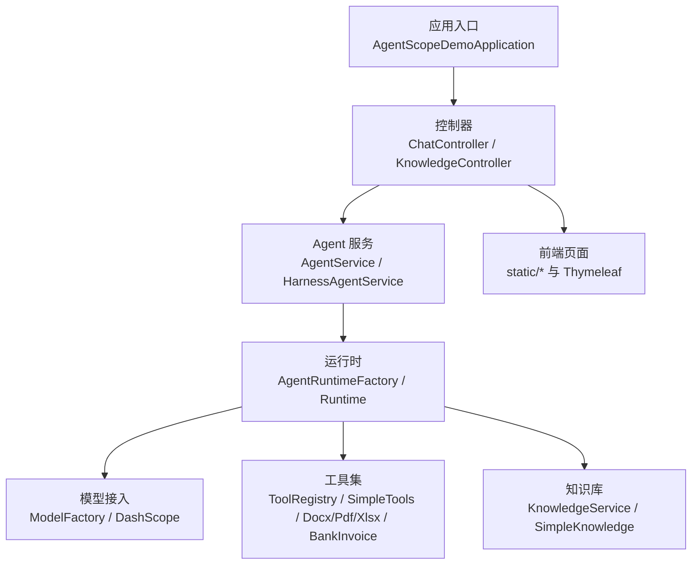
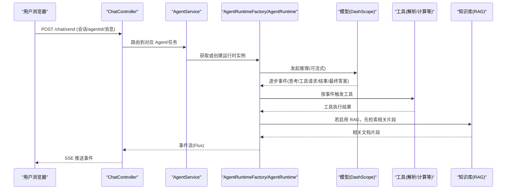
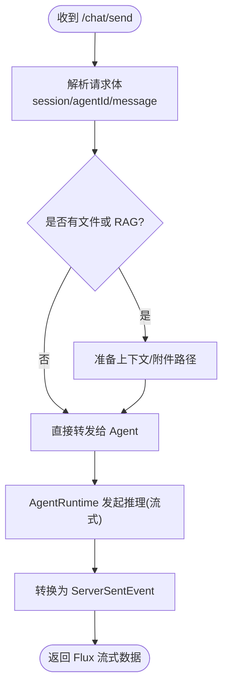
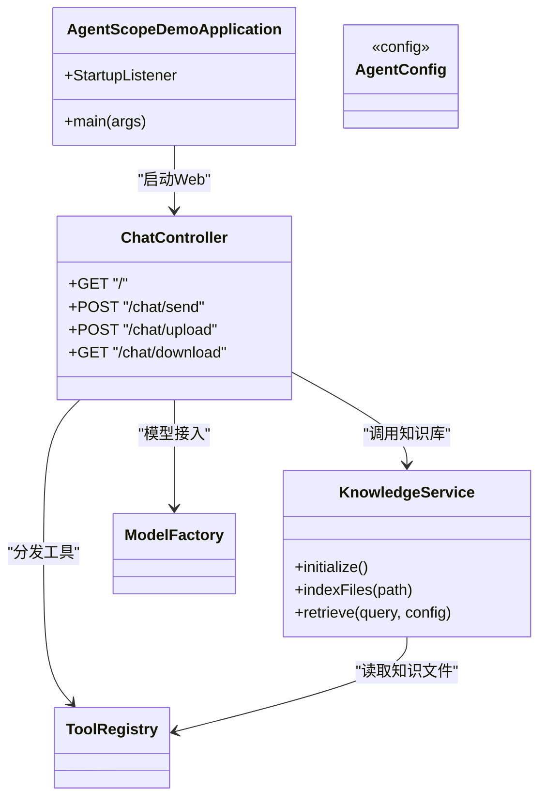
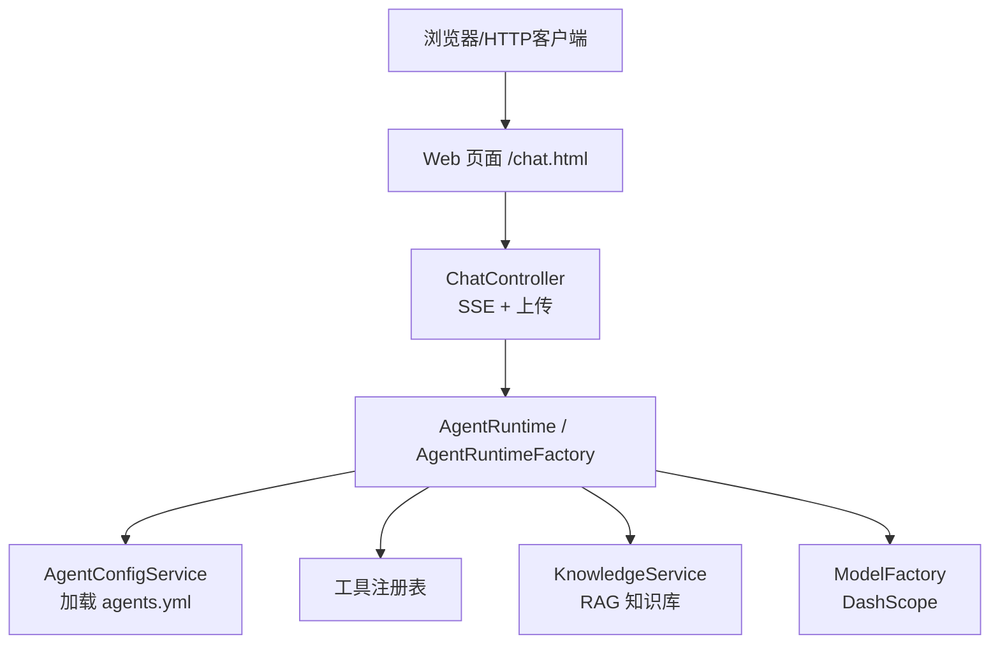
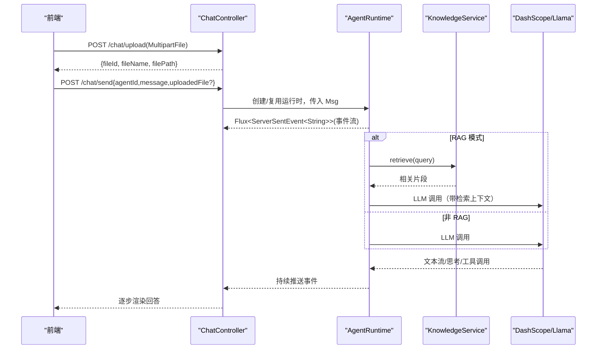
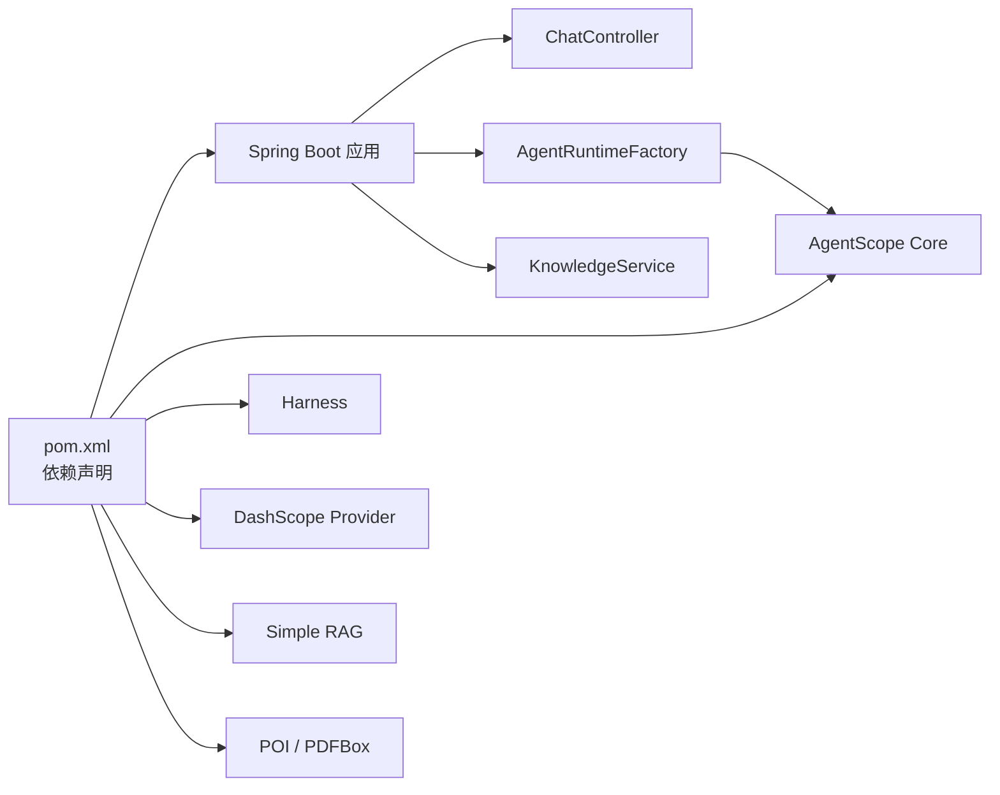

# 快速开始指南

<cite>
**本文引用的文件**
- [README.md](file://README.md)
- [AGENTS.md](file://AGENTS.md)
- [ROADMAP.md](file://ROADMAP.md)
- [pom.xml](file://pom.xml)
- [application.yml](file://src/main/resources/application.yml)
- [application-agui.yml](file://src/main/resources/application-agui.yml)
- [application-mysql.yml](file://src/main/resources/application-mysql.yml)
- [agents.yml](file://src/main/resources/config/agents.yml)
- [AgentScopeDemoApplication.java](file://src/main/java/com/skloda/agentscope/AgentScopeDemoApplication.java)
- [ChatController.java](file://src/main/java/com/skloda/agentscope/controller/ChatController.java)
- [KnowledgeService.java](file://src/main/java/com/skloda/agentscope/service/KnowledgeService.java)
</cite>

## 目录
1. [简介](#简介)
2. [项目结构](#项目结构)
3. [核心组件](#核心组件)
4. [架构总览](#架构总览)
5. [详细组件分析](#详细组件分析)
6. [依赖分析](#依赖分析)
7. [性能考虑](#性能考虑)
8. [故障排除清单](#故障排除清单)
9. [结论](#结论)
10. [附录](#附录)

## 简介
本指南面向首次接触 AgentScope Demo 的开发者，目标是让你在 15 分钟内完成环境搭建、启动项目，并通过第一个 Agent 体验“对话→工具调用→文件解析→RAG 问答”的完整链路。

- 技术栈与版本：Spring Boot 3.5 + Java 17（详见构建配置）
- LLM 提供方：DashScope（通过环境变量配置 API Key）
- 主要能力：多种 Agent 类型、文档解析、RAG 知识库、SSE 流式响应、可选的后端存储与协议扩展

关键运行端口：默认 8081（可在应用配置中修改）

**章节来源**
- [AgentScopeDemoApplication.java:15-33](file://src/main/java/com/skloda/agentscope/AgentScopeDemoApplication.java#L15-L33)
- [application.yml:3-4](file://src/main/resources/application.yml#L3-L4)

## 项目结构
- Spring Boot 主入口与应用初始化事件监听用于启动提示；REST 控制器提供聊天与文件上传 SSE 接口；服务层封装了 Agent 调度与 RAG 知识库的生命周期管理；配置与代理定义通过 YAML 集中管理。



**图表来源**
- [AgentScopeDemoApplication.java:15-33](file://src/main/java/com/skloda/agentscope/AgentScopeDemoApplication.java#L15-L33)
- [ChatController.java:44-75](file://src/main/java/com/skloda/agentscope/controller/ChatController.java#L44-L75)
- [KnowledgeService.java:39-50](file://src/main/java/com/skloda/agentscope/service/KnowledgeService.java#L39-L50)
- [agents.yml:1-29](file://src/main/resources/config/agents.yml#L1-L29)

**章节来源**
- [pom.xml:7-26](file://pom.xml#L7-L26)
- [agents.yml:1-29](file://src/main/resources/config/agents.yml#L1-L29)

## 核心组件
- 应用启动与提示：应用入口在服务器就绪时输出访问地址
- 控制器：暴露 Web/HTTP 入口，支持消息发送（SSE）、文件上传/下载、A2A/AG-UI/飞书等扩展端点
- 运行时与工厂：统一创建和管理 Agent、Harness Agent 及其事件流
- 工具注册表：统一管理内置和自定义工具，支撑文档解析、发票生成等能力
- 知识库：本地扫描与上传文档进行索引，基于 embedding 模型检索并回答

**章节来源**
- [AgentScopeDemoApplication.java:15-33](file://src/main/java/com/skloda/agentscope/AgentScopeDemoApplication.java#L15-L33)
- [ChatController.java:44-100](file://src/main/java/com/skloda/agentscope/controller/ChatController.java#L44-L100)
- [KnowledgeService.java:39-50](file://src/main/java/com/skloda/agentscope/service/KnowledgeService.java#L39-L50)
- [agents.yml:62-200](file://src/main/resources/config/agents.yml#L62-L200)

## 架构总览
下面以“发送消息并获得流式回复”为例展示端到端流程（控制器→服务→运行时→模型/工具/知识）。



**图表来源**
- [ChatController.java:44-100](file://src/main/java/com/skloda/agentscope/controller/ChatController.java#L44-L100)
- [agents.yml:1-200](file://src/main/resources/config/agents.yml#L1-L200)
- [KnowledgeService.java:39-50](file://src/main/java/com/skloda/agentscope/service/KnowledgeService.java#L39-L50)

**章节来源**
- [agents.yml:1-200](file://src/main/resources/config/agents.yml#L1-L200)

## 详细组件分析

### 环境与依赖准备
- JDK：Java 17+
- Maven：3.9+
- 构建与运行均使用 Maven（Spring Boot Plugin）
- 模型密钥：需要在运行时设置 DASHSCOPE_API_KEY

注意：应用默认端口为 8081；如需改为 8080，可在运行时参数或配置文件覆盖 server.port。

**章节来源**
- [pom.xml:20-26](file://pom.xml#L20-L26)
- [application.yml:3-4](file://src/main/resources/application.yml#L3-L4)
- [AGENTS.md:9-23](file://AGENTS.md#L9-L23)

### 运行方式
1) 本地开发
- 前置：安装 Java 17+ 与 Maven 3.9+；设置环境变量 DASHSCOPE_API_KEY
- 命令示例：mvn spring-boot:run
- 访问：应用启动后根据控制台提示打开浏览器链接

2) Docker 容器化部署
- 构建镜像：docker build -t agentscope-demo .
- 运行容器：通过 -e DASHSCOPE_API_KEY=your_key 传入密钥并映射端口（例如 -p 8080:8081，注意实际端口取决于 application.yml 配置）

3) 生产环境配置优化要点
- 日志级别：调整 logging.level.io.agentscope 与实际组件级别至 INFO/WARN 以减少 I/O
- 多模态/大文件上传：根据业务需要调高 multipart 大小限制
- 数据库状态存储：按需引入 mysql/postgres profile 启用持久会话（见 Profile 配置）
- RAG 嵌入模型与分块策略：依据知识库规模调整 embedding、chunk-size 与 overlap-size
- MCP/A2A/AG-UI 等扩展：按需激活相应 profile（例如 agui），避免无关启动开销

**章节来源**
- [README.md:63-92](file://README.md#L63-L92)
- [application.yml:6-12](file://src/main/resources/application.yml#L6-L12)
- [application-mysql.yml:1-18](file://src/main/resources/application-mysql.yml#L1-L18)
- [application-agui.yml:1-21](file://src/main/resources/application-agui.yml#L1-L21)

### 第一个 Agent 的配置与测试
你可以从“基础聊天 → 文件解析 → RAG 知识库”逐步体验：

1) 添加基础聊天 Agent
- 在 agents.yml 中添加一个 category 为 single 的 Agent，配置 modelName/streaming/enableThinking 等
- 重启后，在界面左侧选择该 Agent，即可进行流式对话

2) 上传文件进行文档解析
- 在前端点击上传按钮，选择 docx/pdf/xlsx 文件
- 切换至 Task Agent，输入解析指令
- 后端通过 ToolRegistry 注册的解析工具自动识别文件格式并提取内容

3) 调用 RAG 知识库提问
- 方式一：将文档放入 resources/knowledge 目录，应用启动会自动索引
- 方式二：通过知识库管理页面上传 PDF/DOCX/TXT 等
- 切换到 RAG Chat，提出与文档相关的问题，观察检索摘要与引用来源

提示：如需启用特定功能（如 AG-UI、MySQL 持久化），可通过 --spring.profiles.active 指定 profile。

**章节来源**
- [agents.yml:1-200](file://src/main/resources/config/agents.yml#L1-L200)
- [AGENTS.md:106-164](file://AGENTS.md#L106-L164)
- [KnowledgeService.java:39-50](file://src/main/java/com/skloda/agentscope/service/KnowledgeService.java#L39-L50)
- [application-agui.yml:1-21](file://src/main/resources/application-agui.yml#L1-L21)
- [application-mysql.yml:1-18](file://src/main/resources/application-mysql.yml#L1-L18)

### 关键流程图（算法/处理逻辑）
- 消息发送与流式事件返回（简化）


**图表来源**
- [ChatController.java:44-100](file://src/main/java/com/skloda/agentscope/controller/ChatController.java#L44-L100)

**章节来源**
- [ChatController.java:44-100](file://src/main/java/com/skloda/agentscope/controller/ChatController.java#L44-L100)

### 类关系图（代码级）


**图表来源**
- [AgentScopeDemoApplication.java:15-33](file://src/main/java/com/skloda/agentscope/AgentScopeDemoApplication.java#L15-L33)
- [ChatController.java:44-100](file://src/main/java/com/skloda/agentscope/controller/ChatController.java#L44-L100)
- [KnowledgeService.java:39-50](file://src/main/java/com/skloda/agentscope/service/KnowledgeService.java#L39-L50)

**章节来源**
- [AgentScopeDemoApplication.java:15-33](file://src/main/java/com/skloda/agentscope/AgentScopeDemoApplication.java#L15-L33)
- [ChatController.java:44-100](file://src/main/java/com/skloda/agentscope/controller/ChatController.java#L44-L100)
- [KnowledgeService.java:39-50](file://src/main/java/com/skloda/agentscope/service/KnowledgeService.java#L39-L50)

## 依赖分析
- Spring Boot Web + Thymeleaf：负责 Web 层与模板渲染
- AgentScope Starter/Core/Harness：提供 Agent、运行时、工具、RAG、记忆等能力
- DashScope 模型扩展：实现与大模型的对接
- Apache POI / PDFBox：用于文档解析
- 可选持久化与扩展：Redis/MySQL/PostgreSQL（Session 存储）、A2A/AG-UI/Channel（按 profile 启用）

**章节来源**
- [pom.xml:28-188](file://pom.xml#L28-L188)

## 性能考虑
- 流式响应：优先使用 SSE 流式返回，降低首屏延迟
- 上下文压缩：对<docs>
# 快速开始指南

<cite>
**本文引用的文件列表**
- [README.md](file://README.md)
- [pom.xml](file://pom.xml)
- [.java-version](file://.java-version)
- [AgentScopeDemoApplication.java](file://src/main/java/com/skloda/agentscope/AgentScopeDemoApplication.java)
- [application.yml](file://src/main/resources/application.yml)
- [agents.yml](file://src/main/resources/config/agents.yml)
- [ChatController.java](file://src/main/java/com/skloda/agentscope/controller/ChatController.java)
- [KnowledgeService.java](file://src/main/java/com/skloda/agentscope/service/KnowledgeService.java)
- [application-agui.yml](file://src/main/resources/application-agui.yml)
- [application-mysql.yml](file://src/main/resources/application-mysql.yml)
- [AGENTS.md](file://AGENTS.md)
</cite>

## 目录
1. [简介](#简介)
2. [项目结构](#项目结构)
3. [核心组件](#核心组件)
4. [架构总览](#架构总览)
5. [详细组件分析](#详细组件分析)
6. [依赖关系分析](#依赖关系分析)
7. [性能与生产调优](#性能与生产调优)
8. [故障排除清单](#故障排除清单)
9. [结论](#结论)
10. [附录](#附录)

## 简介
本指南面向新手开发者，帮助你在 15 分钟内完成环境准备、配置 DashScope API Key、运行项目并完成第一个 Agent 的对话、文档解析与 RAG 知识库问答体验。项目基于 Spring Boot 3 + Java 17，使用 AgentScope（Java）构建多种智能体能力：基础聊天、工具调用、文档解析、RAG 知识库、多模态与多智能体协作等。

## 项目结构
项目采用标准 Maven + Spring Boot 工程布局，核心包以功能维度划分；配置文件集中在 resources 下；前端静态资源与页面位于 resources/static 与 resources/templates。关键目录与职责概述如下：
- src/main/java/com/skloda/agentscope
  - controller：Web 入口（SSE 聊天、文件上传、知识管理等接口）
  - service：业务服务（会话管理、知识检索等）
  - agent：Agent 配置实体与工厂（按 agents.yml 动态装配）
  - runtime：事件流式运行时（将 Agent 事件映射为 SSE）
  - tool：各类工具实现（文件解析、搜索等）
  - model：请求/响应/事件数据模型
- src/main/resources
  - application.yml 及 profile 扩展
  - config/agents.yml：Agent 定义集合（Basic Chat、Task Agent、Bank Invoice、RAG Chat 等）
  - static/templates：前端界面和脚本（SSE 客户端、调试面板、上传模块等）
- pom.xml：依赖与插件（Spring Boot、AgentScope 系列模块、POI/PDFBox 等）



图表来源
- [application.yml:26-87](file://src/main/resources/application.yml#L26-L87)
- [agents.yml:1-30](file://src/main/resources/config/agents.yml#L1-L30)
- [ChatController.java:44-75](file://src/main/java/com/skloda/agentscope/controller/ChatController.java#L44-L75)

章节来源
- [pom.xml:7-26](file://pom.xml#L7-L26)
- [AgentScopeDemoApplication.java:11-17](file://src/main/java/com/skloda/agentscope/AgentScopeDemoApplication.java#L11-L17)
- [application.yml:3-24](file://src/main/resources/application.yml#L3-L24)

## 核心组件
- 应用启动器：Spring Boot 启动类，监听 Web 启动事件并输出访问地址
- 控制器：提供 REST/SSE 接口，处理聊天消息与文件上传
- 运行时与工厂：依据 agents.yml 构建 Agent 实例，并通过 streamEvents() 产生事件流
- 知识服务：实现本地自动索引与上传文档后的检索，支持多种读取器
- 工具库：文档解析（DOCX、PDF、XLSX）、网页搜索等

章节来源
- [AgentScopeDemoApplication.java:19-33](file://src/main/java/com/skloda/agentscope/AgentScopeDemoApplication.java#L19-L33)
- [ChatController.java:44-75](file://src/main/java/com/skloda/agentscope/controller/ChatController.java#L44-L75)
- [KnowledgeService.java:39-50](file://src/main/java/com/skloda/agentscope/service/KnowledgeService.java#L39-L50)
- [agents.yml:1-29](file://src/main/resources/config/agents.yml#L1-L29)

## 架构总览
整体为“前端 → Spring MVC(含 WebFlux SSE) → Agent 运行时 → LLM/DashScope”的响应式流式架构。Agent 生命周期事件、工具调用与思考过程通过 AgentEventMapper 转换为 SSE 推送到前端。

```mermaid
sequenceDiagram
    participant U as "用户"
    participant B as "浏览器"
    participant C as "ChatController"
    participant R as "AgentRuntimeFactory"
    participant A as "Agent/ReActAgent"
    participant M as "Model(DashScope)"
    K as "KnowledgeService(RAG)"

    U->>B: 输入消息/文件
    B->>C: POST /chat/send(或/upload)
    C->>R: 根据 agentId 获取/创建运行时
    R->>A: 调用 streamEvents(Msg)
    A-->>R: Flux<Event>(思考/工具/结果)
    A->>M: 模型推理（可流式）
    M-->>A: 回复片段
    R-->>C: Flux<Event>
    C-->>B: ServerSentEvent 推送(逐条渲染)
    Note over C,K: RAG 模式下检索知识库后注入上下文
```

图表来源
- [ChatController.java:44-75](file://src/main/java/com/skloda/agentscope/controller/ChatController.java#L44-L75)
- [application.yml:26-87](file://src/main/resources/application.yml#L26-L87)
- [agents.yml:171-200](file://src/main/resources/config/agents.yml#L171-L200)

## 详细组件分析

### 环境搭建与环境变量
- JDK/Maven：项目要求 Java 17+，已使用 .java-version 指定版本，pom 中编译级别也为 17
- 依赖下载：Maven 3.9+；首次运行会自动拉取 AgentScope 及相关扩展
- DashScope API Key：通过环境变量 DASHSCOPE_API_KEY 注入，对应 application.yml 中占位符配置

步骤（15 分钟）
1) 安装并确认 Java 17、Maven 3.9+
2) 克隆仓库后进入项目根目录
3) 设置环境变量 DASHSCOPE_API_KEY=你的密钥
4) 运行 mvn spring-boot:run，等待控制台提示端口就绪（默认端口在 application.yml 配置）
5) 浏览器打开首页（见“运行方式一”），即可开始体验

注意
- 若需调整端口，修改 application.yml 中的 server.port
- 如需启用 MySQL 状态存储，使用 --spring.profiles.active=mysql 并配置数据库连接信息

章节来源
- [.java-version:1-1](file://.java-version#L1-L1)
- [pom.xml:20-26](file://pom.xml#L20-L26)
- [application.yml:3-4](file://src/main/resources/application.yml#L3-L4)
- [application.yml:26-43](file://src/main/resources/application.yml#L26-L43)
- [application-mysql.yml:1-18](file://src/main/resources/application-mysql.yml#L1-L18)

### 三种运行方式
- 方式一：本地开发直接运行
  - 命令：mvn spring-boot:run
  - 场景：开发调试、增量修改
  - 说明：会加载默认 application.yml，默认启用内存会话与 RAG

- 方式二：Docker 容器化部署
  - 构建镜像（示例命令参考项目自述）：docker build -t agentscope-demo .
  - 启动容器并暴露端口：docker run -p 8080:8080 -e DASHSCOPE_API_KEY=your_key agentscope-demo
  - 说明：将 Java 进程与依赖打包进镜像，适合一键部署

- 方式三：生产环境优化
  - 外部化配置：通过环境变量或系统属性覆盖 application.yml 中 key（如 api-key）
  - 日志级别：按需降低 verbose 日志（例如 root/INFO，io.agentscope/INFO）
  - 持久化：根据需要切换到 profiles 如 mysql，启用分布式会话存储
  - 端口与线程：结合容器编排调整 JVM 与系统资源配额

章节来源
- [application.yml:26-43](file://src/main/resources/application.yml#L26-L43)
- [application-mysql.yml:1-18](file://src/main/resources/application-mysql.yml#L1-L18)
- [README.md:63-93](file://README.md#L63-L93)

### 第一个 Agent：基础聊天、文档解析与 RAG 问答
1) 启用并选择 Basic Chat
   - 在 agents.yml 中已内置 chat-basic，名称为 “Basic Chat”，启用流式与思考模式
   - 启动后在聊天界面选择该 Agent，发起简单对话验证连通性

2) 上传文件进行文档解析（Task Agent）
   - 选择 Task Agent，通过上传按钮选择 .docx/.pdf/.xlsx
   - 发送指令如“请总结文档的核心内容”，后端将调用相应解析工具并返回结构化结果

3) 调用 RAG 知识库提问
   - 本地自动索引：将文档放入 knowledge 目录，应用启动时自动扫描并索引（auto-index-on-startup: true）
   - 在线上传：在知识库页面上传 PDF/TXT/DOCX，等待索引完成后切换至 RAG Chat 进行提问
   - 相关配置项包括 embedding-model、chunk-size、split-strategy 等，可按需调整

注意
- 第一次导入较大知识库可能需要数秒到数十秒，可在调试面板观察索引进度与错误

章节来源
- [agents.yml:1-29](file://src/main/resources/config/agents.yml#L1-L29)
- [agents.yml:62-91](file://src/main/resources/config/agents.yml#L62-L91)
- [agents.yml:171-200](file://src/main/resources/config/agents.yml#L171-L200)
- [application.yml:61-71](file://src/main/resources/application.yml#L61-L71)
- [KnowledgeService.java:39-50](file://src/main/java/com/skloda/agentscope/service/KnowledgeService.java#L39-L50)

### API/流程时序（聊天与上传）


图表来源
- [ChatController.java:44-100](file://src/main/java/com/skloda/agentscope/controller/ChatController.java#L44-L100)
- [application.yml:26-43](file://src/main/resources/application.yml#L26-L43)
- [application.yml:61-71](file://src/main/resources/application.yml#L61-L71)

### 组件交互与时序要点
- 事件驱动：Agent 运行过程中的“思考、工具、结果”以事件形式推送，前端可按类型分别展示
- 工具优先：Task Agent 会先识别需要使用的工具（解析、生成等），再调用执行
- RAG 增强：RAG Chat 会在检索命中时引入片段，提升答案的可信度并可引用来源

章节来源
- [agents.yml:62-91](file://src/main/resources/config/agents.yml#L62-L91)
- [agents.yml:171-200](file://src/main/resources/config/agents.yml#L171-L200)
- [ChatController.java:77-100](file://src/main/java/com/skloda/agentscope/controller/ChatController.java#L77-L100)

## 依赖关系分析
- 构建与运行
  - 父工程：Spring Boot Parent 3.x
  - Java 版本：17
  - AgentScope：core、harness、dashscope provider、simple RAG、memory 扩展
  - 文件解析：Apache POI（DOC/XLS），PDFBox（PDF）
- Profile 扩展
  - AG-UI：application-agui.yml，激活后提供协议端点
  - 分布式会话：MySQL profile，启用持久化 StateStore



图表来源
- [pom.xml:28-188](file://pom.xml#L28-L188)
- [application-agui.yml:1-21](file://src/main/resources/application-agui.yml#L1-L21)
- [application-mysql.yml:1-18](file://src/main/resources/application-mysql.yml#L1-L18)

章节来源
- [pom.xml:7-26](file://pom.xml#L7-L26)
- [pom.xml:28-188](file://pom.xml#L28-L188)
- [application-agui.yml:1-21](file://src/main/resources/application-agui.yml#L1-L21)
- [application-mysql.yml:1-18](file://src/main/resources/application-mysql.yml#L1-L18)

## 性能与生产调优
- 日志与诊断
  - 适当调整 logging.level（建议生产关闭 DEBUG）
  - 必要时开启 io.agentscope: INFO 以跟踪 Agent 调用
- RAG 知识库
  - 合理设置 chunk-size/overlap-size/split-strategy，平衡召回率与性能
  - 大文件可分片上传；首次索引建议在低峰时段
- 流式处理与并发
  - AgentScope 使用 Reactor 流式事件，注意避免阻塞操作
  - 根据服务器规格调整 JVM 内存与线程池参数
- 存储与缓存
  - 生产建议使用分布式 Session（mysql/profile）与合适的外存路径
- 网络与超时
  - 合理设置外部网络代理（如内网环境），确保能访问 DashScope 接口

[本节为通用指导，不涉及具体源码行]

## 故障排除清单
- 现象：启动时报 API Key 无效或鉴权失败
  - 可能原因：未正确设置 DASHSCOPE_API_KEY，或值包含空格/引号
  - 处理：确认环境变量已生效；或在启动参数中注入 --agentscope.model.dashscope.api-key=...

- 现象：端口占用或无法访问
  - 可能原因：server.port 与系统其他服务冲突
  - 处理：修改 application.yml 中 server.port 或使用 --server.port=xxx

- 现象：网络异常或超时
  - 可能原因：防火墙/代理限制导致无法访问 DashScope 端点
  - 处理：检查网络策略与代理设置；尝试 curl 直连 API 验证连通性

- 现象：知识库无结果或召回不准确
  - 可能原因：索引未完成/文本切分不当/阈值配置过高
  - 处理：查看启动日志中的索引任务；调整 knowledge.chunk-size 与 ragScoreThreshold

- 现象：文件上传失败
  - 可能原因：文件大小超限或临时目录权限不足
  - 处理：调整 multipart.max-file-size；检查/tmp 或 java.io.tmpdir 读写权限

章节来源
- [application.yml:3-12](file://src/main/resources/application.yml#L3-L12)
- [application.yml:26-43](file://src/main/resources/application.yml#L26-L43)
- [application.yml:61-71](file://src/main/resources/application.yml#L61-L71)

## 结论
通过本指南，你可以在 15 分钟内完成 AgentScope Demo 的环境准备、配置 API Key、启动项目，并使用 Basic Chat 验证模型连通性；借助 Task Agent 上传文档并进行解析；最后使用 RAG Chat 对知识库提问，获得有依据的回答。项目提供了丰富的 Agent 配置与扩展点，便于后续扩展更多业务场景。

## 附录

### 常用启动与配置速查
- 本地运行：mvn spring-boot:run
- 环境变量：export DASHSCOPE_API_KEY=your_key_here
- 更改端口：在 application.yml 修改 server.port，或通过命令行 --server.port=xxx
- 启用 MySQL 会话存储：--spring.profiles.active=mysql 并配置数据库连接

章节来源
- [application.yml:3-4](file://src/main/resources/application.yml#L3-L4)
- [application-mysql.yml:1-18](file://src/main/resources/application-mysql.yml#L1-L18)
- [AGENTS.md:9-23](file://AGENTS.md#L9-L23)