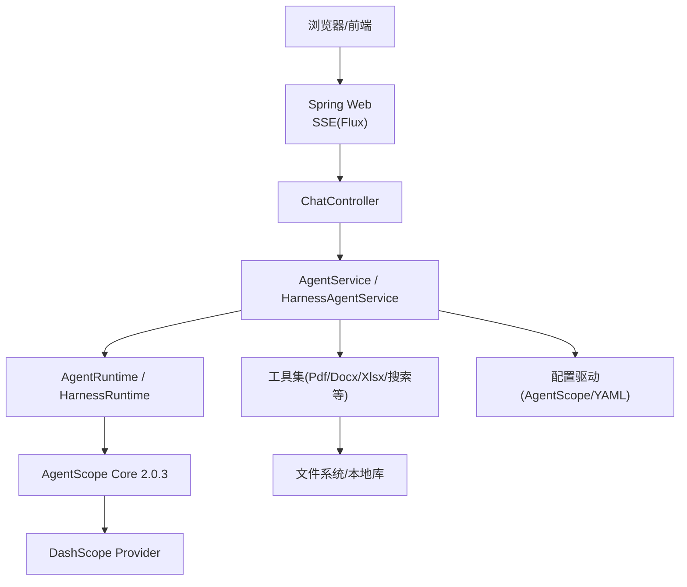
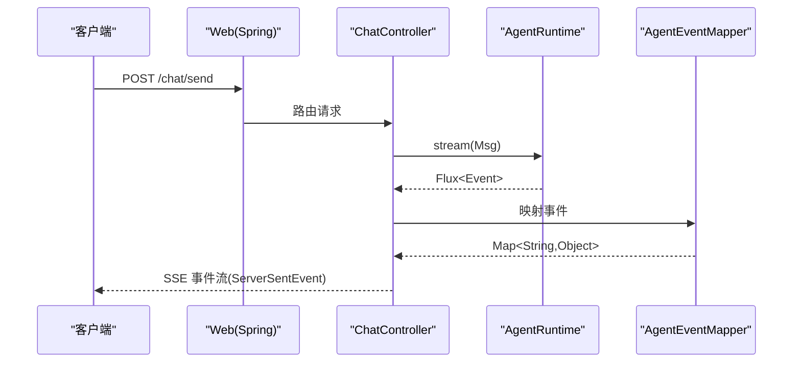
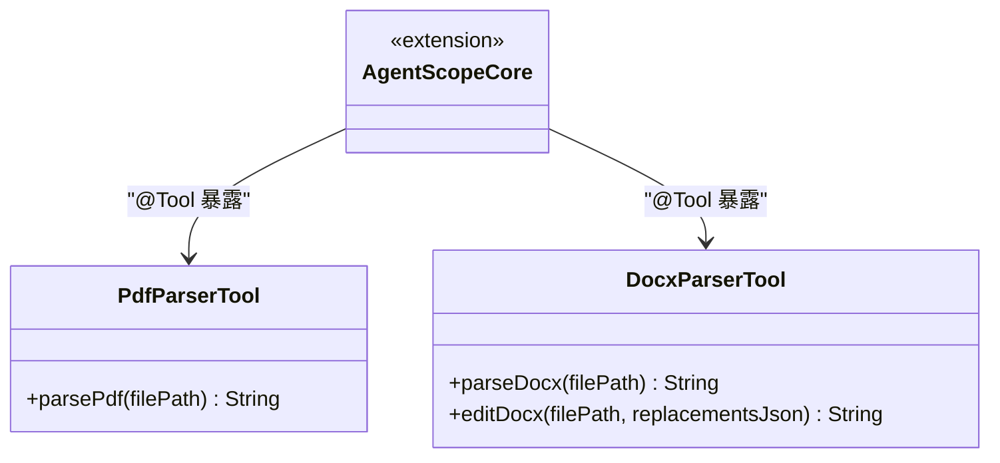
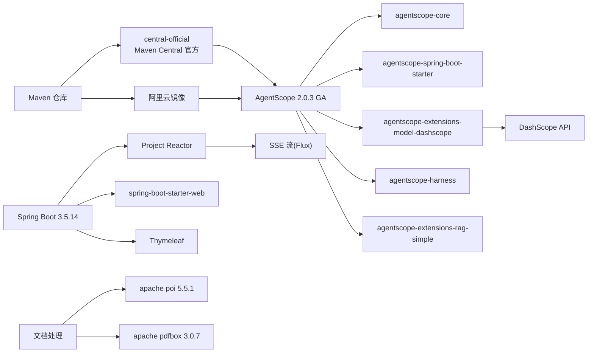

# 技术栈概览

<cite>
**本文引用的文件**
- [pom.xml](file://pom.xml)
- [application.yml](file://src/main/resources/application.yml)
- [agents.yml](file://src/main/resources/config/agents.yml)
- [AgentScopeDemoApplication.java](file://src/main/java/com/skloda/agentscope/AgentScopeDemoApplication.java)
- [ChatController.java](file://src/main/java/com/skloda/agentscope/controller/ChatController.java)
- [PdfParserTool.java](file://src/main/java/com/skloda/agentscope/tool/PdfParserTool.java)
- [DocxParserTool.java](file://src/main/java/com/skloda/agentscope/tool/DocxParserTool.java)
</cite>

## 更新摘要
**所做更改**
- 更新 AgentScope 版本至 2.0.3 GA，保持零 API 破坏性变更
- 新增 Maven Central 官方仓库配置，解决新版本同步延迟问题
- 完善依赖管理策略，确保构建稳定性
- 更新版本兼容性说明和升级策略

## 目录
1. [引言](#引言)
2. [项目结构与总体架构](#项目结构与总体架构)
3. [核心组件与技术选型](#核心组件与技术选型)
4. [架构决策与理由](#架构决策与理由)
5. [详细组件分析](#详细组件分析)
6. [依赖关系图](#依赖关系图)
7. [性能与扩展性考量](#性能与扩展性考量)
8. [故障排查要点](#故障排查要点)
9. [结论](#结论)
10. [附录：版本兼容与升级策略](#附录版本兼容与升级策略)

## 引言
本技术栈概览面向新加入的开发者，聚焦 AgentScope Demo 项目的技术选择与架构动机。项目基于 Spring Boot 3.5.14 + Java 17 构建，使用 **AgentScope 2.0.3 GA** 作为 AI Agent 框架的核心能力层，结合 Project Reactor 提供响应式 SSE 流式交互，利用 Apache POI 与 PDFBox 实现文档处理能力，并集成 DashScope API 提供智能对话能力。本文将围绕这些关键技术点展开说明，解释为何采用响应式架构、微内核设计和配置驱动等决策，并给出依赖关系、兼容性建议及常见问题的排查方向。

## 项目结构与总体架构
本项目遵循标准的 Spring Boot 分层结构：启动类位于应用根包，控制器负责 HTTP/SSE 接入，服务层编排 Agent 流程，工具层封装文档解析与业务功能，配置通过 application.yml 和 agents.yml 集中管理，并通过 Profile 按需启用扩展（如 A2A、AG-UI、飞书通道、分布式状态存储等）。

**图表来源**
- [AgentScopeDemoApplication.java:11-17](file://src/main/java/com/skloda/agentscope/AgentScopeDemoApplication.java#L11-L17)
- [ChatController.java:47-100](file://src/main/java/com/skloda/agentscope/controller/ChatController.java#L47-L100)
- [agents.yml:1-200](file://src/main/resources/config/agents.yml#L1-L200)
- [application.yml:25-80](file://src/main/resources/application.yml#L25-L80)

**章节来源**
- [AgentScopeDemoApplication.java:11-35](file://src/main/java/com/skloda/agentscope/AgentScopeDemoApplication.java#L11-L35)
- [application.yml:1-24](file://src/main/resources/application.yml#L1-L24)
- [agents.yml:1-200](file://src/main/resources/config/agents.yml#L1-L200)

## 核心组件与技术选型
- Web 框架：Spring Boot 3.5.14（现代特性完备、生态成熟）
- 语言：Java 17（语言与运行时性能优势显著）
- AI Agent 框架：**AgentScope 2.0.3 GA**（统一模型抽象、事件流、RAG、多模态、多智能体协作、Harness 等）
- 响应式：Project Reactor 实现 Flux/ServerSentEvent 流式推送
- 文档处理：Apache POI（DOCX/XLSX）、Apache PDFBox（PDF）
- 智能对话：DashScope 提供者（通过 AgentScope 扩展模块）

**更新** AgentScope 已升级至 2.0.3 GA 版本，在保持零 API 破坏性变更的前提下，提供了更稳定的企业级功能和更好的性能优化。

这些选择在 pom.xml 中通过依赖声明进行锁定，体现了对稳定性与能力的双重诉求。

**章节来源**
- [pom.xml:1-188](file://pom.xml#L1-L188)

## 架构决策与理由
- 为什么选择响应式架构处理高并发 SSE 流？
  - ChatController 直接返回 Flux<ServerSentEvent<String>>，以非阻塞方式向客户端持续推送 Agent 生命周期事件、LLM Token 增量、工具执行结果等。这对于需要长时间处理的 AI Agent 会话尤为关键，可显著降低内存占用并提高吞吐。
  - AgentScope 2.0.3 原生提供事件流 streamEvents()，与 Project Reactor 无缝融合，便于统一编排与扩展（如审批、审计、度量等中间件）。

- 为什么采用微内核设计支持插件化扩展？
  - 通过 Spring @Profile 与 AutoConfiguration 排除默认 DataSource/A2A，再按 Profile 引入 redis/mysql/postgresql 状态存储、A2A 服务/客户端、飞书 IM 通道、AG-UI 协议等扩展。
  - 这使最小部署不依赖外部中间件，而在生产环境中可按需开启相应能力，兼顾灵活性与安全性。

- 为什么使用配置文件驱动而非硬编码？
  - 所有 Agent 行为在 agents.yml 中以 YAML 定义（类型、模型名、流式开关、工具列表、RAG 参数、样本提示），由 AgentConfigService/Factory/Runtime 加载与组装。新增 Agent 无需改代码，只需加配置并注册工具即可上线。
  - 应用全局设置集中在 application.yml（端口、上传限制、日志级别、AgentScope 模型/记忆/MCP/知识索引等），便于环境间切换与灰度升级。

**章节来源**
- [ChatController.java:47-100](file://src/main/java/com/skloda/agentscope/controller/ChatController.java#L47-L100)
- [application.yml:13-23](file://src/main/resources/application.yml#L13-L23)
- [agents.yml:1-200](file://src/main/resources/config/agents.yml#L1-L200)
- [application.yml:25-80](file://src/main/resources/application.yml#L25-L80)

## 详细组件分析

### SSE 聊天与流式处理（Web 层）
- 入口：GET / 返回聊天页面；POST /chat/send 接收消息并返回 SSE 流。
- 流式模型：AgentRuntime/HarnessRuntime 调用 agent.streamEvents()，通过 AgentEventMapper 将内部事件映射为 Map，再由控制器转为 ServerSentEvent 推送到前端。
- 健壮性：对序列化异常进行捕获并输出错误事件，确保前端不会卡死。

**图表来源**
- [ChatController.java:47-100](file://src/main/java/com/skloda/agentscope/controller/ChatController.java#L47-L100)
- [agents.yml:1-200](file://src/main/resources/config/agents.yml#L1-L200)

**章节来源**
- [ChatController.java:47-100](file://src/main/java/com/skloda/agentscope/controller/ChatController.java#L47-L100)

### 工具层：文档解析（PDF/DOCX）
- PDF：PdfParserTool 使用 PDFBox 读取文档元信息与全文；多页场景逐页提取文本并以页号分割输出，空文档或扫描图无法解析时返回友好提示。
- DOCX：DocxParserTool 使用 POI 解析段落、表格与标题结构，并将表格转换为 Markdown 风格；同时提供变量替换编辑能力，用于模板发票生成等场景。
- 两者均以 @Tool 暴露，便于 Agent 自动调用。

**图表来源**
- [PdfParserTool.java:15-72](file://src/main/java/com/skloda/agentscope/tool/PdfParserTool.java#L15-L72)
- [DocxParserTool.java:17-127](file://src/main/java/com/skloda/agentscope/tool/DocxParserTool.java#L17-L127)

**章节来源**
- [PdfParserTool.java:1-72](file://src/main/java/com/skloda/agentscope/tool/PdfParserTool.java#L1-L72)
- [DocxParserTool.java:1-200](file://src/main/java/com/skloda/agentscope/tool/DocxParserTool.java#L1-L200)

### 配置驱动：Agent 编排与 RAG
- agents.yml 定义了多个 Agent：基础对话、工具调用、任务文档分析、银行发票生成、RAG 问答等；包含模型名称、流式开关、思考模式、工具列表、Skill、RAG 检索参数与样本 Prompt。
- application.yml 配置了模型提供商为 DashScope、流式开关、记忆类型与上限、知识库路径与索引策略、MCP 演示等。

**章节来源**
- [agents.yml:1-200](file://src/main/resources/config/agents.yml#L1-L200)
- [application.yml:25-80](file://src/main/resources/application.yml#L25-L80)

## 依赖关系图
以下为关键第三方库与子系统之间的依赖关系，展示了 Web 框架、AI 框架、文档处理、外部模型的集成位置。

**更新** 新增了 Maven 仓库配置，包含阿里云镜像和 Maven Central 官方仓库作为后备方案，确保新版本依赖的稳定获取。

**图表来源**
- [pom.xml:1-188](file://pom.xml#L1-L188)
- [pom.xml:190-205](file://pom.xml#L190-L205)

**章节来源**
- [pom.xml:1-188](file://pom.xml#L1-L188)

## 性能与扩展性考量
- 流式推理与长连接：使用 Flux 承载 Agent 事件流，能有效支撑多路并发与低延迟展示。
- 资源使用优化：大文档解析尽量分块（PDF 逐页），必要时可增加线程池或异步处理以避免阻塞请求线程。
- 可扩展点：
  - 新增 Agent：agents.yml + Tool/ Skill + 必要配置，零代码发布。
  - 新增通道/协议：通过 Profile 注入（a2a、feishu、agui），保持默认启动精简。
  - 分布式状态存储：Redis/MySQL/PostgreSQL 可选引入，支持会话共享与持久化。
- 可观测性：通过 Hook/中间件记录事件、指标与链路追踪，便于问题定位与容量规划。

[本节为通用建议，未直接分析具体文件]

## 故障排查要点
- 序列化异常：SSE 数据 JSON 序列化失败会抛出异常，控制器会捕获并返回错误事件。若前端收到"序列化错误"，检查 AgentEvent/ChatEvent 结构变更。
- 文档解析失败：PDF 空文档或扫描图片无法提取文本；DOCX 打开失败通常因权限或路径问题。检查日志中 parse_* 方法抛出的异常信息。
- 模型连接失败：确认 application.yml 中 dashscope.api-key 已通过环境变量传入，且网络可达。
- 流结束但未关闭：确保客户端正确关闭 SSE；服务端应确保 Flux 正常完成或错误完成。
- **依赖下载问题**：如遇 Maven 依赖下载失败，检查网络连接和代理设置；项目已配置 Maven Central 官方仓库作为阿里云镜像的后备方案。

**章节来源**
- [ChatController.java:78-100](file://src/main/java/com/skloda/agentscope/controller/ChatController.java#L78-L100)
- [PdfParserTool.java:67-71](file://src/main/java/com/skloda/agentscope/tool/PdfParserTool.java#L67-L71)
- [DocxParserTool.java:117-127](file://src/main/java/com/skloda/agentscope/tool/DocxParserTool.java#L117-L127)

## 结论
该项目以 Spring Boot + Java 17 为基础，借助 **AgentScope 2.0.3 GA** 的统一 Agent 抽象与扩展能力，结合 Project Reactor 实现高性能、可观测的流式对话系统；通过 Apache POI 与 PDFBox 覆盖主流办公文档；以 DashScope 作为模型提供商，提供强大语言与推理能力。整体采用配置驱动与 Profile 扩展的微内核设计，使得系统在功能与部署上均具备良好弹性，适合快速孵化 AI 应用场景与后续生产演进。

**更新** 通过升级到 AgentScope 2.0.3 GA 版本，项目在保持向后兼容的同时获得了更稳定的企业级功能和更好的性能表现。

[本节总结性内容，无需列出来源]

## 附录：版本兼容与升级策略
- **基线版本**
  - Spring Boot 3.5.14（父 POM）
  - Java 17
  - **AgentScope 2.0.3 GA**（core、spring-boot-starter、harness、model-dashscope、rag-simple、memory-bailian、a2a-server/client/agui、redis/mysql/postgresql 扩展）
  - Apache POI 5.5.1、Apache PDFBox 3.0.7
- **兼容性关注**
  - 确保 JDK 版本满足 Java 17 要求
  - 模型供应商（DashScope）接口变更可能影响 ModelFactory 封装与格式化，升级时需验证 streaming/thinking/streaming-bugfix 相关修复是否生效
  - 文档解析库（POI/PDFBox）更新时，注意 API 与内存模型变化，尤其是表格与元数据处理
  - Spring WebFlux/Reactor 版本跟随 Spring Boot BOM，避免手动指定冲突版本
- **依赖管理增强**
  - **新增 Maven Central 官方仓库**：作为阿里云镜像的后备方案，解决新发布版本的同步延迟问题
  - 仓库配置采用独立 ID `central-official`，避免被阿里云镜像拦截
  - 确保在镜像同步期间仍能获取最新版本的 AgentScope 依赖
- **升级建议**
  - 先小步升级至次新版本并回归测试，再考虑主版本跨度
  - 每次升级优先关注 SSE/流式端点、事件映射器与中间件的回归用例
  - 逐步引入 Profile 中的数据库/缓存依赖进行联调，避免默认环境污染
  - **版本升级验证**：AgentScope 2.0.3 已在 378 个测试用例中验证零 API 破坏性变更，可直接升级

**更新** 重点增强了依赖管理的可靠性，通过双仓库配置确保构建稳定性。

**章节来源**
- [pom.xml:1-188](file://pom.xml#L1-L188)
- [pom.xml:190-205](file://pom.xml#L190-L205)
- [.java-version:1-2](file://.java-version#L1-L2)