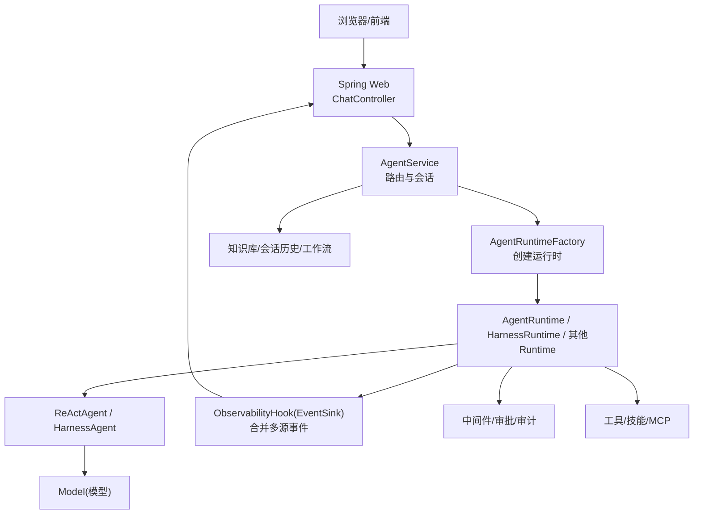
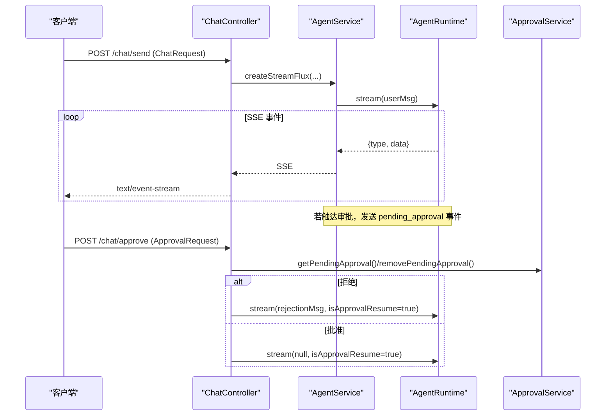
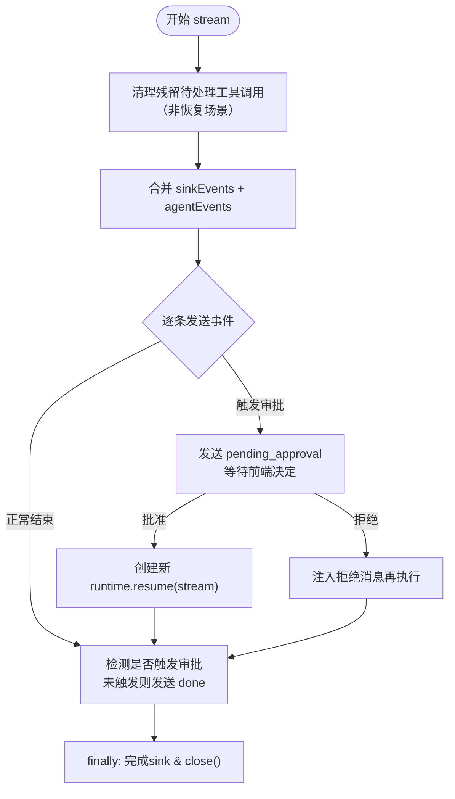
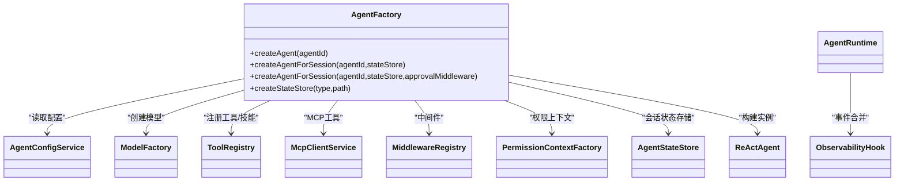

# 架构设计概述

<cite>
**本文引用的文件**   
- [AgentScopeDemoApplication.java](file://src/main/java/com/skloda/agentscope/AgentScopeDemoApplication.java)
- [ChatController.java](file://src/main/java/com/skloda/agentscope/controller/ChatController.java)
- [AgentService.java](file://src/main/java/com/skloda/agentscope/service/AgentService.java)
- [AgentRuntimeFactory.java](file://src/main/java/com/skloda/agentscope/runtime/AgentRuntimeFactory.java)
- [AgentRuntime.java](file://src/main/java/com/skloda/agentscope/runtime/AgentRuntime.java)
- [ObservabilityHook.java](file://src/main/java/com/skloda/agentscope/hook/ObservabilityHook.java)
- [AgentFactory.java](file://src/main/java/com/skloda/agentscope/agent/AgentFactory.java)
- [ToolRegistry.java](file://src/main/java/com/skloda/agentscope/tool/ToolRegistry.java)
- [MiddlewareRegistry.java](file://src/main/java/com/skloda/agentscope/middleware/MiddlewareRegistry.java)
- [AguiConfig.java](file://src/main/java/com/skloda/agentscope/config/AguiConfig.java)
- [pom.xml](file://pom.xml)
- [README.md](file://README.md)
</cite>

## 目录
1. [引言](#引言)
2. [项目结构](#项目结构)
3. [核心组件](#核心组件)
4. [架构总览](#架构总览)
5. [详细组件分析](#详细组件分析)
6. [依赖与集成](#依赖与集成)
7. [性能考虑](#性能考虑)
8. [故障排查指南](#故障排查指南)
9. [结论](#结论)
10. [附录](#附录)

## 引言
本设计文档面向 AgentScope Demo 项目的架构师与高级开发者，系统性地阐述微服务友好、分层清晰、事件驱动的整体架构。项目在 Spring Boot 之上构建，基于 AgentScope 框架实现 ReAct 智能体与多种协作模式（串行、并行、路由、黑板、工作流等），并通过 SSE 提供低延迟的交互式体验。本文档将重点说明：
- 分层架构：Controller → Service → Runtime → Model，以及中间件、工具、可观测钩子的协作
- 事件驱动的通信机制：自动生命周期事件与多智能体手动事件的统一合并输出
- 扩展点：工具插件、技能生态、MCP/A2A/AG-UI 协议支持
- 数据流转与控制流：用户请求到智能体执行的全链路、状态实时更新、多智能体事件传播
- 关键技术决策与权衡：缓存与隔离、同步与异步、集中式与分布式状态存储等

## 项目结构
项目采用典型的分层组织方式，结合按职责划分的包结构：
- Web 接入层：REST 控制器与前端资源
- 业务编排与服务层：会话、工作流、知识库、审批等横切能力
- 运行时层：不同 Agent 类型的运行容器（单智能体、流水线、图状态机、Harness、子智能体序列/并行等）
- 能力装配层：工厂与配置、工具与技能注册、中间件装配、模型装配
- 外部协议：A2A、AG-UI、飞书通道等以 Profile 形式启用



图示来源
- [ChatController.java:122-152](file://src/main/java/com/skloda/agentscope/controller/ChatController.java#L122-L152)
- [AgentService.java:140-177](file://src/main/java/com/skloda/agentscope/service/AgentService.java#L140-L177)
- [AgentRuntimeFactory.java:41-105](file://src/main/java/com/skloda/agentscope/runtime/AgentRuntimeFactory.java#L41-L105)
- [AgentRuntime.java:67-142](file://src/main/java/com/skloda/agentscope/runtime/AgentRuntime.java#L67-L142)

章节来源
- [pom.xml:20-26](file://pom.xml#L20-L26)
- [README.md:169-200](file://README.md#L169-L200)

## 核心组件
- 应用启动与监听：主程序在 Web 服务就绪时打印访问地址
- 控制层：响应式 SSE 聊天、文件上传、HITL 审批
- 服务层：Agent 路由与实例化、会话管理、工作流记录、知识库
- 运行时层：按 AgentType 动态选择具体运行容器；统一事件合并与完成信号
- 装配层：Agent 工厂、工具与技能注册、中间件注册、模型装配
- 可观测性：事件汇聚与消费，前端调试面板实时可视化
- 集成能力：A2A、AG-UI、MCP、飞书渠道、权限上下文

章节来源
- [AgentScopeDemoApplication.java:11-35](file://src/main/java/com/skloda/agentscope/AgentScopeDemoApplication.java#L11-L35)
- [ChatController.java:44-153](file://src/main/java/com/skloda/agentscope/controller/ChatController.java#L44-L153)
- [AgentService.java:26-177](file://src/main/java/com/skloda/agentscope/service/AgentService.java#L26-L177)
- [AgentRuntimeFactory.java:21-127](file://src/main/java/com/skloda/agentscope/runtime/AgentRuntimeFactory.java#L21-L127)
- [AgentRuntime.java:26-142](file://src/main/java/com/skloda/agentscope/runtime/AgentRuntime.java#L26-L142)
- [ObservabilityHook.java:11-67](file://src/main/java/com/skloda/agentscope/hook/ObservabilityHook.java#L11-L67)
- [ToolRegistry.java:23-44](file://src/main/java/com/skloda/agentscope/tool/ToolRegistry.java#L23-L44)
- [MiddlewareRegistry.java:12-55](file://src/main/java/com/skloda/agentscope/middleware/MiddlewareRegistry.java#L12-L55)
- [AguiConfig.java:17-65](file://src/main/java/com/skloda/agentscope/config/AguiConfig.java#L17-L65)

## 架构总览
项目采用“分层 + 插件化”的设计：
- 分层架构：Controller 负责接入与协议转换（SSE/HTTP），Service 负责编排、路由与上下文传递，Runtime 封装具体执行策略（单智能体/流水线/图/子智能体/Harness），Model 层为底层 LLM 能力与工具。
- 事件驱动：利用 AgentScope 2.0 的自动事件流（streamEvents）统一产出生命周期事件，配合 EventSink 输出人工事件（路由、流水线、手递手交接等），通过 Flux.merge 合并后由 Controller 转为 SSE 推送。
- 微服务友好：通过 @Profile 启用协议适配层（A2A、AG-UI、飞书），工具与中间件以 SPI/扫描方式注册，降低耦合、增强扩展性。
- 资源与状态：会话级共享 AgentStateStore，可按环境切换为内存、JSON 文件或分布式存储；Harness 模式引入工作空间隔离与沙箱能力。

```mermaid
graph TB
  subgraph "接入层"
    Ctl["Controller<br/>SSE / HTTP"]
    AGUI["AG-UI<br/>/ag-ui/run"]
    A2A["A2A<br/>/a2a/jsonrpc"]
    FEISHU["飞书<br/>/channel/feishu/webhook"]
  end
  subgraph "服务层"
    Svc["AgentService<br/>路由/会话/记录"]
  end
  subgraph "运行时层"
    RF["RuntimeFactory<br/>按类型构造"]
    AR["AgentRuntime"]
    HR["HarnessRuntime"]
    OTH["其他Runtime"]
  end
  subgraph "装配层"
    Fac["AgentFactory"]
    ToolR["ToolRegistry"]
    MidR["MiddlewareRegistry"]
    ModeF["ModelFactory"]
  end
  subgraph "能力层"
    Mod["LLM模型"]
    Tools["工具/技能/MCP"]
    KB["知识库(RAG)"]
    Obs["ObservabilityHook"]
  end

  Ctl-->Svc; AGUI-->Svc; A2A-->Svc; FEISHU-->Svc
  Svc-->RF; RF-->AR; RF-->HR; RF-->OTH
  AR-->Obs; HR-->Obs
  AR-->Tools; HR-->Tools
  AR-->ModeF; HR-->ModeF
  Mod-->"ReActAgent/HarnessAgent"--AR
  Mod-->"ReActAgent/HarnessAgent"--HR
  Svc-->KB
  Tools-.->ToolR
  MidR -.->AR
```

图示来源
- [AguiConfig.java:17-65](file://src/main/java/com/skloda/agentscope/config/AguiConfig.java#L17-L65)
- [AgentService.java:140-177](file://src/main/java/com/skloda/agentscope/service/AgentService.java#L140-L177)
- [AgentRuntimeFactory.java:41-127](file://src/main/java/com/skloda/agentscope/runtime/AgentRuntimeFactory.java#L41-L127)
- [AgentRuntime.java:67-142](file://src/main/java/com/skloda/agentscope/runtime/AgentRuntime.java#L67-L142)
- [ObservabilityHook.java:11-67](file://src/main/java/com/skloda/agentscope/hook/ObservabilityHook.java#L11-L67)
- [ToolRegistry.java:23-44](file://src/main/java/com/skloda/agentscope/tool/ToolRegistry.java#L23-L44)
- [MiddlewareRegistry.java:12-55](file://src/main/java/com/skloda/agentscope/middleware/MiddlewareRegistry.java#L12-L55)

章节来源
- [pom.xml:28-100](file://pom.xml#L28-L100)
- [README.md:63-86](file://README.md#L63-L86)

## 详细组件分析

### 1. 控制层：ChatController 与协议入口
- 主要职责
  - 接收 REST 请求并映射为 ChatRequest
  - 调用服务层获取流式事件并转换为 ServerSentEvent
  - 处理 HITL（人机协同）批准/拒绝流程，恢复或终止执行
  - 对异常进行优雅降级，始终发出 done 事件确保前端释放输入框
- 关键交互
  - createStreamFlux 返回 Flux<ServerSentEvent>，takeUntil(done) 保证结束
  - 错误路径统一捕获并转化为 event.type=error，最终 emit done
  - 审批路径使用 ApprovalService 查询待批项，构造新 AgentRuntime 触发 resume 逻辑



图示来源
- [ChatController.java:122-186](file://src/main/java/com/skloda/agentscope/controller/ChatController.java#L122-L186)
- [AgentService.java:140-177](file://src/main/java/com/skloda/agentscope/service/AgentService.java#L140-L177)
- [AgentRuntime.java:98-183](file://src/main/java/com/skloda/agentscope/runtime/AgentRuntime.java#L98-L183)

章节来源
- [ChatController.java:44-205](file://src/main/java/com/skloda/agentscope/controller/ChatController.java#L44-L205)

### 2. 服务层：AgentService 路由与会话
- 职责
  - 根据 agentId/executionMode/permissionMode 路由到合适的运行时
  - 处理 HARNESS 类型与 Supervisor（ROUTING + Shared Blackboard）的特殊路径
  - 开启工作流记录与会话上下文传递（sessionId -> userId 透传）
- 关键点
  - 当存在 harness 服务且类型匹配时，转派至 HarnessAgentService
  - 当存在 supervisor 工厂且类型符合时，走 SupervisorRuntime
  - 否则按是否带 sessionId 选择无状态/有状态运行时

章节来源
- [AgentService.java:26-217](file://src/main/java/com/skloda/agentscope/service/AgentService.java#L26-L217)

### 3. 运行时层：AgentRuntime 与工厂
- 职责
  - 统一封装 Agent 事件流，合并 EventSink 的多智能体事件
  - 管理审批暂停/恢复、资源清理与错误收尾
  - 将 AgentScope 原始事件映射为 SSE Map
- 设计与取舍
  - 使用 agent.streamEvents() 获得细粒度生命周期事件（思考、工具开始/结束、文本片段等）
  - 对 tool_start 补充 MCP 溯源元信息（isMcp、mcpName）
  - 在 doFinally 中完成 EventSink，避免挂起导致的“只能聊一次”问题



图示来源
- [AgentRuntime.java:79-142](file://src/main/java/com/skloda/agentscope/runtime/AgentRuntime.java#L79-L142)
- [AgentRuntime.java:156-183](file://src/main/java/com/skloda/agentscope/runtime/AgentRuntime.java#L156-L183)

章节来源
- [AgentRuntime.java:26-212](file://src/main/java/com/skloda/agentscope/runtime/AgentRuntime.java#L26-L212)
- [AgentRuntimeFactory.java:41-127](file://src/main/java/com/skloda/agentscope/runtime/AgentRuntimeFactory.java#L41-L127)

### 4. Agent 工厂模式与缓存/实例化
- 职责
  - 依据 AgentConfig 组装 ReActAgent，注入 Model、StateStore、工具、RAG、长短期记忆与中间件
  - 支持无状态实例（每次新建 StateStore）与有状态实例（共享 StateStore）两种模式
  - 可选注入 ApprovalMiddleware 以启用 HITL
- 关键决策
  - 当存在分布式 AgentStateStore Bean（redis/mysql/postgresql Profile 激活）优先使用
  - v1 RAG API 兼容保留，推荐迁移到 Harness MemoryConfig 方案
  - MCP 工具在本地工具之后注册，确保命名冲突时的优先级



图示来源
- [AgentFactory.java:36-212](file://src/main/java/com/skloda/agentscope/agent/AgentFactory.java#L36-L212)
- [AgentRuntime.java:26-65](file://src/main/java/com/skloda/agentscope/runtime/AgentRuntime.java#L26-L65)

章节来源
- [AgentFactory.java:36-212](file://src/main/java/com/skloda/agentscope/agent/AgentFactory.java#L36-L212)

### 5. 工具与技能生态系统
- 工具发现与注册
  - 扫描 com.skloda.agentscope.tool 包内标注了 @Tool 的方法
  - 注册框架内置系统工具（文件、编码/Shell 命令等）
  - 从 skills/*/SKILL.md 解析 frontmatter 动态绑定技能名到工具函数集合
- 设计优势
  - 新增工具无需修改主干代码，仅需注解与 SKILL.md 配置即可被发现与启用
  - SkillMetadata 便于配置层展示与调试

章节来源
- [ToolRegistry.java:23-200](file://src/main/java/com/skloda/agentscope/tool/ToolRegistry.java#L23-L200)

### 6. 可观测钩子：统一监控与追踪
- 职责
  - 作为 legacy hook 与新 EventSink 的桥接点
  - 统一产出流水线、路由、手递手、循环、图状态转移、圆桌讨论等事件
  - 支持消费者订阅与移除，便于调试面板与日志系统消费
- 设计要点
  - 不持有大量可变状态，reset 为空操作
  - 通过 EventSink.asFlux 暴露流式事件，供上层合并与传输

章节来源
- [ObservabilityHook.java:11-67](file://src/main/java/com/skloda/agentscope/hook/ObservabilityHook.java#L11-L67)

### 7. 中间件与横切关注点
- 注册中心
  - 内置审计、速率限制、上下文富化、详细审计、指标采集、OpenTelemetry 追踪
  - 通过名称装配，易于启停与组合
- 典型使用
  - 审批中间件拦截 RequireUserConfirmEvent，抛出中断并在运行时转为 pending_approval
  - 指标采集可在事件链路埋点，便于性能分析与告警

章节来源
- [MiddlewareRegistry.java:12-55](file://src/main/java/com/skloda/agentscope/middleware/MiddlewareRegistry.java#L12-L55)

### 8. 外部协议与集成：A2A、AG-UI、MCP、飞书
- AG-UI 协议
  - 通过 @Profile("agui") 激活，将 chat-basic Agent 注册进 AguiAgentRegistry
  - 暴露标准 POST /ag-ui/run 端点，支持事件标准化协议
- A2A、飞书通道
  - 通过配置类暴露端点与代理，Profile 控制是否加载
- MCP
  - 通过 ToolRegistry 与 McpClientService 动态加载外部工具集，支持溯源标记与分组配置

章节来源
- [AguiConfig.java:17-65](file://src/main/java/com/skloda/agentscope/config/AguiConfig.java#L17-L65)

## 依赖与集成
- 核心技术栈
  - Spring Boot 3.5.14、Java 17
  - AgentScope 2.0.2（core、spring-boot-starter、harness、扩展组件）
  - 模型提供方：DashScope（独立扩展模块）
  - 文件解析：Apache POI、PDFBox
  - Reactor：响应式流式处理
- Profile 扩展
  - agui：启用 AG-UI 协议
  - a2a/feishu：启用对应 Channel/Server/Client 能力
  - 分布式状态存储：redis/mysql/postgresql Profile 下注入 AgentStateStore
- 解耦与演进
  - 通过 @Profile 与 @Bean 注册外部协议接入
  - 工具与中间件通过扫描与注册表机制松耦合集成
  - 兼容旧版 v1 RAG API 的同时，引导迁移到新版 MemoryConfig

章节来源
- [pom.xml:28-100](file://pom.xml#L28-L100)

## 性能考虑
- 事件流优化
  - 使用 handle 代替 map+filter，避免空值抛异常导致流短路
  - doFinally 完成 EventSink，防止流悬挂造成的“不能再次聊天”问题
- 状态与缓存
  - 会话级共享 AgentStateStore 避免重复对话重建
  - 可选择分布式 AgentStateStore 横向扩展与高可用
- 资源隔离
  - Harness 模式支持文件系统与沙箱隔离，适合复杂或受限任务
- 中间件开销
  - 仅启用必要中间件；审计与 metrics 可根据环境开关
- I/O 与网络
  - SSE 半双工推送降低前端轮询开销
  - 模型调用采用流式响应，减少首字节延迟

[本节为通用指导，不包含具体源码分析]

## 故障排查指南
- 常见问题定位
  - 前端输入框禁用后无法继续：检查是否在 finally 中正确完成 EventSink，避免 merge 不终结
  - 审批后前端显示空白：确认审批恢复路径使用了 streamEvents 而非 call 返回最终 Msg，保持事件连续性
  - 工具调用无结果/报错：查看 ToolRegistry 是否成功注册，Skill frontmatter 是否与工具名一致
  - 中间件生效异常：确认 MiddlewareRegistry 已自动注册且名称匹配
  - 权限校验失败：检查 PermissionContextFactory 是否正确注入 userId/sessionId 上下文
- 建议排错步骤
  - 开启 io.agentscope DEBUG 日志观察事件与调用链
  - 使用调试面板查看 Think、Tools、Multi-Agent 标签页
  - 针对 HARNESS/Supervisor 分支，分别验证其运行时与事件输出
  - 针对 A2A/AG-UI/飞书，确认对应 Profile 是否激活与端点可达

章节来源
- [AgentRuntime.java:79-183](file://src/main/java/com/skloda/agentscope/runtime/AgentRuntime.java#L79-L183)
- [ObservabilityHook.java:30-67](file://src/main/java/com/skloda/agentscope/hook/ObservabilityHook.java#L30-L67)
- [ToolRegistry.java:71-200](file://src/main/java/com/skloda/agentscope/tool/ToolRegistry.java#L71-L200)
- [MiddlewareRegistry.java:18-55](file://src/main/java/com/skloda/agentscope/middleware/MiddlewareRegistry.java#L18-L55)

## 结论
该项目以分层架构与事件驱动为核心，借助 AgentScope 2.0 的事件原生能力实现了统一的智能体执行与调试体验。通过工厂模式、注册表机制和 Profile 化的协议接入，项目在扩展性与解耦方面具备良好表现。对于大规模部署，可结合分布式状态存储与 Harness 沙箱提升可扩展性与安全性。整体设计在微服务场景中天然适配，便于拆分为独立服务进行水平扩展与灰度发布。

[本节为总结，不包含具体源码分析]

## 附录
- 快速体验
  - 设置环境变量 DASHSCOPE_API_KEY
  - mvn spring-boot:run
  - 访问 http://localhost:8080
- 扩展方向
  - 添加新 Agent：配置文件加入条目，工具/技能按需扩展
  - 启用分布式状态：添加 redis/mysql/postgresql Profile 与依赖
  - 接入新协议：编写 @Profile 配置类，注册至相应 Registry
  - 中间件扩展：在 MiddlewareRegistry 中以名称注册并提供工厂

章节来源
- [README.md:63-86](file://README.md#L63-L86)
- [pom.xml:28-100](file://pom.xml#L28-L100)