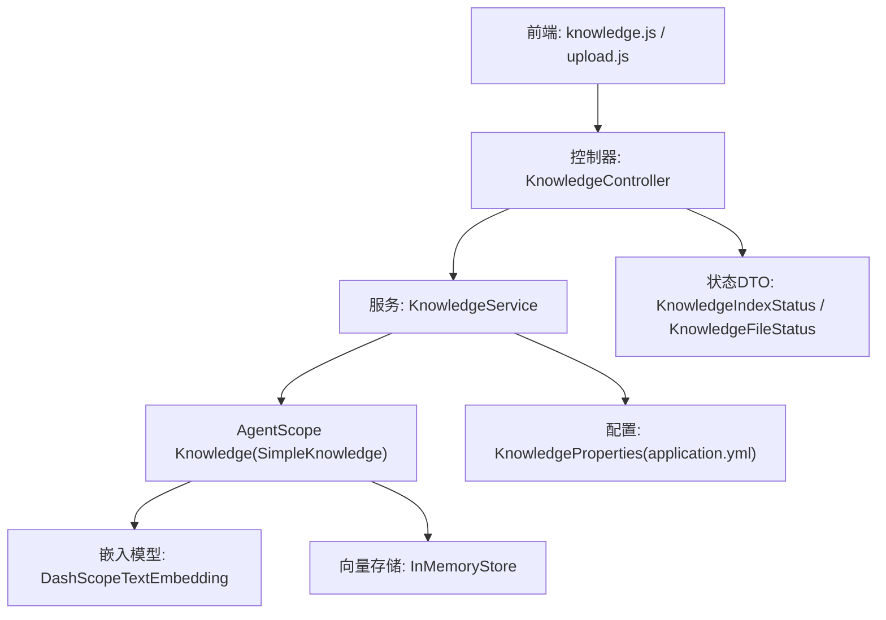
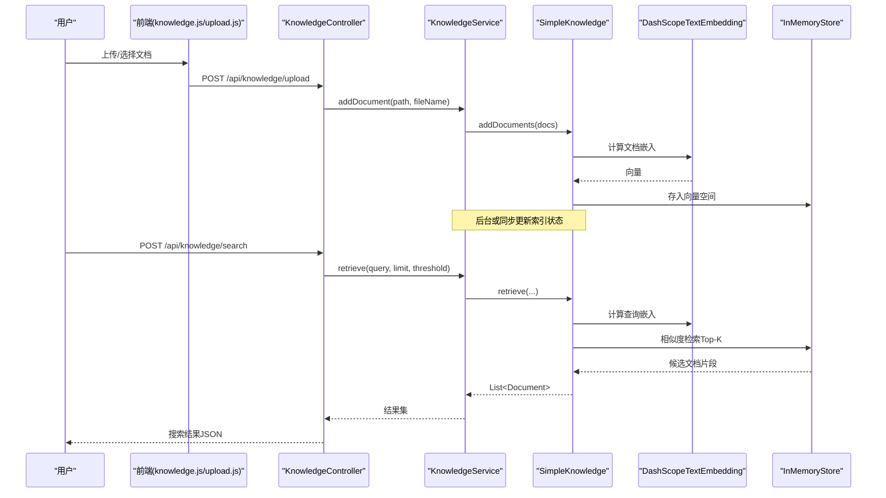
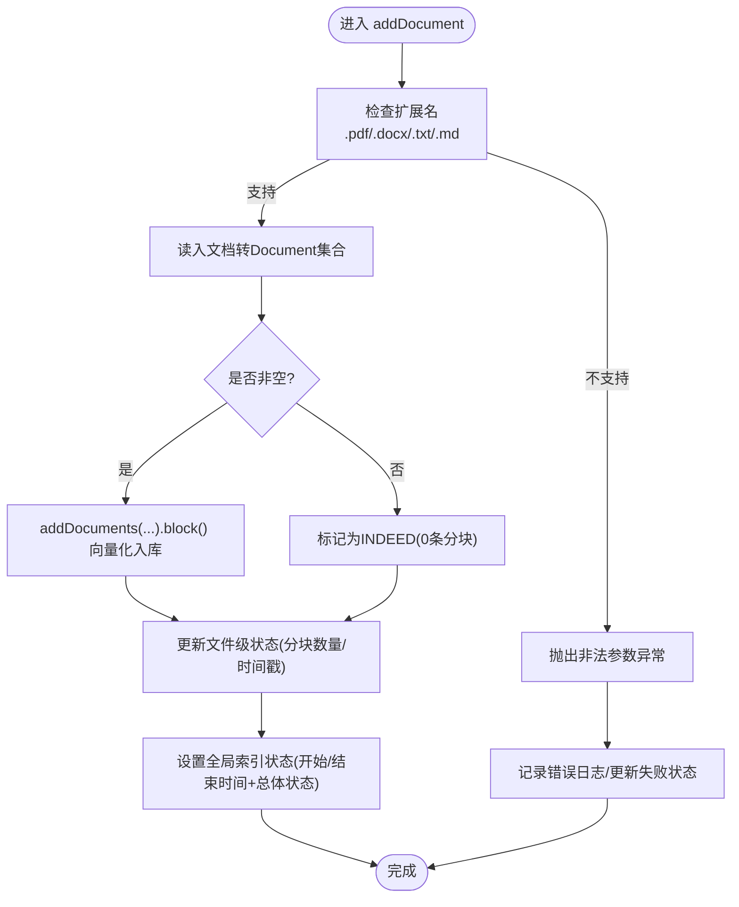
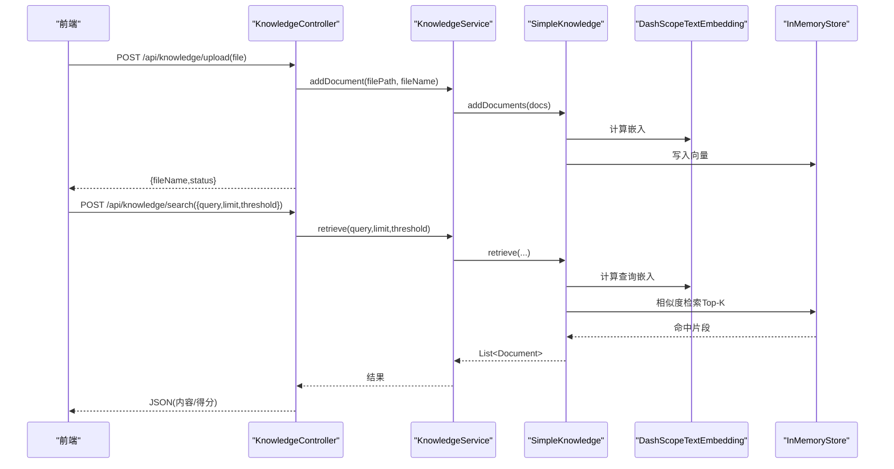
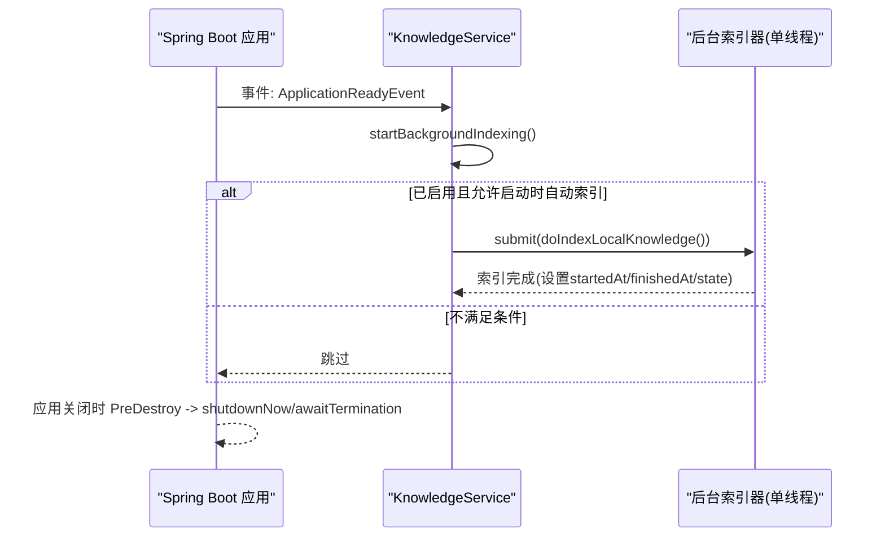
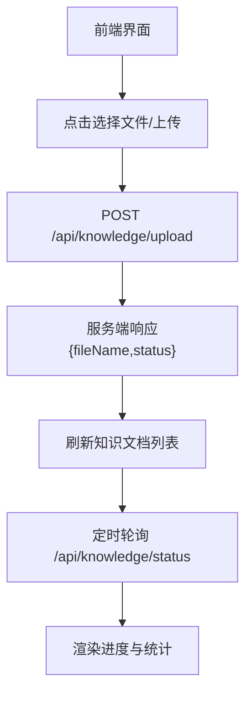
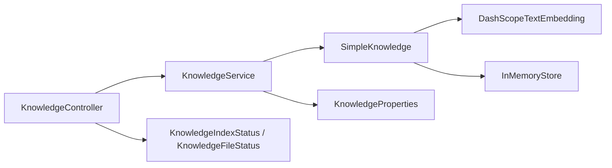

# RAG知识库系统

<cite>
**本文引用的文件**
- [KnowledgeService.java](file://src/main/java/com/skloda/agentscope/service/KnowledgeService.java)
- [KnowledgeController.java](file://src/main/java/com/skloda/agentscope/controller/KnowledgeController.java)
- [KnowledgeProperties.java](file://src/main/java/com/skloda/agentscope/service/KnowledgeProperties.java)
- [KnowledgeIndexStatus.java](file://src/main/java/com/skloda/agentscope/model/KnowledgeIndexStatus.java)
- [KnowledgeFileStatus.java](file://src/main/java/com/skloda/agentscope/model/KnowledgeFileStatus.java)
- [AgentConfig.java](file://src/main/java/com/skloda/agentscope/agent/AgentConfig.java)
- [AgentFactory.java](file://src/main/java/com/skloda/agentscope/agent/AgentFactory.java)
- [application.yml](file://src/main/resources/application.yml)
- [knowledge.js](file://src/main/resources/static/scripts/modules/knowledge.js)
- [upload.js](file://src/main/resources/static/scripts/modules/upload.js)
- [agents.yml](file://src/main/resources/config/agents.yml)
</cite>

## 目录
1. [简介](#简介)
2. [项目结构](#项目结构)
3. [核心组件](#核心组件)
4. [架构总览](#架构总览)
5. [详细组件分析](#详细组件分析)
6. [依赖关系分析](#依赖关系分析)
7. [性能与内存优化](#性能与内存优化)
8. [故障排查指南](#故障排查指南)
9. [结论](#结论)
10. [附录：API与部署配置](#附录api与部署配置)

## 简介
本项目实现了基于 AgentScope 的通用模式（Generic）RAG 知识库系统。启动时自动扫描本地 knowledge 目录，完成文档解析、文本分块、向量嵌入与存储；在对话过程中通过语义相似度检索召回相关片段增强生成回答。后端提供上传、索引状态查询、知识检索等 REST API，前端提供知识管理界面用于上传、查看索引进度和删除文档。

本技术文档聚焦 Generic RAG 架构设计、KnowledgeService 核心实现（文档预处理与分块策略、嵌入模型配置与优化、向量化存储）、后台索引任务与线程池管理、文件系统组织与自动发现机制、前端知识管理界面及部署调优建议。

## 项目结构
RAG 相关知识由服务层、控制层、配置与数据模型、以及前端脚本共同构成：
- 服务层：KnowledgeService 负责知识库生命周期、文档解析与向量化、后台索引任务、状态跟踪。
- 控制层：KnowledgeController 暴露 /api/knowledge/* REST 接口。
- 配置与模型：KnowledgeProperties 提供 agentscope.knowledge 类型化配置；KnowledgeIndexStatus/KnowledgeFileStatus 描述索引状态。
- 智能体集成：AgentConfig 中的 ragMode=generic 与 AgentFactory 将其映射为 AgentScope RAGMode.GENERIC。
- 前端：knowledge.js 与 upload.js 提供上传、列表展示与删除等交互能力。

图表来源
- [KnowledgeService.java:73-88](file://src/main/java/com/skloda/agentscope/service/KnowledgeService.java#L73-L88)
- [KnowledgeController.java:27-131](file://src/main/java/com/skloda/agentscope/controller/KnowledgeController.java#L27-L131)
- [application.yml:62-71](file://src/main/resources/application.yml#L62-L71)

章节来源
- [KnowledgeService.java:39-88](file://src/main/java/com/skloda/agentscope/service/KnowledgeService.java#L39-L88)
- [KnowledgeController.java:20-131](file://src/main/java/com/skloda/agentscope/controller/KnowledgeController.java#L20-L131)
- [application.yml:62-71](file://src/main/resources/application.yml#L62-L71)

## 核心组件
- KnowledgeService：封装 SimpleKnowledge + InMemoryStore 的使用；管理后台单线程索引器、文件级状态快照、应用启动自动索引。
- KnowledgeController：REST 接口统一入口，承载上传、状态查询、检索、列出/删除已索引文档。
- KnowledgeProperties：类型化配置 agentscope.knowledge（enabled/path/embedding-model/dimensions/chunk-size/overlap/split-strategy/auto-index-on-startup）。
- KnowledgeIndexStatus / KnowledgeFileStatus：聚合索引状态与每个文件的状态细节（文件名、扩展名、状态枚举、分块数、更新时间、错误消息等）。
- AgentConfig/AgentFactory：将 RagMode.generic 注入到 AgentScope 引擎，使智能体调用 Knowledge.retrieve() 进行检索增强。

章节来源
- [KnowledgeProperties.java:8-21](file://src/main/java/com/skloda/agentscope/service/KnowledgeProperties.java#L8-L21)
- [KnowledgeIndexStatus.java:9-58](file://src/main/java/com/skloda/agentscope/model/KnowledgeIndexStatus.java#L9-L58)
- [KnowledgeFileStatus.java:8-28](file://src/main/java/com/skloda/agentscope/model/KnowledgeFileStatus.java#L8-L28)
- [AgentConfig.java:32-40](file://src/main/java/com/skloda/agentscope/agent/AgentConfig.java#L32-L40)
- [AgentFactory.java:159-172](file://src/main/java/com/skloda/agentscope/agent/AgentFactory.java#L159-L172)
- [AgentFactory.java:389-397](file://src/main/java/com/skloda/agent/AgentFactory.java#L389-L397)

## 架构总览
RAG 数据流包含两条关键链路：
- 构建期（离线/后台）：文件解析 → 文本分段 → 嵌入向量 → 写入向量存储
- 运行期（在线）：用户查询 → 向量相似度检索 → 返回相关片段 → Agent 结合上下文生成答案

图表来源
- [KnowledgeService.java:73-88](file://src/main/java/com/skloda/agentscope/service/KnowledgeService.java#L73-L88)
- [KnowledgeController.java:40-120](file://src/main/java/com/skloda/agentscope/controller/KnowledgeController.java#L40-L120)

章节来源
- [KnowledgeService.java:91-177](file://src/main/java/com/skloda/agentscope/service/KnowledgeService.java#L91-L177)
- [KnowledgeController.java:40-120](file://src/main/java/com/skloda/agentscope/controller/KnowledgeController.java#L40-L120)

## 详细组件分析

### KnowledgeService：文档索引与检索核心
职责与关键点：
- 初始化阶段：
  - 从应用配置读取 agentscope.model.dashscope.api-key、embedding-model、dimensions 构建 DashScopeTextEmbedding。
  - 使用 SimpleKnowledge.builder() 装配 embeddingModel 与 InMemoryStore（按 dimensions 初始化）。
  - 注册 ApplicationReadyEvent，启用后台索引任务。
- 后台索引：
  - 单线程后台线程池（daemon 线程），避免阻塞主线程。
  - 支持禁用知识、关闭启动自动索引；防止重复并发索引（AtomicBoolean 守卫）。
  - 提供 @PreDestroy 安全关停线程池。
- 文档添加流程：
  - 校验扩展名（仅 PDF/DOCX/TXT/MD），读取并转换为一组 Document，调用 knowledge.addDocuments().block() 完成向量化入库。
  - 维护 fileStatuses（LinkedHashMap）持久记录每个文件的相对/绝对路径、扩展名、状态、分块计数与错误信息。
  - 维护整体索引状态 state（EMPTY/PENDING/INDEXING/READY/FAILED 等）与时间戳 startedAt/finishedAt。
- 状态查询：
  - 返回 KnowledgeIndexStatus，内置 total/indexed/skipped/failed 汇总与 documents 明细排序。
- 删除与局限说明：
  - 当前移除操作只管理“索引清单”（不影响 InMemoryStore 内历史向量），注释标注了旧向量可能残留。

性能与可扩展性注意：
- 当前 addDocument 采用 .block() 同步等待，适合小批/演示场景；生产可考虑非阻塞 reactive 链路与批量提交以减轻 CPU/IO 压力。
- InMemoryStore 随进程存在而常驻，适用于单机/内存充裕的环境；生产建议替换为有界或外部向量数据库以实现持久化与水平扩展。

图表来源
- [KnowledgeService.java:143-177](file://src/main/java/com/skloda/agentscope/service/KnowledgeService.java#L143-L177)

章节来源
- [KnowledgeService.java:73-88](file://src/main/java/com/skloda/agentscope/service/KnowledgeService.java#L73-L88)
- [KnowledgeService.java:91-177](file://src/main/java/com/skloda/agentscope/service/KnowledgeService.java#L91-L177)
- [KnowledgeService.java:127-138](file://src/main/java/com/skloda/agentscope/service/KnowledgeService.java#L127-L138)

### 文档预处理与分块策略
- 读取与解析：
  - 根据扩展名路由至 TextReader / PDFReader / WordReader，得到 AgentScope RAG 的 Document 列表。
- 分块策略：
  - SplitStrategy.PARAGRAPH 默认按段落切分，配合 chunk-size 与 overlap-size 配置控制大小与重叠率。
  - 这些字段由 KnowledgeProperties 提供，可在 application.yml 中调整以平衡检索精度与上下文完整性。
- 长度控制与质量：
  - 过小的分块可能丢失上下文，过大则影响检索匹配精度；建议对长文档优先拆分大段落，再按字符/Token 二次切分。

章节来源
- [application.yml:62-70](file://src/main/resources/application.yml#L62-L70)
- [KnowledgeProperties.java:8-21](file://src/main/java/com/skloda/agentscope/service/KnowledgeProperties.java#L8-L21)
- [KnowledgeService.java:156-164](file://src/main/java/com/skloda/agentscope/service/KnowledgeService.java#L156-L164)

### 嵌入模型配置与优化（DashScopeTextEmbedding）
- 参数来源：
  - api-key 来自 agentscope.model.dashscope.api-key（环境变量 DASHSCOPE_API_KEY 覆盖）。
  - model-name 由 agentscope.model.dashscope.model-name 指定（如 deepseek-v4-flash-0731 或用于嵌入的文本模型名）。
  - dimensions 由 agentscope.knowledge.dimensions 控制。
- 实践建议：
  - 确保网络可达且配额充足；在高并发下可结合限流/重试与连接池配置（由提供方侧决定）。
  - 维度越大越精确但消耗更多内存与计算资源；需结合 InMemoryStore 容量评估。
  - 可对不同类别知识分别索引并隔离向量空间（业务层面通过命名空间/标签区分）。

章节来源
- [application.yml:25-42](file://src/main/resources/application.yml#L25-L42)
- [KnowledgeService.java:73-88](file://src/main/java/com/skloda/agentscope/service/KnowledgeService.java#L73-L88)
- [KnowledgeProperties.java:8-21](file://src/main/java/com/skloda/agentscope/service/KnowledgeProperties.java#L8-L21)

### 向量化存储选型（InMemoryStore vs 生产替代方案）
- 优点（InMemoryStore）：
  - 零运维、快速上手；非常适合演示与开发环境。
- 限制与风险：
  - 数据不持久，重启即丢失；不支持删改特定条目；大规模索引会占用堆内存。
- 生产替代建议：
  - 可引入支持持久化与分布式能力的向量库（如 Milvus、Qdrant、Weaviate、Redis Vector、OpenSearch kNN 等），通过自定义 embedding store 适配。
  - 考虑分片、预取缓存与冷热分层，降低延迟并提升可用性。

章节来源
- [KnowledgeService.java:82-88](file://src/main/java/com/skloda/agentscope/service/KnowledgeService.java#L82-L88)
- [KnowledgeService.java:57-58](file://src/main/java/com/skloda/agentscope/service/KnowledgeService.java#L57-L58)

### 知识管理接口设计
- 文件添加：POST /api/knowledge/upload
  - 接收 multipart file，限定格式；保存临时文件后调用 addDocument。
  - 成功返回 {fileName, status="indexed"}。
- 列出已索引文档：GET /api/knowledge/documents
  - 返回文件名列表。
- 查询检索：POST /api/knowledge/search
  - 请求体含 query、可选 limit/threshold；返回包含内容与得分的片段。
- 删除文档：DELETE /api/knowledge/documents/{fileName}
  - 清理清单状态（不保证清理向量库历史数据）。
- 状态查询：GET /api/knowledge/status
  - 返回 KnowledgeIndexStatus，含总体状态、文件明细、时间戳与统计计数。

图表来源
- [KnowledgeController.java:40-130](file://src/main/java/com/skloda/agentscope/controller/KnowledgeController.java#L40-L130)
- [KnowledgeService.java:73-88](file://src/main/java/com/skloda/agentscope/service/KnowledgeService.java#L73-L88)

章节来源
- [KnowledgeController.java:40-130](file://src/main/java/com/skloda/agentscope/controller/KnowledgeController.java#L40-L130)

### 后台索引任务与线程池管理
- 触发时机：ApplicationReadyEvent 后启动后台索引。
- 线程池：单线程 Executor，守护线程；可避免阻塞主线程的同时保证顺序处理。
- 防抖与幂等：AtomicBoolean 防止并发重复启动；@PreDestroy 保障优雅停机。
- 可配置项：enabled、auto-index-on-startup 由 KnowledgeProperties 控制。

图表来源
- [KnowledgeService.java:91-125](file://src/main/java/com/skloda/agentscope/service/KnowledgeService.java#L91-L125)
- [KnowledgeService.java:127-138](file://src/main/java/com/skloda/agentscope/service/KnowledgeService.java#L127-L138)
- [KnowledgeProperties.java:8-21](file://src/main/java/com/skloda/agentscope/service/KnowledgeProperties.java#L8-L21)

章节来源
- [KnowledgeService.java:91-138](file://src/main/java/com/skloda/agentscope/service/KnowledgeService.java#L91-L138)
- [KnowledgeProperties.java:8-21](file://src/main/java/com/skloda/agentscope/service/KnowledgeProperties.java#L8-L21)

### 文件系统组织与自动发现
- 知识目录：agentscope.knowledge.path（默认 src/main/resources/knowledge）。
- 自动发现：启动时扫描目录，逐文件检测扩展名并解析，过滤不支持格式。
- 增量更新：当前实现以全量覆盖式思路（文件状态表维护最新元数据）；未来可按 mtime/file-hash 实现增量扫描与差异化索引。
- 多租户/隔离：建议在路径上体现业务域（如 knowledge/domain-A/...），并在前端显示为分类视图。

章节来源
- [application.yml:62-70](file://src/main/resources/application.yml#L62-L70)
- [KnowledgeService.java:199-199](file://src/main/java/com/skloda/agentscope/service/KnowledgeService.java#L199-L199)
- [KnowledgeController.java:51-68](file://src/main/java/com/skloda/agentscope/controller/KnowledgeController.java#L51-L68)

### 前端知识管理界面
- 上传组件（upload.js）：
  - 监听文件输入，校验格式；调用 /api/knowledge/upload。
  - 成功后在聊天区追加附件标签，并根据所选智能体能力提示切换。
- 知识管理（knowledge.js）：
  - 列出已索引文档、删除单个文档。
- 状态监控：
  - 可通过 GET /api/knowledge/status 周期性拉取，展示进度与统计。

图表来源
- [upload.js:22-111](file://src/main/resources/static/scripts/modules/upload.js#L22-L111)
- [knowledge.js:5-59](file://src/main/resources/static/scripts/modules/knowledge.js#L5-L59)
- [KnowledgeController.java:40-130](file://src/main/java/com/skloda/agentscope/controller/KnowledgeController.java#L40-L130)

章节来源
- [knowledge.js:5-59](file://src/main/resources/static/scripts/modules/knowledge.js#L5-L59)
- [upload.js:22-111](file://src/main/resources/static/scripts/modules/upload.js#L22-L111)
- [KnowledgeController.java:40-130](file://src/main/java/com/skloda/agentscope/controller/KnowledgeController.java#L40-L130)

### 智能体与Generic RAG模式集成
- 智能体配置（agents.yml）：
  - ragEnabled=true, ragMode=generic, ragRetrieveLimit、ragScoreThreshold。
- AgentConfig/AgentFactory：
  - ragMode="generic" 被解析为 RAGMode.GENERIC 并注入智能体构建器。
  - 这使得智能体在需要时调用 Knowledge.retrieve() 获取背景知识，形成检索增强的回复。

章节来源
- [agents.yml:171-199](file://src/main/resources/config/agents.yml#L171-L199)
- [AgentConfig.java:32-40](file://src/main/java/com/skloda/agentscope/agent/AgentConfig.java#L32-L40)
- [AgentFactory.java:159-172](file://src/main/java/com/skloda/agentscope/agent/AgentFactory.java#L159-L172)
- [AgentFactory.java:389-397](file://src/main/java/com/skloda/agentscope/agent/AgentFactory.java#L389-L397)

## 依赖关系分析
- 耦合与内聚：
  - KnowledgeService 紧密绑定 SimpleKnowledge 与 InMemoryStore，内聚度高但更换向量库时需要抽象出 Store 接口。
  - KnowledgeController 低耦合于 Controller 层，便于独立测试与替换响应结构。
- 外部依赖：
  - DashScope 文本嵌入服务：需在启动前配置好 API Key 与模型名。
  - 文件格式解析：PDFBox/Apache POI（由 AgentScope Reader 间接引入）。
- 潜在循环依赖：
  - 当前未见循环导入；服务层仅依赖配置与 AgentScope SDK。

图表来源
- [KnowledgeController.java:27-131](file://src/main/java/com/skloda/agentscope/controller/KnowledgeController.java#L27-L131)
- [KnowledgeService.java:73-88](file://src/main/java/com/skloda/agentscope/service/KnowledgeService.java#L73-L88)
- [KnowledgeProperties.java:8-21](file://src/main/java/com/skloda/agentscope/service/KnowledgeProperties.java#L8-L21)
- [KnowledgeIndexStatus.java:9-58](file://src/main/java/com/skloda/agentscope/model/KnowledgeIndexStatus.java#L9-L58)
- [KnowledgeFileStatus.java:8-28](file://src/main/java/com/skloda/agentscope/model/KnowledgeFileStatus.java#L8-L28)

章节来源
- [KnowledgeController.java:20-131](file://src/main/java/com/skloda/agentscope/controller/KnowledgeController.java#L20-L131)
- [KnowledgeService.java:39-88](file://src/main/java/com/skloda/agentscope/service/KnowledgeService.java#L39-L88)

## 性能与内存优化
- 分块策略：
  - PARAGRAPH + chunk-size=512 + overlap=50 作为基线；可根据领域文本长度与检索准确率微调。
- 向量维度：
  - dimensions=1024；若显存/内存受限可降至 512 或更低，但会影响检索效果。
- 并发与吞吐：
  - 后台索引器为单线程，适合轻量场景；高吞吐时可升级为固定大小线程池（合理上限以避免队列积压）。
- 向量存储：
  - InMemoryStore 无持久化与限流；生产建议替换为外部向量库，并提供超时、重试、熔断策略。
- I/O 与文件上传：
  - 修改 spring.servlet.multipart.* 控制上传大小与请求体积，避免 OOM 或拒绝服务。
- 检索参数：
  - search 接口支持 limit 与 threshold，适当提高阈值可降低无关召回但增加漏召回。

[本节为通用性能指导，不涉及具体代码片段]

## 故障排查指南
- 常见问题定位：
  - 无法解析的文件：确认扩展名是否为 .pdf/.docx/.txt/.md；查看控制台错误日志。
  - 索引失败：检查 KnowledgeIndexStatus.documents 中 FAILED 项的 message；核对网络连接与 API Key。
  - 检索结果为空：检查 threshold 是否过高；扩大 chunk-size 或降低 overlap 以提升片段代表性。
- 诊断步骤：
  - 调用 GET /api/knowledge/status 观察整体状态与每个文件状态。
  - 逐步增大 log.level 到 DEBUG，关注 reader/embedding/store 日志。
  - 对大文件分批上传或先拆分后再入库，减少单次处理开销。
- 恢复策略：
  - 重启应用后可重建索引（如需）。
  - 删除问题文档后重新上传，清理无效元数据。

章节来源
- [KnowledgeController.java:83-120](file://src/main/java/com/skloda/agentscope/controller/KnowledgeController.java#L83-L120)
- [KnowledgeIndexStatus.java:9-58](file://src/main/java/com/skloda/agentscope/model/KnowledgeIndexStatus.java#L9-L58)

## 结论
本实现以 SimpleKnowledge + InMemoryStore 提供了开箱即用的 Generic RAG 能力，具备后台自动索引、状态可视化与 REST 检索接口，满足学习与演示需求。面向生产环境的演进方向包括：替换向量存储为有状态/分布式存储、引入增量索引与版本管理、完善删除一致性、增强并发与容错能力，并结合业务特性优化分块与检索参数。

[本节为总结性内容，不直接引用代码文件]

## 附录：API与部署配置

### API 接口
- 上传文档
  - 方法/路径：POST /api/knowledge/upload
  - 请求：multipart/form-data，字段 file
  - 响应：{fileName, status="indexed"} 或 {error}
- 列出已索引文档
  - 方法/路径：GET /api/knowledge/documents
  - 响应：String[]
- 查询检索
  - 方法/路径：POST /api/knowledge/search
  - 请求体：{query, limit?, threshold?}
  - 响应：{query, count, results:[{content, score}]}
- 删除文档
  - 方法/路径：DELETE /api/knowledge/documents/{fileName}
  - 响应：{removed=true}
- 索引状态
  - 方法/路径：GET /api/knowledge/status
  - 响应：KnowledgeIndexStatus（包含状态、文件明细、统计计数与时间戳）

章节来源
- [KnowledgeController.java:40-130](file://src/main/java/com/skloda/agentscope/controller/KnowledgeController.java#L40-L130)

### 部署与配置要点
- 关键配置（application.yml）
  - agentscope.model.dashscope.api-key：API Key，可被 DASHSCOPE_API_KEY 环境变量覆盖。
  - agentscope.model.dashscope.model-name：模型名称。
  - agentscope.knowledge.enabled/path/embedding-model/dimensions/chunk-size/overlap-size/split-strategy/auto-index-on-startup。
  - spring.servlet.multipart.max-file-size/max-request-size：上传限制。
- 运行前提
  - Java 17、Spring Boot 3.5.x。
  - 网络可达 DashScope，配额充足。
- 建议
  - 首次启动时开启 auto-index-on-startup，完成初始索引。
  - 生产环境接入监控指标（QPS、延迟、错误率）与告警（失败次数、延迟阈值）。

章节来源
- [application.yml:25-89](file://src/main/resources/application.yml#L25-L89)