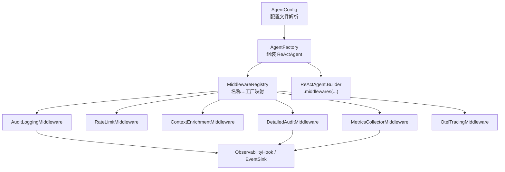
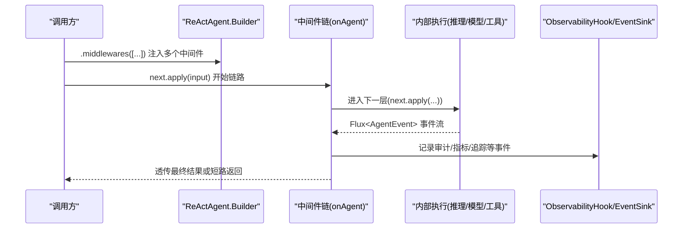
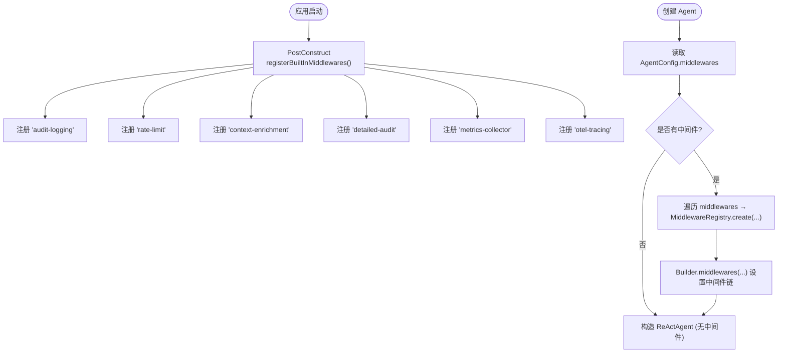
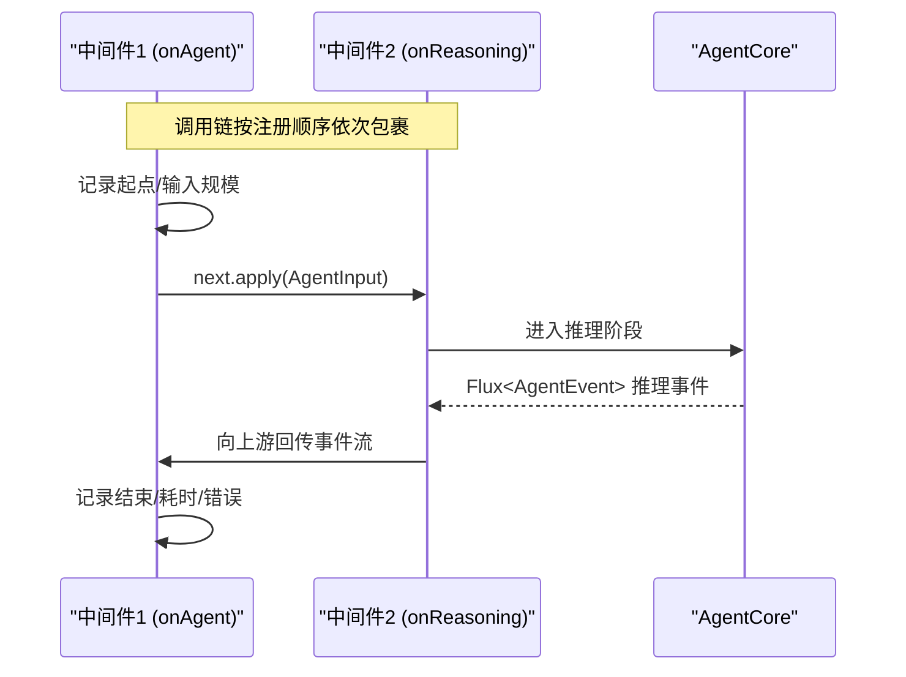
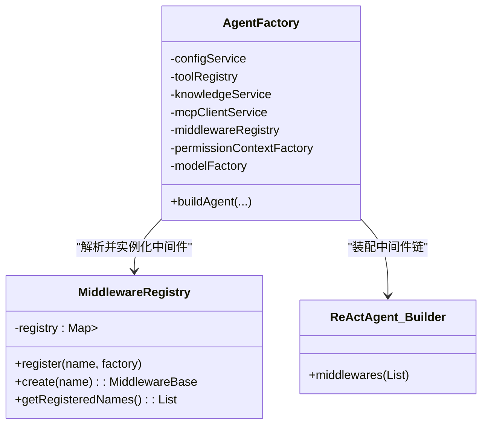

# 中间件架构

<cite>
**本文引用的文件 **
- [MiddlewareRegistry.java](file://src/main/java/com/skloda/agentscope/middleware/MiddlewareRegistry.java)
- [AuditLoggingMiddleware.java](file://src/main/java/com/skloda/agentscope/middleware/AuditLoggingMiddleware.java)
- [RateLimitMiddleware.java](file://src/main/java/com/skloda/agentscope/middleware/RateLimitMiddleware.java)
- [ContextEnrichmentMiddleware.java](file://src/main/java/com/skloda/agentscope/middleware/ContextEnrichmentMiddleware.java)
- [ApprovalMiddleware.java](file://src/main/java/com/skloda/agentscope/middleware/ApprovalMiddleware.java)
- [DetailedAuditMiddleware.java](file://src/main/java/com/skloda/agentscope/middleware/DetailedAuditMiddleware.java)
- [MetricsCollectorMiddleware.java](file://src/main/java/com/skloda/agentscope/middleware/MetricsCollectorMiddleware.java)
- [AgentFactory.java](file://src/main/java/com/skloda/agentscope/agent/AgentFactory.java)
- [AgentConfig.java](file://src/main/java/com/skloda/agentscope/agent/AgentConfig.java)
- [ObservabilityHook.java](file://src/main/java/com/skloda/agentscope/hook/ObservabilityHook.java)
</cite>

## 目录
1. [引言](#引言)
2. [项目结构](#项目结构)
3. [核心组件](#核心组件)
4. [架构总览](#架构总览)
5. [详细组件分析](#详细组件分析)
6. [依赖关系分析](#依赖关系分析)
7. [性能考量](#性能考量)
8. [故障排查指南](#故障排查指南)
9. [结论](#结论)
10. [附录：开发与配置示例](#附录开发与配置示例)

## 引言
本文件针对 AgentScope 2.0 的中间件（Middleware）机制，系统化阐述其在当前代码库中的设计与实现。重点涵盖 MiddlewareRegistry 的注册模式与工厂机制、生命周期钩子、内置中间件的发现与自动注册、执行链编排与错误传播、以及扩展开发指南和配置方式。读者将理解如何通过“洋葱圈”拦截层对 Agent 的全生命周期进行无侵入式增强（审计、限流、上下文注入、审批、指标收集等），并安全地扩展新能力。

## 项目结构
中间件相关源码位于 middleware 包，并由 AgentFactory 在构建 ReActAgent 时装配；AgentConfig 提供 per-agent 的配置入口。

图表来源
- [AgentFactory.java](file://src/main/java/com/skloda/agentscope/agent/AgentFactory.java)
- [MiddlewareRegistry.java](file://src/main/java/com/skloda/agentscope/middleware/MiddlewareRegistry.java)
- [AuditLoggingMiddleware.java](file://src/main/java/com/skloda/agentscope/middleware/AuditLoggingMiddleware.java)
- [MetricsCollectorMiddleware.java](file://src/main/java/com/skloda/agentscope/middleware/MetricsCollectorMiddleware.java)
- [DetailedAuditMiddleware.java](file://src/main/java/com/skloda/agentscope/middleware/DetailedAuditMiddleware.java)

章节来源
- [AgentFactory.java:131-200](file://src/main/java/com/skloda/agentscope/agent/AgentFactory.java#L131-L200)
- [MiddlewareRegistry.java:12-55](file://src/main/java/com/skloda/agentscope/middleware/MiddlewareRegistry.java#L12-L55)
- [AgentConfig.java:91-92](file://src/main/java/com/skloda/agentscope/agent/AgentConfig.java#L91-L92)

## 核心组件
- MiddlewareRegistry：以“名称→工厂”的映射管理所有中间件，支持运行时创建和查询已注册名。提供 PostConstruct 自动注册内置中间件。
- 各中间件实现：基于 io.agentscope.core.middleware.MiddlewareBase，覆写 onSystemPrompt/onAgent/onReasoning/onModelCall/onActing 中所需的钩子。
- AgentFactory：从 AgentConfig 中读取 middlewares 列表，通过 MiddlewareRegistry 实例化并按顺序添加到 ReActAgent.Builder.middlewares()。
- ObservabilityHook/EventSink：多数中间件通过 AgentScope 标准事件流输出调试信息或指标，供前端 SSE 与调试面板展示。

章节来源
- [MiddlewareRegistry.java:12-55](file://src/main/java/com/skloda/agentscope/middleware/MiddlewareRegistry.java#L12-L55)
- [AgentFactory.java:131-200](file://src/main/java/com/skloda/agentscope/agent/AgentFactory.java#L131-L200)
- [ObservabilityHook.java](file://src/main/java/com/skloda/agentscope/hook/ObservabilityHook.java)

## 架构总览
中间件遵循“洋葱圈”拦截模型：外层包裹内层。每个中间件可选择性地处理不同阶段：
- onSystemPrompt：系统提示词预处理（返回 Mono<String>）
- onAgent：整个 Agent 调用周期（Flux<AgentEvent>）
- onReasoning：推理阶段（Flux<AgentEvent>）
- onModelCall：原始模型调用（Flux<AgentEvent>）
- onActing：工具执行阶段（Flux<AgentEvent>）

图表来源
- [AgentFactory.java:186-199](file://src/main/java/com/skloda/agentscope/agent/AgentFactory.java#L186-L199)
- [AuditLoggingMiddleware.java:19-35](file://src/main/java/com/skloda/agentscope/middleware/AuditLoggingMiddleware.java#L19-L35)
- [MetricsCollectorMiddleware.java:50-90](file://src/main/java/com/skloda/agentscope/middleware/MetricsCollectorMiddleware.java#L50-L90)

## 详细组件分析

### 中间件注册与装配流程
- 自动注册：MiddlewareRegistry 使用 Spring PostConstruct 方法，将审计、限流、上下文注入、详细审计、指标收集、OpenTelemetry 追踪等内置中间件按命名注册到内部有序映射中。
- 按配置加载：AgentFactory 在构建 ReActAgent 时，若 AgentConfig 声明了 middlewares 列表，便逐个通过 MiddlewareRegistry.create(name) 创建实例并装配至 Builder。
- 执行顺序：通过 LinkedHashSet/LinkedHashMap 保证注册次序即为执行次序（先注册先执行）。

图表来源
- [MiddlewareRegistry.java:26-40](file://src/main/java/com/skloda/agentscope/middleware/MiddlewareRegistry.java#L26-L40)
- [AgentFactory.java:192-199](file://src/main/java/com/skloda/agentscope/agent/AgentFactory.java#L192-L199)

章节来源
- [MiddlewareRegistry.java:26-55](file://src/main/java/com/skloda/agentscope/middleware/MiddlewareRegistry.java#L26-L55)
- [AgentFactory.java:192-199](file://src/main/java/com/skloda/agentscope/agent/AgentFactory.java#L192-L199)

### 中间件执行链与生命周期编排
- 外层包裹内层：每个中间件在需要处理的阶段调用 next.apply(...) 进入内层，并在完成或异常回调处写入耗时、统计、日志等信息。
- 可短路：中间件可在特定阶段直接返回空流/空字符串以阻断后续执行（例如限流命中、审批未通过）。
- 事件传播：中间件可监听或产生 AgentEvent，经由 ObservationHook/EventSink 下发到前端 SSE。

图表来源
- [AuditLoggingMiddleware.java:19-35](file://src/main/java/com/skloda/agentscope/middleware/AuditLoggingMiddleware.java#L19-L35)
- [DetailedAuditMiddleware.java:45-107](file://src/main/java/com/skloda/agentscope/middleware/DetailedAuditMiddleware.java#L45-L107)

章节来源
- [AuditLoggingMiddleware.java:19-68](file://src/main/java/com/skloda/agentscope/middleware/AuditLoggingMiddleware.java#L19-L68)
- [DetailedAuditMiddleware.java:45-180](file://src/main/java/com/skloda/agentscope/middleware/DetailedAuditMiddleware.java#L45-L180)

### 依赖管理与错误传播
- 中间件自身状态：建议使用线程隔离的上下文（如 ThreadLocal）保存一次请求/调用的追踪信息，避免跨调用污染。
- 错误传播：多数中间件通过 doOnError 记录错误，并通过下游抛出的异常向上传播，上层可据此判断整体失败。
- 安全短路：限流/审批等场景通过返回空流或阻止 next 调用达到短路，不会触发下游工具执行或模型调用。

章节来源
- [RateLimitMiddleware.java:31-52](file://src/main/java/com/skloda/agentscope/middleware/RateLimitMiddleware.java#L31-L52)
- [ApprovalMiddleware.java:58-77](file://src/main/java/com/skloda/agentscope/middleware/ApprovalMiddleware.java#L58-L77)
- [DetailedAuditMiddleware.java:98-107](file://src/main/java/com/skloda/agentscope/middleware/DetailedAuditMiddleware.java#L98-L107)

## 依赖关系分析
- AgentFactory 依赖 AgentConfig、ToolRegistry、KnowledgeService、McpClientService、MiddlewareRegistry、PermissionContextFactory、ModelFactory。
- MiddlewareRegistry 依赖 Spring 容器生命周期注解，统一托管内置中间件的注册；外部中间件可扩展其 register(...) 接口。
- 部分中间件共享全局统计聚合（如 MetricsCollectorMiddleware 的静态指标），需注意并发安全性与多 Agent 共享语义。

图表来源
- [AgentFactory.java:38-71](file://src/main/java/com/skloda/agentscope/agent/AgentFactory.java#L38-L71)
- [AgentFactory.java:186-199](file://src/main/java/com/skloda/agentscope/agent/AgentFactory.java#L186-L199)
- [MiddlewareRegistry.java:12-55](file://src/main/java/com/skloda/agentscope/middleware/MiddlewareRegistry.java#L12-L55)

## 性能考量
- 执行开销：每个中间件会增加一次 next.apply(...) 包裹成本，应尽量避免在热路径中进行阻塞或重计算。
- 资源管理：限流采用滑动时间窗口队列；指标收集使用原子计数与并发容器；审批中间件仅保留必要状态以减少内存占用。
- I/O 注意：日志级别与采样策略应在生产环境合理配置，避免高频打印造成压力。
- 并行与串扰：全局静态指标在多 Agent/多线程环境下为共享状态，需确保正确清理 ThreadLocal 上下文。

[本节为通用指导，不直接分析具体文件]

## 故障排查指南
- 限流生效但请求未被拒绝：检查 RateLimitMiddleware 配置的阈值与调用频率是否超出限制，确认时间窗口与队列清理逻辑。
- 审批被触发但未中断工具执行：确认 ApprovalMiddleware 是否正确注入，且审批逻辑判定条件（approvalTools/approvalRequired）符合预期。
- 指标不准确：检查 DetailedAudit/Metrics 中间件是否在正确的阶段采集事件，并确保 ThreadLocal 上下文的初始化与清理。
- 中间件不生效：核对 AgentConfig.middlewares 的名称是否与 MiddlewareRegistry.registered 一致。

章节来源
- [RateLimitMiddleware.java:31-52](file://src/main/java/com/skloda/agentscope/middleware/RateLimitMiddleware.java#L31-L52)
- [ApprovalMiddleware.java:58-77](file://src/main/java/com/skloda/agentscope/middleware/ApprovalMiddleware.java#L58-L77)
- [MetricsCollectorMiddleware.java:50-90](file://src/main/java/com/skloda/agentscope/middleware/MetricsCollectorMiddleware.java#L50-L90)
- [DetailedAuditMiddleware.java:45-107](file://src/main/java/com/skloda/agentscope/middleware/DetailedAuditMiddleware.java#L45-L107)

## 结论
本项目在 AgentScope 2.0 的基础上实现了稳健的中间件体系：通过统一的注册中心与装配入口，结合可插拔的生命周期钩子，使审计、限流、上下文增强、审批、指标收集和分布式追踪等功能得以解耦与复用。该架构具备良好的可扩展性与清晰的职责边界，便于未来继续丰富中间件生态。

## 附录：开发与配置示例

### 如何自定义中间件
- 新建类实现 io.agentscope.core.middleware.MiddlewareBase
- 选择需要处理的钩子（onSystemPrompt/onAgent/onReasoning/onModelCall/onActing）并覆盖
- 通过 next.apply(input) 进入下层，利用 doOnNext/doOnComplete/doOnError 添加横切逻辑
- 在需要时返回空流/空字符串以实现短路控制

章节来源
- [AuditLoggingMiddleware.java:19-68](file://src/main/java/com/skloda/agentscope/middleware/AuditLoggingMiddleware.java#L19-L68)
- [DetailedAuditMiddleware.java:45-180](file://src/main/java/com/skloda/agentscope/middleware/DetailedAuditMiddleware.java#L45-L180)
- [MetricsCollectorMiddleware.java:50-162](file://src/main/java/com/skloda/agentscope/middleware/MetricsCollectorMiddleware.java#L50-L162)

### 内置中间件与自动注册
- AuditLoggingMiddleware：记录 Agent/推理/工具的起止时间与消息规模
- RateLimitMiddleware：按分钟窗口的调用次数做限流
- ContextEnrichmentMiddleware：在系统提示前动态注入上下文（时间、用户身份等）
- DetailedAuditMiddleware：全链路详情审计（TraceId、Thinking、文本/工具细节）
- MetricsCollectorMiddleware：聚合指标与成本估算
- OtelTracingMiddleware：OpenTelemetry 追踪（由框架提供）

章节来源
- [MiddlewareRegistry.java:26-40](file://src/main/java/com/skloda/agentscope/middleware/MiddlewareRegistry.java#L26-L40)

### 在 Agent 配置中使用中间件
- 在 AgentConfig 中添加 middlewares 列表（字符串名称），与注册名称一一对应
- AgentFactory 会在构建 ReActAgent 时读取该配置并注入到中间件链

章节来源
- [AgentConfig.java:91-92](file://src/main/java/com/skloda/agentscope/agent/AgentConfig.java#L91-L92)
- [AgentFactory.java:192-199](file://src/main/java/com/skloda/agentscope/agent/AgentFactory.java#L192-L199)

### 审批（HITL）集成要点
- ApprovalMiddleware 在 onActing 阶段检测敏感工具调用，可按代理级或工具级规则触发审批
- 命中时将跳过工具执行（返回空流），并暴露待审批的工具调用清单给上层（如控制器/服务层）

章节来源
- [ApprovalMiddleware.java:42-124](file://src/main/java/com/skloda/agentscope/middleware/ApprovalMiddleware.java#L42-L124)