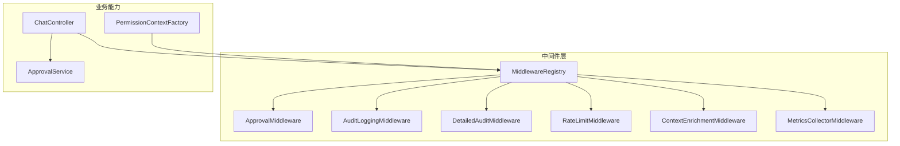
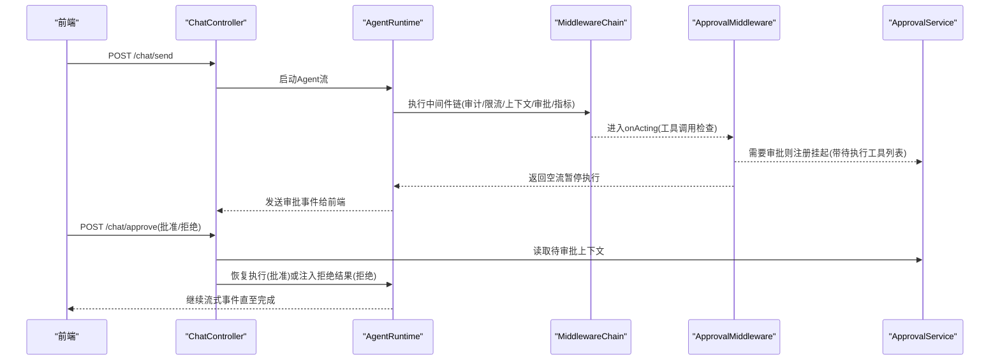
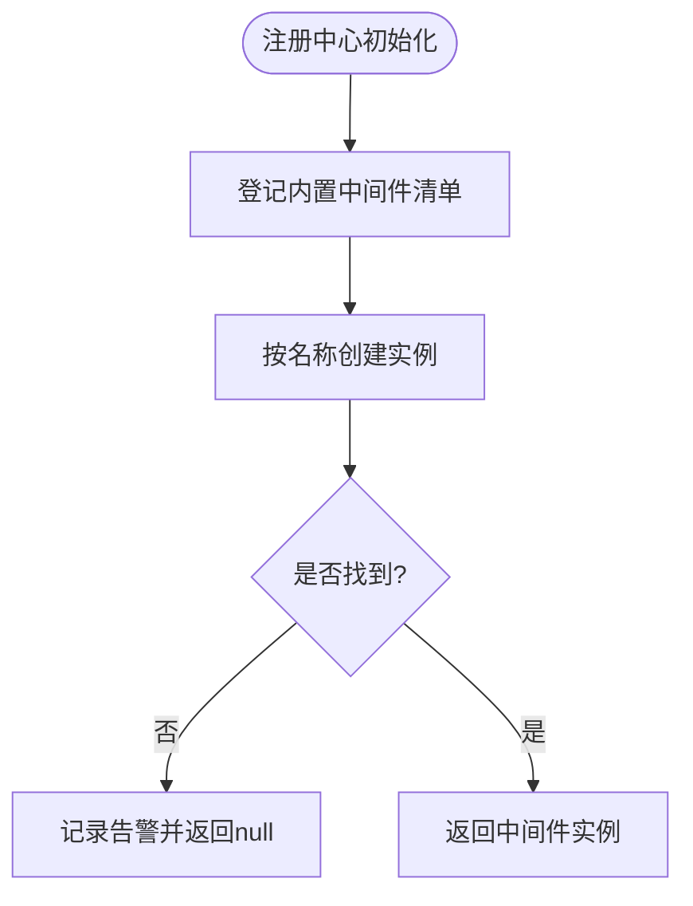
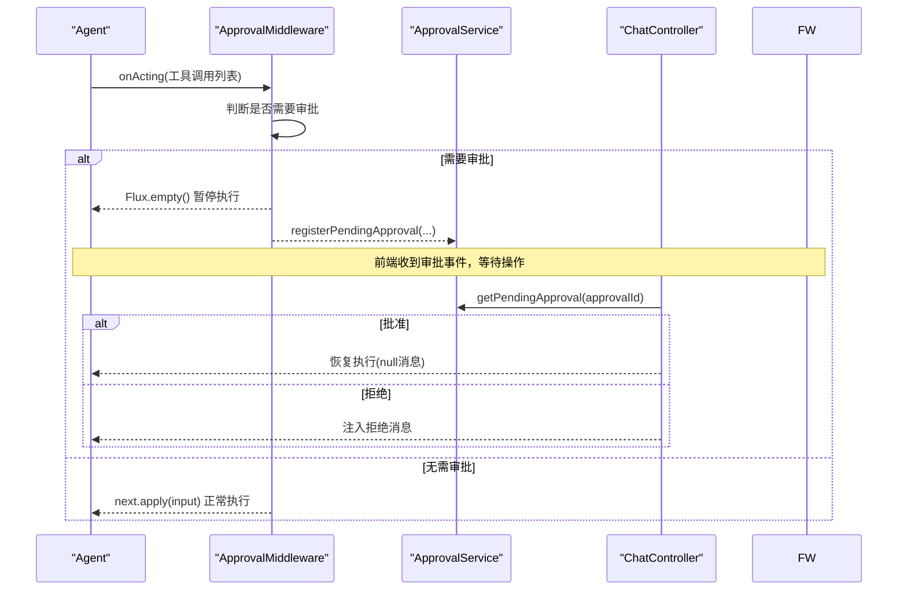
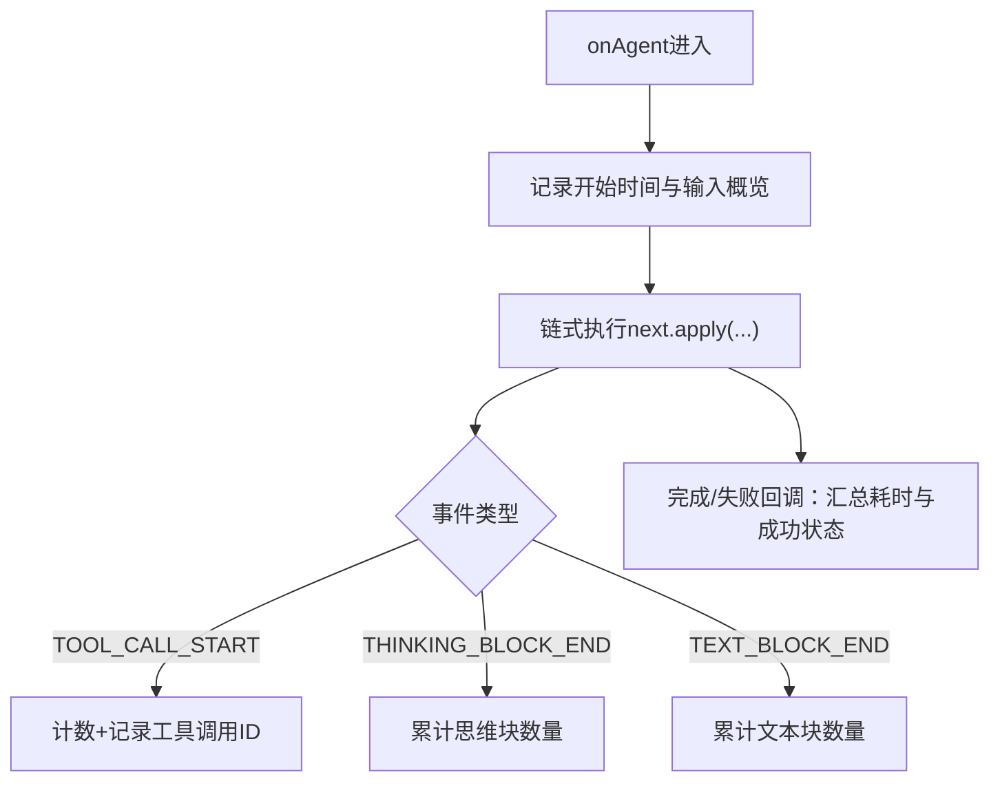
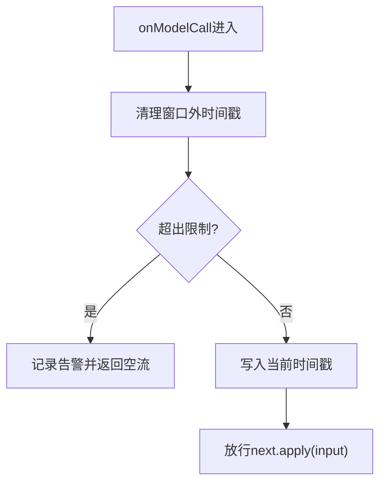
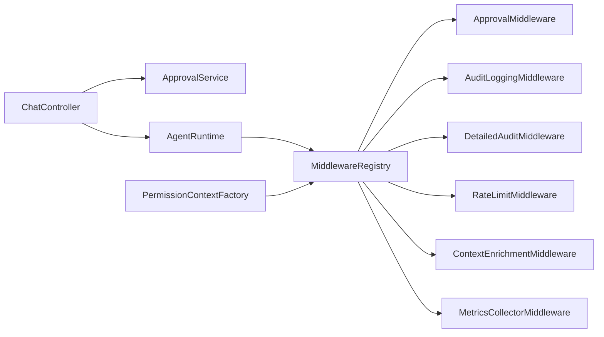

# 企业级特性

<cite>
**本文引用的文件**
- [src/main/java/com/skloda/agentscope/middleware/MiddlewareRegistry.java](file://src/main/java/com/skloda/agentscope/middleware/MiddlewareRegistry.java)
- [src/main/java/com/skloda/agentscope/middleware/ApprovalMiddleware.java](file://src/main/java/com/skloda/agentscope/middleware/ApprovalMiddleware.java)
- [src/main/java/com/skloda/agentscope/middleware/AuditLoggingMiddleware.java](file://src/main/java/com/skloda/agentscope/middleware/AuditLoggingMiddleware.java)
- [src/main/java/com/skloda/agentscope/middleware/RateLimitMiddleware.java](file://src/main/java/com/skloda/agentscope/middleware/RateLimitMiddleware.java)
- [src/main/java/com/skloda/agentscope/middleware/ContextEnrichmentMiddleware.java](file://src/main/java/com/skloda/agentscope/middleware/ContextEnrichmentMiddleware.java)
- [src/main/java/com/skloda/agentscope/middleware/DetailedAuditMiddleware.java](file://src/main/java/com/skloda/agentscope/middleware/DetailedAuditMiddleware.java)
- [src/main/java/com/skloda/agentscope/middleware/MetricsCollectorMiddleware.java](file://src/main/java/com/skloda/agentscope/middleware/MetricsCollectorMiddleware.java)
- [src/main/java/com/skloda/agentscope/permission/PermissionContextFactory.java](file://src/main/java/com/skloda/agentscope/permission/PermissionContextFactory.java)
- [src/main/java/com/skloda/agentscope/service/ApprovalService.java](file://src/main/java/com/skloda/agentscope/service/ApprovalService.java)
- [src/main/java/com/skloda/agentscope/controller/ChatController.java](file://src/main/java/com/skloda/agentscope/controller/ChatController.java)
- [src/main/java/com/skloda/agentscope/model/ApprovalRequest.java](file://src/main/java/com/skloda/agentscope/model/ApprovalRequest.java)
- [src/main/java/com/skloda/agentscope/model/PendingApproval.java](file://src/main/java/com/skloda/agentscope/model/PendingApproval.java)
- [src/main/resources/application.yml](file://src/main/resources/application.yml)
</cite>

## 目录
1. [简介](#简介)
2. [项目结构](#项目结构)
3. [核心组件](#核心组件)
4. [架构总览](#架构总览)
5. [详细组件分析](#详细组件分析)
6. [依赖关系分析](#依赖关系分析)
7. [性能考量](#性能考量)
8. [故障排查指南](#故障排查指南)
9. [结论](#结论)
10. [附录：生产配置与安全加固](#附录生产配置与安全加固)

## 简介
本技术文档面向企业级交付场景，系统化阐述权限控制、审计日志、限流保护与审批流程等生产就绪能力；同时深入说明中间件架构的设计模式（注册、执行链编排、错误处理与异常传播），并对每个内置中间件的实现细节进行代码级解析。文中还提供中间件开发指南、扩展方式、性能建议以及生产环境安全配置示例，帮助在复杂业务中稳定、可观测地运行多智能体工作流。

## 项目结构
本仓库采用基于能力的分层组织：
- middleware：中间件集，提供通用横切能力（审批、审计、限流、上下文注入、指标、高级审计）
- permission：权限上下文工厂，负责构建权限策略
- service/hook/model/controller：协作完成人机协同审批、事件转发与SSE响应
- resources：应用配置（模型、存储、MCP等）与模板

图表来源
- [src/main/java/com/skloda/agentscope/middleware/MiddlewareRegistry.java:12-55](file://src/main/java/com/skloda/agentscope/middleware/MiddlewareRegistry.java#L12-L55)
- [src/main/java/com/skloda/agentscope/middleware/ApprovalMiddleware.java:42-124](file://src/main/java/com/skloda/agentscope/middleware/ApprovalMiddleware.java#L42-L124)
- [src/main/java/com/skloda/agentscope/middleware/AuditLoggingMiddleware.java:15-68](file://src/main/java/com/skloda/agentscope/middleware/AuditLoggingMiddleware.java#L15-L68)
- [src/main/java/com/skloda/agentscope/middleware/DetailedAuditMiddleware.java:38-108](file://src/main/java/com/skloda/agentscope/middleware/DetailedAuditMiddleware.java#L38-L108)
- [src/main/java/com/skloda/agentscope/middleware/RateLimitMiddleware.java:16-53](file://src/main/java/com/skloda/agentscope/middleware/RateLimitMiddleware.java#L16-L53)
- [src/main/java/com/skloda/agentscope/middleware/ContextEnrichmentMiddleware.java:13-28](file://src/main/java/com/skloda/agentscope/middleware/ContextEnrichmentMiddleware.java#L13-L28)
- [src/main/java/com/skloda/agentscope/middleware/MetricsCollectorMiddleware.java:31-91](file://src/main/java/com/skloda/agentscope/middleware/MetricsCollectorMiddleware.java#L31-L91)
- [src/main/java/com/skloda/agentscope/permission/PermissionContextFactory.java:10-39](file://src/main/java/com/skloda/agentscope/permission/PermissionContextFactory.java#L10-L39)
- [src/main/java/com/skloda/agentscope/service/ApprovalService.java:17-76](file://src/main/java/com/skloda/agentscope/service/ApprovalService.java#L17-L76)
- [src/main/java/com/skloda/agentscope/controller/ChatController.java:44-186](file://src/main/java/com/skloda/agentscope/controller/ChatController.java#L44-L186)

章节来源
- [src/main/resources/application.yml:1-90](file://src/main/resources/application.yml#L1-L90)

## 核心组件
- 中间件注册中心 MiddlewareRegistry：集中管理中间件名称到构造器的映射，并提供自动装配的内置中间件清单，供上层创建运行时执行链时消费。
- 审批流程 ApprovalMiddleware + ApprovalService + ChatController：在人机协作流程中拦截敏感工具调用，挂起执行并将请求转交用户审批；支持通过SSE恢复或拒绝。
- 审计日志 AuditLoggingMiddleware + DetailedAuditMiddleware：全链路记录起止时间、工具调用参数、思考过程摘要与输出片段、错误栈，便于合规审计和排障。
- 限流 RateLimitMiddleware：以固定窗口计数器限制单位时间的模型调用次数，防止超配导致成本失控或后端压力过大。
- 上下文注入 ContextEnrichmentMiddleware：在系统提示中动态注入时间戳等上下文信息，增强提示的可解释性。
- 指标收集 MetricsCollectorMiddleware：统计工具耗时、调用次数、错误率及成本估算，辅助容量规划与成本优化。
- 权限上下文 PermissionContextFactory：按配置将工具加入 deny/ask 规则，驱动Agent侧权限拦截。

章节来源
- [src/main/java/com/skloda/agentscope/middleware/MiddlewareRegistry.java:12-55](file://src/main/java/com/skloda/agentscope/middleware/MiddlewareRegistry.java#L12-L55)
- [src/main/java/com/skloda/agentscope/middleware/ApprovalMiddleware.java:42-124](file://src/main/java/com/skloda/agentscope/middleware/ApprovalMiddleware.java#L42-L124)
- [src/main/java/com/skloda/agentscope/middleware/AuditLoggingMiddleware.java:15-68](file://src/main/java/com/skloda/agentscope/middleware/AuditLoggingMiddleware.java#L15-L68)
- [src/main/java/com/skloda/agentscope/middleware/DetailedAuditMiddleware.java:38-108](file://src/main/java/com/skloda/agentscope/middleware/DetailedAuditMiddleware.java#L38-L108)
- [src/main/java/com/skloda/agentscope/middleware/RateLimitMiddleware.java:16-53](file://src/main/java/com/skloda/agentscope/middleware/RateLimitMiddleware.java#L16-L53)
- [src/main/java/com/skloda/agentscope/middleware/ContextEnrichmentMiddleware.java:13-28](file://src/main/java/com/skloda/agentscope/middleware/ContextEnrichmentMiddleware.java#L13-L28)
- [src/main/java/com/skloda/agentscope/middleware/MetricsCollectorMiddleware.java:31-91](file://src/main/java/com/skloda/agentscope/middleware/MetricsCollectorMiddleware.java#L31-L91)
- [src/main/java/com/skloda/agentscope/permission/PermissionContextFactory.java:10-39](file://src/main/java/com/skloda/agentscope/permission/PermissionContextFactory.java#L10-L39)

## 架构总览
整体交互由控制器接收请求并触发Agent运行时，AgentScope的事件流依次经过注册的多个中间件，最终落地具体工具或下游模型。审批流程作为关键分支点，支持人类介入。

图表来源
- [src/main/java/com/skloda/agentscope/controller/ChatController.java:117-186](file://src/main/java/com/skloda/agentscope/controller/ChatController.java#L117-L186)
- [src/main/java/com/skloda/agentscope/middleware/ApprovalMiddleware.java:58-77](file://src/main/java/com/skloda/agentscope/middleware/ApprovalMiddleware.java#L58-L77)
- [src/main/java/com/skloda/agentscope/service/ApprovalService.java:27-46](file://src/main/java/com/skloda/agentscope/service/ApprovalService.java#L27-L46)

## 详细组件分析

### 中间件注册中心（执行链编排）
- 设计模式：简单工厂 + 自动装配
- 行为
  - 使用LinkedHashMap维护有序注册表
  - 启动后自动登记审计、限流、上下文注入、高级审计、指标采集与追踪等内置中间件
  - create(name)通过工厂按需实例化
- 适用场景：统一入口接入AgentScope的插件式中间件体系，保障可扩展性与可配置性

图表来源
- [src/main/java/com/skloda/agentscope/middleware/MiddlewareRegistry.java:12-55](file://src/main/java/com/skloda/agentscope/middleware/MiddlewareRegistry.java#L12-L55)

章节来源
- [src/main/java/com/skloda/agentscope/middleware/MiddlewareRegistry.java:12-55](file://src/main/java/com/skloda/agentscope/middleware/MiddlewareRegistry.java#L12-L55)

### 审批中间件（人机协作流程）
- 作用：在 onActing 阶段拦截敏感工具调用，依据 agent 配置或工具白名单决定是否触发审批
- 流程
  - 扫描待执行的 ToolUseBlock，若命中则标记已触发并将待执行列表保存
  - 返回空流使当前轮次不执行业务工具，后续由外部服务恢复
- 与前端/服务集成：ApprovalService 缓存待审批会话，ChatController 在 /chat/approve 根据批准与否决定恢复或注入拒绝消息

图表来源
- [src/main/java/com/skloda/agentscope/middleware/ApprovalMiddleware.java:58-77](file://src/main/java/com/skloda/agentscope/middleware/ApprovalMiddleware.java#L58-L77)
- [src/main/java/com/skloda/agentscope/service/ApprovalService.java:27-46](file://src/main/java/com/skloda/agentscope/service/ApprovalService.java#L27-L46)
- [src/main/java/com/skloda/agentscope/controller/ChatController.java:155-186](file://src/main/java/com/skloda/agentscope/controller/ChatController.java#L155-L186)

章节来源
- [src/main/java/com/skloda/agentscope/middleware/ApprovalMiddleware.java:42-124](file://src/main/java/com/skloda/agentscope/middleware/ApprovalMiddleware.java#L42-L124)
- [src/main/java/com/skloda/agentscope/service/ApprovalService.java:17-76](file://src/main/java/com/skloda/agentscope/service/ApprovalService.java#L17-L76)
- [src/main/java/com/skloda/agentscope/controller/ChatController.java:155-186](file://src/main/java/com/skloda/agentscope/controller/ChatController.java#L155-L186)
- [src/main/java/com/skloda/agentscope/model/ApprovalRequest.java:1-20](file://src/main/java/com/skloda/agentscope/model/ApprovalRequest.java#L1-L20)
- [src/main/java/com/skloda/agentscope/model/PendingApproval.java:13-39](file://src/main/java/com/skloda/agentscope/model/PendingApproval.java#L13-L39)

### 审计日志中间件（全链路追踪）
- 基础审计（AuditLoggingMiddleware）
  - 记录Agent生命周期、推理阶段耗时、工具调用与耗时、错误信息
- 高级审计（DetailedAuditMiddleware）
  - 为每次执行分配 traceId，记录输入消息预览、工具出入参、思考内容切片、文本输出切片、错误堆栈与总计
  - 使用线程局部变量承载TraceContext，保证并发安全

图表来源
- [src/main/java/com/skloda/agentscope/middleware/AuditLoggingMiddleware.java:19-67](file://src/main/java/com/skloda/agentscope/middleware/AuditLoggingMiddleware.java#L19-L67)
- [src/main/java/com/skloda/agentscope/middleware/DetailedAuditMiddleware.java:45-108](file://src/main/java/com/skloda/agentscope/middleware/DetailedAuditMiddleware.java#L45-L108)

章节来源
- [src/main/java/com/skloda/agentscope/middleware/AuditLoggingMiddleware.java:15-68](file://src/main/java/com/skloda/agentscope/middleware/AuditLoggingMiddleware.java#L15-L68)
- [src/main/java/com/skloda/agentscope/middleware/DetailedAuditMiddleware.java:28-108](file://src/main/java/com/skloda/agentscope/middleware/DetailedAuditMiddleware.java#L28-L108)

### 限流中间件（流量治理）
- 算法：固定时间窗口（60s）内的简单队列计数，超过阈值直接放行空流阻断本次模型调用
- 可配置上限，默认值为每分钟若干次
- 适合快速保护上游模型配额与成本，避免突发流量打爆

图表来源
- [src/main/java/com/skloda/agentscope/middleware/RateLimitMiddleware.java:31-53](file://src/main/java/com/skloda/agentscope/middleware/RateLimitMiddleware.java#L31-L53)

章节来源
- [src/main/java/com/skloda/agentscope/middleware/RateLimitMiddleware.java:16-53](file://src/main/java/com/skloda/agentscope/middleware/RateLimitMiddleware.java#L16-L53)

### 上下文注入中间件（上下文增强）
- 作用：在 onSystemPrompt 阶段动态注入系统提示中的上下文，如当前时间与模拟的用户身份
- 用途：提升提示可解释性、便于调试定位问题

章节来源
- [src/main/java/com/skloda/agentscope/middleware/ContextEnrichmentMiddleware.java:13-28](file://src/main/java/com/skloda/agentscope/middleware/ContextEnrichmentMiddleware.java#L13-L28)

### 指标收集中间件（可观测性）
- 能力：统计Agent/工具维度耗时分位数、调用量、错误率、Token用量与成本估算
- 机制：ThreadLocal维护单次执行上下文，全局AtomicLong/ConcurrentHashMap累积指标
- 输出：控制台打印与专用Logger输出，方便对接外部监控系统

章节来源
- [src/main/java/com/skloda/agentscope/middleware/MetricsCollectorMiddleware.java:21-91](file://src/main/java/com/skloda/agentscope/middleware/MetricsCollectorMiddleware.java#L21-L91)
- [src/main/java/com/skloda/agentscope/middleware/MetricsCollectorMiddleware.java:108-206](file://src/main/java/com/skloda/agentscope/middleware/MetricsCollectorMiddleware.java#L108-L206)

### 权限上下文构建（细粒度访问控制）
- 构建策略：基于模式（mode）与AgentConfig中的工具白黑名单，生成权限上下文状态
- 支持 deny 所有（拒绝）与 ask（询问后确认）两类行为
- 结合AgentScope权限子系统，在工具层面实现“最小授权”原则

章节来源
- [src/main/java/com/skloda/agentscope/permission/PermissionContextFactory.java:10-39](file://src/main/java/com/skloda/agentscope/permission/PermissionContextFactory.java#L10-L39)

## 依赖关系分析
各模块之间职责清晰、耦合度低：
- 控制器专注路由、序列化为SSE、错误兜底与恢复流程控制
- 中间件关注单一横切关注点（日志、审批、限流、上下文、指标）
- 权限上下文仅配置策略，不参与运行时执行
- 审批服务是无状态的内存缓存，配合定时清理

图表来源
- [src/main/java/com/skloda/agentscope/controller/ChatController.java:44-186](file://src/main/java/com/skloda/agentscope/controller/ChatController.java#L44-L186)
- [src/main/java/com/skloda/agentscope/middleware/MiddlewareRegistry.java:12-55](file://src/main/java/com/skloda/agentscope/middleware/MiddlewareRegistry.java#L12-L55)
- [src/main/java/com/skloda/agentscope/service/ApprovalService.java:17-76](file://src/main/java/com/skloda/agentscope/service/ApprovalService.java#L17-L76)
- [src/main/java/com/skloda/agentscope/permission/PermissionContextFactory.java:10-39](file://src/main/java/com/skloda/agentscope/permission/PermissionContextFactory.java#L10-L39)

章节来源
- [src/main/java/com/skloda/agentscope/controller/ChatController.java:44-186](file://src/main/java/com/skloda/agentscope/controller/ChatController.java#L44-L186)
- [src/main/java/com/skloda/agentscope/middleware/MiddlewareRegistry.java:12-55](file://src/main/java/com/skloda/agentscope/middleware/MiddlewareRegistry.java#L12-L55)
- [src/main/java/com/skloda/agentscope/service/ApprovalService.java:17-76](file://src/main/java/com/skloda/agentscope/service/ApprovalService.java#L17-L76)
- [src/main/java/com/skloda/agentscope/permission/PermissionContextFactory.java:10-39](file://src/main/java/com/skloda/agentscope/permission/PermissionContextFactory.java#L10-L39)

## 性能考量
- 审批流程
  - 审批挂起时返回空流，立即释放CPU资源；但需保证 ApprovalService 的并发安全性与及时清理过期项
  - 建议在前端对审批超时做重试与刷新，避免僵尸会话占用内存
- 审计日志
  - 高级审计会捕获思考内容与文本片段，建议在发布环境对长度进行截断以减少I/O开销
- 限流
  - 建议使用分布式实现（如Redis令牌桶/漏桶）替代单机队列，避免多实例限流不一致
- 指标收集
  - 原子操作+ConcurrentMap在高并发下仍有锁竞争，建议在指标上报侧异步落库或使用专用metrics后端
- SSE错误处理
  - 控制器对序列化异常做了兜底，确保SSE流的健壮性；建议增加结构化错误码，便于前端分类处理

[本节为通用建议，不直接分析具体文件，故不添加章节来源]

## 故障排查指南
- 审批卡住或无法恢复
  - 检查 /chat/approve 接口是否正确传入了approvalId且未被提前清除
  - 查看 ApprovalService 是否已定期清理过期条目
  - 确认前端是否正确订阅SSE并等待审批事件
- 限流过快触发
  - 调整限流阈值或升级为分布式方案
  - 监控 RateLimitMiddleware 的警告日志，定位峰值时段
- 审计日志缺失或不完整
  - 确认审计中间件是否被正确注册并处于执行链的前置位置
  - 对于长输出，检查截断策略
- 指标不准确
  - 核对 Token 统计是否在模型调用结束后采集，确认 ModelCallEndEvent 是否存在
  - 观察 METRICS Logger 是否可用

章节来源
- [src/main/java/com/skloda/agentscope/service/ApprovalService.java:59-76](file://src/main/java/com/skloda/agentscope/service/ApprovalService.java#L59-L76)
- [src/main/java/com/skloda/agentscope/controller/ChatController.java:117-153](file://src/main/java/com/skloda/agentscope/controller/ChatController.java#L117-L153)
- [src/main/java/com/skloda/agentscope/middleware/DetailedAuditMiddleware.java:45-108](file://src/main/java/com/skloda/agentscope/middleware/DetailedAuditMiddleware.java#L45-L108)
- [src/main/java/com/skloda/agentscope/middleware/MetricsCollectorMiddleware.java:40-91](file://src/main/java/com/skloda/agentscope/middleware/MetricsCollectorMiddleware.java#L40-L91)

## 结论
本实现通过标准化中间件架构，将权限控制、审计、限流、上下文注入、指标采集与人机协作审批等关键能力解耦，既保证了核心业务的聚焦，又实现了横切能力的可插拔组合。结合统一的注册中心与清晰的执行链编排，能够支撑企业级大规模、高并发场景下的稳定运行与可观测性需求。

[本节为总结，不引用具体文件，故不添加章节来源]

## 附录：生产配置与安全加固
- 启用审计与指标
  - 通过配置开关控制是否加载 DetailedAuditMiddleware 与 MetricsCollectorMiddleware
- 限流阈值
  - 根据模型API速率限制与预算设置合适的 maxCallsPerMinute，避免超额
- 审批保留时长
  - 缩短 PendingApproval 过期时间，减少内存占用；必要时引入持久化
- 敏感信息脱敏
  - 审计输出中对工具入参与输出进行脱敏或过滤，避免隐私泄露
- 安全传输
  - 在生产部署Nginx/Gateway前加HTTPS与鉴权头校验，仅暴露受控端口
- 最小权限
  - 谨慎配置 deno/ask 工具白名单，遵循最小授权原则
- 日志与指标归档
  - 对接ELK/OTel等平台，集中收集审计与指标，建立告警与看板

章节来源
- [src/main/resources/application.yml:25-90](file://src/main/resources/application.yml#L25-L90)