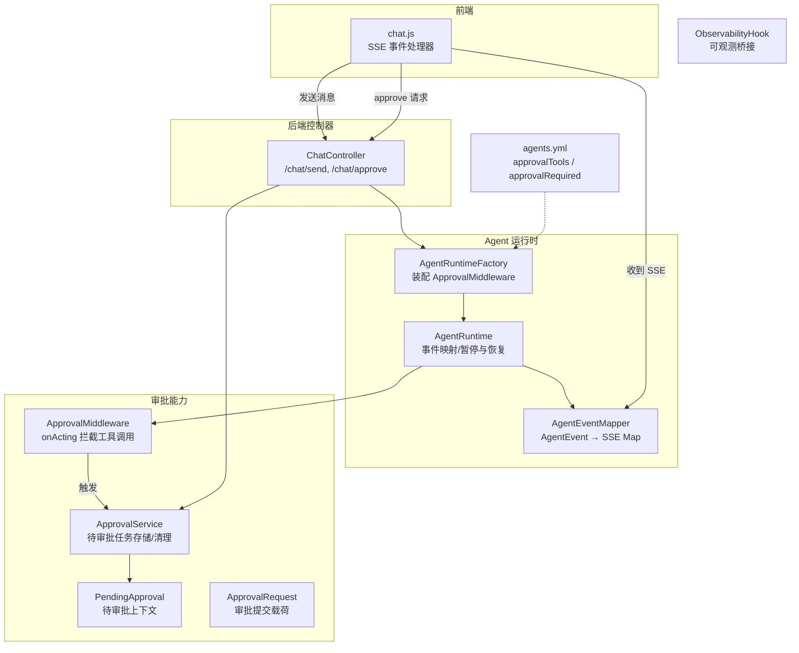
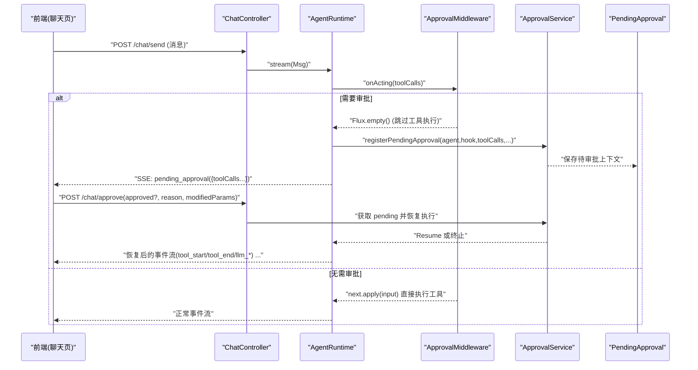
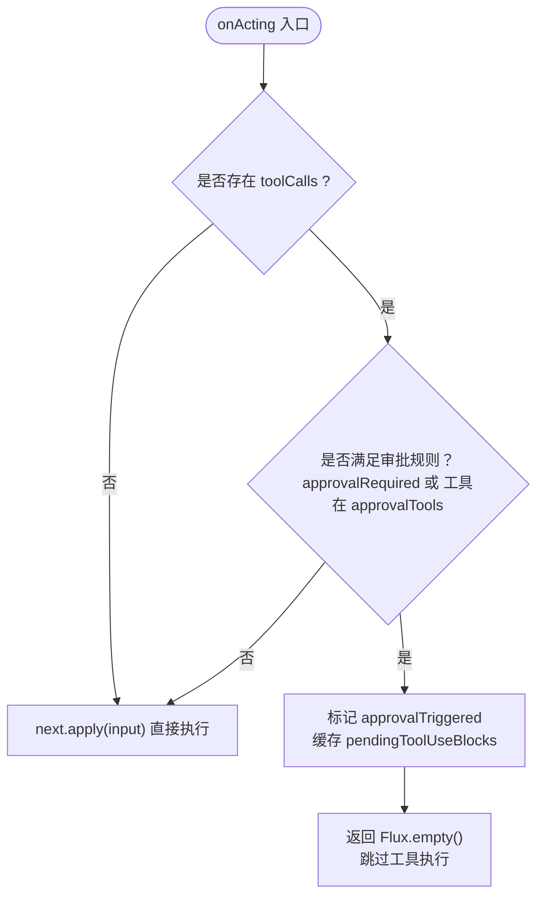
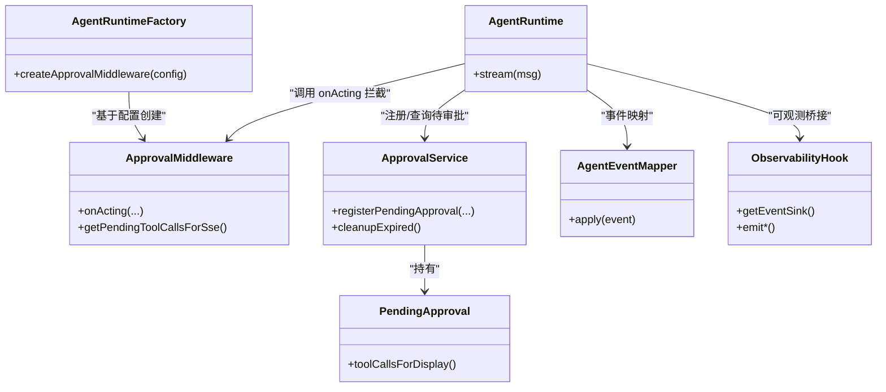

# 审批工作流

<cite>
**本文引用的文件**
- [ApprovalMiddleware.java](file://src/main/java/com/skloda/agentscope/middleware/ApprovalMiddleware.java)
- [ApprovalService.java](file://src/main/java/com/skloda/agentscope/service/ApprovalService.java)
- [PendingApproval.java](file://src/main/java/com/skloda/agentscope/model/PendingApproval.java)
- [ApprovalRequest.java](file://src/main/java/com/skloda/agentscope/model/ApprovalRequest.java)
- [AgentEventMapper.java](file://src/main/java/com/skloda/agentscope/runtime/AgentEventMapper.java)
- [AgentRuntimeFactory.java](file://src/main/java/com/skloda/agentscope/runtime/AgentRuntimeFactory.java)
- [AgentRuntime.java](file://src/main/java/com/skloda/agentscope/runtime/AgentRuntime.java)
- [ObservabilityHook.java](file://src/main/java/com/skloda/agentscope/hook/ObservabilityHook.java)
- [agents.yml](file://src/main/resources/config/agents.yml)
- [ChatController.java](file://src/main/java/com/skloda/agentscope/controller/ChatController.java)
- [chat.js](file://src/main/resources/static/scripts/chat.js)
- [ApprovalMiddlewareTest.java](file://src/test/java/com/skloda/agentscope/middleware/ApprovalMiddlewareTest.java)
- [AgentEventMapperTest.java](file://src/test/java/com/skloda/agentscope/runtime/AgentEventMapperTest.java)
</cite>

## 目录
1. [简介](#简介)
2. [项目结构](#项目结构)
3. [核心组件](#核心组件)
4. [架构总览](#架构总览)
5. [详细组件分析](#详细组件分析)
6. [依赖关系分析](#依赖关系分析)
7. [性能考量](#性能考量)
8. [故障排查指南](#故障排查指南)
9. [结论](#结论)
10. [附录](#附录)

## 简介
本文件聚焦于 AgentScope 2.0 环境下的“人机协作审批工作流”，重点说明：
- ApprovalMiddleware 如何拦截敏感工具调用，实现暂停执行并触发待审批。
- RequireUserConfirmEvent 的处理与未来迁移路径（在框架层完成确认门）。
- 前端如何在会话中展示待审批卡片、渲染工具输入参数，并调用 /chat/approve 完成人类确认或拒绝。
- 审批状态机、待审批任务管理、超时清理策略。
- 工具级与 Agent 级两种审批触发方式及其配置示例。
- 完整流程编排、前端集成要点、以及性能优化建议。

## 项目结构
审批工作流涉及中间件、运行时、服务、模型与前端多个层次：
- 中间件层：拦截工具调用，决定是否暂停。
- 运行层：将暂停点映射为 SSE 事件，并在恢复时重新流转。
- 服务层：注册、查询、过期清理待审批任务。
- 数据模型：封装待审批任务信息与审批请求。
- 控制器层：提供 /chat/send 与 /chat/approve 接口。
- 前端层：处理 require_user_confirm / pending_approval / user_confirm_result 等事件，渲染交互界面。

图表来源
- [AgentRuntimeFactory.java:302-308](file://src/main/java/com/skloda/agentscope/runtime/AgentRuntimeFactory.java#L302-L308)
- [AgentRuntime.java:146-180](file://src/main/java/com/skloda/agentscope/runtime/AgentRuntime.java#L146-L180)
- [AgentEventMapper.java:48-54](file://src/main/java/com/skloda/agentscope/runtime/AgentEventMapper.java#L48-L54)
- [ApprovalMiddleware.java:22-77](file://src/main/java/com/skloda/agentscope/middleware/ApprovalMiddleware.java#L22-L77)
- [ApprovalService.java:17-76](file://src/main/java/com/skloda/agentscope/service/ApprovalService.java#L17-L76)
- [agents.yml:158-168](file://src/main/resources/config/agents.yml#L158-L168)
- [agents.yml:431-441](file://src/main/resources/config/agents.yml#L431-L441)

章节来源
- [AgentRuntimeFactory.java:302-308](file://src/main/java/com/skloda/agentscope/runtime/AgentRuntimeFactory.java#L302-L308)
- [AgentRuntime.java:146-180](file://src/main/java/com/skloda/agentscope/runtime/AgentRuntime.java#L146-L180)
- [ApprovalMiddleware.java:22-77](file://src/main/java/com/skloda/agentscope/middleware/ApprovalMiddleware.java#L22-L77)
- [ApprovalService.java:17-76](file://src/main/java/com/skloda/agentscope/service/ApprovalService.java#L17-L76)
- [agents.yml:158-168](file://src/main/resources/config/agents.yml#L158-L168)
- [agents.yml:431-441](file://src/main/resources/config/agents.yml#L431-L441)

## 核心组件
- ApprovalMiddleware：在 onActing 阶段拦截 toolCalls，当满足 agent-level 或 tool-level 条件时返回空流跳过工具执行，并将本次 toolCalls 以“待审批”形式暴露给上层。
- ApprovalService：基于内存缓存维护 PendingApproval（附带 ReActAgent、ObservabilityHook、toolCalls、时间戳），并提供定时清理过期条目。
- PendingApproval：不可变值对象，承载一次暂停执行的审批上下文，含可显示化的工具调用列表。
- ApprovalRequest：/chat/approve 的请求体，包含 approvalId、approved、reason、modifiedParams、sessionId 等。
- AgentEventMapper：将 AgentScope 的 AgentEvent 转为 SSE JSON；对 REQUIRE_USER_CONFIRM / USER_CONFIRM_RESULT 保留直通，用于未来原生 HITL 流。
- ChatController：对外暴露 /chat/send 与 /chat/approve；处理恢复执行与回写审批结果。
- agents.yml：定义每个 agent 的 approvalRequired 及 approvalTools，决定默认审批策略。
- chat.js：处理 require_user_confirm / user_confirm_result 等事件，展示等待人工确认 UI 并提交审批。

章节来源
- [ApprovalMiddleware.java:42-124](file://src/main/java/com/skloda/agentscope/middleware/ApprovalMiddleware.java#L42-L124)
- [ApprovalService.java:17-76](file://src/main/java/com/skloda/agentscope/service/ApprovalService.java#L17-L76)
- [PendingApproval.java:13-39](file://src/main/java/com/skloda/agentscope/model/PendingApproval.java#L13-L39)
- [ApprovalRequest.java:8-20](file://src/main/java/com/skloda/agentscope/model/ApprovalRequest.java#L8-L20)
- [AgentEventMapper.java:48-54](file://src/main/java/com/skloda/agentscope/runtime/AgentEventMapper.java#L48-L54)
- [AgentEventMapper.java:87-90](file://src/main/java/com/skloda/agentscope/runtime/AgentEventMapper.java#L87-L90)
- [ChatController.java:161-180](file://src/main/java/com/skloda/agentscope/controller/ChatController.java#L161-L180)
- [agents.yml:158-168](file://src/main/resources/config/agents.yml#L158-L168)
- [agents.yml:431-441](file://src/main/resources/config/agents.yml#L431-L441)
- [chat.js:672-701](file://src/main/resources/static/scripts/chat.js#L672-L701)

## 架构总览
审批工作流的典型时序如下：
- 上游发送消息进入 /chat/send，AgentRuntime 启动并串联事件流。
- 中间件 ApprovalMiddleware 在 onActing 处拦截 toolCalls，必要时设置 pendingToolUseBlocks 并返回空流，促使会话暂停。
- AgentRuntime 将暂停信息转换为 SSE 事件（pending_approval + toolCalls），同时通过 ApprovalService.registerPendingApproval 创建待审批记录。
- 前端收到 SSE 后渲染“等待人类确认”卡片；用户点击批准或拒绝，调用 /chat/approve。
- ChatController 读取 pending 上下文，依据 approve/reject 恢复 Agent 执行（或直接结束/失败），最终继续下发后续事件直至完成。
- 异步定时任务周期清理过期的待审批记录，避免内存泄漏。

图表来源
- [AgentRuntime.java:146-180](file://src/main/java/com/skloda/agentscope/runtime/AgentRuntime.java#L146-L180)
- [ApprovalMiddleware.java:59-77](file://src/main/java/com/skloda/agentscope/middleware/ApprovalMiddleware.java#L59-L77)
- [ApprovalService.java:29-46](file://src/main/java/com/skloda/agentscope/service/ApprovalService.java#L29-L46)
- [ChatController.java:161-180](file://src/main/java/com/skloda/agentscope/controller/ChatController.java#L161-L180)

章节来源
- [AgentRuntime.java:146-180](file://src/main/java/com/skloda/agentscope/runtime/AgentRuntime.java#L146-L180)
- [ApprovalMiddleware.java:59-77](file://src/main/java/com/skloda/agentscope/middleware/ApprovalMiddleware.java#L59-L77)
- [ApprovalService.java:29-46](file://src/main/java/com/skloda/agentscope/service/ApprovalService.java#L29-L46)
- [ChatController.java:161-180](file://src/main/java/com/skloda/agentscope/controller/ChatController.java#L161-L180)

## 详细组件分析

### 组件A：ApprovalMiddleware（敏感工具拦截与人机协作）
- 拦截时机：onActing。工具调用列表由 ActingInput.toolCalls 提供，与旧版 PostReasoningEvent 等效。
- 触发条件：
  - Agent 级别：approvalRequired=true。
  - 工具级别：toolCalls.name 在 approvalTools 白名单内。
- 行为分支：
  - 需要审批：置位 approvalTriggered，记录 pendingToolUseBlocks，并返回空流跳过工具执行。
  - 不需要：直接 next.apply 放行。
- 对外暴露：isApprovalTriggered、getPendingToolUseBlocks、getPendingToolCallsForSse，便于运行时构造 SSE 内容与前端展示。

图表来源
- [ApprovalMiddleware.java:59-77](file://src/main/java/com/skloda/agentscope/middleware/ApprovalMiddleware.java#L59-L77)
- [agents.yml:158-168](file://src/main/resources/config/agents.yml#L158-L168)
- [agents.yml:431-441](file://src/main/resources/config/agents.yml#L431-L441)

章节来源
- [ApprovalMiddleware.java:59-77](file://src/main/java/com/skloda/agentscope/middleware/ApprovalMiddleware.java#L59-L77)
- [ApprovalMiddleware.java:103-124](file://src/main/java/com/skloda/agentscope/middleware/ApprovalMiddleware.java#L103-L124)
- [ApprovalMiddlewareTest.java:32-100](file://src/test/java/com/skloda/agentscope/middleware/ApprovalMiddlewareTest.java#L32-L100)

### 组件B：ApprovalService（待审批任务管理与时钟清理）
- 注册待审批：接收 ReActAgent、ObservabilityHook、工具调用集合、agentId、sessionId，生成短 ID 并存入并发 map。
- 查询/删除：按 approvalId 提供查询和删除。
- 超时清理：固定频率扫描，移除超过默认阈值的过期条目（默认5分钟），输出日志计数。

章节来源
- [ApprovalService.java:17-76](file://src/main/java/com/skloda/agentscope/service/ApprovalService.java#L17-L76)
- [PendingApproval.java:13-39](file://src/main/java/com/skloda/agentscope/model/PendingApproval.java#L13-L39)

### 组件C：AgentEventMapper（RequireUserConfirmEvent 与 confirm 结果映射）
- 作用：将框架事件转换为 SSE payload。对 REQUIRE_USER_CONFIRM 和 USER_CONFIRM_RESULT 进行直通映射，便于前后端契约稳定和未来原生 HITL 流激活。
- 现状：当前活跃审批通道走 ApprovalMiddleware→pending_approval 路径；REQUIRE_USER_CONFIRM 作为占位通路保留。

章节来源
- [AgentEventMapper.java:48-54](file://src/main/java/com/skloda/agentscope/runtime/AgentEventMapper.java#L48-L54)
- [AgentEventMapper.java:87-90](file://src/main/java/com/skloda/agentscope/runtime/AgentEventMapper.java#L87-L90)
- [AgentEventMapperTest.java:237-267](file://src/test/java/com/skloda/agentscope/runtime/AgentEventMapperTest.java#L237-L267)

### 组件D：控制器与 API（/chat/send 与 /chat/approve）
- /chat/send：开启 Agent 流式事件，内部使用 AgentRuntimeFactory 装配 ApprovalMiddleware，遇到审批则挂起并推送 pending_approval。
- /chat/approve：根据 approvalId 定位 PendingApproval，若批准则将 null 消息注入以恢复工具执行；若拒绝则中断/终止相应分支，并最终回到事件流。

章节来源
- [AgentRuntimeFactory.java:302-308](file://src/main/java/com/skloda/agentscope/runtime/AgentRuntimeFactory.java#L302-L308)
- [AgentRuntime.java:146-180](file://src/main/java/com/skloda/agentscope/runtime/AgentRuntime.java#L146-L180)
- [ChatController.java:161-180](file://src/main/java/com/skloda/agentscope/controller/ChatController.java#L161-L180)

### 组件E：前端集成（require_user_confirm / user_confirm_result 与审批卡片）
- 事件接收：chat.js 处理 require_user_confirm、user_confirm_result、external_execution_result 等事件类型，渲染到时间线。
- 交互界面：当收到 pending_approval，构建审批卡片，展示工具名称、参数预览与操作按钮；提交到 /chat/approve 携带 approved、reason、modifiedParams 等字段。

章节来源
- [chat.js:672-701](file://src/main/resources/static/scripts/chat.js#L672-L701)
- [chat.js:818-998](file://src/main/resources/static/scripts/chat.js#L818-L998)
- [chat.js:1062-1070](file://src/main/resources/static/scripts/chat.js#L1062-L1070)

## 依赖关系分析
- AgentRuntimeFactory 负责从 agents.yml 中解析 AgentConfig，并基于其 approvalRequired 与 approvalTools 创建对应的 ApprovalMiddleware 实例。
- AgentRuntime 在事件流处理中借助 ApprovalMiddleware 的能力判断是否需要暂停，并通过 ApprovalService 注册待审批上下文。
- ApprovalService 通过 @Scheduled 任务维持内存中待审批条目的生命周期。
- AgentEventMapper 保证事件到前端的契约稳定性（包括未来 HITL 相关事件的映射）。
- ObservabilityHook 作为可观测性桥接，供运行层注入事件或诊断。

图表来源
- [AgentRuntimeFactory.java:302-308](file://src/main/java/com/skloda/agentscope/runtime/AgentRuntimeFactory.java#L302-L308)
- [AgentRuntime.java:146-180](file://src/main/java/com/skloda/agentscope/runtime/AgentRuntime.java#L146-L180)
- [ApprovalMiddleware.java:59-124](file://src/main/java/com/skloda/agentscope/middleware/ApprovalMiddleware.java#L59-L124)
- [ApprovalService.java:29-76](file://src/main/java/com/skloda/agentscope/service/ApprovalService.java#L29-L76)
- [PendingApproval.java:28-39](file://src/main/java/com/skloda/agentscope/model/PendingApproval.java#L28-L39)
- [AgentEventMapper.java:64-105](file://src/main/java/com/skloda/agentscope/runtime/AgentEventMapper.java#L64-L105)
- [ObservabilityHook.java:16-67](file://src/main/java/com/skloda/agentscope/hook/ObservabilityHook.java#L16-L67)

## 性能考量
- 拦截开销最小化：仅在 onActing 时对 toolCalls 做轻量匹配（Set 查找），避免重复计算。
- 内存限制：PendingApproval 仅临时持有 Agent 引用与工具调用描述，配合定时清理策略防止累积。
- 流式传播：通过 Reactor 的 Flux.empty 快速短路，减少无效下游计算。
- 调度周期：清理间隔与过期阈值可按业务负载调优（当前默认5分钟过期，每分钟扫描）。
- 扩展点：未来若开启框架原生 REQUIRE_USER_CONFIRM，应评估与中间件的竞争策略与事件合并成本。

章节来源
- [ApprovalService.java:59-76](file://src/main/java/com/skloda/agentscope/service/ApprovalService.java#L59-L76)
- [ApprovalMiddleware.java:59-77](file://src/main/java/com/skloda/agentscope/middleware/ApprovalMiddleware.java#L59-L77)
- [AgentEventMapper.java:64-105](file://src/main/java/com/skloda/agentscope/runtime/AgentEventMapper.java#L64-L105)

## 故障排查指南
- 现象：未出现“等待确认”卡片
  - 检查 Agent 配置是否设置 approvalRequired 或在 approvalTools 中包含目标工具。
  - 确认 AppRuntime 已装配 ApprovalMiddleware（工厂会根据配置启用）。
- 现象：批准后仍不执行工具
  - 确认 /chat/approve 已成功提交（approvalId 正确）。
  - 观察代理侧日志，检查恢复逻辑是否命中、是否有异常吞没。
- 现象：待审批任务堆积
  - 校验清理任务是否正常运行，查看过期阈值与调度频率。
  - 关注会话关闭或异常路径是否及时释放引用。
- 现象：前端无法渲染参数
  - 检查 getPendingToolCallsForSse 的输出格式是否符合 chat.js 的预期。

章节来源
- [agents.yml:158-168](file://src/main/resources/config/agents.yml#L158-L168)
- [agents.yml:431-441](file://src/main/resources/config/agents.yml#L431-L441)
- [AgentRuntimeFactory.java:302-308](file://src/main/java/com/skloda/agentscope/runtime/AgentRuntimeFactory.java#L302-L308)
- [ApprovalService.java:59-76](file://src/main/java/com/skloda/agentscope/service/ApprovalService.java#L59-L76)
- [chat.js:818-998](file://src/main/resources/static/scripts/chat.js#L818-L998)

## 结论
该审批工作流以 ApprovalMiddleware 为核心阻断点，配合 ApprovalService 的短期记忆与时钟清理，提供了高可控的人机协作闭环。工具级与 Agent 级两层触发机制，既满足精细化授权，也支持一键全量开启。未来可向框架原生 REQUIRE_USER_CONFIRM 无缝迁移，保持前后端事件契约稳定。生产部署建议结合业务规模调整超时与清理周期，并对关键错误路径加入可观测度量。

[无章节来源]

## 附录

### 配置示例：工具级与 Agent 级审批
- 工具级：在 agents.yml 中为特定 Agent 设置 approvalTools 为目标工具名，例如发票生成或合同审查类工具。
- Agent 级：将该 Agent 的 approvalRequired 设为 true，使其所有工具调用均需人工审批。
- 注意：不同 Agent 可独立配置，从而实现细粒度的审批策略组合。

章节来源
- [agents.yml:158-168](file://src/main/resources/config/agents.yml#L158-L168)
- [agents.yml:431-441](file://src/main/resources/config/agents.yml#L431-L441)

### 前端集成最佳实践
- 事件处理：统一处理 require_user_confirm、user_confirm_result 等类型，用于时间线展示。
- 交互设计：对 pending_approval 渲染工具名称、参数概览和操作区；允许修改部分参数后提交。
- 错误反馈：对网络异常、API 失败、approvalId 不存在等情况给出明确提示并重试或终止会话。

章节来源
- [chat.js:672-701](file://src/main/resources/static/scripts/chat.js#L672-L701)
- [chat.js:818-998](file://src/main/resources/static/scripts/chat.js#L818-L998)

### 性能优化建议清单
- 批量聚合：在同一批次中出现的多个工具调用可合并展示，降低前端渲染压力。
- 参数裁剪：仅展示关键摘要参数，复杂参数提供折叠展开。
- 懒加载：按需加载大对象预览，避免阻塞主线程。
- 服务端压缩：合理压缩 SSE payload，减少带宽占用。
- 监控指标：记录审批率、平均耗时、超时比率等，持续优化体验。

[无章节来源]