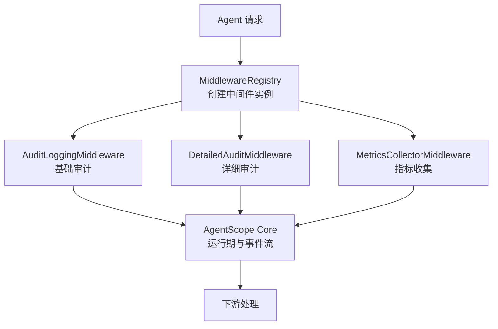
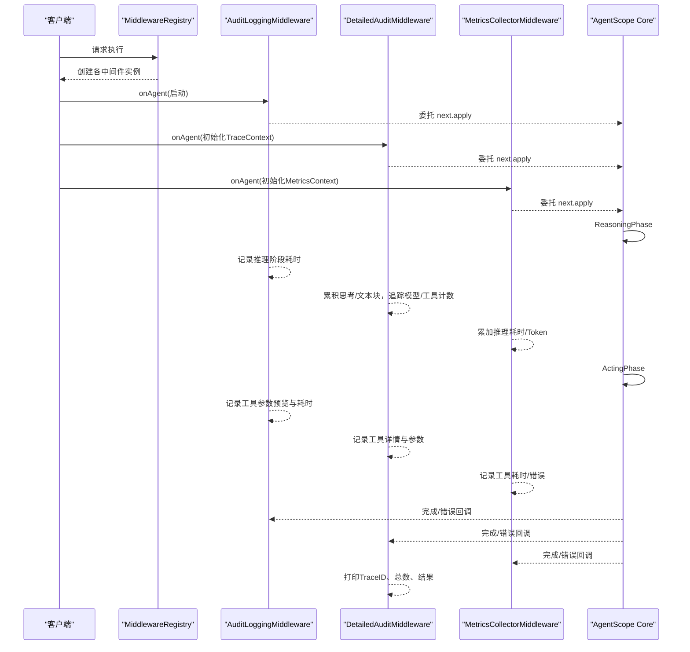
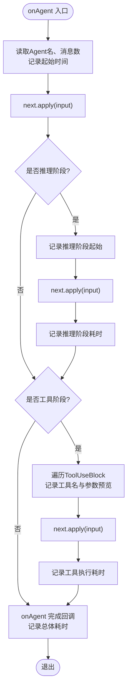
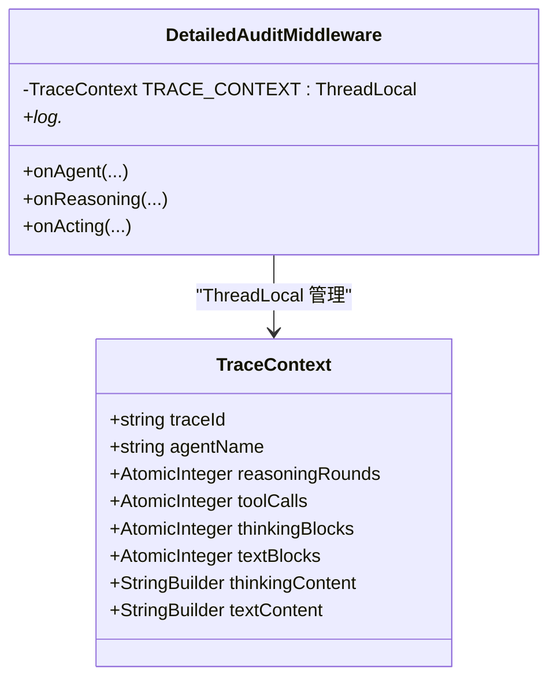
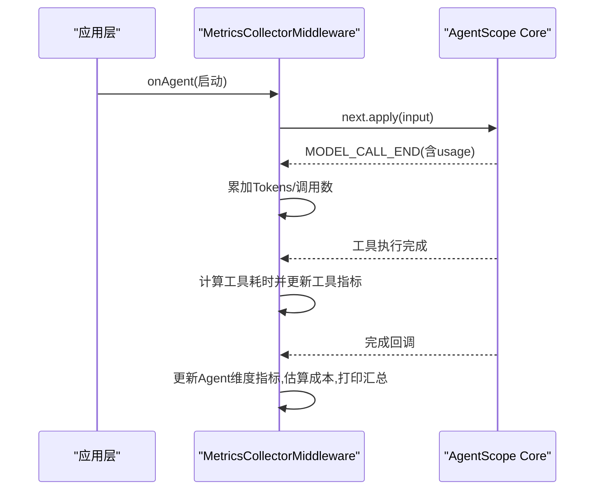
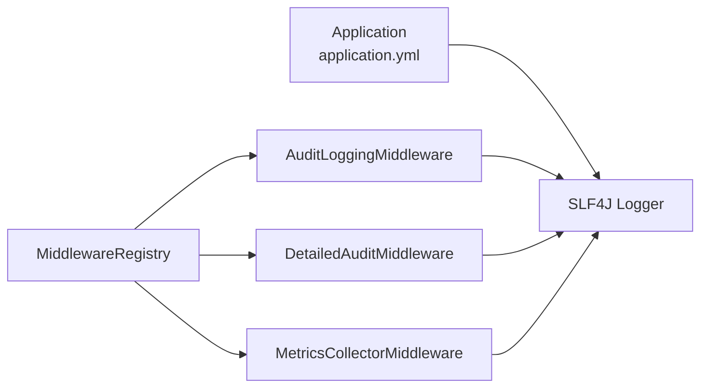

# 审计日志

<cite>
**本文引用的文件**
- [AuditLoggingMiddleware.java](file://src/main/java/com/skloda/agentscope/middleware/AuditLoggingMiddleware.java)
- [DetailedAuditMiddleware.java](file://src/main/java/com/skloda/agentscope/middleware/DetailedAuditMiddleware.java)
- [MetricsCollectorMiddleware.java](file://src/main/java/com/skloda/agentscope/middleware/MetricsCollectorMiddleware.java)
- [MiddlewareRegistry.java](file://src/main/java/com/skloda/agentscope/middleware/MiddlewareRegistry.java)
- [application.yml](file://src/main/resources/application.yml)
</cite>

## 目录
1. [引言](#引言)
2. [项目结构](#项目结构)
3. [核心组件](#核心组件)
4. [架构总览](#架构总览)
5. [详细组件分析](#详细组件分析)
6. [依赖关系分析](#依赖关系分析)
7. [性能考量](#性能考量)
8. [故障排查指南](#故障排查指南)
9. [结论](#结论)
10. [附录](#附录)

## 引言
本技术文档围绕审计日志体系展开，聚焦两类中间件：基础审计日志与高级可观测审计。目标是帮助您理解并运用：
- AuditLoggingMiddleware：对 Agent 生命周期、推理阶段、工具调用进行轻量审计；
- DetailedAuditMiddleware：提供更丰富的结构化上下文（跟踪 ID）、事件捕获、推理与输出块聚合及错误堆栈记录；
- MetricsCollectorMiddleware：作为辅助，收集工具与模型调用的性能指标与成本估算；
- MiddlewareRegistry：注册与提供中间件实例的统一入口。

同时涵盖日志格式、字段语义、聚合方案建议，以及生产配置最佳实践与查询示例，帮助您快速落地与优化。

[无具体代码引用]

## 项目结构
审计日志以“中间件”形式嵌入 AgentScope 的执行链路中，通过统一的注册表注入到代理执行链，无需侵入业务逻辑。核心组织如下：
- 中间件实现：位于 middleware 包内，分别负责基础审计、深度审计、指标采集。
- 注册表：在 MiddlewareRegistry 中以名称-工厂映射集中管理，便于扩展和按场景启用。
- 应用配置：logging.level 开启对应日志级别与 METRICS 分类日志，便于调试与导出。

图示来源
- [MiddlewareRegistry.java:23-55](file://src/main/java/com/skloda/agentscope/middleware/MiddlewareRegistry.java#L23-L55)

本节来源
- [MiddlewareRegistry.java:23-55](file://src/main/java/com/skloda/agentscope/middleware/MiddlewareRegistry.java#L23-L55)

## 核心组件
- AuditLoggingMiddleware：在 onAgent、onReasoning、onActing 三个关键生命周期埋点，记录开始时间、输入规模、完成耗时、工具调用参数预览、错误信息。
- DetailedAuditMiddleware：维护 ThreadLocal 跟踪上下文 TraceContext，统一生成 traceId，捕获完整执行链路，聚合推理与输出块片段，统计工具调用与思考轮次，输出成功/失败摘要。
- MetricsCollectorMiddleware：聚合全局与逐工具/代理的性能与 token 统计，估算成本，并在完成时打印汇总。
- MiddlewareRegistry：集中注册“基础审计”“详细审计”“指标收集”等内置中间件，并提供 create(name) 获取实例。

本节来源
- [AuditLoggingMiddleware.java:15-68](file://src/main/java/com/skloda/agentscope/middleware/AuditLoggingMiddleware.java#L15-L68)
- [DetailedAuditMiddleware.java:38-108](file://src/main/java/com/skloda/agentscope/middleware/DetailedAuditMiddleware.java#L38-L108)
- [MetricsCollectorMiddleware.java:31-162](file://src/main/java/com/skloda/agentscope/middleware/MetricsCollectorMiddleware.java#L31-L162)
- [MiddlewareRegistry.java:23-55](file://src/main/java/com/skloda/agentscope/middleware/MiddlewareRegistry.java#L23-L55)

## 架构总览
下图展示了基于中间件的审计体系在典型会话中的时序与职责分工，从进入 Agent 执行，到推理与工具调用，再到结束汇总。

图示来源
- [AuditLoggingMiddleware.java:19-67](file://src/main/java/com/skloda/agentscope/middleware/AuditLoggingMiddleware.java#L19-L67)
- [DetailedAuditMiddleware.java:45-179](file://src/main/java/com/skloda/agentscope/middleware/DetailedAuditMiddleware.java#L45-L179)
- [MetricsCollectorMiddleware.java:50-162](file://src/main/java/com/skloda/agentscope/middleware/MetricsCollectorMiddleware.java#L50-L162)

## 详细组件分析

### 组件一：AuditLoggingMiddleware（基础审计）
职责
- 记录每个 Agent 的启动与结束时间，计算整体耗时；
- 记录 Reasoning 阶段的起止与耗时；
- 遍历工具调用块，输出工具名与参数预览；
- 统一错误日志输出。

关键点
- 使用 System.nanoTime() 计量耗时；
- 工具参数过长的情况下做截断避免刷屏；
- 使用标准日志器输出，便于接入外部日志系统。

图示来源
- [AuditLoggingMiddleware.java:19-67](file://src/main/java/com/skloda/agentscope/middleware/AuditLoggingMiddleware.java#L19-L67)

本节来源
- [AuditLoggingMiddleware.java:15-68](file://src/main/java/com/skloda/agentscope/middleware/AuditLoggingMiddleware.java#L15-L68)

### 组件二：DetailedAuditMiddleware（详细审计）
职责
- 为每次执行生成唯一 traceId，绑定线程上下文 TraceContext；
- 捕获输入消息摘要、工具调用次数、思考块数量、输出块数量；
- 流式聚合 Thinking/Text 的增量事件，截断过长内容后输出；
- 在完成或错误时汇总耗时、成功状态与错误堆栈；
- 在 Reasoning 阶段附加模型信息、可用工具数量、输入消息计数。

内部结构
- TraceContext 包含：traceId、agentName、reasoningRounds、toolCalls、thinkingBlocks、textBlocks、thinkingContent、textContent 等聚合字段，用于跨事件统计与拼接。

图示来源
- [DetailedAuditMiddleware.java:38-108](file://src/main/java/com/skloda/agentscope/middleware/DetailedAuditMiddleware.java#L38-L108)
- [DetailedAuditMiddleware.java:110-179](file://src/main/java/com/skloda/agentscope/middleware/DetailedAuditMiddleware.java#L110-L179)

本节来源
- [DetailedAuditMiddleware.java:28-179](file://src/main/java/com/skloda/agentscope/middleware/DetailedAuditMiddleware.java#L28-L179)

### 组件三：MetricsCollectorMiddleware（性能指标）
职责
- 按 Agent 维度记录调用次数、总耗时、最小/最大耗时；
- 按 Tool 维度记录调用次数、总耗时、最小/最大耗时、错误次数；
- 捕获 Model 调用的 token 用量，累计全局 Token 数；
- 估算成本并输出汇总。

要点
- 使用 ThreadLocal<MetricsContext> 保存单次执行的临时指标；
- 使用静态并发容器记录全局与维度级指标；
- 在 ModelCallEnd 事件中读取 token 用量并累加。

图示来源
- [MetricsCollectorMiddleware.java:50-162](file://src/main/java/com/skloda/agentscope/middleware/MetricsCollectorMiddleware.java#L50-L162)

本节来源
- [MetricsCollectorMiddleware.java:21-200](file://src/main/java/com/skloda/agentscope/middleware/MetricsCollectorMiddleware.java#L21-L200)

### 组件四：MiddlewareRegistry（注册与创建）
职责
- 集中注册内置中间件，包括基础审计、详细审计、指标收集、限流、上下文增强、OpenTelemetry 追踪等；
- 提供 create(name) 根据名称创建实例，便于按需装配。

本节来源
- [MiddlewareRegistry.java:12-55](file://src/main/java/com/skloda/agentscope/middleware/MiddlewareRegistry.java#L12-L55)

## 依赖关系分析
- 中间件均实现统一的 MiddlewareBase 接口并采用 Reactor Flux 异步事件流风格；
- 详细审计使用 ThreadLocal 维护一次请求的上下文，避免跨线程污染；
- 指标收集依赖全局原子变量与并发 Map 做轻量聚合；
- 日志全部基于 SLF4J，可在应用层面通过 logging 配置进行过滤与输出策略调整。

图示来源
- [application.yml:81-90](file://src/main/resources/application.yml#L81-L90)
- [MiddlewareRegistry.java:23-55](file://src/main/java/com/skloda/agentscope/middleware/MiddlewareRegistry.java#L23-L55)

本节来源
- [application.yml:81-90](file://src/main/resources/application.yml#L81-L90)
- [MiddlewareRegistry.java:23-55](file://src/main/java/com/skloda/agentscope/middleware/MiddlewareRegistry.java#L23-L55)

## 性能考量
- 采样与裁剪：工具参数与长文本已默认截断，减少 I/O 与日志大小；在生产环境可按需关闭或进一步限制粒度。
- 锁与并发：指标统计使用 ConcurrentHashMap 与 AtomicLong，适合高并发读写的轻量场景；对于极高吞吐，建议结合外部监控与指标导出。
- I/O 影响：频繁写入日志会产生 IO 开销，可通过异步 logger（例如 Logback Async Appender）降低延迟。
- GC 压力：详细审计中 StringBuilder 用于聚合增量文本，注意在长时间推理过程中可能增长较大，应做好截断策略。

[本节为通用指导，不直接分析特定文件]

## 故障排查指南
常见定位思路
- 未输出日志：检查 logging.level 是否为 INFO，必要时提升至 DEBUG；确认注册的中间件是否被正确创建。
- 缺少 traceId：确认开启了 DetailedAuditMiddleware 并使用同一请求上下文。
- 工具参数过大导致日志膨胀：确认已启用参数预览截取，或在日志输出端侧进行大小限制。
- 指标缺失：确保下游事件链中包含 MODEL_CALL_END 且包含 usage 信息。

定位建议
- 搜索 "[audit]" 与 "[DETAILED-AUDIT]" 标签关键字，按时间区间筛选；
- 使用 traceId 串联单次请求全链路；
- 通过 "METRICS" 分类日志查看性能聚合。

本节来源
- [application.yml:81-90](file://src/main/resources/application.yml#L81-L90)

## 结论
本审计日志体系以中间件形式解耦于业务逻辑，具备以下优势：
- 低侵入：通过注册表统一装配，无需修改核心流程；
- 可组合：基础审计、详细审计、指标收集可按需叠加；
- 可观测：统一日志格式与 trace 机制，利于聚合分析与问题回溯；
- 可扩展：易于新增审计维度（如权限、合规）而不影响现有链路。

建议在上线前结合业务特点选择合适的中间件组合与日志级别，并在存储后端启用合适的滚动归档与保留策略。

[本节总结性内容，不直接分析特定文件]

## 附录

### 日志格式规范与字段说明
- 基础审计（AuditLoggingMiddleware）
  - Agent 生命周期：开始时间、输入消息数、完成耗时；
  - 推理阶段：开始与耗时；
  - 工具阶段：工具名、参数预览（截断）、执行耗时；
  - 错误：异常信息与错误码占位。

- 详细审计（DetailedAuditMiddleware）
  - 每次执行唯一 traceId；
  - 推理轮次、工具调用次数、思考/输出块计数；
  - 推理与输出的分段增量内容（截断预览）；
  - 结束时打印成功标志与耗时；错误时附带堆栈。

- 指标（MetricsCollectorMiddleware）
  - Agent 维度：调用次数、平均/最小/最大耗时、Token 总量、预估成本；
  - Tool 维度：调用次数、平均/最小/最大耗时、错误次数；
  - 全局：总调用数、总 Token、错误数、预估成本。

本节来源
- [AuditLoggingMiddleware.java:19-67](file://src/main/java/com/skloda/agentscope/middleware/AuditLoggingMiddleware.java#L19-L67)
- [DetailedAuditMiddleware.java:45-179](file://src/main/java/com/skloda/agentscope/middleware/DetailedAuditMiddleware.java#L45-L179)
- [MetricsCollectorMiddleware.java:50-162](file://src/main/java/com/skloda/agentscope/middleware/MetricsCollectorMiddleware.java#L50-L162)

### 生产配置最佳实践
- 日志级别
  - 根日志级别：INFO；
  - io.agentscope：INFO（可根据需要调整为 DEBUG 以获取更多诊断信息）；
  - com.msxf.agentscope：INFO；
  - METRICS：INFO（或 WARN 以减少噪音）。

- 输出模式
  - 推荐将控制台输出替换为异步 appender；
  - 使用结构化日志（JSON）便于导入 ELK/Loki/Prometheus 生态；
  - 建议按模块分文件输出（audit、metrics 等），便于检索。

- 中间件开关
  - 通过 MiddlewareRegistry 按需启用 detailed-audit、metrics-collector 等；
  - 在灰度发布期间可先仅开启基础审计，稳定后再启用详细审计。

本节来源
- [application.yml:81-90](file://src/main/resources/application.yml#L81-L90)
- [MiddlewareRegistry.java:23-55](file://src/main/java/com/skloda/agentscope/middleware/MiddlewareRegistry.java#L23-L55)

### 存储与索引建议
- 日志平台
  - 本地 ES：单节点/小集群即可支撑中等流量；大流量建议使用托管服务或数据湖（对象存储+索引引擎）；
  - Loki+Promtail：适合云原生环境，低成本高效检索；
  - ClickHouse：适合大规模指标与事件聚合分析。

- 索引策略
  - 主键/关联键：trace_id、agent_name、session_id（如有）；
  - 过滤字段：level、logger、phase（AGENT/REASONING/ACTING）、status（SUCCESS/ERROR）；
  - 保留策略：基础审计 30 天，详细审计 7-14 天（可压缩存储），指标指标永久或更长；
  - 数据裁剪：生产环境下可对超长字段（如参数/文本）强制上限或使用脱敏策略。

[本节为通用建议，不直接分析特定文件]

### 日志查询与分析示例
- 检索某次调用的完整链路
  - 条件：trace_id = "xxxxxx"
  - 排序：时间顺序
  - 目标：定位推理、工具、输出与异常片段

- 查找耗时异常的 Agent
  - 条件：tag="[audit]" AND 耗时 > 阈值
  - 维度：按 agent_name 分组，查看 Top N

- 工具调用热点与错误率
  - 条件：tag="[audit]" OR logger="METRICS"
  - 维度：按 tool_name 分组，查看调用频次、平均耗时、错误占比

- 模型 Token 与成本估算趋势
  - 条件：logger="METRICS"
  - 维度：按时间窗口聚合 token 总量与估算成本

[示例查询语法因平台而异，请根据实际日志平台调整]