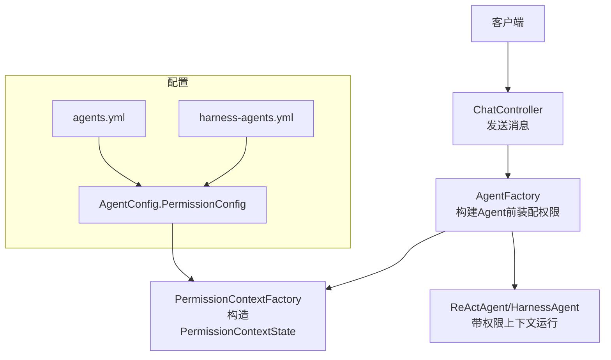
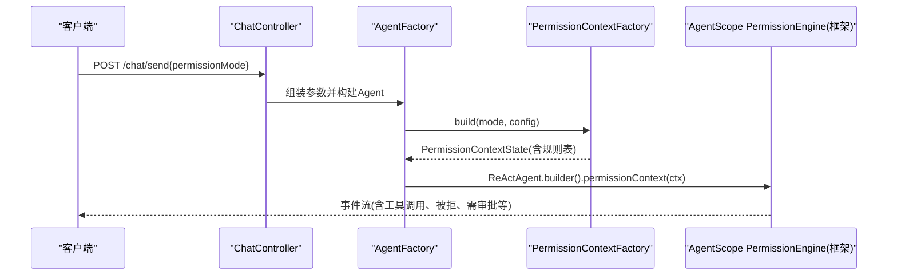
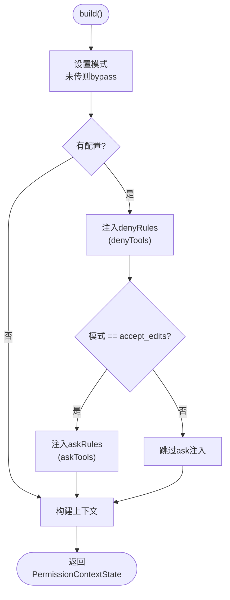
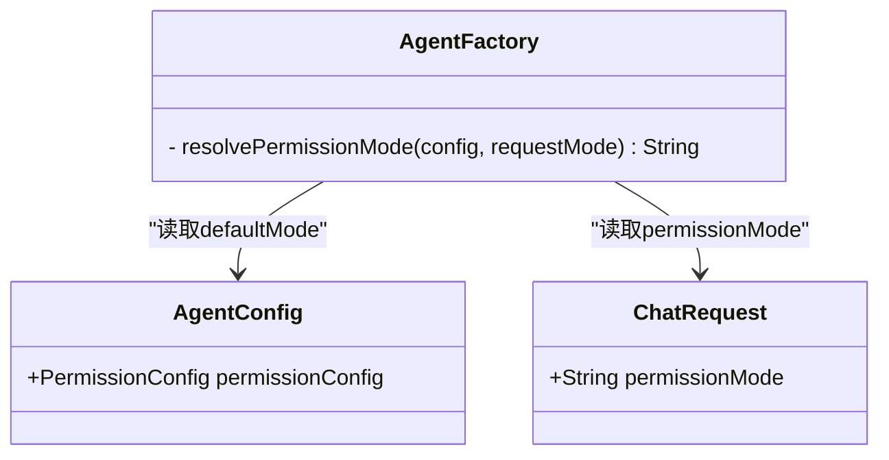
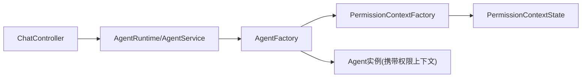

# 权限控制

<cite>
**本文档引用的文件**
- [PermissionContextFactory.java](file://src/main/java/com/skloda/agentscope/permission/PermissionContextFactory.java)
- [AgentConfig.java](file://src/main/java/com/skloda/agentscope/agent/AgentConfig.java)
- [ChatRequest.java](file://src/main/java/com/skloda/agentscope/model/ChatRequest.java)
- [ChatController.java](file://src/main/java/com/skloda/agentscope/controller/ChatController.java)
- [AgentFactory.java](file://src/main/java/com/skloda/agentscope/agent/AgentFactory.java)
- [harness-agents.yml](file://src/main/resources/config/harness-agents.yml)
- [agents.yml](file://src/main/resources/config/agents.yml)
- [PermissionContextFactoryTest.java](file://src/test/java/com/skloda/agentscope/permission/PermissionContextFactoryTest.java)
</cite>

## 目录
1. [引言](#引言)
2. [项目结构与权限入口](#项目结构与权限入口)
3. [核心组件](#核心组件)
4. [架构总览](#架构总览)
5. [详细组件分析](#详细组件分析)
6. [依赖关系与耦合分析](#依赖关系与耦合分析)
7. [性能与可伸缩性](#性能与可伸缩性)
8. [故障排查指南](#故障排查指南)
9. [结论](#结论)
10. [附录：规则与策略矩阵](#附录：规则与策略矩阵)

## 引言
本技术文档围绕 AgentScope 2.0 的权限子系统，聚焦 PermissionContextFactory 的权限上下文构建机制、PermissionMode 模式切换、工具访问控制策略以及 denyTools/askTools 的动态注入方式。文档同时提供企业级权限设计模式、RBAC 集成思路与多级授权最佳实践，并给出安全加固建议与常见问题防护方案。

## 项目结构与权限入口
- 请求入口：ChatController 接收 /chat/send 请求，将 ChatRequest.permissionMode 向下传递至 AgentService/AgentRuntime。
- 权限装配：AgentFactory 在构建 Agent 时解析有效权限模式（请求优先于配置默认值），调用 PermissionContextFactory 生成 PermissionContextState。
- 权限配置：AgentConfig.PermissionConfig 包含 defaultMode、denyTools、askTools；YAML 配置文件为各 Agent 声明该权限集。
- 运行时生效：PermissionContextState 注入 ReActAgent/HarnessAgent，由框架内 PermissionEngine 进行决策执行。

**图表来源**
- [ChatController.java:138-146](file://src/main/java/com/skloda/agentscope/controller/ChatController.java#L138-L146)
- [AgentFactory.java:270-283](file://src/main/java/com/skloda/agentscope/agent/AgentFactory.java#L270-L283)
- [PermissionContextFactory.java:12-24](file://src/main/java/com/skloda/agentscope/permission/PermissionContextFactory.java#L12-L24)
- [AgentConfig.java:100-106](file://src/main/java/com/skloda/agentscope/agent/AgentConfig.java#L100-L106)
- [agents.yml:1802-1805](file://src/main/resources/config/agents.yml#L1802-L1805)
- [harness-agents.yml:17-29](file://src/main/resources/config/harness-agents.yml#L17-L29)

**章节来源**
- [ChatController.java:138-146](file://src/main/java/com/skloda/agentscope/controller/ChatController.java#L138-L146)
- [AgentFactory.java:270-283](file://src/main/java/com/skloda/agentscope/agent/AgentFactory.java#L270-L283)
- [PermissionContextFactory.java:12-24](file://src/main/java/com/skloda/agentscope/permission/PermissionContextFactory.java#L12-L24)
- [AgentConfig.java:100-106](file://src/main/java/com/skloda/agentscope/agent/AgentConfig.java#L100-L106)
- [agents.yml:1802-1805](file://src/main/resources/config/agents.yml#L1802-L1805)
- [harness-agents.yml:17-29](file://src/main/resources/config/harness-agents.yml#L17-L29)

## 核心组件
- PermissionContextFactory：负责从模式字符串与 AgentConfig.PermissionConfig 构建 PermissionContextState，统一应用 denyRules 与 askRules。
- AgentConfig.PermissionConfig：静态定义 defaultMode、denyTools、askTools，支持按 Agent 维度定制权限。
- ChatRequest：请求体携带 permissionMode，可在会话层临时覆盖代理默认权限策略。
- AgentFactory：合并“请求传入 > 配置默认”的有效模式，并在 Agent 构建过程中插入权限上下文。

关键行为要点
- denyTools：无条件生效（拒绝最高优先级），与当前权限模式无关。
- askTools：仅在 accept_edits 模式下应用为 ASK 规则，触发审批/确认流程（若集成 HITL）。
- 默认模式：当请求未指定时回退到 agent 配置 defaultMode。

**章节来源**
- [PermissionContextFactory.java:12-38](file://src/main/java/com/skloda/agentscope/permission/PermissionContextFactory.java#L12-L38)
- [AgentConfig.java:100-106](file://src/main/java/com/skloda/agentscope/agent/AgentConfig.java#L100-L106)
- [ChatRequest.java:34-39](file://src/main/java/com/skloda/agentscope/model/ChatRequest.java#L34-L39)
- [AgentFactory.java:270-283](file://src/main/java/com/skloda/agentscope/agent/AgentFactory.java#L270-L283)

## 架构总览
权限决策在 AgentScope 引擎侧由 PermissionEngine 执行（不在当前仓库实现内），其评估顺序通常为：deny 规则最高 -> ask 规则 -> 工具自检 -> allow 规则 -> BYPASS 回退 -> 默认 ASK（或 DONT_ASK 下的 DENY）。仓库内通过 PermissionContextFactory 将“模式 + 规则表”注入上下文，交由框架引擎裁决。

**图表来源**
- [ChatController.java:138-146](file://src/main/java/com/skloda/agentscope/controller/ChatController.java#L138-L146)
- [AgentFactory.java:270-283](file://src/main/java/com/skloda/agentscope/agent/AgentFactory.java#L270-L283)
- [PermissionContextFactory.java:12-24](file://src/main/java/com/skloda/agentscope/permission/PermissionContextFactory.java#L12-L24)

## 详细组件分析

### PermissionContextFactory 权限上下文构建
- 职责：以 mode + AgentConfig.PermissionConfig 为输入，产出带有 deny/ask/allow 规则的 PermissionContextState。
- 模式映射：通过 string → enum 的方式设置当前权限模式；未传时默认 bypass。
- denyTools：循环注入 addDenyRule，无论何种模式都生效（防御性最高）。
- askTools：仅在 accept_edits 时注入 addAskRule，用于需要人工确认的工具集合。

**图表来源**
- [PermissionContextFactory.java:12-38](file://src/main/java/com/skloda/agentscope/permission/PermissionContextFactory.java#L12-L38)

**章节来源**
- [PermissionContextFactory.java:12-38](file://src/main/java/com/skloda/agentscope/permission/PermissionContextFactory.java#L12-L38)
- [PermissionContextFactoryTest.java:16-57](file://src/test/java/com/skloda/agentscope/permission/PermissionContextFactoryTest.java#L16-L57)

### 模式切换（PermissionMode）
- 支持的语义模式：DEFAULT、BYPASS、EXPLORE、ACCEPT_EDITS、DONT_ASK（由框架提供）。
- 本实现中常用：BYPASS（放行）、EXPLORE（只读/限制写）、ACCEPT_EDITS（读写+危险操作审批）。
- 选择策略：优先使用请求中的 permissionMode，否则读取 AgentConfig.PermissionConfig.defaultMode，再交给框架决定默认行为。

**图表来源**
- [AgentFactory.java:270-283](file://src/main/java/com/skloda/agentscope/agent/AgentFactory.java#L270-L283)
- [AgentConfig.java:100-106](file://src/main/java/com/skloda/agentscope/agent/AgentConfig.java#L100-L106)
- [ChatRequest.java:34-39](file://src/main/java/com/skloda/agentscope/model/ChatRequest.java#L34-L39)

**章节来源**
- [AgentFactory.java:270-283](file://src/main/java/com/skloda/agentscope/agent/AgentFactory.java#L270-L283)
- [ChatRequest.java:34-39](file://src/main/java/com/skloda/agentscope/model/ChatRequest.java#L34-L39)

### Deny / Ask / Accept 三种行为
- Deny：高优拒绝，任何模式都会阻止对特定工具的调用。适用于高危/敏感能力（如 shell、删除、下载等）。
- Ask：在 ACCEPT_EDITS 模式下启用，工具调用需审批后继续（可与 HITL 流程集成）。
- Accept：在 BYPASS 下直接放行；在 EXPLORE 下通常允许只读工具；在 ACCEPT_EDITS 下按规则放行或被 Ask。

工程化落地
- denyTools：在任意模式下生效，通过 PermissionContextFactory 转换为 denyRules。
- askTools：在 ACCEPT_EDITS 模式下生效，通过 PermissionContextFactory 转换为 askRules。
- 默认放行：当没有匹配规则且处于 BYPASS 模式时，默认放行（框架侧）。

示例校验
- 单元测试覆盖了 bypass/explore/accept_edits 模式与 deny/ask 规则注入的正确性与边界情况。

**章节来源**
- [PermissionContextFactory.java:17-36](file://src/main/java/com/skloda/agentscope/permission/PermissionContextFactory.java#L17-L36)
- [PermissionContextFactoryTest.java:16-57](file://src/test/java/com/skloda/agentscope/permission/PermissionContextFactoryTest.java#L16-L57)

### 权限规则配置与动态注入
- 静态配置：在 agents.yml / harness-agents.yml 的 permissionConfig 段配置 defaultMode、denyTools、askTools。
- 动态覆盖：聊天请求中的 permissionMode 可覆盖本次运行的默认模式（例如从“探索”切到“无限制”）；若业务需要，也可扩展为请求传入 askTools/denyTools 列表做最小范围覆盖。
- 注入时机：AgentFactory 创建 Agent 前，先判定有效模式再构造 PermissionContextState 注入。

注意
- harness-agents.yml 中某些工具名与实际引擎暴露的名称可能不一致（例如 execute vs execute_shell_command），需注意名称精确匹配。当前实现严格依赖工具名字符串匹配。

**章节来源**
- [harness-agents.yml:17-29](file://src/main/resources/config/harness-agents.yml#L17-L29)
- [agents.yml:1802-1805](file://src/main/resources/config/agents.yml#L1802-L1805)
- [AgentFactory.java:270-283](file://src/main/java/com/skloda/agentscope/agent/AgentFactory.java#L270-L283)
- [PermissionContextFactory.java:17-36](file://src/main/java/com/skloda/agentscope/permission/PermissionContextFactory.java#L17-L36)

## 依赖关系与耦合分析
- Controller 层仅透传 permissionMode，不关心具体规则细节（低耦合）。
- AgentFactory 承担策略收敛：合并“请求模式 > 配置默认模式”的有效值，避免重复判断逻辑散落在多处。
- PermissionContextFactory 纯粹的数据装配器，职责单一，易于单测和扩展。
- 配置与代码解耦：规则集中体现在 YAML，便于治理与审计；同时保留运行时模式切换能力以支撑交互式体验。

**图表来源**
- [ChatController.java:138-146](file://src/main/java/com/skloda/agentscope/controller/ChatController.java#L138-L146)
- [AgentFactory.java:270-283](file://src/main/java/com/skloda/agentscope/agent/AgentFactory.java#L270-L283)
- [PermissionContextFactory.java:12-24](file://src/main/java/com/skloda/agentscope/permission/PermissionContextFactory.java#L12-L24)

**章节来源**
- [ChatController.java:138-146](file://src/main/java/com/skloda/agentscope/controller/ChatController.java#L138-L146)
- [AgentFactory.java:270-283](file://src/main/java/com/skloda/agentscope/agent/AgentFactory.java#L270-L283)
- [PermissionContextFactory.java:12-24](file://src/main/java/com/skloda/agentscope/permission/PermissionContextFactory.java#L12-L24)

## 性能与可伸缩性
- 规则数量影响：规则评估在单次工具调用开销较低；批量/高频场景可考虑：
  - 将频繁使用的 deny/ask 列表缓存至内存常量，减少反射/枚举转换成本。
  - 基于命名空间/组别的前缀匹配或正则快速短路，降低线性扫描成本。
- 模式切换成本：切换 permissionMode 会重建 Agent 并重新注入上下文，应在合理阈值内进行（如前端用户显式切换），避免在高并发对话路径上频繁重建。
- 多租户与隔离：结合 HarnessAgent 的用户/工作区隔离能力，确保不同租户/用户的规则不互相渗透。

[本节为通用指导，不直接分析具体文件]

## 故障排查指南
- 现象：某工具在本应拒绝时被放行
  - 核对 toolName 是否与配置一致（大小写、后缀），尤其是 harness 场景（例如 execute vs execute_shell_command）。
  - 检查当前生效的权限模式是否为 BYPASS（请求层或默认配置）。
- 现象：本应提示审批却被放行
  - 确认是否使用了 ACCEPT_EDITS 模式且 askTools 中正确列出了目标工具。
  - 若在 EXPLORE 模式，框架可能将该工具当作只读自动放行，需在 ACCEPT_EDITS 或将其加入 denyTools。
- 现象：多次对话状态异常（卡住/残留）
  - 变更模式后确保重建 Agent，避免旧上下文污染；在 HarnessAgent 中尤其要注意工具名与默认 ASK 的交互副作用。
- 现象：denyTools 不生效
  - 确认 denyTools 位于正确的 Agent 配置块内；确认工具确实被 agent 注册可见（ToolRegistry/Tools 已加载）。

**章节来源**
- [PermissionContextFactoryTest.java:16-57](file://src/test/java/com/skloda/agentscope/permission/PermissionContextFactoryTest.java#L16-L57)
- [harness-agents.yml:17-29](file://src/main/resources/config/harness-agents.yml#L17-L29)

## 结论
本权限系统采用“模式 + 规则表”的组合形式，以轻量工厂模式装配权限上下文，并通过框架内置引擎完成最终判定。其优势在于：
- 职责清晰：PermissionContextFactory 专注规则装配，AgentFactory 负责策略合并，Controller 仅透传参数。
- 灵活可控：denyTools 全模式生效，askTools 在编辑模式生效，默认模式可配置并可被请求覆盖。
- 可扩展：新增规则类型、匹配策略（如命名空间）或引入 RBAC/RBAC-like 的运行时上下文均易于扩展。

[本节为总结，不直接分析具体文件]

## 附录：规则与策略矩阵
- BYPASS：所有工具默认放行；仍受 denyTools 约束（最严格的白名单式黑名單）。
- EXPLORE：允许只读；写类工具默认拒绝；如需放行，需在 allow 侧扩展或由上层策略允许。
- ACCEPT_EDITS：允许读写；危险工具进入 ask 流程，支持后续与审批集成。
- 规则优先级（框架侧）：deny > ask > 工具自检 > allow > BYPASS 回退 > 默认 ASK/DONT_ASK。

**章节来源**
- [PermissionContextFactory.java:12-38](file://src/main/java/com/skloda/agentscope/permission/PermissionContextFactory.java#L12-L38)
- [harness-agents.yml:17-29](file://src/main/resources/config/harness-agents.yml#L17-L29)
- [PermissionContextFactoryTest.java:16-57](file://src/test/java/com/skloda/agentscope/permission/PermissionContextFactoryTest.java#L16-L57)