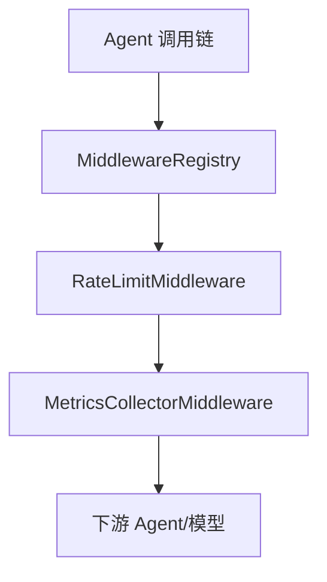
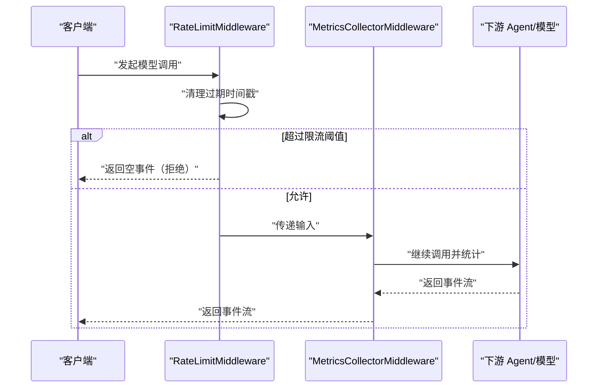
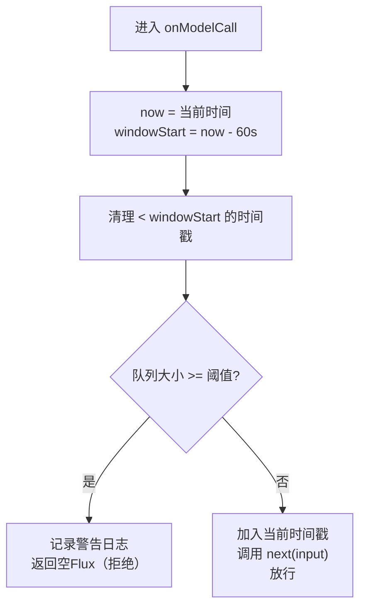
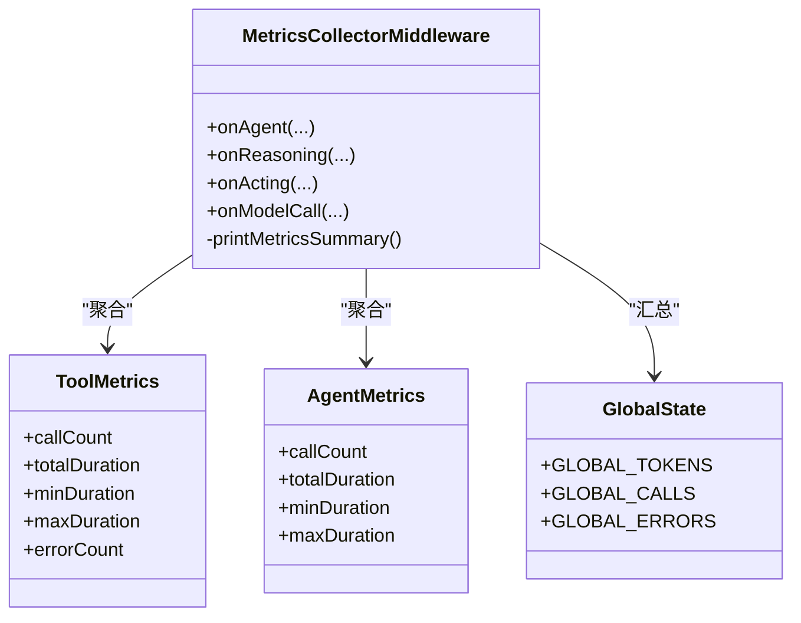
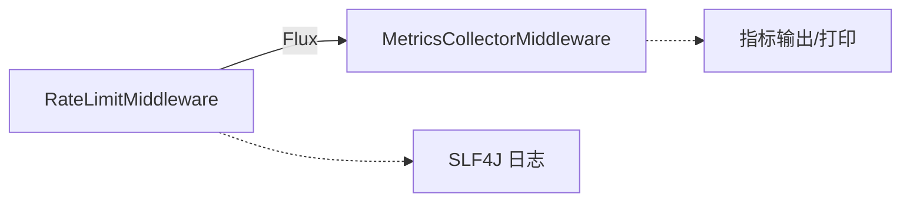

# 限流保护

<cite>
**本文引用的文件**
- [RateLimitMiddleware.java](file://src/main/java/com/skloda/agentscope/middleware/RateLimitMiddleware.java)
- [MetricsCollectorMiddleware.java](file://src/main/java/com/skloda/agentscope/middleware/MetricsCollectorMiddleware.java)
- [MiddlewareRegistry.java](file://src/main/java/com/skloda/agentscope/middleware/MiddlewareRegistry.java)
- [RateLimitMiddlewareTest.java](file://src/test/java/com/skloda/agentscope/middleware/RateLimitMiddlewareTest.java)
- [application.yml](file://src/main/resources/application.yml)
- [metrics-controller（接口）](file://src/main/java/com/skloda/agentscope/controller/MetricsController.java)
</cite>

## 目录
1. [简介](#简介)
2. [项目结构](#项目结构)
3. [核心组件](#核心组件)
4. [架构总览](#架构总览)
5. [详细组件分析](#详细组件分析)
6. [依赖关系分析](#依赖关系分析)
7. [性能考虑](#性能考虑)
8. [故障排查指南](#故障排查指南)
9. [结论](#结论)
10. [附录](#附录)

## 简介
本技术文档聚焦于 AgentScope 的限流保护机制，基于仓库中已实现的 RateLimitMiddleware，系统阐述其“令牌桶/滑动窗口”的时间管理机制、流量控制策略与超限处理行为。文档还说明如何与 MetricsCollectorMiddleware 集成进行指标收集与告警基础，并提供不同场景下的配置建议、性能调优要点以及分布式部署实践建议。

## 项目结构
本项目通过中间件体系对模型调用链路进行可插拔式拦截，其中：
- 限流中间件 RateLimitMiddleware 以时间滑窗方式限制单位时间内模型调用次数。
- 指标采集中间件 MetricsCollectorMiddleware 在推理、动作、模型调用等阶段统计耗时、Token 用量与错误，并通过日志或接口输出聚合信息。
- MiddlewareRegistry 统一注册并暴露中间件的创建入口，便于按 Agent 维度装配。

下图给出本次讨论相关的模块位置与交互关系。

图表来源
- [RateLimitMiddleware.java:16-53](file://src/main/java/com/skloda/agentscope/middleware/RateLimitMiddleware.java#L16-L53)
- [MetricsCollectorMiddleware.java:31-162](file://src/main/java/com/skloda/agentscope/middleware/MetricsCollectorMiddleware.java#L31-L162)
- [MiddlewareRegistry.java:27-50](file://src/main/java/com/skloda/agentscope/middleware/MiddlewareRegistry.java#L27-L50)

章节来源
- [MiddlewareRegistry.java:27-50](file://src/main/java/com/skloda/agentscope/middleware/MiddlewareRegistry.java#L27-L50)

## 核心组件
- RateLimitMiddleware：实现基于队列的滑动窗口限流，默认每分钟内最大调用次数为 10，可通过构造函数自定义。
- MetricsCollectorMiddleware：在多个生命周期钩子收集工具耗时、模型 Token 使用、全局调用计数、错误计数等，并提供汇总打印能力。
- MiddlewareRegistry：集中管理内置中间件名称到构造器的映射，包含 rate-limit 与 metrics-collector。

关键实现要点：
- 限流采用内存中的时间戳队列，每个 1 分钟的窗口会移除过期时间戳，若到达上限则直接返回空 Flux 短路。
- 指标收集线程安全，借助原子类和并发容器进行累加更新，并在事件完成时记录 Agent 级耗时与成本估算。
- 两个中间件通过 AgentScope 的中间件扩展点衔接，形成“先限流、后度量”的执行顺序。

章节来源
- [RateLimitMiddleware.java:20-52](file://src/main/java/com/skloda/agentscope/middleware/RateLimitMiddleware.java#L20-L52)
- [MetricsCollectorMiddleware.java:36-187](file://src/main/java/com/skloda/agentscope/middleware/MetricsCollectorMiddleware.java#L36-L187)
- [MiddlewareRegistry.java:27-41](file://src/main/java/com/skloda/agentscope/middleware/MiddlewareRegistry.java#L27-L41)

## 架构总览
限流在模型调用入口处发生，被拦截的请求若超过阈值则立即拒绝；未被限流的请求进入度量环节，统计耗时与 Token 使用等信息，最终转发至下游 Agent/模型执行。

图表来源
- [RateLimitMiddleware.java:31-52](file://src/main/java/com/skloda/agentscope/middleware/RateLimitMiddleware.java#L31-L52)
- [MetricsCollectorMiddleware.java:50-162](file://src/main/java/com/skloda/agentscope/middleware/MetricsCollectorMiddleware.java#L50-L162)

## 详细组件分析

### 组件一：RateLimitMiddleware（限流中间件）
- 算法本质：以“最近一分钟内的调用次数”为核心的滑动窗口限流，内部用队列维护每次调用的时间戳。
- 时间管理：计算当前时间与窗口起始点，将窗口外的事件逐出；比较队首时间戳与窗口起始点决定清理范围。
- 流量控制：当窗口内调用计数达到上限，返回空 Flux（即不触发 next），从而实现短路限流。
- 日志记录：超过阈值打印告警日志，正常通过打印调试日志。
- 可扩展性：可通过构造函数设定 per-minute 最大值；未来可在类中增加 agentId/userId 维度键以实现细粒度限流。

图表来源
- [RateLimitMiddleware.java:31-52](file://src/main/java/com/skloda/agentscope/middleware/RateLimitMiddleware.java#L31-L52)

章节来源
- [RateLimitMiddleware.java:16-52](file://src/main/java/com/skloda/agentscope/middleware/RateLimitMiddleware.java#L16-L52)

### 组件二：MetricsCollectorMiddleware（指标采集中间件）
- 监控维度：
  - Agent 级：调用次数、累计耗时、最小/最大耗时、工具调用次数、Token 总数、预估费用。
  - Tool 级：每个工具的调用次数、累计耗时、最小/最大耗时、错误次数。
  - 全局：总调用数、总 Token、总错误数。
- 数据载体：ThreadLocal 保存当前线程上下文，结合原子变量与并发 Map 保证并发安全。
- 事件钩子：
  - onAgent：记录 Agent 生命周期与总体统计。
  - onReasoning：累积推理时长。
  - onActing：追踪每个工具的调用与耗时、错误。
  - onModelCall：提取 ModelCallEndEvent 中的 Token 使用量并累加。
- 输出能力：提供静态方法打印聚合指标摘要（含全局统计与工具统计）。

图表来源
- [MetricsCollectorMiddleware.java:31-187](file://src/main/java/com/skloda/agentscope/middleware/MetricsCollectorMiddleware.java#L31-L187)

章节来源
- [MetricsCollectorMiddleware.java:31-187](file://src/main/java/com/skloda/agentscope/middleware/MetricsCollectorMiddleware.java#L31-L187)

### 组件三：MiddlewareRegistry（中间件注册表）
- 职责：自动注册 built-in 中间件，提供根据名称创建实例的能力。
- 内置项：包含 audit-logging、rate-limit、context-enrichment、detailed-audit、metrics-collector、otel-tracing 等。
- 与限流的关系：通过名称“rate-limit”可构造 RateLimitMiddleware；通过“metrics-collector”可构造指标中间件，便于按 Agent 配置加载。

章节来源
- [MiddlewareRegistry.java:27-50](file://src/main/java/com/skloda/agentscope/middleware/MiddlewareRegistry.java#L27-L50)

### 组件四：单元测试验证（RateLimitMiddlewareTest）
- 用例覆盖：
  - 允许不超过阈值的调用。
  - 超过阈值后拒绝下一次调用（next 不被调用）。
- 意义：验证了滑动窗口与短路拒绝的核心行为正确性。

章节来源
- [RateLimitMiddlewareTest.java:14-50](file://src/test/java/com/skloda/agentscope/middleware/RateLimitMiddlewareTest.java#L14-L50)

## 依赖关系分析
- 运行时耦合：
  - RateLimitMiddleware 依赖 AgentScope 的中间件接口与 Event、Flux 响应式类型。
  - MetricsCollectorMiddleware 依赖同类中间件接口与各类事件（含 ModelCallEndEvent）。
  - 两者均无共享状态耦合，独立工作，仅通过事件流与下一个中间件协作。
- 外部依赖：
  - 应用配置 application.yml 控制端口、日志级别等，未直接注入限流参数（限流采用默认值或构造函数传入）。
  - 指标可通过 MetricsCollector 提供的静态方法与控制器组合输出（如通过 Controller 暴露）。

图表来源
- [RateLimitMiddleware.java:31-52](file://src/main/java/com/skloda/agentscope/middleware/RateLimitMiddleware.java#L31-L52)
- [MetricsCollectorMiddleware.java:144-162](file://src/main/java/com/skloda/agentscope/middleware/MetricsCollectorMiddleware.java#L144-L162)

章节来源
- [application.yml:82-88](file://src/main/resources/application.yml#L82-L88)
- [MetricsCollectorMiddleware.java:187-187](file://src/main/java/com/skloda/agentscope/middleware/MetricsCollectorMiddleware.java#L187-L187)

## 性能考虑
- 时间窗口清理效率：
  - 每进入一次 onModelCall，都会检查队首是否超出窗口并进行循环清理，整体时间复杂度近似 O(k)，k 为需要清理事件的数量；在高频突发场景中需要注意队列长度增长带来的开销。
- 内存占用：
  - 使用 LinkedList 存储毫秒级时间戳，长期运行且未清理时将带来内存压力；建议在极端高吞吐场景增加定期全量回收或改用环形缓冲区/滑动窗口数据结构。
- 并发安全：
  - 当前中间件无显式并发写入竞争（单线程事件流模式），但在多线程环境中应评估是否有竞态条件（例如同一实例在多 Agent 间共享时的并发访问）。
- 与指标模块集成影响：
  - 被限流的请求不会走到 MetricsCollector，因此“被拒请求”不会被计入 Agent/Tool 统计，需结合业务口径评估是否需要单独统计“限流率”。

[本节提供通用优化建议，不直接引用具体代码行]

## 故障排查指南
- 现象：大量 429/短流转空
  - 排查点：确认 RateLimitMiddleware 已启用且阈值合理；观察“[rate-limit] Model call blocked...”日志。
  - 相关源：[RateLimitMiddleware.java:43-45](file://src/main/java/com/skloda/agentscope/middleware/RateLimitMiddleware.java#L43-L45)
- 现象：指标缺失或不完整
  - 排查点：确认 MetricsCollectorMiddleware 已启用；检查 onModelCall 是否能接收 MODEL_CALL_END 事件；查看控制台或日志中的指标打印。
  - 相关源：[MetricsCollectorMiddleware.java:144-162](file://src/main/java/com/skloda/agentscope/middleware/MetricsCollectorMiddleware.java#L144-L162), [MetricsCollectorMiddleware.java:187-187](file://src/main/java/com/skloda/agentscope/middleware/MetricsCollectorMiddleware.java#L187-L187)
- 现象：限流生效但业务侧误判
  - 排查点：验证测试用例行为；确认 next 未在受限时调用。
  - 相关源：[RateLimitMiddlewareTest.java:29-49](file://src/test/java/com/skloda/agentscope/middleware/RateLimitMiddlewareTest.java#L29-L49)
- 现象：日志级别不当导致噪音或缺少信息
  - 排查点：调整 logging.level.io.agentscope 与自定义 METRICS 日志级别。
  - 相关源：[application.yml:82-88](file://src/main/resources/application.yml#L82-L88)

## 结论
- 当前限流以 1 分钟滑动窗口为核心，采用简洁高效的队列方案，能够在常见场景下稳定控制入站速率并避免下游过载。
- 指标采集覆盖了模型调用与工具执行的常用维度，便于后续做容量评估、成本核算与告警基线建设。
- 为满足生产环境的复杂需求（多粒度限流、持久化状态、动态热更），建议引入可配键空间（用户/会话/租户）、Redis 共享窗口与配置中心，并与现有指标体系打通告警通道。

[本节为总结性内容，不直接引用具体代码行]

## 附录

### 限流规则动态配置与多粒度支持
- 当前实现为进程内、按实例的单维限流（默认每分钟 N 次，N 由构造函数设定）。
- 建议扩展方向：
  - 多维度键：用户 ID、Agent ID、租户、API Path 等，以便实现多粒度限流。
  - 动态配置：通过配置中心或配置文件动态下发阈值，无需重启生效。
  - 分布式共享：使用 Redis 存储窗口计数器，实现跨节点一致限流。

[本节为概念性方案，不直接引用具体代码行]

### 与 MetricsCollector 集成示例与告警建议
- 指标采集：确保 metrics-collector 中间件已启用，以便统计 Token 用量、耗时与错误率。
- 指标观测：通过指标汇总输出（控制台/日志）建立可视化面板与告警阈值（如：每分钟调用次数激增、错误率高于设定值）。
- 建议：将“被限流比率”也纳入告警范畴，辅助容量规划与异常识别。

[本节为概念性方案，不直接引用具体代码行]

### 不同场景下的限流配置建议
- 低延迟问答 Agent：较小阈值+较紧窗口，优先保障用户体验与稳定性。
- 重计算/长耗时任务 Agent：较大阈值或分时段窗口，避免长时间阻塞。
- 批量处理 Agent：降低峰值限制，配合队列削峰填谷，避免风暴冲击。

[本节为通用指导，不直接引用具体代码行]

### 性能调优要点
- 窗口清理：在高并发下关注时间戳队列增长，必要时采用定时全量清理。
- 对象分配：减少不必要的对象创建，合并日志输出频次。
- 监控采样：对高频路径开启采样日志以避免 I/O 成为瓶颈。

[本节为通用指导，不直接引用具体代码行]

### 分布式部署最佳实践
- 状态共享：将窗口计数器置于 Redis，实现多实例一致限流。
- 时钟同步：确保各实例 NTP 同步，避免窗口计算误差。
- 隔离与降级：结合配额中心实施分级限流与快速降级策略。
- 观测与告警：将限流事件、指标接入统一的监控平台，实现实时告警。

[本节为通用指导，不直接引用具体代码行]