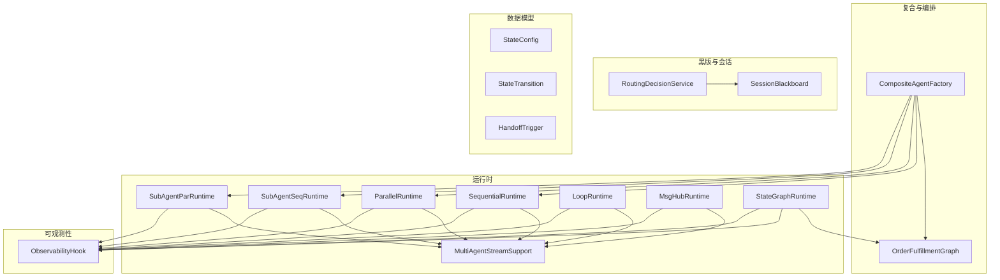
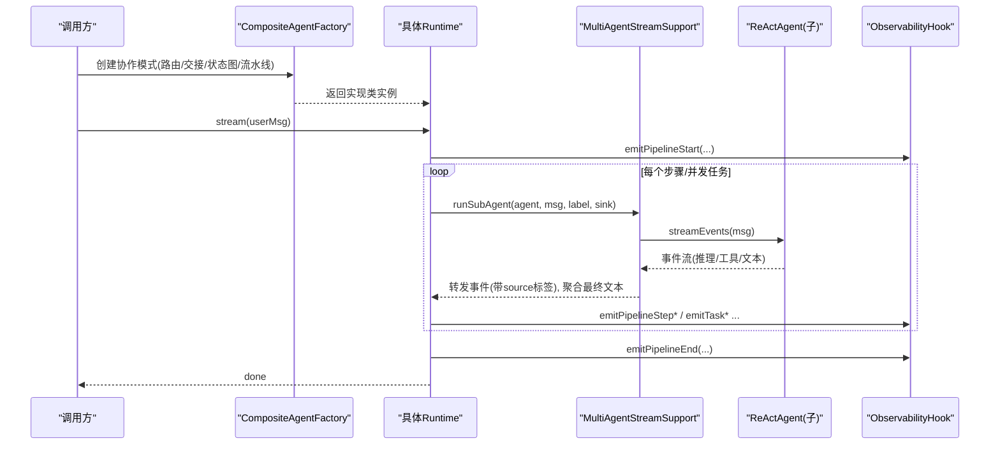
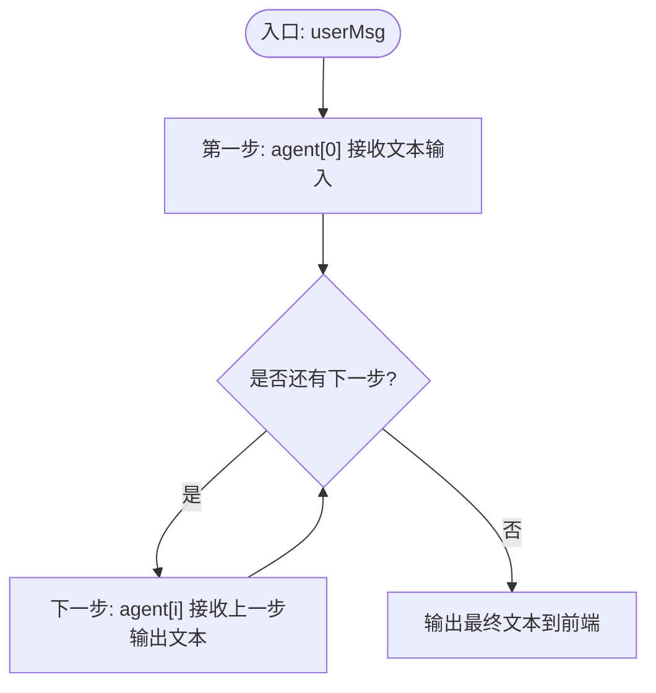
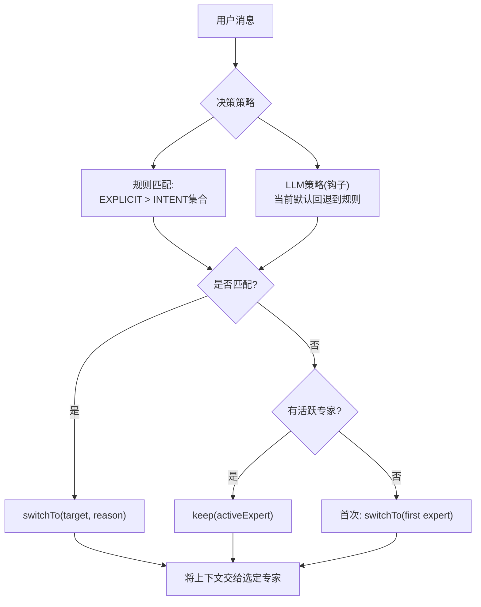
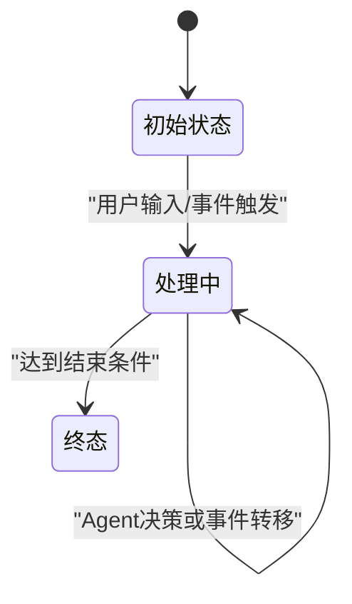
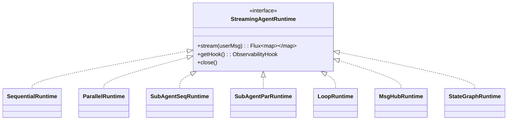
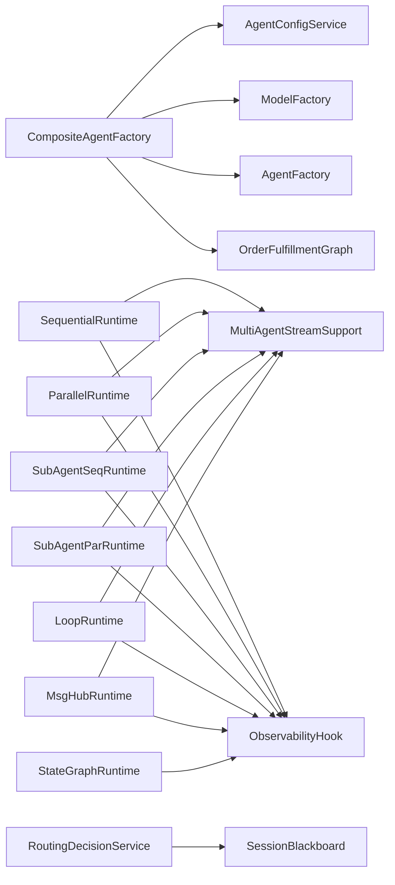

# 多智能体协作

<cite>
**本文引用的文件列表**
- [CompositeAgentFactory.java](file://src/main/java/com/skloda/agentscope/composite/CompositeAgentFactory.java)
- [OrderFulfillmentGraph.java](file://src/main/java/com/skloda/agentscope/composite/graph/OrderFulfillmentGraph.java)
- [MultiAgentStreamSupport.java](file://src/main/java/com/skloda/agentscope/runtime/MultiAgentStreamSupport.java)
- [SequentialRuntime.java](file://src/main/java/com/skloda/agentscope/runtime/SequentialRuntime.java)
- [ParallelRuntime.java](file://src/main/java/com/skloda/agentscope/runtime/ParallelRuntime.java)
- [SubAgentSeqRuntime.java](file://src/main/java/com/skloda/agentscope/runtime/SubAgentSeqRuntime.java)
- [SubAgentParRuntime.java](file://src/main/java/com/skloda/agentscope/runtime/SubAgentParRuntime.java)
- [LoopRuntime.java](file://src/main/java/com/skloda/agentscope/runtime/LoopRuntime.java)
- [MsgHubRuntime.java](file://src/main/java/com/skloda/agentscope/runtime/MsgHubRuntime.java)
- [StateGraphRuntime.java](file://src/main/java/com/skloda/agentscope/runtime/StateGraphRuntime.java)
- [RoutingDecisionService.java](file://src/main/java/com/skloda/agentscope/blackboard/RoutingDecisionService.java)
- [SessionBlackboard.java](file://src/main/java/com/skloda/agentscope/blackboard/SessionBlackboard.java)
- [ObservabilityHook.java](file://src/main/java/com/skloda/agentscope/hook/ObservabilityHook.java)
- [StateConfig.java](file://src/main/java/com/skloda/agentscope/agent/StateConfig.java)
- [StateTransition.java](file://src/main/java/com/skloda/agentscope/agent/StateTransition.java)
- [HandoffTrigger.java](file://src/main/java/com/skloda/agentscope/agent/HandoffTrigger.java)
</cite>

## 目录
1. [引言](#引言)
2. [项目结构](#项目结构)
3. [核心组件](#核心组件)
4. [架构总览](#架构总览)
5. [详细组件分析](#详细组件分析)
6. [依赖关系分析](#依赖关系分析)
7. [性能考量](#性能考量)
8. [故障排查与调试指南](#故障排查与调试指南)
9. [结论](#结论)

## 引言
本文件聚焦于仓库中的“多智能体协作模式”，系统性阐述三类协作模式的实现原理与工程实践：顺序流水线（Sequential Pipeline）、智能路由（Intelligent Routing）、Agent交接（Agent Handoffs），并围绕 CompositeAgentFactory 的工厂设计与模式选择策略、MultiAgentStreamSupport 的事件协调机制、OrderFulfillmentGraph 的状态图编排，以及 StateGraphRuntime 的状态管理与流转控制展开。内容既适合有一定基础的开发人员参考，也便于产品与测试理解整体工作机制与排障方法。

## 项目结构
与多智能体协作相关的主要代码分布在以下包：
- composite：复合代理工厂和状态图编排
- runtime：各类运行时管道与流式桥接支持
- blackboard：会话黑板与会话级共享状态、路由决策服务
- agent：状态配置、转移规则、交接触发等数据模型
- hook：可观测性事件总线桥接到统一的 EventSink

**图示来源**
- [CompositeAgentFactory.java:33-43](file://src/main/java/com/skloda/agentscope/composite/CompositeAgentFactory.java#L33-L43)
- [StateGraphRuntime.java:13-27](file://src/main/java/com/skloda/agentscope/runtime/StateGraphRuntime.java#L13-L27)
- [SequentialRuntime.java:15-21](file://src/main/java/com/skloda/agentscope/runtime/SequentialRuntime.java#L15-L21)
- [ParallelRuntime.java:16-22](file://src/main/java/com/skloda/agentscope/runtime/ParallelRuntime.java#L16-L22)
- [SubAgentSeqRuntime.java:15-21](file://src/main/java/com/skloda/agentscope/runtime/SubAgentSeqRuntime.java#L15-L21)
- [SubAgentParRuntime.java:16-22](file://src/main/java/com/skloda/agentscope/runtime/SubAgentParRuntime.java#L16-L22)
- [LoopRuntime.java:14-28](file://src/main/java/com/skloda/agentscope/runtime/LoopRuntime.java#L14-L28)
- [MsgHubRuntime.java:16-24](file://src/main/java/com/skloda/agentscope/runtime/MsgHubRuntime.java#L16-L24)
- [MultiAgentStreamSupport.java:17-35](file://src/main/java/com/skloda/agentscope/runtime/MultiAgentStreamSupport.java#L17-L35)
- [RoutingDecisionService.java:14-34](file://src/main/java/com/skloda/agentscope/blackboard/RoutingDecisionService.java#L14-L34)
- [ObservabilityHook.java:11-15](file://src/main/java/com/skloda/agentscope/hook/ObservabilityHook.java#L11-L15)

**章节来源**
- [CompositeAgentFactory.java:33-43](file://src/main/java/com/skloda/agentscope/composite/CompositeAgentFactory.java#L33-L43)
- [StateGraphRuntime.java:13-27](file://src/main/java/com/skloda/agentscope/runtime/StateGraphRuntime.java#L13-L27)

## 核心组件
- CompositeAgentFactory：统一的“复合代理”工厂，负责创建不同协作模式的智能体；对 STATE_GRAPH 模式，构造 OrderFulfillmentGraph；对 ROUTING/HANDOFFS 场景注册子代理工具以支持动态分发。
- MultiAgentStreamSupport：提供 runSubAgent 与文本提取能力，把子 Agent 的 streamEvents 事件透传到统一 Sink，收集最终文本用于链式或并行组合。
- 运行时系列：SequentialRuntime、ParallelRuntime、SubAgentSeqRuntime、SubAgentParRuntime、LoopRuntime、MsgHubRuntime，分别实现不同类型的协作执行语义，并通过 Hook 上报生命周期事件。
- OrderFulfillmentGraph + StateGraphRuntime：基于配置的有限状态机，驱动智能体调用或基于用户事件进行确定性跳转，输出最终结果。
- RoutingDecisionService + SessionBlackboard：无状态路由决策服务配合会话级别共享黑板，管理专家切换、意图、知识沉淀与版本化。

**章节来源**
- [CompositeAgentFactory.java:97-191](file://src/main/java/com/skloda/agentscope/composite/CompositeAgentFactory.java#L97-L191)
- [MultiAgentStreamSupport.java:43-118](file://src/main/java/com/skloda/agentscope/runtime/MultiAgentStreamSupport.java#L43-L118)
- [OrderFulfillmentGraph.java:17-40](file://src/main/java/com/skloda/agentscope/composite/graph/OrderFulfillmentGraph.java#L17-L40)
- [StateGraphRuntime.java:29-74](file://src/main/java/com/skloda/agentscope/runtime/StateGraphRuntime.java#L29-L74)
- [RoutingDecisionService.java:48-63](file://src/main/java/com/skloda/agentscope/blackboard/RoutingDecisionService.java#L48-L63)
- [SessionBlackboard.java:15-39](file://src/main/java/com/skloda/agentscope/blackboard/SessionBlackboard.java#L15-L39)

## 架构总览
下面从两类维度理解整体架构：

1) 模式选择层（CompositeAgentFactory）
- 单 Agent：通过底层工厂创建 ReActAgent。
- 路由/交接：构建包含多个子 Agent 工具的 Toolkit，主 Agent 在推理中选择工具以调用子 Agent，从而完成“按需选择专家”。
- 状态图（STATE_GRAPH）：根据 StateConfig 创建各状态对应的 Agent，并由 OrderFulfillmentGraph 驱动流转。

2) 运行层（Runtime × Hook）
- 每个 Runtime 将自身的 pipeline 与 ObservabilityHook 绑定，使用 MultiAgentStreamSupport.runSubAgent 作为事件与数据的桥接点，实现“流式事件到前端的统一推送”和“结果到下一步的链式传递”。

**图示来源**
- [CompositeAgentFactory.java:115-191](file://src/main/java/com/skloda/agentscope/composite/CompositeAgentFactory.java#L115-L191)
- [MultiAgentStreamSupport.java:74-118](file://src/main/java/com/skloda/agentscope/runtime/MultiAgentStreamSupport.java#L74-L118)
- [SequentialRuntime.java:37-89](file://src/main/java/com/skloda/agentscope/runtime/SequentialRuntime.java#L37-L89)
- [ParallelRuntime.java:38-105](file://src/main/java/com/skloda/agentscope/runtime/ParallelRuntime.java#L38-L105)
- [ObservabilityHook.java:45-66](file://src/main/java/com/skloda/agentscope/hook/ObservabilityHook.java#L45-L66)

## 详细组件分析

### 顺序流水线（Sequential Pipeline）
顺序执行一组 ReActAgent，每一步的输出作为下一步的输入。通过 Mono chain 串联结果，并使用 MultiAgentStreamSupport.runSubAgent 将每步的子 Agent 事件转发到前端。

- 事件协调：每一步 emit step start/end，并以 source 标注来源 Agent。
- 异常与结束：任意步骤异常会下发 error 事件并最终 done；最终发送 text 与 done。
- 复杂度：O(N) 串行，时间取决于最长单个 Agent 耗时。

**图示来源**
- [SequentialRuntime.java:37-89](file://src/main/java/com/skloda/agentscope/runtime/SequentialRuntime.java#L37-L89)
- [MultiAgentStreamSupport.java:74-118](file://src/main/java/com/skloda/agentscope/runtime/MultiAgentStreamSupport.java#L74-L118)

**章节来源**
- [SequentialRuntime.java:15-99](file://src/main/java/com/skloda/agentscope/runtime/SequentialRuntime.java#L15-L99)

### 智能路由（Intelligent Routing）
Router 维护一组子 Agent，并通过其系统提示与工具声明引导 LLM 选择最合适的子代理执行；也可结合 HandoffTrigger 做静态规则匹配。

关键要点：
- CompositeAgentFactory.createRoutingAgent：为主 Agent 注入 SubAgentTool，描述目标子 Agent，开启事件转发与增量流。
- RoutingDecisionService：纯函数式的路由决策器，支持 rule（默认）与 llm（钩子扩展）两种策略；rule 策略优先 EXPLICIT 意图，其次 INTENT 意图集，未命中则 KEEP 或 CLARIFY，首次对话路由到第一个专家。
- SessionBlackboard：保存 activeExpert、currentIntent、业务事实等，并维护 version 以实现冲突合并与串行应用。

**图示来源**
- [CompositeAgentFactory.java:115-191](file://src/main/java/com/skloda/agentscope/composite/CompositeAgentFactory.java#L115-L191)
- [RoutingDecisionService.java:48-159](file://src/main/java/com/skloda/agentscope/blackboard/RoutingDecisionService.java#L48-L159)
- [SessionBlackboard.java:40-159](file://src/main/java/com/skloda/agentscope/blackboard/SessionBlackboard.java#L40-L159)

**章节来源**
- [CompositeAgentFactory.java:115-191](file://src/main/java/com/skloda/agentscope/composite/CompositeAgentFactory.java#L115-L191)
- [RoutingDecisionService.java:65-159](file://src/main/java/com/skloda/agentscope/blackboard/RoutingDecisionService.java#L65-L159)

### Agent交接（Agent Handoffs）
交接本质上是“在当前上下文中切换到另一个专家继续完成任务”。通过 HandoffTrigger 定义触发关键词与类型，RoutingDecisionService 决定是否需要切换。SessionBlackboard.activeExpert 跟踪当前专家。

- 触发类型：INTENT 与 EXPLICIT；显式“转XX”优先。
- 决策优先级：先 EXPLICIT 匹配，再 INTENT 集合匹配；若全部命中且目标等于当前专家，KEEP；否则 SWITCH。
- 首次交互：无 activeExpert 时路由到第一个专家。

**章节来源**
- [HandoffTrigger.java:14-26](file://src/main/java/com/skloda/agentscope/agent/HandoffTrigger.java#L14-L26)
- [RoutingDecisionService.java:71-136](file://src/main/java/com/skloda/agentscope/blackboard/RoutingDecisionService.java#L71-L136)

### 状态图编排与复杂场景：OrderFulfillmentGraph + StateGraphRuntime
OrderFulfillmentGraph 是一个轻量有限状态机：
- 每个状态可选择关联一个 Agent，或由用户输入触发确定性的转移。
- 当有 Agent 时，调用 Agent 并根据其输出中的约定格式（如“【决策:xxx】”）选择转移；若无 Agent，根据事件关键字匹配。
- 记录当前状态并在到达终止条件时返回结果。

StateGraphRuntime 将其包装为流式运行时：
- 订阅 Graph 的执行结果，将文本块和内部 graph 事件（graph_agent_call、graph_transition）汇出。
- 使用 ObservabilityHook.emitGraphAgentCall / emitGraphTransition 对外报告流转。

**图示来源**
- [OrderFulfillmentGraph.java:22-101](file://src/main/java/com/skloda/agentscope/composite/graph/OrderFulfillmentGraph.java#L22-L101)
- [StateGraphRuntime.java:29-74](file://src/main/java/com/skloda/agentscope/runtime/StateGraphRuntime.java#L29-L74)
- [StateConfig.java:9-17](file://src/main/java/com/skloda/agentscope/agent/StateConfig.java#L9-L17)
- [StateTransition.java:8-16](file://src/main/java/com/skloda/agentscope/agent/StateTransition.java#L8-L16)

**章节来源**
- [OrderFulfillmentGraph.java:22-198](file://src/main/java/com/skloda/agentscope/composite/graph/OrderFulfillmentGraph.java#L22-L198)
- [StateGraphRuntime.java:13-74](file://src/main/java/com/skloda/agentscope/runtime/StateGraphRuntime.java#L13-L74)

### 并发与协作的运行时族谱
- SubAgentSeqRuntime：以模板 {input}/{prevOutput} 串起来，逐步传递上下文，适用于分阶段处理、递进增强。
- SubAgentParRuntime：并发派发任务，结果聚合输出，提高吞吐，但对一致性要求高时需在上层做合并。
- LoopRuntime：写-评循环，自动判断是否“通过”，支持最大迭代次数，具备错误收敛能力。
- MsgHubRuntime：多轮专家讨论+主持人总结，形成结构化会议结果。

**图示来源**
- [SequentialRuntime.java:15-99](file://src/main/java/com/skloda/agentscope/runtime/SequentialRuntime.java#L15-L99)
- [ParallelRuntime.java:16-105](file://src/main/java/com/skloda/agentscope/runtime/ParallelRuntime.java#L16-L105)
- [SubAgentSeqRuntime.java:15-106](file://src/main/java/com/skloda/agentscope/runtime/SubAgentSeqRuntime.java#L15-L106)
- [SubAgentParRuntime.java:16-104](file://src/main/java/com/skloda/agentscope/runtime/SubAgentParRuntime.java#L16-L104)
- [LoopRuntime.java:14-166](file://src/main/java/com/skloda/agentscope/runtime/LoopRuntime.java#L14-L166)
- [MsgHubRuntime.java:16-153](file://src/main/java/com/skloda/agentscope/runtime/MsgHubRuntime.java#L16-L153)
- [StateGraphRuntime.java:13-74](file://src/main/java/com/skloda/agentscope/runtime/StateGraphRuntime.java#L13-L74)

**章节来源**
- [SubAgentSeqRuntime.java:15-106](file://src/main/java/com/skloda/agentscope/runtime/SubAgentSeqRuntime.java#L15-L106)
- [SubAgentParRuntime.java:16-104](file://src/main/java/com/skloda/agentscope/runtime/SubAgentParRuntime.java#L16-L104)
- [LoopRuntime.java:14-166](file://src/main/java/com/skloda/agentscope/runtime/LoopRuntime.java#L14-L166)
- [MsgHubRuntime.java:16-153](file://src/main/java/com/skloda/agentscope/runtime/MsgHubRuntime.java#L16-L153)

## 依赖关系分析
- CompositeAgentFactory 依赖 AgentConfigService 和 ModelFactory 获取配置与模型实例，依赖 AgentFactory 创建基础 Agent 或会话级存储；对于 STATE_GRAPH，进一步组装 OrderFulfillmentGraph。
- 所有 Runtime 依赖 ObservabilityHook 暴露事件，并依赖 MultiAgentStreamSupport 以统一子 Agent 的流式集成。
- RoutingDecisionService 与 SessionBlackboard 解耦：前者无状态，后者持有一会话状态并提供版本控制。
- OrderFulfillmentGraph 仅依赖 StateConfig/StateTransition 与 ReActAgent；StateGraphRuntime 将其转为流式 API。

**图示来源**
- [CompositeAgentFactory.java:33-57](file://src/main/java/com/skloda/agentscope/composite/CompositeAgentFactory.java#L33-L57)
- [SequentialRuntime.java:15-89](file://src/main/java/com/skloda/agentscope/runtime/SequentialRuntime.java#L15-L89)
- [ParallelRuntime.java:16-95](file://src/main/java/com/skloda/agentscope/runtime/ParallelRuntime.java#L16-L95)
- [ObservabilityHook.java:45-66](file://src/main/java/com/skloda/agentscope/hook/ObservabilityHook.java#L45-L66)
- [RoutingDecisionService.java:48-159](file://src/main/java/com/skloda/agentscope/blackboard/RoutingDecisionService.java#L48-L159)
- [SessionBlackboard.java:40-159](file://src/main/java/com/skloda/agentscope/blackboard/SessionBlackboard.java#L40-L159)

**章节来源**
- [CompositeAgentFactory.java:33-57](file://src/main/java/com/skloda/agentscope/composite/CompositeAgentFactory.java#L33-L57)

## 性能考量
- 顺序流水线：低延迟、强一致性；总耗时 ≈ 各步骤之和，适合对顺序依赖严格的工作流。
- 并行流水线：吞吐高；受限于后端模型/线程池，注意资源与下游限流。
- 子任务串行/并行：按任务边界选择，减少不必要的全局同步。
- 循环与讨论：可设置最大迭代/轮数，避免无限跑；建议结合速率限制与超时策略（上层配置）。
- 状态图：若某状态存在重型 Agent，应评估该路径耗时；建议在配置中拆分细粒度状态。

[本节为通用指导，不直接分析具体文件]

## 故障排查与调试指南
- 事件断点定位：
  - 观察 ObservabilityHook 发出的 pipeline/task/loop/routing/graph 事件，快速确认处于哪个环节。
  - 查看 MultiAgentStreamSupport 对事件的 forward 与最终文本捕获逻辑，确认事件是否被正确合并。
- 常见问题：
  - 路由未切换：检查 HandoffTrigger 的关键词与类型，确认 RoutingDecisionService 的规则路径。
  - 状态图卡住：核对 StateConfig/Transitions 的事件/条件是否与用户输入匹配；检查 Agent 输出是否符合约定的决策标记。
  - 子 Agent 事件丢失：确保使用 runSubAgent 而非旧接口，并检查 sink 是否正确合并。
  - 超长输出导致前端卡顿：各 Runtime 均做了输出截断展示（pipeline_step_result/task_result），但可在上游控制生成长度。
- 建议步骤：
  1) 启用 debug 日志与更详细的 event mapping。
  2) 在小样本用例下最小化复现。
  3) 逐步禁用部分 Agent/状态以隔离问题。
  4) 针对异常流程，核对异常分支是否下发 error 与 done 事件。

**章节来源**
- [MultiAgentStreamSupport.java:74-118](file://src/main/java/com/skloda/agentscope/runtime/MultiAgentStreamSupport.java#L74-L118)
- [RoutingDecisionService.java:71-136](file://src/main/java/com/skloda/agentscope/blackboard/RoutingDecisionService.java#L71-L136)
- [OrderFulfillmentGraph.java:115-157](file://src/main/java/com/skloda/agentscope/composite/graph/OrderFulfillmentGraph.java#L115-L157)

## 结论
本方案通过工厂化的模式选择（CompositeAgentFactory）和统一的流式协调（MultiAgentStreamSupport + ObservabilityHook），在保证高内聚的同时实现了顺序流水线、智能路由、Agent交接、状态图编排等多种协作方式。运行时的模块化设计使同一套事件协议服务于不同的执行范式；会话级共享状态为跨 Agent 协作提供了可信、可控的数据平面。面向生产环境，建议结合超时、重试与配额策略，并结合黑版与会话状态进行持续治理与优化。