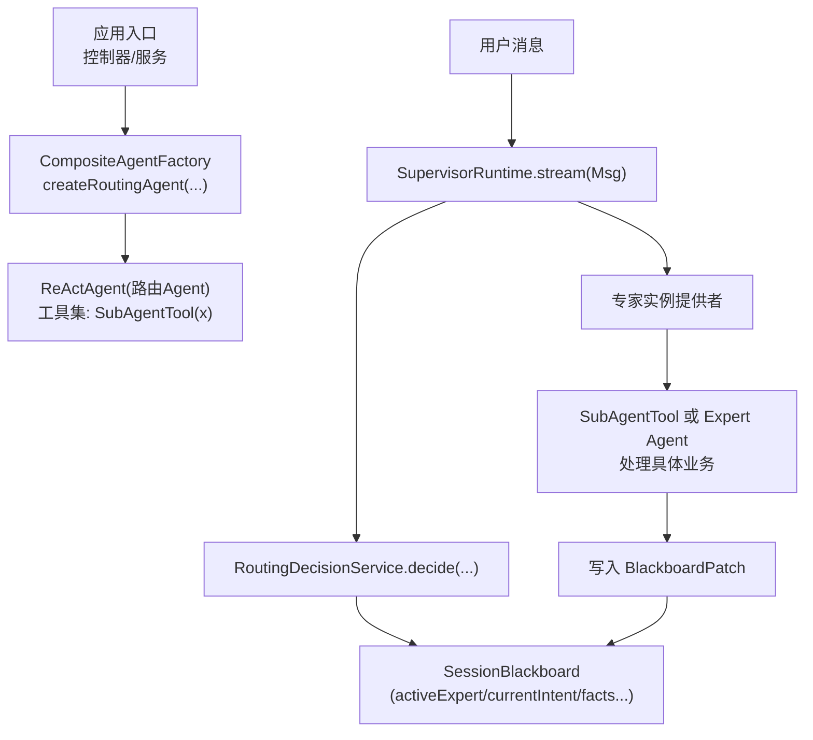
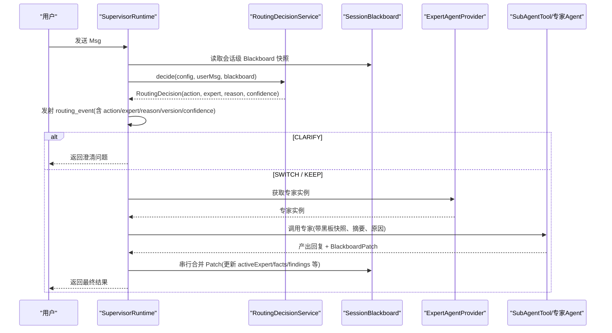
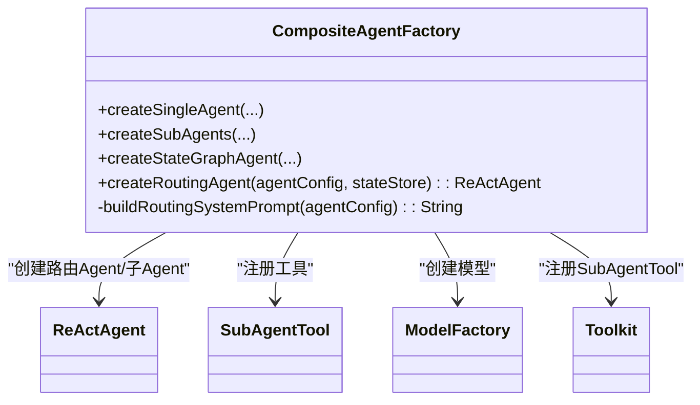
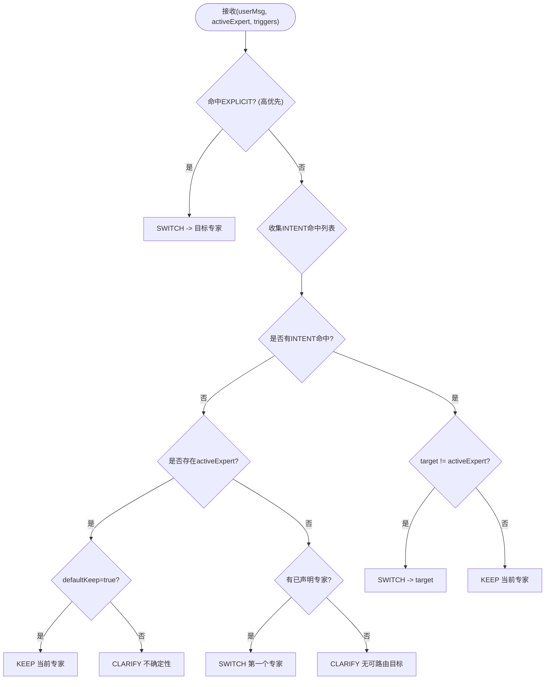
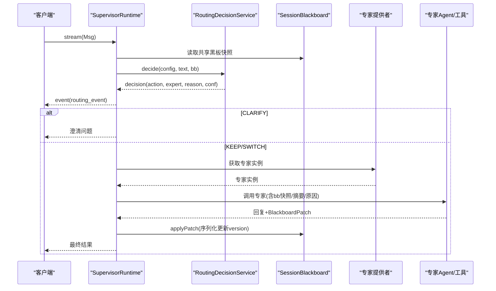
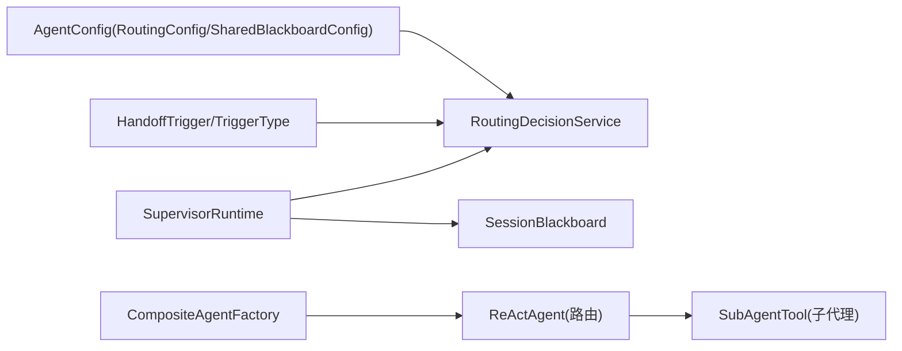

# 智能路由模式

<cite>
**本文引用的文件**   
- [CompositeAgentFactory.java](file://src/main/java/com/skloda/agentscope/composite/CompositeAgentFactory.java)
- [HandoffTrigger.java](file://src/main/java/com/skloda/agentscope/agent/HandoffTrigger.java)
- [TriggerType.java](file://src/main/java/com/skloda/agentscope/agent/TriggerType.java)
- [RoutingDecisionService.java](file://src/main/java/com/skloda/agentscope/blackboard/RoutingDecisionService.java)
- [RoutingAction.java](file://src/main/java/com/skloda/agentscope/blackboard/RoutingAction.java)
- [SessionBlackboard.java](file://src/main/java/com/skloda/agentscope/blackboard/SessionBlackboard.java)
- [SupervisorRuntime.java](file://src/main/java/com/skloda/agentscope/blackboard/SupervisorRuntime.java)
- [AgentConfig.java](file://src/main/java/com/skloda/agentscope/agent/AgentConfig.java)
- [agents.yml](file://src/main/resources/config/agents.yml)
- [RoutingDecisionServiceTest.java](file://src/test/java/com/skloda/agentscope/blackboard/RoutingDecisionServiceTest.java)
- [SupervisorRoutingContextTest.java](file://src/test/java/com/skloda/agentscope/blackboard/SupervisorRoutingContextTest.java)
</cite>

## 目录
1. [简介](#简介)
2. [项目结构（路由相关）](#项目结构路由相关)
3. [核心组件总览](#核心组件总览)
4. [架构概览](#架构概览)
5. [详细组件分析](#详细组件分析)
6. [依赖关系分析](#依赖关系分析)
7. [性能考虑与优化建议](#性能考虑与优化建议)
8. [故障排查指南](#故障排查指南)
9. [结论](#结论)
10. [附录：配置与实践案例](#附录配置与实践案例)

## 简介
本文件聚焦“智能路由模式”的实现：以 CompositeAgentFactory 为基础，说明如何为 ROUTING/HANDOFFS Agent 构建并编排子代理；同时深入解析基于 Shared Blackboard 的 Supervisor 路由机制（路由决策、触发条件、上下文传递），并给出 Prompt 工程策略、可配置的调试与调优方法，以及客服工单分类、任务调度等典型场景。

## 项目结构（路由相关）
路由能力贯穿装配与运行两条线：
- 装配期：CompositeAgentFactory 负责创建 ROUTING 型 Agent，并注入 SubAgentTool 作为调用手段。
- 运行期：SupervisorRuntime 在每次用户输入时，利用 SessionBlackboard 的状态与 RoutingDecisionService 的决策规则执行 KEEP/SWITCH/CLARIFY。



图示来源
- [CompositeAgentFactory.java:115-191](file://src/main/java/com/skloda/agentscope/composite/CompositeAgentFactory.java#L115-L191)
- [SupervisorRuntime.java:134-195](file://src/main/java/com/skloda/agentscope/blackboard/SupervisorRuntime.java#L134-L195)
- [RoutingDecisionService.java:47-63](file://src/main/java/com/skloda/agentscope/blackboard/RoutingDecisionService.java#L47-L63)

章节来源
- [CompositeAgentFactory.java:1-191](file://src/main/java/com/skloda/agentscope/composite/CompositeAgentFactory.java#L1-L191)
- [SupervisorRuntime.java:134-195](file://src/main/java/com/skloda/agentscope/blackboard/SupervisorRuntime.java#L134-L195)

## 核心组件总览
- CompositeAgentFactory：根据 AgentConfig 类型分别构建 Single/ROUTING/STATE_GRAPH 等 Agent；针对 ROUTING 类型，创建 ReActAgent，注册若干 SubAgentTool（每个子代理一个工具）。
- SessionBlackboard：跨专家共享的业务状态载体（版本化、防篡改、只读快照）。
- RoutingDecisionService：依据 HandoffTrigger 和 RoutingConfig 输出确定性/可配置的 KEEP/SWITCH/CLARIFY 决策。
- SupervisorRuntime：每次轮次的运行时控制流：加锁 → 读黑板 → 做路由决策 → 发射路由事件 → 派发给专家 → 合并 Patch → 保存状态。
- TriggerType + HandoffTrigger：声明式触发器，支持关键词匹配与目标切换。
- AgentConfig.RoutingConfig.SharedBlackboardConfig：路由与共享黑板的静态开关与阈值设定。

章节来源
- [AgentConfig.java:62-185](file://src/main/java/com/skloda/agentscope/agent/AgentConfig.java#L62-L185)
- [TriggerType.java:1-18](file://src/main/java/com/skloda/agentscope/agent/TriggerType.java#L1-L18)
- [HandoffTrigger.java:1-26](file://src/main/java/com/skloda/agentscope/agent/HandoffTrigger.java#L1-L26)
- [RoutingAction.java:1-24](file://src/main/java/com/skloda/agentscope/blackboard/RoutingAction.java#L1-L24)

## 架构概览
从“请求到达—路由决策—专家执行—状态同步”的全链路视角如下：



图示来源
- [SupervisorRuntime.java:134-195](file://src/main/java/com/skloda/agentscope/blackboard/SupervisorRuntime.java#L134-L195)
- [RoutingDecisionService.java:47-160](file://src/main/java/com/skloda/agentscope/blackboard/RoutingDecisionService.java#L47-L160)
- [SessionBlackboard.java:121-159](file://src/main/java/com/skloda/agentscope/blackboard/SessionBlackboard.java#L121-L159)

## 详细组件分析

### 1) CompositeAgentFactory：ROUTING Agent 的构建与子代理注册
- 输入：AgentConfig（需包含 subAgents 列表），可选 stateStore。
- 子代理构造：为每个 SubAgentConfig 生成独立的 ReActAgent，并使用 InMemoryAgentStateStore 隔离各自会话。
- 工具集成：将每个子代理封装成 SubAgentTool，并以“无工具模式”注册到路由 Agent 的工具集中，使路由 Agent 仅能按名称调用子代理。
- Prompt：使用 buildRoutingSystemPrompt 组装系统提示词，强调职责、选择准则与工具调用方式（避免暴露底层实现细节给 LLM）。



图示来源
- [CompositeAgentFactory.java:86-191](file://src/main/java/com/skloda/agentscope/composite/CompositeAgentFactory.java#L86-L191)

章节来源
- [CompositeAgentFactory.java:115-191](file://src/main/java/com/skloda/agentscope/composite/CompositeAgentFactory.java#L115-L191)

### 2) HandoffTrigger 与 TriggerType：交接触发机制
- TriggerType
  - INTENT：意图触发，通过关键词匹配命中后切换到 target 专家。
  - EXPLICIT：显式指令触发，用户明确说“转 X”，绝对优先。
  - INCAPABLE：能力不足触发，用于未匹配时降级或引导的场景扩展点（当前主要走默认逻辑）。
- HandoffTrigger.matches：对 INTENT 类型进行大小写无关的关键词包含匹配；EXPLICIT 匹配在路由决策阶段单独处理以提升优先级。

```mermaid
flowchart TD
  Start([开始]) --> T{"type == INTENT?"}
  T -->|是| M["对text与keywords进行大小写无关包含匹配"]
  M --> Hit{"是否匹配到任一keyword?"}
  Hit -->|是| Matched["返回true"]
  Hit -->|否| NoMatch["返回false"]
  T -->|否| Other["其他类型(如EXPLICIT由路由逻辑判断)"]
  Other --> Return[返回false(交由上层判定)]
  Matched --> End([结束])
  NoMatch --> End
  Return --> End
```

图示来源
- [HandoffTrigger.java:14-26](file://src/main/java/com/skloda/agentscope/agent/HandoffTrigger.java#L14-L26)
- [TriggerType.java:1-18](file://src/main/java/com/skloda/agentscope/agent/TriggerType.java#L1-L18)

章节来源
- [HandoffTrigger.java:1-26](file://src/main/java/com/skloda/agentscope/agent/HandoffTrigger.java#L1-L26)
- [TriggerType.java:1-18](file://src/main/java/com/skloda/agentscope/agent/TriggerType.java#L1-L18)

### 3) RoutingDecisionService：规则型路由决策
- 决策步骤（rule 策略）：
  1) 遍历 triggers，若命中 EXPLICIT 则立即 SWITCH 到目标。
  2) 收集 INTENT 命中项：
     - 若命中 target ≠ activeExpert，则 SWITCH；
     - 若全部指向 activeExpert，则 KEEP；
     - 若无任何命中，进入下一步。
  3) 无命中时的退避：
     - 若存在 activeExpert：defaultKeep=true 则 KEEP，否则 CLARIFY。
     - 若为首次且存在可用专家：SWITCH 到首个 declared 专家（避免首轮阻塞）。
  4) 若仍无专家：CLARIFY。
- 置信度与可解释性：不同决策附带 reason 与 confidence，便于前端展示与监控。



图示来源
- [RoutingDecisionService.java:67-137](file://src/main/java/com/skloda/agentscope/blackboard/RoutingDecisionService.java#L67-L137)
- [RoutingDecisionService.java:139-159](file://src/main/java/com/skloda/agentscope/blackboard/RoutingDecisionService.java#L139-L159)

章节来源
- [RoutingDecisionService.java:47-189](file://src/main/java/com/skloda/agentscope/blackboard/RoutingDecisionService.java#L47-L189)

### 4) SupervisorRuntime：运行时主流程
- 每轮关键步骤：
  - 获取会话锁并发出 supervisor_start。
  - 读取/构造黑板快照并追加用户消息到 Supervisor 会话态。
  - 调用 RoutingDecisionService 得到决策。
  - 发射 routing_event（携带 action、previousExpert、selectedExpert、reason、confidence 等）。
  - 若 CLARIFY：直接回问；否则派发专家，执行后将补丁合并回黑板，再写出 Supervisor 会话态。
- 事件过滤：屏蔽专家内部文本与边界事件以避免前端重复渲染。



图示来源
- [SupervisorRuntime.java:134-195](file://src/main/java/com/skloda/agentscope/blackboard/SupervisorRuntime.java#L134-L195)
- [SessionBlackboard.java:121-159](file://src/main/java/com/skloda/agentscope/blackboard/SessionBlackboard.java#L121-L159)

章节来源
- [SupervisorRuntime.java:134-195](file://src/main/java/com/skloda/agentscope/blackboard/SupervisorRuntime.java#L134-L195)

### 5) 智能路由 Prompt 工程策略
- 路由 Agent Prompt 要点（由 buildRoutingSystemPrompt 组装）：
  - 角色定义：明确指出自身是“智能路由助手”，不要自行解答问题，只做分发。
  - 任务边界：理解意图→选择最匹配子代理→调用对应子代理工具（禁止直触业务细节）。
  - 行为约束：保持简洁、仅调用注册的 SubAgentTool，禁止额外工具调用。
  - 错误处理：无法确定目标时，输出澄清信息或保持当前专家。
- 子代理 Prompt 注入（创建时增强）：
  - 在原始角色描述前附加“通过工具被调用”、“不要调用工具”、“专注专业领域”等限定，降低子代理越权调用工具的概率。
- Supervisor 系统提示（YAML 中）：
  - 固定入口不可跳转；将专家名单、能力边界、路由由后端决定等约束写入系统提示，提升一致性。

章节来源
- [CompositeAgentFactory.java:115-191](file://src/main/java/com/skloda/agentscope/composite/CompositeAgentFactory.java#L115-L191)
- [agents.yml:1063-1103](file://src/main/resources/config/agents.yml#L1063-L1103)

### 6) 路由规则的配置方法
- 路由策略：
  - strategy：值为 "rule"（默认，基于 Keyword/Intent 表）或 "llm"（预留钩子，当前默认回退到 rule）。
  - defaultKeep：在无命中且有 activeExpert 时，是否保持当前专家而非 CLARIFY。
  - recentTurns：LLM 路由时作为上下文的最近轮次数量（规则策略不使用）。
  - modelName：LLM 路由时的模型覆盖（默认继承 Supervisor 的模型名）。
- 触发器：
  - 通过 handoffTriggers 列表声明 EXPLICIT 与 INTENT 两种触发，每种包含 keywords 与 target 专家。
- 共享黑板：
  - sharedBlackboard.enabled：开启后，ROUTING Agent 升级为 Supervisor 工作流，具备会话级共享业务事实。
  - storageKey：默认 "shared_blackboard"，与 Supervisor 的 conversation 状态 key "agent_state" 严格区分。
  - minConfidence：LLM 路由时可用的最低置信度阈值（规则路由不使用）。

章节来源
- [AgentConfig.java:73-185](file://src/main/java/com/skloda/agentscope/agent/AgentConfig.java#L73-L185)
- [agents.yml:970-1103](file://src/main/resources/config/agents.yml#L970-L1103)

## 依赖关系分析


图示来源
- [RoutingDecisionService.java:47-160](file://src/main/java/com/skloda/agentscope/blackboard/RoutingDecisionService.java#L47-L160)
- [CompositeAgentFactory.java:115-191](file://src/main/java/com/skloda/agentscope/composite/CompositeAgentFactory.java#L115-L191)
- [SupervisorRuntime.java:134-195](file://src/main/java/com/skloda/agentscope/blackboard/SupervisorRuntime.java#L134-L195)
- [SessionBlackboard.java:40-159](file://src/main/java/com/skloda/agentscope/blackboard/SessionBlackboard.java#L40-L159)

章节来源
- [RoutingDecisionService.java:47-189](file://src/main/java/com/skloda/agentscope/blackboard/RoutingDecisionService.java#L47-L189)
- [CompositeAgentFactory.java:115-191](file://src/main/java/com/skloda/agentscope/composite/CompositeAgentFactory.java#L115-L191)

## 性能考虑与优化建议
- 首屏体验：当无 activeExpert 且无 trigger 匹配时，默认路由至首个专家，避免首轮阻塞用户体验。
- 并行/批处理：子代理独立会话（InMemoryAgentStateStore），互不干扰；可按需引入外部缓存复用昂贵检索（例如知识库、词典）。
- 流式与事件：SupervisorRuntime 采用流式输出路由事件与专家结果，降低前端延迟感知。
- 最小 LLM 调用：默认 "rule" 策略零模型调用即可决策；LLM 策略仅在明确需要时使用（通过 strategy="llm" 开启）。
- 可扩展性：新增专家只需增加 SubAgentConfig + 可能的新 TriggerType 语义，无需改动核心路由代码。

## 故障排查指南
- “始终 CLARIFY”：检查 routingConfig.defaultKeep 与手头的 activeExpert；确认 handoffTriggers 是否正确配置 keywords/target。
- “未按预期切专家”：验证 EXPLICIT 与 INTENT 的优先级顺序；确认当前 activeExpert 与命中 target 的比较逻辑。
- “跨专家丢失上下文”：确认 Supervisor 已将 Patch 串行合并入 SessionBlackboard，并观察 version 单调递增；确保 Expert 返回合法 Patch。
- “前端重复渲染/显示异常”：检查 SupervisorRuntime 的事件过滤集合，避免转发 raw text 或 agent_end 等事件造成重渲染。
- “测试失败或行为不一致”：参考单元测试：
  - 规则路由断言：首轮/后续轮/模糊轮/显式切换/同专家继续等场景。
  - 跨专家事实传递：A 专家写入 facts，B 专家切换后仍能读取，且 version 递增。

章节来源
- [RoutingDecisionServiceTest.java:17-154](file://src/test/java/com/skloda/agentscope/blackboard/RoutingDecisionServiceTest.java#L17-L154)
- [SupervisorRoutingContextTest.java:36-119](file://src/test/java/com/skloda/agentscope/blackboard/SupervisorRoutingContextTest.java#L36-L119)
- [RoutingDecisionService.java:67-137](file://src/main/java/com/skloda/agentscope/blackboard/RoutingDecisionService.java#L67-L137)

## 结论
本项目实现了“确定性规则为主、可升级 LLM”的智能路由模式。通过 CompositeAgentFactory 构建路由 Agent 并注册子代理工具；通过 RoutingDecisionService 提供稳定可靠的 KEEP/SWITCH/CLARIFY 决策；通过 SessionBlackboard 保证跨专家的事实贯通与审计追踪；通过 SupervisorRuntime 统一串联事件、状态与专家调用。该方案具备易配置、易调试、可扩展的特性，适用于客服分流、工单处置、任务调度等多类业务场景。

## 附录：配置与实践案例

### A. 配置示例（节选）
- 定义路由 Agent、策略与专家列表
- 配置 handoffTriggers（EXPLICIT/INTENT）
- 开启 sharedBlackboard.enabled，设置 storageKey 及 minConfidence（如需）

章节来源
- [agents.yml:970-1103](file://src/main/resources/config/agents.yml#L970-L1103)

### B. 实践案例一：客服工单分类流转
- 场景：用户进线→自动识别意图→分派至售后/销售/投诉专家→跨专家保留订单号与金额→必要时发起澄清或升级。
- 关键点：
  - 用 INTENT 触发绑定关键词（如“价格/购买”→销售，“投诉/不满”→投诉）。
  - 用 EXPLICIT 触发支持“转人工”等强信号。
  - defaultKeep=true 使得多轮问答保持在当前专家。
  - 使用 Blackboard 在专家间传递订单号、金额、失败原因等事实。

章节来源
- [RoutingDecisionServiceTest.java:40-129](file://src/test/java/com/skloda/agentscope/blackboard/RoutingDecisionServiceTest.java#L40-L129)
- [SupervisorRoutingContextTest.java:36-119](file://src/test/java/com/skloda/agentscope/blackboard/SupervisorRoutingContextTest.java#L36-L119)

### C. 实践案例二：任务调度与协同
- 场景：复杂任务被拆分为多个专家流水线，或由 Supervisor 根据实时上下文指派最合适专家。
- 关键点：
  - 策略设置为 rule 保障可控性与稳定性。
  - 对于需要高阶推理的路径，可在后续通过 strategy="llm" 开放 LLM 路由（结合 minConfidence 控制风险）。
  - 配合 Blackboard 的 findings 与 unresolvedQuestions 实现审计与待办跟踪。

章节来源
- [AgentConfig.java:130-185](file://src/main/java/com/skloda/agentscope/agent/AgentConfig.java#L130-L185)
- [SupervisorRuntime.java:134-195](file://src/main/java/com/skloda/agentscope/blackboard/SupervisorRuntime.java#L134-L195)

### D. 调试技巧
- 打印 routing_event：关注 action、selectedExpert、reason、confidence、blackboardVersion。
- 逐步收紧/放宽 keywords：先用宽泛关键词覆盖主路径，再细化排除误命中。
- 先启用 defaultKeep=true，确保对话流畅；上线后可逐步调小以降低无效路由。
- 使用单元测试断言覆盖异常分支，保障回归安全。