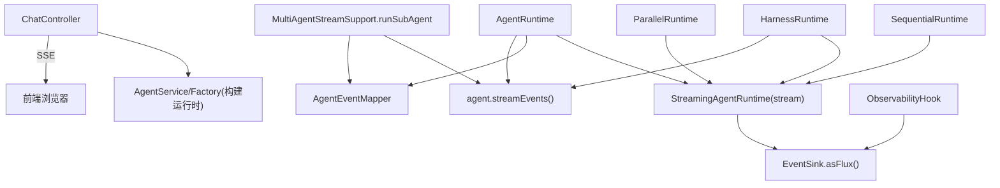
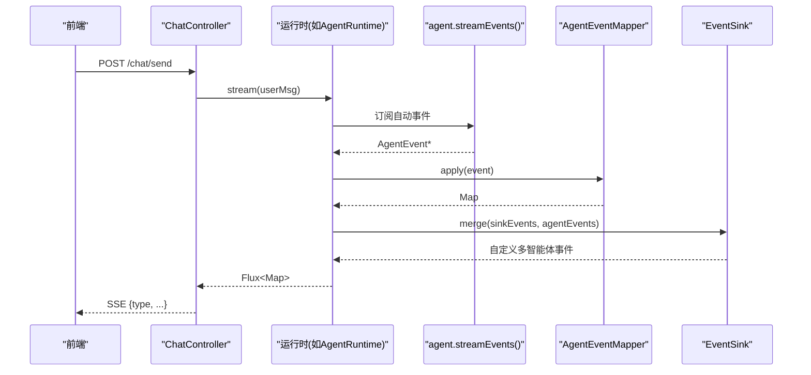
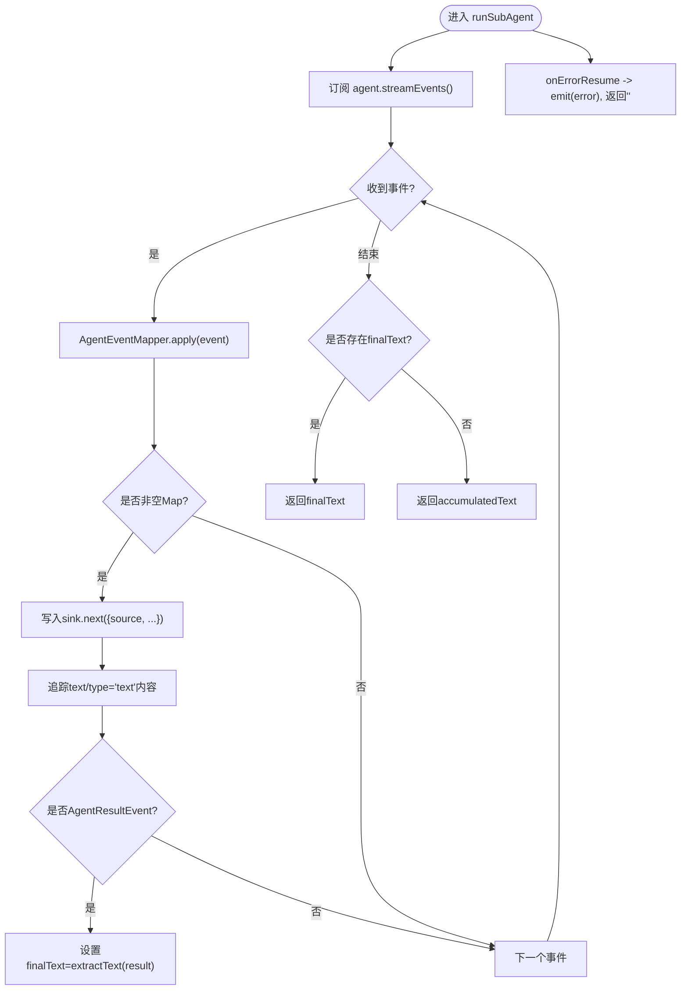
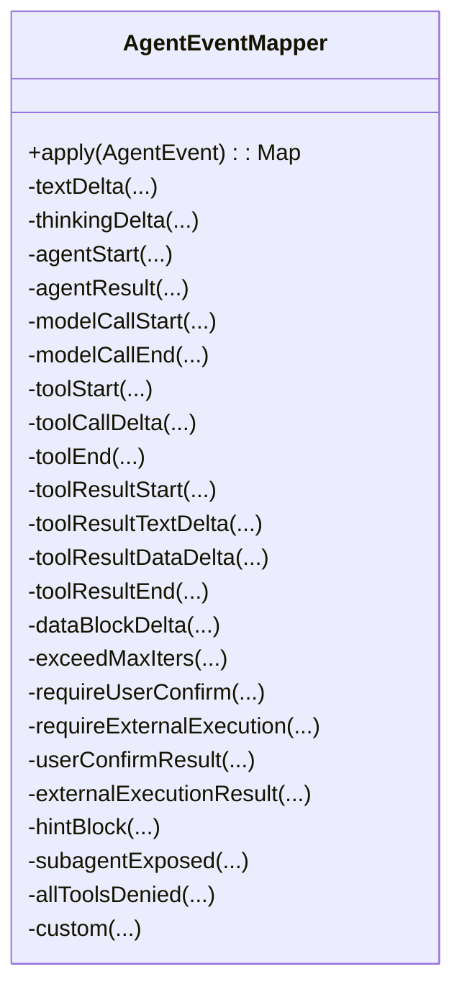
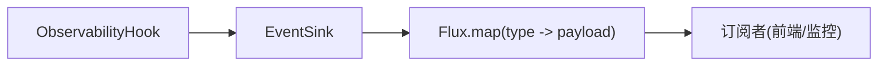
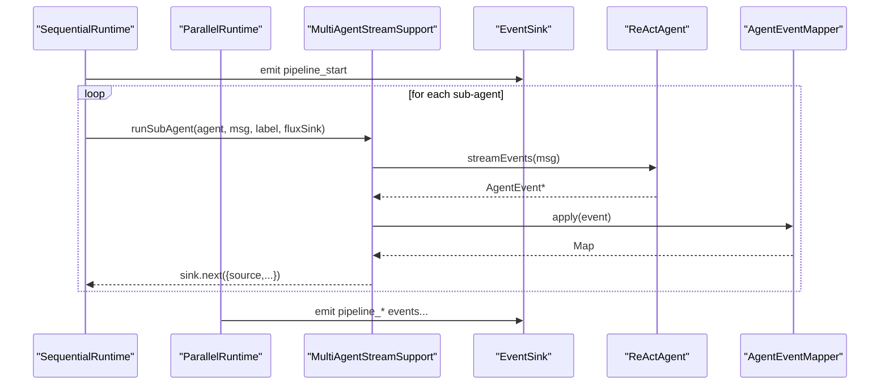
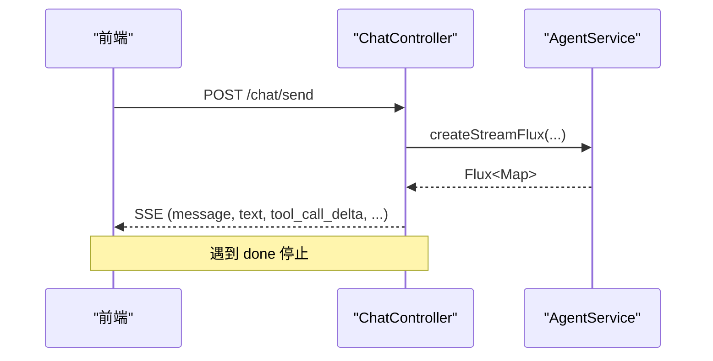
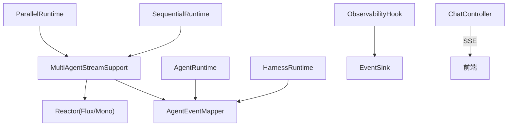

# 流式支持组件

<cite>
**本文引用的文件**
- [MultiAgentStreamSupport.java](file://src/main/java/com/skloda/agentscope/runtime/MultiAgentStreamSupport.java)
- [AgentEventMapper.java](file://src/main/java/com/skloda/agentscope/runtime/AgentEventMapper.java)
- [ObservabilityHook.java](file://src/main/java/com/skloda/agentscope/hook/ObservabilityHook.java)
- [EventSink.java](file://src/main/java/com/skloda/agentscope/runtime/EventSink.java)
- [StreamingAgentRuntime.java](file://src/main/java/com/skloda/agentscope/runtime/StreamingAgentRuntime.java)
- [AgentRuntime.java](file://src/main/java/com/skloda/agentscope/runtime/AgentRuntime.java)
- [HarnessRuntime.java](file://src/main/java/com/skloda/agentscope/harness/HarnessRuntime.java)
- [SequentialRuntime.java](file://src/main/java/com/skloda/agentscope/runtime/SequentialRuntime.java)
- [ParallelRuntime.java](file://src/main/java/com/skloda/agentscope/runtime/ParallelRuntime.java)
- [ChatController.java](file://src/main/java/com/skloda/agentscope/controller/ChatController.java)
- [ChatEvent.java](file://src/main/java/com/skloda/agentscope/model/ChatEvent.java)
- [MultiAgentStreamSupportTest.java](file://src/test/java/com/skloda/agentscope/runtime/MultiAgentStreamSupportTest.java)
- [AgentEventMapperTest.java](file://src/test/java/com/skloda/agentscope/runtime/AgentEventMapperTest.java)
</cite>

## 目录
1. [简介](#简介)
2. [项目结构](#项目结构)
3. [核心组件](#核心组件)
4. [架构总览](#架构总览)
5. [详细组件分析](#详细组件分析)
6. [依赖关系分析](#依赖关系分析)
7. [性能考量](#性能考量)
8. [故障排查指南](#故障排查指南)
9. [结论](#结论)
10. [附录](#附录)

## 简介
本技术文档聚焦于“流式支持组件”，系统性地阐述多智能体流式处理能力、事件映射与可观测性集成，并解释错误处理策略、超时与资源管理方式。目标是帮助开发者深入理解：
- MultiAgentStreamSupport 提供的 runSubAgent 如何实现子代理执行、事件转发和最终文本提取
- AgentEventMapper 如何将 AgentScope 的 AgentEvent 转换为 SSE 友好的 Map（前端通过 type 路由渲染）
- ObservabilityHook 与 EventSink 如何提供统一的可观测性与事件总线能力
- 流式接口在控制器层如何暴露给前端以及最佳实践与常见问题的解决方法

## 项目结构
围绕流式能力的核心位于 runtime、hook、harness、model 与 controller 等包中：
- runtime 提供统一 StreamingAgentRuntime 接口及各类编排运行时（顺序、并行、 Harness）
- hook 封装 ObservabilityHook，内部聚合 EventSink 作为手动事件的发布器
- harness 将 HarnessAgent 接入统一的 streaming 管道
- model 提供 ChatEvent 用于统一的 “done/error” 信号
- controller 负责 HTTP SSE 出口、异常包装与完成控制

图示来源
- [ChatController.java:117-153](file://src/main/java/com/skloda/agentscope/controller/ChatController.java#L117-L153)
- [StreamingAgentRuntime.java:9-20](file://src/main/java/com/skloda/agentscope/runtime/StreamingAgentRuntime.java#L9-L20)
- [AgentRuntime.java:67-142](file://src/main/java/com/skloda/agentscope/runtime/AgentRuntime.java#L67-L142)
- [HarnessRuntime.java:49-63](file://src/main/java/com/skloda/agentscope/harness/HarnessRuntime.java#L49-L63)
- [SequentialRuntime.java:37-89](file://src/main/java/com/skloda/agentscope/runtime/SequentialRuntime.java#L37-L89)
- [ParallelRuntime.java:38-95](file://src/main/java/com/skloda/agentscope/runtime/ParallelRuntime.java#L38-L95)
- [EventSink.java:19-37](file://src/main/java/com/skloda/agentscope/runtime/EventSink.java#L19-L37)
- [ObservabilityHook.java:16-67](file://src/main/java/com/skloda/agentscope/hook/ObservabilityHook.java#L16-L67)
- [AgentEventMapper.java:64-105](file://src/main/java/com/skloda/agentscope/runtime/AgentEventMapper.java#L64-L105)

章节来源
- [ChatController.java:117-153](file://src/main/java/com/skloda/agentscope/controller/ChatController.java#L117-L153)
- [StreamingAgentRuntime.java:9-20](file://src/main/java/com/skloda/agentscope/runtime/StreamingAgentRuntime.java#L9-L20)
- [EventSink.java:19-37](file://src/main/java/com/skloda/agentscope/runtime/EventSink.java#L19-L37)
- [ObservabilityHook.java:16-67](file://src/main/java/com/skloda/agentscope/hook/ObservabilityHook.java#L16-L67)

## 核心组件
- MultiAgentStreamSupport：提供 extractText 与 runSubAgent。runSubAgent 使用 agent.streamEvents 建立订阅链路，对每个 AgentEvent 进行映射并携带 sourceLabel 推入外层 FluxSink；同时捕获最终结果（优先 AgentResultEvent），失败时产出 error 事件并返回空字符串保证编排链路的健壮性。
- AgentEventMapper：纯函数实现，覆盖 AgentScope 全部 AgentEventType，输出为 Map<String,Object> 格式以匹配前端 SSE 消费侧的 type 分发逻辑。边界类事件被丢弃以减少噪音。
- ObservabilityHook 与 EventSink：统一发布自定义多智能体事件（pipeline/routing/handoff/loop/graph/roundtable/task），通过 Sinks.Many.multicast 实现背压缓冲的 Flux 广播；前端可将“done”与业务状态合并显示。
- StreamingAgentRuntime：统一抽象出 stream(Msg) 与 getHook()/close() 生命周期契约；多个实现（AgentRuntime、HarnessRuntime、SequentialRuntime、ParallelRuntime）复用同一套事件模型。

章节来源
- [MultiAgentStreamSupport.java:17-119](file://src/main/java/com/skloda/agentscope/runtime/MultiAgentStreamSupport.java#L17-L119)
- [AgentEventMapper.java:39-105](file://src/main/java/com/skloda/agentscope/runtime/AgentEventMapper.java#L39-L105)
- [ObservabilityHook.java:16-67](file://src/main/java/com/skloda/agentscope/hook/ObservabilityHook.java#L16-L67)
- [EventSink.java:15-62](file://src/main/java/com/skloda/agentscope/runtime/EventSink.java#L15-L62)
- [StreamingAgentRuntime.java:9-20](file://src/main/java/com/skloda/agentscope/runtime/StreamingAgentRuntime.java#L9-L20)

## 架构总览
从客户端请求到前端展示的关键路径：
1. 控制器层接收 /chat/send 请求，构造 Msg，调用相应运行时的 stream()
2. 运行时将来自 agent.streamEvents() 的自动事件与 EventSink 的自定义事件合并，统一经过 AgentEventMapper 映射为 SSE payload
3. 控制器将 Map 序列化为 JSON，用 ServerSentEvent 推送到前端
4. 前端基于事件 type（text/thinking/tool_start/llm_end/done/pending_approval 等）进行逐步渲染或状态同步

图示来源
- [ChatController.java:122-153](file://src/main/java/com/skloda/agentscope/controller/ChatController.java#L122-L153)
- [AgentRuntime.java:94-128](file://src/main/java/com/skloda/agentscope/runtime/AgentRuntime.java#L94-L128)
- [AgentEventMapper.java:64-105](file://src/main/java/com/skloda/agentscope/runtime/AgentEventMapper.java#L64-L105)
- [EventSink.java:19-37](file://src/main/java/com/skloda/agentscope/runtime/EventSink.java#L19-L37)

## 详细组件分析

### MultiAgentStreamSupport：子代理流式桥接
- runSubAgent 工作原理
  - 使用 agent.streamEvents(msg) 获取 AgentEvent 流
  - 对每个事件调用 AgentEventMapper.apply，得到 Map
  - 将 sourceLabel 附加到每个事件 Map 上以便前端区分事件来源
  - 跟踪累积 text 与最终结果，当出现 AgentResultEvent 时使用其 Msg，否则回退到累积的 text delta
  - 任何异常触发 onError 回调并发出 error 事件，最后返回空字符串以保持 Mono 链稳定

图示来源
- [MultiAgentStreamSupport.java:74-118](file://src/main/java/com/skloda/agentscope/runtime/MultiAgentStreamSupport.java#L74-L118)

章节来源
- [MultiAgentStreamSupport.java:43-119](file://src/main/java/com/skloda/agentscope/runtime/MultiAgentStreamSupport.java#L43-L119)
- [MultiAgentStreamSupportTest.java:49-109](file://src/test/java/com/skloda/agentscope/runtime/MultiAgentStreamSupportTest.java#L49-L109)

### AgentEventMapper：事件映射机制
- 映射范围：覆盖全部 AgentEventType，包括文本/思考增量、工具调用全生命周期、模型调用、结果、提示块、外部执行、用户确认、子代理曝光等
- 映射策略：
  - 文本/思考增量直接转换为 type="text"/"thinking"，content 为增量片段
  - 工具调用 start/delta/end/result 均映射为具体 type 及字段（toolName、toolCallId、content 等）
  - 模型调用结束时附带 token 用量信息
  - block boundary（开始/结束）事件返回 null 被丢弃，避免 UI 抖动
  - 错误兜底：try/catch 包裹映射过程，遇错返回 error 事件，不影响上游流
- 前端消费：通过 payload.type 决定渲染分支（如 llm_end 更新 token 统计、pending_approval 弹出审批框等）

图示来源
- [AgentEventMapper.java:64-105](file://src/main/java/com/skloda/agentscope/runtime/AgentEventMapper.java#L64-L105)

章节来源
- [AgentEventMapper.java:64-105](file://src/main/java/com/skloda/agentscope/runtime/AgentEventMapper.java#L64-L105)
- [AgentEventMapperTest.java:63-200](file://src/test/java/com/skloda/agentscope/runtime/AgentEventMapperTest.java#L63-L200)

### ObservabilityHook 与 EventSink：可观测性集成
- EventSink
  - 基于 Reactor Sinks.Many 的多播总线，backpressure 策略为 onBackpressureBuffer，适合长连接多订阅者场景
  - 提供类型化便捷方法发射 pipeline_step_start/end、routing_decision/handoff 等高级语义事件，附带 timestamp 字段便于时序分析
  - complete() 方法用于标记流结束，配合 merge 使得最终能发出 done 事件，避免悬挂连接
- ObservabilityHook
  - 对外暴露 addConsumer/BiConsumer 以便旧钩子消费者订阅所有事件
  - 将所有 pipeline/routing/handoff/loop/graph/roundtable/task 相关事件统一转发到 EventSink
  - 与运行时组合后，可同时获得自动（agent lifecycle）与手动（业务流程）两类事件

图示来源
- [ObservabilityHook.java:16-67](file://src/main/java/com/skloda/agentscope/hook/ObservabilityHook.java#L16-L67)
- [EventSink.java:19-151](file://src/main/java/com/skloda/agentscope/runtime/EventSink.java#L19-L151)

章节来源
- [ObservabilityHook.java:16-67](file://src/main/java/com/skloda/agentscope/hook/ObservabilityHook.java#L16-L67)
- [EventSink.java:15-151](file://src/main/java/com/skloda/agentscope/runtime/EventSink.java#L15-L151)

### 运行时流式整合
- AgentRuntime
  - 合并 EventSink 与 agent.streamEvents 的 event 流
  - 针对审批恢复路径创建独立 resume 流，保持前后一致性（仍然产生 full typed 事件而非仅最终文本）
  - 流结束后根据 ApprovalMiddleware 决定是否补充 pending_approval 事件，随后拼接一个 “done” 事件并以 doOnComplete/doOnCancel/close 清理资源
- SequentialRuntime/ParallelRuntime
  - 使用 MultiAgentStreamSupport.runSubAgent 驱动各子代理
  - 记录 step 耗时并通过 hook.emitPipelineStepEnd 上报
  - 聚合结果并在末尾输出 pipeline 级别事件与 “done”

图示来源
- [SequentialRuntime.java:37-89](file://src/main/java/com/skloda/agentscope/runtime/SequentialRuntime.java#L37-L89)
- [ParallelRuntime.java:38-95](file://src/main/java/com/skloda/agentscope/runtime/ParallelRuntime.java#L38-L95)
- [MultiAgentStreamSupport.java:74-118](file://src/main/java/com/skloda/agentscope/runtime/MultiAgentStreamSupport.java#L74-L118)

章节来源
- [AgentRuntime.java:94-142](file://src/main/java/com/skloda/agentscope/runtime/AgentRuntime.java#L94-L142)
- [SequentialRuntime.java:37-99](file://src/main/java/com/skloda/agentscope/runtime/SequentialRuntime.java#L37-L99)
- [ParallelRuntime.java:38-105](file://src/main/java/com/skloda/agentscope/runtime/ParallelRuntime.java#L38-L105)

### 控制器与前端交互
- ChatController.sendMessage
  - 参数校验（至少包含消息或附件）
  - 生成会话标识并在首个事件中透出
  - 取流、直到遇到 “done” 才结束；将 Map 转为 JSON 通过 ServerSentEvent 发送
  - 错误路径统一包装为 ChatEvent.error，并以 “done” 收尾
- HITL 审批
  - approve/reject 两个分支，分别以不同 Msg 发起恢复流，同样遵循 “done” 收尾

图示来源
- [ChatController.java:122-186](file://src/main/java/com/skloda/agentscope/controller/ChatController.java#L122-L186)
- [ChatEvent.java:11-39](file://src/main/java/com/skloda/agentscope/model/ChatEvent.java#L11-L39)

章节来源
- [ChatController.java:77-153](file://src/main/java/com/skloda/agentscope/controller/ChatController.java#L77-L153)
- [ChatEvent.java:11-39](file://src/main/java/com/skloda/agentscope/model/ChatEvent.java#L11-L39)

### 前端集成示例与建议
- 建立 SSE 连接并逐条处理事件
  - 监听 message 事件，按 payload.type 路由：
    - thinking：追加思考过程
    - text：增量追加答案
    - tool_start/tool_call_delta/tool_result_*：在时间线中展示工具执行情况与进度
    - llm_start/llm_end：记录 token 使用
    - pipeline_*/routing_*/handoff_*/loop_*/graph_*/roundtable_*/task_*：用于可视化工作流状态与决策过程
    - pending_approval：弹出审批界面
    - done：标记当前会话完成，重新启用输入
- 建议
  - 使用带 source 的事件区分多智能体协作中的不同专家节点
  - 保留 toolCallId 以便前后端关联同一工具调用的起止/结果事件
  - 在断网/重连时，利用 sessionInfo 或服务端记忆重建上下文

## 依赖关系分析
- 松耦合设计
  - MultiAgentStreamSupport 不直接依赖具体运行时，只通过 ReActAgent 的 streamEvents 与外部 FluxSink 通信
  - AgentEventMapper 是无副作用纯函数，便于隔离测试与横向扩展新事件类型
  - ObservabilityHook/EventSink 解耦了业务流控制与可观测数据收集
- 关键耦合点
  - AgentRuntime/HarnessRuntime/CompositeRuntime 强依赖 AgentEventMapper 来统一映射 AgentScope 原生事件
  - 前端通过稳定的 type 协议与后端约定紧密绑定，需在新增事件类型时同步前端分支

图示来源
- [MultiAgentStreamSupport.java:74-118](file://src/main/java/com/skloda/agentscope/runtime/MultiAgentStreamSupport.java#L74-L118)
- [AgentEventMapper.java:64-105](file://src/main/java/com/skloda/agentscope/runtime/AgentEventMapper.java#L64-L105)
- [AgentRuntime.java:94-142](file://src/main/java/com/skloda/agentscope/runtime/AgentRuntime.java#L94-L142)
- [HarnessRuntime.java:49-63](file://src/main/java/com/skloda/agentscope/harness/HarnessRuntime.java#L49-L63)
- [SequentialRuntime.java:37-89](file://src/main/java/com/skloda/agentscope/runtime/SequentialRuntime.java#L37-L89)
- [ParallelRuntime.java:38-95](file://src/main/java/com/skloda/agentscope/runtime/ParallelRuntime.java#L38-L95)

章节来源
- [MultiAgentStreamSupport.java:17-119](file://src/main/java/com/skloda/agentscope/runtime/MultiAgentStreamSupport.java#L17-L119)
- [AgentRuntime.java:67-142](file://src/main/java/com/skloda/agentscope/runtime/AgentRuntime.java#L67-L142)
- [HarnessRuntime.java:49-63](file://src/main/java/com/skloda/agentscope/harness/HarnessRuntime.java#L49-L63)

## 性能考量
- 流式吞吐
  - 使用 Reactor Flux/ Mono 构建无阻塞流水线，最大化吞吐并降低内存驻留
  - EventSink 采用 onBackpressureBuffer 策略，避免快速生产者拖慢慢消费者导致的丢消息
- 资源管理
  - 控制器层 takeUntil("done") 尽早终止下游压力
  - 运行时 doOnCancel/doOnComplete 主动 close，确保 EventSink 与潜在资源释放
  - 审批恢复流中仍复用 streamEvents，避免额外上下文拷贝
- 映射效率
  - AgentEventMapper 对不需要的事件（block boundaries）直接丢弃，减少前端冗余渲染开销
  - 在 tool_start 后可按需注入 MCP 溯源信息（由运行时在 mapAgentEvent 中处理，不在 mapper 内部）

[本节为通用指导，无需特定源码引用]

## 故障排查指南
- 流无法结束
  - 现象：前端一直等待，无法点击新消息
  - 可能原因：EventSink 未在合适时机 complete；合并后的流未被正确关闭
  - 排查要点：检查运行时 doFinally/complete 是否在 agentEvents 末端；观察是否有未完成的子任务
  - 涉及代码位置
    - [AgentRuntime.java:112-128](file://src/main/java/com/skloda/agentscope/runtime/AgentRuntime.java#L112-L128)
    - [EventSink.java:35-37](file://src/main/java/com/skloda/agentscope/runtime/EventSink.java#L35-L37)
- 丢失中间状态
  - 现象：工具调用没有看到执行过程或仅有最终结果
  - 可能原因：使用了会丢弃非文本事件的路径（例如旧版 call 模式）；或过滤器过滤掉必要事件
  - 解决：确保走 streamEvents + AgentEventMapper 的统一路径
  - 涉及代码位置
    - [AgentRuntime.java:156-168](file://src/main/java/com/skloda/agentscope/runtime/AgentRuntime.java#L156-L168)
    - [AgentEventMapper.java:96-99](file://src/main/java/com/skloda/agentscope/runtime/AgentEventMapper.java#L96-L99)
- 文本结果不一致
  - 现象：最终文本与增量文本拼接不一致
  - 原因：优先采用 AgentResultEvent 的结果，若缺失则回退到累积 delta
  - 验证方法：参考单元测试中对“优先 finalText”的回退行为
  - 涉及代码位置
    - [MultiAgentStreamSupport.java:98-117](file://src/main/java/com/skloda/agentscope/runtime/MultiAgentStreamSupport.java#L98-L117)
    - [MultiAgentStreamSupportTest.java:49-91](file://src/test/java/com/skloda/agentscope/runtime/MultiAgentStreamSupportTest.java#L49-L91)
- 事件未映射
  - 现象：新增了 AgentEvent 却看不到对应前端效果
  - 可能原因：新事件类型未加入 switch；或映射结果为 null（被丢弃）
  - 定位：查看 AgentEventMapper 的 switch 覆盖范围与 return null 的条件
  - 涉及代码位置
    - [AgentEventMapper.java:69-100](file://src/main/java/com/skloda/agentscope/runtime/AgentEventMapper.java#L69-L100)

章节来源
- [AgentRuntime.java:112-168](file://src/main/java/com/skloda/agentscope/runtime/AgentRuntime.java#L112-L168)
- [EventSink.java:35-37](file://src/main/java/com/skloda/agentscope/runtime/EventSink.java#L35-L37)
- [MultiAgentStreamSupport.java:98-117](file://src/main/java/com/skloda/agentscope/runtime/MultiAgentStreamSupport.java#L98-L117)
- [MultiAgentStreamSupportTest.java:49-91](file://src/test/java/com/skloda/agentscope/runtime/MultiAgentStreamSupportTest.java#L49-L91)
- [AgentEventMapper.java:69-100](file://src/main/java/com/skloda/agentscope/runtime/AgentEventMapper.java#L69-L100)

## 结论
该流式支持体系通过统一抽象与纯函数映射实现了高内聚、低耦合的 SSE 事件通道。MultiAgentStreamSupport 提供了跨编排模式的流式桥接能力；AgentEventMapper 确保了稳定的事件契约；ObservabilityHook/EventSink 让多智能体协同过程可观测、可诊断。结合控制器层的错误处理与资源清理，整体具备高可用性、易扩展性与良好的前端集成体验。

[本节为总结性内容，无需特定源码引用]

## 附录

### SSE 接口与使用要点
- 入口：POST /chat/send，返回 TEXT_EVENT_STREAM
- 事件类型（部分）：text、thinking、tool_start、tool_call_delta、tool_result_*、llm_start、llm_end、pipeline_*、routing_*、handoff_*、loop_*、graph_*、roundtable_*、task_*、pending_approval、done、error
- 关键字段
  - type：前端分支依据
  - content：文本/增量内容
  - toolName、toolCallId：工具调用追踪
  - inputTokens/outputTokens/totalTokens：模型调用用量
  - source：在多智能体场景中标识事件来源节点
  - approvalId、toolCalls：审批交互相关

章节来源
- [ChatController.java:122-153](file://src/main/java/com/skloda/agentscope/controller/ChatController.java#L122-L153)
- [EventSink.java:40-62](file://src/main/java/com/skloda/agentscope/runtime/EventSink.java#L40-L62)
- [ChatEvent.java:21-39](file://src/main/java/com/skloda/agentscope/model/ChatEvent.java#L21-L39)