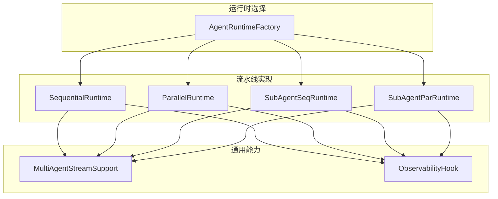
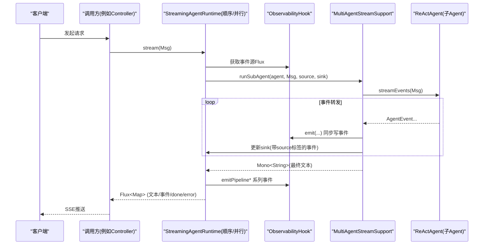
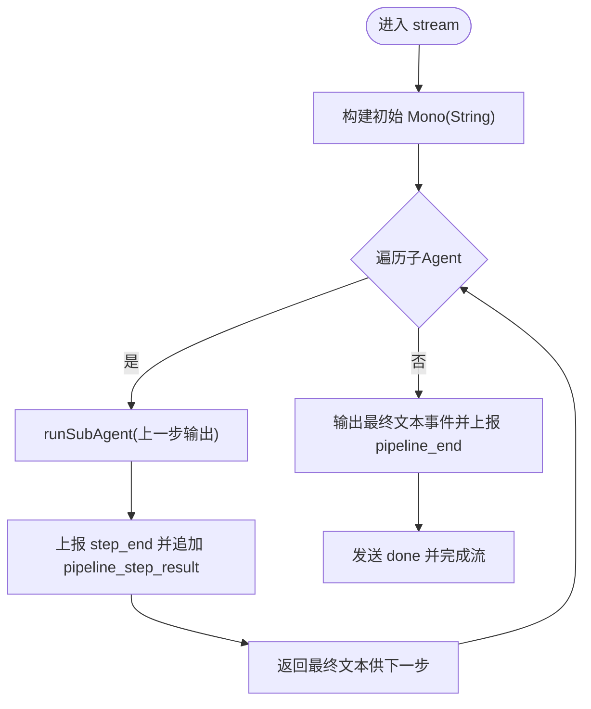
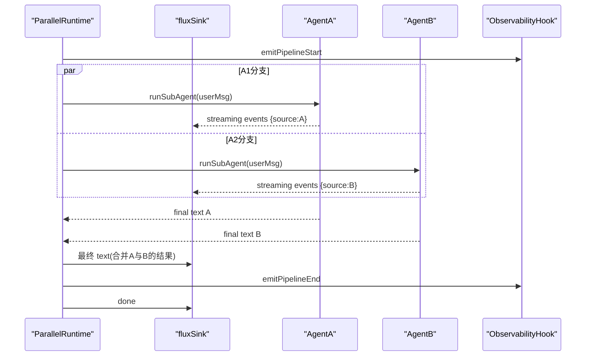
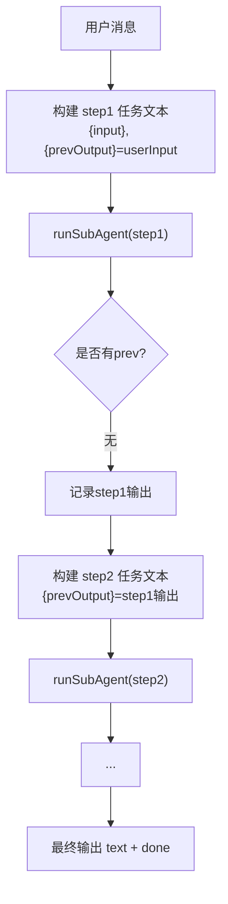
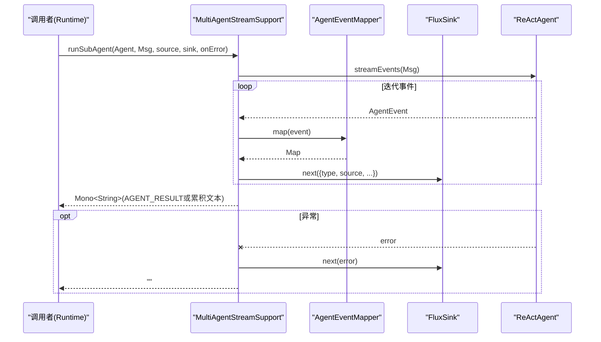
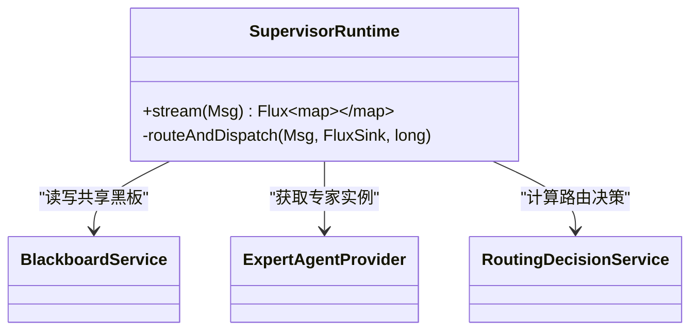
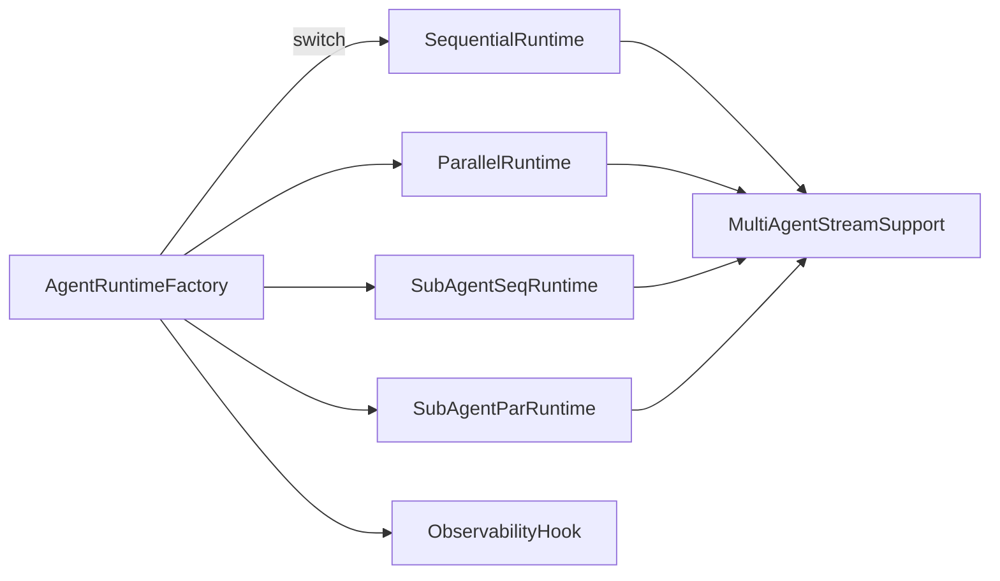

# 流水线执行模式

<cite>
**本文引用的文件**
- [SequentialRuntime.java](file://src/main/java/com/skloda/agentscope/runtime/SequentialRuntime.java)
- [ParallelRuntime.java](file://src/main/java/com/skloda/agentscope/runtime/ParallelRuntime.java)
- [SubAgentSeqRuntime.java](file://src/main/java/com/skloda/agentscope/runtime/SubAgentSeqRuntime.java)
- [SubAgentParRuntime.java](file://src/main/java/com/skloda/agentscope/runtime/SubAgentParRuntime.java)
- [MultiAgentStreamSupport.java](file://src/main/java/com/skloda/agentscope/runtime/MultiAgentStreamSupport.java)
- [AgentRuntimeFactory.java](file://src/main/java/com/skloda/agentscope/runtime/AgentRuntimeFactory.java)
- [SubAgentConfig.java](file://src/main/java/com/skloda/agentscope/agent/SubAgentConfig.java)
- [SupervisorRuntime.java](file://src/main/java/com/skloda/agentscope/blackboard/SupervisorRuntime.java)
- [SequentialRuntimeTest.java](file://src/test/java/com/skloda/agentscope/runtime/SequentialRuntimeTest.java)
- [ParallelRuntimeTest.java](file://src/test/java/com/skloda/agentscope/runtime/ParallelRuntimeTest.java)
- [MultiAgentStreamSupportTest.java](file://src/test/java/com/skloda/agentscope/runtime/MultiAgentStreamSupportTest.java)
- [agents.yml](file://src/main/resources/config/agents.yml)
</cite>

## 目录
1. [简介](#简介)
2. [项目结构](#项目结构)
3. [核心组件](#核心组件)
4. [架构总览](#架构总览)
5. [详细组件分析](#详细组件分析)
6. [依赖关系分析](#依赖关系分析)
7. [性能考虑](#性能考虑)
8. [故障排查指南](#故障排查指南)
9. [结论](#结论)
10. [附录：配置示例与业务场景](#附录配置示例与业务场景)

## 简介
本文件聚焦 AgentScope 的“流水线执行模式”，系统性地说明顺序与并行两种流水线及其子 Agent 编排的实现机制：
- SequentialRuntime：以链式方式按序调用各 ReActAgent，将上一步的最终文本传递给下一步。
- ParallelRuntime：并发调度多个 ReActAgent，并聚合结果输出。
- SubAgentSeqRuntime / SubAgentParRuntime：以任务模板为单元编排子 Agent，支持基于上下文变量的动态任务注入与结果串联或汇总。
- MultiAgentStreamSupport：统一的流式桥接工具，负责事件转送、来源标记、最终文本提取及错误处理。

面向读者包括一线开发者与维护者，目标是帮助快速理解如何配置、编排与调试多 Agent 流水线。

## 项目结构
流水线相关能力集中在 runtime 包中：
- 顺序流水线：SequentialRuntime
- 并行流水线：ParallelRuntime
- 子 Agent 编排（顺序/并行）：SubAgentSeqRuntime、SubAgentParRuntime
- 统一流式辅助：MultiAgentStreamSupport
- 运行时选择：AgentRuntimeFactory 将不同 agentId 映射到具体运行时实现
- 配置模型：SubAgentConfig 提供 sub-agent 的任务描述与模板字段
- 黑版协作：SupervisorRuntime 提供以共享黑板为核心的专家路由编排（与流水线模式配合构成更高维度的协作范式）

图表来源
- [AgentRuntimeFactory.java:41-60](file://src/main/java/com/skloda/agentscope/runtime/AgentRuntimeFactory.java#L41-L60)
- [SequentialRuntime.java:22-89](file://src/main/java/com/skloda/agentscope/runtime/SequentialRuntime.java#L22-L89)
- [ParallelRuntime.java:23-95](file://src/main/java/com/skloda/agentscope/runtime/ParallelRuntime.java#L23-L95)
- [SubAgentSeqRuntime.java:22-105](file://src/main/java/com/skloda/agentscope/runtime/SubAgentSeqRuntime.java#L22-L105)
- [SubAgentParRuntime.java:22-103](file://src/main/java/com/skloda/agentscope/runtime/SubAgentParRuntime.java#L22-L103)
- [MultiAgentStreamSupport.java:36-119](file://src/main/java/com/skloda/agentscope/runtime/MultiAgentStreamSupport.java#L36-L119)

章节来源
- [AgentRuntimeFactory.java:41-60](file://src/main/java/com/skloda/agentscope/runtime/AgentRuntimeFactory.java#L41-L60)
- [SequentialRuntime.java:22-89](file://src/main/java/com/skloda/agentscope/runtime/SequentialRuntime.java#L22-L89)
- [ParallelRuntime.java:23-95](file://src/main/java/com/skloda/agentscope/runtime/ParallelRuntime.java#L23-L95)
- [SubAgentSeqRuntime.java:22-105](file://src/main/java/com/skloda/agentscope/runtime/SubAgentSeqRuntime.java#L22-L105)
- [SubAgentParRuntime.java:22-103](file://src/main/java/com/skloda/agentscope/runtime/SubAgentParRuntime.java#L22-L103)
- [MultiAgentStreamSupport.java:36-119](file://src/main/java/com/skloda/agentscope/runtime/MultiAgentStreamSupport.java#L36-L119)

## 核心组件
- SequentialRuntime：顺序执行、链式传参、逐步观测与结束信号。
- ParallelRuntime：并发执行、结果聚合、步骤级观测。
- SubAgentSeqRuntime：以 SubAgentStep 为单位进行“prevOutput -> next”的模板化串联执行。
- SubAgentParRuntime：以 SubAgentTask 为单位并行派发任务，按 source 标注转发实时事件，完成后聚合。
- MultiAgentStreamSupport：统一封装 agent.streamEvents，将事件通过 FluxSink 转发给前端，同时维护最终文本（优先使用 AGENT_RESULT），提供异常回退路径。

章节来源
- [SequentialRuntime.java:15-99](file://src/main/java/com/skloda/agentscope/runtime/SequentialRuntime.java#L15-L99)
- [ParallelRuntime.java:16-106](file://src/main/java/com/skloda/agentscope/runtime/ParallelRuntime.java#L16-L106)
- [SubAgentSeqRuntime.java:15-105](file://src/main/java/com/skloda/agentscope/runtime/SubAgentSeqRuntime.java#L15-L105)
- [SubAgentParRuntime.java:16-103](file://src/main/java/com/skloda/agentscope/runtime/SubAgentParRuntime.java#L16-L103)
- [MultiAgentStreamSupport.java:17-119](file://src/main/java/com/skloda/agentscope/runtime/MultiAgentStreamSupport.java#L17-L119)

## 架构总览
下图展示从请求到流水线、再到子 Agent 与外部观察点的整体数据流。所有运行时均合并 hook 事件与 pipeline 流，统一向外推送 SSE。

图表来源
- [SequentialRuntime.java:37-89](file://src/main/java/com/skloda/agentscope/runtime/SequentialRuntime.java#L37-L89)
- [ParallelRuntime.java:38-95](file://src/main/java/com/skloda/agentscope/runtime/ParallelRuntime.java#L38-L95)
- [MultiAgentStreamSupport.java:74-119](file://src/main/java/com/skloda/agentscope/runtime/MultiAgentStreamSupport.java#L74-L119)

## 详细组件分析

### SequentialRuntime（顺序流水线）
- 执行机制：
  - 使用 Mono.chain 依次调用每个 ReActAgent，上一步最终文本作为下一步输入。
  - 每步都通过 MultiAgentStreamSupport.runSubAgent 运行，并把 agent 内部 thinking/tool/text 等事件全部转发至前端。
  - 每步开始/结束上报钩子，结束时输出最终文本并推送 done。
- 数据传递：
  - 提取用户消息中的纯文本作为首步输入；后续每步接收上一部的最终文本。
- 终止与关闭：
  - 成功路径：final text → 管道结束 → done；异常路径：error → done。
  - close() 时完成 EventSink。

图表来源
- [SequentialRuntime.java:37-89](file://src/main/java/com/skloda/agentscope/runtime/SequentialRuntime.java#L37-L89)

章节来源
- [SequentialRuntime.java:15-99](file://src/main/java/com/skloda/agentscope/runtime/SequentialRuntime.java#L15-L99)

### ParallelRuntime（并行流水线）
- 并发策略：
  - 将所有子 Agent 的请求并行启动，使用 Flux.merge 聚合结果，最后拼接为一个包含各 Agent 结果的最终文本。
  - 每一子 Agent 的事件都会以 source=agentName 的形式写入统一 sink，前端可区分来源。
- 结果聚合：
  - collectList 后将所有子 Agent 的结果以标题加内容的形式拼接，再发送一个最终的 text 与 done。
- 错误处理：
  - 任一子 Agent 异常会触发 error 事件并被下游吸收。

图表来源
- [ParallelRuntime.java:38-95](file://src/main/java/com/skloda/agentscope/runtime/ParallelRuntime.java#L38-L95)
- [MultiAgentStreamSupport.java:74-119](file://src/main/java/com/skloda/agentscope/runtime/MultiAgentStreamSupport.java#L74-L119)

章节来源
- [ParallelRuntime.java:16-106](file://src/main/java/com/skloda/agentscope/runtime/ParallelRuntime.java#L16-L106)

### SubAgentSeqRuntime（子 Agent 顺序编排）
- 编排模式：
  - 输入是原始用户消息；每一步任务使用 taskTemplate 插值替换 {input} 与 {prevOutput}。
  - 每个步骤通过 runSubAgent 执行并上报 task_* 事件。
  - 前一步最终输出被传入下一步模板，形成强耦合的数据管线。
- 事件契约：
  - 每步完成后推送 task_result，最终推送聚合文本和 done。

图表来源
- [SubAgentSeqRuntime.java:37-92](file://src/main/java/com/skloda/agentscope/runtime/SubAgentSeqRuntime.java#L37-L92)

章节来源
- [SubAgentSeqRuntime.java:15-106](file://src/main/java/com/skloda/agentscope/runtime/SubAgentSeqRuntime.java#L15-L106)

### SubAgentParRuntime（子 Agent 并行编排）
- 并发分发：
  - 为每个 SubAgentTask 构造任务文本（仅替换 {input}），并发执行 runSubAgent。
- 状态与协调：
  - 使用 source 标注区分各任务事件，便于前端渲染。
  - 聚合阶段汇总所有任务的输出并以二级标题组织显示。
- 错误与容错：
  - 子任务异常会被转换 error 事件并最终完成流。

章节来源
- [SubAgentParRuntime.java:22-103](file://src/main/java/com/skloda/agentscope/runtime/SubAgentParRuntime.java#L22-L103)

### MultiAgentStreamSupport（流式桥接器）
职责与关键点：
- extractText：从 Msg 的文本块中拼接最终文本片段。
- runSubAgent：
  - 调用 agent.streamEvents(msg)，通过 AgentEventMapper 将事件映射为标准 Map。
  - 将每个事件推送到外部 fluxSink，并添加 source 标记。
  - 追踪最终文本：优先取 AGENT_RESULT 中的 Msg 文本，否则回退累积 text 事件。
  - 异常处理：捕获异常，下发 error 事件，并返回空字符串避免中断上游链路。

图表来源
- [MultiAgentStreamSupport.java:74-119](file://src/main/java/com/skloda/agentscope/runtime/MultiAgentStreamSupport.java#L74-L119)

章节来源
- [MultiAgentStreamSupport.java:17-119](file://src/main/java/com/skloda/agentscope/runtime/MultiAgentStreamSupport.java#L17-L119)

### SupervisorRuntime（协作型编排参考）
虽然不属于“流水线”直连实现，但它在“多 Agent 协作”中与流水线思路互补：
- 使用共享黑板（SessionBlackboard/BlackboardService）在多个专家 Agent 间协同状态。
- 每次轮次通过路由决策（KEEP/SWITCH/CLARIFY）驱动专家调用，并将用户消息与专家回答记录进 Supervisors AgentState。
- 将专家事件中的敏感类型过滤后合并转发，确保前端体验一致。

图表来源
- [SupervisorRuntime.java:29-156](file://src/main/java/com/skloda/agentscope/blackboard/SupervisorRuntime.java#L29-L156)

章节来源
- [SupervisorRuntime.java:29-156](file://src/main/java/com/skloda/agentscope/blackboard/SupervisorRuntime.java#L29-L156)

## 依赖关系分析
- 运行时选择层：AgentRuntimeFactory 根据配置中的 agentId 解析出 AgentType，进而创建对应运行时实例，支持 SEQUENTIAL、PARALLEL、SUBAGENT_SEQ、SUBAGENT_PAR 等模式。
- 流式基础设施：所有运行时复用同一 ObservabilityHook 事件源，并通过 MultiAgentStreamSupport 完成统一的事件转送与文本提取。
- 配置扩展：SubAgentConfig 定义子 Agent 的描述与任务模板，用于 SubAgent*Runtime 的动态组装。

图表来源
- [AgentRuntimeFactory.java:41-60](file://src/main/java/com/skloda/agentscope/runtime/AgentRuntimeFactory.java#L41-L60)
- [SequentialRuntime.java:37-89](file://src/main/java/com/skloda/agentscope/runtime/SequentialRuntime.java#L37-L89)
- [ParallelRuntime.java:38-95](file://src/main/java/com/skloda/agentscope/runtime/ParallelRuntime.java#L38-L95)
- [SubAgentSeqRuntime.java:37-92](file://src/main/java/com/skloda/agentscope/runtime/SubAgentSeqRuntime.java#L37-L92)
- [SubAgentParRuntime.java:38-89](file://src/main/java/com/skloda/agentscope/runtime/SubAgentParRuntime.java#L38-L89)
- [MultiAgentStreamSupport.java:74-119](file://src/main/java/com/skloda/agentscope/runtime/MultiAgentStreamSupport.java#L74-L119)

章节来源
- [AgentRuntimeFactory.java:41-60](file://src/main/java/com/skloda/agentscope/runtime/AgentRuntimeFactory.java#L41-L60)
- [SubAgentConfig.java:1-17](file://src/main/java/com/skloda/agentscope/agent/SubAgentConfig.java#L1-L17)

## 性能考虑
- 顺序流水线（SequentialRuntime）：适用于严格有依赖且必须串行推进的阶段；优点是可控、错误定位清晰；缺点是总时长累加。
- 并行流水线（ParallelRuntime）：通过并发减少总体延迟，适合相互独立的任务集；需评估下游资源（如模型/磁盘/网络）是否支持高并发。
- 子 Agent 并行（SubAgentParRuntime）：任务粒度更细，结合源标签可精细定位事件；建议对高开销任务控制并发度以避免过载。
- 事件开销：MultiAgentStreamSupport 对每个 AgentEvent 做映射和转发，在高吞吐场景下应关注 sink 后端压力与前端渲染性能。
- 错误隔离：各阶段的错误通过 error 事件透传并由运行时兜底返回空字符串或继续，保障整体流稳定完成。

[本节为通用指导，不直接分析具体文件]

## 故障排查指南
- 事件缺失或不完整：
  - 检查子 Agent 是否确实发出 AGENT_RESULT；若未发出，MultiAgentStreamSupport 会使用累积文本作为回退。参见 [MultiAgentStreamSupport.java:98-118](file://src/main/java/com/skloda/agentscope/runtime/MultiAgentStreamSupport.java#L98-L118)。
- 流水线上游阻塞：
  - 确认上游并未错误地将阻塞式 I/O 放入主线程；必要时在运行时订阅弹性线程（如 SupervisorRuntime 使用了弹性线程），以保证事件及时消费。
- 并发冲突：
  - 并行模式下若下游存在不可重入资源（如单写文件句柄、限流接口），应在应用层做限流或资源池化。
- 配置错误导致空流程：
  - 当配置为空或未启用相应模式时，仍应收到 done；可通过断言或测试验证行为一致性，例如参考 [SequentialRuntimeTest.java:76-84](file://src/test/java/com/skloda/agentscope/runtime/SequentialRuntimeTest.java#L76-L84)。

章节来源
- [MultiAgentStreamSupport.java:98-118](file://src/main/java/com/skloda/agentscope/runtime/MultiAgentStreamSupport.java#L98-L118)
- [SequentialRuntimeTest.java:76-84](file://src/test/java/com/skloda/agentscope/runtime/SequentialRuntimeTest.java#L76-L84)

## 结论
本流水线执行模式通过统一的流式桥接与事件体系，将“顺序/并行/子 Agent 编排”抽象为清晰的运行时实现。顺序流水线保证了数据流转的确定性与可追溯性；并行流水线最大化吞吐与响应速度；子 Agent 模板化进一步提升了灵活性与可配置性。结合 ObservabilityHook 与前端 SSE 适配，整套方案具备高可观测性与良好前端体验。

[本节为总结性内容，不直接分析具体文件]

## 附录：配置示例与业务场景

### 配置示例
- 在 agents.yml 中为新流水线配置 agentId 与 type（SEQUENTIAL/PARALLEL/SUBAGENT_SEQ/SUBAGENT_PAR），并通过 AgentRuntimeFactory 解析创建对应运行时实例。
- 对于 SubAgent 模式，通过 SubAgentConfig 指定 description、role、taskTemplate 等字段，由 SubAgent*Runtime 在执行期装配。

章节来源
- [AgentRuntimeFactory.java:41-60](file://src/main/java/com/skloda/agentscope/runtime/AgentRuntimeFactory.java#L41-L60)
- [SubAgentConfig.java:1-17](file://src/main/java/com/skloda/agentscope/agent/SubAgentConfig.java#L1-L17)
- [agents.yml:1-100](file://src/main/resources/config/agents.yml#L1-L100)

### 典型业务流程示例
- 数据处理管道
  - 顺序：数据校验 → 清洗 → 特征抽取 → 建模预测；每一步严格依赖上一步产出，适合 SequentialRuntime。
  - 并行：对多源数据并行清洗、分别生成中间特征、最后汇聚，适合 ParallelRuntime。
- 文档生成流程
  - 并行检索多篇资料，再由顺序步骤合成报告（引用、校对、排版），即先并行拉取信息，再顺序产出高质量文档。
- 银行发票生成（示例配置已体现）
  - 通过工具与技能联动收集参数，顺序地引导对话、校验信息，最终调用工具生成 Excel/Word 文档并下载。

[本节提供场景化说明，不直接分析具体文件]

### 运行态事件与前后端契约
- 关键事件序列（顺序/并行均适用）：pipeline_start → step_start（可选）→ 子 Agent streaming events → step_end（可选）→ text（最终结果）→ done。异常路径包含 error 事件后跟 done。
- 子 Agent 场景还包含 task_delegate/task_start/task_end/task_aggregate 以及 task_result 事件，便于前端分步展示与分析。

章节来源
- [SequentialRuntime.java:41-84](file://src/main/java/com/skloda/agentscope/runtime/SequentialRuntime.java#L41-L84)
- [ParallelRuntime.java:42-89](file://src/main/java/com/skloda/agentscope/runtime/ParallelRuntime.java#L42-L89)
- [SubAgentSeqRuntime.java:41-88](file://src/main/java/com/skloda/agentscope/runtime/SubAgentSeqRuntime.java#L41-L88)
- [SubAgentParRuntime.java:41-86](file://src/main/java/com/skloda/agentscope/runtime/SubAgentParRuntime.java#L41-L86)

### 测试验证要点
- 顺序流水线：验证多 step 的 streaming 事件被转发，以及链式输出是否正确注入下一步；参见 [SequentialRuntimeTest.java:32-73](file://src/test/java/com/skloda/agentscope/runtime/SequentialRuntimeTest.java#L32-L73)。
- 并行流水线：验证并发事件的转发与结果聚合；参见 [ParallelRuntimeTest.java:29-59](file://src/test/java/com/skloda/agentscope/runtime/ParallelRuntimeTest.java#L29-L59)。
- 流式桥接：验证 extractText 拼接、AGENT_RESULT 优先、fallback 到累积文本、以及错误恢复；参见 [MultiAgentStreamSupportTest.java:32-109](file://src/test/java/com/skloda/agentscope/runtime/MultiAgentStreamSupportTest.java#L32-L109)。

章节来源
- [SequentialRuntimeTest.java:32-73](file://src/test/java/com/skloda/agentscope/runtime/SequentialRuntimeTest.java#L32-L73)
- [ParallelRuntimeTest.java:29-59](file://src/test/java/com/skloda/agentscope/runtime/ParallelRuntimeTest.java#L29-L59)
- [MultiAgentStreamSupportTest.java:32-109](file://src/test/java/com/skloda/agentscope/runtime/MultiAgentStreamSupportTest.java#L32-L109)