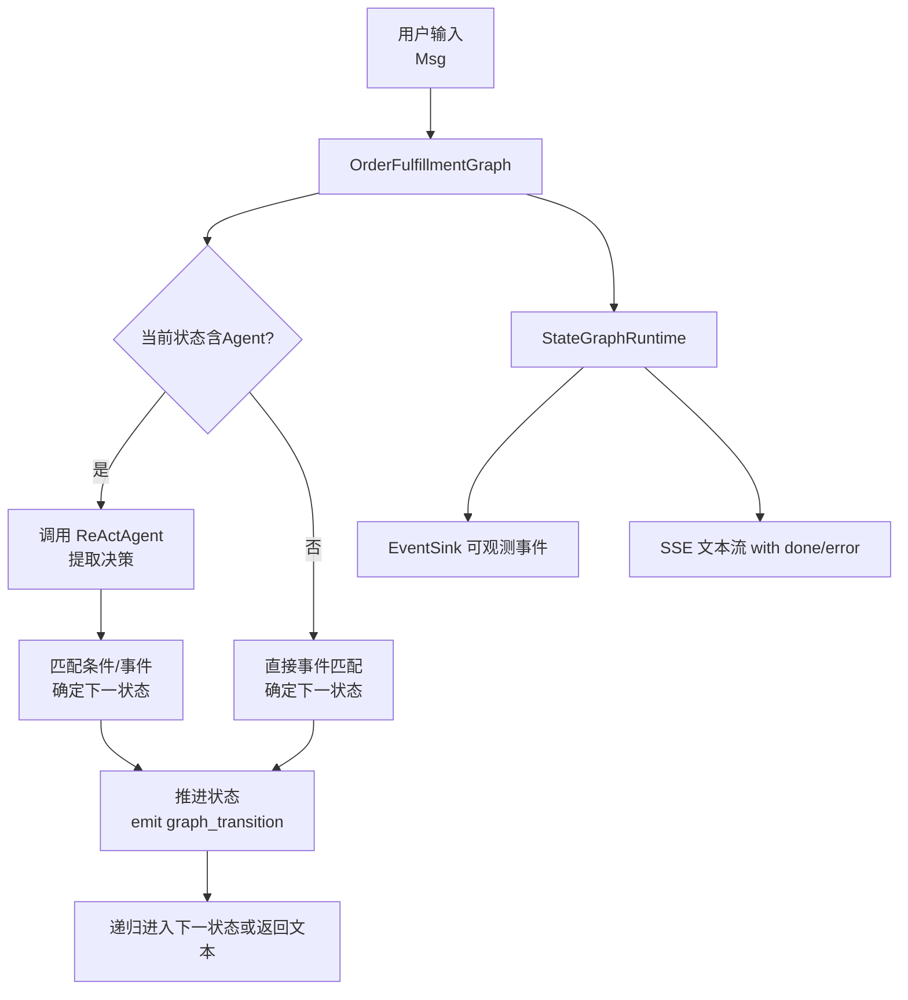
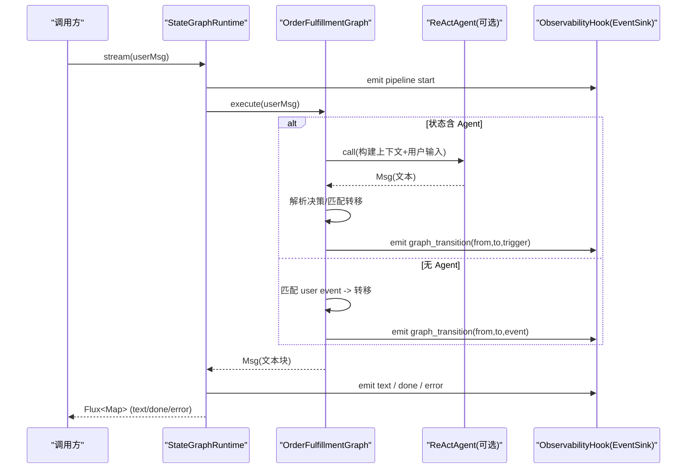
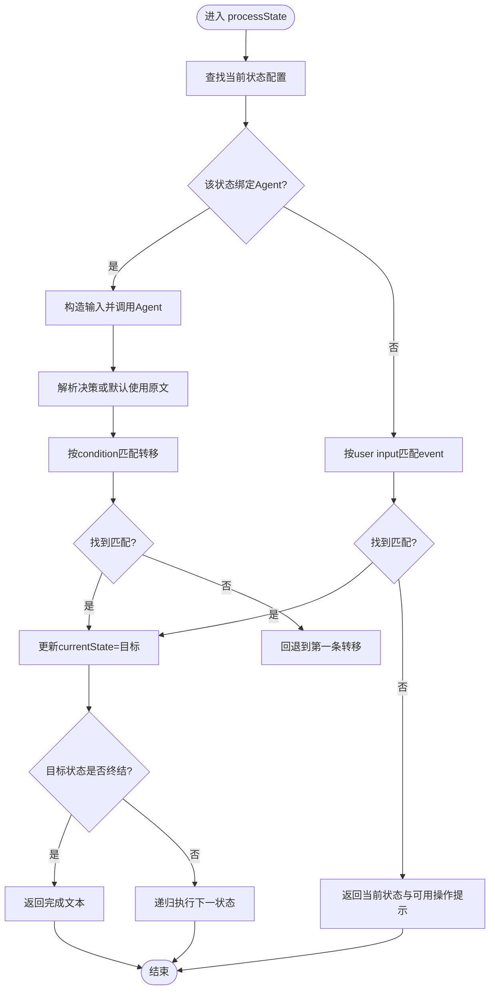
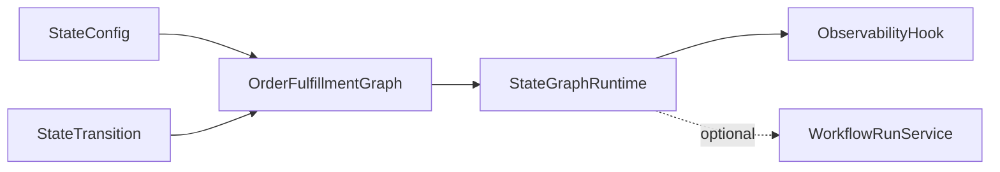

# 状态图编排

<cite>
**本文引用的文件**
- [OrderFulfillmentGraph.java](file://src/main/java/com/skloda/agentscope/composite/graph/OrderFulfillmentGraph.java)
- [StateGraphRuntime.java](file://src/main/java/com/skloda/agentscope/runtime/StateGraphRuntime.java)
- [StateConfig.java](file://src/main/java/com/skloda/agentscope/agent/StateConfig.java)
- [StateTransition.java](file://src/main/java/com/skloda/agentscope/agent/StateTransition.java)
- [WorkflowRunService.java](file://src/main/java/com/skloda/agentscope/service/WorkflowRunService.java)
- [WorkflowRunSnapshot.java](file://src/main/java/com/skloda/agentscope/model/WorkflowRunSnapshot.java)
- [ObservabilityHook.java](file://src/main/java/com/skloda/agentscope/hook/ObservabilityHook.java)
- [OrderFulfillmentGraphTest.java](file://src/test/java/com/skloda/agentscope/composite/graph/OrderFulfillmentGraphTest.java)
- [StateGraphRuntimeTest.java](file://src/test/java/com/skloda/agentscope/runtime/StateGraphRuntimeTest.java)
</cite>

## 目录
1. [简介](#简介)
2. [项目结构与定位](#项目结构与定位)
3. [核心组件](#核心组件)
4. [架构总览](#架构总览)
5. [详细组件分析](#详细组件分析)
6. [依赖关系分析](#依赖关系分析)
7. [性能考量](#性能考量)
8. [故障排查指南](#故障排查指南)
9. [结论](#结论)
10. [附录：配置与最佳实践](#附录配置与最佳实践)

## 简介
本文件聚焦状态图编排模式，围绕订单履行工作流（OrderFulfillmentGraph）深入解析其状态机设计、状态转移控制、运行时生命周期管理以及可观测集成。重点解释 StateConfig 与 StateTransition 的配置语义与匹配机制，并说明 StateGraphRuntime 如何以响应式流的方式承载状态图的执行、事件转发和错误处理。文档同时给出复杂工作流的编排能力示例、调试方法和优化策略，并以电商订单处理与业务审批场景为参考落地要点。

## 项目结构与定位
本项目基于 AgentScope 的响应式与多 Agent 协作能力，将“状态图编排”作为复合智能体的一种实现路径。状态图本身不依赖数据库持久化层，而是利用内部运行态与 EventSink 暴露的可观测事件，配合 WorkFlowRunService 提供运行快照查询能力。整体位置如下：
- 编排主体：composite/graph/OrderFulfillmentGraph
- 运行时桥接：runtime/StateGraphRuntime
- 数据模型：agent/StateConfig、agent/StateTransition
- 运行记录：service/WorkflowRunService、model/WorkflowRunSnapshot
- 可观测性：hook/ObservabilityHook（通过 EventSink 注入到运行时）

图表来源
- [OrderFulfillmentGraph.java:39-102](file://src/main/java/com/skloda/agentscope/composite/graph/OrderFulfillmentGraph.java#L39-L102)
- [StateGraphRuntime.java:30-63](file://src/main/java/com/skloda/agentscope/runtime/StateGraphRuntime.java#L30-L63)

小节来源
- [OrderFulfillmentGraph.java:1-102](file://src/main/java/com/skloda/agentscope/composite/graph/OrderFulfillmentGraph.java#L1-L102)
- [StateGraphRuntime.java:1-63](file://src/main/java/com/skloda/agentscope/runtime/StateGraphRuntime.java#L1-L63)

## 核心组件
- StateConfig：定义一个“节点”（名称、可选 agent 名称、与该状态关联的状态转移列表）。
- StateTransition：定义一条边（触发事件、条件文本、目标状态名称）。
- OrderFulfillmentGraph：核心状态机，负责加载状态与转移、维护当前状态、根据用户输入或 Agent 决策推进状态、发射内部事件。
- StateGraphRuntime：对上层暴露响应式流接口，桥接图执行的输出、可观测事件和结束信号。
- WorkflowRunService + WorkflowRunSnapshot：提供按 runId 的运行快照存取（内存中），便于可视化与诊断。
- ObservabilityHook：事件汇聚器，被图与运行时组合用于对外输出 pipeline 相关事件。

小节来源
- [StateConfig.java:9-16](file://src/main/java/com/skloda/agentscope/agent/StateConfig.java#L9-L16)
- [StateTransition.java:8-15](file://src/main/java/com/skloda/agentscope/agent/StateTransition.java#L8-L15)
- [OrderFulfillmentGraph.java:17-187](file://src/main/java/com/skloda/agentscope/composite/graph/OrderFulfillmentGraph.java#L17-L187)
- [StateGraphRuntime.java:13-73](file://src/main/java/com/skloda/agentscope/runtime/StateGraphRuntime.java#L13-L73)
- [WorkflowRunService.java:17-152](file://src/main/java/com/skloda/agentscope/service/WorkflowRunService.java#L17-L152)
- [WorkflowRunSnapshot.java:10-29](file://src/main/java/com/skloda/agentscope/model/WorkflowRunSnapshot.java#L10-L29)
- [ObservabilityHook.java](file://src/main/java/com/skloda/agentscope/hook/ObservabilityHook.java)

## 架构总览
状态图编排由“配置驱动 + 运行时调度”构成。配置即 StateConfig/List<StateTransition>；运行时由 OrderFulfillmentGraph 管理生命周期，并由 StateGraphRuntime 统一为响应式输出流。图中关键行为：
- 初始化：选择首个状态为初始状态。
- 执行：如果状态包含 Agent，则调用 Agent，并抽取结构化决策（如“【决策:xxx】”片段）来决定转移。
- 事件驱动：若无 Agent，直接匹配用户输入与状态的 event。
- 推进：更新当前状态，发出 graph_transition 事件，若目标状态没有继续的转移，则终止并返回文本提示。
- 可观测：通过 EventSink 输出 pipeline 起止、中间过渡等信息，供前端或日志系统消费。

图表来源
- [StateGraphRuntime.java:30-63](file://src/main/java/com/skloda/agentscope/runtime/StateGraphRuntime.java#L30-L63)
- [OrderFulfillmentGraph.java:43-101](file://src/main/java/com/skloda/agentscope/composite/graph/OrderFulfillmentGraph.java#L43-L101)
- [OrderFulfillmentGraph.java:115-131](file://src/main/java/com/skloda/agentscope/composite/graph/OrderFulfillmentGraph.java#L115-L131)
- [OrderFulfillmentGraph.java:134-157](file://src/main/java/com/skloda/agentscope/composite/graph/OrderFulfillmentGraph.java#L134-L157)

小节来源
- [StateGraphRuntime.java:13-73](file://src/main/java/com/skloda/agentscope/runtime/StateGraphRuntime.java#L13-L73)
- [OrderFulfillmentGraph.java:17-187](file://src/main/java/com/skloda/agentscope/composite/graph/OrderFulfillmentGraph.java#L17-L187)

## 详细组件分析

### 状态配置与转移：StateConfig 与 StateTransition
- StateConfig 描述一个节点：name 作为唯一标识；agent 可选，表示该节点由 LLM Agent 决策；transitions 是该节点可能的跳转边集合。
- StateTransition 描述一条边：event 为用户/外部事件匹配键；condition 为 LLM 决策时的条件关键词；target 为跳转的目标状态名。

典型用途
- 纯用户驱动流程：每个状态只有 event 定义的转移，无需 Agent。
- Agent 驱动流程：状态设置 agent，由 Agent 决策决定 condition 匹配的跳转；若无法匹配，回退为默认第一条转移。

小节来源
- [StateConfig.java:9-16](file://src/main/java/com/skloda/agentscope/agent/StateConfig.java#L9-L16)
- [StateTransition.java:8-15](file://src/main/java/com/skloda/agentscope/agent/StateTransition.java#L8-L15)
- [OrderFulfillmentGraphTest.java:48-67](file://src/test/java/com/skloda/agentscope/composite/graph/OrderFulfillmentGraphTest.java#L48-L67)
- [OrderFulfillmentGraphTest.java:88-100](file://src/test/java/com/skloda/agentscope/composite/graph/OrderFulfillmentGraphTest.java#L88-L100)
- [StateTransitionTest.java:19-62](file://src/test/java/com/skloda/agentscope/agent/StateTransitionTest.java#L19-L62)
- [StateConfigTest.java:21-99](file://src/test/java/com/skloda/agentscope/agent/StateConfigTest.java#L21-L99)

### 状态机执行与流转控制：OrderFulfillmentGraph
- 入口方法：execute(Msg) 会委托 processState(stateName) 开始循环。
- 两路分支：
  - 有 Agent 的节点：构造带上下文的输入，调用 Agent，从文本中抽取“【决策:xxx】”或全文作为 decision，用 findMatchingTransition 按 condition 匹配转移；若匹配不到，回退到该状态的第一条转移。
  - 无 Agent 的节点：findEventTransition 匹配用户输入的 event（内置英文 event 与部分中文别名映射）。
- 推进与终止：匹配成功后设置 currentState；若目标状态为空或没有后续转移，则终止并返回“终态”类提示。
- 事件注入：每次推进都通过 addEventConsumer 回调 emit(graph_transition,...)。
- 重置能力：reset() 回到初始状态；getCurrentState() 暴露当前状态。

图表来源
- [OrderFulfillmentGraph.java:43-101](file://src/main/java/com/skloda/agentscope/composite/graph/OrderFulfillmentGraph.java#L43-L101)
- [OrderFulfillmentGraph.java:115-157](file://src/main/java/com/skloda/agentscope/composite/graph/OrderFulfillmentGraph.java#L115-L157)

小节来源
- [OrderFulfillmentGraph.java:24-187](file://src/main/java/com/skloda/agentscope/composite/graph/OrderFulfillmentGraph.java#L24-L187)
- [OrderFulfillmentGraphTest.java:37-190](file://src/test/java/com/skloda/agentscope/composite/graph/OrderFulfillmentGraphTest.java#L37-L190)

### 运行时与生命周期：StateGraphRuntime
- stream(userMsg) 将图执行的文本块转为 SSE-ready 的 Map 条目（type=text/content），并在最后发送 type=done。异常时发送 type=error。
- 与 ObservabilityHook 的组合：在构造时将图的事件消费桥接到 hook.getEventSink().emit(...)，使 pipeline 启动/结束、transition 事件等都可被外部订阅。
- close() 完成后关闭事件通道，避免资源泄漏；doOnCancel(close) 确保消费者取消也释放资源。

```mermaid
classDiagram
    class StateGraphRuntime {
        +stream(userMsg): Flux<Map>
        +getHook(): ObservabilityHook
        +close(): void
        -graph: OrderFulfillmentGraph
        -hook: ObservabilityHook
    }
    class OrderFulfillmentGraph {
        +execute(msg): Mono<Msg>
        +addEventConsumer(consumer)
        +reset(): void
        +getCurrentState(): String
    }
    class ObservabilityHook {
        +getEventSink(): EventSink
        +emitPipelineStart(name, args)
        +emitPipelineEnd(name, steps, durationMs)
    }
    StateGraphRuntime --> OrderFulfillmentGraph : "执行状态图"
    StateGraphRuntime --> ObservabilityHook : "发射/桥接事件"
```

图表来源
- [StateGraphRuntime.java:13-73](file://src/main/java/com/skloda/agentscope/runtime/StateGraphRuntime.java#L13-L73)
- [OrderFulfillmentGraph.java:24-37](file://src/main/java/com/skloda/agentscope/composite/graph/OrderFulfillmentGraph.java#L24-L37)
- [ObservabilityHook.java](file://src/main/java/com/skloda/agentscope/hook/ObservabilityHook.java)

小节来源
- [StateGraphRuntime.java:13-73](file://src/main/java/com/skloda/agentscope/runtime/StateGraphRuntime.java#L13-L73)
- [StateGraphRuntimeTest.java:68-117](file://src/test/java/com/skloda/agentscope/runtime/StateGraphRuntimeTest.java#L68-L117)

### 事件与可观测性
- 图内事件：graph_agent_call、graph_transition（包含 fromState、toState、trigger/event/condition）。
- 运行时事件：pipeline start/end，以及 text/done/error 输出事件。
- 通过 EventSink 统一对外推送，可结合前端或监控进行可视化。

小节来源
- [OrderFulfillmentGraph.java:49-70](file://src/main/java/com/skloda/agentscope/composite/graph/OrderFulfillmentGraph.java#L49-L70)
- [OrderFulfillmentGraph.java:87-94](file://src/main/java/com/skloda/agentscope/composite/graph/OrderFulfillmentGraph.java#L87-L94)
- [StateGraphRuntime.java:24-26](file://src/main/java/com/skloda/agentscope/runtime/StateGraphRuntime.java#L24-L26)
- [StateGraphRuntime.java:30-63](file://src/main/java/com/skloda/agentscope/runtime/StateGraphRuntime.java#L30-L63)

### 复杂编排能力的体现
- 条件分支：Agent 驱动的 condition 子串匹配，支持多种判断维度（金额区间、风控规则等）。
- 事件驱动分支：无 Agent 时基于 keyword/event 的确定性跳转，支持中英文别名提高可用性。
- 终止与回退：未匹配 event 时提示“可用操作”，Agent 决策未匹配时回退第一条转移，防止流程卡死。
- 链式流转：递归调用 processState，天然实现多步流水线执行。

小节来源
- [OrderFulfillmentGraph.java:49-101](file://src/main/java/com/skloda/agentscope/composite/graph/OrderFulfillmentGraph.java#L49-L101)
- [OrderFulfillmentGraphTest.java:48-190](file://src/test/java/com/skloda/agentscope/composite/graph/OrderFulfillmentGraphTest.java#L48-L190)

## 依赖关系分析
- OrderFulfillmentGraph 依赖 StateConfig、StateTransition，并通过 AddEventConsumer 与上层解耦事件消费。
- StateGraphRuntime 依赖 ObservabilityHook 与 OrderFulfillmentGraph，统一输出响应式流。
- WorkflowRunService 通过独立内存结构存储运行快照（非持久化），仅用于调试与展示。
- 测试覆盖了空状态、无匹配事件、事件别名、多步骤流转、重置等行为。

图表来源
- [OrderFulfillmentGraph.java:24-31](file://src/main/java/com/skloda/agentscope/composite/graph/OrderFulfillmentGraph.java#L24-L31)
- [StateGraphRuntime.java:15-26](file://src/main/java/com/skloda/agentscope/runtime/StateGraphRuntime.java#L15-L26)
- [WorkflowRunService.java:23-47](file://src/main/java/com/skloda/agentscope/service/WorkflowRunService.java#L23-L47)

小节来源
- [OrderFulfillmentGraph.java:17-187](file://src/main/java/com/skloda/agentscope/composite/graph/OrderFulfillmentGraph.java#L17-L187)
- [StateGraphRuntime.java:13-73](file://src/main/java/com/skloda/agentscope/runtime/StateGraphRuntime.java#L13-L73)
- [WorkflowRunService.java:17-152](file://src/main/java/com/skloda/agentscope/service/WorkflowRunService.java#L17-L152)

## 性能考量
- 复杂度：每步查找状态 O(n)，事件/条件匹配单次线性扫描 transitions 列表，整体近似 O(N+M)。对于通常数十个状态的场景，性能足够。
- 避免长循环：当目标状态无后续转移时立即终止，防止无限递归。
- 响应式优先：Stream 逐块输出文本，低延迟且可中断（取消时 close 资源）。
- 建议优化：
  - 对大规模状态表，可将 states 转为 Map 以提升查找复杂度。
  - 对频繁匹配的条件，可采用优先级更高或更具体的前缀/正则匹配以降低比较次数。
  - Agent 调用链路较长时，结合工具结果缓存与超时保护。

[本节为通用建议，不直接分析具体代码]

## 故障排查指南
- 当前状态未知：若传入状态不存在，返回“未知状态”提示。请检查初始化是否正确。
- 无匹配事件：返回“当前状态与可用操作”，请检查 transitions 的 event 是否与用户输入匹配，或别名是否覆盖到实际语义。
- Agent 决策未命中条件：会回退到第一条转移；请检查 condition 是否与 LLM 输出中的关键词一致，或调整 prompt 约束 LLM 输出格式。
- 流程未推进：确认目标状态是否已定义后续转移；若无则为终态。
- 流已结束但无内容：可能 Agent 输出为空或异常，检查错误类型 error 事件中 message。
- 内存限制：WorkflowRunService 为内存存储，生产环境建议替换为后端存储以实现跨进程/实例共享。

小节来源
- [OrderFulfillmentGraph.java:43-85](file://src/main/java/com/skloda/agentscope/composite/graph/OrderFulfillmentGraph.java#L43-L85)
- [OrderFulfillmentGraphTest.java:37-85](file://src/test/java/com/skloda/agentscope/composite/graph/OrderFulfillmentGraphTest.java#L37-L85)
- [StateGraphRuntimeTest.java:99-117](file://src/test/java/com/skloda/agentscope/runtime/StateGraphRuntimeTest.java#L99-L117)
- [WorkflowRunService.java:42-61](file://src/main/java/com/skloda/agentscope/service/WorkflowRunService.java#L42-L61)

## 结论
本方案以最小耦合的方式实现了“状态图编排”：通过 StateConfig/StateTransition 声明式描述流程，OrderFulfillmentGraph 负责状态切换与事件分发，StateGraphRuntime 将其转换为响应式输出并与可观测系统集成。它既能胜任纯事件驱动的简单工作流，也可融合 LLM 驱动的复杂条件分支与多步编排。对于生产环境，可扩展持久化、并发安全、限流与重试机制，并将 EventSink 接入统一监控平台。

[本节为总结性内容，不直接分析具体文件]

## 附录：配置与最佳实践

### StateConfig 与 StateTransition 配置要点
- 命名规范：state name 与 transition target 必须一致且全局唯一，避免拼写错误导致“未知状态”。
- 事件与别名：无 Agent 的流程，建议使用明确的 event；如需兼容自然语言，可增加别名映射或在入口处做同义词扩展。
- 条件表达：Agent 驱动的条件建议约定固定标记格式（例如“【决策:xxx】”），并在 prompt 中约束 LLM 遵循该格式以提高稳定性。
- 终止设计：终态不要配置任何 transitions；如需“可重试”逻辑，可增加 retry 事件回到前序状态。

小节来源
- [StateConfig.java:9-16](file://src/main/java/com/skloda/agentscope/agent/StateConfig.java#L9-L16)
- [StateTransition.java:8-15](file://src/main/java/com/skloda/agentscope/agent/StateTransition.java#L8-L15)
- [OrderFulfillmentGraph.java:104-123](file://src/main/java/com/skloda/agentscope/composite/graph/OrderFulfillmentGraph.java#L104-L123)
- [OrderFulfillmentGraph.java:134-157](file://src/main/java/com/skloda/agentscope/composite/graph/OrderFulfillmentGraph.java#L134-L157)

### 事件与调试
- 订阅 EventSink：监听 graph_transition 事件获取 from/to/trigger，辅助可视化与排障。
- 观察 Pipeline 起止：配合 pipeline start/end 计算耗时，定位慢点（尤其是 Agent 调用）。
- 断言覆盖：结合单元测试对“空状态”、“无匹配事件”、“中文别名”、“重置”等进行全面验证。

小节来源
- [StateGraphRuntime.java:24-26](file://src/main/java/com/skloda/agentscope/runtime/StateGraphRuntime.java#L24-L26)
- [StateGraphRuntime.java:30-63](file://src/main/java/com/skloda/agentscope/runtime/StateGraphRuntime.java#L30-L63)
- [OrderFulfillmentGraphTest.java:37-190](file://src/test/java/com/skloda/agentscope/composite/graph/OrderFulfillmentGraphTest.java#L37-L190)

### 运行时并发与安全
- 单实例串行：OrderFulfillmentGraph 以成员字段维护 currentState，适合单会话串行流转。多并发请求应各自持有独立 Graph 实例。
- 资源释放：Stream 取消或结束时需调用 close() 以完成 EventSink，避免阻塞与内存增长。
- 可观测集成：通过 ObservabilityHook 输出事件，集中采集与告警。

小节来源
- [OrderFulfillmentGraph.java:24-27](file://src/main/java/com/skloda/agentscope/composite/graph/OrderFulfillmentGraph.java#L24-L27)
- [StateGraphRuntime.java:65-73](file://src/main/java/com/skloda/agentscope/runtime/StateGraphRuntime.java#L65-L73)

### 应用案例要点

#### 电商订单处理
- 阶段划分：创建→已提交→已支付→已发货→完成。每个阶段可由事件（提交、支付、发货）驱动，或由 Agent 驱动的风险评估后选择不同分支（如大额订单进入人工审核）。
- 异常与重试：支付失败引入“重试”事件；审核拒绝走“退回修改”分支。
- 可观测：记录每一步审批与状态变更，用于审计与对账。

#### 业务流程审批
- 节点配置：初审→复审→终审；各节点可使用 Agent 基于表单字段（金额、风险等级）自动决策，或以事件（批准/驳回）驱动。
- 条件匹配：使用 condition 表达对不同阈值、风险分级的判断；结合知识库信息（RAG）增强决策准确性。
- 审计留痕：通过 EventSink 输出所有决策、审批意见、时间戳，持久化为工作流快照。

[本节为概念性指导，不直接分析具体代码]