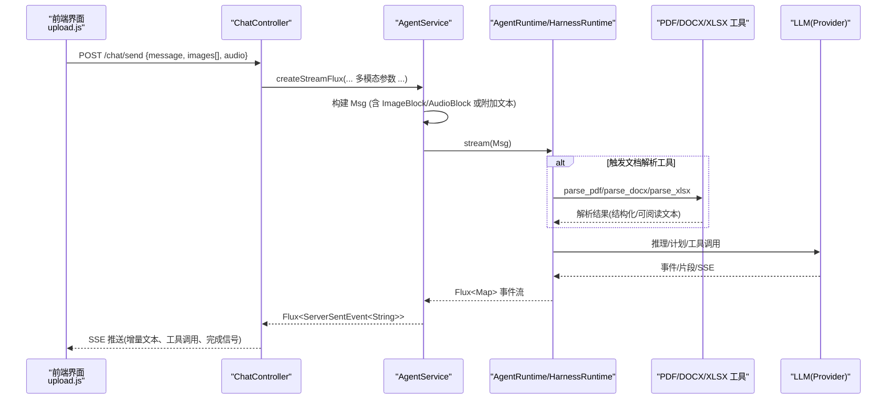
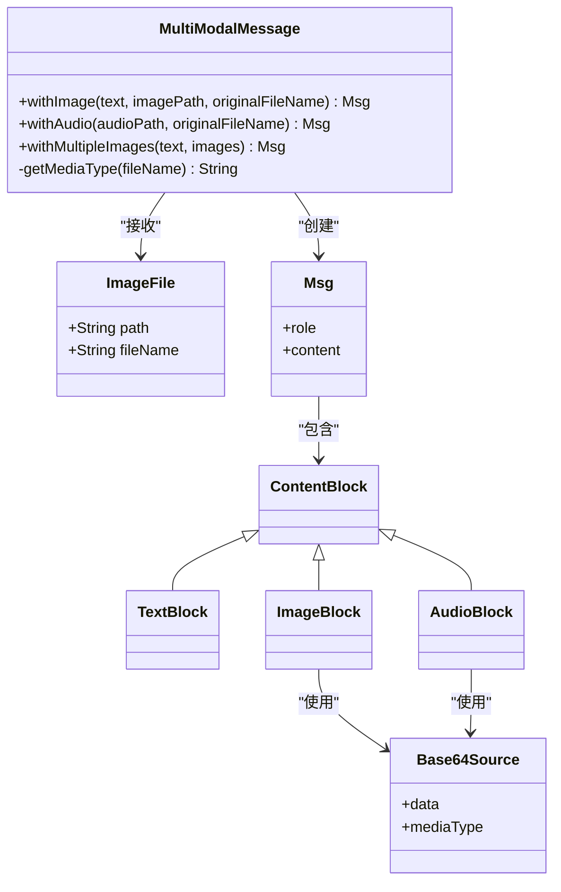
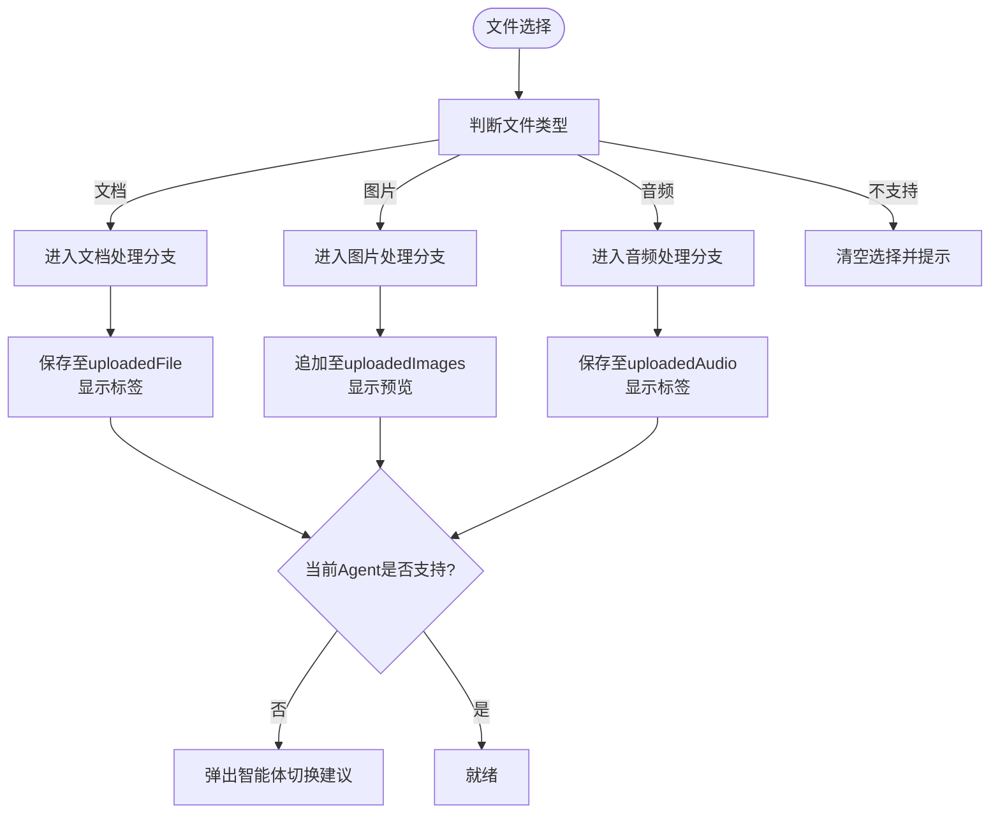
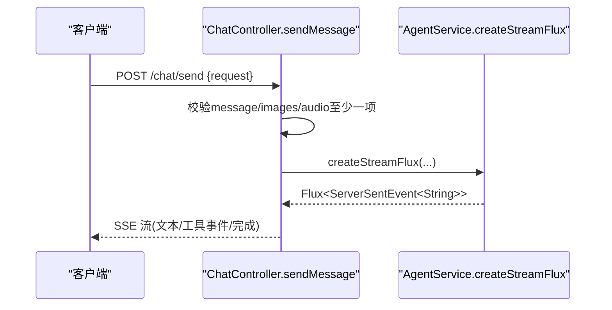
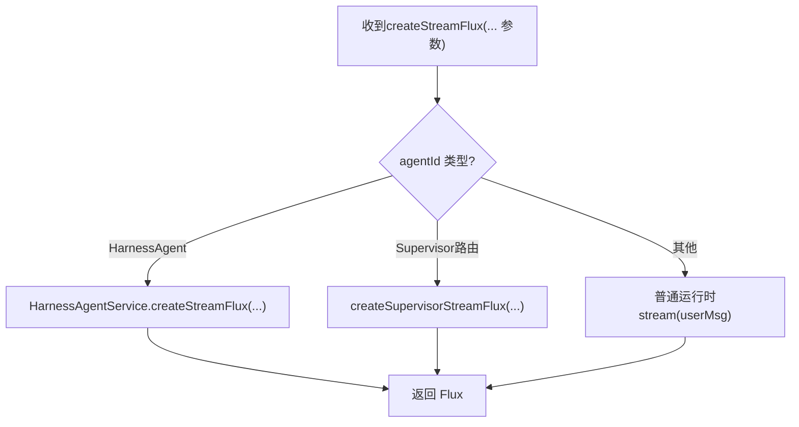
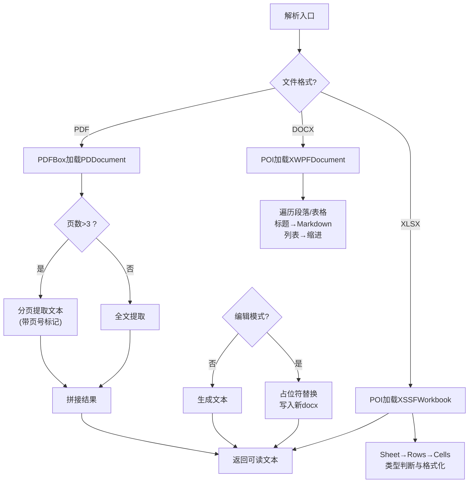
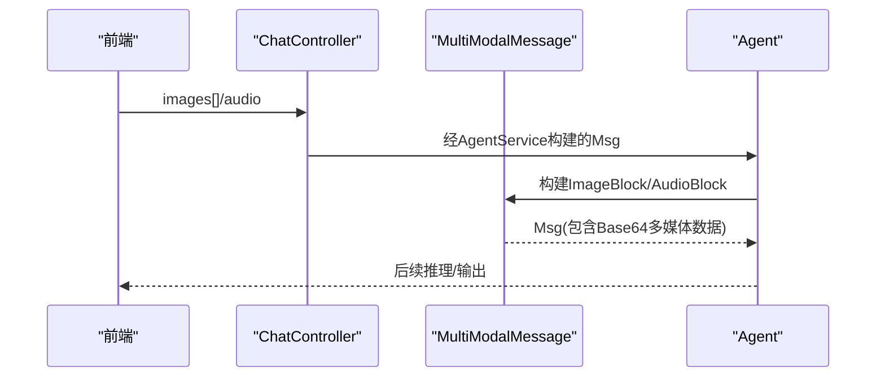
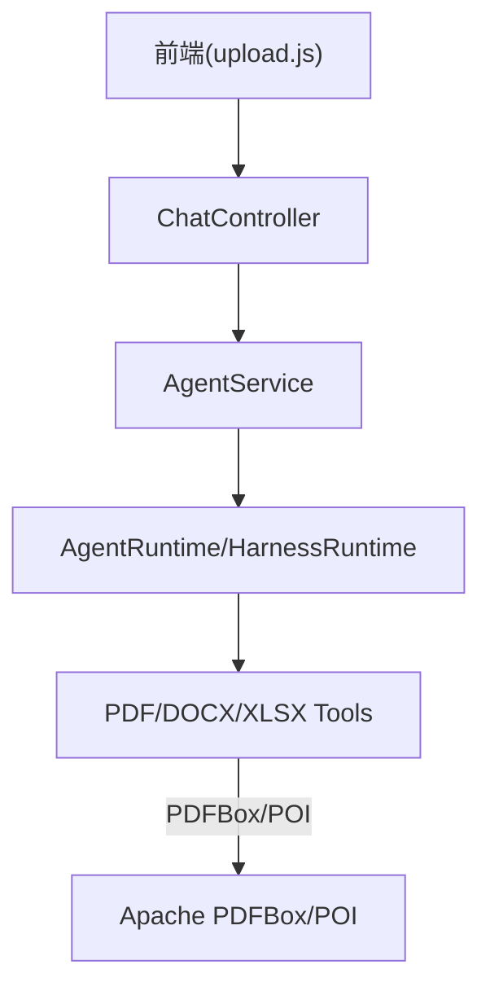

# 多模态处理能力

<cite>
**本文引用的文件**
- [MultiModalMessage.java](file://src/main/java/com/skloda/agentscope/model/MultiModalMessage.java)
- [ChatRequest.java](file://src/main/java/com/skloda/agentscope/model/ChatRequest.java)
- [ChatController.java](file://src/main/java/com/skloda/agentscope/controller/ChatController.java)
- [PdfParserTool.java](file://src/main/java/com/skloda/agentscope/tool/PdfParserTool.java)
- [DocxParserTool.java](file://src/main/java/com/skloda/agentscope/tool/DocxParserTool.java)
- [XlsxParserTool.java](file://src/main/java/com/skloda/agentscope/tool/XlsxParserTool.java)
- [AgentService.java](file://src/main/java/com/skloda/agentscope/service/AgentService.java)
- [application.yml](file://src/main/resources/application.yml)
- [upload.js](file://src/main/resources/static/scripts/modules/upload.js)
</cite>

## 目录
1. [引言](#引言)
2. [项目结构](#项目结构)
3. [核心组件](#核心组件)
4. [架构总览](#架构总览)
5. [详细组件分析](#详细组件分析)
6. [依赖关系分析](#依赖关系分析)
7. [性能与优化](#性能与优化)
8. [故障排查指南](#故障排查指南)
9. [结论](#结论)
10. [附录：API调用与错误处理示例](#附录api调用与错误处理示例)

## 引言
本技术文档聚焦于系统支持的多模态数据处理能力，涵盖文本、图片、语音及常见办公文档（PDF、DOCX、XLSX）的输入、解析、流转与输出路径。文档从模型设计、前后端交互、后端接口、各模态处理流水线与安全配置等方面展开，并提供可操作的API使用指引与问题定位方法。

## 项目结构
围绕多模态能力的代码分布在以下层次：
- 前端上传与预览：静态脚本模块负责文件类型识别、进度反馈、智能体建议、预览展示。
- 控制器层：统一接收多模态请求并路由到流式响应通道。
- 服务层：组装用户消息（含图片/音频）、分发给具体运行时执行，并记录工作流。
- 数据模型：定义可携带图像列表与音频信息的入参与多模态消息构建。
- 工具层：基于第三方库完成文档/表格解析，便于LLM读取结构化内容。
- 配置文件：控制Servlet上传限制、模型提供商参数等。

本节为概念性概览，不直接分析具体文件。

## 核心组件
本节说明多模态能力的核心实体与职责。

- MultiModalMessage：将本地文件（图片/音频）转换为 AgentScope Msg，封装 Base64 编码与 MIME 推断；提供文本+单图、文本+多图、文本+音频的组合构造能力。异常时降级为纯文本提示，保证整体流程稳健。
- ChatRequest：POST /chat/send 的请求体，支持 message + filePath/fileName（用于工具链）以及 images[] 与 audio（用于视觉/语音）。
- ChatController：SSE 流式接口，解析请求并校验至少有一个有效输入（message 或附件），将多模态信息透传到上层服务。
- AgentService：消息构建与分发中枢。根据 agentId 路由到普通 Agent、HarnessAgent 或 Supervisor 运行时；负责注入 userId/sessionId/执行模式/权限模式，并包装 Stream 流以记录工作流、转写聊天历史等。
- 解析工具：
  - PdfParserTool：基于 Apache PDFBox 提取全文页级文本与元数据，对长文档按页切分以避免大段合并造成的上下文压力。
  - DocxParserTool：基于 Apache POI 提取段落、标题、列表、表格内容，并将 DOCX 样式映射为易读的 Markdown 化文本；还提供模板变量替换编辑能力。
  - XlsxParserTool：基于 Apache POI 遍历 Sheet/Row/Cell，格式化数字/日期/公式，返回可读的表格文本。
- 应用配置：application.yml 中设置 Spring multipart 的 max-file-size/max-request-size 以限制单次上传大小。

**章节来源**
- [MultiModalMessage.java:20-171](file://src/main/java/com/skloda/agentscope/model/MultiModalMessage.java#L20-L171)
- [ChatRequest.java:1-143](file://src/main/java/com/skloda/agentscope/model/ChatRequest.java#L1-L143)
- [ChatController.java:117-153](file://src/main/java/com/skloda/agentscope/controller/ChatController.java#L117-L153)
- [AgentService.java:120-177](file://src/main/java/com/skloda/agentscope/service/AgentService.java#L120-L177)
- [PdfParserTool.java:15-72](file://src/main/java/com/skloda/agentscope/tool/PdfParserTool.java#L15-L72)
- [DocxParserTool.java:17-127](file://src/main/java/com/skloda/agentscope/tool/DocxParserTool.java#L17-L127)
- [XlsxParserTool.java:13-107](file://src/main/java/com/skloda/agentscope/tool/XlsxParserTool.java#L13-L107)
- [application.yml:6-12](file://src/main/resources/application.yml#L6-L12)

## 架构总览
下面的序列图展示了“上传—发送—处理—流式响应”的整体时序，涵盖前后端与后端多个角色。

图表来源
- [ChatController.java:122-153](file://src/main/java/com/skloda/agentscope/controller/ChatController.java#L122-L153)
- [AgentService.java:140-177](file://src/main/java/com/skloda/agentscope/service/AgentService.java#L140-L177)
- [PdfParserTool.java:19-70](file://src/main/java/com/skloda/agentscope/tool/PdfParserTool.java#L19-L70)
- [DocxParserTool.java:24-56](file://src/main/java/com/skloda/agentscope/tool/DocxParserTool.java#L24-L56)
- [XlsxParserTool.java:17-105](file://src/main/java/com/skloda/agentscope/tool/XlsxParserTool.java#L17-L105)

## 详细组件分析

### 多模态消息模型与数据结构
- 设计理念
  - 解耦“传输载体”和“消息内容”：前端通过相对路径或临时文件路径传递媒体，后端以 Base64 方式写入 Msg.ContentBlock，便于跨服务/进程传递。
  - 兼容性与容错：构建失败时自动降级为纯文本（包含错误提示），保证上游调用方无需感知内部实现细节即可继续运行。
  - MIME 推断：根据文件名后缀推断 mediaType，提升下游解析正确性。
- 数据结构
  - 文本块：TextBlock
  - 图片块：ImageBlock + Base64Source(data, mediaType)
  - 音频块：AudioBlock + Base64Source(data, mediaType)
  - 多图片：多次添加多个 ImageBlock
- 相关要点
  - withImage：text 可空；当无文本则仅附图片。
  - withMultipleImages：支持批量图片附带文本描述。
  - getMediaType：覆盖主流图片与音频格式，未知扩展默认回退为 image/jpeg。

图表来源
- [MultiModalMessage.java:20-171](file://src/main/java/com/skloda/agentscope/model/MultiModalMessage.java#L20-L171)

章节来源
- [MultiModalMessage.java:31-94](file://src/main/java/com/skloda/agentscope/model/MultiModalMessage.java#L31-L94)
- [MultiModalMessage.java:99-132](file://src/main/java/com/skloda/agentscope/model/MultiModalMessage.java#L99-L132)
- [MultiModalMessage.java:137-158](file://src/main/java/com/skloda/agentscope/model/MultiModalMessage.java#L137-L158)
- [MultiModalMessage.java:160-171](file://src/main/java/com/skloda/agentscope/model/MultiModalMessage.java#L160-L171)

### 前端上传与预览
- 文件选择与类型校验：检测 docx/pdf/xlsx、图片扩展名、音频扩展名三类；不支持的类型会清空选择框，阻止无效上传。
- 上传后状态管理：将文档保存到全局 window.uploadedFile，图片推入数组 uploadedImages，音频保存到 uploadedAudio，并在标签区展示并可移除。
- 智能体建议：若当前智能体不具备对应模态能力，弹窗引导切换到合适智能体（如文档分析助手、图片识别助手、语音助手）。
- 兼容性注意：不同前端策略下可能走不同的上传接口；在本仓库中关键行为由 upload.js 驱动，实际服务端上传入口需参照对应 API 实现（例如 /chat/upload）。

图表来源
- [upload.js:22-110](file://src/main/resources/static/scripts/modules/upload.js#L22-L110)
- [upload.js:113-154](file://src/main/resources/static/scripts/modules/upload.js#L113-L154)
- [upload.js:156-199](file://src/main/resources/static/scripts/modules/upload.js#L156-L199)

章节来源
- [upload.js:22-110](file://src/main/resources/static/scripts/modules/upload.js#L22-L110)
- [upload.js:113-154](file://src/main/resources/static/scripts/modules/upload.js#L113-L154)
- [upload.js:156-199](file://src/main/resources/static/scripts/modules/upload.js#L156-L199)

### 后端接收接口（SSE 流）
- 入口：POST /chat/send，produces TEXT_EVENT_STREAM_VALUE，返回 Flux<ServerSentEvent<String>>。
- 参数校验：message、images、audio 三者至少非空，否则返回错误事件。
- 事件封装：统一的 sseEvent/errorAndDone 封装序列化与错误兜底；takeUntil("done") 控制流结束。
- 业务路由：交由 AgentService.createStreamFlux(...) 进行消息构建与运行时调度。

图表来源
- [ChatController.java:122-153](file://src/main/java/com/skloda/agentscope/controller/ChatController.java#L122-L153)
- [AgentService.java:120-177](file://src/main/java/com/skloda/agentscope/service/AgentService.java#L120-L177)

章节来源
- [ChatController.java:117-153](file://src/main/java/com/skloda/agentscope/controller/ChatController.java#L117-L153)

### 多模态分发与运行时代码
- AgentService.createStreamFlux(...)：根据 agentId 判定是否为 HarnessAgent/Supervisor 路由；否则构造基础运行时 streaming；期间调用 buildUserMessage 组装 Msg（含图片/音频/文件路径）。
- 会话与工作流：若无 sessionId，走无状态流；若有 sessionId，进入会话持久化路径；同时通过 WorkflowRun 记录输入摘要与输出转写。

图表来源
- [AgentService.java:140-177](file://src/main/java/com/skloda/agentscope/service/AgentService.java#L140-L177)

章节来源
- [AgentService.java:84-177](file://src/main/java/com/skloda/agentscope/service/AgentService.java#L84-L177)

### 文档处理流水线（PDF/DOCX/XLSX）
- PDF（Apache PDFBox）
  - 加载 PDDocument，提取文档信息（标题、作者）。
  - 全量文本或按页切分（页数>3时按页循环抽取，附带页头分割）。
  - 空内容时给出友好提示（可能扫描图无可OCR）。
- DOCX（Apache POI XWPF）
  - 段落识别：依据样式映射为 Markdown 标题/列表，保留层级缩进。
  - 表格处理：行×单元格拼接，以分隔符组合成可读文本。
  - 编辑能力：支持传入 JSON 占位替换清单，逐段匹配替换后另存为新文件。
- XLSX（Apache POI XSSF）
  - 遍历 Sheet，统计首末行；跳过空 Sheet。
  - 单元格类型判断：字符串、数值（区分整数/浮点）、日期（格式化输出）、布尔、公式等。
  - 按行列出单元格值，并以“|”连接，行内空单元格显示“(blank)”。

图表来源
- [PdfParserTool.java:19-70](file://src/main/java/com/skloda/agentscope/tool/PdfParserTool.java#L19-L70)
- [DocxParserTool.java:24-56](file://src/main/java/com/skloda/agentscope/tool/DocxParserTool.java#L24-L56)
- [DocxParserTool.java:60-127](file://src/main/java/com/skloda/agentscope/tool/DocxParserTool.java#L60-L127)
- [XlsxParserTool.java:17-105](file://src/main/java/com/skloda/agentscope/tool/XlsxParserTool.java#L17-L105)

章节来源
- [PdfParserTool.java:19-70](file://src/main/java/com/skloda/agentscope/tool/PdfParserTool.java#L19-L70)
- [DocxParserTool.java:24-56](file://src/main/java/com/skloda/agentscope/tool/DocxParserTool.java#L24-L56)
- [DocxParserTool.java:60-127](file://src/main/java/com/skloda/agentscope/tool/DocxParserTool.java#L60-L127)
- [XlsxParserTool.java:17-105](file://src/main/java/com/skloda/agentscope/tool/XlsxParserTool.java#L17-L105)

### 图片与语音处理机制
- 图片
  - 输入：前端上传后得到临时路径；通过 ChatRequest.images[] 提交。
  - 处理：MultiModalMessage.withMultipleImages 将每个图片读取为字节并转为 Base64 Source，附带 mediaType 注入到 Msg.ContentBlock。
  - 输出：后续由具备视觉能力的 Agent 消费该 Msg 中的图片 Block。
- 语音
  - 输入：通过 ChatRequest.audio 传递路径与文件名。
  - 处理：MultiModalMessage.withAudio 将音频读入、Base64 编码并包装为 AudioBlock。
  - 输出：由具备音频能力的 Agent 解码消费。

图表来源
- [ChatRequest.java:50-106](file://src/main/java/com/skloda/agentscope/model/ChatRequest.java#L50-L106)
- [MultiModalMessage.java:99-132](file://src/main/java/com/skloda/agentscope/model/MultiModalMessage.java#L99-L132)
- [MultiModalMessage.java:67-94](file://src/main/java/com/skloda/agentscope/model/MultiModalMessage.java#L67-L94)
- [ChatController.java:122-153](file://src/main/java/com/skloda/agentscope/controller/ChatController.java#L122-L153)

章节来源
- [MultiModalMessage.java:67-132](file://src/main/java/com/skloda/agentscope/model/MultiModalMessage.java#L67-L132)
- [ChatRequest.java:50-106](file://src/main/java/com/skloda/agentscope/model/ChatRequest.java#L50-L106)
- [ChatController.java:122-153](file://src/main/java/com/skloda/agentscope/controller/ChatController.java#L122-L153)

## 依赖关系分析
- 外部库
  - Apache PDFBox：用于 PDF 解析（加载文档、按页文本抽取）。
  - Apache POI：用于 DOCX/XLSX 解析与编辑（XWPFDocument、XSSFWorkbook）。
  - Spring Web/Reactor：SSE 流式响应、MultipartFile 上传、Flux 组合。
  - AgentScope：Msg、ContentBlock 等多模态消息抽象与工具注解体系。
- 组件耦合
  - ChatController 仅负责协议与事件封装，业务逻辑下沉至 AgentService。
  - AgentService 聚合多种运行时（Standard/Harness/Supervisor），多模态构建集中在 MultiModalMessage，降低耦合度。
  - 解析工具作为可被 Agent 调用的独立组件，通过 Tool 注解暴露能力。

图表来源
- [application.yml:6-12](file://src/main/resources/application.yml#L6-L12)
- [ChatController.java:122-153](file://src/main/java/com/skloda/agentscope/controller/ChatController.java#L122-L153)
- [AgentService.java:140-177](file://src/main/java/com/skloda/agentscope/service/AgentService.java#L140-L177)
- [PdfParserTool.java:19-70](file://src/main/java/com/skloda/agentscope/tool/PdfParserTool.java#L19-L70)
- [DocxParserTool.java:24-56](file://src/main/java/com/skloda/agentscope/tool/DocxParserTool.java#L24-L56)
- [XlsxParserTool.java:17-105](file://src/main/java/com/skloda/agentscope/tool/XlsxParserTool.java#L17-L105)

## 性能与优化
- 文档解析优化
  - PDF：大于3页时按页提取，避免一次性拼接产生过大中间文本；页级分段有利于分段检索与上下文窗口控制。
  - DOCX：仅针对段落/表格遍历，替换模式下采用先扫描再替换的策略，减少反复读写。
  - XLSX：按行列式输出，遇到空行/空单元格快速跳过，并使用 DataFormatter 保证日期/数字可读性。
- 多媒体传输
  - Base64 编码会增加约 33% 体积；建议在可能的场景下考虑直传远端存储/云厂商 SDK，或改用流式二进制上传。
  - 合理限制文件上限（application.yml 中 max-file-size/max-request-size），避免大文件拖垮内存与网络。
- 会话与流
  - 利用 Reactor Flux 背压特性承载长对话与长文档逐步渲染；结合“取直到完成事件”的控制，释放连接资源。
[本节为通用指导，不直接分析特定文件]

## 故障排查指南
- 无法上传图片/语音
  - 检查前端类型判断是否放行目标扩展名（upload.js）。
  - 确认服务端文件大小限制是否过低（application.yml 中的 multipart 限制）。
  - 日志中观察 Base64 编码与 IO 读取是否有异常。
- 解析失败
  - PDF：提示“空或不可提取文本”，可能是扫描件未集成 OCR 引擎。
  - DOCX：若模板不存在/路径非法会返回失败 JSON；请检查传入的 replacements 参数与文件路径。
  - XLSX：若 Sheet 为空将直接返回“Empty sheet”；确保数据行存在。
- SSE 中断或未收到 done
  - 检查 onErrorResume 分支的日志与异常栈；确认前端 takeUntil("done") 逻辑是否正常退出。
- 智能体能力不足
  - 上传后前端会尝试智能体建议，如仍报错请确认所选 Agent 是否具备 vision/audio/docx/pdf/xlsx 等能力。

章节来源
- [application.yml:6-12](file://src/main/resources/application.yml#L6-L12)
- [upload.js:22-110](file://src/main/resources/static/scripts/modules/upload.js#L22-L110)
- [PdfParserTool.java:61-70](file://src/main/java/com/skloda/agentscope/tool/PdfParserTool.java#L61-L70)
- [DocxParserTool.java:60-127](file://src/main/java/com/skloda/agentscope/tool/DocxParserTool.java#L60-L127)
- [XlsxParserTool.java:96-105](file://src/main/java/com/skloda/agentscope/tool/XlsxParserTool.java#L96-L105)
- [ChatController.java:147-153](file://src/main/java/com/skloda/agentscope/controller/ChatController.java#L147-L153)

## 结论
本系统在“前端上传—控制器—服务—运行时—工具”的分层架构上，实现了稳定可靠的多模态处理能力：图片与语音通过 Msg.Base64Source 安全传递；文档类通过专业解析工具转化为 LLM 友好的文本；配合 SSE 流式传输与严格的前端能力探测，既保证了用户体验，也降低了出错面。未来可扩展更多模态（如视频帧、音频转写、结构化数据转换）并保持上述清晰分层与工具化接入。

## 附录：API调用与错误处理示例
- 通用上传
  - 方法：POST /chat/upload（具体路径参考前端对接的上传 API）
  - 表单字段：multipart/form-data 中的 file
  - 响应示例（示意）：{ "fileId": "...", "fileName": "...", "filePath": "..." }
- 发送多模态消息
  - 方法：POST /chat/send
  - 请求体关键字段：
    - message: 可选（当提供 images[] 或 audio 时可缺省）
    - images: [{ "path": "...", "fileName": "..." }]
    - audio: { "path": "...", "fileName": "..." }
  - 成功：SSE 文本流（token、工具调用、完成事件）
  - 失败：首个事件中 type=error，随后一个 type=done
- 常见错误定位
  - 文件过大：调整 application.yml 中 max-file-size 与 max-request-size
  - 文件类型不支持：在前端增加允许的扩展名或提示
  - 解析失败：优先检查文件格式与完整性；PDF 扫描图需要 OCR 链路补充
  - 运行期异常：查看 ChatController.onErrorResume 日志与 Agent 工具调用堆栈
[本节为概念性示例，不直接分析具体文件]