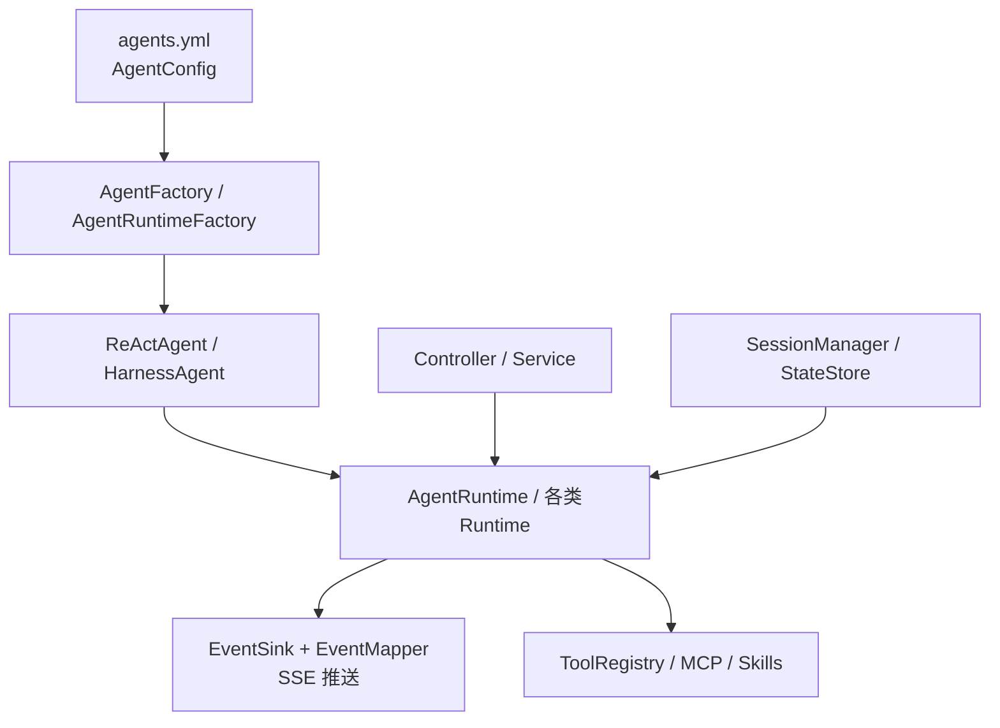
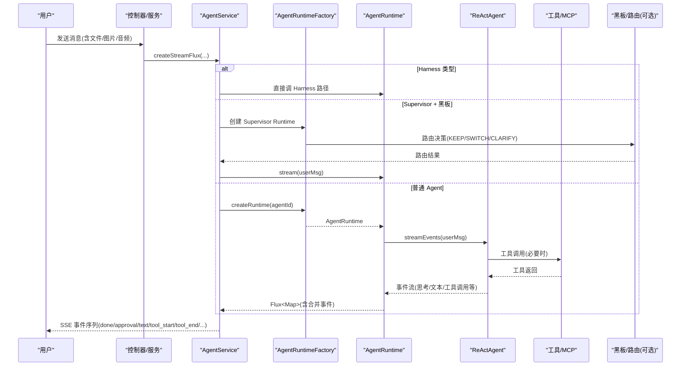
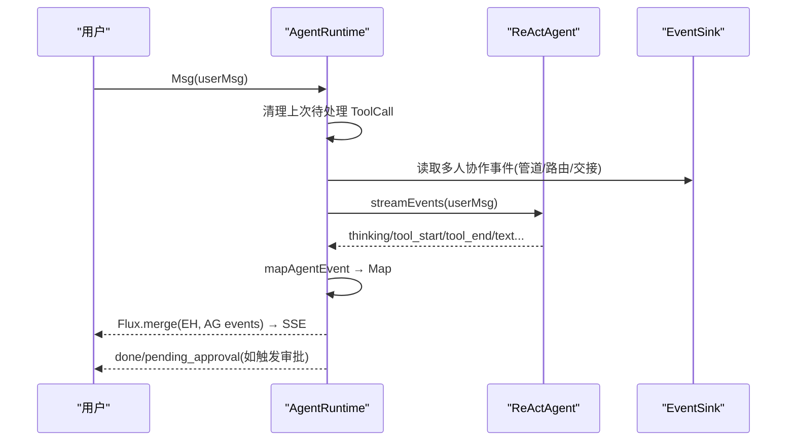
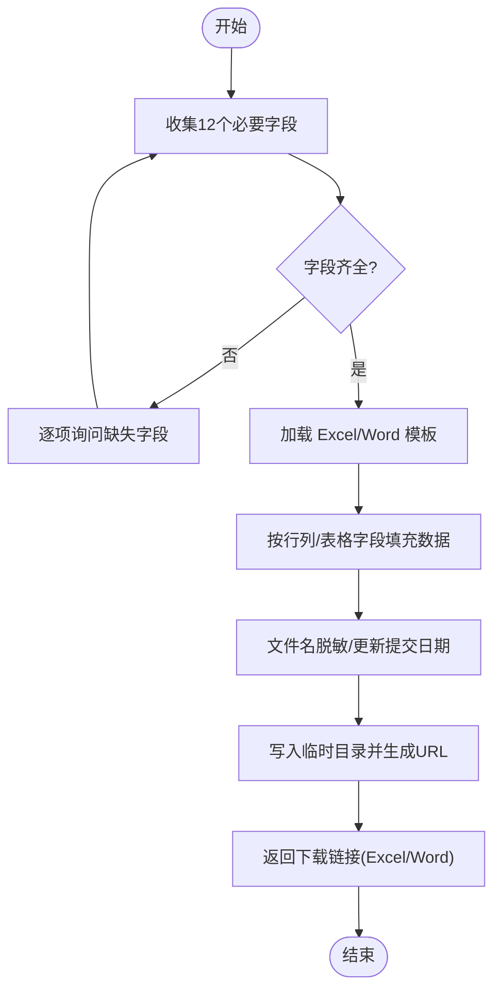
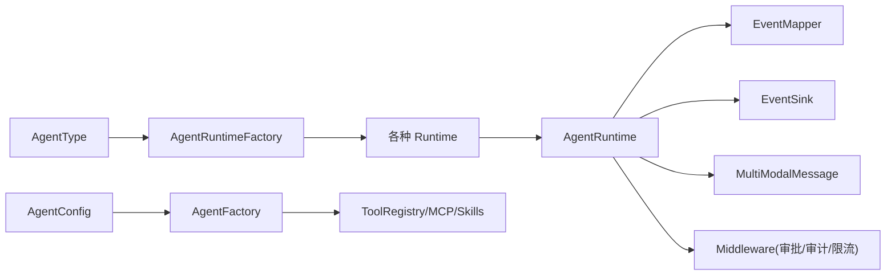

# 多类型Agent系统

<cite>
**本文档引用的文件**
- [AgentConfig.java](file://src/main/java/com/skloda/agentscope/agent/AgentConfig.java)
- [AgentType.java](file://src/main/java/com/skloda/agentscope/agent/AgentType.java)
- [AgentFactory.java](file://src/main/java/com/skloda/agentscope/agent/AgentFactory.java)
- [AgentRuntimeFactory.java](file://src/main/java/com/skloda/agentscope/runtime/AgentRuntimeFactory.java)
- [AgentService.java](file://src/main/java/com/skloda/agentscope/service/AgentService.java)
- [AgentRuntime.java](file://src/main/java/com/skloda/agentscope/runtime/AgentRuntime.java)
- [MultiModalMessage.java](file://src/main/java/com/skloda/agentscope/model/MultiModalMessage.java)
- [SimpleTools.java](file://src/main/java/com/skloda/agentscope/tool/SimpleTools.java)
- [WebSearchTool.java](file://src/main/java/com/skloda/agentscope/tool/WebSearchTool.java)
- [BankInvoiceTool.java](file://src/main/java/com/skloda/agentscope/tool/BankInvoiceTool.java)
- [agents.yml](file://src/main/resources/config/agents.yml)
- [supervisor-shared-blackboard-design.md](file://docs/supervisor-shared-blackboard-design.md)
</cite>

## 目录
1. [简介](#简介)
2. [项目结构](#项目结构)
3. [核心组件](#核心组件)
4. [架构总览](#架构总览)
5. [详细组件分析](#详细组件分析)
6. [依赖关系分析](#依赖关系分析)
7. [性能与扩展性](#性能与扩展性)
8. [故障排查指南](#故障排查指南)
9. [结论](#结论)
10. [附录：配置与最佳实践](#附录配置与最佳实践)

## 简介
本仓库是基于 AgentScope（Java）实现的多类型 Agent 演示平台。它统一提供“配置驱动 + 工厂生产 + 运行时编排”的架构，支持基础对话、工具调用、任务型处理、文档生成、视觉/语音等多模态输入、网络检索集成以及复杂工作流编排。同时通过“路由/黑板（Supervisor + Shared Blackboard）”模式实现多智能体协作与跨专家共享上下文。

目标读者包括：
- 想要快速集成不同 Agent 类型的开发者
- 需要为业务定制 Agent 工作流的工程师
- 关注可观测性、权限控制、长会话状态持久化的运维或平台团队

[无特定源码文件分析，本节不附加来源]

## 项目结构
从职责划分看，核心层次如下：
- 配置层：YAML 定义各 Agent 的类型、模型、能力（工具、技能）、策略等
- 工厂层：将配置组装为具体的 ReAct/Harness Agent 实例
- 运行时层：按 AgentType 选择对应 Runtime 执行，统一事件流输出
- 服务层：对外暴露聊天、上传、下载等接口，串联运行流程
- 能力层：工具、MCP、中间件、权限、黑版等扩展点

图示来源
- [AgentRuntimeFactory.java:41-60](file://src/main/java/com/skloda/agentscope/runtime/AgentRuntimeFactory.java#L41-L60)
- [AgentRuntime.java:67-142](file://src/main/java/com/skloda/agentscope/runtime/AgentRuntime.java#L67-L142)
- [AgentConfig.java:13-186](file://src/main/java/com/skloda/agentscope/agent/AgentConfig.java#L13-L186)

章节来源
- [AgentRuntimeFactory.java:41-180](file://src/main/java/com/skloda/agentscope/runtime/AgentRuntimeFactory.java#L41-L180)
- [AgentRuntime.java:26-142](file://src/main/java/com/skloda/agentscope/runtime/AgentRuntime.java#L26-L142)
- [AgentConfig.java:13-186](file://src/main/java/com/skloda/agentscope/agent/AgentConfig.java#L13-L186)

## 核心组件
- AgentConfig：描述单个 Agent 的所有静态参数（名称、提示词、模型、流式开关、工具/技能、RAG、审批、结构化输出、计划任务、长记忆、多智能体参数、Supervisor/路由器配置、Harness配置、MCP/工具组、中间件、权限、会话等）
- AgentType：枚举分发所有支持的 Agent 类型（SINGLE、ROUTING、HANDOFFS、SEQUENTIAL、PARALLEL、DEBATE、LOOP、STATE_GRAPH、MSG_HUB、SUBAGENT_SEQ/PAR、HARNESS）
- AgentFactory：负责根据 agentId 查找配置，组装 Model、Toolkit、Middlewares、RAG、长时记忆、MCP 工具等，构建 ReActAgent
- AgentRuntimeFactory：根据配置中的 type，创建对应的 Runtime（单 Agent、组合多 Agent、StateGraph、MsgHub、Harness、Loop 等）
- AgentService：请求入口（消息+文件+图像+音频），路由到 Harness/Supervisor/普通 Agent 并产生 Flux 事件流
- AgentRuntime：对单个 ReActAgent 的事件流进行包装、合并人工事件、处理中断恢复与 HITL 审批、产出 SSE Map
- MultiModalMessage：构造文本+图像/音频的消息载体
- Tools（SimpleTools、WebSearchTool、BankInvoiceTool）：工具注册与实现示例

章节来源
- [AgentConfig.java:13-186](file://src/main/java/com/skloda/agentscope/agent/AgentConfig.java#L13-L186)
- [AgentType.java:1-26](file://src/main/java/com/skloda/agentscope/agent/AgentType.java#L1-L26)
- [AgentFactory.java:36-200](file://src/main/java/com/skloda/agentscope/agent/AgentFactory.java#L36-L200)
- [AgentRuntimeFactory.java:21-180](file://src/main/java/com/skloda/agentscope/runtime/AgentRuntimeFactory.java#L21-L180)
- [AgentService.java:80-177](file://src/main/java/com/skloda/agentscope/service/AgentService.java#L80-L177)
- [AgentRuntime.java:67-142](file://src/main/java/com/skloda/agentscope/runtime/AgentRuntime.java#L67-L142)
- [MultiModalMessage.java:20-172](file://src/main/java/com/skloda/agentscope/model/MultiModalMessage.java#L20-L172)
- [SimpleTools.java:12-44](file://src/main/java/com/skloda/agentscope/tool/SimpleTools.java#L12-L44)
- [WebSearchTool.java:20-134](file://src/main/java/com/skloda/agentscope/tool/WebSearchTool.java#L20-L134)
- [BankInvoiceTool.java:19-199](file://src/main/java/com/skloda/agentscope/tool/BankInvoiceTool.java#L19-L199)

## 架构总览
下图展示一次聊天请求从 Web 入口到 Agent 执行的端到端过程，包括流式事件合并与 SSE 发送。

图示来源
- [AgentService.java:80-177](file://src/main/java/com/skloda/agentscope/service/AgentService.java#L80-L177)
- [AgentRuntimeFactory.java:41-180](file://src/main/java/com/skloda/agentscope/runtime/AgentRuntimeFactory.java#L41-L180)
- [AgentRuntime.java:67-142](file://src/main/java/com/skloda/agentscope/runtime/AgentRuntime.java#L67-L142)
- [supervisor-shared-blackboard-design.md:32-84](file://docs/supervisor-shared-blackboard-design.md#L32-L84)

章节来源
- [AgentService.java:80-177](file://src/main/java/com/skloda/agentscope/service/AgentService.java#L80-L177)
- [AgentRuntime.java:67-142](file://src/main/java/com/skloda/agentscope/runtime/AgentRuntime.java#L67-L142)

## 详细组件分析

### 1) Basic Chat（基础对话）— ReAct 循环与流式事件
- 机制概述：AgentFactory 装配 Model、SystemPrompt、Skills/Tools、Middlewares、RAG/长记忆等；AgentRuntime 以 agent.streamEvents() 拉取 LLM 思考、工具调用、文本增量等事件，合并外部 EventSink 的多人协作事件，统一以 SSE 推送
- 关键流程
  - 创建 ReActAgent：model、stateStore、session、PlanNotebook 开启（若配置）
  - 流式处理：清理上次的挂起 tool call -> 合并 sinkEvents -> streamEvents -> doFinally 完成 sink -> 结束时判定是否需要 HITL 审批
  - 审批恢复：使用 streamEvents 重新触发后续事件，保证前端一致性体验
- 适用场景：通用问答、概念解释、文本润色等简单交互
- 性能特征：低延迟、增量输出、支持流式模型与思维链开关
- 最佳实践：合理设置 autoContext 阈值与 token 比例，避免上下文爆炸；按需开启 PlanNotebook

图示：基础对话流式处理时序

图示来源
- [AgentRuntime.java:67-142](file://src/main/java/com/skloda/agentscope/runtime/AgentRuntime.java#L67-L142)

章节来源
- [AgentRuntime.java:26-169](file://src/main/java/com/skloda/agentscope/runtime/AgentRuntime.java#L26-L169)
- [AgentFactory.java:94-200](file://src/main/java/com/skloda/agentscope/agent/AgentFactory.java#L94-L200)
- [agents.yml:1-59](file://src/main/resources/config/agents.yml#L1-L59)

### 2) Tool Calling（工具调用）— 参数解析与结果处理
- 机制概述：通过 Toolkit 注册 @Tool/@ToolParam 标注的方法；Agent 在执行过程中自动识别需调用的工具并传参；AgentRuntime 会基于工具名反查 MCP 溯源信息并注入事件属性；工具返回后作为 ToolResultBlock 回填
- 关键点
  - 工具声明：方法级注解 + 参数描述
  - 事件丰富化：tool_start 事件中动态追加 isMcp/mcpName
  - 错误处理：工具内部 try/catch 返回友好错误
- 典型工具示例
  - SimpleTools：时间、求和、天气查询
  - WebSearchTool：Tavily 搜索及天气/股票/新闻聚合
  - BankInvoiceTool：模板填充并落盘 Excel/Word
- 适用场景：精确计算、实时信息查询、文档生成等
- 最佳实践：明确参数描述利于 LLM 选型；对网络调用增加超时与限流；敏感操作接入审批

章节来源
- [SimpleTools.java:12-44](file://src/main/java/com/skloda/agentscope/tool/SimpleTools.java#L12-L44)
- [WebSearchTool.java:20-134](file://src/main/java/com/skloda/agentscope/tool/WebSearchTool.java#L20-L134)
- [AgentRuntime.java:186-199](file://src/main/java/com/skloda/agentscope/runtime/AgentRuntime.java#L186-L199)

### 3) Task Agent（任务处理）— 工作流编排
- 机制概述：AgentService 统一构建用户消息（可含文本/文件/图片/音频），再交由 AgentRuntimeFactory/具体 Runtime 执行；对于复杂任务可组合 Sequential/Parallel/StateGraph/MsgHub/SubAgent 等 Runtime
- 关键点
  - 任务编排：通过 YAML 的 type 字段切换 runtime
  - 子代理：Seq/Par 子代理生命周期管理清晰，支持并发/串行
  - 图编排：StateGraphRuntime 支撑有序状态流转
- 适用场景：文档解析、多步骤工作流、审批流
- 最佳实践：大任务分片、失败重试、可观测性埋点

章节来源
- [AgentService.java:80-177](file://src/main/java/com/skloda/agentscope/service/AgentService.java#L80-L177)
- [AgentRuntimeFactory.java:41-180](file://src/main/java/com/skloda/agentscope/runtime/AgentRuntimeFactory.java#L41-L180)

### 4) Bank Invoice（银行发票生成）— 模板填充逻辑
- 机制概述：专门配置的 Agent（bank-invoice）引导收集 12 个必填字段，调用 generate_bank_invoice 工具。工具按顺序加载 classpath 下的模板（Excel/Docx），填入数据、脱敏文件名、写入临时目录并提供下载路径
- 关键点
  - 参数校验与收集：由 System Prompt 规范引导
  - 模板处理：XSSF 行/单元格赋值；XWPF 表格单元赋值；段落替换提交日期
  - 安全与审计：文件名脱敏、落盘日志记录
- 适用场景：财务自动化、批量票据生成
- 最佳实践：确保模板版本稳定；限制输入大小；对敏感字段脱敏

流程图：发票生成主流程

图示来源
- [BankInvoiceTool.java:52-98](file://src/main/java/com/skloda/agentscope/tool/BankInvoiceTool.java#L52-L98)
- [BankInvoiceTool.java:114-166](file://src/main/java/com/skloda/agentscope/tool/BankInvoiceTool.java#L114-L166)
- [BankInvoiceTool.java:194-199](file://src/main/java/com/skloda/agentscope/tool/BankInvoiceTool.java#L194-L199)
- [agents.yml:92-170](file://src/main/resources/config/agents.yml#L92-L170)

章节来源
- [BankInvoiceTool.java:19-199](file://src/main/java/com/skloda/agentscope/tool/BankInvoiceTool.java#L19-L199)
- [agents.yml:92-170](file://src/main/resources/config/agents.yml#L92-L170)

### 5) Vision Analyzer（视觉分析）— 多模态输入处理
- 机制概述：MultiModalMessage 将图片/音频转为 Base64 编码的 Block，与文本一起组成 Msg 发送给 Agent；Agent 侧可据此进行多模态推理
- 关键点
  - 图像与音频类型推断：根据后缀确定 mediaType
  - 异常回退：文件读取失败降级为纯文本提示
- 适用场景：图文问答、截图解析、语音理解
- 最佳实践：控制图片/音频大小；优先压缩后再编码；注意隐私脱敏

章节来源
- [MultiModalMessage.java:20-172](file://src/main/java/com/skloda/agentscope/model/MultiModalMessage.java#L20-L172)

### 6) Voice Assistant（语音助手）— 音频流处理
- 机制概述：与视觉类似，通过 MultiModalMessage.withAudio 将音频资源转换为 AudioBlock 消息，再由 Agent 处理
- 关键点
  - 音频类型识别与编码
  - 异常容错与日志
- 适用场景：语音转语义、音频摘要、指令识别
- 最佳实践：采样率与时长优化；网络不稳定时的重传策略

章节来源
- [MultiModalMessage.java:64-94](file://src/main/java/com/skloda/agentscope/model/MultiModalMessage.java#L64-L94)

### 7) Search Assistant（搜索助手）— 网络查询集成
- 机制概述：WebSearchTool 封装 Tavily API 搜索，支持限定条数，并将结果整理为 Markdown；天气/股票/新闻等便捷工具复用该搜索能力
- 关键点
  - 非阻塞执行：Mono.fromCallable + boundedElastic 调度
  - 内容截断：防止超长输出影响响应时延
- 适用场景：实时资讯获取、行情与天气查询、新闻汇总
- 最佳实践：缓存热点结果；设置合理的 limit；失败告警

章节来源
- [WebSearchTool.java:20-134](file://src/main/java/com/skloda/agentscope/tool/WebSearchTool.java#L20-L134)

### 8) Project Planner（项目规划）— 复杂任务分解
- 机制概述：通过 PlanNotebook/TaskList、Sequential/Parallel 运行时与 StateGraph/MsgHub 的组合，实现复杂项目的阶段拆分、并行推进与状态迁移
- 关键点
  - 任务拆解：利用提示词/结构化输出约束生成子任务
  - 协同执行：子任务并行/串行编排，结合审批/中间件保障安全
- 适用场景：大型方案策划、多角色评审、合规检查流水线
- 最佳实践：子任务边界清晰、可独立验证；阶段性 checkpoint；失败隔离与重试

章节来源
- [AgentConfig.java:55-71](file://src/main/java/com/skloda/agentscope/agent/AgentConfig.java#L55-L71)
- [AgentRuntimeFactory.java:41-180](file://src/main/java/com/skloda/agentscope/runtime/AgentRuntimeFactory.java#L41-L180)
- [agents.yml:20-59](file://src/main/resources/config/agents.yml#L20-L59)

## 依赖关系分析

图示来源
- [AgentConfig.java:13-186](file://src/main/java/com/skloda/agentscope/agent/AgentConfig.java#L13-L186)
- [AgentType.java:1-26](file://src/main/java/com/skloda/agentscope/agent/AgentType.java#L1-L26)
- [AgentRuntimeFactory.java:41-180](file://src/main/java/com/skloda/agentscope/runtime/AgentRuntimeFactory.java#L41-L180)
- [AgentRuntime.java:67-142](file://src/main/java/com/skloda/agentscope/runtime/AgentRuntime.java#L67-L142)

章节来源
- [AgentRuntimeFactory.java:41-180](file://src/main/java/com/skloda/agentscope/runtime/AgentRuntimeFactory.java#L41-L180)
- [AgentService.java:80-177](file://src/main/java/com/skloda/agentscope/service/AgentService.java#L80-L177)

## 性能与扩展性
- 流式事件：agent.streamEvents 配合 Flux.merge 减少首字延迟，提升用户体验
- 上下文管理：autoContext 控制消息窗口与 token 比，避免超限
- 并发与一致：Supervisor 同一 slot 串行（ReentrantLock）保证黑板补丁原子性与版本单调递增
- 分布式状态：可选 Redis/MySQL/Postgres 的 AgentStateStore；当前进程内串行，跨进程写冲突未加 CAS
- 扩展点
  - 新 Agent 类型：实现新 Runtime 并在 AgentRuntimeFactory.switch 中注册
  - 新工具：添加 @Tool 并注册至 ToolRegistry/MCP
  - 新 Skill：放置 SKILL.md 并绑定
  - 新中间件：注册到 MiddlewareRegistry
  - 新权限策略：PermissionContextFactory 扩展
- 优化建议
  - 启用 PlanNotebook/TaskList 用于复杂任务跟踪
  - 合理使用 RAG/Harver Memory 降低幻觉
  - 对外部网络调用增加熔断/重试
  - 图片/音频预处理降带宽

[无特定源码分析，本部分为总体建议]

## 故障排查指南
常见问题与定位思路：
- 流式卡住：检查 EventSink 是否在 doFinally 中正确完成（防止外层 merge 永远不终结）
  - 依据：AgentRuntime 在 agentEvents.doFinally 中完成 sink
- 工具调用异常：查看工具内部异常捕获与返回；注意 tool_start 事件是否携带 MCP 溯源
- 审批悬挂：若上游中断后遗留 ToolUseBlock，需在新一轮前清理；AgentRuntime 包含清理逻辑
- 会话丢失：确认 RuntimeContext 传播 userId/sessionId，或在 Supervisor 模式下使用有效 session
- 模板缺失：bank-invoice 工具依赖 assets 模板，未找到会抛出异常

章节来源
- [AgentRuntime.java:80-142](file://src/main/java/com/skloda/agentscope/runtime/AgentRuntime.java#L80-L142)
- [BankInvoiceTool.java:52-98](file://src/main/java/com/skloda/agentscope/tool/BankInvoiceTool.java#L52-L98)

## 结论
该多类型 Agent 平台以“配置即能力”的设计提供了丰富的 Agent 类型与编排模式，涵盖从基础对话到复杂工作流的完整链路。其统一的工厂与运行时抽象使扩展与维护成本可控；事件驱动的流式架构保障了高吞吐与低延迟；Supervisor + Shared Blackboard 实现了跨专家协作与事实共享。推荐在实际项目中：
- 以 YAML 为中心维护 Agent 能力
- 通过中间件与审批保障安全与合规
- 借助 RAG/Harness Memory 提升准确性
- 针对复杂任务采用 StateGraph/MsgHub/并行子代理

[无特定源码文件分析，本节不附加来源]

## 附录：配置与最佳实践

### 1) Agent 配置（YAML）要点
- 基本字段：agentId/name/description/systemPrompt/modelName/streaming/enableThinking
- 能力：skills[]、userTools[]、systemTools[]
- 上下文：autoContext/autoContextMsgThreshold/autoContextLastKeep/autoContextTokenRatio
- 知识库：ragEnabled/ragMode/ragRetrieveLimit/ragScoreThreshold
- 多智能体：type、subAgents、parallel、handoffTriggers、loopConfig/states/msgHubConfig
- 路由/黑板：routingConfig.strategy/recentTurns/defaultKeep/sharedBlackboard.enabled/strategy
- Harness：harnessConfig（执行模式、文件系统、内存、计划、任务清单、许可、沙箱等）
- 中间件/权限/会话/样例如 agents.yml 所示

章节来源
- [agents.yml:1-200](file://src/main/resources/config/agents.yml#L1-L200)
- [AgentConfig.java:13-186](file://src/main/java/com/skloda/agentscope/agent/AgentConfig.java#L13-L186)

### 2) 运行时参数说明
- model：后端模型标识
- streaming：是否开启流式
- enableThinking：是否启用思维链
- autoContext：是否自动裁剪上下文
- approvalRequired/approvalTools：是否需要审批及对指定工具生效
- permissionConfig：权限默认模式、禁用/询问的工具集合
- sessionConfig：默认会话存储方式与路径

章节来源
- [AgentConfig.java:13-186](file://src/main/java/com/skloda/agentscope/agent/AgentConfig.java#L13-L186)

### 3) 不同类型适用场景与建议
- SINGLE：通用对话、轻工具调用
- SEQUENTIAL/PARALLEL：线性或多分支工作流、并行子任务
- ROUTING/HANDOFFS：意图分流与交接；启用 sharedBlackboard 可实现跨专家共享事实
- STATE_GRAPH：业务状态有严格顺序约束
- MSG_HUB：解耦发布订阅式多 Agent 通信
- LOOP：循环迭代直至收敛
- HARNESS：沙箱、自学习技能、分层内存与更完整的执行环境

章节来源
- [AgentType.java:1-26](file://src/main/java/com/skloda/agentscope/agent/AgentType.java#L1-L26)
- [supervisor-shared-blackboard-design.md:17-30](file://docs/supervisor-shared-blackboard-design.md#L17-L30)
- [supervisor-shared-blackboard-design.md:93-120](file://docs/supervisor-shared-blackboard-design.md#L93-L120)