# 实时监控面板

<cite>
**本文引用的文件**
- [ObservabilityHook.java](file://src/main/java/com/skloda/agentscope/hook/ObservabilityHook.java)
- [EventSink.java](file://src/main/java/com/skloda/agentscope/runtime/EventSink.java)
- [AgentEventMapper.java](file://src/main/java/com/skloda/agentscope/runtime/AgentEventMapper.java)
- [MetricsCollectorMiddleware.java](file://src/main/java/com/skloda/agentscope/middleware/MetricsCollectorMiddleware.java)
- [AgentRuntime.java](file://src/main/java/com/skloda/agentscope/runtime/AgentRuntime.java)
- [MultiAgentStreamSupport.java](file://src/main/java/com/skloda/agentscope/runtime/MultiAgentStreamSupport.java)
- [ChatController.java](file://src/main/java/com/skloda/agentscope/controller/ChatController.java)
- [MetricsController.java](file://src/main/java/com/skloda/agentscope/controller/MetricsController.java)
- [chat.js](file://src/main/resources/static/scripts/chat.js)
- [debug.js](file://src/main/resources/static/scripts/modules/debug.js)
- [ui.js](file://src/main/resources/static/scripts/modules/ui.js)
- [agents.js](file://src/main/resources/static/scripts/modules/agents.js)
- [chat.html](file://src/main/resources/templates/chat.html)
</cite>

## 目录
1. [引言](#引言)
2. [项目结构](#项目结构)
3. [核心组件](#核心组件)
4. [架构总览](#架构总览)
5. [详细组件分析](#详细组件分析)
6. [依赖关系分析](#依赖关系分析)
7. [性能与可观测性指标](#性能与可观测性指标)
8. [故障排查指南](#故障排查指南)
9. [结论与最佳实践](#结论与最佳实践)
10. [附录：定制与扩展](#附录定制与扩展)

## 引言
本技术文档面向“实时监控面板”的可观测性体系，系统性地说明后端事件采集、事件流转换、指标收集与前端可视化渲染的协作方式。重点覆盖：
- ObservabilityHook 的事件桥接与事件类型发布
- AgentEventMapper 对 AgentScope 2.0 事件的完整映射
- EventSink 基于 Reactor Sinks 的多订阅 SSE 分发
- MetricsCollectorMiddleware 的性能指标与成本估算
- 前端 debug.js / ui.js / agents.js 的调试面板、SSE 消费与状态管理

## 项目结构
本项目采用 Spring Boot + Reactive（Project Reactor）架构，使用 AgentScope 2.0 原生事件流（AgentEvent）作为统一的数据源。后端通过中间件和运行时将事件转换为 SSE，并合并多智能体人工编排事件；前端以模块化 JS 处理 SSE 并渲染到对话区与调试侧栏。

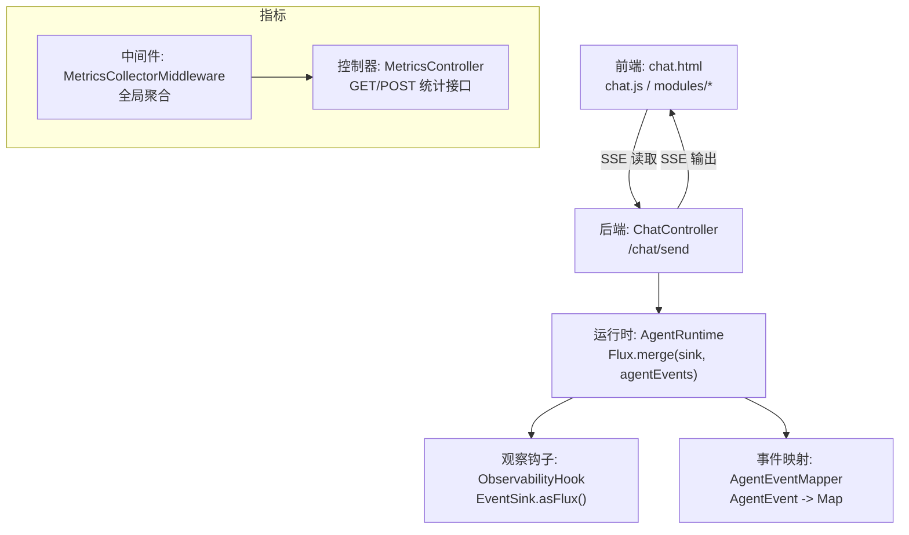

图表来源
- [ChatController.java:117-153](file://src/main/java/com/skloda/agentscope/controller/ChatController.java#L117-L153)
- [AgentRuntime.java:67-142](file://src/main/java/com/skloda/agentscope/runtime/AgentRuntime.java#L67-L142)
- [ObservabilityHook.java:16-67](file://src/main/java/com/skloda/agentscope/hook/ObservabilityHook.java#L16-L67)
- [EventSink.java:15-61](file://src/main/java/com/skloda/agentscope/runtime/EventSink.java#L15-L61)
- [AgentEventMapper.java:56-105](file://src/main/java/com/skloda/agentscope/runtime/AgentEventMapper.java#L56-L105)
- [MetricsCollectorMiddleware.java:21-44](file://src/main/java/com/skloda/agentscope/middleware/MetricsCollectorMiddleware.java#L21-L44)
- [MetricsController.java:12-57](file://src/main/java/com/skloda/agentscope/controller/MetricsController.java#L12-L57)

章节来源
- [chat.html:1-95](file://src/main/resources/templates/chat.html#L1-L95)
- [ChatController.java:44-153](file://src/main/java/com/skloda/agentscope/controller/ChatController.java#L44-L153)

## 核心组件
- ObservabilityHook：为多智能体生命周期与编排事件提供统一的发射点，并将事件暴露为 Flux，供前端 SSE 订阅。
- EventSink：基于 Reactor Sinks.Many 的多播背压缓存实现，定义多种 pipeline/routing/handoff/loop/graph/roundtable/task 事件常量及便捷方法。
- AgentEventMapper：将 AgentScope 2.0 的 AgentEvent（含文本/思考块、模型调用、工具调用、结果、异常等）转换为统一的 SSE payload（type 字段驱动前端分支）。
- MetricsCollectorMiddleware：在中间件层按 Agent 会话粒度采集耗时、工具调用、错误数、Token 用量与成本估算等聚合指标。
- AgentRuntime：组合自动事件与手动事件，完成 EventSink 的生命周期管理（完成时机与 Stream 终止），并注入审批恢复流。
- MultiAgentStreamSupport：在多智能体编排中复用 AgentEventMapper，把每个子任务的事件推送到 SSE sink，并在错误时发送结构化 error 事件。
- ChatController：负责接收请求，返回 ServerSentEvent，并把所有事件序列化为 JSON 字符串下发给前端。

章节来源
- [ObservabilityHook.java:1-67](file://src/main/java/com/skloda/agentscope/hook/ObservabilityHook.java#L1-L67)
- [EventSink.java:1-153](file://src/main/java/com/skloda/agentscope/runtime/EventSink.java#L1-L153)
- [AgentEventMapper.java:1-200](file://src/main/java/com/skloda/agentscope/runtime/AgentEventMapper.java#L1-L200)
- [MetricsCollectorMiddleware.java:1-200](file://src/main/java/com/skloda/agentscope/middleware/MetricsCollectorMiddleware.java#L1-L200)
- [AgentRuntime.java:26-168](file://src/main/java/com/skloda/agentscope/runtime/AgentRuntime.java#L26-L168)
- [MultiAgentStreamSupport.java:36-119](file://src/main/java/com/skloda/agentscope/runtime/MultiAgentStreamSupport.java#L36-L119)
- [ChatController.java:77-153](file://src/main/java/com/skloda/agentscope/controller/ChatController.java#L77-L153)

## 架构总览
下图展示了从用户请求到前端渲染的全链路数据流。后端通过 AgentRuntime 将 Agent 原生事件与手动多智能体事件合并，统一经由 ChatController 序列化下发；前端 chat.js 根据 type 分派至具体渲染逻辑，并在调试面板中以时间线形式展现。

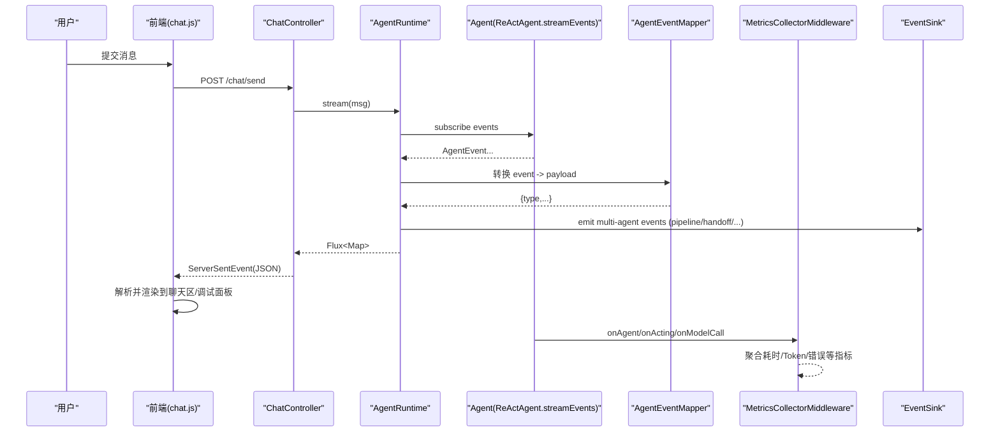

图表来源
- [ChatController.java:117-153](file://src/main/java/com/skloda/agentscope/controller/ChatController.java#L117-L153)
- [AgentRuntime.java:67-142](file://src/main/java/com/skloda/agentscope/runtime/AgentRuntime.java#L67-L142)
- [AgentEventMapper.java:56-105](file://src/main/java/com/skloda/agentscope/runtime/AgentEventMapper.java#L56-L105)
- [EventSink.java:15-61](file://src/main/java/com/skloda/agentscope/runtime/EventSink.java#L15-L61)
- [MetricsCollectorMiddleware.java:50-162](file://src/main/java/com/skloda/agentscope/middleware/MetricsCollectorMiddleware.java#L50-L162)
- [chat.js:178-230](file://src/main/resources/static/scripts/chat.js#L178-L230)

## 详细组件分析

### 事件采集与发布（ObservabilityHook 与 EventSink）
- ObservabilityHook 维护一个 EventSink 实例并提供 addConsumer/removeConsumer/reset 能力，便于第三方消费者消费事件；同时提供丰富的 emitXxx 封装，方便在各编排路径中发射 Pipeline、Routing、Handoff、Loop、Graph、Roundtable、Task 等事件。
- EventSink 底层使用 Reactor Sinks.Many.multicast 并设置背压缓冲策略，暴露 asFlux() 给订阅者（AgentRuntime 在此处合并事件），并通过 tryEmitNext 安全地派发事件，失败时记录警告日志。

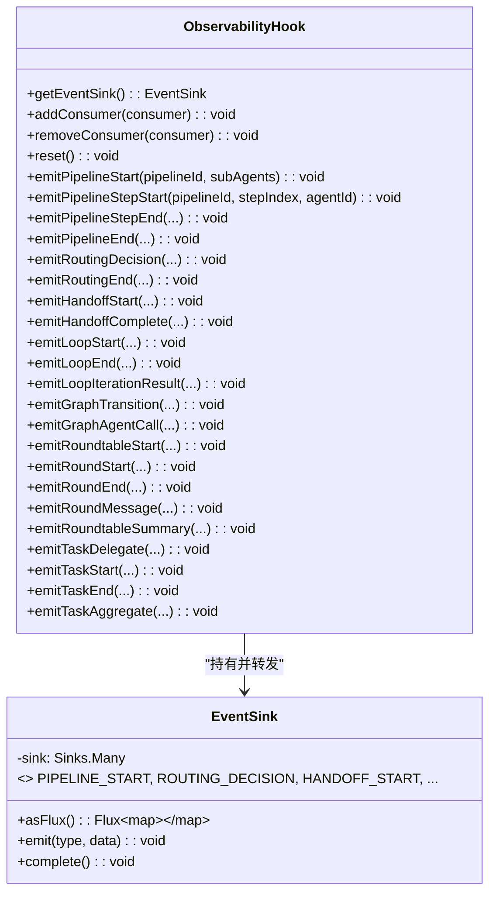

图表来源
- [ObservabilityHook.java:16-67](file://src/main/java/com/skloda/agentscope/hook/ObservabilityHook.java#L16-L67)
- [EventSink.java:15-152](file://src/main/java/com/skloda/agentscope/runtime/EventSink.java#L15-L152)

章节来源
- [ObservabilityHook.java:1-67](file://src/main/java/com/skloda/agentscope/hook/ObservabilityHook.java#L1-L67)
- [EventSink.java:1-153](file://src/main/java/com/skloda/agentscope/runtime/EventSink.java#L1-L153)

### 事件转换（AgentEventMapper）
- 覆盖全部 30+ AgentEventType，将事件转为前端可读的 JSON 结构（type 字段决定 UI 分支）。
- 对无需呈现的前端边界事件（如块开始/结束）直接丢弃；发生映射异常时返回 type=error 的兜底负载。
- 对关键事件进行了字段增强，例如 tool_start 携带 toolName、toolCallId；model_call_end 附加 token 用量（input/output/total）。

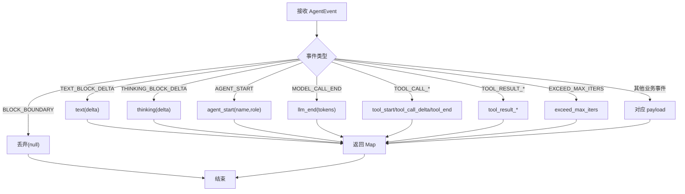

图表来源
- [AgentEventMapper.java:56-105](file://src/main/java/com/skloda/agentscope/runtime/AgentEventMapper.java#L56-L105)
- [AgentEventMapper.java:109-200](file://src/main/java/com/skloda/agentscope/runtime/AgentEventMapper.java#L109-L200)

章节来源
- [AgentEventMapper.java:1-200](file://src/main/java/com/skloda/agentscope/runtime/AgentEventMapper.java#L1-L200)

### 运行时流合并与完成控制（AgentRuntime）
- stream() 方法中，将 EventSink 的 Flux 与 Agent 的 streamEvents() 进行 merge，并使用 doFinally 确保 agent 事件流结束后同步关闭 EventSink，从而让前端的 concatWith('done') 正确触发，避免“悬挂流”。
- 当存在 HITL 审批时，会在完成阶段输出 pending_approval，后续由 /chat/approve 恢复执行。

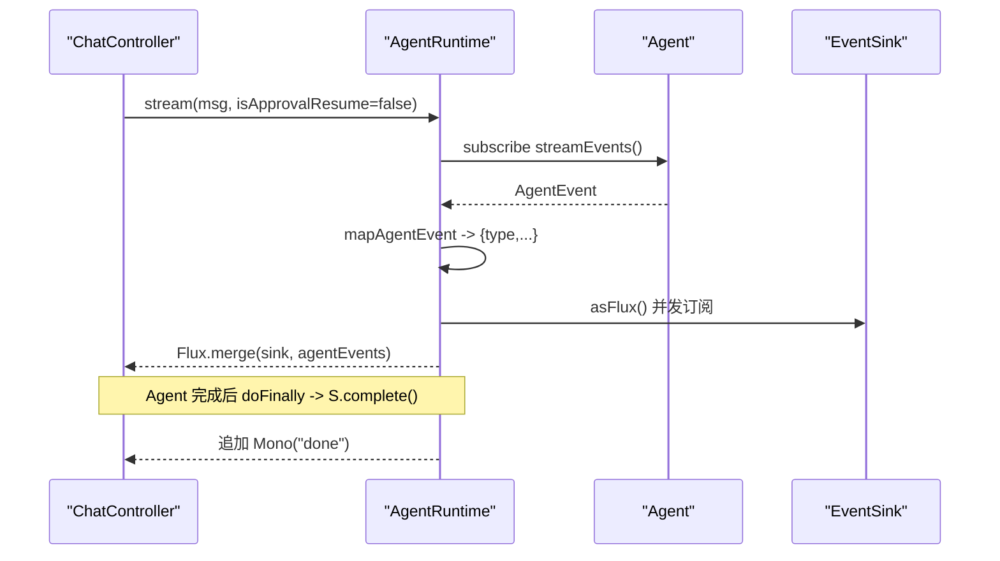

图表来源
- [AgentRuntime.java:67-142](file://src/main/java/com/skloda/agentscope/runtime/AgentRuntime.java#L67-L142)
- [AgentRuntime.java:156-183](file://src/main/java/com/skloda/agentscope/runtime/AgentRuntime.java#L156-L183)

章节来源
- [AgentRuntime.java:26-168](file://src/main/java/com/skloda/agentscope/runtime/AgentRuntime.java#L26-L168)

### 多智能体流支持（MultiAgentStreamSupport）
- 为顺序/并行/辩论等编排器提供统一的 runSubAgent 方法：对每个子代理用 AgentEventMapper 映射后，标记 source 标签写入外层 FluxSink，使前端能在调试面板区分事件来源；最终文本优先取 AgentResultEvent，回退到累积 text。
- 异常场景会向 sink 推送 type=error 的结构化事件，确保前端不丢失提示。

章节来源
- [MultiAgentStreamSupport.java:36-119](file://src/main/java/com/skloda/agentscope/runtime/MultiAgentStreamSupport.java#L36-L119)

### 指标收集与查询（MetricsCollectorMiddleware & MetricsController）
- 中间件拦截 Agent 全生命周期：onAgent（起止耗时）、onActing（工具级耗时/错误计数）、onModelCall（Token 累计），并以线程局部上下文隔离每轮指标；汇总到进程级集合，用于统计工具/Agent/GUI。
- 成本估算：基于输入/输出 Token 单价估算总成本（示例<docs>
# 实时监控面板

<cite>
**本文引用的文件**
- [ObservabilityHook.java](file://src/main/java/com/skloda/agentscope/hook/ObservabilityHook.java)
- [EventSink.java](file://src/main/java/com/skloda/agentscope/runtime/EventSink.java)
- [AgentEventMapper.java](file://src/main/java/com/skloda/agentscope/runtime/AgentEventMapper.java)
- [AgentRuntime.java](file://src/main/java/com/skloda/agentscope/runtime/AgentRuntime.java)
- [MetricsCollectorMiddleware.java](file://src/main/java/com/skloda/agentscope/middleware/MetricsCollectorMiddleware.java)
- [MetricsController.java](file://src/main/java/com/skloda/agentscope/controller/MetricsController.java)
- [chat.js](file://src/main/resources/static/scripts/chat.js)
- [debug.js](file://src/main/resources/static/scripts/modules/debug.js)
- [ui.js](file://src/main/resources/static/scripts/modules/ui.js)
- [agents.js](file://src/main/resources/static/scripts/modules/agents.js)
- [chat.html](file://src/main/resources/templates/chat.html)
- [ChatController.java](file://src/main/java/com/skloda/agentscope/controller/ChatController.java)
- [MultiAgentStreamSupport.java](file://src/main/java/com/skloda/agentscope/runtime/MultiAgentStreamSupport.java)
</cite>

## 目录
1. 引言
2. 项目结构
3. 核心组件
4. 架构总览
5. 关键组件详解
6. 依赖关系分析
7. 性能与可观测性
8. 故障诊断指南
9. 结论
10. 附录（最佳实践与扩展）

## 引言
本文件针对项目的“实时监控面板”进行全面技术说明，覆盖后端事件系统、流式数据管道、前端可视化渲染和指标体系。重点阐述：
- ObservabilityHook 的事件桥接机制与 EventSink 的多播发布订阅；
- AgentEventMapper 对 AgentScope 事件的统一映射；
- 中间件 MetricsCollectorMiddleware 的指标采集、聚合与对外接口；
- 前端 chat.js、debug.js、ui.js、agents.js 的模块职责与 SSE 连接管理；
- 可观测性指标定义、计算方式、告警与生产部署建议。

## 项目结构
- 后端：Spring Boot 控制器暴露聊天与指标接口；运行时以响应式 Flux 推送 SSE；事件经由 AgentEventMapper 转换为统一 JSON；中间件在 agent 执行链路中收集指标。
- 前端：HTML 模板加载模块化 JS；SSE 客户端在 chat.js 中解析并分发事件到调试面板与聊天区；各模块解耦负责状态、UI、Agent 列表等。

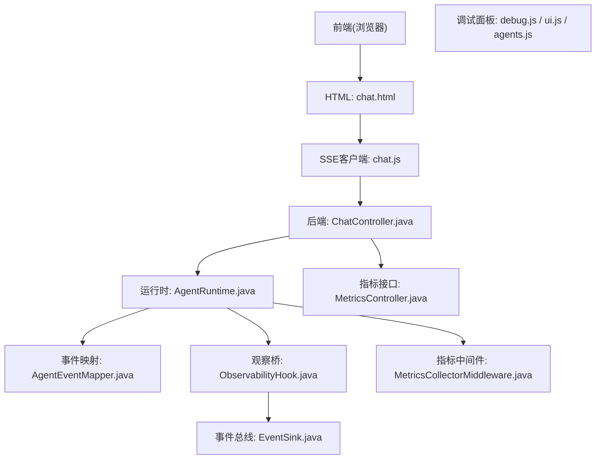

**图表来源**
- [ChatController.java:77-153](file://src/main/java/com/skloda/agentscope/controller/ChatController.java#L77-L153)
- [AgentRuntime.java:67-142](file://src/main/java/com/skloda/agentscope/runtime/AgentRuntime.java#L67-L142)
- [AgentEventMapper.java:64-104](file://src/main/java/com/skloda/agentscope/runtime/AgentEventMapper.java#L64-L104)
- [ObservabilityHook.java:20-67](file://src/main/java/com/skloda/agentscope/hook/ObservabilityHook.java#L20-L67)
- [EventSink.java:19-152](file://src/main/java/com/skloda/agentscope/runtime/EventSink.java#L19-L152)
- [MetricsCollectorMiddleware.java:50-162](file://src/main/java/com/skloda/agentscope/middleware/MetricsCollectorMiddleware.java#L50-L162)
- [MetricsController.java:15-57](file://src/main/java/com/skloda/agentscope/controller/MetricsController.java#L15-L57)
- [chat.html:18-94](file://src/main/resources/templates/chat.html#L18-L94)

**章节来源**
- [chat.html:18-94](file://src/main/resources/templates/chat.html#L18-L94)
- [ChatController.java:77-153](file://src/main/java/com/skloda/agentscope/controller/ChatController.java#L77-L153)

## 核心组件
- ObservabilityHook：将旧版 hook 消费侧桥接到新的 EventSink；提供便捷事件发射方法，便于多 Agent、流水线、路由、交接、循环、图流转、圆桌等事件下发。
- EventSink：基于 Reactor Sinks 的多播事件总线，为所有订阅者（如前端 SSE）广播带 type 与时间戳的负载；提供类型化的便捷发射方法。
- AgentEventMapper：把 AgentScope 原生事件映射为前端可读的 JSON（type 字段驱动 UI 分支），覆盖文本增量、思考增量、模型调用、工具调用、结果等事件；对块边界类事件返回 null（丢弃）。
- AgentRuntime：封装单次会话的流式处理；合并 EventSink 事件与 Agent 生命周期事件；支持审批续跑；完成后发送 done/pending_approval 事件。
- MetricsCollectorMiddleware：在 Agent 请求链路的 reasoning/acting/model call 等阶段拦截事件，累积工具耗时、模型 token、错误计数、估算成本，并提供日志输出与方法查询。
- MetricsController：暴露 /api/metrics 的相关接口用于打印与重置指标。
- 前端模块：
  - chat.js：建立 SSE 读取、解析、分发事件至聊天与调试面板；控制输入态、消息渲染、打字指示器。
  - debug.js：构建“轮次”卡片、时间线行、指标汇总、各类多 Agent 事件的处理逻辑。
  - ui.js：聊天消息渲染、思考框管理、DOM 引用。
  - agents.js：Agent 列表加载、分组、选择、模式切换与状态重置。

**章节来源**
- [ObservabilityHook.java:20-67](file://src/main/java/com/skloda/agentscope/hook/ObservabilityHook.java#L20-L67)
- [EventSink.java:19-152](file://src/main/java/com/skloda/agentscope/runtime/EventSink.java#L19-L152)
- [AgentEventMapper.java:64-200](file://src/main/java/com/skloda/agentscope/runtime/AgentEventMapper.java#L64-L200)
- [AgentRuntime.java:67-142](file://src/main/java/com/skloda/agentscope/runtime/AgentRuntime.java#L67-L142)
- [MetricsCollectorMiddleware.java:50-162](file://src/main/java/com/skloda/agentscope/middleware/MetricsCollectorMiddleware.java#L50-L162)
- [MetricsController.java:15-57](file://src/main/java/com/skloda/agentscope/controller/MetricsController.java#L15-L57)
- [chat.js:133-260](file://src/main/resources/static/scripts/chat.js#L133-L260)
- [debug.js:5-177](file://src/main/resources/static/scripts/modules/debug.js#L5-L177)
- [ui.js:4-115](file://src/main/resources/static/scripts/modules/ui.js#L4-L115)
- [agents.js:17-99](file://src/main/resources/static/scripts/modules/agents.js#L17-L99)

## 架构总览
实时面板通过以下流程协作：
1) 前端发送 /chat/send 建立 SSE；
2) ChatController 委托 AgentService/AgentRuntime 发起流式请求；
3) AgentRuntime 合并两类事件流：
   - 自动事件：agent.streamEvents() 经 AgentEventMapper 转为前端格式；
   - 手工事件：ObservabilityHook 内部 EventSink 多播；
4) 中间件在 agent 执行链路采集指标；
5) 前端根据事件 type 分派到聊天区或调试面板。

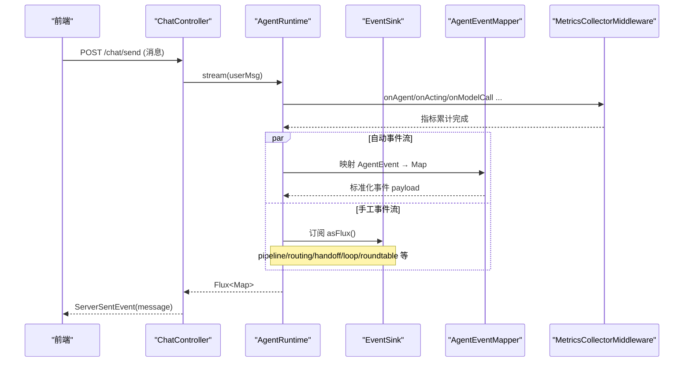

**图表来源**
- [ChatController.java:122-153](file://src/main/java/com/skloda/agentscope/controller/ChatController.java#L122-L153)
- [AgentRuntime.java:67-142](file://src/main/java/com/skloda/agentscope/runtime/AgentRuntime.java#L67-L142)
- [AgentEventMapper.java:64-104](file://src/main/java/com/skloda/agentscope/runtime/AgentEventMapper.java#L64-L104)
- [EventSink.java:19-152](file://src/main/java/com/skloda/agentscope/runtime/EventSink.java#L19-L152)
- [MetricsCollectorMiddleware.java:50-162](file://src/main/java/com/skloda/agentscope/middleware/MetricsCollectorMiddleware.java#L50-L162)

## 关键组件详解

### ObservabilityHook：事件桥接与手动事件发射
- 职责：兼容旧消费者，将 addConsumer 转换为由 EventSink 提供的 Flux；提供 emitXxx 系列便捷方法向 EventSink 发布多 Agent 场景事件（pipeline、routing、handoff、loop、graph、roundtable、task 等）。
- 设计要点：移除直接持有回调，改为订阅 Flux；reset/removeConsumer 无副作用或不需维护状态。

**章节来源**
- [ObservabilityHook.java:20-67](file://src/main/java/com/skloda/agentscope/hook/ObservabilityHook.java#L20-L67)

### EventSink：发布订阅总线
- 基于 reactor Sinks.Many.multicast + backpressure buffer，确保稳定吞吐。
- 每条事件附带 timestamp；提供强类型的 emitXxx 包装，简化上层代码。

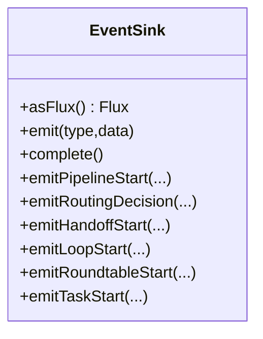

**图表来源**
- [EventSink.java:19-152](file://src/main/java/com/skloda/agentscope/runtime/EventSink.java#L19-L152)

**章节来源**
- [EventSink.java:19-152](file://src/main/java/com/skloda/agentscope/runtime/EventSink.java#L19-L152)

### AgentEventMapper：事件统一映射
- 将 AgentScope 的原生事件类型 switch/case 映射为前端语义化 type（如 text、thinking、llm_start/end、tool_start/end、agent_result_text 等）。
- 对块边界类事件返回 null（丢弃），避免无用刷屏。
- 错误安全：异常捕获返回 error payload，不中断上游流。

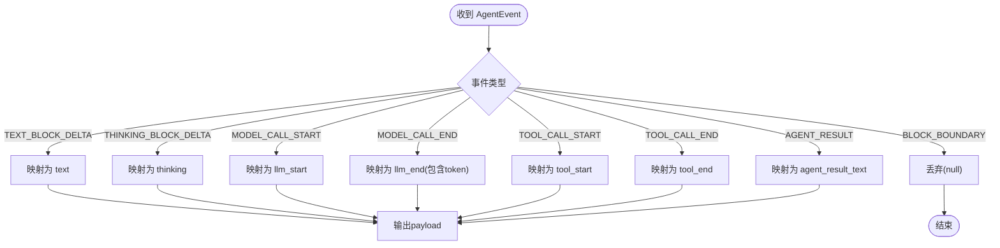

**图表来源**
- [AgentEventMapper.java:64-104](file://src/main/java/com/skloda/agentscope/runtime/AgentEventMapper.java#L64-L104)
- [AgentEventMapper.java:107-200](file://src/main/java/com/skloda/agentscope/runtime/AgentEventMapper.java#L107-L200)

**章节来源**
- [AgentEventMapper.java:64-200](file://src/main/java/com/skloda/agentscope/runtime/AgentEventMapper.java#L64-L200)

### AgentRuntime：会话流编排与合并
- 合并 EventSink 事件与 Agent 原生事件流，使用 Flux.merge；在代理流完成时关闭 sink，解决“流挂起”问题。
- 支持 HITL 续跑路径：resume mode 重新走 streamEvents 并保持事件一致性。
- 完成后发送 pending_approval 或 done，供前端进入下一步（用户审批或完成对话）。

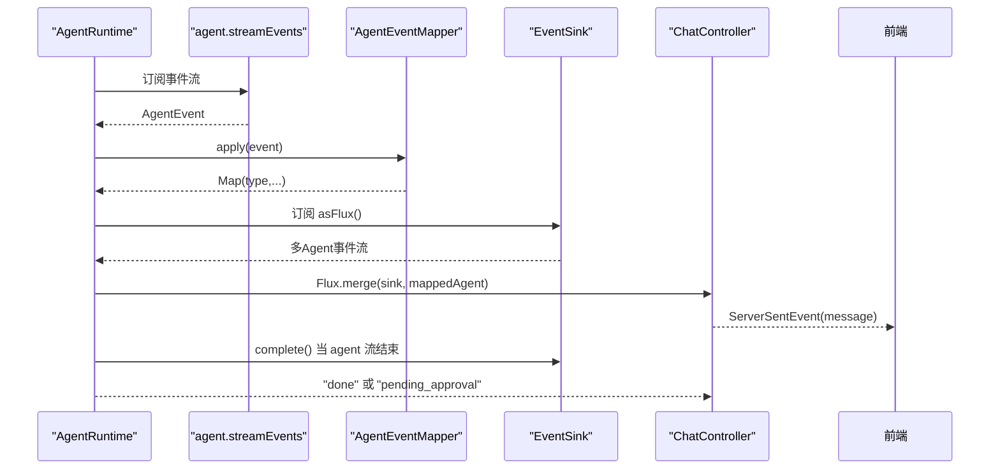

**图表来源**
- [AgentRuntime.java:67-142](file://src/main/java/com/skloda/agentscope/runtime/AgentRuntime.java#L67-L142)
- [AgentRuntime.java:156-183](file://src/main/java/com/skloda/agentscope/runtime/AgentRuntime.java#L156-L183)
- [ChatController.java:122-153](file://src/main/java/com/skloda/agentscope/controller/ChatController.java#L122-L153)

**章节来源**
- [AgentRuntime.java:67-183](file://src/main/java/com/skloda/agentscope/runtime/AgentRuntime.java#L67-L183)

### MetricsCollectorMiddleware：指标采集器
- 采集项：
  - 工具调用：每个工具名维度下调用次数、平均耗时、最小/最大耗时、错误数；
  - 模型调用：总 token 数（从 MODEL_CALL_END usage）、总调用次数；
  - Agent 维度：总时长、调用次数、最小/最大耗时；
  - 成本估算：基于配置的 token 单价粗略估算费用（日志显示）；
  - 全局统计：全局 token 总数、错误总数、调用总数。
- 输出：控制台日志与静态方法 printMetricsSummary；可通过 MetricsController 触发。

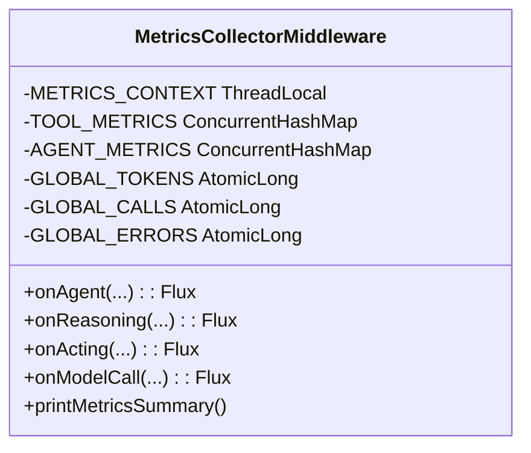

**图表来源**
- [MetricsCollectorMiddleware.java:31-162](file://src/main/java/com/skloda/agentscope/middleware/MetricsCollectorMiddleware.java#L31-L162)
- [MetricsController.java:22-57](file://src/main/java/com/skloda/agentscope/controller/MetricsController.java#L22-L57)

**章节来源**
- [MetricsCollectorMiddleware.java:50-162](file://src/main/java/com/skloda/agentscope/middleware/MetricsCollectorMiddleware.java#L50-L162)
- [MetricsController.java:22-57](file://src/main/java/com/skloda/agentscope/controller/MetricsController.java#L22-L57)

### 前端调试面板：模块化与交互
- chat.js：SSE 客户端核心。发起请求、创建读取器、按事件型解析，根据 payload.type 调度：
  - 聊天区：text/thinking/reasoning_text 等；
  - 调试面板：pipeline_*、routing_event、handoff_start、loop_*、graph_transition、roundtable_*、task_*、supervisor_*、blackboard_patched、expert_dispatch_* 等；
  - 状态：done/error/pending_approval 控制终端状态；
  - 打字指示器在首次内容到达后清除，改善体验。
- debug.js：管理“轮次”卡片、时间线行与指标面板；封装 startRound、endRound、updateRoundMetrics、addTimelineRow 等；集中处理多 Agent 事件，形成可视化轨迹。
- ui.js：负责消息气泡与“思考框”渲染，支持历史思考折叠、媒体附件展示等。
- agents.js：拉取 Agent 列表、分组展示、选中切换、模式控制（Harness 模式/BUILD/CLAW）等；切换 Agent 会清理当前流及调试区域状态。

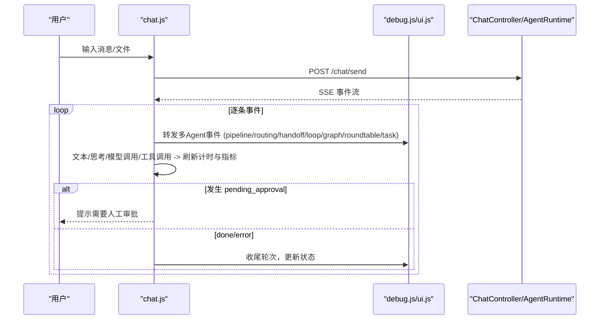

**图表来源**
- [chat.js:133-260](file://src/main/resources/static/scripts/chat.js#L133-L260)
- [debug.js:5-177](file://src/main/resources/static/scripts/modules/debug.js#L5-L177)
- [ui.js:14-115](file://src/main/resources/static/scripts/modules/ui.js#L14-L115)
- [agents.js:101-200](file://src/main/resources/static/scripts/modules/agents.js#L101-L200)
- [ChatController.java:122-186](file://src/main/java/com/skloda/agentscope/controller/ChatController.java#L122-L186)

**章节来源**
- [chat.js:133-260](file://src/main/resources/static/scripts/chat.js#L133-L260)
- [debug.js:5-177](file://src/main/resources/static/scripts/modules/debug.js#L5-L177)
- [ui.js:14-115](file://src/main/resources/static/scripts/modules/ui.js#L14-L115)
- [agents.js:17-200](file://src/main/resources/static/scripts/modules/agents.js#L17-L200)
- [ChatController.java:122-186](file://src/main/java/com/skloda/agentscope/controller/ChatController.java#L122-L186)

## 依赖关系分析
- AgentRuntime 依赖 AgentEventMapper、ObservabilityHook/EventSink；通过 MultiAgentStreamSupport 复用事件转发逻辑于子 Agent。
- 中间件以 AOP 风格挂载在 Agent 链路各处（onAgent/onReasoning/onActing/onModelCall）。
- 控制器层仅做序列化与异常兜底，核心业务下沉至运行时与中间件。

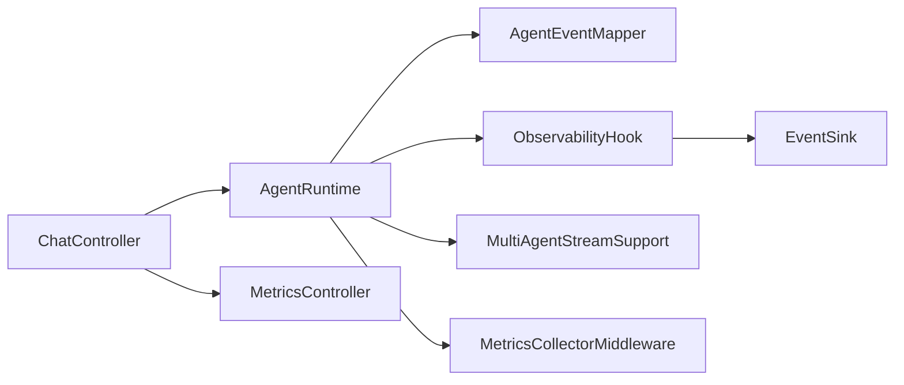

**图表来源**
- [AgentRuntime.java:67-142](file://src/main/java/com/skloda/agentscope/runtime/AgentRuntime.java#L67-L142)
- [MultiAgentStreamSupport.java:38-119](file://src/main/java/com/skloda/agentscope/runtime/MultiAgentStreamSupport.java#L38-L119)
- [ChatController.java:122-186](file://src/main/java/com/skloda/agentscope/controller/ChatController.java#L122-L186)
- [MetricsController.java:22-57](file://src/main/java/com/skloda/agentscope/controller/MetricsController.java#L22-L57)
- [MetricsCollectorMiddleware.java:50-162](file://src/main/java/com/skloda/agentscope/middleware/MetricsCollectorMiddleware.java#L50-L162)

**章节来源**
- [MultiAgentStreamSupport.java:38-119](file://src/main/java/com/skloda/agentscope/runtime/MultiAgentStreamSupport.java#L38-L119)

## 性能与可观测性

### 指标定义与计算
- 工具指标（按工具名维度）：
  - 调用次数：onActing 结束后每次 tool 执行完成 +1；
  - 总耗时/最小/最大耗时：onActing 前后时间差；
  - 错误数：onActing 报错 +1。
- 模型指标（全局）：
  - 总调用次数：onAgent 完成后 +1；
  - 总 token：onModelCall 中提取 MODEL_CALL_END.usage.totalTokens 累加；
  - 成本估算：按内置单价换算展示（日志中显示）。
- Agent 指标（按 Agent 名维度）：
  - 调用次数、总耗时、最小/最大耗时。
- 前端轮次指标（debug.js 计算）：
  - 输入/输出 token、LLM 总耗时、工具总耗时与调用次数、速度（tokens/s）等。

**章节来源**
- [MetricsCollectorMiddleware.java:61-91](file://src/main/java/com/skloda/agentscope/middleware/MetricsCollectorMiddleware.java#L61-L91)
- [MetricsCollectorMiddleware.java:120-162](file://src/main/java/com/skloda/agentscope/middleware/MetricsCollectorMiddleware.java#L120-L162)
- [MetricsCollectorMiddleware.java:187-200](file://src/main/java/com/skloda/agentscope/middleware/MetricsCollectorMiddleware.java#L187-L200)
- [debug.js:113-153](file://src/main/resources/static/scripts/modules/debug.js#L113-L153)

### 前端渲染与用户体验优化
- 首次内容事件清除“正在输入”动画，避免空白真空；
- 事件分类：聊天内容与调试面板内容分离，保证主视觉连贯；
- 多 Agent 事件丰富时间线，增强复杂任务的可追溯性。

**章节来源**
- [chat.js:152-176](file://src/main/resources/static/scripts/chat.js#L152-L176)
- [chat.js:178-260](file://src/main/resources/static/scripts/chat.js#L178-L260)

### 实时通信（SSE 连接管理）
- 前端使用 ReadableStream 逐步读取事件并解析；
- 通过 AbortController 支持取消；
- 遇到空消息或多模态输入时进行参数组装与上传处理。

**章节来源**
- [chat.js:24-110](file://src/main/resources/static/scripts/chat.js#L24-L110)
- [chat.js:129-176](file://src/main/resources/static/scripts/chat.js#L129-L176)

## 故障诊断指南

### 常见问题定位
- 流挂起/永远 isStreaming：检查 AgentRuntime 中 EventSink.complete 是否在 agent 流结束时被触发（避免外部流的循环依赖导致 merge 无法完成）。
- 丢失工具/模型事件：确认 AgentEventMapper 未误判阻塞；若 type 为非前端的“块边界”，会被丢弃为正常行为。
- 指标不准确：验证中间件是否正确拦截 onActing/onModelCall；控制台日志查看 METRICS 输出。

### 实用接口与操作
- /api/metrics/status：获取可用端点与说明；
- /api/metrics/print：打印当前聚合指标到服务器日志；
- /api/metrics/reset：重置全局限额（如适用，见实现）。

**章节来源**
- [AgentRuntime.java:112-142](file://src/main/java/com/skloda/agentscope/runtime/AgentRuntime.java#L112-L142)
- [AgentEventMapper.java:96-104](file://src/main/java/com/skloda/agentscope/runtime/AgentEventMapper.java#L96-L104)
- [MetricsController.java:22-57](file://src/main/java/com/skloda/agentscope/controller/MetricsController.java#L22-L57)

## 结论
本实时监控面板通过“后端事件+中间件指标+前端可视化”的三层架构，实现了端到端的高保真可观测性：
- 后端：ObservabilityHook/EventSink 提供统一多 Agent 事件通道；AgentEventMapper 确保前后端契约稳定；MetricsCollectorMiddleware 汇聚关键性能与资源指标。
- 前端：chat.js 作为中枢分发事件，debug.js/ui.js/agents.js 协同完成轮次、时间线与交互，提供直观的调试体验。
- 运行期：SSE 流式传输保障低延迟更新，配合状态机化管理避免 UI 悬空。

结合文档中的扩展点（新增事件类型、指标维度、中间件策略），可在保持向后兼容的前提下持续演进监控能力。

## 附录（最佳实践与扩展）

- 面板定制指南
  - 新增事件：在 AgentEventMapper 中添加新的 type 映射；在 chat.js 中新增 switch 分支；在 debug.js 中补充对应时间线/指标逻辑。
  - UI 主题：修改 css 与模板布局（chat.html 右侧调试面板容器）。
  - Agent 分组：agents.js 中扩展 CATEGORIES，增加自定义分类。

- 指标扩展方法
  - 扩展中间件：在 MetricsCollectorMiddleware 新增采集点（如外部 API、缓存命中率等）；必要时引入独立的 metrics 存储或导出。
  - 对外暴露：在 MetricsController 添加新的查询端点，以便接入 Prometheus/Grafana 或内部看板。

- 告警规则配置（建议）
  - 错误率：按工具/Agent 维度设定阈值（例如单工具错误率 > 5% 报警）。
  - 延迟：单工具 p95/p99 耗时超过阈值。
  - Token/Cost：单位时间消耗突增告警。
  - 实施建议：结合外部监控系统抓取控制台日志或新增导出端口，统一纳入告警平台。

- 生产环境部署建议
  - 日志分级：默认 INFO，调试打开 DEBUG；将 METRICS 日志单独落地到专用文件；
  - 背压与缓冲：EventSink 采用缓冲策略，需评估内存占用；高并发场景注意 JVM 堆与 GC；
  - 超时与熔断：在上游网关或框架层设置 SSE 超时与重试；
  - 资源隔离：指标统计使用线程本地上下文与原子计数器，避免锁竞争；如需跨进程聚合，考虑对接时序数据库。

[本节为通用指导，不直接分析具体源码]