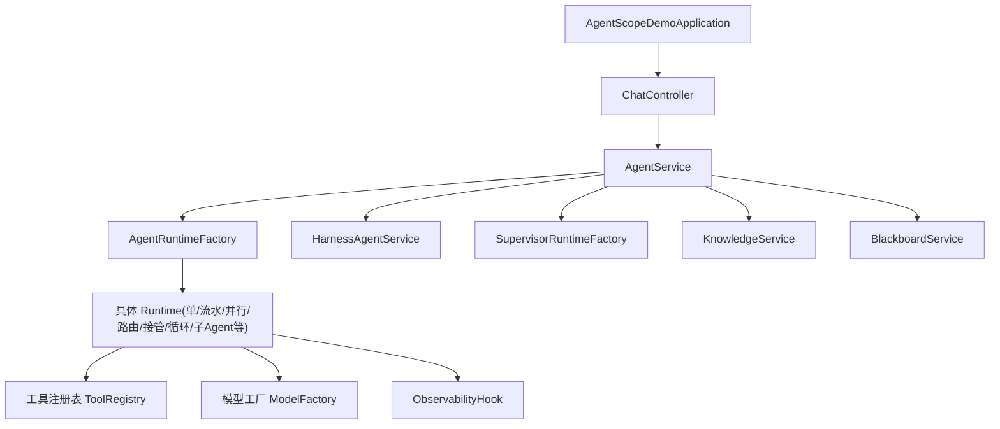
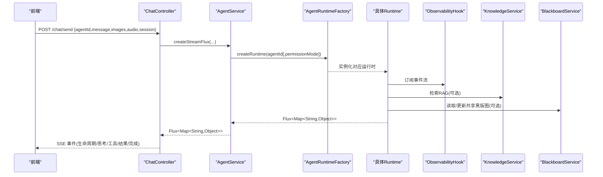
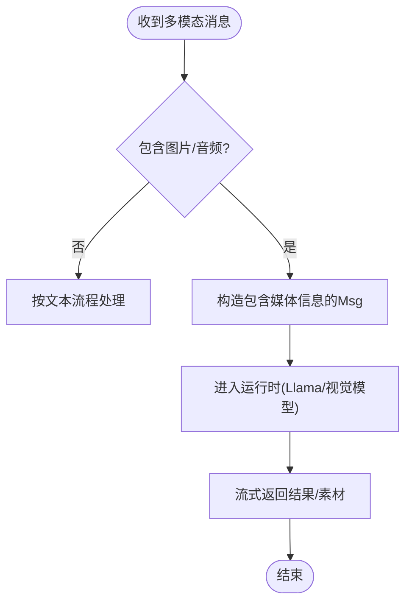
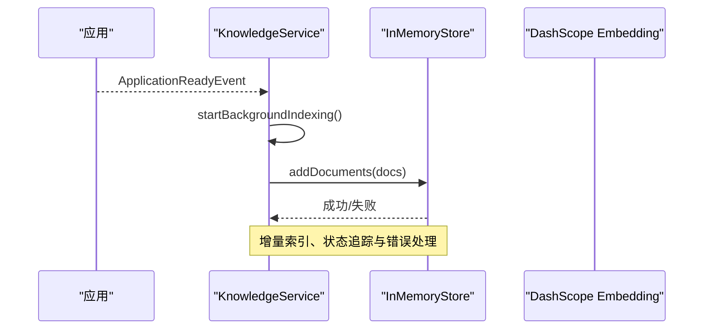
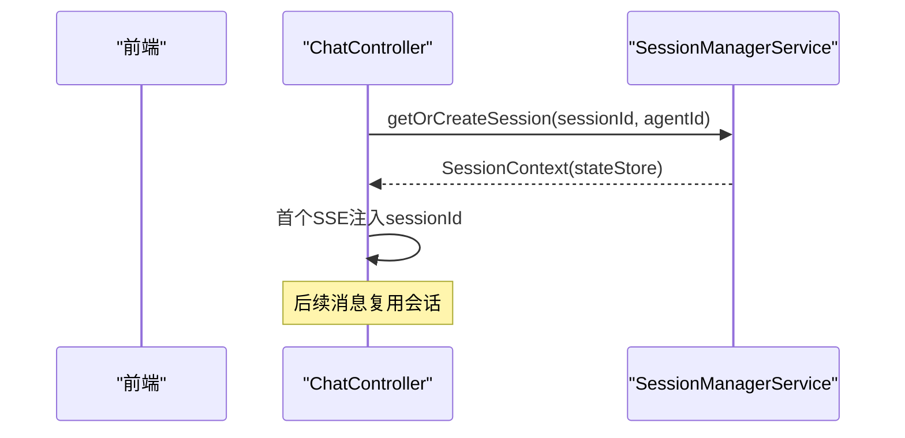
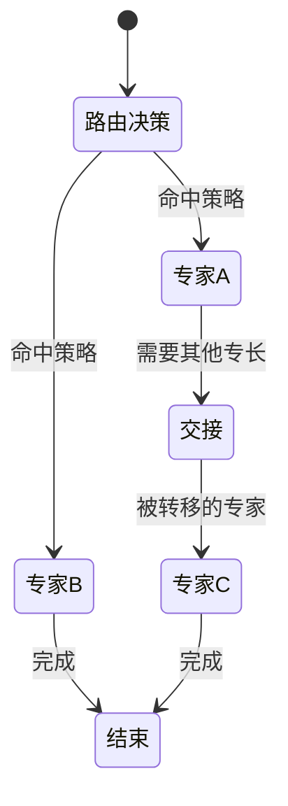
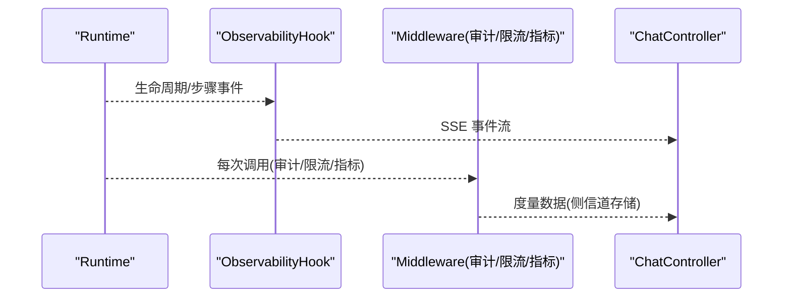
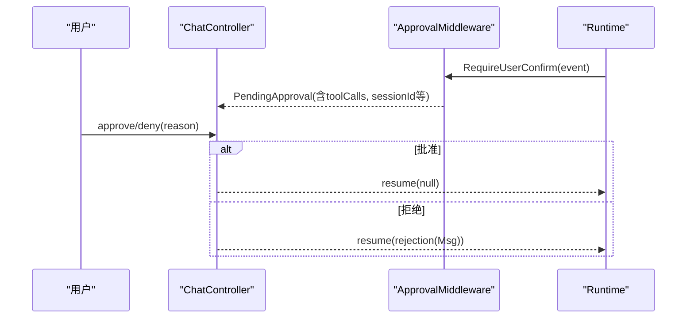
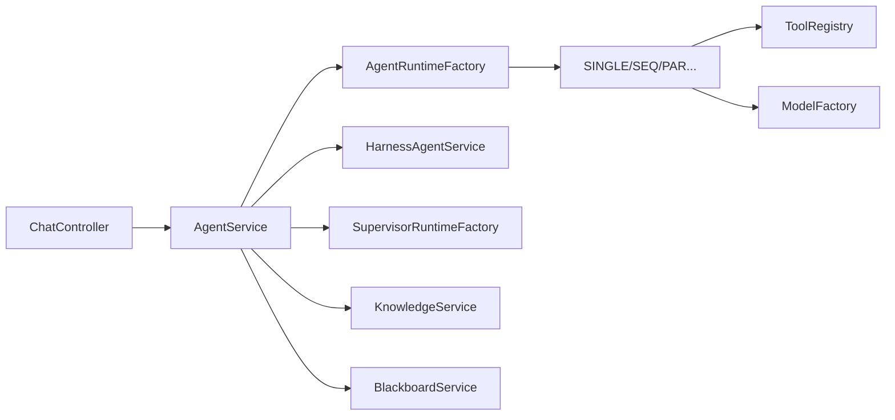

# 核心特性介绍

<cite>
**本文引用的文件**   
- [AgentScopeDemoApplication.java](file://src/main/java/com/skloda/agentscope/AgentScopeDemoApplication.java)
- [ChatController.java](file://src/main/java/com/skloda/agentscope/controller/ChatController.java)
- [AgentService.java](file://src/main/java/com/skloda/agentscope/service/AgentService.java)
- [AgentRuntimeFactory.java](file://src/main/java/com/skloda/agentscope/runtime/AgentRuntimeFactory.java)
- [BlackboardService.java](file://src/main/java/com/skloda/agentscope/blackboard/BlackboardService.java)
- [ToolRegistry.java](file://src/main/java/com/skloda/agentscope/tool/ToolRegistry.java)
- [KnowledgeService.java](file://src/main/java/com/skloda/agentscope/service/KnowledgeService.java)
- [ObservabilityHook.java](file://src/main/java/com/skloda/agentscope/hook/ObservabilityHook.java)
- [ModelFactory.java](file://src/main/java/com/skloda/agentscope/model/ModelFactory.java)
- [MiddlewareRegistry.java](file://src/main/java/com/skloda/agentscope/middleware/MiddlewareRegistry.java)
- [agents.yml](file://src/main/resources/config/agents.yml)
- [README.md](file://README.md)
- [pom.xml](file://pom.xml)
</cite>

## 目录
1. [简介](#简介)
2. [项目结构](#项目结构)
3. [核心组件](#核心组件)
4. [架构总览](#架构总览)
5. [详细组件分析](#详细组件分析)
6. [依赖关系分析](#依赖关系分析)
7. [性能考量](#性能考量)
8. [故障排查指南](#故障排查指南)
9. [结论](#结论)

## 简介
本项目基于 AgentScope v2.x（Java）构建，提供一个企业级可观测、可扩展的 Agent 平台演示。覆盖八大类 Agent：基础对话、工具调用、任务型文档解析与生成、银行发票自动生成、视觉理解、语音助手、搜索与信息获取、项目规划。支持文本/图片/语音多模态输入；内置 Generic RAG 知识库；提供会话持久化与会话状态同步；实现多种多智能体协作编排（顺序流水线、智能路由、Agent 交接等）；附带实时调试面板与指标采集；并通过中间件体系提供权限、审计、限流、审批等企业能力。

## 项目结构
- 启动入口与应用装配
  - Spring Boot 应用入口位于入口类，启用配置属性并在服务器就绪时打印地址提示。
- 控制器层
  - 聊天与 SSE 流式响应、文件上传/下载、飞书渠道与 AG-UI 协议端口通过控制器暴露。
- 服务与运行时
  - 统一的 Agent 路由与服务封装，按 Agent 类型创建并返回流式事件。
- 模型与工具
  - ModelFactory 统一管理模型解析与创建；ToolRegistry 动态发现与注册工具、技能映射。
- RAG 与知识
  - KnowledgeService 提供本地知识目录索引与上传文档索引；支持 InMemoryStore 向量存储。
- 黑版图共享
  - BlackboardService 提供会话级共享黑版图，面向路由/专家/Supervisor 的多智能体协作上下文共享。
- 可观测性
  - ObservabilityHook 桥接事件系统到可视化与调试面板；结合 Metrics 中间件输出指标。

**图示来源**
- [AgentScopeDemoApplication.java:11-34](file://src/main/java/com/skloda/agentscope/AgentScopeDemoApplication.java#L11-L34)
- [ChatController.java:44-153](file://src/main/java/com/skloda/agentscope/controller/ChatController.java#L44-L153)
- [AgentService.java:80-177](file://src/main/java/com/skloda/agentscope/service/AgentService.java#L80-L177)
- [AgentRuntimeFactory.java:41-127](file://src/main/java/com/skloda/agentscope/runtime/AgentRuntimeFactory.java#L41-L127)

**章节来源**
- [AgentScopeDemoApplication.java:11-34](file://src/main/java/com/skloda/agentscope/AgentScopeDemoApplication.java#L11-L34)
- [README.md:1-96](file://README.md#L1-L96)

## 核心组件
- 统一接口与流式处理
  - ChatController 接收消息与文件，构造请求并通过 AgentService 创建 Flux SSE 流。
  - AgentService 负责参数校验、Session 注入、HARNESS/SUPERVISOR 分流、工作流记录等。
- 运行时选择
  - AgentRuntimeFactory 根据 agents.yml 中的 AgentType 选择不同运行时（SINGLE、ROUTING、HANDOFFS、STATE_GRAPH、MSG_HUB、HARNESS、SEQUENTIAL、PARALLEL、DEBATE、LOOP、SUBAGENT_SEQ/PAR）。
- 多模态输入
  - ChatRequest 支持文本、图片（Base64/URL）、音频路径；AgentService 组装 Msg 并传入运行时。
- 知识检索（Generic RAG）
  - KnowledgeService 使用 DashScope 文本向量模型 + InMemoryStore 做语义检索；启动后可扫描本地 knowledge 目录自动索引。
- 共享黑版图
  - BlackboardService 以 (userId, sessionId) 维度隔离，串行化写锁避免并发冲突，供 Supervisor 与各 Expert 共享上下文。
- 观测与指标
  - ObservabilityHook 向 EventSink 广播多智能体生命周期事件；结合 MetricsCollectorMiddleware 统计 Token、耗时、工具调用等指标。
- 企业能力中间件
  - MiddlewareRegistry 注册审计、限流、上下文增强、详细审计、指标等中间件；ApprovalMiddleware 配合审批流程（Human-in-the-loop）。

**章节来源**
- [ChatController.java:117-153](file://src/main/java/com/skloda/agentscope/controller/ChatController.java#L117-L153)
- [AgentService.java:120-177](file://src/main/java/com/skloda/agentscope/service/AgentService.java#L120-L177)
- [AgentRuntimeFactory.java:41-127](file://src/main/java/com/skloda/agentscope/runtime/AgentRuntimeFactory.java#L41-L127)
- [KnowledgeService.java:73-89](file://src/main/java/com/skloda/agentscope/service/KnowledgeService.java#L73-L89)
- [BlackboardService.java:18-40](file://src/main/java/com/skloda/agentscope/blackboard/BlackboardService.java#L18-L40)
- [ObservabilityHook.java:16-67](file://src/main/java/com/skloda/agentscope/hook/ObservabilityHook.java#L16-L67)
- [MiddlewareRegistry.java:23-40](file://src/main/java/com/skloda/agentscope/middleware/MiddlewareRegistry.java#L23-L40)

## 架构总览
整体采用“控制器 → 服务 → 运行时”的分层设计，结合 Reactive 流式事件（SSE）驱动前端调试面板实时更新。关键数据流向：
- 前端发送 /chat/send（含 agentId、sessionId、图片/音频等），服务端聚合为 Msg。
- AgentService 按类型分发到对应 Runtime（包含 Harness/Supervisor）。
- Runtime 执行期间经 ObservabilityHook 和中间件捕获事件/指标，转化为 SSE 事件下发前端。
- 需要时接入 RAG 知识检索或共享黑版图。

**图示来源**
- [ChatController.java:122-153](file://src/main/java/com/skloda/agentscope/controller/ChatController.java#L122-L153)
- [AgentService.java:140-177](file://src/main/java/com/skloda/agentscope/service/AgentService.java#L140-L177)
- [AgentRuntimeFactory.java:41-127](file://src/main/java/com/skloda/agentscope/runtime/AgentRuntimeFactory.java#L41-L127)
- [ObservabilityHook.java:30-67](file://src/main/java/com/skloda/agentscope/hook/ObservabilityHook.java#L30-L67)

**章节来源**
- [README.md:63-96](file://README.md#L63-L96)

## 详细组件分析

### 1. 八大 Agent 类型：原理与使用
- Basic Chat（简单对话）
  - 原理：SINGLE 运行时，直连 LLM 流式响应；可开启 thinking/reasoning。
  - 配置：agents.yml 中定义 agentId=chat-basic。
  - 使用场景：快速验证对话与 prompt 调优。
- Tool Calling（工具调用）
  - 原理：在 SINGLE 基础上绑定 userTools/systemTools，Agent 自主决定调用；ToolRegistry 自动发现 @Tool 注解方法与 SKILL.md 映射。
  - 配置：agents.yml 中添加 userTools/systemTools。
  - 使用场景：计算、天气、文件读写等外置能力。
- Task Agent（任务文档解析）
  - 原理：绑定解析工具（docx/pdf/xlsx），结合 skill 解析上传文件；可按需触发模板生成。
  - 配置：skills: docx|pdf|xlsx；userTools: parse_docx|parse_pdf|parse_xlsx。
  - 使用场景：上传文件后总结/提取/问答。
- Bank Invoice（银行发票生成）
  - 原理：绑定 bank_invoice_java skill 及 generate_bank_invoice 工具，收集 12 个字段后批量生成 Excel/Word。
  - 配置：agents.yml 中 agentId=bank-invoice；approvalTools 可增加审批拦截。
  - 使用场景：合规与财务单据自动化生成。
- Vision Analyzer（视觉分析）
  - 原理：支持图片输入，交由 LLM 进行 OCR 与图像理解；可通过技能/工具扩展。
  - 使用场景：票据识别、图表解读。
- Voice Assistant（语音助手）
  - 原理：支持音频路径，走文本化后再推理；可联动 TTS（由上层集成或后续扩展）。
  - 使用场景：语音问答与播报。
- Search Assistant（搜索助手）
  - 原理：通过 WebSearchTool 或其他搜索工具获取实时信息，再融合回答。
  - 使用场景：时效性问题、联网查询。
- Project Planner（项目规划）
  - 原理：利用计划/任务模式（Harness Plan Mode/Task List）进行结构化分解与跟踪。
  - 使用场景：任务拆解、进度跟踪。

**章节来源**
- [agents.yml:1-200](file://src/main/resources/config/agents.yml#L1-L200)
- [ToolRegistry.java:30-44](file://src/main/java/com/skloda/agentscope/tool/ToolRegistry.java#L30-L44)
- [README.md:7-28](file://README.md#L7-L28)

### 2. 多模态支持：文本/图片/语音
- 输入承载
  - ChatController 接收 images/audio 路径/Base64，注入到 Msg 中。
- 传输与渲染
  - 流式 SSE 将多模态结果（含引用、链接）下发前端渲染。
- 典型链路
  - 图片→LLM 视觉理解→输出文字/标注/报告；
  - 语音→转文字→Agent 处理→TTS（若配置）。

**章节来源**
- [ChatController.java:122-153](file://src/main/java/com/skloda/agentscope/controller/ChatController.java#L122-L153)
- [README.md:17-21](file://README.md#L17-L21)

### 3. RAG 知识库（Generic 模式）
- 技术实现
  - KnowledgeService 使用 DashScopeTextEmbedding + InMemoryStore 构建 SimpleKnowledge；支持 PDF/DOCX/TXT/MD 等阅读器和分块入库。
  - ApplicationReadyEvent 触发后台索引器扫描 src/main/resources/knowledge 目录。
- 配置方法
  - application.yml 控制 API Key、嵌入模型与维度；agents.yml 中设置 ragEnabled/ragMode/ragRetrieveLimit 等。
- 使用示例
  - 上传文档后等待 INDEXED；切换到 RAG Chat 提问；支持引用原文。

**图示来源**
- [KnowledgeService.java:91-125](file://src/main/java/com/skloda/agentscope/service/KnowledgeService.java#L91-L125)
- [KnowledgeService.java:143-178](file://src/main/java/com/skloda/agentscope/service/KnowledgeService.java#L143-L178)

**章节来源**
- [KnowledgeService.java:73-89](file://src/main/java/com/skloda/agentscope/service/KnowledgeService.java#L73-L89)
- [agents.yml:171-199](file://src/main/resources/config/agents.yml#L171-L199)
- [README.md:22-28](file://README.md#L22-L28)

### 4. 会话管理：持久化与状态同步
- 会话ID注入
  - 首次事件携带 sessionId，用于前后端一致跟踪。
- 存储策略
  - SessionManagerService 维护会话上下文；AgentScope 的 AgentStateStore 可用于分布式存储（Redis/MySQL/PostgreSQL，按需 profile）。
- 状态同步
  - 黑版图与会话状态分离：SharedBlackboard 专用于跨专家共享，Conversation State 保持会话记忆。

**章节来源**
- [ChatController.java:133-148](file://src/main/java/com/skloda/agentscope/controller/ChatController.java#L133-L148)

### 5. 多智能体协作：Sequential Pipeline / Intelligent Routing / Agent Handoffs
- Sequential Pipeline
  - 多个子智能体按序执行，便于职责拆分与可控流转。
- Intelligent Routing
  - 根据用户意图选择专家 Agent；共享黑版图用于传递上下文。
- Agent Handoffs
  - 当某子任务超出能力范围时，移交至另一 Agent 继续。
- 事件与可视化
  - 所有步骤均通过 ObservabilityHook 产生事件，供前端 Timeline 展示。

**章节来源**
- [AgentRuntimeFactory.java:41-127](file://src/main/java/com/skloda/agentscope/runtime/AgentRuntimeFactory.java#L41-L127)
- [ObservabilityHook.java:45-67](file://src/main/java/com/skloda/agentscope/hook/ObservabilityHook.java#L45-L67)
- [README.md:34-38](file://README.md#L34-L38)

### 6. 实时调试面板：可观测性与指标
- 事件源
  - Agent.streamEvents() 与 EventSink（多智能体事件）统一经由 AgentEventMapper 转换为 SSE 事件。
- 指标收集
  - MetricsCollectorMiddleware 收集 LLM Token、调用时延、工具调用次数等；Distributed state store/profile 不影响观测。
- 面板内容
  - Timeline 展示各阶段起止时间；Metrics 显示资源消耗；Thinking/Tools/Multi-Agent 详情丰富。

**章节来源**
- [ObservabilityHook.java:16-67](file://src/main/java/com/skloda/agentscope/hook/ObservabilityHook.java#L16-L67)
- [MiddlewareRegistry.java:23-40](file://src/main/java/com/skloda/agentscope/middleware/MiddlewareRegistry.java#L23-L40)

### 7. 企业级特性：权限、审计、限流、审批
- 权限控制
  - 支持通过 permissionMode 创建带权限上下文的运行时（如只读/受限操作）。
- 审计日志
  - AuditLoggingMiddleware/DetailedAuditMiddleware 记录请求、Agent、工具与结果摘要，便于追溯。
- 限流保护
  - RateLimitMiddleware 对高频请求进行限流，避免资源耗尽。
- 审批流程（Human-in-the-loop）
  - ApprovalMiddleware 消费 require_user_confirm/approval 事件，暂停运行等待人工审批；支持拒绝回退。
  - ChatController.handleApproval 通过重建 AgentRuntime 恢复执行（通过 null message 继续工具执行或带拒绝原因终止）。

**章节来源**
- [ChatController.java:155-200](file://src/main/java/com/skloda/agentscope/controller/ChatController.java#L155-L200)
- [MiddlewareRegistry.java:23-40](file://src/main/java/com/skloda/agentscope/middleware/MiddlewareRegistry.java#L23-L40)

### 8. 工具与技能：注册机制与扩展点
- 自动发现
  - ToolRegistry 扫描 com.skloda.agentscope.tool 包下的 @Tool 方法，同时注册系统内置工具（ReadFile/WriteFile/ShellCommand）。
- 技能映射
  - 读取 resources/skills/*/SKILL.md 的 frontmatter，建立“技能名 → 工具列表”的动态映射。
- 使用方式
  - 在 agents.yml 中将工具名加入 userTools/systemTools 即可启用；新增工具类无需改动主流程。

**章节来源**
- [ToolRegistry.java:71-151](file://src/main/java/com/skloda/agentscope/tool/ToolRegistry.java#L71-L151)
- [ToolRegistry.java:153-199](file://src/main/java/com/skloda/agentscope/tool/ToolRegistry.java#L153-L199)
- [agents.yml:45-160](file://src/main/resources/config/agents.yml#L45-L160)

### 9. 模型抽象与提供者
- ModelFactory 统一从 ModelRegistry 解析模型 ID，自动补全 provider（如 dashscope:qwen-plus）。
- 支持 streaming、enableThinking、Formatter（DashScopeChatFormatter）。
- 通过环境变量或配置注入 API Key。

**章节来源**
- [ModelFactory.java:21-55](file://src/main/java/com/skloda/agentscope/model/ModelFactory.java#L21-L55)
- [ModelFactory.java:58-95](file://src/main/java/com/skloda/agentscope/model/ModelFactory.java#L58-L95)

## 依赖关系分析
- 框架依赖
  - Spring Boot 3.5.14、Reactor Reactor（SSE 流）。
  - Apache POI、PDFBox 用于文档解析。
  - agentscope-spring-boot-starter/core/harness/extensions（RAG/Memory/A2A/Channel/AG-UI/State Store 等多扩展，按 Profile 启用）。
- 模块耦合
  - ChatController 依赖 AgentService；AgentService 依赖 RuntimeFactory；RuntimeFactory 组合 Composite 与各类 Runtime。
  - ToolRegistry 与 ModelFactory 为横向基础设施。
  - KnowledgeService 与 BlackboardService 作为纵向增强。

**图示来源**
- [ChatController.java:44-153](file://src/main/java/com/skloda/agentscope/controller/ChatController.java#L44-L153)
- [AgentService.java:140-177](file://src/main/java/com/skloda/agentscope/service/AgentService.java#L140-L177)
- [AgentRuntimeFactory.java:41-127](file://src/main/java/com/skloda/agentscope/runtime/AgentRuntimeFactory.java#L41-L127)

**章节来源**
- [pom.xml:28-188](file://pom.xml#L28-L188)
- [README.md:166-193](file://README.md#L166-L193)

## 性能考量
- 流式处理
  - 充分利用 Spring WebFlux 与 AgentScope 的 streamEvents，降低首字节延迟，提升交互体验。
- 索引与负载
  - RAG 背景索引使用单线程守护线程，避免阻塞主流程；生产建议切换为外部 Vector Store。
- 并发与锁
  - 共享黑版图按 (userId,sessionId) 粒度加锁，保证单调版本与原子写入；适合单机场景，分布式需 CAS 优化。
- 可观测性开销
  - 指标与审计中间件可开关；生产建议保留详细审计以支撑排障。
- 资源配置
  - 合理限制 multipart max-file-size、模型并发上限，避免资源争用。

## 故障排查指南
- 常见问题定位
  - 无法连接模型：检查 dashscope api-key 与环境变量。
  - 工具未生效：确认 tools 已在 agents.yml 绑定；ToolRegistry 控制台输出是否登记。
  - RAG 无命中：核对 KnowledgeService 索引状态，确认文档格式与分块有效。
  - 权限/限流阻断：查看 Middlewares 日志，确认策略是否过于严格。
  - 审批挂起：确认 pending approval 存在且未过期；前端调用 /chat/approve 后恢复。
- 日志级别
  - logging.level.io.agentscope=DEBUG 获取更多内部细节。
- 前端断连
  - SSE 流错误会通过 error/done 事件通知；检查网络与服务端 onerror 分支。

**章节来源**
- [KnowledgeService.java:143-178](file://src/main/java/com/skloda/agentscope/service/KnowledgeService.java#L143-L178)
- [ToolRegistry.java:30-44](file://src/main/java/com/skloda/agentscope/tool/ToolRegistry.java#L30-L44)
- [ChatController.java:148-153](file://src/main/java/com/skloda/agentscope/controller/ChatController.java#L148-L153)
- [MiddlewareRegistry.java:23-40](file://src/main/java/com/skloda/agentscope/middleware/MiddlewareRegistry.java#L23-L40)

## 结论
本 Demo 展示了基于 AgentScope v2 的企业级 Agent 平台能力：八大 Agent 类型覆盖常见业务场景；多模态支持满足多样化输入需求；Generic RAG 提供易用的知识增强；会话与共享黑版图保障多智能体协作一致性；中间件体系实现权限、审计、限流与审批闭环；结合实时调试面板与指标采集，全面提升了可观测性与运维效率。建议在 Production 演进时：引入分布式状态存储、外部向量库与更强的安全策略；并根据业务定制更多 Agent 与工具链。