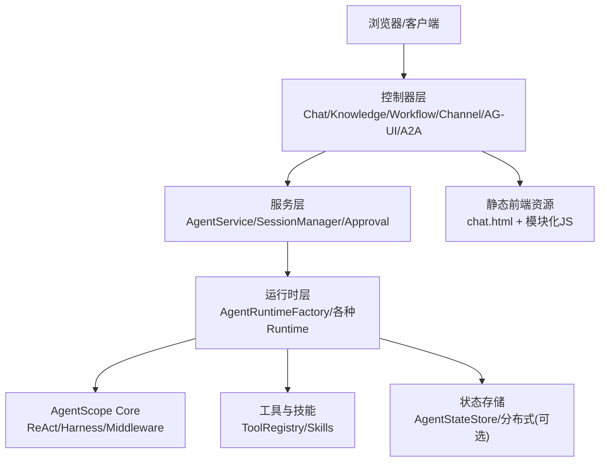
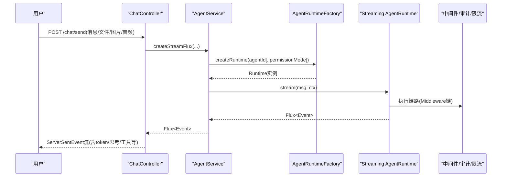
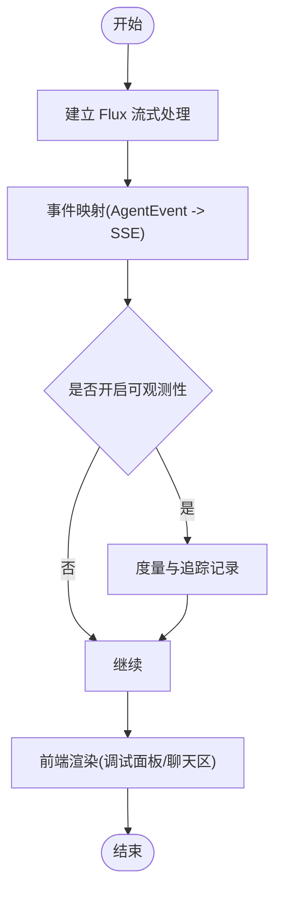

# 项目介绍和核心价值

<cite>
**本文引用的文件**   
- [README.md](file://README.md)
- [AGENTS.md](file://AGENTS.md)
- [pom.xml](file://pom.xml)
- [AgentScopeDemoApplication.java](file://src/main/java/com/skloda/agentscope/AgentScopeDemoApplication.java)
- [ChatController.java](file://src/main/java/com/skloda/agentscope/controller/ChatController.java)
- [AgentService.java](file://src/main/java/com/skloda/agentscope/service/AgentService.java)
- [AgentRuntimeFactory.java](file://src/main/java/com/skloda/agentscope/runtime/AgentRuntimeFactory.java)
- [AgentConfig.java](file://src/main/java/com/skloda/agentscope/agent/AgentConfig.java)
- [HarnessAgentFactory.java](file://src/main/java/com/skloda/agentscope/harness/HarnessAgentFactory.java)
- [SupervisorRuntime.java](file://src/main/java/com/skloda/agentscope/blackboard/SupervisorRuntime.java)
- [MiddlewareRegistry.java](file://src/main/java/com/skloda/agentscope/middleware/MiddlewareRegistry.java)
- [application.yml](file://src/main/resources/application.yml)
- [agents.yml](file://src/main/resources/config/agents.yml)
- [ROADMAP.md](file://ROADMAP.md)
</cite>

## 目录
1. [简介](#简介)
2. [项目结构](#项目结构)
3. [核心组件](#核心组件)
4. [架构总览](#架构总览)
5. [关键能力与亮点](#关键能力与亮点)
6. [企业级落地方案](#企业级落地方案)
7. [依赖与兼容性](#依赖与兼容性)
8. [性能与可观测性](#性能与可观测性)
9. [常见问题排查](#常见问题排查)
10. [结论](#结论)

## 简介
本项目是基于 AgentScope 2.0.2 GA 的 Java AI Agent 演示应用，围绕“快速构建企业级 AI Agent、统一管理多类型 Agent、编排复杂工作流”三大目标展开。通过声明式 Agent 配置、可视化调试面板、以及完整的企业特性（权限、审计、限流），提供开箱即用的多智能体协作、RAG 知识库、多模态交互与工具调用能力。该项目旨在降低 AI Agent 开发门槛，沉淀可复用的企业级模板，加速企业的数字化转型进程。

## 项目结构
- 入口应用：Spring Boot 应用启动并启用 Web 服务器初始化日志提示；绑定配置类，便于外部化配置注入。
- 控制层：SSE 流式聊天、文件上传/下载、飞书渠道、AG-UI、A2A 等端点集中在控制器中。
- 服务层：统一接入代理路由、会话管理、审批与服务治理，屏蔽具体 Runtime 差异。
- 运行时：按 Agent 类型动态构建 ReAct/Harness/工作流运行时；事件映射到前端 SSE 协议。
- 配置层：以 YAML 集中管理 Agent 定义、工具组、MCP 与中间件策略；支持 profile 裁剪。
- 前端：基于 Thymeleaf + 模块化 JS（chat.js 与各模块）与 SSE 进行双向事件交互。
- 知识/技能：内置通用 RAG、Docx/Pdf/Xlsx 解析、银行发票生成、MCP 客户端与多种 Skill。

图表来源
- [AgentScopeDemoApplication.java:11-35](file://src/main/java/com/skloda/agentscope/AgentScopeDemoApplication.java#L11-L35)
- [ChatController.java:44-153](file://src/main/java/com/skloda/agentscope/controller/ChatController.java#L44-L153)
- [AgentService.java:26-177](file://src/main/java/com/skloda/agentscope/service/AgentService.java#L26-L177)
- [AgentRuntimeFactory.java:21-127](file://src/main/java/com/skloda/agentscope/runtime/AgentRuntimeFactory.java#L21-L127)

章节来源
- [AgentScopeDemoApplication.java:11-35](file://src/main/java/com/skloda/agentscope/AgentScopeDemoApplication.java#L11-L35)
- [ChatController.java:44-153](file://src/main/java/com/skloda/agentscope/controller/ChatController.java#L44-L153)
- [AgentService.java:26-177](file://src/main/java/com/skloda/agentscope/service/AgentService.java#L26-L177)
- [AgentRuntimeFactory.java:21-127](file://src/main/java/com/skloda/agentscope/runtime/AgentRuntimeFactory.java#L21-L127)

## 核心组件
- 应用入口与启动监听：暴露运行端口与欢迎信息，自动装配配置。
- 控制器：处理 SSE 聊天消息、文件上传、审批回调、飞书 webhook、AG-UI 与 A2A 协议。
- 代理服务：统一创建流式 Flux，封装 session/权限/执行模式/多模态输入，并路由至 Harness/Supervisor/普通 Agent。
- 运行时工厂：根据 Agent 类型构建单一/路由/握手/图状态/消息中心/Harness/顺序/并行/辩论/循环/子 Agent 等运行时。
- 配置模型：Agent 配置包含基础属性、多智能体字段、共享黑板、路由策略、Harness 配置、MCP、Skill、中间件、权限、会话等。
- 黑板与监督者运行时：实现专家团队协同，维护会话级共享黑板与路由决策。
- 中间件注册：内置审计、限流、上下文增强、指标采集、OpenTelemetry 追踪等。

章节来源
- [AgentScopeDemoApplication.java:11-35](file://src/main/java/com/skloda/agentscope/AgentScopeDemoApplication.java#L11-L35)
- [ChatController.java:44-189](file://src/main/java/com/skloda/agentscope/controller/ChatController.java#L44-L189)
- [AgentService.java:26-177](file://src/main/java/com/skloda/agentscope/service/AgentService.java#L26-L177)
- [AgentRuntimeFactory.java:21-127](file://src/main/java/com/skloda/agentscope/runtime/AgentRuntimeFactory.java#L21-L127)
- [AgentConfig.java:11-186](file://src/main/java/com/skloda/agentscope/agent/AgentConfig.java#L11-L186)
- [SupervisorRuntime.java:29-100](file://src/main/java/com/skloda/agentscope/blackboard/SupervisorRuntime.java#L29-L100)
- [MiddlewareRegistry.java:12-55](file://src/main/java/com/skloda/agentscope/middleware/MiddlewareRegistry.java#L12-L55)

## 架构总览
整体采用分层解耦、事件驱动与响应式流式架构：
- 控制层仅负责协议适配与 SSE 包装。
- 服务层承载会话/权限/执行模式与策略路由。
- 运行时根据配置选择最合适的执行器，统一输出事件流。
- 前端通过 SSE 订阅事件，实现实时调试面板与对话体验。

图表来源
- [ChatController.java:117-153](file://src/main/java/com/skloda/agentscope/controller/ChatController.java#L117-L153)
- [AgentService.java:80-177](file://src/main/java/com/skloda/agentscope/service/AgentService.java#L80-L177)
- [AgentRuntimeFactory.java:41-127](file://src/main/java/com/skloda/agentscope/runtime/AgentRuntimeFactory.java#L41-L127)
- [MiddlewareRegistry.java:23-40](file://src/main/java/com/skloda/agentscope/middleware/MiddlewareRegistry.java#L23-L40)

## 关键能力与亮点
- 多类型 Agent 统一管理：单一聊天、工具调用、任务型、多模态、搜索、项目规划等，均以 YAML 声明式定义与扩展，无需改代码即可新增。
- 可视化调试面板：通过 SSE 事件将 LLM 调用、Token 使用、工具执行、思考过程与多智能体协作事件可视化呈现。
- 复杂工作流编排：提供顺序/并行/接力(Handoff)/图状态机/消息中心等模式，支持循环、辩论、子 Agent 串行或并行编排。
- 共享黑板与监督者：专家团队协作时通过共享黑板持久化上下文，监督者负责意图澄清与专家调度。
- Harness 高级特性：Docker 沙箱、Plan Mode、任务清单、分层记忆、技能自学习、上下文压缩、OTel 追踪。
- 多模态与 RAG：支持文本、图片、语音；内置本地知识索引、向量检索与问答能力。
- 企业级特性：权限控制（默认/探索/绕过等）、审计日志、细粒度限流、上下文增强与指标采集。

章节来源
- [README.md:1-169](file://README.md#L1-L169)
- [AGENTS.md:27-164](file://AGENTS.md#L27-L164)
- [AgentConfig.java:11-186](file://src/main/java/com/skloda/agentscope/agent/AgentConfig.java#L11-L186)
- [SupervisorRuntime.java:29-100](file://src/main/java/com/skloda/agentscope/blackboard/SupervisorRuntime.java#L29-L100)
- [HarnessAgentFactory.java:42-100](file://src/main/java/com/skloda/agentscope/harness/HarnessAgentFactory.java#L42-L100)

## 企业级落地方案
- 声明式 Agent 配置：通过 agents.yml 集中管理名称、描述、系统提示词、模型、流式开关、工具与技能，减少重复逻辑，提升可维护性。
- 权限与审批：在请求级注入 PermissionMode，配合 HITL 审批流程拦截危险操作，保障业务安全。
- 审计与限流：中间件注册器统一提供审计记录、流量限制、指标采集，便于合规与容量规划。
- 分布式能力：支持 Redis/MySQL/PostgreSQL 分布式 AgentStateStore（通过 profile 切换），满足跨实例会话一致性需求。
- 可扩展集成：原生支持 AG-UI、A2A、飞书 Channel 与 MCP 客户端，便于融入现有系统与平台。

章节来源
- [agents.yml:1-50](file://src/main/resources/config/agents.yml#L1-L50)
- [AgentConfig.java:91-186](file://src/main/java/com/skloda/agentscope/agent/AgentConfig.java#L91-L186)
- [MiddlewareRegistry.java:23-40](file://src/main/java/com/skloda/agentscope/middleware/MiddlewareRegistry.java#L23-L40)
- [application.yml:13-24](file://src/main/resources/application.yml#L13-L24)
- [p. pom.xml:104-160](file://pom.xml#L104-L160)

## 依赖与兼容性
- 技术栈：Spring Boot 3.5.14 + Java 17；AgentScope 2.0.2 GA。
- 核心依赖：
  - agentscope-spring-boot-starter/core
  - DashScope 模型 Provider（RC5 起已模块化）
  - Harness、RAG 扩展、分布式状态存储（Redis/MySQL/PostgreSQL）
  - 通道与协议扩展（飞书、AG-UI、A2A）
- 文档解析：Apache POI（DOCX/XLSX）、Apache PDFBox（PDF）。

章节来源
- [pom.xml:7-26](file://pom.xml#L7-L26)
- [pom.xml:28-188](file://pom.xml#L28-L188)
- [application.yml:25-42](file://src/main/resources/application.yml#L25-L42)

## 性能与可观测性
- 响应式流：控制器与服务端使用 Reactor Flux 直接返回 ServerSentEvent，减少阻塞与内存占用。
- 事件映射：统一的 AgentEventMapper 将 30+ 事件类型映射为前端可直接消费的 SSE 负载。
- 可观测性：开启审计与指标采集；支持 OpenTelemetry 追踪；可在调试面板观察 Token 用量与耗时。
- 上下文压缩与工具结果淘汰：在 Harness 模式中支持压缩与工具结果回收，避免上下文膨胀。
- 并发与隔离：专家 Agent 拥有独立的运行时上下文，避免相互污染，提升稳定性与性能。

图表来源
- [ChatController.java:77-153](file://src/main/java/com/skloda/agentscope/controller/ChatController.java#L77-L153)
- [AgentRuntimeFactory.java:182-195](file://src/main/java/com/skloda/agentscope/runtime/AgentRuntimeFactory.java#L182-L195)
- [MiddlewareRegistry.java:23-40](file://src/main/java/com/skloda/agentscope/middleware/MiddlewareRegistry.java#L23-L40)

章节来源
- [AGENTS.md:59-81](file://AGENTS.md#L59-L81)
- [application.yml:72-79](file://src/main/resources/application.yml#L72-L79)

## 常见问题排查
- 无法连接模型：检查环境变量 DASHSCOPE_API_KEY 与 application.yml 中的 provider/model-name/stream 配置。
- SSE 中断/报错：查看 ChatController 的错误恢复分支与日志；确保上游 agent runtime 未抛出异常。
- 审批流程无动作：确认 ApprovalService 中存在待处理审批项，并通过 /chat/approve 传递拒绝原因或放行。
- 权限导致工具被拒：核对 Agent 配置的 PermissionMode 与 denyTools/askTools 列表。
- 知识索引不生效：确认 knowledge.enabled、path 及 embedding-model、chunk-size 等参数；必要时重启触发自动索引。
- A2A/AG-UI/飞书未生效：检查对应 Profile（a2a/agui/feishu）与相关配置文件是否激活。

章节来源
- [ChatController.java:117-189](file://src/main/java/com/skloda/agentscope/controller/ChatController.java#L117-L189)
- [application.yml:25-80](file://src/main/resources/application.yml#L25-L80)

## 结论
AgentScope Demo 提供了一个全面展示 AgentScope 2.0 能力的工程化示例：从声明式配置、流式交互、多模态、RAG，到多智能体协作、Harness 高级能力与企业特性全覆盖。它有效降低了 Agent 开发与调试门槛，沉淀了可复用的企业级模板，帮助组织快速落地真实场景的智能化改造。无论是原型验证还是规模化生产，均可在该基础上快速演进与扩展。