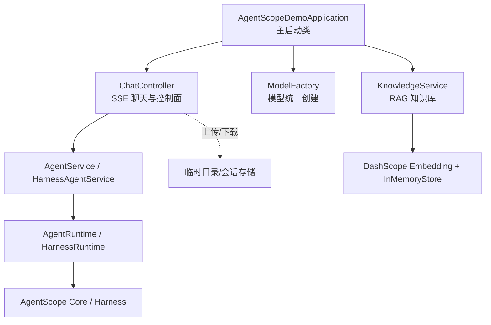
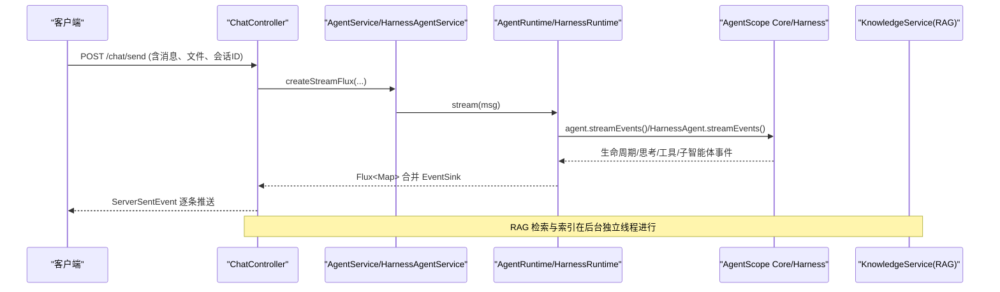
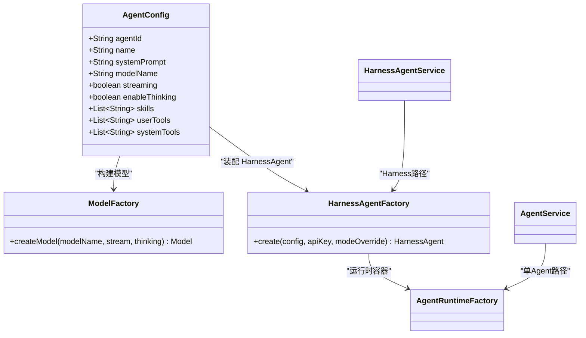
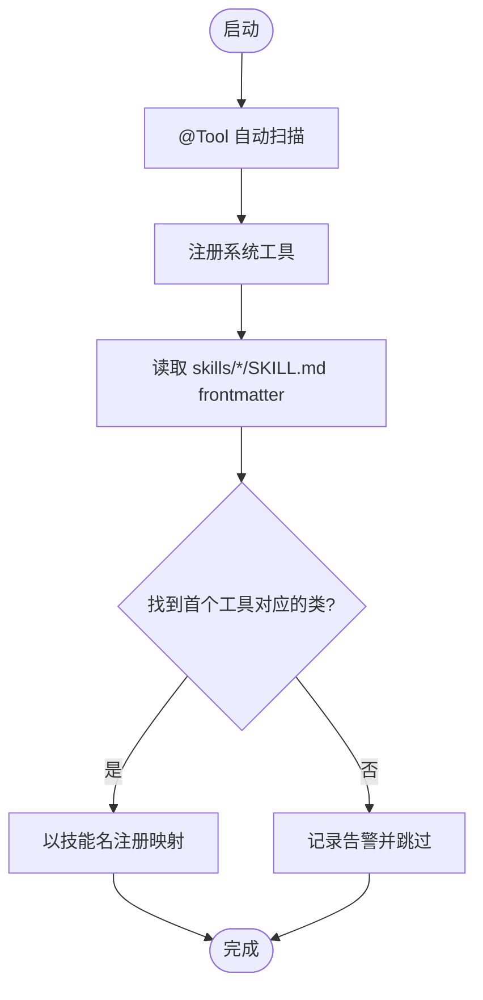
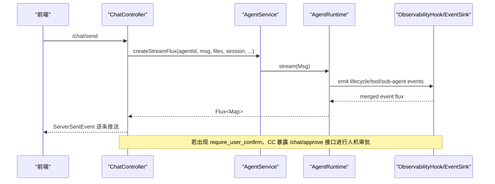
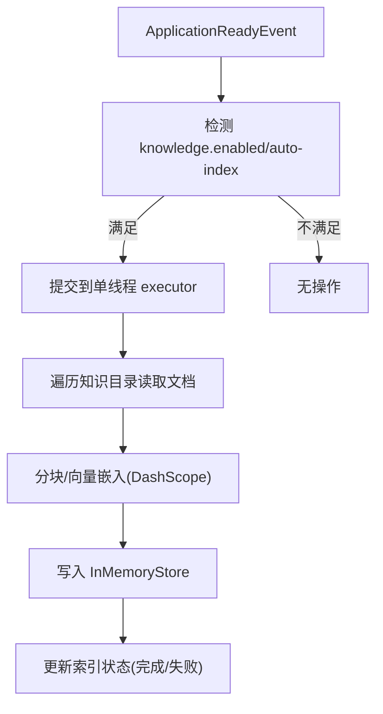
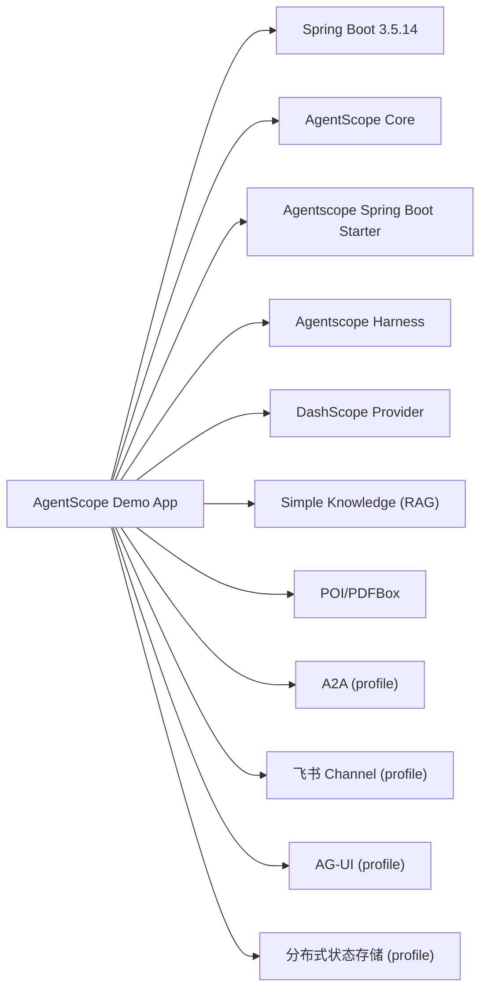

# 项目概览

<cite>
**本文引用的文件列表**
- [pom.xml](file://pom.xml)
- [README.md](file://README.md)
- [AGENTS.md](file://AGENTS.md)
- [AgentScopeDemoApplication.java](file://src/main/java/com/skloda/agentscope/AgentScopeDemoApplication.java)
- [application.yml](file://src/main/resources/application.yml)
- [ModelFactory.java](file://src/main/java/com/skloda/agentscope/model/ModelFactory.java)
- [agents.yml](file://src/main/resources/config/agents.yml)
- [AgentConfig.java](file://src/main/java/com/skloda/agentscope/agent/AgentConfig.java)
- [ToolRegistry.java](file://src/main/java/com/skloda/agentscope/tool/ToolRegistry.java)
- [KnowledgeService.java](file://src/main/java/com/skloda/agentscope/service/KnowledgeService.java)
- [ChatController.java](file://src/main/java/com/skloda/agentscope/controller/ChatController.java)
- [HarnessAgentFactory.java](file://src/main/java/com/skloda/agentscope/harness/HarnessAgentFactory.java)
</cite>

## 目录
1. [简介](#简介)
2. [项目结构](#项目结构)
3. [核心组件](#核心组件)
4. [架构总览](#架构总览)
5. [关键组件详解](#关键组件详解)
6. [依赖关系分析](#依赖关系分析)
7. [性能与扩展性](#性能与扩展性)
8. [故障排查与常见问题](#故障排查与常见问题)
9. [结论](#结论)
10. [附录：快速开始与部署](#附录快速开始与部署)

## 简介
AgentScope Demo 是基于 AgentScope 2.0.2 GA 的 Java AI Agent 演示项目，以 Spring Boot 3.5.14 + Java 17 构建。项目演示了多种 Agent 能力（基础对话、工具调用、任务处理、文档解析、多模态交互）、RAG 知识库增强、以及通过 Harness、MCP、A2A、AG-UI、飞书渠道等特性构成的企业级智能体方案。前端提供赛博朋克风格 UI，支持流式 SSE 对话、调试面板、知识索引状态展示、审批流程（HITL）和多会话管理。

本项目的核心价值在于：
- 以最小成本体验 AgentScope 全栈能力：ReAct Agent、多 Agent 协作、技能体系、记忆压缩、结构化输出、可观测性与权限控制。
- 提供一套开箱即用的示例工作流：银行发票生成、文档解析、RAG 问答、视觉/语音多模态等。
- 面向生产化的能力：分布式 AgentStateStore、A2A 互操作、IM 渠道接入、SSE 流式响应、中间件（审计、限流、指标）。

## 项目结构
项目采用典型的 Spring Boot 分层组织：
- controller：对外暴露 HTTP/SSE 接口
- service：业务编排与服务
- agent：Agent 配置与工厂
- runtime：运行时容器与事件映射
- harness：HarnessAgent 装配器（企业级模式）
- tool：工具注册与扫描
- config：按 profile 启用可选扩展（A2A、Feishu、Agui、分布式状态存储）
- resources：静态页面、模板、YAML 配置、技能定义、示例工作区模板

下图为项目核心模块与入口的关系视图：

**图表来源**
- [AgentScopeDemoApplication.java:11-35](file://src/main/java/com/skloda/agentscope/AgentScopeDemoApplication.java#L11-L35)
- [ChatController.java:44-153](file://src/main/java/com/skloda/agentscope/controller/ChatController.java#L44-L153)
- [ModelFactory.java:21-56](file://src/main/java/com/skloda/agentscope/model/ModelFactory.java#L21-L56)
- [KnowledgeService.java:39-89](file://src/main/java/com/skloda/agentscope/service/KnowledgeService.java#L39-L89)

**章节来源**
- [pom.xml:7-26](file://pom.xml#L7-L26)
- [AGENTS.md:25-81](file://AGENTS.md#L25-L81)

## 核心组件
- 模型工厂 ModelFactory：统一通过 ModelRegistry 创建模型，自动补齐 provider 前缀，注入 API Key、流式开关、思考模式等上下文。
- Agent 配置 AgentConfig：描述单 Agent 或复合 Agent 的所有属性，包括系统提示词、模型、工具清单、技能、审批、中间件、MCP、分组路由/黑板等。
- 工具注册 ToolRegistry：三阶段完成工具注册（@Tool 自动扫描、内置系统工具、从 SKILL.md frontmatter 动态绑定），使“技能名”可直接作为工具使用。
- 运行环境 Runtime：AgentRuntime/HarnessRuntime 封装 AgentScope 的 ReAct/HarnessAgent 运行生命周期，并复用统一的 EventSink/AgentEventMapper，实现一致的 SSE 事件流。
- 知识库 KnowledgeService：基于 DashScope 文本嵌入和 SimpleKnowledge（InMemoryStore）构建 RAG；应用启动后后台线程自动索引本地 knowledge 目录；支持上传文档实时入仓与状态查询。
- HarnessAgentFactory：根据 YAML 中的 HarnessConfig 组装完整的企业级 Agent（Docker 沙箱、Plan Mode、Task List、Layered Memory、Skill Repo、Permission Context 等）。

**章节来源**
- [ModelFactory.java:13-94](file://src/main/java/com/skloda/agentscope/model/ModelFactory.java#L13-L94)
- [AgentConfig.java:13-186](file://src/main/java/com/skloda/agentscope/agent/AgentConfig.java#L13-L186)
- [ToolRegistry.java:23-44,71-107,123-199](file://src/main/java/com/skloda/agentscope/tool/ToolRegistry.java#L23-L44)
- [ToolRegistry.java:71-107](file://src/main/java/com/skloda/agentscope/tool/ToolRegistry.java#L71-L107)
- [ToolRegistry.java:123-199](file://src/main/java/com/skloda/agentscope/tool/ToolRegistry.java#L123-L199)
- [KnowledgeService.java:39-89,91-138,140-196](file://src/main/java/com/skloda/agentscope/service/KnowledgeService.java#L39-L89)
- [KnowledgeService.java:91-138](file://src/main/java/com/skloda/agentscope/service/KnowledgeService.java#L91-L138)
- [KnowledgeService.java:140-196](file://src/main/java/com/skloda/agentscope/service/KnowledgeService.java#L140-L196)
- [HarnessAgentFactory.java:22-200](file://src/main/java/com/skloda/agentscope/harness/HarnessAgentFactory.java#L22-L200)

## 架构总览
AgentScope Demo 的架构围绕“请求—编排—执行—流式反馈”展开：前端或外部渠道调用 Controller，控制器根据 AgentId 选择对应 Agent 并建立 SSE 流，底层经由 AgentRuntime/HarnessRuntime 驱动 AgentScope 内核，将生命周期事件、工具调用、子智能体协作、权限审批、计划与任务等信息以统一事件类型返回前端。RAG 模块与应用启动时后台索引联动，工具由 ToolRegistry 自动发现并挂载。

**图表来源**
- [ChatController.java:117-153](file://src/main/java/com/skloda/agentscope/controller/ChatController.java#L117-L153)
- [AGENTS.md:59-81](file://AGENTS.md#L59-L81)
- [KnowledgeService.java:91-138](file://src/main/java/com/skloda/agentscope/service/KnowledgeService.java#L91-L138)

## 关键组件详解

### Agent 配置与工厂链
- 配置来源：resources/config/agents.yml 和 harness-agents.yml
- 加载顺序：AgentConfigService → AgentFactory / HarnessAgentFactory → AgentRuntimeFactory → AgentService/HarnessAgentService（实例缓存）
- 单 Agent 与 Harness Agent：前者走标准 ReActAgent 流；后者通过 HarnessAgentFactory 装配企业级能力（沙箱、记忆、计划、任务清单、权限、技能仓库等）

**图表来源**
- [agents.yml:1-200](file://src/main/resources/config/agents.yml#L1-L200)
- [AgentConfig.java:13-186](file://src/main/java/com/skloda/agentscope/agent/AgentConfig.java#L13-L186)
- [ModelFactory.java:13-94](file://src/main/java/com/skloda/agentscope/model/ModelFactory.java#L13-L94)
- [HarnessAgentFactory.java:22-200](file://src/main/java/com/skloda/agentscope/harness/HarnessAgentFactory.java#L22-L200)

**章节来源**
- [AGENTS.md:25-81](file://AGENTS.md#L25-L81)
- [agents.yml:1-200](file://src/main/resources/config/agents.yml#L1-L200)
- [AgentConfig.java:13-186](file://src/main/java/com/skloda/agentscope/agent/AgentConfig.java#L13-L186)
- [HarnessAgentFactory.java:22-200](file://src/main/java/com/skloda/agentscope/harness/HarnessAgentFactory.java#L22-L200)

### 工具注册与技能体系
- @Tool 注解方法将被自动扫描并注册，同时框架内置的文件/编码/Shell 工具也一并注册。
- SKILL.md 的 frontmatter 声明“技能→工具”的映射，使 Agent 可通过 skill 名称直接触发一组工具，降低配置复杂度。

**图表来源**
- [ToolRegistry.java:23-44](file://src/main/java/com/skloda/agentscope/tool/ToolRegistry.java#L23-L44)
- [ToolRegistry.java:71-107](file://src/main/java/com/skloda/agentscope/tool/ToolRegistry.java#L71-L107)
- [ToolRegistry.java:153-199](file://src/main/java/com/skloda/agentscope/tool/ToolRegistry.java#L153-L199)

**章节来源**
- [ToolRegistry.java:23-44](file://src/main/java/com/skloda/agentscope/tool/ToolRegistry.java#L23-L44)
- [ToolRegistry.java:71-107](file://src/main/java/com/skloda/agentscope/tool/ToolRegistry.java#L71-L107)
- [ToolRegistry.java:153-199](file://src/main/java/com/skloda/agentscope/tool/ToolRegistry.java#L153-L199)

### 聊天与会话流式交互（SSE + HITL）
- ChatController 接收消息并返回 Flux<ServerSentEvent<String>>，内部通过 AgentService 获取/创建流并进行事件转换。
- 审批流程：遇到 RequireUserConfirmEvent 时会暂停并等待前端批准/拒绝，批准后恢复执行。

**图表来源**
- [ChatController.java:44-186](file://src/main/java/com/skloda/agentscope/controller/ChatController.java#L44-L186)
- [AGENTS.md:59-81](file://AGENTS.md#L59-L81)

**章节来源**
- [ChatController.java:44-186](file://src/main/java/com/skloda/agentscope/controller/ChatController.java#L44-L186)
- [AGENTS.md:59-81](file://AGENTS.md#L59-L81)

### RAG 知识库（Generic 模式 + 本地索引）
- 应用启动后，KnowledgeService 在后台线程扫描 src/main/resources/knowledge 并异步向量化入库。
- 支持上传 PDF/DOCX/TXT/MD 等，内部按文件类型选择 Reader 切片，再添加到 SimpleKnowledge 的 InMemoryStore。
- 提供快照接口查询索引状态与文档进度。

**图表来源**
- [KnowledgeService.java:91-138](file://src/main/java/com/skloda/agentscope/service/KnowledgeService.java#L91-L138)
- [KnowledgeService.java:140-196](file://src/main/java/com/skloda/agentscope/service/KnowledgeService.java#L140-L196)

**章节来源**
- [KnowledgeService.java:39-89](file://src/main/java/com/skloda/agentscope/service/KnowledgeService.java#L39-L89)
- [KnowledgeService.java:91-138](file://src/main/java/com/skloda/agentscope/service/KnowledgeService.java#L91-L138)
- [KnowledgeService.java:140-196](file://src/main/java/com/skloda/agentscope/service/KnowledgeService.java#L140-L196)

### 企业级特性与扩展点
- Harness 模式：Docker 沙箱、Layered Memory、Plan Mode、Task List、Skill Repository、Permission Context、Compaction、Context Files 等（详见 HarnessAgentFactory）。
- A2A 协议：通过 a2a server/client starter 暴露 AgentCard、JSON-RPC 接口（profile: a2a）。
- 飞书渠道：Webhook 接入 IM 消息（profile: feishu）。
- AG-UI 协议：/ag-ui/run SSE 端点（profile: agui）。
- 可观测性与中间件：ObservabilityHook、审计日志、限流、指标采集、权限上下文等。

**章节来源**
- [HarnessAgentFactory.java:22-200](file://src/main/java/com/skloda/agentscope/harness/HarnessAgentFactory.java#L22-L200)
- [AGENTS.md:59-81](file://AGENTS.md#L59-L81)

## 依赖关系分析
项目依赖聚焦于 AgentScope 生态与 Spring Boot：
- 核心：agentscope-core、agentscope-spring-boot-starter、agentscope-harness
- 模型：agentscope-extensions-model-dashscope（按 RC5+ 模块化拆分）
- RAG：agentscope-extensions-rag-simple
- 长时记忆（旧版兼容）：agentscope-extensions-memory-bailian
- 扩展特性（按 profile 启用）：
  - A2A：a2a-server/a2a-client + spring boot starter
  - 飞书 Channel：channel-common/channel-feishu
  - AG-UI：extensions-agui + spring boot starter
  - 分布式状态存储：redis/mysql/postgresql extensions + jdbc driver
- 文档解析：Apache POI（docx/xlsx）、PDFBox（pdf）
- Web 与视图：spring-boot-starter-web、thymeleaf

**图表来源**
- [pom.xml:28-188](file://pom.xml#L28-L188)

**章节来源**
- [pom.xml:20-188](file://pom.xml#L20-L188)

## 性能与扩展性
- 流式响应：基于 Reactor 的 Flux + SSE，低延迟推送到前端，提升交互体验与资源利用率。
- 事件归一化：统一的事件映射（30+ 事件类型）便于监控与前端渲染，减少耦合。
- 异步索引：RAG 索引在后台独立线程进行，不影响在线服务可用性；InMemoryStore 适合演示与中小规模数据。
- 可扩展点：
  - 通过 AgentConfig/agents.yml 即可新增 Agent、工具与技能。
  - 通过 @Profile 按需启用 A2A/飞书/AG-UI/分布式状态存储等。
  - 通过中间件链路加入审计、限流、指标等横切关注点。

[本节为通用指导，无需特定文件引用]

## 故障排查与常见问题
- API Key 缺失：模型创建会回退至环境变量；如未设置，将无法连接 DashScope。请在 application.yml 或通过环境变量配置 DASHSCOPE_API_KEY。
- RAG 索引失败：检查支持的文件类型与路径，参考知识库服务的错误日志与索引状态。
- 工具未生效：确认 @Tool 注解与方法名正确，且在 ToolRegistry 的包内可扫描；或通过 SKILL.md frontmatter 正确绑定。
- 审批卡住：如遇 require_user_confirm，需通过 /chat/approve 传入 approvalId 和是否批准的决策。

**章节来源**
- [application.yml:25-42](file://src/main/resources/application.yml#L25-L42)
- [KnowledgeService.java:140-178](file://src/main/java/com/skloda/agentscope/service/KnowledgeService.java#L140-L178)
- [ChatController.java:155-186](file://src/main/java/com/skloda/agentscope/controller/ChatController.java#L155-L186)

## 结论
AgentScope Demo 提供了从零到一的 Agent 开发样板，覆盖端到端的对话、工具、知识库、多模态与企业级编排。通过清晰的分层与可扩展的配置文件，开发者可以低成本迭代自己的业务场景，并在需要时平滑迁移到更强大的 Harness/A2A/管道化编排等企业能力。

[本节为总结性内容，无需特定文件引用]

## 附录：快速开始与部署
- 环境要求：Java 17、Maven、DashScope API Key。
- 启动方式：
  - 设置环境变量 DASHSCOPE_API_KEY=your_key
  - mvn spring-boot:run
- 访问地址：应用默认端口可在 application.yml 中配置（例如 8081）。
- 构建与分发：也可打包成可执行 Jar/Docker 镜像并按需注入环境变量运行。
- 关键入口：
  - 聊天对话：GET / （前端页面），POST /chat/send（SSE 流）
  - 文件上传：POST /chat/upload
  - RAG 管理：KnowledgeService 提供本地目录索引与上传入库

**章节来源**
- [README.md:63-93](file://README.md#L63-L93)
- [AGENTS.md:9-23](file://AGENTS.md#L9-L23)
- [application.yml:3-12](file://src/main/resources/application.yml#L3-L12)